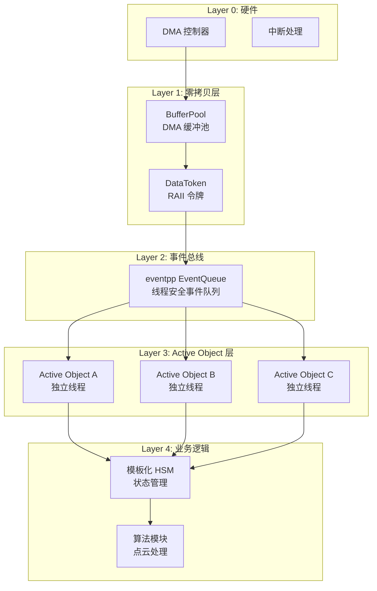
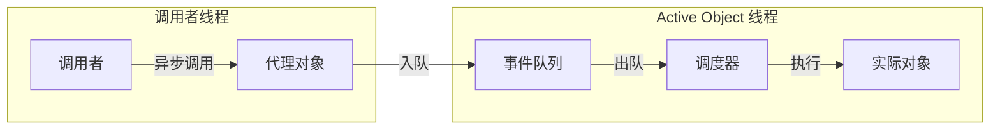
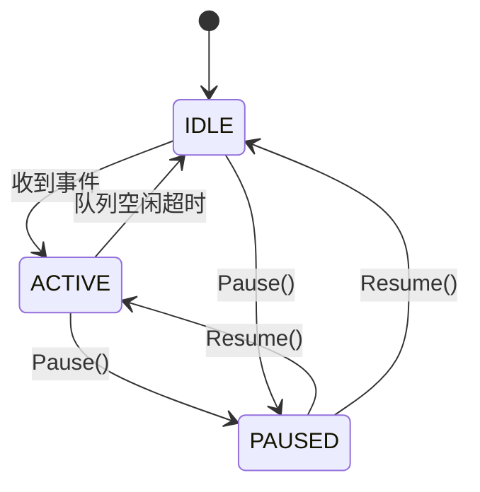
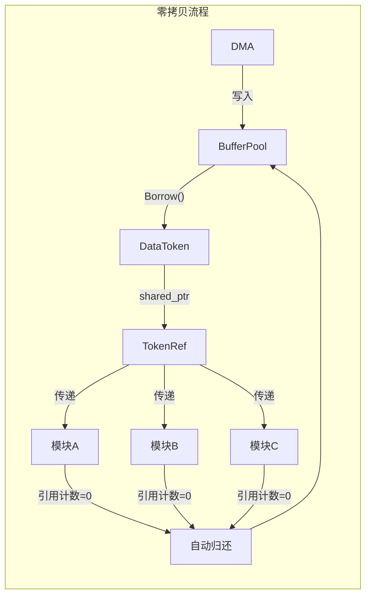
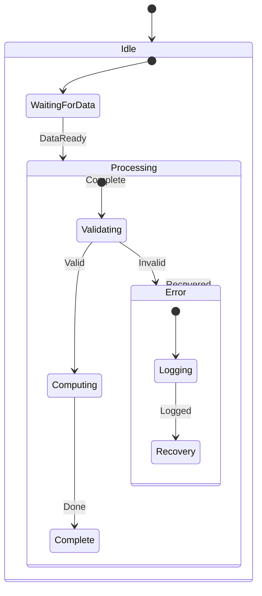

# 流式架构设计文档

## 1. 架构概述

本项目基于 **eventpp + Active Object** 模式，实现高性能嵌入式流式数据处理架构。

### 1.1 核心技术栈

| 组件 | 技术选型 | 作用 |
|------|----------|------|
| 事件队列 | eventpp::EventQueue | 高性能线程安全事件分发 |
| 并发模型 | Active Object 模式 | 每组件独立线程，消息驱动 |
| 内存管理 | RAII DataToken | 零拷贝数据共享 |
| 状态管理 | 模板化 HSM | 编译期优化状态机 |
| 缓存优化 | alignas(64) | 防止伪共享 |

### 1.2 架构全景图



---

## 2. 为什么选择 eventpp？

### 2.1 eventpp 简介

[eventpp](https://github.com/wqking/eventpp) 是一个高性能 C++ 事件库，提供：

- **EventQueue**：线程安全的事件队列
- **EventDispatcher**：同步事件分发器
- **CallbackList**：回调列表管理

### 2.2 eventpp 核心优势

#### 优势 1：高性能事件队列

```cpp
// eventpp 使用优化的内部队列实现
eventpp::EventQueue<uint32_t, void(const EventPayload&)> queue;

// 生产者：线程安全入队
queue.enqueue(EventID::kDataReady, payload);

// 消费者：批量处理
queue.process();  // 处理所有待处理事件
```

**性能特点**：
- 内部使用高效的队列实现
- 支持批量处理，减少函数调用开销
- 线程安全，支持多生产者

#### 优势 2：类型安全的事件系统

```cpp
// 编译期类型检查
using EventQueue = eventpp::EventQueue<
    uint32_t,                           // 事件 ID 类型
    void(const EventPayload&)           // 回调签名
>;

// 类型不匹配会编译报错
queue.appendListener(EventID::kData, [](const EventPayload& e) {
    // 类型安全的事件处理
});
```

#### 优势 3：灵活的事件过滤

```cpp
// 支持事件过滤器
queue.appendListener(EventID::kData,
    [](const EventPayload& e) {
        // 只处理特定条件的事件
    },
    eventpp::argumentPassingIncludeEvent  // 包含事件 ID
);
```

#### 优势 4：成熟稳定

| 指标 | 数据 |
|------|------|
| GitHub Stars | 2000+ |
| 维护状态 | 活跃维护 |
| 文档质量 | 完善 |
| 测试覆盖 | 完整单元测试 |
| 许可证 | Apache 2.0 |

### 2.3 eventpp vs 其他方案

| 特性 | eventpp | std::queue + mutex | std::condition_variable |
|------|---------|-------------------|------------------------|
| 线程安全 | ✅ 内置 | ❌ 需手动加锁 | ❌ 需手动实现 |
| 性能 | ⭐⭐⭐⭐⭐ | ⭐⭐⭐ | ⭐⭐⭐ |
| 依赖 | Header-only | 标准库 | 标准库 |
| 事件过滤 | ✅ 支持 | ❌ 不支持 | ❌ 不支持 |
| 批量处理 | ✅ process() | ❌ 需手动实现 | ❌ 需手动实现 |
| 学习曲线 | 低 | 低 | 中 |

---

## 3. Active Object 模式详解

### 3.1 什么是 Active Object？

Active Object 是一种并发设计模式，将**方法调用**与**方法执行**解耦：



### 3.2 本架构的 Active Object 实现

```cpp
/**
 * @brief Active Object 基类
 *
 * 每个 Active Object 拥有：
 * - 独立的事件队列 (eventpp::EventQueue)
 * - 独立的工作线程
 * - 自适应等待策略
 */
class ActiveObject {
public:
    // 异步发送事件（线程安全）
    void PostEvent(uint32_t event_id, EventPayload payload);

    // 启动工作线程
    void Start();

    // 停止工作线程
    void Stop();

private:
    // eventpp 事件队列（缓存行对齐）
    alignas(64) eventpp::EventQueue<uint32_t, void(const EventPayload&)> event_queue_;

    // 工作线程
    std::thread worker_thread_;

    // 状态管理
    alignas(64) std::atomic<ActiveObjectState> state_;
};
```

### 3.3 Active Object 优势

#### 优势 1：线程隔离

```
┌─────────────────────────────────────────────────────────────┐
│                      系统架构                                │
├─────────────────────────────────────────────────────────────┤
│  ┌─────────────┐  ┌─────────────┐  ┌─────────────┐         │
│  │ AO: Sensor  │  │ AO: Process │  │ AO: Output  │         │
│  │ ─────────── │  │ ─────────── │  │ ─────────── │         │
│  │ Thread #1   │  │ Thread #2   │  │ Thread #3   │         │
│  │ Queue #1    │  │ Queue #2    │  │ Queue #3    │         │
│  └─────────────┘  └─────────────┘  └─────────────┘         │
│         │                │                │                 │
│         └────────────────┼────────────────┘                 │
│                          │                                  │
│                   事件消息传递                               │
│                  （无共享状态）                              │
└─────────────────────────────────────────────────────────────┘
```

**好处**：
- 每个组件独立线程，无锁竞争
- 组件间通过消息通信，无共享状态
- 故障隔离，一个组件崩溃不影响其他组件

#### 优势 2：自适应等待策略

```cpp
enum class ActiveObjectState : uint8_t {
    IDLE,      // 空闲：条件变量等待，零 CPU
    ACTIVE,    // 活跃：忙轮询，最低延迟
    PAUSED     // 暂停：停止处理
};
```



**自适应策略**：
- **空闲时**：条件变量等待，CPU 使用率 0%
- **繁忙时**：忙轮询处理，延迟最低
- **过渡期**：自动切换，平衡性能和功耗

#### 优势 3：可测试性

```cpp
// 单元测试：同步处理事件
TEST(ActiveObjectTest, ProcessEvent) {
    TestActiveObject ao;
    ao.PostEvent(EventID::kTest, payload);

    // 同步处理（测试模式）
    ao.ProcessAllEvents();

    // 验证结果
    EXPECT_EQ(ao.GetProcessedCount(), 1);
}
```

### 3.4 缓存行对齐优化

```cpp
class ActiveObject {
private:
    // 缓存行对齐，防止伪共享
    alignas(64) EventQueue event_queue_;      // 64 字节对齐
    alignas(64) std::atomic<bool> running_;   // 独立缓存行
    alignas(64) std::atomic<State> state_;    // 独立缓存行
};
```

**为什么需要 alignas(64)？**

```
┌─────────────────────────────────────────────────────────────┐
│                    CPU 缓存行 (64 bytes)                     │
├─────────────────────────────────────────────────────────────┤
│  ❌ 无对齐：多个变量共享缓存行                               │
│  ┌──────────────────────────────────────────────────────┐   │
│  │ running_ │ state_ │ counter_ │ ... (其他变量)        │   │
│  └──────────────────────────────────────────────────────┘   │
│  → 线程 A 修改 running_，线程 B 的 state_ 缓存失效！        │
│  → 伪共享 (False Sharing)，性能下降 10-50%                  │
├─────────────────────────────────────────────────────────────┤
│  ✅ 有对齐：每个变量独占缓存行                               │
│  ┌────────────────────┐  ┌────────────────────┐            │
│  │ running_ (64B)     │  │ state_ (64B)       │            │
│  └────────────────────┘  └────────────────────┘            │
│  → 线程 A 修改 running_，不影响线程 B 的 state_             │
│  → 无伪共享，性能最优                                       │
└─────────────────────────────────────────────────────────────┘
```

---

## 4. 零拷贝设计：DataToken

### 4.1 传统方式的问题

```cpp
// ❌ 传统方式：每层都要拷贝
void Driver::OnData(const uint8_t* data, size_t len) {
    std::vector<uint8_t> copy(data, data + len);  // 拷贝 1
    middleware.Process(copy);
}

void Middleware::Process(const std::vector<uint8_t>& data) {
    std::vector<uint8_t> copy = data;  // 拷贝 2
    algorithm.Compute(copy);
}

void Algorithm::Compute(const std::vector<uint8_t>& data) {
    std::vector<uint8_t> copy = data;  // 拷贝 3
    // 处理...
}

// 1MB 数据 × 3 次拷贝 × 100Hz = 300MB/s 内存带宽浪费！
```

### 4.2 本架构的解决方案

```cpp
// ✅ 本架构：RAII 令牌，零拷贝共享
class DataToken {
public:
    // 禁止拷贝，只能移动
    DataToken(const DataToken&) = delete;
    DataToken& operator=(const DataToken&) = delete;
    DataToken(DataToken&&) noexcept = default;

    // 直接访问数据
    uint8_t* data() noexcept { return buffer_; }
    size_t size() const noexcept { return size_; }

private:
    uint8_t* buffer_;      // 指向 DMA 缓冲区
    size_t size_;
    BufferPool* pool_;     // 归还目标

    // RAII：析构时自动归还
    ~DataToken() { pool_->Return(buffer_); }
};

// 多消费者共享
using TokenRef = std::shared_ptr<DataToken>;
```

### 4.3 零拷贝数据流



**关键点**：
- 数据始终在 DMA 缓冲区，不拷贝
- TokenRef (shared_ptr) 实现多消费者共享
- RAII 自动管理生命周期，无内存泄漏

---

## 5. 模板化 HSM（层次状态机）

### 5.1 为什么用模板化？

```cpp
// ❌ 传统虚函数方式：运行时开销
class State {
    virtual void OnEntry() = 0;   // 虚函数表查找
    virtual void OnEvent() = 0;   // 间接调用
};

// ✅ 模板化方式：编译期优化
template<typename Context>
class State {
    std::function<void(Context&)> on_entry_;  // 可内联
    std::function<void(Context&, const Event&)> on_event_;
};
```

### 5.2 HSM 架构



### 5.3 HSM 使用示例

```cpp
// 定义状态机
class SensorStateMachine {
public:
    void Initialize() {
        // 定义状态
        auto idle = hsm_.AddState("Idle");
        auto processing = hsm_.AddState("Processing");
        auto error = hsm_.AddState("Error");

        // 定义转换
        idle->AddTransition(EventID::kDataReady, processing);
        processing->AddTransition(EventID::kComplete, idle);
        processing->AddTransition(EventID::kError, error);
        error->AddTransition(EventID::kRecovered, idle);

        // 设置入口/出口动作
        processing->SetOnEntry([this](auto& ctx) {
            StartProcessing();
        });
    }

private:
    HSM<SensorContext> hsm_;
};
```

---

## 6. 性能分析

### 6.1 eventpp 基准测试

> 详细数据请参考 [性能基准测试](Performance_Benchmark.md)

| 测试场景 | 消息数量 | 吞吐量 | 平均延迟 |
|---------|---------|--------|---------|
| Raw eventpp (值语义) | 1K-1M | 12-20 M/s | 50-80 ns |
| Active Object 封装 | 1K-1M | 10-13 M/s | 80-100 ns |

### 6.2 性能优化点

| 优化技术 | 作用 | 预期收益 |
|----------|------|----------|
| eventpp 批量处理 | 减少函数调用 | 吞吐量提升 |
| alignas(64) 对齐 | 防止伪共享 | 多线程性能提升 |
| TokenRef 零拷贝 | 减少内存拷贝 | 带宽节省 |
| 模板化 HSM | 编译期优化 | 状态切换加速 |
| 自适应等待 | 平衡性能/功耗 | CPU 利用率优化 |

### 6.3 内存布局优化

```cpp
// 优化前：随机布局
struct BadLayout {
    bool flag;           // 1 byte
    uint64_t counter;    // 8 bytes (需要 8 字节对齐，浪费 7 bytes)
    bool active;         // 1 byte
    uint32_t id;         // 4 bytes (需要 4 字节对齐，浪费 3 bytes)
};  // 总大小：24 bytes（浪费 10 bytes）

// 优化后：按大小排列
struct GoodLayout {
    uint64_t counter;    // 8 bytes
    uint32_t id;         // 4 bytes
    bool flag;           // 1 byte
    bool active;         // 1 byte
    // padding: 2 bytes
};  // 总大小：16 bytes（仅浪费 2 bytes）
```

---

## 7. 适用场景

### 7.1 最佳适用 ✅

| 场景 | 原因 |
|------|------|
| **高速传感器** (LiDAR 100Hz, 相机 60fps) | 零拷贝处理大数据流 |
| **实时控制** (机器人, 无人机) | Active Object 低延迟 |
| **多核系统** | 每个 AO 独立线程，充分利用多核 |
| **复杂状态逻辑** | HSM 清晰管理状态转换 |
| **需要故障隔离** | AO 线程隔离，故障不扩散 |

### 7.2 不适用 ❌

| 场景 | 原因 | 替代方案 |
|------|------|----------|
| **极致低延迟** (<1μs) | AO 有线程切换开销 | 无锁单线程 |
| **海量并发连接** | 每 AO 一个线程，资源消耗大 | 协程/异步 IO |
| **简单单线程应用** | AO 架构过重 | 直接函数调用 |

---

## 8. 代码示例

### 8.1 创建 Active Object

```cpp
#include "active_object.hpp"
#include "event_payload.hpp"

class SensorActiveObject : public ActiveObject {
public:
    SensorActiveObject() {
        // 注册事件处理器
        RegisterHandler(EventID::kDataReady,
            [this](const EventPayload& e) {
                OnDataReady(e);
            });

        RegisterHandler(EventID::kShutdown,
            [this](const EventPayload& e) {
                OnShutdown(e);
            });
    }

private:
    void OnDataReady(const EventPayload& e) {
        auto token = e.GetData<TokenRef>();
        ProcessData(token);
    }

    void OnShutdown(const EventPayload& e) {
        Cleanup();
        Stop();
    }
};
```

### 8.2 使用 DataToken

```cpp
#include "data_token.hpp"
#include "buffer_pool.hpp"

void ProcessSensorData() {
    // 从缓冲池借用
    BufferPool pool(1024 * 1024, 10);  // 1MB × 10 缓冲区

    // 获取令牌
    auto token = pool.Borrow();

    // 填充数据（DMA 或手动）
    memcpy(token->data(), sensor_data, data_size);

    // 创建共享引用
    TokenRef ref = std::make_shared<DataToken>(std::move(token));

    // 传递给多个消费者（零拷贝）
    processor1.PostEvent(EventID::kData, ref);
    processor2.PostEvent(EventID::kData, ref);
    processor3.PostEvent(EventID::kData, ref);

    // ref 析构时，如果引用计数为 0，自动归还缓冲区
}
```

### 8.3 使用 HSM

```cpp
#include "state_machine.hpp"

class RobotController {
public:
    void Initialize() {
        // 创建状态
        auto idle = hsm_.CreateState("Idle");
        auto moving = hsm_.CreateState("Moving");
        auto stopped = hsm_.CreateState("Stopped");

        // 设置转换
        idle->AddTransition(Event::kStart, moving);
        moving->AddTransition(Event::kObstacle, stopped);
        moving->AddTransition(Event::kDestReached, idle);
        stopped->AddTransition(Event::kClear, moving);

        // 设置动作
        moving->SetOnEntry([this](auto&) { StartMotors(); });
        moving->SetOnExit([this](auto&) { StopMotors(); });
        stopped->SetOnEntry([this](auto&) { EmergencyBrake(); });

        hsm_.SetInitialState(idle);
    }

    void ProcessEvent(const Event& e) {
        hsm_.ProcessEvent(e);
    }

private:
    HSM<RobotContext> hsm_;
};
```

---

## 9. 与其他架构对比

### 9.1 vs 传统多线程

| 特性 | 传统多线程 | eventpp + Active Object |
|------|-----------|------------------------|
| 线程模型 | 共享内存 + 锁 | 消息传递，无共享状态 |
| 数据传递 | memcpy 或锁保护 | 零拷贝 TokenRef |
| 调试难度 | 高（竞态条件） | 低（确定性执行） |
| 可测试性 | 低（时序依赖） | 高（可同步测试） |
| 故障隔离 | 差（共享状态） | 好（线程隔离） |

### 9.2 vs 无锁单线程

| 特性 | 无锁单线程 | eventpp + Active Object |
|------|-----------|------------------------|
| 延迟 | 最低 (<1μs) | 低 (~10μs) |
| 吞吐量 | 高 | 高 |
| 多核利用 | 差（单线程） | 好（多 AO 多线程） |
| 代码复杂度 | 高（手动调度） | 低（框架支持） |
| 可维护性 | 低 | 高 |

---

## 10. 总结

### 10.1 架构优势

| 优势 | 实现方式 |
|------|----------|
| **高性能** | eventpp 高效事件队列 + 批量处理 |
| **低延迟** | Active Object 消息驱动 + 自适应等待 |
| **零拷贝** | RAII DataToken + shared_ptr |
| **可维护** | 模块化设计 + 清晰的状态机 |
| **可测试** | 确定性执行 + 同步测试模式 |
| **多核友好** | 每 AO 独立线程 + 缓存行对齐 |

### 10.2 设计原则

1. **消息传递优于共享内存**：避免锁竞争
2. **RAII 管理资源**：自动内存管理，无泄漏
3. **编译期优化**：模板化减少运行时开销
4. **缓存友好**：alignas(64) 防止伪共享
5. **故障隔离**：组件独立，故障不扩散

### 10.3 一句话总结

> **eventpp + Active Object** 架构通过消息驱动、零拷贝、缓存优化，实现高性能、低延迟、易维护的嵌入式流式数据处理系统。

---

## 11. 参考资料

- [eventpp GitHub](https://github.com/wqking/eventpp) - 高性能 C++ 事件库
- [Active Object Pattern](https://en.wikipedia.org/wiki/Active_object) - 并发设计模式
- [QP/C Framework](https://www.state-machine.com/qpc/) - Active Object 框架参考
- [False Sharing](https://en.wikipedia.org/wiki/False_sharing) - 伪共享问题
- [MISRA C++](https://www.misra.org.uk/) - 安全关键系统编码规范
