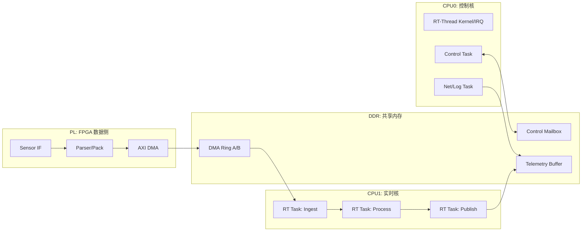
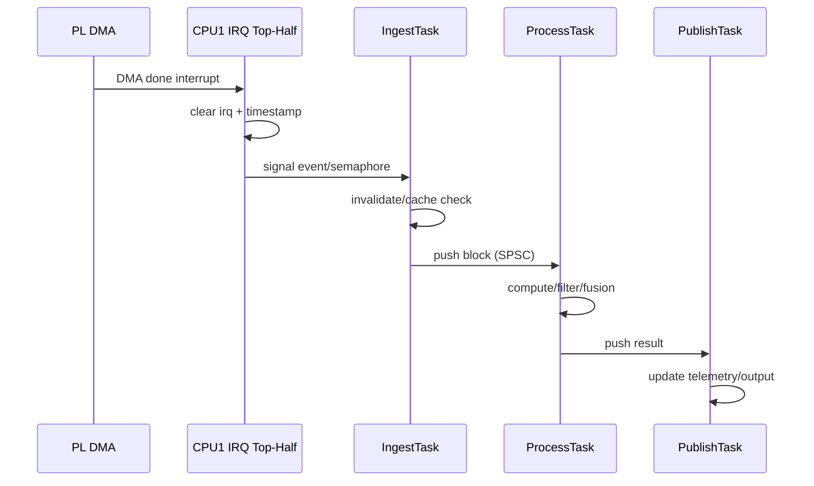

# Zynq-7000 上 RT-Thread MMU + SMP 方案设计（工程落地版）

> 原文链接: [CSDN](https://blog.csdn.net/stallion5632/article/details/151228053)

## 1. 设计目标与边界

本文给出一套可直接实施的 Zynq-7000（双核 Cortex-A9）RT-Thread 方案，面向“PL 持续产出数据、PS 实时处理、系统长期稳定运行”的工业场景。

**目标**：
- 数据通路端到端低延迟、低抖动
- 双核负载可控，关键任务不被抢占
- DMA/Cache 一致性可证明，不依赖“经验写法”
- 出故障时可恢复、可观测、可诊断

**非目标**：
- 不讨论 Linux 生态替代路线
- 不引入动态内存驱动的复杂框架
- 不做与产品无关的抽象层扩展

## 2. 总体架构（软硬协同）

### 2.1 核心分工

- **PL**：只负责确定性搬运与预处理，不承载复杂控制逻辑。
- **CPU1（实时核）**：只跑数据平面任务（采集/处理/发布），固定亲和。
- **CPU0（控制核）**：中断、协议栈、日志、运维任务，隔离非实时干扰。

## 3. MMU 设计：恒等映射 + 属性分区

### 3.1 地址规划原则

1. 外设寄存器与 DMA 描述符区使用恒等映射，避免地址转换歧义。
2. 高吞吐 DMA Ring 使用 Non-cacheable 或“严格 cache 维护”二选一，禁止混搭。
3. 控制数据与遥测数据分区映射，避免共享缓存污染实时路径。

### 3.2 推荐内存分区（示例）

| 区域 | 典型地址段 | 用途 | MMU 属性建议 |
| --- | --- | --- | --- |
| OCM/Boot | 0x0000_0000 ~ | 启动与关键表 | Normal, WBWA, Shareable |
| DDR_RT_RING | 0x3000_0000 ~ | DMA 双环缓冲 | Normal, Non-cacheable |
| DDR_CTRL | 0x3100_0000 ~ | 控制邮箱/状态字 | Normal, WBWA, Shareable |
| DDR_LOG | 0x3200_0000 ~ | 遥测/日志 | Normal, WBWA |
| PL/PS 寄存器 | 0x4000_0000 ~ | AXI 外设寄存器 | Device, nGnRE |

> 注：若项目必须让 `DDR_RT_RING` 可缓存，则必须对每个 DMA 周期执行 `clean/invalidate + barrier`，并通过测试证明没有脏读。

### 3.3 一致性规则（必须落地到代码审查清单）

- CPU 写给 DMA 之前：`clean dcache` → `dsb` → 启动 DMA
- DMA 写给 CPU 之后：DMA 完成中断 → `invalidate dcache` → `dsb` → 访问数据
- 核间共享状态：使用原子变量或关中断临界区，禁止裸读改写

## 4. SMP 调度设计：双核职责固定化

### 4.1 任务部署矩阵

| 核心 | 任务 | 优先级 | 触发方式 | 预算 |
| --- | --- | --- | --- | --- |
| CPU1 | IngestTask | 90 | DMA 完成事件 | 50~100 μs |
| CPU1 | ProcessTask | 85 | 管道触发 | 100~300 μs |
| CPU1 | PublishTask | 80 | 周期/事件 | 50~150 μs |
| CPU0 | ControlTask | 60 | 命令事件 | < 1 ms |
| CPU0 | NetTask | 50 | 周期 | < 2 ms |
| CPU0 | LogTask | 30 | 后台 | 最低优先级 |

### 4.2 调度策略

- 实时链路任务仅运行于 CPU1，禁止负载漂移。
- 中断上半部只做“清中断 + 记账 + 唤醒”，复杂逻辑全部下沉到任务。
- 任务之间采用无锁 SPSC Ring 传递数据块，避免互斥锁级联阻塞。

## 5. 数据通道设计：双环缓冲 + 背压

### 5.1 环形缓冲结构

- **Ring A（采集环）**：PL 写入、CPU1 读取，块大小固定，避免碎片。
- **Ring B（结果环）**：CPU1 写入、CPU0 或网络任务读取。
- 每个槽位包含：`seq`、`timestamp`、`len`、`crc`、`payload`。

### 5.2 背压与丢帧策略

1. Ring 满时不阻塞 ISR：直接置位 `drop_counter`。
2. ProcessTask 超预算触发降级模式：降低输入频率或切换轻量算法。
3. 连续丢帧超阈值触发状态机迁移到 `Degraded`，并上报告警。

## 6. 运行状态机（HSM）

定义节点级状态机：

- `Init`：时钟、MMU、页表、DMA 描述符初始化
- `Ready`：链路打通，等待运行命令
- `Active`：实时处理闭环运行
- `Degraded`：资源紧张/连续超时，降级运行
- `Fault`：DMA 异常、一致性错误、看门狗超时

状态迁移必须具备：
- 触发事件（超时、丢帧、命令）
- 守卫条件（计数器阈值）
- 出入动作（复位 DMA、清环、重建描述符）

## 7. 时延预算与验收指标

### 7.1 单帧预算（示例）

| 阶段 | 预算 |
| --- | --- |
| DMA 完成中断响应 | ≤ 20 μs |
| IngestTask 入队 | ≤ 80 μs |
| ProcessTask 处理 | ≤ 300 μs |
| PublishTask 输出 | ≤ 100 μs |
| 端到端 | ≤ 500 μs |

### 7.2 必测验收项

1. **实时性**：P99 端到端时延与抖动（至少 24h 压测）。
2. **一致性**：故意注入 cache 失配场景，验证检测与恢复路径。
3. **稳定性**：持续运行 + 温升 + 高负载网络并发下无死锁、无崩溃。
4. **可恢复性**：拔插传感器、DMA 异常、任务超时均可自恢复。

## 8. 实施步骤（建议按里程碑）

### M1：最小可运行链路
- 打通 PL DMA → Ring A → CPU1 IngestTask
- 完成 MMU 区域映射与 cache 策略固化

### M2：实时闭环
- 上线 ProcessTask/PublishTask
- 建立双核亲和、优先级、预算监控

### M3：鲁棒性
- 引入 HSM 与看门狗
- 完成降级策略与故障注入测试

### M4：交付验证
- 完成 P99 抖动报告
- 输出调优参数基线（优先级、环深、块大小）

## 9. 结论

该方案不是“RT-Thread + MMU + SMP”的概念罗列，而是一套可实施、可验证、可运维的工程设计：

- 用 **MMU 属性分区** 解决 DMA 与缓存一致性边界；
- 用 **SMP 双核职责固定化** 保障实时链路确定性；
- 用 **双环缓冲 + HSM 降级恢复** 支撑长期稳定运行。

对 Zynq-7000 这类双核异构平台，这是一条在资源受限条件下实现高实时性的可行路径。
