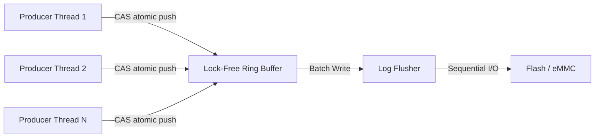

# 嵌入式 ARM Linux 平台高性能无锁异步日志系统设计与实现

> 在多核 ARM Linux 嵌入式系统中，传统的同步日志记录方式（如直接调用 `printf` 或 `write`）由于受限于磁盘 I/O 延迟及内核态切换开销，往往成为系统的性能瓶颈。本文提出并实现了一种基于环形缓冲区（Ring Buffer）与生产者-消费者模型的异步日志架构，通过 C11 原子操作实现无锁化设计，并针对 ARM 平台的 Cache Line 对齐及内存屏障进行了深度优化，以达到极高的吞吐量与极低的业务侵入性。

## 1. 架构设计原理

异步日志的核心在于将日志的"生成"与"落盘"解耦。业务线程作为生产者，仅负责将格式化后的数据写入预分配的内存缓冲区；独立的后台线程作为消费者，负责将数据批量持久化至存储介质。

### 1.1 MPSC 模型架构图

针对日志系统典型的多线程写入、单线程落盘场景，采用多生产者单消费者（MPSC）模型是最优选择。



## 2. 存储选型：为何摒弃链表？

在设计日志缓冲区时，基于定长数组的环形缓冲区（Ring Buffer）在高性能场景下全面优于动态链表。链表在长期运行的系统中存在以下三大缺陷：

### 2.1 内存碎片化与 OOM 风险

链表模式下，每条日志都需要调用 `malloc` 分配节点并在消费后 `free`。在高频日志场景（如每秒 1000 次以上写入）下，频繁的申请与释放会导致堆内存碎片化。在嵌入式设备 7x24 小时运行的过程中，即使系统剩余总内存充足，也可能因无法申请到连续的大块内存而触发 OOM (Out Of Memory)。

### 2.2 内存分配的系统开销

`malloc` 与 `free` 是复杂的系统库函数，内部维护着复杂的内存链表。为保证线程安全，内存分配器内部通常持有锁。随着内存碎片增加，分配器寻找合适空洞的时间复杂度会非线性增长，这种高昂的计算成本违背了系统极速写入的初衷。

### 2.3 CPU 缓存不友好 (Cache Miss)

现代 CPU 的性能极大程度上取决于数据的空间局部性（Spatial Locality）。

#### 2.3.1 内存与 Cache 层次结构

CPU 访问不同存储层级的耗时差异巨大：

- L1 Cache：速度约 1ns，容量极小（32-64KB）。
- L2 Cache：速度约 3-10ns，容量通常为几百 KB 至 1MB。
- L3 Cache：速度约 10-20ns，多核共享。
- 主内存 (RAM)：速度约 60-100ns。

在高端 ARM SoC（如 Cortex-A 系列）中，利用多级缓存是提升吞吐量的关键。而在低端单片机中，Cache Miss 的代价将直接导致处理器流水线停顿。

#### 2.3.2 缓存行 (Cache Line) 与预取

CPU 访问内存时并非以字节为单位，而是以 Cache Line（通常为 64 字节）为单位。

- 数组 (Ring Buffer)：内存物理连续。读取第一个元素时，后续元素已通过缓存行预取至 L1/L2，实现 Cache Hit，效率极高。
- 链表：节点在堆内存中离散分布。遍历链表需要通过指针进行随机跳跃访问，导致频繁的 Cache Miss。CPU 必须挂起等待主存控制器的响应（上百纳秒），对于 2GHz 的 CPU 而言，这意味着数百个指令周期的浪费。

## 3. 针对 ARM 平台的深度优化实践

### 3.1 消除伪共享（False Sharing）

在多核 ARM 处理器（如 Cortex-A53/A72）中，若 `head` 和 `tail` 指针位于同一个 Cache Line（通常为 64 字节），不同核心间的缓存一致性协议（MESI）会导致频繁的缓存失效。
解决方案：使用 `_Alignas(64)` 强制对齐，确保读写指针分布在不同的缓存行。

### 3.2 无锁化与内存屏障

ARM 架构采用弱内存模型。简单的原子自增不足以保证多核之间的数据可见性。
解决方案：使用 C11 `stdatomic.h` 提供的 `memory_order_release` 与 `memory_order_acquire` 语义，确保数据写入早于指针更新，利用 ARM 架构的 `DMB` 指令维持指令序。

### 3.3 零拷贝（Zero-Copy）接口设计

传统的日志接口需要先将数据格式化到临时栈空间，再拷贝到缓冲区。
解决方案：直接暴露缓冲区指针，允许生产者在缓冲区内进行 `snprintf`，减少一次内存拷贝成本。

## 4. 核心实现代码

以下代码集成了上述深度优化方案：

```c
#include <stdio.h>
#include <stdlib.h>
#include <stdatomic.h>
#include <stdbool.h>
#include <string.h>
#include <pthread.h>
#include <unistd.h>
#include <stdarg.h>

#define RING_BUFFER_SIZE 4096  // 须为2的幂，便于掩码运算
#define LOG_ENTRY_SIZE 256

typedef struct {
    char data[LOG_ENTRY_SIZE];
    atomic_bool committed;  // 生产者写入完成标志，解决 CAS-vsnprintf 竞态
} LogEntry;

typedef struct {
    LogEntry* buffer;
    size_t capacity;

    // 使用强制对齐防止伪共享
    _Alignas(64) atomic_size_t head;
    _Alignas(64) atomic_size_t tail;

    atomic_size_t dropped_count;  // 缓冲区满时的丢弃计数

    atomic_bool running;
    int fd;
} AsyncLogger;

// 初始化日志系统
AsyncLogger* logger_create(int fd) {
    AsyncLogger* logger = (AsyncLogger*)aligned_alloc(64, sizeof(AsyncLogger));
    if (logger == NULL) return NULL;

    logger->buffer = (LogEntry*)aligned_alloc(64, sizeof(LogEntry) * RING_BUFFER_SIZE);
    if (logger->buffer == NULL) {
        free(logger);
        return NULL;
    }

    logger->capacity = RING_BUFFER_SIZE;
    logger->fd = fd;
    atomic_init(&logger->head, 0);
    atomic_init(&logger->tail, 0);
    atomic_init(&logger->dropped_count, 0);
    atomic_init(&logger->running, true);

    // 初始化所有 slot 的 committed 标志
    for (size_t i = 0; i < RING_BUFFER_SIZE; i++) {
        atomic_init(&logger->buffer[i].committed, false);
    }

    return logger;
}

/**
 * 深度优化：零拷贝写入接口
 * 直接在环形缓冲区内获取可写空间，避免中间变量拷贝
 */
bool logger_write(AsyncLogger* logger, const char* format, ...) {
    size_t h, t, next;

    // 1. 原子获取写入位置 (MPSC 竞争点)
    t = atomic_load_explicit(&logger->tail, memory_order_relaxed);
    do {
        h = atomic_load_explicit(&logger->head, memory_order_acquire);
        next = (t + 1) & (logger->capacity - 1);

        if (next == h) {
            atomic_fetch_add_explicit(&logger->dropped_count, 1, memory_order_relaxed);
            return false; // 缓冲区满，丢弃并计数
        }

    } while (!atomic_compare_exchange_weak_explicit(&logger->tail, &t, next,
                                                    memory_order_acq_rel, memory_order_relaxed));

    // 2. 直接在目标内存进行格式化 (Zero-copy 思想)
    va_list args;
    va_start(args, format);
    vsnprintf(logger->buffer[t].data, LOG_ENTRY_SIZE, format, args);
    va_end(args);

    // 3. 标记 slot 写入完成，消费者可安全读取
    atomic_store_explicit(&logger->buffer[t].committed, true, memory_order_release);

    return true;
}

/**
 * 深度优化：批量刷新策略
 * 消费者线程一次性处理当前所有可用数据，减少系统调用次数
 */
void* logger_consumer(void* arg) {
    AsyncLogger* logger = (AsyncLogger*)arg;
    LogEntry batch[64]; // 本地批处理缓冲区

    while (atomic_load(&logger->running)) {
        size_t h = atomic_load_explicit(&logger->head, memory_order_relaxed);
        size_t t = atomic_load_explicit(&logger->tail, memory_order_acquire);

        size_t count = 0;
        while (h != t && count < 64) {
            // 等待生产者完成写入 (committed 标志)
            if (!atomic_load_explicit(&logger->buffer[h].committed, memory_order_acquire))
                break;  // slot 尚未提交，停止本轮批处理

            memcpy(&batch[count], &logger->buffer[h], sizeof(LogEntry));
            // 重置 committed 标志，供下一轮复用
            atomic_store_explicit(&logger->buffer[h].committed, false, memory_order_relaxed);
            h = (h + 1) & (logger->capacity - 1);
            count++;
        }

        if (count > 0) {
            // 批量写入文件描述符，提高 I/O 效率
            for(size_t i = 0; i < count; i++) {
                dprintf(logger->fd, "%s\n", batch[i].data);
            }
            atomic_store_explicit(&logger->head, h, memory_order_release);
        } else {
            usleep(1000); // 避免空转，降低 CPU 占用
        }
    }
    return NULL;
}
```

## 5. 性能分析与工程建议

### 5.1 批量写入与页缓存对齐

在 ARM Linux 中，`write` 系统调用的开销相对较高。建议在消费者线程中累积数据至 4KB（典型 Page Size）后统一调用一次 `write`。本方案通过 `batch` 数组模拟了这一行为。

### 5.2 存储介质保护

由于 Flash 存储具有擦写寿命限制，异步日志库应配合文件滚动（Log Rotation）机制，限制单个日志文件的最大容量，并使用 `O_APPEND` 模式确保物理上的顺序写入。

### 5.3 优雅终止与数据完整性

在系统关闭阶段，应先将 `running` 标志位置为 `false`，并调用 `pthread_join` 等待消费者线程将缓冲区内残余的数据完整刷新至介质。

## 6. 结论

通过引入无锁环形缓冲区与零拷贝设计，异步日志库能有效消除多核并发下的锁竞争。针对 ARM 架构的 Cache Line 对齐进一步提升了多核心协作效率。相比传统的同步 `printf` 模式，该方案理论上可显著降低延迟，是 ARM Linux 嵌入式生产环境下的工业级优选方案。

> 原文链接: [CSDN](https://blog.csdn.net/stallion5632/article/details/156543372)
