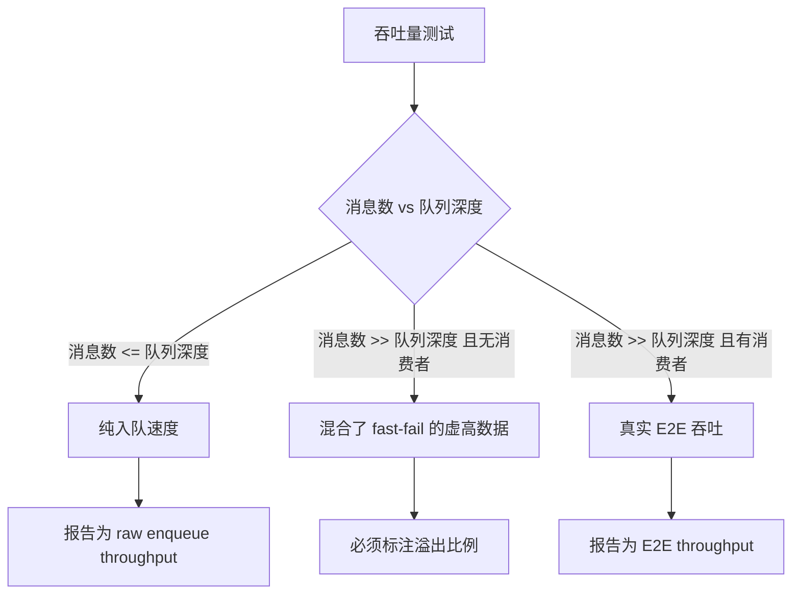
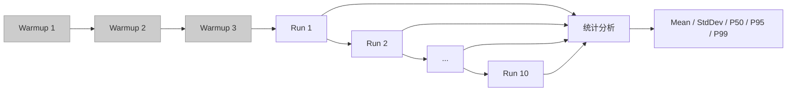
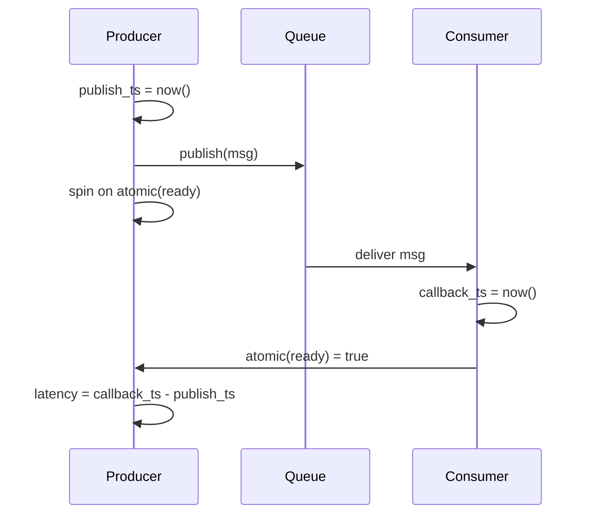
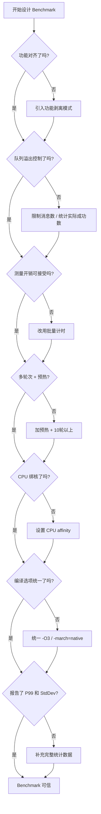

性能对比是技术选型中最具说服力的依据，但也是最容易产生误导的环节。一个设计不当的基准测试，不仅无法反映真实性能，还可能引导团队做出错误决策。

本文总结了在消息总线 (message bus) 基准测试实践中遇到的真实陷阱，并提出了一套可复用的方法论。虽然示例来自具体项目，但所有原则适用于任何并发数据结构的性能对比 -- 无论是 lock-free queue、event dispatcher，还是 actor framework。

---

## 1. 为什么 "Apples-to-Apples" 比想象中更难

### 1.1 设计哲学差异

不同消息总线的设计目标天然不同。一个面向嵌入式的总线可能内建优先级队列、背压控制和运行时统计；而一个通用事件库可能只做最基础的回调分发。直接用相同的 benchmark 循环去测试两者，就像让一辆装甲车和一辆赛车跑直线比速度 -- 结果没有参考价值。

```
框架 A (工业级):  消息 → 优先级判断 → 背压检查 → 原子统计 → CAS 入队 → RingBuffer
框架 B (轻量级):  消息 → 直接调用回调函数
```

框架 A 在每条消息上多做了 3-4 步操作。如果你发现框架 A "只慢了 20%"，那实际上说明它的核心路径效率极高。但如果你只看绝对数字，框架 B 永远 "更快"。

### 1.2 同步 vs 异步的不可比性

同步分发 (直接函数调用) 和异步分发 (入队 + 消费者线程处理) 测量的是完全不同的东西:

- **同步 dispatch**: 测量的是函数调用开销，单线程即可完成
- **异步 publish**: 测量的是入队操作 + 跨线程通信 + 消费者处理的端到端延迟

将两者的 "吞吐量" 直接比较毫无意义。合理的做法是分层对比：队列入队速度与队列入队速度比，端到端延迟与端到端延迟比。

### 1.3 解决方案: 功能剥离模式

为了实现真正公平的核心性能对比，可以引入功能剥离模式 (bare-metal mode)。在该模式下，完全跳过非核心路径上的优先级判断、背压检查和原子统计计数，仅保留核心的 CAS 入队操作和 RingBuffer 索引计算。

| 模式 | 内部行为 | 对比意义 |
| :--- | :--- | :--- |
| **FULL_FEATURED** | 完整执行优先级、背压、统计 | 确立生产环境基线 |
| **BARE_METAL** | 仅保留核心队列操作 | 与轻量级框架公平对比 |

这样，当你声称 "核心队列性能与框架 B 相当" 时，你对比的确实是同一层面的东西。

---

## 2. 队列溢出陷阱: 你的吞吐量可能虚高 30%

这是最隐蔽也最常见的基准测试陷阱。

### 2.1 问题描述

考虑一个典型的吞吐量测试: 向一个深度为 128K 的环形队列连续发送 1M 条消息，不启动消费者线程，测量总耗时。

直觉上，这应该测量的是纯入队速度。但实际发生的是:

```
前 128K 条消息:  执行完整的 CAS + 内存拷贝 → 入队成功
后 872K 条消息:  队列已满 → 立即返回 false → 几乎零开销
```

后 872K 条消息的 "处理时间" 接近于零 (一次条件判断 + 返回)，但它们被计入了总消息数。结果就是: 名义吞吐量被 872K 条 "秒返回" 的失败消息严重稀释了分母。

### 2.2 实测数据

以下是某 lock-free MPSC 队列在相同硬件上的实测数据:

| 场景 | 吞吐量 | 说明 |
| :--- | :--- | :--- |
| 1M 消息 / 无消费者 | 31.09 M msg/s | 虚高 -- 87.2% 的消息 fast-fail |
| 100K 消息 / 无消费者 | 22.95 M msg/s | 真实入队速度 (队列未满) |
| 1M 消息 / 有消费者 | 15.95 M msg/s | 真实端到端吞吐 |

从 31.09 到 22.95，虚高幅度约 35%。如果你拿 31 M msg/s 去做技术宣传，那就是一个不诚实的数字。

### 2.3 控制实验设计



正确做法:

1. **纯入队测试**: 消息数不超过队列深度，或在循环中检查返回值只计入成功的消息
2. **E2E 测试**: 必须启动消费者线程，测量生产者和消费者协同工作的真实吞吐
3. **对照组**: 同时报告两组数据，明确标注测试条件

---

## 3. 测量开销: 当尺子比被测物体还大

### 3.1 时钟调用的代价

在主流 x86-64 平台上，`std::chrono::high_resolution_clock::now()` 的单次调用开销约为 20-50 ns (依赖于内核的 vDSO 实现和 TSC 校准状态)。在 ARM 平台上，这个数字可能更高。

当你的目标操作本身只需 30 ns (例如一次 CAS 入队) 时:

```
测量开销 / 操作耗时 = 2 x 50ns / 30ns = 333%
```

也就是说，你测到的数字中，只有不到四分之一是真正的操作耗时，其余全是时钟调用的噪声。

### 3.2 解决方案: 批量计时

不要对每条消息单独计时。改为对一批消息整体计时，然后除以消息数:

```
start = now()
for i in 0..N:
    queue.push(msg)
elapsed = now() - start
throughput = N / elapsed
```

这样，两次 `now()` 调用的开销被 N 条消息平摊。当 N = 100,000 时，测量开销降低到可忽略的水平。

### 3.3 延迟测量中的时间戳策略

对于需要逐消息延迟数据的场景 (如 P99 延迟统计)，完全避免时钟调用是不可能的。折中方案是 **时间戳缓存**:

- 每 K 条消息更新一次 `cached_ts = now()`
- 中间的消息复用 `cached_ts`，引入的误差不超过 K 条消息的处理时间
- K 的选择需要在精度和开销之间权衡 (典型值: 100-1000)

对于吞吐量测试，更彻底的做法是完全不在消息中传递时间戳，仅在批次级别计时。

---

## 4. 统计学严谨性: 单次运行的数字毫无价值

### 4.1 性能测量的随机性

影响单次 benchmark 结果的随机因素极多:

- 操作系统调度: 进程是否被抢占、是否发生上下文切换
- 缓存状态: cold cache vs warm cache 的性能差距可达 10 倍
- 频率调节: CPU 从节能状态提升到 boost 频率需要时间
- 后台活动: 内核线程、中断处理、其他进程的干扰
- NUMA 拓扑: 内存分配在哪个 NUMA 节点

一次 "跑得快" 的结果不代表你的代码快，可能只是你运气好。

### 4.2 预热与多轮次



**预热轮次** (warmup rounds) 的作用:
- 让 CPU 频率稳定在工作状态
- 填充指令缓存和数据缓存
- 触发 JIT 编译 (如果有的话，C++ 通常不涉及，但 JVM 基准测试中至关重要)
- 让操作系统的调度器 "认识" 你的线程

预热轮次的结果必须丢弃，不计入统计。典型配置: 3 轮预热 + 10 轮正式测试。

### 4.3 分位数比平均值更重要

对于实时系统和嵌入式场景，P99 延迟 (第 99 百分位) 往往比平均延迟更关键。一个平均延迟 100 ns 但 P99 为 10 us 的系统，在实时控制中可能完全不可接受。

关键指标:

| 指标 | 意义 | 关注场景 |
| :--- | :--- | :--- |
| Mean | 整体趋势 | 吞吐量规划 |
| StdDev | 性能抖动 (Jitter) | 确定性系统 |
| StdDev/Mean | 变异系数 (CV) | 结果可信度判断 |
| P50 | 典型延迟 | 用户体验 |
| P95 | 长尾开始 | SLA 保障 |
| P99 | 最坏情况近似 | 实时系统 |
| Min/Max | 极端值 | 异常检测 |

**StdDev/Mean 比值** 是判断测试结果可信度的关键: 如果这个比值超过 0.3，说明性能波动太大，结果不可靠，应当排查干扰源或增加测试轮次。

---

## 5. 端到端延迟的精确测量

### 5.1 为什么逐消息时间戳不工作

在纳秒级别测量端到端延迟时，最直觉的方案 -- 在消息中嵌入发送时间戳，在消费者端计算差值 -- 存在两个问题:

1. **测量开销污染**: 前面已经分析过，`now()` 调用本身的开销与被测操作同数量级
2. **内存带宽压力**: 每条消息多写入 8 字节时间戳，在高频场景下增加 cache line 竞争

### 5.2 原子屏障 + 采样方案

更好的方案是 "采样式" 测量，利用原子变量做同步:



具体步骤:

1. **生产者**: 记录 `publish_ts`，调用 `publish()`，然后在原子变量 `measurement_ready` 上自旋等待 (带超时保护)
2. **消费者**: 在回调函数的第一行获取 `callback_ts`，然后设置 `measurement_ready = true`
3. **计算**: `latency = callback_ts - publish_ts`

这种方法将时钟调用从每条消息降低到每次采样 (例如每 1000 条消息采样一次)，同时获得的延迟数据精度更高，因为没有消息级别的测量干扰。

### 5.3 自旋等待的注意事项

自旋等待期间，生产者线程不会发送新消息，这意味着测到的延迟是 "空闲队列" 状态下的延迟。如果你需要测量 "满载状态" 下的延迟，需要使用不同的策略: 例如在后台维持一个稳定的消息流，同时在采样点插入带标记的测量消息。

---

## 6. CPU 亲和性与缓存一致性

### 6.1 跨核通信的代价

在多线程基准测试中，如果不绑定 CPU 核心，操作系统调度器可能会:

- 将生产者和消费者调度到同一个核心 (结果异常好，因为 L1 cache 共享)
- 将线程在不同核心之间迁移 (结果波动巨大)
- 将线程调度到不同 NUMA 节点 (结果异常差)

### 6.2 控制变量: 固定核心绑定

推荐的做法是通过 CPU affinity 固定线程到指定核心:

```
Producer → Core 0 (同一物理核心)
Consumer → Core 1 (同一物理核心)
```

这样测到的是跨核 L3 cache 一致性协议 (MESI/MOESI) 的真实开销。实测数据表明，跨核通信相比同核通信，吞吐量下降约 30%。

### 6.3 cache line 对齐与 false sharing

当生产者和消费者各自维护的索引变量 (head/tail) 落在同一个 cache line (通常 64 字节) 时，每次写操作都会触发 cache line 的独占权转移，即 false sharing。

解决方案是对关键共享变量做 cache line 对齐:

```cpp
struct alignas(64) AlignedCounter {
    std::atomic<uint64_t> value{0};
    // padding 自动填充到 64 字节
};
```

在基准测试中，是否应用 cache line 对齐应当是一个明确的测试变量，而不是被忽略的隐含条件。

---

## 7. 编译环境的统一

编译器优化级别对性能的影响远超大多数人的预期:

| 配置项 | 要求 | 原因 |
| :--- | :--- | :--- |
| 优化级别 | 统一 `-O2` 或 `-O3` | `-O0` 到 `-O2` 的性能差距可达 10 倍 |
| 标准版本 | 统一 C++ 标准 (如 C++17) | 不同标准的 STL 实现可能有性能差异 |
| 架构指令 | `-march=native` | 启用 AVX/SSE 等硬件加速 |
| 对齐支持 | `-faligned-new` | 支持 `alignas` 超过默认对齐的动态分配 |
| LTO | 统一开启或关闭 | LTO 可以跨编译单元内联 |

不要在 `-O3` 下测试自己的库，然后在 `-O2` 下测试竞品。这种 "失误" 在开源项目的 benchmark 中并不罕见。

---

## 8. 结果呈现: 数据需要上下文

### 8.1 避免误导性的图表

一些常见的误导手法 (有时并非有意):

- **截断 Y 轴**: 从非零值开始，夸大差异
- **混淆单位**: 将 msg/s 和 ops/s 混用 (一条消息可能触发多次操作)
- **忽略误差线**: 只展示平均值，隐藏巨大的标准差
- **选择性报告**: 只展示有利的场景

### 8.2 完整报告模板

一份可信的基准测试报告应包含:

```
## 测试环境
- 硬件: CPU 型号 / 核心数 / 频率 / L3 Cache 大小
- 操作系统: 内核版本
- 编译器: 版本 + 编译选项
- CPU 调频策略: performance / powersave / ondemand

## 测试参数
- 消息大小 / 队列深度 / 线程数 / CPU 绑核
- 预热轮次 / 正式轮次

## 测试结果
- Mean +/- StdDev
- P50, P95, P99
- Min, Max
- 变异系数 (CV = StdDev/Mean)

## 对比条件说明
- 功能对齐策略
- 已知的不对等因素
```

---

## 9. 公平基准测试检查清单

以下是在设计和执行基准测试时的自检项:



**核心原则**: 基准测试的目的不是证明 "我的更快"，而是帮助工程师做出正确的技术决策。一个诚实的、条件清晰的 benchmark，即使数字不占优，也远比一个漂亮但误导性的数字更有价值。

---

## 10. 总结与经验教训

经过大量的基准测试实践，以下是最重要的几条经验:

1. **队列溢出是最常见的吞吐量虚高原因**。任何未控制消费者状态的吞吐量数字都应当持怀疑态度。发送 1M 消息到 128K 队列而不启动消费者，87% 的消息只是 fast-fail 返回 -- 你测的不是队列性能，而是条件判断的速度。

2. **测量工具本身是最大的噪声源**。在纳秒级操作上逐次调用 `now()` 是在用米尺量头发丝。批量计时是唯一可行的方案。

3. **功能对齐比性能数字更重要**。如果你的框架多做了三件事，那么 "只慢 20%" 可能恰恰说明核心路径极其高效。报告中必须清晰说明功能差异。

4. **P99 才是真正的性能指标**。对于嵌入式和实时系统，一个偶发的 10 us 延迟尖峰可能导致控制环路超时。平均值只能用来做容量规划。

5. **可复现性是基础**。固定 CPU 核心、固定编译选项、固定测试参数、记录环境信息。如果别人无法复现你的结果，那就不是科学。

6. **多组对照实验比单一数字更有说服力**。同时报告有消费者/无消费者、不同队列深度、不同消息大小的数据，让读者自行判断。

---

> 参考: [mccc-bus](https://gitee.com/liudegui/mccc-bus), [newosp](https://github.com/DeguiLiu/newosp)
