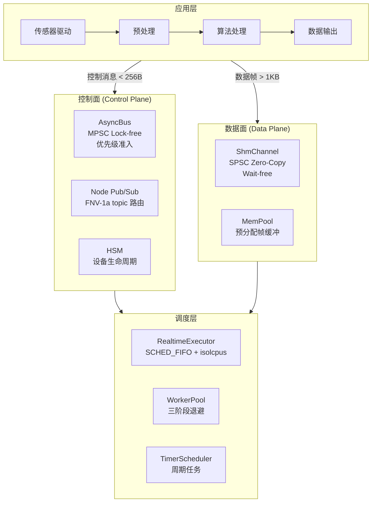
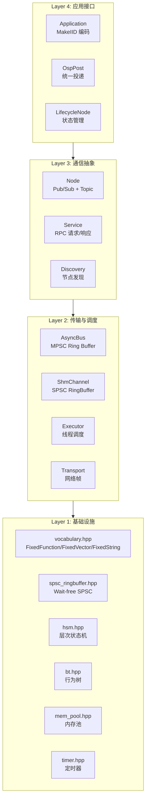
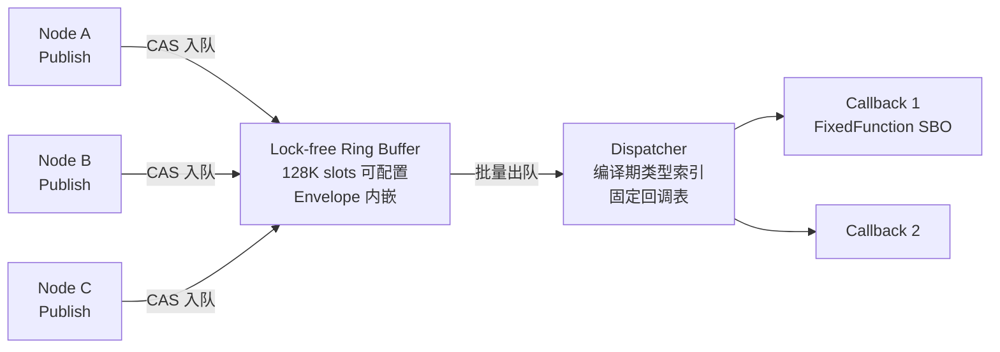
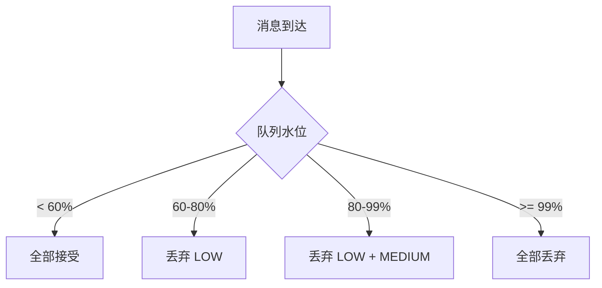
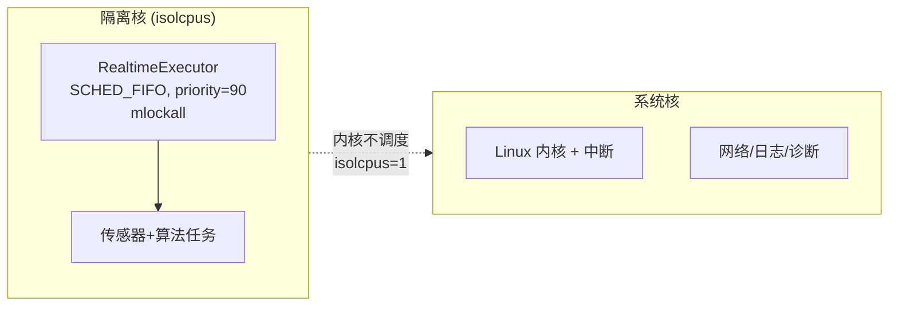
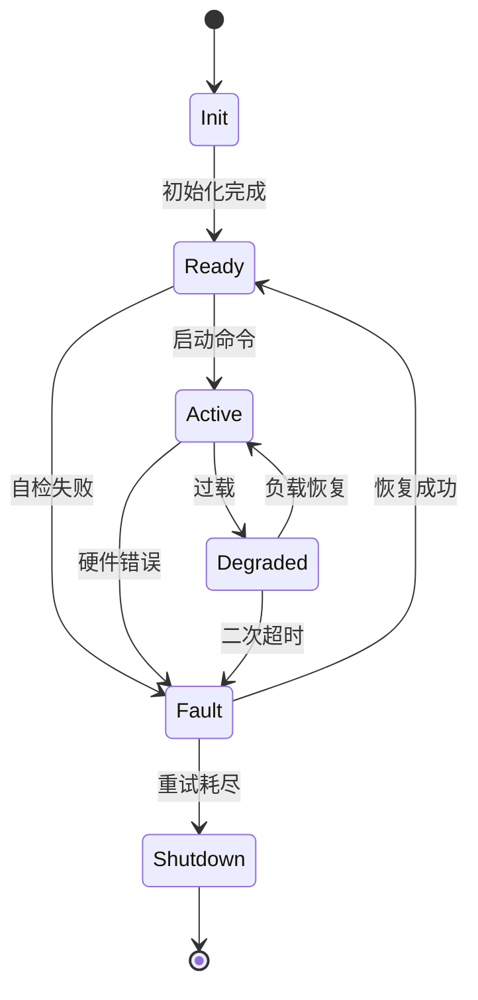
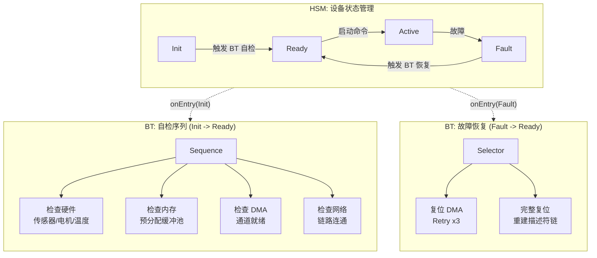
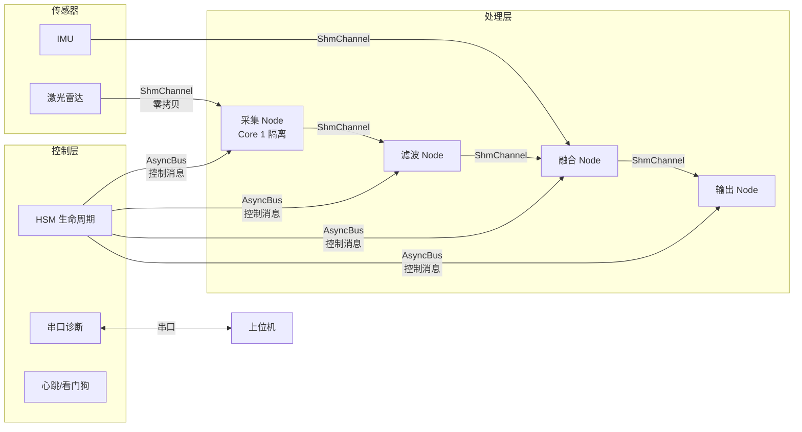

> 版本: v3.0 | 基础设施库: [newosp](https://github.com/DeguiLiu/newosp) v0.2.0
> 目标平台: ARM-Linux (Cortex-A53/A72/A7) | C++17, Header-only
> 适用场景: 激光雷达、工业视觉、机器人、边缘传感器融合

---

## 1. 设计背景与目标

### 1.1 问题域

工业嵌入式传感器系统（激光雷达、工业相机、惯导）的数据处理链路具有以下特征:

- **数据流**: 传感器以 10-100 Hz 产生大块数据（单帧 100 KB - 5 MB），经过多级处理后输出
- **控制流**: 启停、模式切换、参数下发、故障上报等低频但高可靠性要求的消息
- **实时性**: 端到端延迟要求 us 级（控制消息）到 ms 级（数据帧）
- **可靠性**: 7x24 不间断运行，零堆分配避免内存碎片化

传统方案的典型问题:

1. 数据面和控制面混用同一通道，大帧数据阻塞紧急控制消息
2. 基于 `std::function` + `shared_ptr` 的回调机制，热路径存在堆分配
3. 缺少优先级准入和背压控制，系统过载时关键消息被丢弃

### 1.2 设计目标

| 目标 | 量化指标 | 说明 |
|------|----------|------|
| 控制面消息延迟 | P99 < 500 ns (x86), P99 < 1.5 us (ARM) | 无锁 MPSC，Envelope 内嵌 |
| 数据面零拷贝 | 0 次 memcpy (传感器 -> 算法) | ShmChannel SPSC RingBuffer |
| 热路径堆分配 | 0 次 | 全链路栈分配 + 预分配 |
| 优先级保护 | HIGH 消息零丢失 | 三级阈值准入控制 |
| 框架 RAM 占用 | < 2 MB (不含应用缓冲) | 可通过编译期宏缩减 |
| 外部依赖 | 零运行时依赖 | Header-only，FetchContent 仅用于测试/构建 |

### 1.3 非目标

| 排除项 | 理由 | 替代方案 |
|--------|------|----------|
| 跨主机网络通信 | 超出单板框架范畴 | newosp Transport + Discovery |
| 动态服务发现 (DDS) | 嵌入式场景拓扑固定 | 静态配置或轻量 mDNS |
| MSVC / Windows | 非目标平台 | GCC / Clang only |

---

## 2. 架构总览

### 2.1 控制面 / 数据面分离

本架构的核心设计原则是 **控制面与数据面分离**:

| 平面 | 通道 | 消息大小 | 频率 | 同步机制 | 零拷贝 |
|------|------|----------|------|----------|--------|
| 控制面 | AsyncBus + Node | < 256 B | < 1K msg/s | Lock-free MPSC (CAS) | N/A (值语义) |
| 数据面 | ShmChannel | 256 B - 5 MB | 10-100 Hz | Wait-free SPSC | 是 (指针传递) |

**为什么分离?** newosp 实测数据显示，当 AsyncBus 的 variant 包含 8 KB 类型时，Envelope sizeof 从 ~300 B 膨胀到 8232 B，吞吐从 5.9 M/s 降至 0.6 M/s。控制消息走 Bus（轻量 variant），数据帧走 ShmChannel（零拷贝），是架构层面的设计选择。

### 2.2 newosp 模块架构

**关键特征**:
- **40 个头文件**, Header-only INTERFACE 库
- **979 个测试**, ASan + UBSan + TSan 全通过
- **零 std::function**: 全部使用 `FixedFunction<64>` (SBO 回调，无堆分配)
- **零 std::string**: 使用 `FixedString<N>` 替代

---

## 3. 控制面: AsyncBus 消息总线

### 3.1 架构设计

AsyncBus 是 newosp 的核心通信组件，采用 **Lock-free MPSC (多生产者单消费者) Ring Buffer** 设计:

### 3.2 零堆分配设计

传统消息总线每次 Publish 至少 2 次堆分配（`make_shared<Envelope>` + `std::function` 捕获）。newosp 的 AsyncBus 通过以下手段实现热路径零堆分配:

| 传统方案的堆分配 | newosp 替代方案 | 效果 |
|-----------------|----------------|------|
| `std::make_shared<Envelope>` | Envelope 直接内嵌在 RingBufferNode | 消除每消息堆分配 |
| `std::unordered_map<type_index, ...>` | `std::array<CallbackSlot, N>` + 编译期 `VariantIndex` | O(1) 数组索引，无 hash |
| `std::function` 回调 | `FixedFunction<64>` (56B SBO 存储) | 无堆溢出风险 |
| `std::string` 消息字段 | `FixedString<N>` 栈上定长字符串 | 零堆分配 |
| `std::vector` 订阅列表 | `FixedVector<T, N>` 栈上定容向量 | 零堆分配 |

### 3.3 优先级准入与背压控制

AsyncBus 的优先级机制在系统过载时保护关键消息:

**实测验证** (突发 150,000 条消息，超过队列容量 131,072):

| 优先级 | 发送 | 成功 | 丢弃率 | 设计预期 |
|--------|:----:|:----:|:------:|----------|
| HIGH | 30,000 | 30,000 | **0.0%** | 完全保护 (阈值 99%) |
| MEDIUM | 39,321 | 33,642 | 12.6% | 次级保护 (阈值 80%) |
| LOW | 39,320 | 3,640 | 47.6% | 优先丢弃 (阈值 60%) |

### 3.4 性能数据

**newosp AsyncBus 实测** (Ubuntu 24.04, GCC 13.3, `-O3 -march=native`, 10 轮统计):

| 指标 | 数值 | 说明 |
|------|------|------|
| Bus 吞吐量 (x86) | 5.9 M msg/s | 控制消息，variant < 256B |
| Bus P99 延迟 (x86) | 157 ns | 无锁设计，尾部延迟稳定 |
| Bus 吞吐量 (ARM 估算) | 0.5 - 1.0 M msg/s | 弱内存序 + 较低主频 |
| MemPool alloc/free | 98 M ops/s | 预分配池，零碎片 |
| 热路径堆分配 | 0 次 | Envelope 内嵌 + FixedFunction |
| 框架 RAM (AsyncBus) | ~520 KB | 可通过 QueueDepth 宏缩小 |

**与 eventpp + Active Object 对比**:

| 维度 | newosp AsyncBus | eventpp + AO (优化后) | 差距 |
|------|:--------------:|:--------------------:|:----:|
| 吞吐量 | 5.9 M/s | 3.1 M/s (持续) | 1.9x |
| E2E P50 延迟 | ~157 ns | ~11,588 ns | 74x |
| E2E P99 延迟 | ~449 ns | ~24,289 ns | 54x |
| 热路径堆分配 | 0 次/msg | 1 次/msg (shared_ptr) | -- |
| 优先级保护 | 三级阈值 | 无 | -- |
| 外部依赖 | 无 | eventpp 库 | -- |
| MISRA 合规 | 大部分 | 部分 | -- |

> 注: eventpp 对比数据来自优化分支 (OPT-1~8，吞吐提升 5.3x)。newosp 在延迟和零分配方面优势显著，eventpp 在已有代码迁移场景下仍有价值。

---

## 4. 数据面: ShmChannel 零拷贝通道

### 4.1 设计原理

数据面处理大块传感器数据（点云、图像），核心需求是 **零拷贝** 和 **低延迟**:

**传统架构 vs 零拷贝**:

| 架构 | 拷贝次数 | 内存带宽浪费 (1MB x 100Hz) |
|------|:--------:|:--------------------------:|
| 传统 (Driver -> Middleware -> Algorithm -> Output) | 3 次 | 300 MB/s |
| newosp (DMA -> ShmRingBuffer -> 指针访问) | 0 次 | 0 |

### 4.2 ShmRingBuffer 性能

| 指标 | 数值 (x86 实测) | ARM 估算 |
|------|:---------------:|:--------:|
| SPSC 吞吐 (256B payload) | 40 M ops/s | 5-10 M ops/s |
| SPSC 吞吐 (4KB payload) | 2.9 M ops/s | 0.3-0.6 M ops/s |
| 同步机制 | Wait-free (无 CAS) | 显式 acquire/release |

**Cache Line 拐点**: ShmRingBuffer 在 payload 1 KB 处出现吞吐拐点（L1 Cache 边界）。建议数据面分包大小 <= 512 B 以获得最佳 SPSC 吞吐。

### 4.3 Cache 一致性策略

| 方案 | 实现方式 | 优点 | 缺点 | 适用场景 |
|------|----------|------|------|----------|
| Uncached 映射 | `dma_alloc_coherent` | 简单，无维护代码 | 访问延迟高 (~80ns) | 低频，简单系统 |
| Cached + 手动维护 | `dma_sync_single_for_cpu/device` | 高性能 | 需严格维护 | 高频，性能敏感 |
| **newosp 方案** | Cache line 对齐 + 显式 fence | 兼顾性能与安全 | 需理解 ARM 内存序 | 推荐 |

newosp ShmRingBuffer 的 ARM 适配:
- 64B cache line padding 隔离 head/tail，消除 false sharing
- 显式 `acquire`/`release` 语义，不依赖默认 `seq_cst`（ARM 上 `seq_cst` 生成额外 `dmb ish` 全屏障）
- `trivially_copyable` 约束确保数据可安全通过共享内存传递

---

## 5. 调度层: RealtimeExecutor 与 WorkerPool

### 5.1 调度模型

newosp 提供多种 Executor 适配不同实时性需求:

| Executor 类型 | 调度策略 | CPU 亲和 | 适用场景 |
|--------------|----------|---------|----------|
| SingleExecutor | 单线程顺序执行 | 不绑核 | 调试、低频任务 |
| PinnedExecutor | 单线程 + 绑核 | 指定核 | 中等实时性 |
| **RealtimeExecutor** | SCHED_FIFO + mlockall + 绑核 | 隔离核 | **硬实时数据处理** |
| WorkerPool | 多线程 + AdaptiveBackoff | 不绑核 | 并行计算、网络 I/O |

### 5.2 RealtimeExecutor 抗干扰设计

**关键措施**:

| 措施 | 作用 |
|------|------|
| `isolcpus=N` | 将核心从 Linux 调度器剥离 |
| `SCHED_FIFO` | 实时调度策略，不被普通进程抢占 |
| `mlockall` | 锁定内存页，防止缺页中断 |
| Stack prefault | 预写栈页面，避免首次 page fault |
| CPU affinity | 绑核，保持 Cache 热度 |

### 5.3 AdaptiveBackoff 三阶段等待

WorkerPool 的等待策略平衡延迟与 CPU 功耗:

| 阶段 | 行为 | 延迟 | CPU 占用 |
|------|------|:----:|:--------:|
| Spin | 忙等 + CPU hint (`yield`/`pause`) | 0-2 us | 100% |
| Yield | `sched_yield()` 让出时间片 | 2-20 us | 0% |
| Park | condition_variable 休眠 | 1-50 us | 0% |

---

## 6. 状态管理: 层次状态机 (HSM)

### 6.1 设计选择

| 维度 | switch-case | 虚函数 (GoF) | newosp HSM |
|------|:-----------:|:-----------:|:----------:|
| 层次嵌套 | 手动 | 手动委托 | LCA 算法自动 |
| Guard 条件 | if-else | 虚函数重载 | FixedFunction |
| 堆分配 | 0 | 可能 | 0 (FixedVector) |
| 编译期类型安全 | 无 | 需 RTTI | 模板参数 |

### 6.2 设备生命周期状态设计

**HSM 在 newosp 中的多场景应用**:

| 模块 | 状态机用途 | 状态数 |
|------|----------|:------:|
| hsm.hpp | 通用层次状态机 | 自定义 |
| node_manager_hsm.hpp | 节点心跳 (Connected/Suspect/Disconnected) | 3 |
| service_hsm.hpp | 服务连接 (Idle/Listening/Active/Error) | 5 |
| discovery_hsm.hpp | 发现流程 (Idle/Announcing/Stable/Degraded) | 4 |

### 6.3 HSM + BT 组合: 启动自检流程

HSM 管理设备"处于什么状态"，BT (行为树) 管理"如何执行一个流程"。两者组合使用，HSM 在状态转换时触发 BT 执行具体操作序列:

**BT 节点类型及其在自检中的应用**:

| 节点类型 | 行为 | 自检应用示例 |
|----------|------|------------|
| **Sequence** | 依次执行子节点，任一失败则整体失败 | 上电自检: 硬件 -> 内存 -> DMA -> 网络 |
| **Selector** | 依次尝试子节点，任一成功则整体成功 | 故障恢复: 软复位 -> 硬复位 -> 降级运行 |
| **Decorator (Retry)** | 失败时重试 N 次 | DMA 初始化最多重试 3 次 |
| **Decorator (Timeout)** | 超时则返回失败 | 校准流程 5 秒超时 |
| **Action** | 执行具体操作 | 检查传感器、预分配缓冲池 |
| **Condition** | 检查条件 | 温度 < 85 C、电压正常 |

**newosp BT 设计特点**:
- 扁平数组存储 (非指针树)，缓存友好
- 索引引用子节点，零堆分配
- 与 HSM 通过 AsyncBus 事件交互: BT 完成 -> 发布 `SelfTestPassed` -> HSM 转换到 Ready

---

## 7. 典型部署: 激光雷达数据处理

### 7.1 系统架构

### 7.2 模块选型与通道划分

| 数据特征 | 选择通道 | newosp 模块 | 原因 |
|----------|----------|------------|------|
| 控制命令 (< 256 B) | AsyncBus | Node Pub/Sub | 低频，需优先级保护 |
| 点云数据 (1 MB/帧) | ShmChannel | SpscRingBuffer | 高频，零拷贝 |
| 请求-响应 | Service RPC | service.hpp | 异步回调，超时控制 |
| 周期遥测 | Timer + AsyncBus | TimerScheduler | 定时采样 |
| 诊断通信 | 串口 | SerialTransport | CRC 校验，ACK 可靠 |

---

## 8. 资源预算

### 8.1 newosp 框架开销

| 资源 | 占用 | 说明 |
|------|------|------|
| .text (代码段) | ~80 KB | Header-only, 按需实例化 |
| 运行时 RAM | < 2 MB | AsyncBus ~520 KB + 其他 |
| 线程数 | 4-6 | Bus + Timer + Worker + 诊断 |
| CPU 占用 | < 5% | 框架本身开销 |

### 8.2 编译期配置适配

| 配置场景 | Queue Depth | Cache Align | RAM |
|----------|:-----------:|:-----------:|:---:|
| 服务器/PC (测试) | 128K | 64B | ~16 MB |
| ARM Linux (1GB) | 8K | 64B | ~2.7 MB |
| ARM Linux (256MB) | 4K | 64B | ~512 KB |
| MCU (单核, 512KB) | 256 | 关闭 | ~23 KB |

### 8.3 典型激光雷达资源预算 (ARM Cortex-A53, 512 MB DDR)

| 资源 | newosp | 点云缓冲 | 算法 | 系统 | 总计 |
|------|:------:|:--------:|:----:|:----:|:----:|
| RAM | ~2 MB | ~3 MB | 10-50 MB | ~32 MB | < 90 MB |
| CPU | < 5% | -- | 30-60% | ~20% | < 85% |

---

## 9. 与同类框架对比

| 维度 | newosp | eventpp + AO | ROS 2 (DDS) | QP/C |
|------|:------:|:-----------:|:-----------:|:----:|
| 消息延迟 (P50) | ~157 ns | ~11.6 us | ~100 us | ~1 us |
| 吞吐量 | 5.9 M/s | 3.1 M/s | ~0.5 M/s | N/A |
| 热路径堆分配 | 零 | 有 | 有 | 零 |
| 优先级准入 | 三级阈值 | 无 | QoS | RTC |
| 零拷贝 IPC | ShmChannel | 无 | iceoryx | 无 |
| 外部依赖 | 无 | eventpp | DDS | 无 |
| 二进制大小 | ~50 KB | ~100 KB | ~10 MB | ~20 KB |
| MISRA 合规 | 大部分 | 部分 | 否 | 是 |
| 目标平台 | ARM-Linux/MCU | ARM-Linux | Linux/QNX | MCU |

---

## 10. 总结

本流式架构基于 newosp 基础设施库，通过 **控制面/数据面分离** 解决工业嵌入式传感器系统的核心矛盾:

1. **控制面 (AsyncBus)**: Lock-free MPSC，零堆分配，三级优先级保护，P99 < 500 ns
2. **数据面 (ShmChannel)**: SPSC wait-free 零拷贝，避免大帧数据阻塞控制消息
3. **调度层 (RealtimeExecutor)**: SCHED_FIFO + isolcpus + mlockall，确定性调度
4. **状态管理 (HSM + BT)**: HSM 管理设备状态，BT 驱动启动自检和故障恢复流程，零堆分配

newosp 的 Header-only 设计、零运行时依赖、编译期可配置的特性，使其特别适合资源受限的嵌入式 ARM-Linux 平台。所有性能数据均可通过源码复现（979 个测试，ASan/TSan clean）。

---

## 参考资料

| 资源 | 说明 |
|------|------|
| [newosp](https://github.com/DeguiLiu/newosp) | 工业嵌入式 C++17 基础设施库 (v0.2.0) |
| [newosp 设计文档](docs/design_zh.md) | 40 个模块详细设计 |
| [newosp 性能报告](docs/benchmark_report_zh.md) | 完整基准测试数据 |
| [newosp 激光雷达评估](docs/performance_analysis_lidar_zh.md) | 激光雷达场景性能分析 |
| [iceoryx](https://github.com/eclipse-iceoryx/iceoryx) | 零拷贝 IPC 参考 |
| [ARM Memory Model](https://developer.arm.com/documentation/den0024/a/Memory-Ordering) | ARM 弱内存序 |
