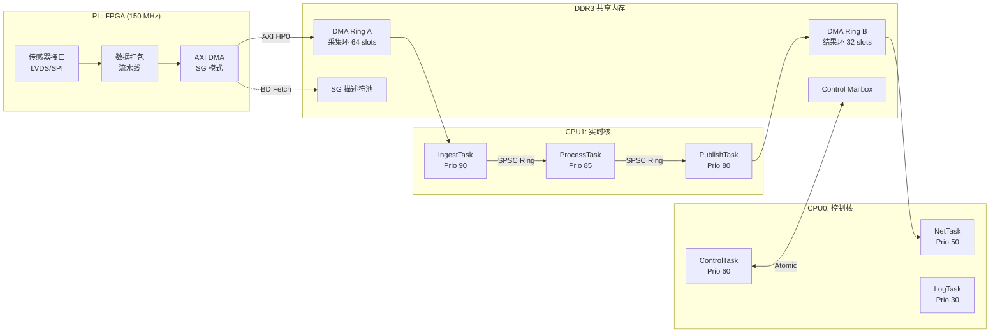
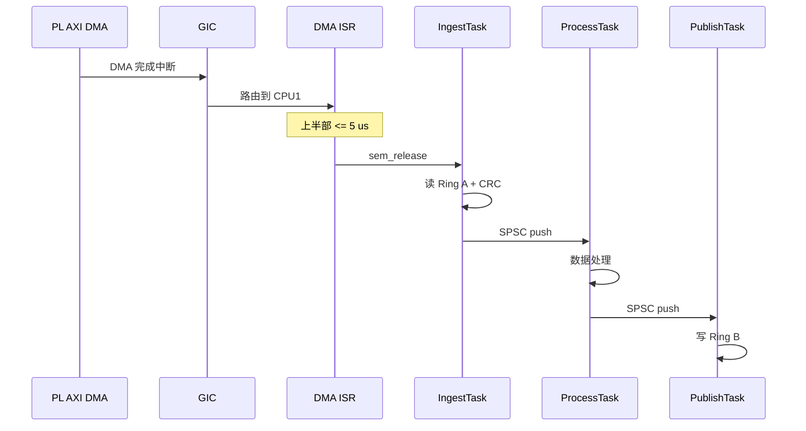
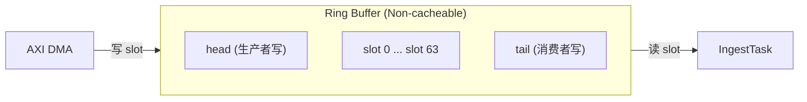
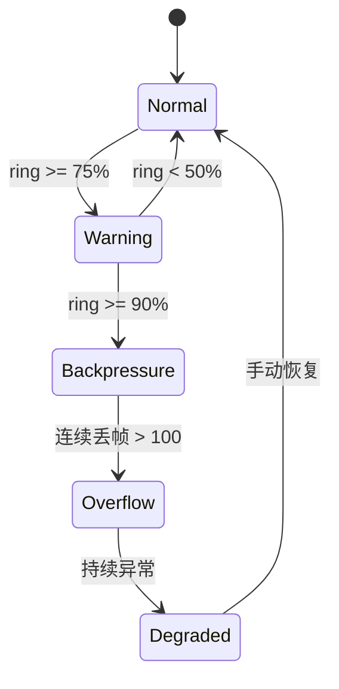
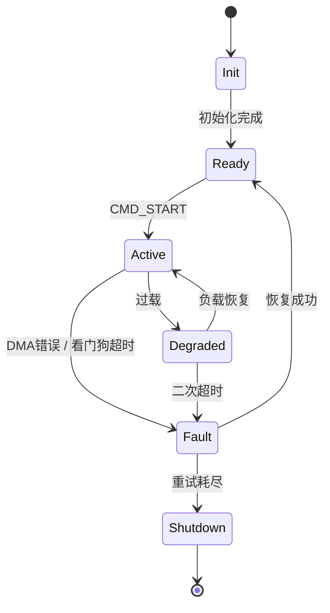

> 原文链接: [CSDN](https://blog.csdn.net/stallion5632/article/details/151228053)
>
> 参考: [UG585 - Zynq-7000 SoC TRM](https://docs.amd.com/r/en-US/ug585-zynq-7000-SoC-TRM),
> [ARM Cortex-A9 MPCore TRM](https://documentation-service.arm.com/static/5e7e1f4fb2608e4d7f0a369f)

---

## 1. 设计目标

本文给出 Zynq-7000 (双核 Cortex-A9, 667 MHz) + RT-Thread SMP 的概要设计方案，面向 PL 持续产出数据、PS 实时处理的工业场景（激光雷达点云采集、工业视觉预处理、边缘传感器融合）。

### 1.1 量化目标

| 编号 | 目标 | 量化指标 | 验证方法 |
|------|------|----------|----------|
| G-1 | 端到端低延迟 | P50 <= 300 us, P99 <= 500 us | GTC 硬件定时器 + GPIO 示波器 |
| G-2 | 低抖动 | P99-P50 jitter <= 200 us | 连续 24h 压测统计 |
| G-3 | 双核负载隔离 | CPU1 实时 <= 60%, CPU0 控制 <= 40% | RT-Thread `top` 周期采样 |
| G-4 | DMA/Cache 正确性 | 零 CRC 错误，连续 72h 无 coherency 异常 | 端到端 CRC 校验 |
| G-5 | 故障可恢复 | DMA 错误后 <= 50 ms 恢复至 Ready | 故障注入测试 |
| G-6 | 热路径零堆分配 | malloc/free 调用 0 次 | 静态分析 + 运行时 hook |

### 1.2 约束条件

| 项目 | 配置 |
|------|------|
| 硬件 | Zynq-7020, 双核 Cortex-A9 @ 667 MHz, 512 MB DDR3, 256 KB OCM |
| RTOS | RT-Thread v5.x, SMP 模式 |
| PL 时钟 | 150 MHz (AXI DMA 数据通路) |
| 编译器 | arm-none-eabi-gcc 12.x, `-O2 -fno-exceptions -fno-rtti` |

---

## 2. 总体架构

### 2.1 软硬协同架构

### 2.2 核心分工

| 域 | 职责 | 约束 |
|----|------|------|
| **PL** | 传感器接口适配、数据打包、AXI DMA 搬运 | 仅做确定性流水线，不含条件逻辑 |
| **CPU1 (实时核)** | 数据采集 / 处理 / 发布 | 固定亲和，禁止非实时任务迁入 |
| **CPU0 (控制核)** | 内核调度、中断分发、协议栈、日志 | 承载全部非实时负载 |

### 2.3 数据带宽分析

以激光雷达 30K 点/s、16 B/点为例:

| 环节 | 带宽 | 占 DDR 峰值 (4.26 GB/s) | 裕度 |
|------|------|:------------------------:|:----:|
| PL DMA 写入 | 480 KB/s | 0.01% | > 8000x |
| CPU 读取处理 | 480 KB/s | 0.01% | > 8000x |
| AXI HP 端口峰值 | 1.2 GB/s | -- | 参考上限 |

> 带宽不是瓶颈。CPU 处理延迟和调度抖动是端到端延迟的主导因素。

---

## 3. 内存分区设计

### 3.1 DDR3 地址映射

| 区域 | 起始地址 | 大小 | MMU 属性 | 用途 |
|------|----------|------|----------|------|
| Kernel + App | 0x0010_0000 | 255 MB | Cacheable, WB-WA | RT-Thread 内核、任务栈 |
| DMA Ring (A+B) | 0x1000_0000 | 1 MB | **Non-cacheable** | DMA 数据环形缓冲 |
| SG 描述符 | 0x1010_0000 | 1 MB | **Non-cacheable** | AXI DMA SG BD 链 |
| Mailbox | 0x1020_0000 | 1 MB | Cacheable, Shareable | 核间控制命令 |
| 遥测缓冲 | 0x1030_0000 | 1 MB | Cacheable | 日志和统计 |
| 通用 | 0x1040_0000 | ~252 MB | Cacheable, WB-WA | 应用数据 |

### 3.2 DMA 区域选择 Non-cacheable 的设计决策

| 考量 | 分析 |
|------|------|
| **复杂度** | Non-cacheable 消除全部 cache 一致性代码，审查零认知负担 |
| **性能代价** | ~80 ns/access vs ~5 ns (cached)，但单次读 512 B 约 50 us |
| **可接受性** | 带宽裕度 > 8000x，50 us 的额外延迟在 500 us 预算内可接受 |
| **演进路径** | 若性能不足，可切换为 Cacheable + 严格 CMO 维护 |

### 3.3 Cache 一致性策略

| 区域 | 属性 | 策略 |
|------|------|------|
| DMA Ring / SG BD | Non-cacheable | 无需维护，硬件直接访问 DDR |
| Mailbox | Cacheable, Shareable | SCU 硬件 snoop 保证双核一致性 |
| 通用数据 | Cacheable | 各核 L1 独立，SCU 自动维护 |
| PL 外设寄存器 | Device | 自带序列化 |

**Cache 维护操作** (仅 Cacheable 区域需要):

| 场景 | 操作 | 说明 |
|------|------|------|
| CPU 写 -> DMA 读 | Clean + DSB | 将脏数据写回 DDR |
| DMA 写 -> CPU 读 | Invalidate + DSB | 丢弃 cache 中旧数据 |
| 双核共享 | SCU 自动 | S 位 = 1 时 SCU snoop |

---

## 4. SMP 调度设计

### 4.1 任务部署矩阵

| 核心 | 任务 | 优先级 | 栈 | 触发方式 | WCET |
|------|------|:------:|:--:|----------|:----:|
| CPU1 | IngestTask | 90 | 2 KB | DMA 完成信号量 | 80 us |
| CPU1 | ProcessTask | 85 | 4 KB | SPSC Ring 非空 | 300 us |
| CPU1 | PublishTask | 80 | 2 KB | SPSC Ring 非空 | 100 us |
| CPU1 | WatchdogTask | 95 | 512 B | 周期定时器 | 10 us |
| CPU0 | ControlTask | 60 | 2 KB | 命令事件 | 500 us |
| CPU0 | NetTask | 50 | 4 KB | 周期 100 Hz | 2 ms |
| CPU0 | LogTask | 30 | 2 KB | 周期 10 Hz | 5 ms |

### 4.2 CPU 亲和绑定

RT-Thread SMP 维护两级就绪队列:

| 队列 | 调度范围 | 用途 |
|------|----------|------|
| 全局就绪队列 | 可被任意核调度 | 未绑定的任务 |
| 本地就绪队列 | 仅该核调度 | 绑定到特定 CPU 的任务 |

CPU1 的实时任务通过 `RT_THREAD_CTRL_BIND_CPU` 绑定，保证 L1 Cache 热度和调度隔离。

### 4.3 中断处理: 上半部 / 下半部分离

上半部约束: 仅读状态、清中断、记时间戳、释放信号量。禁止内存分配和阻塞操作。

### 4.4 优先级反转防范

| 措施 | 适用场景 |
|------|----------|
| **无锁 SPSC Ring** | 核心数据路径 (Ingest -> Process -> Publish) |
| 优先级继承互斥量 | Mailbox 读写 |
| 避免共享 | 各任务独立缓冲区，通过 Ring 传递所有权 |

---

## 5. 数据通道设计

### 5.1 环形缓冲结构

**单 slot 结构** (544 B, cache line 对齐):

| 字段 | 大小 | 说明 |
|------|------|------|
| seq | 4 B | 单调递增序列号 |
| timestamp_ns | 8 B | GTC 硬件时间戳 |
| len + crc16 | 4 B | 长度 + CRC-CCITT |
| payload | 512 B | 数据载荷 (32 点 x 16 B) |
| padding | 16 B | 对齐到 cache line |

**内存占用**: Ring A (64 slots) ~34 KB + Ring B (32 slots) ~17 KB = ~51 KB

### 5.2 SPSC Ring 正确性保证

| 属性 | 机制 |
|------|------|
| 无 ABA | 单生产者单消费者，无 CAS |
| 无撕裂 | uint32_t 对齐，ARM 原子 LDR/STR |
| 内存序 | DMB 保证数据/索引写入顺序 |
| 无 false sharing | head/tail 间 32B padding |

### 5.3 背压状态机

| 状态 | 动作 |
|------|------|
| Normal | 正常运行 |
| Warning | 记录日志 |
| Backpressure | 通知 PL 降频 |
| Overflow | 暂停 DMA，清空 Ring |

---

## 6. 运行状态机

| 转换 | 守卫条件 | 进入动作 |
|------|----------|----------|
| Ready -> Active | 自检通过 + DMA 正常 | 启动 DMA, 使能中断 |
| Active -> Fault | DMA Error 或 CRC 连续失败 | 停止 DMA, 保存诊断 |
| Fault -> Ready | retry < 3 | 复位 DMA, 重建 BD 链, retry++ |

---

## 7. DMA 子系统设计

### 7.1 选型

| 选项 | 方案 | 理由 |
|------|------|------|
| DMA IP | PL AXI DMA (SG) | BD 链自动遍历，不消耗 CPU |
| 传输端口 | AXI HP0 (64-bit, 150 MHz, 1.2 GB/s) | 高带宽，Non-cacheable |
| 不使用 ACP | -- | snoop 流量干扰 CPU cache |

### 7.2 描述符链

SG BD 为 64B 结构体，环形链接。BD 池位于 DDR_SG_DESC 区域 (Non-cacheable, 64B 对齐)。

| BD 字段 | 说明 |
|---------|------|
| next_desc | 下一个 BD 地址 (环形) |
| buf_addr | 指向 Ring slot payload |
| control | 传输长度 |
| status | 完成状态 + 错误标志 (硬件填写) |

---

## 8. 核间通信设计

| 通信类型 | 机制 | 内存属性 | 延迟 |
|----------|------|----------|:----:|
| PL -> CPU1 数据 | DMA Ring + 中断 | Non-cacheable | 15-80 us |
| 任务间数据 | SPSC Ring (无锁) | Non-cacheable | 50-100 ns |
| CPU0 <-> CPU1 控制 | Mailbox + flag | Cacheable, Shareable | 100-500 ns |

**Mailbox 协议**: 发送方写数据 -> DMB -> 写 flag=1 -> DSB; 接收方检查 flag -> DMB -> 读数据 -> 写 flag=0。

**内存屏障规则**:
- 写数据后、写标志前: DMB
- 读标志后、读数据前: DMB
- DMA 操作前后: DSB
- 中断清除后: DSB

---

## 9. 时延预算

### 9.1 单帧端到端

| 阶段 | WCET | 典型值 |
|------|:----:|:------:|
| DMA 传输 | 10 us | 2-5 us |
| 中断响应 | 15 us | 5-10 us |
| IngestTask | 80 us | 40-60 us |
| ProcessTask | 300 us | 100-250 us |
| PublishTask | 100 us | 30-80 us |
| **合计** | **505 us** | **177-405 us** |

### 9.2 抖动来源

| 来源 | 范围 | 缓解 |
|------|:----:|------|
| GIC 仲裁 | 2-5 us | CPU1 仅实时任务 |
| 调度延迟 | 3-10 us | CPU1 仅 3 个任务 |
| DDR 刷新 | 10-30 us | 实时端口优先 |
| 算法分支 | 50-150 us | 固定路径 |

### 9.3 热降额

| 温度 | P99 预计 | 达标 |
|:----:|:--------:|:----:|
| 25 C | 500 us | 是 |
| 55 C | 520 us | 是 |
| 85 C | 560 us | 是 |
| 85 C + 高负载 | 700 us | 需验证 |

---

## 10. 实施里程碑

| 里程碑 | 关键交付 | 验收标准 |
|--------|----------|----------|
| M1: 最小链路 | MMU + DMA + Ring A | 10K 帧 CRC 零错误 |
| M2: 实时闭环 | 绑核 + SPSC 流水线 | P50 <= 300 us, P99 <= 500 us |
| M3: 鲁棒性 | HSM + 看门狗 + 故障恢复 | 72h 零崩溃 |
| M4: 交付验证 | 延迟报告 + 热降额 | 100 万帧统计 |

---

## 11. 总结

核心设计决策:

1. **Non-cacheable DMA Ring**: 用 8000x 带宽裕度换取零 cache 一致性代码
2. **双核职责固定 + 无锁 SPSC Ring**: 所有权传递消除优先级反转
3. **HSM 全生命周期**: Init/Ready/Active/Degraded/Fault 覆盖故障恢复
4. **量化驱动**: 每项决策追溯到 G-1 ~ G-6 指标

---

> 原文链接: [CSDN](https://blog.csdn.net/stallion5632/article/details/151228053)
