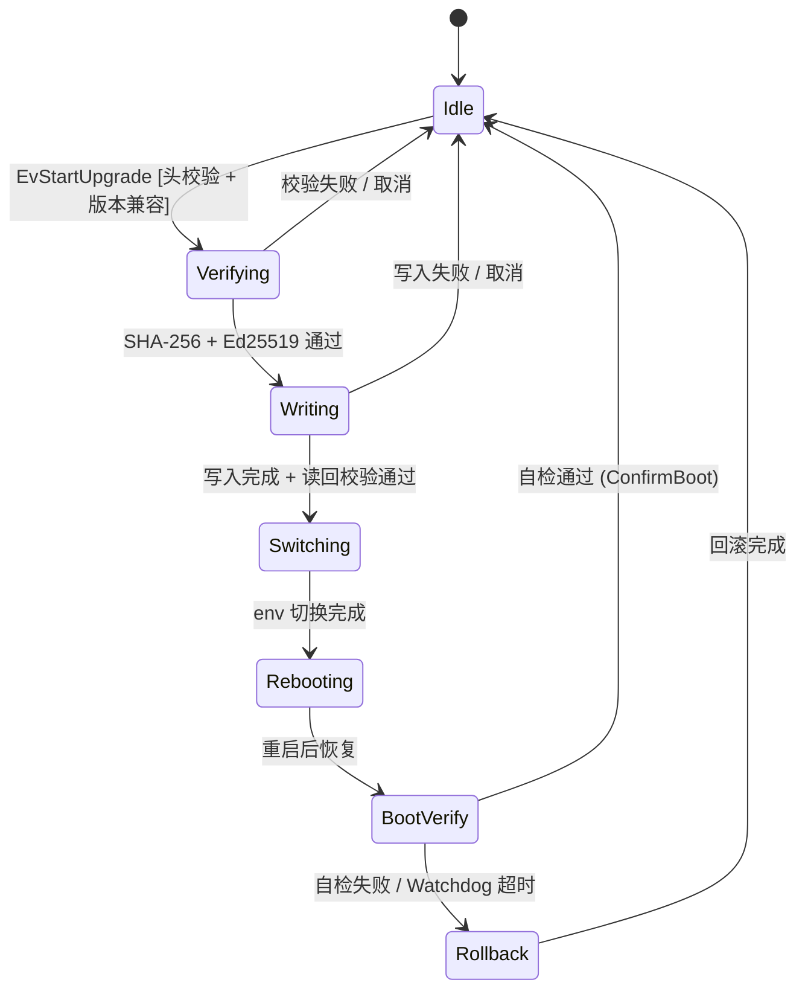

> 配套代码: [liudegui/osp-upgrade-engine](https://gitee.com/liudegui/osp-upgrade-engine) -- C++17 header-only 固件升级引擎
>
> 依赖库: [DeguiLiu/newosp](https://github.com/DeguiLiu/newosp) -- header-only 嵌入式基础设施 (HSM, Bus, Watchdog, Process)
>
> 相关文章:
> - [C 语言层次状态机框架: 从过程驱动到数据驱动的重构实践](../c_hsm_data_driven_framework/) -- HSM 转换表设计与 LCA 算法
> - [newosp 深度解析: C++17 事件驱动架构](../newosp_event_driven_architecture/) -- AsyncBus/HSM/SPSC 核心实现

## 1. 问题与方案选择

工业嵌入式设备 (激光雷达、机器人、边缘计算) 的固件升级有三个硬约束: **掉电安全** (现场无人值守，任意时刻断电不能变砖)、**资源受限** (32-256MB RAM，不能跑 D-Bus + systemd)、**可验证** (升级后必须自检确认，失败自动回滚)。

传统 Linux OTA 方案 (SWUpdate、RAUC) 面向通用 Linux 发行版，依赖链较重:

| 维度 | SWUpdate / RAUC | osp-upgrade-engine |
|------|-----------------|-------------------|
| 运行时依赖 | D-Bus + systemd + GLib + libcurl | newosp header-only (零外部依赖) |
| 内存占用 | ~10-50 MB | < 73 KB (含 4KB 写缓冲) |
| 进程模型 | 独立 daemon | 嵌入应用进程 (SpinOnce 轮询) |
| 状态机实现 | Lua 脚本 / 配置文件 | C++ 编译期 HSM (类型安全) |
| 掉电保护 | SWUpdate: update_state 文件 | raw 分区 + U-Boot 冗余 env + bootcount |
| 适用场景 | Yocto / Buildroot 完整发行版 | 资源受限嵌入式 (32-256MB RAM) |

osp-upgrade-engine 不替代 SWUpdate 的全部功能 (Lua 脚本灵活性、HTTP 多源下载、加密分区)。它面向的是 SWUpdate 依赖链不可用或过重的场景。

### 核心设计选择

- **HSM 驱动**: 复用 `osp::StateMachine` 管理 8 阶段升级流程，每次状态转换前持久化到 raw 分区
- **函数指针表 HAL**: 不用 virtual，函数指针 + void* ctx 实现硬件抽象，零间接调用开销
- **三层掉电保护**: raw 分区状态持久化 + U-Boot 冗余 env 原子切换 + bootcount 超限自动回滚
- **零堆分配**: PackageHeader 128B 栈解析，SHA-256 流式计算，PartitionWriter 4KB 栈缓冲

## 2. 架构设计

### 2.1 存储布局 (典型 8GB eMMC)

```
+------------------+----------+----------+-------------------------------+
| 分区             | 设备节点  | 大小     | 用途                          |
+------------------+----------+----------+-------------------------------+
| bootloader       | mmcblk0p1| 2 MB     | U-Boot SPL + U-Boot           |
| env              | mmcblk0p2| 128 KB   | U-Boot 环境变量 (冗余双副本)  |
| recovery         | mmcblk0p3| 32 MB    | 最小 recovery 系统            |
| rootfs_a         | mmcblk0p4| 1 GB     | 主系统 A (kernel + rootfs)    |
| rootfs_b         | mmcblk0p5| 1 GB     | 主系统 B (kernel + rootfs)    |
| config           | mmcblk0p6| 64 MB    | 持久化配置 (不随升级擦除)     |
| data             | mmcblk0p7| 剩余     | 用户数据 + 升级包暂存         |
| upgrade_state    | mmcblk0p8| 64 KB    | 升级状态持久化 (raw, 无 FS)   |
+------------------+----------+----------+-------------------------------+
```

A/B 分区交替使用: 当前活跃分区运行系统，非活跃分区接收新固件。升级完成后通过 U-Boot env **原子切换**启动槽位。upgrade_state 是独立 raw 分区，不挂载文件系统，升级引擎直接 `pwrite/pread/fsync`，避免文件系统日志开销。

### 2.2 组件关系

```
┌─────────────────────────────────────────────────────────────────┐
│                     应用层 (激光雷达主程序)                       │
│  调用 StartUpgrade() / ConfirmBoot() / SpinOnce()               │
└────────────────────────────┬────────────────────────────────────┘
                             │
┌────────────────────────────▼────────────────────────────────────┐
│                     UpgradeEngine (门面)                          │
│  ┌──────────────┐  ┌──────────────┐  ┌───────────────────────┐  │
│  │ UpgradeHSM   │  │ PackageHeader│  │  PartitionWriter      │  │
│  │ (8 states,   │  │ (128B 解析,  │  │  (write+fsync+readback│  │
│  │  LCA 转换)   │  │  CRC-32)     │  │   SHA-256 校验)       │  │
│  └──────────────┘  └──────────────┘  └───────────────────────┘  │
│  ┌──────────────┐  ┌──────────────┐  ┌───────────────────────┐  │
│  │ BootEnvMgr   │  │ StatePersist │  │  PackageSigner        │  │
│  │ (U-Boot env  │  │ (raw 分区    │  │  (Ed25519 + SHA-256,  │  │
│  │  读写)       │  │  64B 记录)   │  │   mbedtls PSA API)    │  │
│  └──────────────┘  └──────────────┘  └───────────────────────┘  │
└──────────────────────────┬──────────────────────────────────────┘
                           │ UpgradeHAL (函数指针表)
         ┌─────────────────┼─────────────────┐
         │                 │                  │
  ┌──────▼──────┐  ┌───────▼──────┐  ┌───────▼───────┐
  │ PosixHAL    │  │ SimPartition │  │  SimBootEnv   │
  │ (生产环境)  │  │ (x86 仿真)   │  │  (x86 仿真)   │
  └─────────────┘  └──────────────┘  └───────────────┘
```

UpgradeEngine 不创建额外线程。`SpinOnce()` 在调用者线程中执行 (主循环或 Executor)，每次处理一个 4KB chunk，不阻塞。

## 3. HSM 状态机设计

### 3.1 状态转换图



8 个状态均为扁平结构 (parent_index = -1)，不使用层级嵌套。升级引擎的状态转换是严格线性的 (不存在从 Writing 跳到 BootVerify 的场景)，层级在此场景下增加复杂度但不带来收益。

### 3.2 HSM Context

所有状态 handler 共享一个 `UpgradeContext` 结构体，替代全局变量:

```cpp
struct UpgradeContext {
  UpgradeHAL* hal;                    // 硬件抽象层
  PackageHeader header;               // 128B 包头 (栈)
  uint8_t active_slot;                // 当前活跃分区 (0=A, 1=B)
  uint8_t target_slot;                // 升级目标分区
  uint32_t current_version;           // 当前固件版本
  uint32_t local_hw_id;               // 本机 board_id (0-31)
  const uint8_t* pub_key;             // Ed25519 公钥 (32B)

  char pkg_path[256];                 // 升级包路径
  int32_t pkg_fd;                     // 包文件描述符
  uint64_t bytes_written;             // 写入进度
  uint64_t total_size;                // payload 总大小

  Sha256Calculator sha_calc;          // SHA-256 流式计算 (mbedtls)
  uint8_t computed_digest[32];        // 计算结果

  PartitionWriter* pw_ptr;            // 分区写入器 (引擎持有)
  int32_t state_fd;                   // 状态分区 fd
  UpgradeError last_error;            // 最近错误码
  void* sm_ptr;                       // StateMachine 指针 (handler 内转换)

  int32_t idx_idle, idx_verifying, idx_writing, idx_switching;
  int32_t idx_rebooting, idx_boot_verify, idx_rollback;
};

using UpgradeHSM = osp::StateMachine<UpgradeContext, 8>;
```

### 3.3 状态注册

`osp::StateMachine` 使用声明式 API 注册状态，handler/entry/exit 均为静态函数指针:

```cpp
void SetupUpgradeHSM(UpgradeHSM& sm, UpgradeContext& ctx) noexcept {
  ctx.idx_idle = sm.AddState({
      "Idle", UpgradeHSM::kNoState,       // name, parent
      detail::IdleHandler,                 // handler
      detail::IdleEntry, nullptr, nullptr  // entry, exit, guard
  });

  ctx.idx_verifying = sm.AddState({
      "Verifying", UpgradeHSM::kNoState,
      detail::VerifyingHandler,
      detail::VerifyingEntry, nullptr, nullptr
  });

  ctx.idx_writing = sm.AddState({
      "Writing", UpgradeHSM::kNoState,
      detail::WritingHandler,
      detail::WritingEntry, detail::WritingExit, nullptr
  });

  // ... Switching, Rebooting, BootVerify, Rollback 省略

  sm.SetInitialState(ctx.idx_idle);
}
```

### 3.4 SpinOnce 驱动模式

传统状态机用事件触发转换。固件升级的 Verifying 和 Writing 状态需要处理大量数据 (数百 MB)，不能在一个 handler 调用中完成。升级引擎引入 `kEvStepProcess` 事件，每次 SpinOnce 驱动处理一个 4KB chunk:

```cpp
void SpinOnce() noexcept {
    osp::Event ev{kEvStepProcess, nullptr};
    sm_.Dispatch(ev);
    SetupPartitionWriterIfNeeded();
}
```

Writing handler 示例 -- 每次调用读取 4KB、写入分区、更新进度:

```cpp
TransitionResult WritingHandler(UpgradeContext& ctx,
                                const Event& event) noexcept {
    if (event.id == kEvStepProcess) {
        if (ctx.bytes_written >= ctx.total_size) {
            // 写入完成: fsync + 读回 SHA-256 校验
            ctx.pw_ptr->Fsync();
            auto rb = ctx.pw_ptr->VerifyReadback(
                ctx.header.payload_sha256, ctx.total_size);
            if (!rb) return FailToIdle(ctx, UpgradeError::kReadbackFail);
            return GetSM(ctx)->RequestTransition(ctx.idx_switching);
        }

        // 读取下一个 4KB chunk
        uint8_t chunk[4096];
        ssize_t n = ::read(ctx.pkg_fd, chunk, sizeof(chunk));
        if (n <= 0) return FailToIdle(ctx, UpgradeError::kWriteFail);

        // 写入目标分区
        ctx.pw_ptr->WriteChunk(chunk, static_cast<uint32_t>(n));
        ctx.bytes_written += static_cast<uint64_t>(n);

        // 每 1MB 持久化一次进度
        if (ctx.bytes_since_last_persist >= 1048576U) {
            PersistCurrentState(ctx, StateIdx::kStateWriting);
            ctx.bytes_since_last_persist = 0;
        }
        return TransitionResult::kHandled;
    }
    return TransitionResult::kUnhandled;
}
```

每次 SpinOnce 只处理 4KB，主循环可以在 SpinOnce 间隙处理其他任务 (传感器数据采集、网络通信)，不会因为大文件写入阻塞整个系统。

## 4. 掉电安全: 三层保护

### 4.1 第一层: raw 分区状态持久化

每次 HSM 状态转换前，先将 `UpgradeStateRecord` (64B) 写入 raw 分区:

```cpp
struct UpgradeStateRecord {  // 64 bytes, packed
    uint32_t magic;              // 0x55AA55AA
    uint8_t  state;              // StateIdx 枚举值
    uint8_t  active_slot;        // 当前活跃分区 (0=A, 1=B)
    uint8_t  target_slot;        // 目标分区
    uint8_t  retry_count;        // 剩余重试次数
    uint32_t fw_version;         // 目标版本
    uint64_t bytes_written;      // 写入进度 (断点)
    uint64_t total_size;         // payload 总大小
    uint8_t  payload_sha256[32]; // 期望的 SHA-256
    uint32_t crc32;              // 前 60 字节的 CRC-32
};
```

持久化协议: 构造记录 -> 计算 CRC-32 -> `pwrite(fd, &rec, 64, 0)` -> `fsync(fd)` -> 执行状态转换。

系统启动时，`RecoverFromPersistentState()` 读取 raw 分区，根据持久化的状态决定恢复策略:

```cpp
void RecoverFromPersistentState() noexcept {
    StatePersister persist(ctx_.state_fd);
    auto res = persist.LoadState();
    if (!res) return;  // magic/CRC 无效 -> 无升级进行

    StateIdx persisted = static_cast<StateIdx>(res.value().state);
    switch (persisted) {
        case StateIdx::kStateWriting:
            // 写入中断: 活跃分区未动，清除状态，留在 Idle
            persist.ClearState();
            break;
        case StateIdx::kStateSwitching:
        case StateIdx::kStateBooting:
            // env 可能已切换: ForceTransition 到 BootVerify
            sm_.ForceTransition(ctx_.idx_boot_verify);
            break;
        case StateIdx::kStateRollback:
            // 回滚中断: 继续回滚
            sm_.ForceTransition(ctx_.idx_rollback);
            break;
        default:
            persist.ClearState();
            break;
    }
}
```

`ForceTransition()` 是 newosp HSM 新增的 API，允许从外部 (非 handler 内部) 直接转换状态，执行标准 LCA 退出/进入路径。这避免了用"恢复事件"模拟状态跳转的 workaround。

### 4.2 第二层: U-Boot 冗余 env 原子切换

U-Boot 原生支持冗余 env (两个副本交替写入)，单条 `fw_setenv` 的原子性由 U-Boot 保证。升级引擎的 Switching 阶段执行三条 env 操作:

```bash
fw_setenv boot_slot_next b        # 下次启动槽位
fw_setenv upgrade_available 1     # 标记有待验证的新固件
fw_setenv bootcount 0             # 重置启动计数
```

即使在这三条命令之间掉电，U-Boot 启动脚本也能正确处理: env 未切换则继续从旧分区启动，env 已切换则进入 BootVerify 流程。

### 4.3 第三层: bootcount 自动回滚

U-Boot 启动脚本在每次启动时递增 bootcount，超过 bootlimit (默认 3) 则自动回滚:

```bash
# boot.scr -- U-Boot 启动逻辑
if test "${upgrade_available}" = "1"; then
    setexpr bootcount ${bootcount} + 1
    saveenv
    if test ${bootcount} -gt ${bootlimit}; then
        echo "Boot limit exceeded, rolling back..."
        # 切回原始分区
        setenv upgrade_available 0
        setenv bootcount 0
        saveenv
    else
        setenv boot_slot ${boot_slot_next}
    fi
fi
```

新固件启动后，应用层调用 `engine.ConfirmBoot()` 清除 upgrade_available 和 bootcount，确认升级成功。如果新固件反复崩溃 (无法调用 ConfirmBoot)，3 次重启后 U-Boot 自动回滚到旧分区。

### 4.4 掉电安全时序

```
写入非活跃分区 (当前 A 活跃, 写入 B):

[安全点 1] PersistState(Writing, progress=0)
    │
    for each 4KB chunk:
        write(partition_b_fd, chunk, 4096)
        if (written % 1MB == 0):
            [安全点 2] fsync + PersistState(Writing, progress)
    │
    [安全点 3] 最终 fsync + 读回 SHA-256 全量校验
    │
    [安全点 4] PersistState(Switching) + fw_setenv   ← 原子切换点
    │
    [安全点 5] PersistState(Rebooting) + reboot
```

安全点 1-3 之间掉电: 分区 A 未被修改，系统正常启动，重新开始升级。安全点 4 是原子切换点，之后掉电进入 BootVerify 流程。

## 5. 升级包格式

### 5.1 128 字节二进制包头

```
Offset  Size  Field
0       4     magic[4]          "OSP\x01"
4       1     header_ver        头格式版本 (当前 = 1)
5       1     pkg_type          0=全量, 1=差分, 2=Bootloader
6       2     reserved_0
8       4     hw_compat_mask    兼容硬件 bitmask (最多 32 种板型)
12      4     fw_version        major<<24 | minor<<16 | patch
16      4     min_version       差分升级基准版本
20      8     payload_size      payload 字节数
28      32    payload_sha256    payload 的 SHA-256
60      2     signature_len     签名长度 (Ed25519 = 64)
62      62    reserved_1        预留扩展 (压缩类型、时间戳等)
124     4     header_crc32      前 124 字节的 CRC-32
```

设计要点:

- **二进制而非 JSON**: 读取 128 字节后立即校验 (magic + CRC-32 + 版本兼容)，无解析器，无堆分配
- **hw_compat_mask**: bitmask 替代数组，`(mask & (1u << local_hw_id))` 一次位运算完成兼容检查
- **fw_version 编码**: `(major << 24) | (minor << 16) | patch`，直接用 `>` 比较，无需字符串解析

```cpp
static_assert(sizeof(PackageHeader) == 128, "PackageHeader must be 128 bytes");

constexpr uint32_t MakeVersion(uint8_t major, uint8_t minor, uint16_t patch) {
    return (uint32_t(major) << 24) | (uint32_t(minor) << 16) | uint32_t(patch);
}
```

### 5.2 三层校验

| 层 | 算法 | 覆盖范围 | 用途 |
|------|------|---------|------|
| 1. 快速校验 | CRC-32 | 包头 124 字节 | 即时拒绝损坏/错误文件 |
| 2. 完整性 | SHA-256 | 整个 payload | 抗碰撞，确保写入数据完整 |
| 3. 身份认证 | Ed25519 | payload hash | 验证来源，防止篡改 |

Ed25519 签名仅 64 字节 (RSA-2048 为 256 字节)，验证速度在 ARM Cortex-A 上约 0.2ms。密码学操作封装了 mbedtls PSA Crypto API，运行时检测平台支持情况，不支持 Ed25519 时回退到 HMAC-SHA256 演示模式。

## 6. 函数指针表 HAL

不使用 virtual 基类 (遵循项目规范: 优先编译期分发)。UpgradeHAL 是一个纯 C 风格的函数指针表:

```cpp
struct UpgradeHAL {
    // 分区操作
    int32_t (*open_partition)(const char* dev, int32_t flags, void* ctx);
    ssize_t (*write_partition)(int32_t fd, const void* buf, uint32_t size, void* ctx);
    ssize_t (*read_partition)(int32_t fd, void* buf, uint32_t size, void* ctx);
    int32_t (*fsync_partition)(int32_t fd, void* ctx);
    int32_t (*close_partition)(int32_t fd, void* ctx);

    // Boot 环境变量
    bool (*get_env)(const char* key, char* val, uint32_t size, void* ctx);
    bool (*set_env)(const char* key, const char* value, void* ctx);

    // 系统控制
    void (*reboot_system)(void* ctx);

    // 不透明上下文 (替代 this 指针)
    void* ctx;
};
```

生产环境和仿真环境只需替换函数指针:

```cpp
// 生产环境: POSIX 系统调用
UpgradeHAL MakePosixHAL() {
    return {PosixOpen, PosixWrite, PosixRead, PosixFsync, PosixClose,
            PosixGetEnv, PosixSetEnv, PosixReboot, nullptr};
}

// 仿真环境: 文件模拟分区
UpgradeHAL MakeSimHAL(SimContext* sim) {
    return {SimOpen, SimWrite, SimRead, SimFsync, SimClose,
            SimGetEnv, SimSetEnv, SimReboot, sim};
}
```

与 virtual 基类对比:

| 维度 | virtual 基类 | 函数指针表 |
|------|-------------|-----------|
| 内存布局 | vtable 指针 (8B) + 对象头 | 函数指针数组 (连续，缓存友好) |
| 间接调用 | 通过 vtable 两次间接寻址 | 一次函数指针调用 |
| 编译器限制 | 需要 RTTI (`-fno-rtti` 下受限) | 纯 C ABI，无 C++ 运行时依赖 |
| 组合方式 | 继承体系 | 按需替换单个函数指针 |
| 二进制大小 | typeinfo + vtable 额外开销 | 零额外开销 |

## 7. x86 仿真层

升级引擎在 x86 Linux 上可完整运行 (包括打包、升级、掉电模拟、回滚)，通过仿真层替换硬件依赖:

| 组件 | 真实环境 | 仿真环境 |
|------|---------|---------|
| 分区 | `/dev/mmcblk0pN` | 固定大小文件 (1MB) |
| U-Boot env | `fw_setenv` / `fw_printenv` | INI 格式文本文件 |
| reboot | `reboot(2)` | 设置标志位，不重启进程 |
| Watchdog | 硬件 WDT | 软件定时器 + 回调 |

仿真分区的核心实现 -- 文件模拟 eMMC 块设备:

```cpp
struct SimPartition {
    char path[256];      // 底层文件路径
    uint64_t size;       // 分区大小
    bool inject_fault;   // 注入写入失败 (掉电模拟)
};

ssize_t SimWritePartition(int32_t fd, const void* buf,
                          uint32_t size, void* ctx) {
    auto* sim = static_cast<SimContext*>(ctx);
    if (sim->partitions[fd].inject_fault) {
        return -1;  // 模拟掉电导致的写入失败
    }
    return ::write(fd, buf, size);
}
```

仿真 Boot env -- 用文本文件替代 U-Boot 环境变量:

```cpp
bool SimGetEnv(const char* key, char* val, uint32_t size, void* ctx) {
    auto* sim = static_cast<SimContext*>(ctx);
    // 从 sim->env_file 中读取 key=value 对
    // ...
}

bool SimSetEnv(const char* key, const char* value, void* ctx) {
    auto* sim = static_cast<SimContext*>(ctx);
    // 写入 key=value 到 sim->env_file
    // ...
}
```

## 8. UpgradeEngine 门面 API

UpgradeEngine 将所有子组件封装为三个核心 API:

```cpp
class UpgradeEngine {
public:
    UpgradeEngine(UpgradeHAL* hal, uint32_t current_version,
                  uint32_t local_hw_id, const uint8_t* pub_key,
                  const char* state_dev_path) noexcept;

    // 升级控制
    Expected<void, UpgradeError> StartUpgrade(const char* pkg_path) noexcept;
    void CancelUpgrade() noexcept;
    Expected<void, UpgradeError> ConfirmBoot() noexcept;

    // 轮询驱动 (主循环调用)
    void SpinOnce() noexcept;

    // 状态查询
    const char* GetStateName() const noexcept;
    uint8_t GetProgress() const noexcept;  // 0-100%
    bool IsIdle() const noexcept;
    UpgradeError GetLastError() const noexcept;

    // 掉电恢复 (启动时调用)
    void RecoverFromPersistentState() noexcept;
};
```

应用层集成示例:

```cpp
int main() {
    UpgradeHAL hal = MakePosixHAL();
    static const uint8_t kPubKey[32] = { /* Ed25519 公钥 */ };

    UpgradeEngine engine(&hal, MakeVersion(1,0,0), 3, kPubKey, "/dev/mtd5");

    // 启动时检查掉电恢复
    engine.RecoverFromPersistentState();

    // 如果处于 BootVerify，执行自检
    if (!engine.IsIdle() &&
        strcmp(engine.GetStateName(), "BootVerify") == 0) {
        if (RunSelfTest()) {
            engine.ConfirmBoot();
        } else {
            engine.ReportBootVerifyFail();
        }
    }

    // 触发升级
    engine.StartUpgrade("/mnt/usb/fw_v2.2.0.osp");

    // 主循环
    while (!engine.IsIdle()) {
        engine.SpinOnce();
        RunLidarPipeline();  // 间隙处理其他任务
    }

    if (engine.GetLastError() != UpgradeError::kOk) {
        // 处理升级错误
    }
}
```

## 9. 资源预算

### 9.1 内存占用

| 组件 | 栈/静态 | 堆 | 说明 |
|------|---------|-----|------|
| UpgradeHSM (8 states) | ~256 B | 0 | StateConfig 数组编译期固定 |
| UpgradeContext | ~520 B | 0 | 含路径缓冲和 SHA-256 上下文 |
| PackageHeader | 128 B | 0 | 栈变量 |
| UpgradeStateRecord | 64 B | 0 | 栈变量 |
| 写缓冲 | 4 KB | 0 | WritingHandler 栈分配 |
| 读回校验缓冲 | 4 KB | 0 | PartitionWriter 栈分配 |
| CRC-32 查找表 | 1 KB | 0 | constexpr 编译期生成 |
| SHA-256 上下文 | ~128 B | 0 | mbedtls 嵌入 Context |
| **合计** | **~10 KB** | **0** | **热路径零堆分配** |

### 9.2 I/O 开销

| 操作 | 频率 | 数据量 |
|------|------|--------|
| 状态持久化 | 每次状态转换 (~8 次) + 每 1MB | 64B + fsync |
| 分区写入 | 持续 | 4KB/次 |
| 读回校验 | 一次 | 全量顺序读 |
| fw_setenv | 3 次 | 128KB env 分区 |

## 10. 演示输出

x86 仿真环境下的完整升级流程 (1MB 测试固件):

```
=== osp-upgrade-engine full upgrade demo ===
[SIM] Created partition files: slot0.bin, slot1.bin (1048576 bytes each)
[SIM] Initialized boot env: active_slot=a, bootcount=0

--- Step 1: Package creation ---
[PACK] Generating 1048576 bytes random firmware payload
[PACK] SHA-256: a3f2b8c1... (computed over payload)
[PACK] Ed25519 signature: 64 bytes (HMAC-SHA256 demo mode)
[PACK] Written upgrade package: /tmp/test_fw.osp (1048768 bytes)

--- Step 2: Start upgrade ---
[HSM] Idle -> Verifying (EvStartUpgrade)
  Header: magic=OSP01, ver=1, type=Full, hw_mask=0x0F
  Version: 1.0.0 -> 2.0.0, payload=1048576 bytes

--- Step 3: Verification ---
[HSM] Verifying: SHA-256 streaming... 256 chunks
[HSM] Verifying: SHA-256 match OK
[HSM] Verifying: Ed25519 signature OK (demo mode)
[HSM] Verifying -> Writing

--- Step 4: Writing ---
[HSM] Writing: 0/1048576 (0%)
[HSM] Writing: 1048576/1048576 (100%) - fsync
[HSM] Writing: readback SHA-256 verify OK
[HSM] Writing -> Switching

--- Step 5: Slot switch ---
[SIM] fw_setenv boot_slot_next=b
[SIM] fw_setenv upgrade_available=1
[SIM] fw_setenv bootcount=0
[HSM] Switching -> Rebooting

--- Step 6: Simulated reboot ---
[SIM] Reboot requested (flag set, not actually rebooting)

--- Step 7: Post-reboot recovery ---
[RECOVER] Persistent state: Booting, target_slot=1
[HSM] ForceTransition -> BootVerify

--- Step 8: Boot verification ---
[VERIFY] Running self-test checks...
[VERIFY] All checks passed
[HSM] BootVerify -> Idle (ConfirmBoot)
[SIM] fw_setenv upgrade_available=0
[SIM] fw_setenv bootcount=0

=== Upgrade completed successfully ===
Total time: 19 ms
Final state: Idle, error: Ok
```

掉电安全测试 (5 个场景全部通过):

```
=== Power loss safety test ===
[TEST 1/5] Power loss during Writing (25%) ... PASS (active partition intact)
[TEST 2/5] Power loss during Writing (50%) ... PASS (active partition intact)
[TEST 3/5] Power loss during Writing (75%) ... PASS (active partition intact)
[TEST 4/5] Power loss during Switching      ... PASS (recovered to BootVerify)
[TEST 5/5] BootVerify timeout (no confirm)  ... PASS (bootcount rollback)
All 5 power loss scenarios passed.
```

## 11. 与 newosp 生态的集成

osp-upgrade-engine 通过 FetchContent 引入 newosp，复用以下组件:

| newosp 组件 | 在升级引擎中的用途 |
|-------------|-------------------|
| `osp::StateMachine` | HSM 驱动 8 状态升级流程 |
| `osp::Event` | 事件传递 (EvStartUpgrade, EvStepProcess 等) |
| `osp::expected` | 错误处理 (替代异常, `-fno-exceptions` 兼容) |
| `OSP_ASSERT` | 调试断言 (release 编译为空) |

升级引擎本身是独立仓库，不污染 newosp 核心库。唯一对 newosp 做的修改是为 HSM 添加了 `ForceTransition()` API，用于掉电恢复时从外部直接转换状态。

```cpp
// newosp hsm.hpp 新增 API
bool ForceTransition(int32_t target) noexcept {
    if (!started_ || target < 0 ||
        static_cast<uint32_t>(target) >= state_count_) {
        return false;
    }
    TransitionTo(target);  // 标准 LCA exit/entry 路径
    return true;
}
```

## 12. 总结

osp-upgrade-engine 用 ~3000 行 C++17 header-only 代码实现了工业级 A/B 分区固件升级。几个关键数字:

- **8 个 HSM 状态**: 覆盖从空闲到回滚的完整生命周期
- **128 字节包头**: CRC-32 + SHA-256 + Ed25519 三层校验
- **64 字节状态记录**: raw 分区持久化，支持任意时刻掉电恢复
- **~10KB 栈/静态内存**: 零堆分配，适合 32MB RAM 设备
- **0 个额外线程**: SpinOnce 轮询模式，不增加线程预算

三层掉电保护 (状态持久化 + U-Boot 冗余 env + bootcount 回滚) 确保了在工业现场无人值守环境下的可靠性。函数指针表 HAL 和 x86 仿真层使得完整的升级流程可以在开发机上验证，包括掉电场景。
