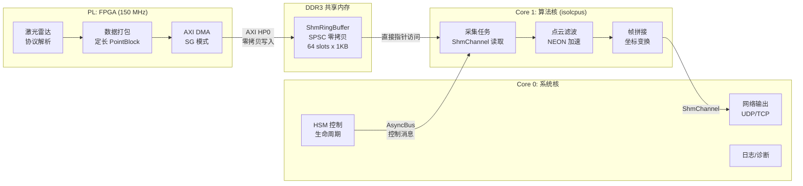
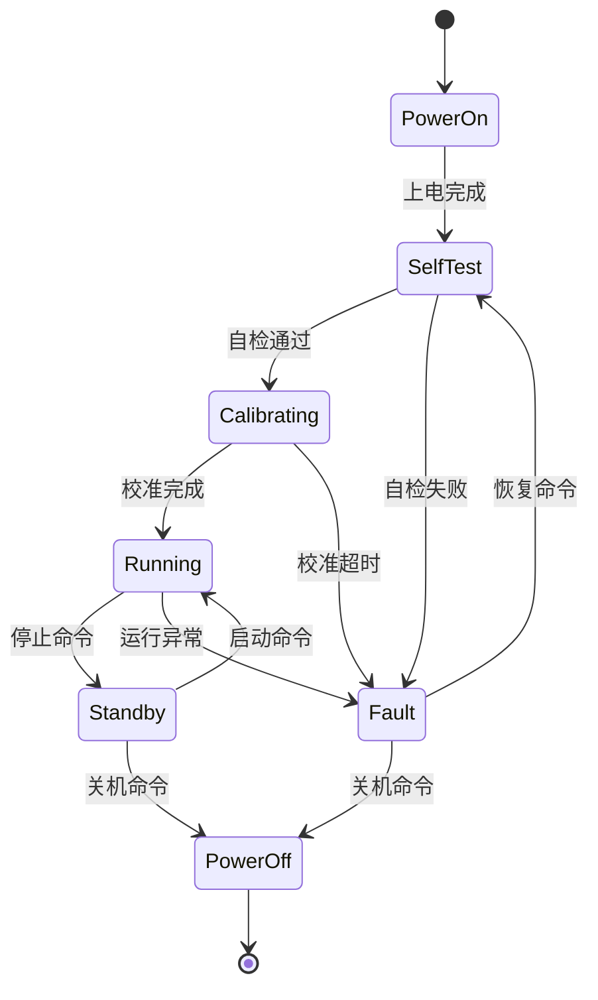

> 原文链接: [CSDN](https://blog.csdn.net/stallion5632/article/details/150849448)
>
> 参考: [UG585 - Zynq-7000 SoC TRM](https://docs.amd.com/r/en-US/ug585-zynq-7000-SoC-TRM),
> [newosp](https://github.com/DeguiLiu/newosp) v0.2.0,
> [newosp 激光雷达性能评估](docs/performance_analysis_lidar_zh.md)
>
> 适用场景: 30 万点/秒激光雷达数据采集与处理

---

## 1. 设计目标

Zynq-7000 (双核 Cortex-A9 @ 667 MHz) 上运行 Linux, 处理激光雷达 30 万点/秒数据流。PL (FPGA) 负责传感器接口和 DMA 搬运, PS (ARM) 负责点云算法处理和网络输出。

### 1.1 量化目标

| 编号 | 目标 | 量化指标 | 验证方法 |
|------|------|----------|----------|
| G-1 | 端到端延迟 | 单帧 P99 < 5 ms | 硬件时间戳 |
| G-2 | 数据吞吐 | >= 30 万点/秒 (4.8 MB/s) | 帧计数统计 |
| G-3 | 零拷贝 | PL DMA -> 算法: 0 次 memcpy | 代码审查 |
| G-4 | 零堆分配 | 热路径 malloc/free 调用 0 次 | 运行时 hook |
| G-5 | 连续运行 | 72h 零崩溃, 零 CRC 错误 | 长稳测试 |
| G-6 | 算力余量 | CPU 总负载 < 80% | RT 周期采样 |

### 1.2 硬件约束

| 项目 | 配置 |
|------|------|
| PS | 双核 Cortex-A9 @ 667 MHz, NEON VFPv3, 32 KB L1 I/D, 512 KB L2 |
| PL | Artix-7 逻辑, AXI DMA (SG 模式), 150 MHz 数据通路 |
| 内存 | 512 MB DDR3, 256 KB OCM |
| 互联 | AXI HP0 (64-bit, 150 MHz, 峰值 1.2 GB/s), ACP (Snoop 端口) |
| 数据格式 | 每点 16 B (x/y/z int16 + intensity + ring_id + timestamp) |

---

## 2. 带宽与算力分析

### 2.1 数据带宽预算

以 30 万点/秒, 16 B/点, 25 Hz 帧率计算:

| 环节 | 带宽 | 占 DDR 峰值 (4.26 GB/s) | 裕度 |
|------|------|:------------------------:|:----:|
| PL DMA 写入 | 4.8 MB/s | 0.11% | > 880x |
| CPU 读取处理 | 4.8 MB/s | 0.11% | > 880x |
| AXI HP 端口峰值 | 1.2 GB/s | -- | 参考上限 |
| 网络输出 | ~5 MB/s | 0.12% | 充足 |

> 带宽不是瓶颈。CPU 算法处理时间和调度抖动是端到端延迟的主导因素。

### 2.2 CPU 算力预算

| 任务 | 单帧耗时 | 帧率 25 Hz 占用率 | 部署核心 |
|------|:--------:|:-----------------:|----------|
| DMA 接收 + CRC 校验 | ~0.5 ms | 1.25% | Core 1 |
| 点云滤波 (NEON) | ~2 ms | 5% | Core 1 |
| 坐标变换 (NEON) | ~1 ms | 2.5% | Core 1 |
| 帧拼接 | ~0.5 ms | 1.25% | Core 1 |
| 网络发送 | ~1 ms | 2.5% | Core 0 |
| 系统服务 + 日志 | -- | ~10% | Core 0 |
| **Core 1 总计** | | **~10%** | 裕度充足 |
| **Core 0 总计** | | **~12.5%** | 裕度充足 |

> 即使点云处理耗时翻倍, CPU 负载仍低于 30%, 为 100 万点/秒 (64 线雷达) 留出余量。

---

## 3. 软硬协同架构

### 3.1 系统架构

### 3.2 控制面 / 数据面分离

| 平面 | 通道 | 消息类型 | 频率 | 说明 |
|------|------|----------|------|------|
| 数据面 | ShmChannel (SPSC) | 点云 PointBlock (1 KB/块) | 25 Hz | 零拷贝, Wait-free |
| 控制面 | AsyncBus (MPSC) | 启停/模式/参数 (< 256 B) | < 100 msg/s | 优先级准入 |

newosp 实测: AsyncBus 控制消息吞吐 5.9 M msg/s (x86), ARM 估算 0.5-1.0 M msg/s, 相对激光雷达 < 100 msg/s 的控制消息需求有 **5000x 以上裕度**。

---

## 4. 零拷贝数据通道

### 4.1 PL-PS 共享环形缓冲

利用 Zynq 的 AXI HP 端口, PL DMA 直接写入 DDR 中预分配的 ShmRingBuffer, CPU 通过指针直接访问:

**单 slot 结构** (1 KB, cache line 对齐):

| 字段 | 大小 | 说明 |
|------|------|------|
| seq | 4 B | 单调递增序列号 |
| timestamp_ns | 8 B | 硬件时间戳 |
| count + crc16 | 4 B | 点数 + CRC 校验 |
| points[62] | 992 B | 62 点 x 16 B (int16 x/y/z + intensity + ring_id) |

**内存占用**: 64 slots x 1 KB = 64 KB

### 4.2 AXI 端口选择

| 端口 | 特点 | 选择理由 |
|------|------|----------|
| **AXI HP0** (推荐) | 64-bit, Non-cacheable, 不干扰 CPU Cache | 数据量小, 带宽裕度 > 800x, 简单可靠 |
| AXI ACP | 硬件 Snoop, Cache Coherent | Snoop 流量干扰 CPU Cache, 低速场景收益不大 |

选择 HP0 + Non-cacheable 映射: 用 800x 带宽裕度换取零 cache 一致性代码, 与 Zynq-7000 双核 SMP 概要设计一致。

---

## 5. 实时调度与抗干扰

### 5.1 核心部署

使用 newosp RealtimeExecutor 确保 Core 1 的调度确定性:

| 措施 | 作用 |
|------|------|
| `isolcpus=1` | Core 1 从 Linux 调度器剥离 |
| `SCHED_FIFO` priority=90 | 实时调度, 不被普通进程抢占 |
| `mlockall` | 锁定内存页, 防止缺页中断 |
| Stack prefault | 预写栈页面, 避免首次 page fault |
| CPU affinity | 绑核, 保持 L1/L2 Cache 热度 |

### 5.2 newosp 模块映射

| 功能 | newosp 模块 | 部署 |
|------|------------|------|
| 数据接收 | ShmChannel (SpscRingBuffer) | Core 1, PL DMA -> CPU |
| 控制消息 | AsyncBus + Node | Core 0, HSM 驱动 |
| 实时调度 | RealtimeExecutor | Core 1, SCHED_FIFO |
| 系统任务 | WorkerPool | Core 0, 网络/日志 |
| 设备状态 | HSM | Core 0, Init/Ready/Active/Fault |
| 定时器 | TimerScheduler | Core 0, 心跳/看门狗 |
| 诊断通道 | SerialTransport | Core 0, 串口 CRC+ACK |
| 线程监控 | ThreadWatchdog | Core 0 |

---

## 6. NEON SIMD 优化策略

Cortex-A9 的 NEON VFPv3 是提升点云处理吞吐的关键:

### 6.1 定点化计算

| 方案 | 数据类型 | NEON 并行度 | 精度 | 推荐 |
|------|----------|:----------:|------|:----:|
| 浮点 | float32 | 4 路 | 无限制 | 否 |
| **定点** | **int16** | **8 路** | +/- 327.67 m, 1 cm | **是** |

激光雷达量程通常 < 200 m, 精度需求 1 cm, int16 (范围 +/- 327.67 m) 完全满足。NEON 并行度从 4 路 (float32) 提升到 8 路 (int16), 理论算力翻倍。

### 6.2 数据布局

| 布局 | 说明 | NEON 效率 | 适用 |
|------|------|:---------:|------|
| AoS (Array of Structs) | `{x,y,z,i}, {x,y,z,i}, ...` | 需 `vld4` 解交织 | DMA 写入默认格式 |
| SoA (Struct of Arrays) | `{x,x,x,...}, {y,y,y,...}` | 连续加载, 效率最高 | PL 可配置输出格式 |

**建议**: 若 PL 逻辑可修改, 优先输出 SoA 格式; 否则在 CPU 侧使用 `vld4.16` 解交织, 开销约 10%。

---

## 7. 设备生命周期

使用 newosp HSM 管理设备状态, 覆盖上电自检、激光器校准、正常运行、故障恢复全流程。

---

## 8. 资源预算

以 Zynq-7020 (512 MB DDR3) 为例:

| 资源 | newosp 框架 | 点云缓冲 | 算法 | Linux 系统 | 总计 |
|------|:-----------:|:--------:|:----:|:----------:|:----:|
| RAM | ~2 MB | ~3 MB | 10-50 MB | ~32 MB | < 90 MB |
| CPU | < 5% | -- | 10-20% | ~15% | < 40% |
| .text | ~80 KB | -- | 1-5 MB | ~8 MB | < 14 MB |

> 框架层资源占用极低, 为点云算法和未来扩展 (64 线雷达) 留出充足空间。

---

## 9. 可行性结论

| 维度 | 评估 | 裕度 |
|------|------|:----:|
| DDR 带宽 | 4.8 MB/s vs 4.26 GB/s | > 880x |
| CPU 算力 | ~22% vs 200% (双核) | > 8x |
| newosp 控制消息 | < 100 msg/s vs 500K msg/s (ARM) | > 5000x |
| 内存占用 | < 90 MB vs 512 MB | > 5x |

**结论**: Zynq-7000 + newosp 方案在所有维度上均满足 30 万点/秒激光雷达需求, 且有充足裕度。通过 NEON 定点化和 SoA 数据布局优化, 可进一步支持 100 万点/秒 (64 线雷达) 场景。

---

> 原文链接: [CSDN](https://blog.csdn.net/stallion5632/article/details/150849448)
