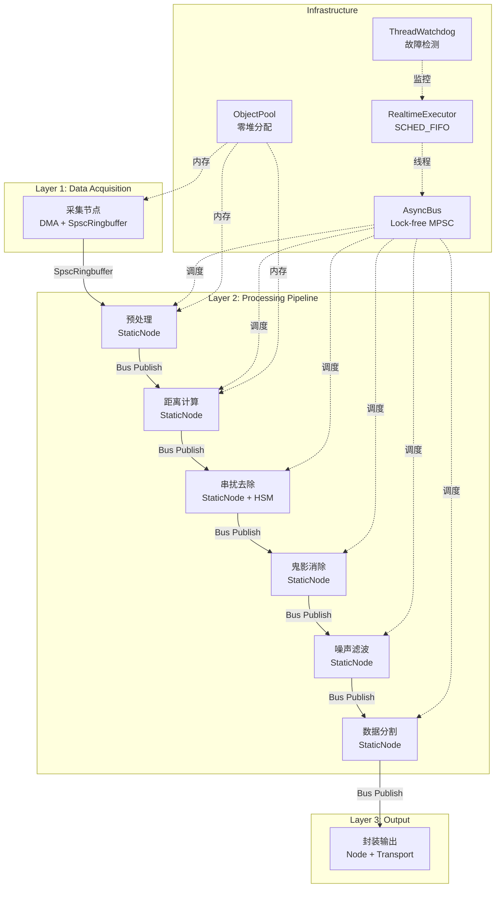
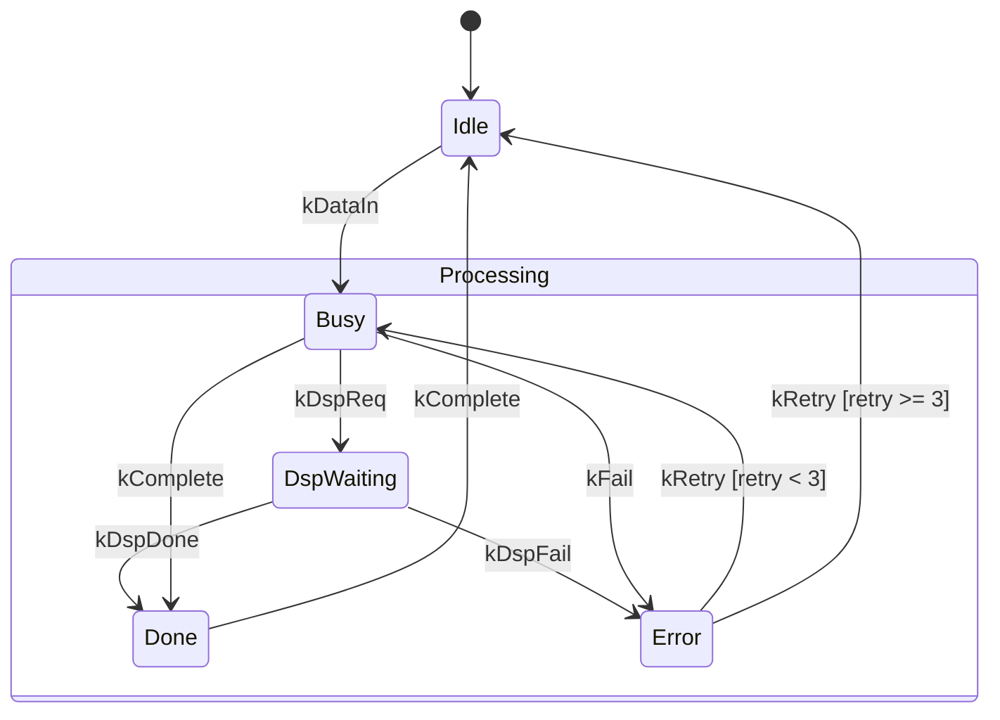

> 基础设施库: [newosp](https://github.com/DeguiLiu/newosp) v0.4.0 (1114 tests, ASan/TSan/UBSan clean)
> 目标平台: ARM-Linux (Cortex-A53/A72/A7) | C++17, Header-only
> 适用场景: 激光雷达点云处理、工业视觉、机器人传感器融合、边缘计算

---

## 1. 背景与问题域

### 1.1 高吞吐传感器数据的挑战

激光雷达等高吞吐传感器每秒产生数十万至数百万个数据点，典型的处理流水线包括:

```
采集 → 预处理 → 距离计算 → 串扰去除 → 鬼影消除 → 噪声滤波 → 分割 → 封装输出
```

这条 Pipeline 面临的核心工程挑战:

| 挑战 | 约束条件 | 典型指标 |
|------|----------|----------|
| 延迟 | 单帧处理须在传感器周期内完成 | < 10 ms (100 Hz) |
| 吞吐 | 全速率无丢帧 | 300K~1M points/s |
| 内存 | 嵌入式平台 RAM 有限 | < 100 KB 静态 + < 10 KB 堆 |
| 确定性 | 实时系统不可有不确定延迟 | 无堆分配、无锁竞争 |
| 可维护性 | 算法迭代频繁，模块需解耦 | 节点可独立替换 |

### 1.2 传统方案的局限

纯 C 语言 + QPC (Quantum Platform C) 风格的方案广泛用于 MCU/RTOS 平台:

- 每个 Node 是一个 QActive 主动对象，内部运行 switch-case 状态机
- 节点间通过 void* 事件队列传递数据
- 共享内存 + 手写 SPSC 环形缓冲实现零拷贝
- linker section (`__attribute__((section))`) 编译期插件注册

这种方案在 MCU 裸机上运行良好，但迁移到 ARM-Linux 后暴露多个问题:

1. **类型安全缺失**: `void*` 事件指针无编译期类型检查，强制转换错误只能在运行时发现
2. **手动生命周期管理**: 引用计数依赖人工维护，忘记释放导致泄漏，多释放导致 crash
3. **状态机维护困难**: 5+ 状态的 switch-case 随着需求增长变成数百行意大利面条代码
4. **测试基础设施薄弱**: 断言宏散落各处，无统一测试框架
5. **代码复用率低**: 每个项目重新实现环形缓冲、内存池、状态机

### 1.3 newosp 的定位

newosp 是为 ARM-Linux 工业嵌入式平台设计的 C++17 header-only 基础设施库，其核心模块可以**直接替代**传统 C Pipeline 方案中的每个组件:

| Pipeline 需求 | 传统 C/QPC 方案 | newosp 模块 |
|--------------|----------------|-------------|
| 节点间通信 | void* 事件队列 | `AsyncBus` (lock-free MPSC, 类型安全 variant) |
| 数据流节点 | QActive + switch-case | `Node` / `StaticNode` (Pub/Sub, 编译期分发) |
| 零拷贝传输 | 手写 SPSC ring buffer | `SpscRingbuffer` (wait-free, batch, FakeTSO) |
| 内存池 | 手写 free-list | `FixedPool` / `ObjectPool` (O(1), RAII) |
| 状态机 | 手写 switch-case | `HsmStateMachine` (LCA, guard, 零堆分配) |
| 实时调度 | 手动 pthread 配置 | `RealtimeExecutor` (SCHED_FIFO, mlockall) |
| 看门狗 | 手写心跳检测 | `ThreadWatchdog` + `FaultCollector` |
| 跨进程通信 | 手写 mmap/shm | `ShmTransport` (RAII, ARM 内存序) |

---

## 2. 架构总览

### 2.1 DAG Pipeline 与 newosp 模块映射



### 2.2 数据流设计

Pipeline 的核心数据流遵循**零拷贝**原则:

```
┌──────────────────────────────────────────────────────────────┐
│  DMA Buffer (SpscRingbuffer<PointCloud, 32>)                 │
│  ┌──────┐ ┌──────┐ ┌──────┐ ┌──────┐                       │
│  │Frame0│ │Frame1│ │Frame2│ │Frame3│  ...                    │
│  └──┬───┘ └──────┘ └──────┘ └──────┘                       │
│     │                                                        │
│     ▼ Peek() -- 零拷贝引用                                   │
│  AsyncBus::Publish(PoolHandle<PointCloud>)                   │
│     │                                                        │
│     ▼ ProcessBatchWith<Visitor>() -- 编译期分发               │
│  各处理节点读取 PoolHandle，处理后 Publish 到下游              │
│     │                                                        │
│     ▼ Discard() -- 处理完成后释放 ring buffer slot            │
└──────────────────────────────────────────────────────────────┘
```

---

## 3. 核心子系统设计

### 3.1 消息总线: 类型安全的零堆分配通信

传统 C 方案使用 `void*` 事件队列:

```c
// 传统 C: void* 无类型安全
typedef struct { QEvt super; void *buf; uint32_t len; } BigMsgEvt;
BigMsgEvt *e = Q_NEW(BigMsgEvt, BIGMSG_SIG);
e->buf = data_ptr;  // 类型丢失
QACTIVE_POST(target, &e->super, sender);
```

newosp 的 `AsyncBus` 用 `std::variant` + 模板参数化实现:

```cpp
// newosp: 编译期类型安全
struct PointCloud { uint32_t frame_id; float points[1024]; };
struct Processed  { uint32_t frame_id; float distances[1024]; };

using PipelinePayload = std::variant<PointCloud, Processed>;
using PipelineBus = osp::AsyncBus<PipelinePayload, 4096, 256>;

PipelineBus bus;

// 发布: 类型安全，编译期检查
bus.Publish(PointCloud{frame_id, {/* data */}});

// 消费: visitor 模式，编译期分发
struct PipelineVisitor {
  void operator()(const PointCloud& cloud) { /* 处理点云 */ }
  void operator()(const Processed& proc)   { /* 处理结果 */ }
};
bus.ProcessBatchWith<PipelineVisitor>(PipelineVisitor{});
// ~2 ns/msg, 15x faster than virtual dispatch
```

关键特性对比:

| 特性 | QPC void* 事件 | newosp AsyncBus |
|------|---------------|-----------------|
| 类型安全 | 运行时 (void* 强转) | 编译期 (variant + visitor) |
| 内存分配 | QF_POOL_GET (动态池) | SBO FixedFunction (栈内联, 32B) |
| 优先级 | 手动队列管理 | 内置 3 级入队控制 (60/80/99%) |
| 背压 | 无感知 | 4 级状态 (Normal/Warning/Critical/Full) |
| 批处理 | 逐条处理 | ProcessBatch(256) 批量消费 |
| 缓存友好 | 无保证 | 缓存行分离 producer/consumer 计数器 |

### 3.2 处理节点: 编译期绑定 vs 运行时分发

传统 C 方案的节点处理:

```c
// 传统 C: 运行时函数指针分发
void node_event_loop(Node *node) {
    while (1) {
        Event evt = node->wait_for_event();
        switch (node->current_state) {
            case STATE_IDLE:
                if (evt.type == EVT_DATA_IN) {
                    node->current_state = STATE_BUSY;
                    node_start_processing(node, evt.data);
                }
                break;
            // ... 5+ 状态, 10+ 事件类型
        }
    }
}
```

newosp 的 `StaticNode` 用模板参数绑定 Handler:

```cpp
// newosp: 编译期绑定，零间接调用，可内联
struct NoiseFilterHandler {
  void operator()(const PointCloud& cloud) {
    // 滤波算法，编译器可内联
    Processed result = apply_filter(cloud);
    bus_->Publish(std::move(result));
  }
  PipelineBus* bus_;
};

// Handler 类型作为模板参数，编译器生成直接调用代码
osp::StaticNode<PipelineBus, NoiseFilterHandler> noise_filter(bus, handler);
```

性能对比:

| 分发方式 | 延迟 | 可内联 |
|---------|------|--------|
| QPC 函数指针 | ~10 ns | 不可 |
| Node (FixedFunction) | ~30 ns | 不可 |
| **StaticNode (模板)** | **~2 ns** | **可** |

### 3.3 零拷贝: SPSC 环形缓冲

传统 C 方案需要手写 SPSC ring buffer:

```c
// 传统 C: 手写 SPSC, 30-50 行
typedef struct {
    volatile uint32_t head, tail;
    uint8_t buf[RING_SIZE];
} spsc_ring_t;
// 需要手动处理 memory barrier, cache line padding, wrap-around...
```

newosp 的 `SpscRingbuffer` 是完全参数化的:

```cpp
// newosp: 编译期配置，自动选择最优路径
using FrameRing = osp::SpscRingbuffer<PointCloud, 32, /*FakeTSO=*/false>;

FrameRing ring;

// 生产者 (DMA 回调)
ring.Push(PointCloud{frame_id, data});

// 消费者 (处理线程)
if (auto* frame = ring.Peek()) {
    process(*frame);      // 零拷贝读取
    ring.Discard();       // 处理完成后释放 slot
}

// 批量操作
ring.PushBatch(frames, count);   // 批量入队
ring.PopBatch(output, count);    // 批量出队
```

关键设计点:

| 特性 | 手写 SPSC | newosp SpscRingbuffer |
|------|----------|----------------------|
| 类型支持 | uint8_t 字节流 | 任意 `T` (trivially_copyable 快路径) |
| 内存序 | 手动 barrier | 自动 acquire/release (ARM 安全) |
| 单核模式 | 需修改源码 | `FakeTSO=true` 编译期切换 relaxed |
| 零拷贝 | 无 | `Peek()` / `At()` / `Discard()` |
| 批处理 | 无 | `PushBatch()` / `PopBatch()` |
| 缓存对齐 | 手动 padding | 自动 `alignas(64)` head/tail |

### 3.4 状态机: LCA 层次状态机 vs switch-case

传统 C 方案的状态管理:

```c
// 传统 C: switch-case 状态机
switch (node->current_state) {
    case STATE_IDLE:
        if (evt == EVT_DATA_IN) node->current_state = STATE_BUSY;
        break;
    case STATE_BUSY:
        if (evt == EVT_DSP_REQ) node->current_state = STATE_DSP_WAITING;
        if (evt == EVT_DONE) node->current_state = STATE_DONE;
        if (evt == EVT_FAIL) node->current_state = STATE_ERROR;
        break;
    // 随着状态和事件增长，复杂度 O(states * events)
}
```

newosp 的 `HsmStateMachine` 支持层次状态和自动转换路径:

```cpp
// newosp: LCA 层次状态机, 自动 entry/exit
enum class PipelineState : uint8_t {
  kIdle, kProcessing, kBusy, kDspWaiting, kDone, kError
};
enum class PipelineEvent : uint8_t {
  kDataIn, kDspReq, kDspDone, kDspFail, kComplete, kRetry
};

using PipelineHsm = osp::HsmStateMachine<PipelineState, PipelineEvent, 8>;
PipelineHsm hsm;

// 声明式状态层次
hsm.SetParent(PipelineState::kBusy, PipelineState::kProcessing);
hsm.SetParent(PipelineState::kDspWaiting, PipelineState::kProcessing);

// Entry/Exit 自动执行
hsm.OnEntry(PipelineState::kProcessing, [](auto&) {
  start_perf_timer();
});
hsm.OnExit(PipelineState::kProcessing, [](auto&) {
  record_perf_metrics();
});

// Guard 条件转换
hsm.AddTransition(PipelineState::kError, PipelineEvent::kRetry,
                   PipelineState::kBusy,
                   [](auto& ctx) { return ctx.retry_count < 3; });

// 事件分发: LCA 自动计算 entry/exit 路径
hsm.Dispatch(PipelineEvent::kDataIn);
```



### 3.5 内存池: RAII 自动管理

```cpp
// 传统 C: 手动 alloc/free, 容易泄漏
void *buf = rt_mp_alloc(pool, RT_WAITING_FOREVER);
memcpy(buf, src, len);
// ... 忘记 rt_mp_free(buf) = 内存泄漏

// newosp: RAII, ObjectPool 自动管理
osp::ObjectPool<PointCloud, 64> pool;
auto* cloud = pool.Create(frame_id, data);  // placement new
// ... 处理完成
pool.Destroy(cloud);  // placement delete + 归还 slot

// 更安全: CreateChecked 返回 expected
auto result = pool.CreateChecked(frame_id, data);
if (result.has_value()) {
    // 使用 result.value()
}
```

### 3.6 实时调度与看门狗

```cpp
// 配置实时调度器
osp::RealtimeConfig rt_cfg;
rt_cfg.sched_policy = SCHED_FIFO;
rt_cfg.sched_priority = 80;
rt_cfg.lock_memory = true;
rt_cfg.cpu_affinity = 0x02;  // 绑定 CPU1

osp::RealtimeExecutor<PipelineBus> executor(bus, rt_cfg);

// 看门狗监控所有处理节点
osp::ThreadWatchdog<8> watchdog;
watchdog.SetTimeout(100);  // 100ms 超时
watchdog.OnTimeout([](uint32_t thread_id) {
    osp::FaultCollector::Report(0x01010001, thread_id);
});
```

---

## 4. 跨核/跨进程扩展

### 4.1 共享内存 IPC

当 Pipeline 的采集和处理运行在不同进程时，newosp 的 `ShmTransport` 提供零拷贝 IPC:

```cpp
// 进程 A: 采集
osp::ShmChannel<PointCloud, 32> channel("lidar_raw", osp::ShmMode::kCreateOrReplace);
channel.Write(PointCloud{frame_id, data});

// 进程 B: 处理
osp::ShmChannel<PointCloud, 32> channel("lidar_raw", osp::ShmMode::kOpen);
if (auto* cloud = channel.Read()) {
    process(*cloud);
}
```

关键特性:
- RAII `SharedMemorySegment`: 自动 mmap/munmap
- Lock-free `ShmRingBuffer`: SPSC，ARM acquire/release 内存序
- `CreateOrReplace` 模式: 进程崩溃后自动清理残留 `/dev/shm/osp_shm_*`
- 缓存行 padding: 隔离 head/tail 避免 false sharing

### 4.2 串口传输

工业场景中部分传感器通过 RS-485/RS-232 连接:

```cpp
osp::SerialTransport<4096> serial;
osp::SerialTransport<4096>::Config cfg;
cfg.device = "/dev/ttyS1";
cfg.baudrate = 460800;

serial.Start(cfg);
serial.Send(frame_data, frame_size);  // CRC16 自动计算
// 帧同步状态机: kWaitMagic -> kWaitHeader -> kWaitPayload -> kWaitCrc
```

---

## 5. 调试与监控

### 5.1 Shell 诊断命令

newosp 的 `shell_commands.hpp` 提供零侵入诊断桥接:

```cpp
// 一行代码注册 Bus 统计命令
osp::shell_cmd::RegisterBus(bus, "pipeline");

// telnet/Console/UART 中执行
// osp> osp_bus
// [osp_bus] pipeline
//   Published: 12345  Processed: 12340  Dropped: 5
//   Backpressure: Normal  Queue: 23/4096
```

13 个内置诊断命令覆盖: 看门狗、故障、总线统计、工作线程池、传输层、串口、HSM 节点、服务、发现、生命周期、QoS、内存池。

三种后端:
- **DebugShell**: TCP telnet (远程调试)
- **ConsoleShell**: stdin/stdout (本地终端)
- **UartShell**: 串口 (工业现场)

### 5.2 全链路追踪

```cpp
// 数据包携带帧号和时间戳
struct PipelineFrame {
  uint32_t frame_id;
  uint64_t timestamp_ns;  // osp::SteadyNowNs()
  float points[1024];
};

// Transport v1 帧头自带 seq_num + timestamp_ns
// SequenceTracker 自动检测丢包、乱序、重复
osp::SequenceTracker tracker;
tracker.Track(seq_num);
// tracker.TotalReceived(), tracker.TotalLost()
```

---

## 6. 方案对比

### 6.1 综合对比表

| 维度 | 纯 C / QPC | newosp C++17 |
|------|-----------|--------------|
| **语言标准** | C11 | C++17 |
| **类型安全** | void* 强转 | std::variant + visitor |
| **内存管理** | 手动 alloc/free | RAII (ObjectPool, ScopeGuard) |
| **编译期配置** | #define 宏 | 模板参数 (QueueDepth, BatchSize, MaxStates) |
| **状态机** | switch-case (扁平) | LCA HSM (层次, guard, entry/exit) |
| **环形缓冲** | 手写 (~50 行) | SpscRingbuffer (wait-free, batch, 零拷贝) |
| **消息通信** | 函数指针 + void* | AsyncBus (MPSC, 优先级, 背压) |
| **节点分发** | 函数指针 (~10 ns) | StaticNode 模板 (~2 ns, 可内联) |
| **测试** | 手写断言 | Catch2 (1114 tests, 26085 assertions) |
| **Sanitizer** | 无 | ASan + TSan + UBSan 全绿 |
| **代码复用** | 每项目重写 | header-only, FetchContent 集成 |
| **平台适配** | 平台相关 #ifdef | OSP_HAS_NETWORK 自动检测 + poll() fallback |

### 6.2 代码量对比

以"带优先级的事件分发 + SPSC 零拷贝 + 状态机"最小集为例:

| 组件 | 纯 C 手写 (行) | newosp 集成 (行) |
|------|---------------|-----------------|
| SPSC ring buffer | ~80 | 0 (SpscRingbuffer) |
| 内存池 | ~60 | 0 (ObjectPool) |
| 事件队列 + 优先级 | ~120 | 0 (AsyncBus) |
| 状态机 | ~100 | 0 (HsmStateMachine) |
| 看门狗 | ~40 | 0 (ThreadWatchdog) |
| **应用层 Pipeline 逻辑** | ~200 | **~200** |
| **合计** | **~600** | **~200** |

应用层逻辑相同，但基础设施从 ~400 行手写代码变为零行 (全部由 newosp header-only 模块提供)。

### 6.3 资源预算

基于 ARM Cortex-A53 (1.2 GHz, 512 KB L2 Cache) 的典型部署:

| 资源 | 纯 C/QPC 方案 | newosp 方案 |
|------|-------------|-------------|
| 静态内存 | ~80 KB | ~100 KB (variant 略大) |
| 堆分配 | 可能存在 | **零** (热路径) |
| 线程数 | 2-4 (手动管理) | 2-4 (Executor 管理) |
| 单消息延迟 | ~10 ns (函数指针) | ~2 ns (StaticNode 内联) |
| Bus 吞吐 | ~5M msg/s | ~8M msg/s (CAS + batch) |
| 编译产物 | ~50 KB (.text) | ~60 KB (.text, 模板实例化) |

---

## 7. 部署示例: 激光雷达点云处理

```cpp
#include "osp/bus.hpp"
#include "osp/static_node.hpp"
#include "osp/executor.hpp"
#include "osp/spsc_ringbuffer.hpp"
#include "osp/mem_pool.hpp"
#include "osp/hsm.hpp"
#include "osp/watchdog.hpp"
#include "osp/shell.hpp"
#include "osp/shell_commands.hpp"

// 1. 定义数据类型
struct RawFrame   { uint32_t id; float points[1024]; };
struct Filtered   { uint32_t id; float points[1024]; };

using Payload = std::variant<RawFrame, Filtered>;
using Bus = osp::AsyncBus<Payload, 4096, 256>;

// 2. 定义处理 Handler
struct NoiseFilterHandler {
  Bus* bus;
  void operator()(const RawFrame& raw) {
    Filtered out{raw.id, {}};
    // ... 滤波算法 ...
    bus->Publish(std::move(out));
  }
  void operator()(const Filtered&) { /* 忽略已处理数据 */ }
};

int main() {
  Bus bus;

  // 3. 创建节点
  NoiseFilterHandler handler{&bus};
  osp::StaticNode<Bus, NoiseFilterHandler> filter_node(bus, handler);

  // 4. 实时调度
  osp::RealtimeExecutor<Bus> executor(bus, osp::RealtimeConfig{
    .sched_priority = 80,
    .lock_memory = true,
    .cpu_affinity = 0x02
  });

  // 5. 看门狗
  osp::ThreadWatchdog<4> watchdog;
  osp::shell_cmd::RegisterWatchdog(watchdog);

  // 6. 调试 Shell
  osp::ConsoleShell console;
  osp::shell_cmd::RegisterBus(bus, "pipeline");
  console.Start();

  // 7. 模拟数据输入
  for (uint32_t i = 0; i < 10000; ++i) {
    bus.Publish(RawFrame{i, {/* sensor data */}});
  }
  bus.ProcessBatchWith<NoiseFilterHandler>(handler);

  return 0;
}
```

---

## 8. 总结

1. **类型安全替代 void***: newosp 用 `std::variant` + visitor 模式实现编译期类型检查，消除传统 C 方案中 `void*` 强转导致的运行时错误。

2. **零堆分配热路径**: `AsyncBus` 的 FixedFunction SBO (32B)、`SpscRingbuffer` 的栈内分配、`ObjectPool` 的 O(1) 固定块池，确保 Pipeline 热路径无 malloc/free。

3. **编译期分发**: `StaticNode` 模板参数化 Handler 类型，编译器可将消息分发内联，延迟从 ~10 ns 降至 ~2 ns。

4. **层次状态机**: `HsmStateMachine` 的 LCA 自动转换路径、guard 条件和 entry/exit 回调，比手写 switch-case 更易维护，且状态数不影响分发性能 (O(depth) vs O(states))。

5. **工程化保障**: 1114 个 Catch2 测试用例 + ASan/TSan/UBSan 全绿 + CI 自动化验证，传统 C 方案难以达到同等覆盖率。

6. **渐进式采用**: newosp 是 header-only + FetchContent，可逐模块引入现有项目，不需要一次性重写。

---

## 参考

- [newosp GitHub](https://github.com/DeguiLiu/newosp) -- C++17 header-only 嵌入式基础设施库
- [newosp 设计文档](https://github.com/DeguiLiu/newosp/blob/main/docs/design_zh.md) -- 完整架构设计
- QP/C Framework -- 量子平台 C 事件驱动框架
- CyberRT / ROS2 -- 机器人中间件参考架构
