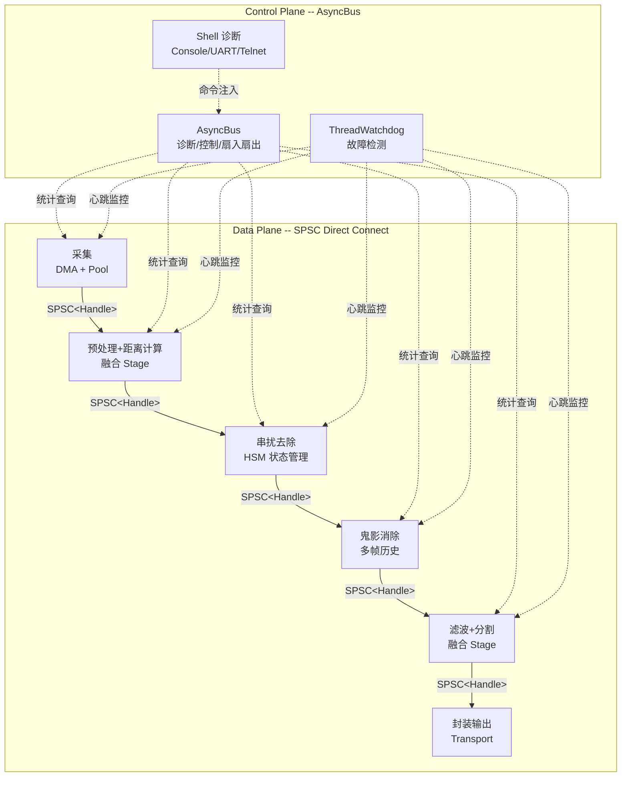
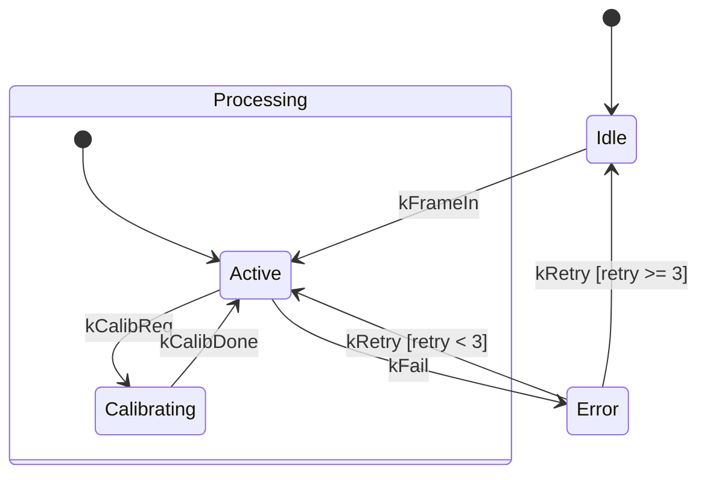

> 基础设施库: [newosp](https://github.com/DeguiLiu/newosp) v0.4.3 (1153 tests, ASan/TSan/UBSan clean)
> 目标平台: ARM-Linux (Cortex-A53/A72/A7) | C++17, Header-only
> 适用场景: 激光雷达点云处理、工业视觉、机器人传感器融合、边缘计算

---

## 1. 背景与问题域

### 1.1 高吞吐传感器数据的挑战

激光雷达等高吞吐传感器每秒产生数十万至数百万个数据点，典型的处理流水线包括:

```
采集 → 预处理 → 距离计算 → 串扰去除 → 鬼影消除 → 噪声滤波 → 分割 → 封装输出
```

这条 Pipeline 面临的核心工程挑战:

| 挑战 | 约束条件 | 典型指标 |
|------|----------|----------|
| 延迟 | 单帧处理须在传感器周期内完成 | < 10 ms (100 Hz) |
| 吞吐 | 全速率无丢帧 | 300K~1M points/s |
| 内存带宽 | ARM Cortex-A53 LPDDR4 ~6.4 GB/s | 数据面零拷贝 |
| 内存占用 | 嵌入式平台 RAM 有限 | < 100 KB 静态 + 零堆分配 |
| 确定性 | 实时系统不可有不确定延迟 | 无 malloc、无锁竞争 |
| 可维护性 | 算法迭代频繁，模块需解耦 | 节点可独立替换 |

### 1.2 传统方案的局限

纯 C 语言 + QPC (Quantum Platform C) 风格的方案广泛用于 MCU/RTOS 平台:

- 每个 Node 是一个 QActive 主动对象，内部运行 switch-case 状态机
- 节点间通过 void* 事件队列传递数据
- 共享内存 + 手写 SPSC 环形缓冲实现零拷贝
- linker section (`__attribute__((section))`) 编译期插件注册

这种方案在 MCU 裸机上运行良好，但迁移到 ARM-Linux 后暴露多个问题:

1. **类型安全缺失**: `void*` 事件指针无编译期类型检查，强制转换错误只能在运行时发现
2. **手动生命周期管理**: 引用计数依赖人工维护，忘记释放导致泄漏，多释放导致 crash
3. **状态机维护困难**: 5+ 状态的 switch-case 随着需求增长变成数百行意大利面条代码
4. **测试基础设施薄弱**: 断言宏散落各处，无统一测试框架
5. **代码复用率低**: 每个项目重新实现环形缓冲、内存池、状态机

---

## 2. 架构总览: 数据面与控制面分离

本 Pipeline 采用 **数据面与控制面分离** 架构。控制面/数据面分离的通用设计原理、AsyncBus MPSC 消息总线、ShmChannel 零拷贝通道、RealtimeExecutor 实时调度等基础设施的详细介绍参见 [工业嵌入式流式数据处理架构设计](../Streaming_Architecture_Design/)。本节聚焦激光雷达 Pipeline 的具体拓扑设计。

**核心原则**: Pipeline 每个 stage 的 producer/consumer 关系是 1:1，MPSC 的 CAS 竞争在此场景下是多余开销。数据面用 SPSC 直连 (~5 ns)，控制面用 AsyncBus 处理诊断和扇入/扇出场景。

### 2.1 Pipeline 架构图



原始 8 个 stage 经过**融合优化**减至 5 个:
- **PreCalc**: 预处理 + 距离计算 (连续数学运算，无状态切换)
- **FilterSeg**: 噪声滤波 + 数据分割 (都是逐点操作)
- **XTalk**: 串扰去除 (需 HSM 状态管理，独立)
- **Ghost**: 鬼影消除 (需多帧历史缓冲，独立)

### 2.2 数据流: Handle 传递实现真零拷贝

传统方案声称"零拷贝"但实际每个 stage 都在拷贝整帧数据。以 1024 点帧 (16 KB SoA) 为例:

| 方案 | 每帧拷贝量 | 5 stage x 100 Hz | 内存带宽 |
|------|-----------|------------------|----------|
| variant 逐级拷贝 | 16 KB x 5 = 80 KB | 8 MB/s | ~1.3% LPDDR4 |
| **Handle 传递** | **6B x 5 = 30B** | **3 KB/s** | **~0%** |

Handle 传递的核心: SPSC ring buffer 只传递 6 字节的 `FrameHandle`，数据本体始终留在 `ObjectPool` 中，各 stage 通过 index 原地读写:

```cpp
// Handle: 仅 6 字节，在 SPSC 中传递
struct FrameHandle {
  uint16_t pool_index;    // ObjectPool 中的槽位
  uint32_t frame_id;      // 帧号 (全链路追踪)
};

// 数据本体: 留在 Pool 中，各 stage 原地读写
using FramePool = osp::ObjectPool<PointCloudSoA, 32>;  // 32 帧预分配
using StageRing = osp::SpscRingbuffer<FrameHandle, 32>; // 每 slot 仅 6B

// stage 间传递 Handle，不拷贝数据
StageRing acq_to_precalc;
StageRing precalc_to_xtalk;
StageRing xtalk_to_ghost;
// ...
```

数据流时序:

```
┌──────────────────────────────────────────────────────────────┐
│ 1. 采集: pool.Create() → 获得 PointCloudSoA* (pool_index=3) │
│ 2. DMA 直接写入 pool[3].x[], pool[3].y[], pool[3].z[]       │
│ 3. Push(FrameHandle{3, frame_id}) 到 acq_to_precalc SPSC    │
│ 4. PreCalc: Peek() 取 Handle → pool[3] 原地距离计算         │
│ 5. Push(Handle{3, ...}) 到 precalc_to_xtalk SPSC            │
│ 6. ... 各 stage 通过 Handle 访问同一块内存 ...                │
│ 7. 最后一个 stage 完成后: pool.Destroy(pool[3])              │
└──────────────────────────────────────────────────────────────┘
```

---

## 3. 数据布局: SoA 替代 AoS

### 3.1 为什么 AoS 不适合点云处理

传统 AoS (Array of Structures) 布局:

```cpp
// AoS: 每个点的 x/y/z/intensity 连续存储
struct Point { float x, y, z, intensity; };
struct RawFrame { uint32_t id; Point points[1024]; };  // 16 KB
```

距离计算 `d = sqrt(x*x + y*y + z*z)` 遍历所有点的 x 分量时，每次加载一个 cache line (64B) 只取到 4 个 float 中的 1 个 (利用率 25%)。对 ARM NEON 来说，`vld1q_f32` 加载的 4 个 float 分属 4 个不同的点，无法直接做 SIMD 运算。

### 3.2 SoA 布局

```cpp
// SoA: 同一分量连续存储，NEON 友好
struct PointCloudSoA {
  uint32_t frame_id;
  uint32_t count;                       // 有效点数
  alignas(16) float x[1024];            // NEON vld1q_f32 连续加载 4 个 x
  alignas(16) float y[1024];
  alignas(16) float z[1024];
  alignas(16) float intensity[1024];
  uint64_t timestamp_ns;                // osp::SteadyNowNs()
};
// sizeof = 16400B, alignas(16) 确保 NEON 对齐加载
```

SoA 下距离计算用 NEON intrinsics:

```cpp
#include <arm_neon.h>

void ComputeDistance(PointCloudSoA& cloud) {
  for (uint32_t i = 0; i < cloud.count; i += 4) {
    float32x4_t vx = vld1q_f32(&cloud.x[i]);
    float32x4_t vy = vld1q_f32(&cloud.y[i]);
    float32x4_t vz = vld1q_f32(&cloud.z[i]);

    // d^2 = x*x + y*y + z*z
    float32x4_t d2 = vmlaq_f32(vmlaq_f32(vmulq_f32(vx, vx),
                                           vy, vy), vz, vz);
    // d = 1/sqrt(d^2) * d^2 = sqrt(d^2), 用 vrsqrteq 近似
    float32x4_t inv = vrsqrteq_f32(d2);
    float32x4_t dist = vmulq_f32(d2, inv);

    vst1q_f32(&cloud.intensity[i], dist);  // in-place 覆写
  }
}
```

性能对比 (Cortex-A53 @ 1.2 GHz, 1024 points):

| 布局 | Cache line 利用率 | NEON 加速 | 单帧耗时 |
|------|------------------|-----------|----------|
| AoS + 标量 | 25% | 无 | ~12 us |
| **SoA + NEON** | **100%** | **4x** | **~3 us** |

### 3.3 In-place 处理

SoA 布局的另一个优势: 多个 stage 可以**原地修改同一个 buffer**，避免格式转换拷贝:

```cpp
// 串扰去除: 原地修改 intensity
void RemoveCrosstalk(PointCloudSoA& cloud) {
  for (uint32_t i = 0; i < cloud.count; ++i) {
    cloud.intensity[i] -= crosstalk_table[i];  // in-place
  }
}

// 噪声滤波: 原地修改 x/y/z
void FilterNoise(PointCloudSoA& cloud) {
  // median filter on x[], y[], z[] -- in-place
}
```

不需要 `RawFrame → Processed → Filtered` 的类型转换链，所有 stage 操作同一个 `PointCloudSoA`。

---

## 4. 核心子系统设计

### 4.1 SPSC 直连: 数据面通信

每对相邻 stage 之间用一个 `SpscRingbuffer<FrameHandle, N>` 直连:

```cpp
// stage 间 SPSC 直连，每 slot 仅 6B
using StageRing = osp::SpscRingbuffer<FrameHandle, 32, /*FakeTSO=*/false>;

// 生产者 stage
void PreCalcStage::Process() {
  if (auto* handle = input_.Peek()) {      // 零拷贝读取 Handle
    auto& cloud = pool_[handle->pool_index];
    ComputeDistance(cloud);                 // 原地处理
    output_.Push(*handle);                 // 6B Handle 传递
    input_.Discard();                      // 释放上游 slot
  }
}

// 消费者 stage
void XTalkStage::Process() {
  if (auto* handle = input_.Peek()) {
    auto& cloud = pool_[handle->pool_index];
    RemoveCrosstalk(cloud);
    output_.Push(*handle);
    input_.Discard();
  }
}
```

SPSC vs MPSC Bus 性能对比 (Cortex-A53 @ 1.2 GHz, Handle 传递):

| 通信方式 | 单消息延迟 | 操作 | 适用场景 |
|---------|-----------|------|---------|
| **SPSC (FrameHandle)** | **~5 ns** | load/store + acquire/release | **1:1 stage 直连** |
| Bus (variant Publish) | ~30 ns | CAS + variant visit + callback | 扇入/扇出/控制面 |
| Bus (ProcessBatchWith) | ~2 ns/msg (批量均摊) | 同上，batch=256 均摊 | 高吞吐广播 |

> 性能数据测试条件: Cortex-A53 1.2 GHz, GCC 12 -O2, 单线程 benchmark, 10M 次迭代取中位数。SPSC 传递 6B FrameHandle; Bus 传递 8B variant (最小 payload)。实际 payload 越大差距越大。

### 4.2 AsyncBus: 控制面与扇入/扇出

AsyncBus 不用于线性 Pipeline 数据面，但在多传感器扇入和诊断命令注入场景不可替代。AsyncBus 的 Lock-free MPSC 设计、零堆分配机制、优先级准入控制的完整介绍参见 [工业嵌入式流式数据处理架构设计 -- AsyncBus](../Streaming_Architecture_Design/#3-控制面-asyncbus-消息总线)。

在激光雷达 Pipeline 中，AsyncBus 的典型用法:

- **多传感器扇入**: 多个激光雷达传感器各自 Publish 到同一 Bus，融合节点统一 ProcessBatch
- **诊断命令注入**: Shell 通过 Bus 下发运行时参数调整 (如滤波阈值)，Pipeline stage 定期 ProcessBatchWith 检查

### 4.3 层次状态机: 有状态 Stage 的管理

并非所有 stage 都是无状态的逐点处理。串扰去除需要维护校准状态，故障恢复需要重试逻辑。HSM 的通用设计 (LCA 转换、Guard 条件、Entry/Exit) 和 HSM + BT 组合模式参见 [工业嵌入式流式数据处理架构设计 -- 状态管理](../Streaming_Architecture_Design/#6-状态管理-层次状态机-hsm)。

在激光雷达串扰去除 stage 中，HSM 的具体应用:

```cpp
enum class XTalkState : uint8_t {
  kIdle, kProcessing, kCalibrating, kError
};
enum class XTalkEvent : uint8_t {
  kFrameIn, kCalibReq, kCalibDone, kFail, kRetry
};

using XTalkHsm = osp::HsmStateMachine<XTalkState, XTalkEvent, 8>;
XTalkHsm hsm;

// 声明式状态层次
hsm.SetParent(XTalkState::kCalibrating, XTalkState::kProcessing);

// Guard 条件: 重试不超过 3 次
hsm.AddTransition(XTalkState::kError, XTalkEvent::kRetry,
                   XTalkState::kProcessing,
                   [](auto& ctx) { return ctx.retry_count < 3; });

// Entry/Exit 自动性能计时
hsm.OnEntry(XTalkState::kProcessing, [](auto&) { start_perf_timer(); });
hsm.OnExit(XTalkState::kProcessing, [](auto&) { record_perf_metrics(); });
```



HSM 声明式转换替代 switch-case 后，新增状态只需添加一行 `AddTransition`，维护复杂度从 O(states x events) 降至 O(transitions)。

### 4.4 内存池: ObjectPool + Handle 模式

```cpp
// 预分配 32 帧 PointCloudSoA，零堆分配
using FramePool = osp::ObjectPool<PointCloudSoA, 32>;
FramePool pool;

// 采集 stage: 分配帧
auto* cloud = pool.Create();  // O(1), placement new
uint16_t idx = pool.IndexOf(cloud);

// DMA 直接写入 pool 槽位
dma_transfer(sensor_fd, cloud->x, cloud->count * sizeof(float));
// ...

// 构造 Handle 送入 SPSC
FrameHandle handle{idx, frame_id};
acq_to_precalc.Push(handle);

// 最后一个 stage: 释放帧
pool.Destroy(&pool[handle.pool_index]);  // O(1), placement delete
```

### 4.5 实时调度与看门狗

RealtimeExecutor 的 SCHED_FIFO + isolcpus + mlockall 设计详见 [工业嵌入式流式数据处理架构设计 -- 调度层](../Streaming_Architecture_Design/#5-调度层-realtimeexecutor-与-workerpool)。以下是激光雷达 Pipeline 的具体线程分配:

```cpp
// Stage 线程分配 (4 核 Cortex-A53)
// CPU0: 采集 (DMA 中断亲和)
// CPU1: PreCalc + XTalk (融合，计算密集)
// CPU2: Ghost + FilterSeg (融合，内存密集)
// CPU3: 封装输出 + Shell 诊断

// 看门狗监控每个 stage 线程
osp::ThreadWatchdog<8> watchdog;
watchdog.SetTimeout(50);  // 50ms 超时 (100Hz 帧率的半周期)
watchdog.OnTimeout([](uint32_t thread_id) {
    osp::FaultCollector::Report(0x01010001, thread_id);
});
```

---

## 5. 流水线并行

### 5.1 串行 vs 并行

如果所有 stage 运行在同一线程上，单帧处理链是串行的:

```
时间 →  T0        T1        T2
线程0: [ACQ+PRE+XTALK+GHOST+FILT+PKG][F0]
                             [ACQ+PRE+XTALK+GHOST+FILT+PKG][F1]
                                                      [ACQ+PRE+...][F2]
```

单帧耗时 = 所有 stage 之和。如果总耗时接近 10ms 预算 (100 Hz)，没有余量。

### 5.2 多级流水线并行

每个 stage 一个线程 + SPSC 直连，不同 stage 处理不同帧:

```
时间 →  T0      T1      T2      T3      T4
线程0: ACQ[F0] ACQ[F1] ACQ[F2] ACQ[F3] ACQ[F4]
线程1:         PRE[F0] PRE[F1] PRE[F2] PRE[F3]
线程2:                 XTK[F0] XTK[F1] XTK[F2]
线程3:                         PKG[F0] PKG[F1]
```

帧延迟增加 (从 1 帧变为 N 帧，N = stage 数)，但**吞吐翻倍**: 稳态下每个时间单位输出 1 帧，瓶颈取决于最慢的 stage 而非总和。

对于激光雷达等非交互式场景，3-4 帧延迟 (30-40 ms @ 100 Hz) 完全可接受。

### 5.3 Stage 融合减少线程数

4 核 Cortex-A53 不适合 8 个线程。通过算法依赖分析融合 stage:

| 原始 Stage | 融合策略 | 原因 |
|-----------|---------|------|
| 预处理 + 距离计算 | **融合为 PreCalc** | 连续数学运算，无外部状态 |
| 噪声滤波 + 数据分割 | **融合为 FilterSeg** | 都是逐点操作，数据局部性好 |
| 串扰去除 | **独立** | 需 HSM 状态管理，有校准流程 |
| 鬼影消除 | **独立** | 需多帧历史缓冲 |

融合后 5 个 stage + 1 个控制线程 = 4 个数据面线程 + 1 控制线程，映射到 4 核:

```
CPU0: 采集 stage (DMA 中断亲和)
CPU1: PreCalc + XTalk (绑核，计算密集型)
CPU2: Ghost + FilterSeg (绑核，内存密集型)
CPU3: 封装输出 + Shell 诊断 (控制面)
```

---

## 6. 调试与监控

### 6.1 Shell 诊断命令

newosp 的 `shell_commands.hpp` 提供零侵入诊断桥接:

```cpp
// 一行代码注册诊断命令
osp::shell_cmd::RegisterWatchdog(watchdog);
osp::shell_cmd::RegisterPool(pool, "frame_pool");

// Console/UART/Telnet 中执行
// osp> osp_watchdog
// [osp_watchdog] 4 threads monitored, 0 timeouts
// osp> osp_pool
// [osp_pool] frame_pool: 28/32 available, 4 in-use
```

13 个内置诊断命令覆盖: 看门狗、故障、总线统计、工作线程池、传输层、串口、HSM 节点、服务、发现、生命周期、QoS、内存池。

三种后端:
- **DebugShell**: TCP telnet (远程调试, `#if OSP_HAS_NETWORK`)
- **ConsoleShell**: stdin/stdout (本地终端, 始终可用)
- **UartShell**: 串口 (工业现场, 始终可用)

### 6.2 全链路追踪

每个 `FrameHandle` 携带 `frame_id`，各 stage 可记录处理时间:

```cpp
struct StageMetrics {
  uint32_t processed_count = 0;
  uint64_t total_ns = 0;
  uint64_t max_ns = 0;

  void Record(uint64_t elapsed_ns) {
    ++processed_count;
    total_ns += elapsed_ns;
    if (elapsed_ns > max_ns) max_ns = elapsed_ns;
  }

  uint64_t AvgNs() const {
    return processed_count > 0 ? total_ns / processed_count : 0;
  }
};
```

---

## 7. 方案对比

| 维度 | 纯 C / QPC | newosp C++17 (本文方案) |
|------|-----------|------------------------|
| **数据面通信** | void* 事件队列 (MPSC) | SPSC 直连 + Handle (1:1 专用) |
| **控制面通信** | 同上 (混用) | AsyncBus (MPSC, 仅扇入/扇出/诊断) |
| **零拷贝** | 手写引用计数 | Handle 传递 (6B), 数据原地读写 |
| **数据布局** | AoS | SoA (NEON 友好, alignas(16)) |
| **类型安全** | void* 强转 | std::variant + visitor (控制面) |
| **内存管理** | 手动 alloc/free | ObjectPool RAII (O(1) 固定块) |
| **状态机** | switch-case (扁平) | LCA HSM (层次, guard, entry/exit) |
| **编译期配置** | #define 宏 | 模板参数 (QueueDepth, MaxStates) |
| **流水线并行** | 手动 pthread | Stage-per-thread + CPU 绑核 |
| **测试** | 手写断言 | Catch2 (1153 tests) |
| **Sanitizer** | 无 | ASan + TSan + UBSan 全绿 |

---

## 8. 部署示例

```cpp
#include "osp/spsc_ringbuffer.hpp"
#include "osp/mem_pool.hpp"
#include "osp/hsm.hpp"
#include "osp/bus.hpp"
#include "osp/watchdog.hpp"
#include "osp/shell.hpp"
#include "osp/shell_commands.hpp"
#include "osp/platform.hpp"

// SoA 点云数据
struct PointCloudSoA {
  uint32_t frame_id;
  uint32_t count;
  alignas(16) float x[1024];
  alignas(16) float y[1024];
  alignas(16) float z[1024];
  alignas(16) float intensity[1024];
  uint64_t timestamp_ns;
};

// Handle: 仅 6 字节在 SPSC 中流转
struct FrameHandle {
  uint16_t pool_index;
  uint32_t frame_id;
};

// 基础设施
using FramePool = osp::ObjectPool<PointCloudSoA, 32>;
using StageRing = osp::SpscRingbuffer<FrameHandle, 32>;

// Pipeline stage (示例: 距离计算)
class PreCalcStage {
 public:
  PreCalcStage(FramePool& pool, StageRing& in, StageRing& out)
      : pool_(pool), input_(in), output_(out) {}

  void Run() {
    while (running_.load(std::memory_order_relaxed)) {
      heartbeat_.Beat();
      if (auto* h = input_.Peek()) {
        uint64_t t0 = osp::SteadyNowNs();
        auto& cloud = pool_[h->pool_index];
        ComputeDistance(cloud);              // SoA + NEON, in-place
        output_.Push(*h);                   // 6B Handle
        input_.Discard();
        metrics_.Record(osp::SteadyNowNs() - t0);
      } else {
        std::this_thread::yield();
      }
    }
  }

 private:
  FramePool& pool_;
  StageRing& input_;
  StageRing& output_;
  std::atomic<bool> running_{true};
  osp::ThreadHeartbeat heartbeat_;
  StageMetrics metrics_;
};

int main() {
  // 1. 基础设施
  FramePool pool;
  StageRing acq_to_precalc, precalc_to_xtalk, xtalk_to_ghost,
            ghost_to_filtseg, filtseg_to_pkg;

  // 2. 创建各 stage (省略完整实现)
  PreCalcStage precalc(pool, acq_to_precalc, precalc_to_xtalk);

  // 3. 看门狗
  osp::ThreadWatchdog<8> watchdog;
  watchdog.SetTimeout(50);

  // 4. Shell 诊断
  osp::ConsoleShell console;
  osp::shell_cmd::RegisterWatchdog(watchdog);
  console.Start();

  // 5. 启动 stage 线程 (每 stage 绑核)
  std::thread t1([&] {
    // CPU1 affinity + SCHED_FIFO
    precalc.Run();
  });

  // ... 其他 stage 线程 ...

  t1.join();
  return 0;
}
```

---

## 9. 总结

1. **数据面 SPSC 直连，控制面 Bus 分离**: 线性 Pipeline 的 1:1 stage 间用 SPSC 直连 (~5 ns)，AsyncBus 仅用于扇入/扇出和诊断注入。避免把通用消息总线误用为 Pipeline 数据通道。

2. **Handle 传递实现真零拷贝**: SPSC 只传 6B FrameHandle，数据本体留在 ObjectPool 中原地读写。消除逐级 16 KB 拷贝，内存带宽从 ~8 MB/s 降至 ~3 KB/s。

3. **SoA 布局 + NEON**: 点云数据按分量连续存储，ARM NEON `vld1q_f32` 一次处理 4 点，距离计算吞吐提升 ~4x。

4. **Stage-per-thread 流水线并行**: 各 stage 独立线程 + SPSC 连接，稳态吞吐取决于最慢 stage (非串行总和)。4 核 A53 通过 stage 融合映射为 4 数据面线程。

5. **LCA 层次状态机**: 有状态 stage (串扰去除、校准) 用 HSM 管理，声明式转换替代 switch-case 意大利面条。

6. **工程化保障**: 1153 个 Catch2 测试 + ASan/TSan/UBSan CI + Shell 多后端诊断，基础设施经过充分验证。

---

## 参考

- [工业嵌入式流式数据处理架构设计](../Streaming_Architecture_Design/) -- 控制面/数据面分离、AsyncBus、ShmChannel、RealtimeExecutor、HSM+BT 通用架构设计
- [newosp GitHub](https://github.com/DeguiLiu/newosp) -- C++17 header-only 嵌入式基础设施库
- [newosp 设计文档](https://github.com/DeguiLiu/newosp/blob/main/docs/design_zh.md) -- 完整架构设计
- QP/C Framework -- 量子平台 C 事件驱动框架
- CyberRT / ROS2 -- 机器人中间件参考架构
