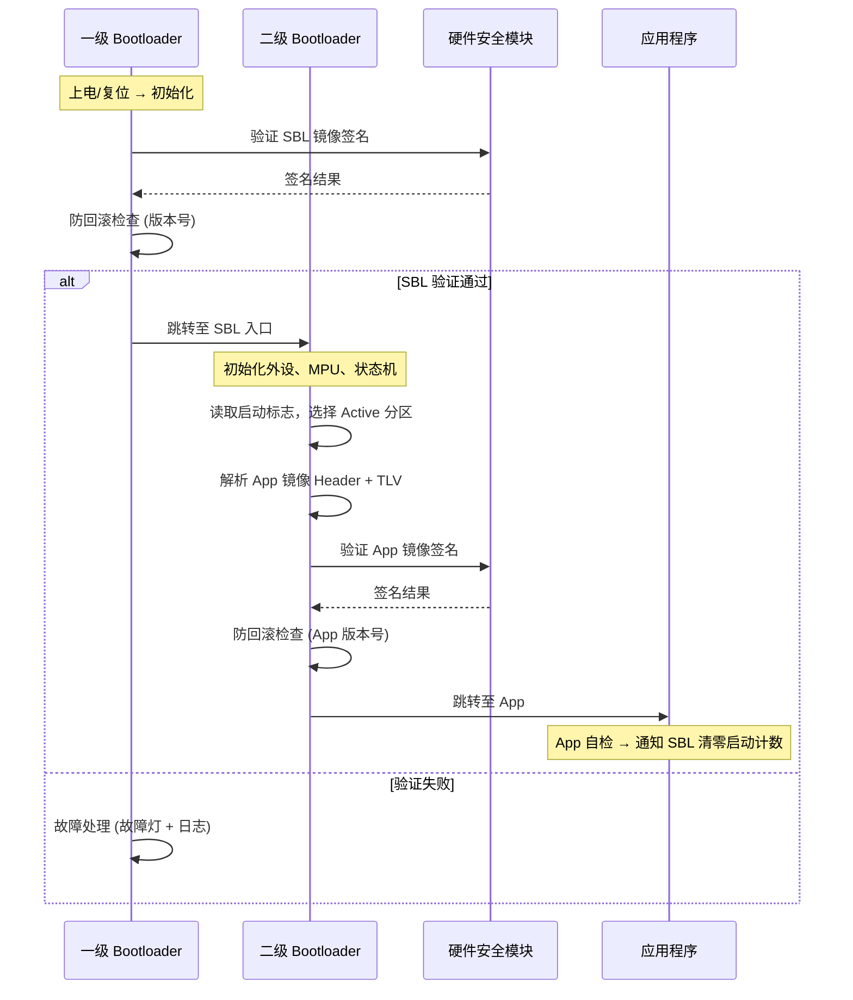
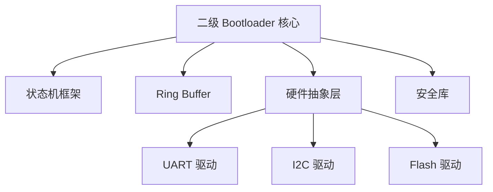
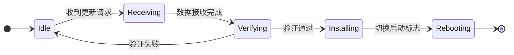
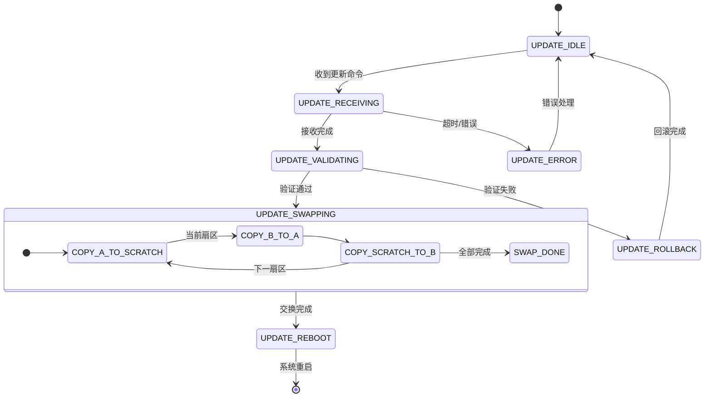
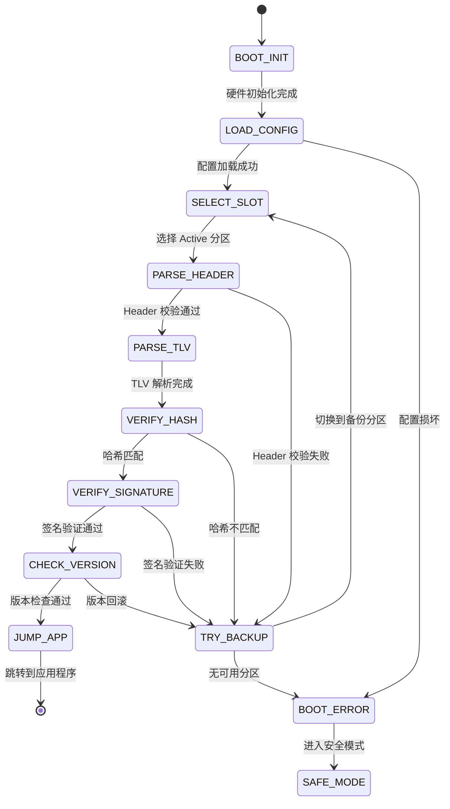
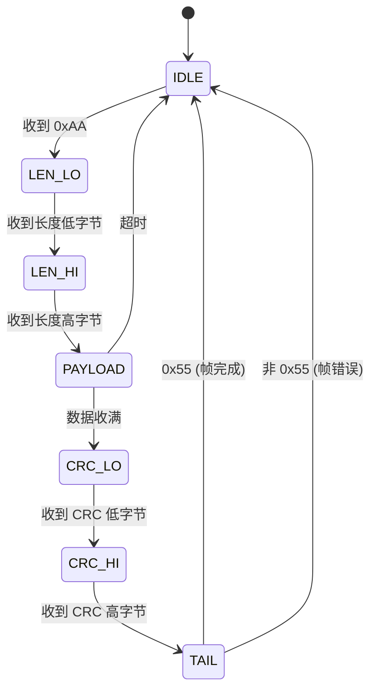

## 1. 问题: 为什么需要二级 Bootloader

在工业 MCU 产品 (传感器模组、电机控制器、边缘网关) 的全生命周期中，固件更新和安全启动是两个绕不过去的需求:

- **现场升级**: 设备部署到产线后，修复 bug 或增加功能只能通过 OTA (Over-The-Air) 或串口升级。如果更新过程中断电，设备必须能自动恢复，而非变砖。
- **安全启动**: 设备暴露在物理环境中，攻击者可能替换 Flash 中的固件。Bootloader 必须在加载应用前验证固件的完整性和真实性。
- **版本管理**: 新固件上线后出现严重缺陷，必须能回滚到上一个已知稳定的版本。

一级 Bootloader (通常固化在 ROM 或受保护的 Flash 区域) 功能极其有限 -- 它只做最基本的硬件初始化和镜像跳转。上述复杂功能需要一个功能更丰富的**二级 Bootloader (Secondary Bootloader, SBL)** 来承担。

SBL 运行在裸机环境下 (无 RTOS)，这意味着不能依赖操作系统的线程调度、互斥锁、消息队列。所有并发逻辑 -- 通信协议解析、固件写入、超时监控 -- 必须在一个主循环中用状态机协调完成。

## 2. 系统架构

### 2.1 三级信任链

安全启动的核心是**信任链 (Chain of Trust)**: 每一级在跳转到下一级之前，都必须验证下一级的完整性。



- **一级 Bootloader**: 固化在受保护区域，职责最小化 -- 验证 SBL 镜像签名，通过则跳转，失败则进入安全模式。
- **二级 Bootloader**: 本文的设计目标。裸机运行，承担 A/B 分区管理、固件更新、安全验证、通信协议处理。
- **应用程序**: 启动后执行自检，成功则通知 SBL 清零启动计数器，为自动回滚机制提供依据。

### 2.2 模块依赖

SBL 在设计上复用主应用的 HAL 和驱动，自行实现任务调度与事件管理，不依赖任何 RTOS。



关键设计约束:

- **零 RTOS 依赖**: 主循环 + 中断驱动 + 状态机，替代线程和消息队列。
- **复用 HAL**: 定时器、中断控制器、Flash 接口等与主应用共用，降低开发成本。
- **模块化**: 通信、更新、验证各自封装为独立状态机，通过事件松耦合。

## 3. A/B 分区与 OTA 更新

### 3.1 分区规划

A/B 分区方案是 OTA 更新的主流选择: 一个分区运行当前固件，另一个分区接收新固件。更新完成后切换启动标志，失败则自动回滚。

```
Flash 布局:
┌──────────────────────────────┐
│  一级 Bootloader (只读)       │  受写保护
├──────────────────────────────┤
│  二级 Bootloader             │
├──────────────────────────────┤
│  配置区 (NVM)                │  启动标志 + 版本号 + 计数器
├──────────────────────────────┤
│  Slot A (Active)             │  当前运行的固件
├──────────────────────────────┤
│  Slot B (Inactive)           │  接收新固件的分区
├──────────────────────────────┤
│  Scratch (临时)              │  原子交换用，至少 1 个扇区
└──────────────────────────────┘
```

配置区使用固定结构存储在 NVM 中:

```c
typedef struct {
    uint32_t magic;              /* 固定魔数 */
    uint32_t version;            /* 配置版本 */
    uint32_t active_slot;        /* 0=SlotA, 1=SlotB */
    uint32_t boot_count;         /* 启动计数器 */
    uint32_t rollback_version;   /* 防回滚最低版本号 */
    uint32_t flags;              /* 标志位 */
    uint32_t crc32;              /* 配置校验 */
} sbl_config_t;
```

### 3.2 简单更新流程

最基本的 A/B 更新流程:



- **Idle**: 等待更新命令。
- **Receiving**: 通过 UART/I2C/USB 逐块写入 Inactive 分区。
- **Verifying**: 对写入后的镜像做哈希校验和签名验证。
- **Installing**: 将启动标志切换到 Inactive 分区 (此分区变为 Active)。
- **Rebooting**: 重启并加载新固件。

这个方案有一个致命缺陷: **切换启动标志的瞬间断电**。如果标志写到一半 (例如 NVM 写入需要多个 Flash 字)，设备可能同时丢失两个分区的可用性。

### 3.3 原子交换: Scratch 分区方案

为彻底杜绝更新过程中断电导致的变砖，引入 Scratch 分区实现**原子性交换**: 交换要么完全成功，要么可以从任意中断点恢复。

核心思想: 逐扇区交换 Slot A 和 Slot B 的内容，Scratch 作为临时中转。每完成一个扇区的交换，持久化进度状态。断电后重启时，SBL 检测到未完成的交换任务，从上次中断的位置继续。



每个扇区的交换过程:

1. 将 Active 分区的第 N 个扇区复制到 Scratch。
2. 将 Inactive 分区的第 N 个扇区复制到 Active 分区。
3. 将 Scratch 中的数据 (原 Active 内容) 复制到 Inactive 分区。
4. 更新进度状态到 NVM。

如果在步骤 1-3 的任意位置断电，下次启动时 SBL 读取 NVM 中的进度状态，从中断点继续执行。由于 Scratch 中始终保存着原 Active 分区的扇区数据，任何步骤的中断都不会导致数据丢失。

这个方案的代价是: 更新耗时增加 (需要 3 倍的 Flash 操作量)，且需要额外的 Scratch 空间 (至少 1 个扇区大小)。对于 Flash 容量有限的 MCU，需要权衡是否值得。

### 3.4 自动回滚

自动回滚通过启动计数器实现:

```c
/* SBL 启动流程中 */
void sbl_boot_app(void) {
    sbl_config_t *cfg = nvm_get_config();

    /* 递增启动计数器 */
    cfg->boot_count++;
    nvm_save_config(cfg);

    if (cfg->boot_count >= BOOT_COUNT_THRESHOLD) {  /* 典型值: 3 */
        /* 新固件多次启动失败，回滚到另一个分区 */
        cfg->active_slot = (cfg->active_slot == 0U) ? 1U : 0U;
        cfg->boot_count = 0U;
        nvm_save_config(cfg);
    }

    /* 跳转到 Active 分区的 App */
    jump_to_app(get_slot_address(cfg->active_slot));
}
```

App 端的职责: 成功完成自检后，通过写入一个约定的内存标志位或直接调用 SBL 提供的接口，将 `boot_count` 清零。如果 App 持续崩溃 (启动后卡死、看门狗复位)，`boot_count` 会在 SBL 每次尝试启动时递增，达到阈值后自动切换到旧分区。

## 4. 固件镜像格式与安全验证

### 4.1 TLV 标准化镜像格式

传统做法是将签名和版本信息硬编码在镜像的固定偏移位置。这种方式在需要扩展新的安全特性 (例如增加加密支持、依赖声明) 时非常僵化。

SBL 采用 `Header + Payload + TLV` 三段式结构，借鉴了 [MCUboot](https://github.com/mcu-tools/mcuboot) 的设计:

```
镜像布局:
┌──────────────────────────────┐
│  Image Header (固定长度)      │  魔数 + 版本 + 大小 + 标志
├──────────────────────────────┤
│  Payload (应用程序二进制)      │  实际的 App 代码
├──────────────────────────────┤
│  Protected TLVs              │  受签名保护的元数据
├──────────────────────────────┤
│  Unprotected TLVs            │  不受签名保护的元数据
└──────────────────────────────┘
```

Header 结构:

```c
struct image_header {
    uint32_t magic;              /* 固定魔数, 0x96f3b83d */
    uint32_t load_addr;          /* 镜像加载地址 */
    uint16_t hdr_size;           /* 头部大小 (便于未来扩展) */
    uint16_t protect_tlv_size;   /* 受保护 TLV 区域大小 */
    uint32_t img_size;           /* Payload 大小 */
    uint32_t flags;              /* 标志位 (加密等) */
    struct {
        uint8_t major;
        uint8_t minor;
        uint16_t revision;
        uint32_t build_num;
    } version;
} __attribute__((packed));
```

TLV (Tag-Length-Value) 条目:

```c
struct image_tlv_info {
    uint16_t magic;              /* TLV 区域魔数 */
    uint16_t tlv_tot_len;        /* 所有 TLV 条目总长度 */
} __attribute__((packed));

struct image_tlv {
    uint8_t  tlv_type;           /* Tag: 条目类型 */
    uint8_t  _pad;
    uint16_t tlv_len;            /* Length: Value 的长度 */
    /* Value: tlv_len 字节的实际数据 */
} __attribute__((packed));

/* TLV 类型定义 */
#define IMAGE_TLV_SHA256        0x10   /* 镜像哈希 */
#define IMAGE_TLV_ECDSA_P256    0x22   /* ECDSA-P256 签名 */
#define IMAGE_TLV_DEPENDENCY    0x50   /* 依赖声明 (App 依赖某个 SBL 版本) */
```

TLV 的扩展性体现在: 未来增加新的安全特性 (例如 AES-256 加密标志、多签名支持)，只需定义新的 TLV 类型，SBL 的解析代码不需要修改结构体 -- 遍历 TLV 链表时跳过不认识的类型即可。

### 4.2 安全启动验证状态机

SBL 的安全启动验证是一个多步骤流程，用状态机表达比 if-else 嵌套更清晰，且每个状态都有明确的失败处理路径:



验证流程:

1. **PARSE_HEADER**: 检查魔数、头部大小、镜像大小是否在合理范围内。
2. **PARSE_TLV**: 遍历 TLV 区域，提取 SHA256 哈希值和签名数据。
3. **VERIFY_HASH**: 计算 `Header + Payload` 的 SHA256，与 TLV 中存储的哈希值比对。
4. **VERIFY_SIGNATURE**: 使用预置的公钥验证 `Header + Payload + Protected TLVs` 的 ECDSA-P256 签名。
5. **CHECK_VERSION**: 与 NVM 中存储的最低允许版本比较，拒绝降级。

### 4.3 防回滚保护

防回滚的核心是一个单调递增的版本号，存储在 NVM 的受保护区域:

```c
int sbl_verify_firmware_version(const struct image_header *header) {
    uint32_t min_allowed = nvm_read_min_version();

    if (header->version.build_num < min_allowed) {
        return -1;  /* 拒绝: 版本低于最低允许值 */
    }

    return 0;
}
```

新固件通过完整验证并成功启动后，SBL 将 `min_allowed_version` 更新为当前固件的版本号。此后，任何版本号更低的固件都无法通过验证 -- 即使攻击者获取了旧版本的签名固件。

`min_allowed_version` 所在的 NVM 区域应配置硬件写保护 (如果 MCU 支持)，并附加 CRC 校验防止意外损坏。

### 4.4 MPU 内存保护

裸机环境下，SBL 在启动时配置 MPU (Memory Protection Unit) 保护关键区域:

- **Bootloader 代码区**: 设为只读 + 可执行，防止固件更新过程中误写 SBL 自身。
- **配置区 (NVM)**: 设为读写，但仅 SBL 的配置管理模块有写权限。
- **App 分区**: 更新时设为可写，验证通过后设为只读 + 可执行。
- **外设寄存器区**: 设为设备内存属性 (Device-nGnRnE)，禁止推测访问。

## 5. 通信协议: ISR → Ring Buffer → 状态机

SBL 与上位机之间的通信 (UART/I2C/USB) 是固件更新的数据通路。通信协议的设计需要在裸机环境下兼顾实时性和可靠性。

### 5.1 三层解耦架构

传统做法是在中断服务程序 (ISR) 中直接处理协议解析，这会导致 ISR 执行时间过长，影响其他中断的响应。SBL 采用 ISR → Ring Buffer → 主循环状态机的三层解耦:

```
┌─────────────┐     ┌─────────────┐     ┌─────────────┐
│  ISR (生产者) │ ──→ │ Ring Buffer  │ ──→ │ 主循环 (消费者) │
│  从 FIFO 搬运 │     │ SPSC 无锁队列│     │ 状态机解析协议 │
└─────────────┘     └─────────────┘     └─────────────┘
       |                                       |
  中断上下文                              主循环上下文
  O(1) 操作                              可执行复杂逻辑
```

ISR 的唯一职责: 将硬件 FIFO 中的字节搬运到 Ring Buffer，然后退出。

```c
/* ISR 回调 -- 以 uart_statemachine_ringbuffer_linux 项目的模式为例 */
static void uart_isr_callback(uint8_t port, uint32_t int_status) {
    uint8_t byte;

    while (uart_hal_rx_available(port)) {
        uart_hal_try_get_byte(port, &byte);
        spsc_queue_push(&uart_rx_queue, &byte, 1U);
    }
}
```

### 5.2 SPSC Ring Buffer

Ring Buffer 是 ISR 和主循环之间的唯一共享数据结构。由于 ISR 是唯一的生产者、主循环是唯一的消费者，这是一个经典的 SPSC (Single Producer Single Consumer) 场景，可以用无锁实现。

以 [uart_statemachine_ringbuffer_linux](https://gitee.com/liudegui/uart_statemachine_ringbuffer_linux) 项目中的 `spsc_queue.h` 为例:

```c
typedef struct {
    uint32_t size;             /* 缓冲区大小 (必须是 2 的幂) */
    uint32_t mask;             /* 快速取模掩码 (size - 1) */
    volatile uint32_t head;    /* 消费者读指针 (仅消费者修改) */
    volatile uint32_t tail;    /* 生产者写指针 (仅生产者修改) */
    uint8_t *buffer;           /* 缓冲区指针 */
} spsc_queue_t;
```

关键设计点:

- **Size 必须是 2 的幂**: 用 `index & mask` 替代 `index % size`，避免除法运算 (在 Cortex-M0 上没有硬件除法器)。
- **Head/tail 分离**: `head` 只被消费者修改，`tail` 只被生产者修改。不需要锁。
- **内存屏障**: 在 ARM 上，写入数据后、更新 tail 前需要 DMB 指令，确保消费者看到的数据是完整的。在单核 MCU 上 (ISR 和主循环跑在同一个核上)，编译器屏障 (`__asm volatile("" ::: "memory")`) 通常就够了。

```c
/* Push: ISR 调用 */
static inline int32_t spsc_queue_push(spsc_queue_t *q, const uint8_t *data, uint32_t len) {
    uint32_t tail = q->tail;
    uint32_t head = q->head;

    if ((q->size - (tail - head)) < len) {
        return SPSC_QUEUE_FAIL;  /* 空间不足 */
    }

    uint32_t pos = tail & q->mask;
    uint32_t first = spsc_queue_min(len, q->size - pos);
    memcpy(&q->buffer[pos], data, first);
    if (first < len) {
        memcpy(q->buffer, &data[first], len - first);  /* 环绕 */
    }

    SPSC_QUEUE_DMB();  /* 确保数据写入完成后再更新 tail */
    q->tail = tail + len;
    return SPSC_QUEUE_OK;
}
```

### 5.3 协议帧格式

SBL 使用分层帧格式，支持简单帧 (用于基本命令) 和扩展帧 (用于 OTA 数据传输):

```
简单帧:
┌──────┬────────┬──────┬─────┬──────────┬─────────┬──────┐
│ 0xAA │ LEN(2B)│ CLASS│ CMD │ DATA[N]  │ CRC16(2B)│ 0x55 │
│ 帧头  │ 小端序  │ 命令类 │ 命令 │ 可变数据  │ CCITT   │ 帧尾  │
└──────┴────────┴──────┴─────┴──────────┴─────────┴──────┘
```

命令类定义:

| 命令类 | 值   | 用途 |
|--------|------|------|
| SYS    | 0x01 | 系统命令 (版本查询、重启) |
| SPI    | 0x02 | SPI Flash 操作 |
| DIAG   | 0x03 | 诊断命令 |
| OTA    | 0x04 | 固件更新 (START/DATA/END/VERIFY) |
| CONFIG | 0x10 | 配置管理 |

CRC16-CCITT 覆盖 `CLASS + CMD + DATA` 部分，使用查表法实现 O(n) 计算:

```c
static inline uint16_t uart_calc_crc16(const uint8_t *data, uint32_t len) {
    uint16_t crc = 0x0000U;

    for (uint32_t i = 0U; i < len; i++) {
        crc = (uint16_t)((crc << 8) ^ crc16_table[(uint8_t)((crc >> 8) ^ data[i])]);
    }
    return crc;
}
```

### 5.4 两种协议解析方案

[uart_statemachine_ringbuffer_linux](https://gitee.com/liudegui/uart_statemachine_ringbuffer_linux) 项目实现并对比了两种协议解析方案，两种方案在 SBL 场景下各有适用范围。

#### 方案一: 缓冲区滑窗扫描

主循环周期性从 Ring Buffer 批量读取数据到本地缓冲区，然后用滑动窗口扫描帧头、校验帧尾和 CRC。

```c
void rb_parser_process(rb_parser_t *parser) {
    uint8_t buffer[64];
    uint32_t len;

    /* 从 Ring Buffer 批量读取 */
    len = spsc_queue_pop(&parser->queue, buffer, sizeof(buffer));
    if (len == 0U) {
        return;
    }

    /* 追加到内部缓冲区 */
    memcpy(&parser->buf[parser->buf_len], buffer, len);
    parser->buf_len += len;

    /* 滑窗扫描: 查找帧头 0xAA */
    while (parser->buf_len >= SIMPLE_FRAME_MIN_LEN) {
        if (parser->buf[0] != SIMPLE_FRAME_HEADER) {
            /* 丢弃非帧头字节，滑窗前移 */
            memmove(parser->buf, &parser->buf[1], parser->buf_len - 1);
            parser->buf_len--;
            continue;
        }

        /* 提取长度字段 */
        uint16_t payload_len = parser->buf[1] | (parser->buf[2] << 8);
        uint32_t frame_len = 1 + 2 + payload_len + 2 + 1;  /* 头+长度+数据+CRC+尾 */

        if (parser->buf_len < frame_len) {
            break;  /* 数据不完整，等待更多数据 */
        }

        /* 校验帧尾 */
        if (parser->buf[frame_len - 1] != SIMPLE_FRAME_TAIL) {
            memmove(parser->buf, &parser->buf[1], parser->buf_len - 1);
            parser->buf_len--;
            continue;
        }

        /* CRC 校验 */
        uint16_t crc_calc = uart_calc_crc16(&parser->buf[3], payload_len);
        uint16_t crc_recv = parser->buf[3 + payload_len]
                          | (parser->buf[4 + payload_len] << 8);

        if (crc_calc == crc_recv) {
            /* 帧有效，提取并回调 */
            dispatch_frame(parser, &parser->buf[3], payload_len);
        }

        /* 移除已处理的帧 */
        memmove(parser->buf, &parser->buf[frame_len], parser->buf_len - frame_len);
        parser->buf_len -= frame_len;
    }
}
```

**优点**: 实现简单直观，CPU 占用低 (主循环批量处理)，适合固定格式协议。

**缺点**: `memmove` 操作在每次丢弃字节时移动整个缓冲区；状态隐含在代码逻辑中，扩展复杂协议困难。

#### 方案二: 层次状态机 (HSM) 逐字节解析

每个字节到达触发一个事件，状态机根据当前状态处理:



使用 [uart_statemachine_ringbuffer_linux](https://gitee.com/liudegui/uart_statemachine_ringbuffer_linux) 项目中的 HSM 框架:

```c
/* 状态定义 */
static const hsm_state_t state_idle;
static const hsm_state_t state_len_lo;
static const hsm_state_t state_len_hi;
static const hsm_state_t state_payload;
static const hsm_state_t state_crc_lo;
static const hsm_state_t state_crc_hi;
static const hsm_state_t state_tail;

/* IDLE 状态的转换表 */
static const hsm_transition_t idle_transitions[] = {
    { EVT_BYTE_RECEIVED, &state_len_lo, guard_is_header, NULL, SM_TRANSITION_EXTERNAL },
};

/* PAYLOAD 状态的转换表 */
static const hsm_transition_t payload_transitions[] = {
    { EVT_BYTE_RECEIVED, &state_crc_lo, guard_payload_complete, action_store_byte,
      SM_TRANSITION_EXTERNAL },
    { EVT_BYTE_RECEIVED, NULL, NULL, action_store_byte, SM_TRANSITION_INTERNAL },
    { EVT_TIMEOUT, &state_idle, NULL, action_report_timeout, SM_TRANSITION_EXTERNAL },
};

/* Guard: 检查是否收到帧头 0xAA */
static bool_t guard_is_header(hsm_t *sm, const hsm_event_t *event) {
    uint8_t byte = *(uint8_t *)event->context;
    return (byte == SIMPLE_FRAME_HEADER) ? TRUE : FALSE;
}
```

主循环中逐字节驱动状态机:

```c
void process_uart_events(void) {
    uint8_t buffer[64];
    uint32_t len = spsc_queue_pop(&uart_rx_queue, buffer, sizeof(buffer));

    for (uint32_t i = 0U; i < len; i++) {
        hsm_event_t event = { .id = EVT_BYTE_RECEIVED, .context = &buffer[i] };
        hsm_dispatch(&protocol_sm, &event);
    }
}
```

**优点**: 状态转换显式声明 (数据驱动)，支持层次化复杂协议，自恢复能力强 (任何异常状态都有明确的回退路径)，便于单元测试。

**缺点**: 实现复杂度高于滑窗方案，每个字节都触发一次状态机分发 (但在 Cortex-M 上开销约为微秒级，远低于 UART 字节间隔)。

#### 方案选择建议

| 场景 | 推荐方案 |
|------|---------|
| 简单定长协议，命令种类少 | 滑窗扫描 |
| 多层复杂协议 (简单帧 + UCI 扩展帧) | HSM |
| 需要支持超时、重传、会话管理 | HSM |
| 资源极度受限 (< 4KB RAM) | 滑窗扫描 |
| 需要独立测试协议解析逻辑 | HSM |

SBL 的通信协议通常涉及 OTA 数据传输 (需要序列号、分块校验、超时重传)，复杂度足以使 HSM 方案成为更优选择。

### 5.5 中断配置优化

ISR + Ring Buffer 架构的性能取决于中断触发策略:

- **FIFO 水线 (Watermark)**: 不要将触发级别设为 1 字节。设为 4 或 8 字节可以减少中断频率。例如 115200 baud 下每秒约 11520 字节，1 字节触发意味着 11520 次中断/秒，8 字节触发则降到约 1440 次/秒。
- **接收超时中断 (RTO)**: 当最后一个字节到达后超过 N 个字符时间没有新数据，触发超时中断。这确保帧尾的最后几个字节 (不足 FIFO 水线) 也能被及时处理。
- **DMA**: 如果硬件支持，DMA 可以将数据直接搬运到 Ring Buffer，ISR 只需更新 tail 指针。这将 ISR 的开销从 O(n) (逐字节搬运) 降到 O(1) (更新指针)。

## 6. 主循环: 裸机协作式调度

SBL 运行在裸机环境下，所有业务逻辑通过状态机在主循环中协作执行:

```c
void sbl_main_loop(void) {
    while (1) {
        /* 1. 处理硬件中断产生的事件 */
        process_uart_events();

        /* 2. 驱动各业务状态机 */
        hsm_dispatch(&protocol_sm, &tick_event);      /* 协议解析 */
        hsm_dispatch(&update_sm, &tick_event);         /* 固件更新 */
        hsm_dispatch(&secure_boot_sm, &tick_event);    /* 安全启动 */

        /* 3. 看门狗喂狗 */
        watchdog_feed();

        /* 4. 低功耗处理 */
        if (no_pending_events()) {
            __WFI();  /* Wait For Interrupt: CPU 休眠直到下一个中断 */
        }
    }
}
```

各状态机之间通过事件松耦合: 协议解析状态机解析到 OTA_START 命令后，向固件更新状态机发送 `UPDATE_START_EVENT`；固件更新状态机完成所有扇区写入后，向安全验证状态机发送 `VALIDATE_EVENT`。

这种架构的本质是**事件驱动的协作式多任务**: 每个状态机在一次调度中只处理一个事件然后返回，不会长时间霸占 CPU。对于 SBL 的工作负载 (通信速率远低于 CPU 处理速度)，这足以保证实时性。

## 7. RTOS 迁移: 兼容层设计

如果 SBL 需要复用基于 RTOS (例如 RT-Thread) 编写的已有代码，可以通过兼容层将 RTOS API 替换为裸机实现:

```c
/* rt_compat.h -- RTOS API 兼容层 */

/* 内存管理: 直接映射到标准库 */
#define rt_malloc(size)       malloc(size)
#define rt_calloc(n, s)       calloc(n, s)
#define rt_free(ptr)          free(ptr)

/* 线程同步: 裸机下简化为空操作 */
#define rt_mutex_init(m)      (0)
#define rt_mutex_take(m, t)   (0)
#define rt_mutex_release(m)   (0)

/* 链表操作: 提供裸机版本 */
typedef struct rt_list_node {
    struct rt_list_node *next;
    struct rt_list_node *prev;
} rt_list_t;

static inline void rt_list_init(rt_list_t *l) {
    l->next = l;
    l->prev = l;
}

static inline void rt_list_insert_after(rt_list_t *l, rt_list_t *n) {
    l->next->prev = n;
    n->next = l->next;
    l->next = n;
    n->prev = l;
}
```

兼容层的局限性: mutex 简化为空操作意味着代码不再线程安全。在裸机环境下这通常不是问题 (只有 ISR 和主循环两个执行上下文)，但必须确保被复用的代码中没有依赖 RTOS 调度的时序假设 (例如 `rt_thread_delay` 必须替换为硬件定时器)。

## 8. 状态机框架选型

SBL 中每个业务模块 (通信协议、固件更新、安全启动、配置管理) 都由独立的状态机驱动。选择合适的状态机框架对代码质量有直接影响。

### 8.1 为什么用状态机而非 switch-case

传统做法:

```c
/* 原始的 if-else / switch 结构 */
static int step = 0;
int firmware_update_process(const uint8_t *data, uint32_t len) {
    switch (step) {
        case 0:  /* 准备阶段 */
            if (prepare_partition()) { step = 1; }
            else { goto error; }
            break;
        case 1:  /* 接收阶段 */
            /* ... 复杂的嵌套逻辑 ... */
            break;
        /* ... 更多 case ... */
    }
error:
    /* 错误清理逻辑分散在各处 */
}
```

问题: 状态隐含在 `step` 变量中，转换条件分散在代码逻辑中，添加新状态需要修改多处代码，错误处理路径不统一。

状态机框架将状态、转换、动作显式声明为数据:

```c
/* 数据驱动的状态定义 */
static const hsm_transition_t update_idle_transitions[] = {
    { EVT_UPDATE_START, &state_receiving, NULL, action_prepare, SM_TRANSITION_EXTERNAL },
};

static const hsm_transition_t update_receiving_transitions[] = {
    { EVT_DATA_RECEIVED, NULL, NULL, action_write_block, SM_TRANSITION_INTERNAL },
    { EVT_DATA_COMPLETE, &state_validating, NULL, NULL, SM_TRANSITION_EXTERNAL },
    { EVT_TIMEOUT, &state_error, NULL, action_report_timeout, SM_TRANSITION_EXTERNAL },
};
```

每个状态的行为由其转换表完全定义。添加新状态只需增加一个转换表，不影响其他状态的代码。

### 8.2 HSM 框架核心 API

[uart_statemachine_ringbuffer_linux](https://gitee.com/liudegui/uart_statemachine_ringbuffer_linux) 项目中包含一个轻量的层次状态机框架 (`hsm_method/state_machine.h`)，核心接口:

```c
/* 初始化状态机 */
void hsm_init(hsm_t *sm, const hsm_state_t *initial_state,
              const hsm_state_t **entry_path_buffer, uint8_t buffer_size,
              void *user_data, hsm_action_fn unhandled_hook);

/* 分发事件 -- 在主循环中调用 */
bool_t hsm_dispatch(hsm_t *sm, const hsm_event_t *event);

/* 查询当前状态 */
const char *hsm_get_current_state_name(const hsm_t *sm);
bool_t hsm_is_in_state(const hsm_t *sm, const hsm_state_t *state);
```

状态定义支持层次关系 (子状态继承父状态的转换):

```c
struct hsm_state {
    const hsm_state_t *parent;           /* 父状态，NULL 表示顶层 */
    hsm_action_fn entry_action;          /* 进入动作 */
    hsm_action_fn exit_action;           /* 退出动作 */
    const hsm_transition_t *transitions; /* 转换表 */
    size_t num_transitions;              /* 转换数量 */
    const char *name;                    /* 调试用名称 */
};
```

HSM 的层次特性在 SBL 中的价值: 例如固件更新的所有子状态 (Receiving、Validating、Swapping) 共享一个父状态 Updating，父状态定义了公共的超时处理和取消逻辑，子状态无需重复。

## 9. 总结与工程权衡

回顾 SBL 的设计，几个核心权衡:

**安全性 vs 更新速度**。原子交换方案需要 3 倍的 Flash 操作量 (A→Scratch、B→A、Scratch→B)，且需要额外的 Scratch 空间。如果 Flash 容量充裕且对更新可靠性要求高，这是正确的选择。如果 Flash 紧张且可以接受小概率的更新失败 (通过自动回滚恢复)，简单方案即可。

**状态机 vs 简单流程**。状态机框架引入了学习成本和代码量。对于只有 3-4 个状态的简单协议，switch-case 可能更直接。但当业务复杂度增长 (多种帧格式、超时重传、会话管理)，状态机的结构优势会迅速体现。SBL 恰好处在这个复杂度拐点上。

**复用 vs 重写**。复用主应用的 HAL 和驱动可以降低开发成本，但要注意 RTOS 兼容层的局限性 -- mutex 空操作意味着原代码中依赖锁保护的临界区失去了保护。需要逐一审查被复用代码的并发假设。

**TLV vs 固定格式**。TLV 的灵活性在 SBL 的长生命周期中非常有价值 -- 产品可能需要在不更换 SBL 的情况下支持新的安全特性。代价是解析代码略微复杂，但 TLV 遍历本身只是一个简单的循环。

> 参考:
> - [uart_statemachine_ringbuffer_linux](https://gitee.com/liudegui/uart_statemachine_ringbuffer_linux) -- UART 协议解析 Demo (Ring Buffer + HSM 两种方案)
> - [state_machine](https://github.com/DeguiLiu/state_machine) -- 轻量层次状态机框架
> - [MCUboot](https://github.com/mcu-tools/mcuboot) -- TLV 镜像格式参考
