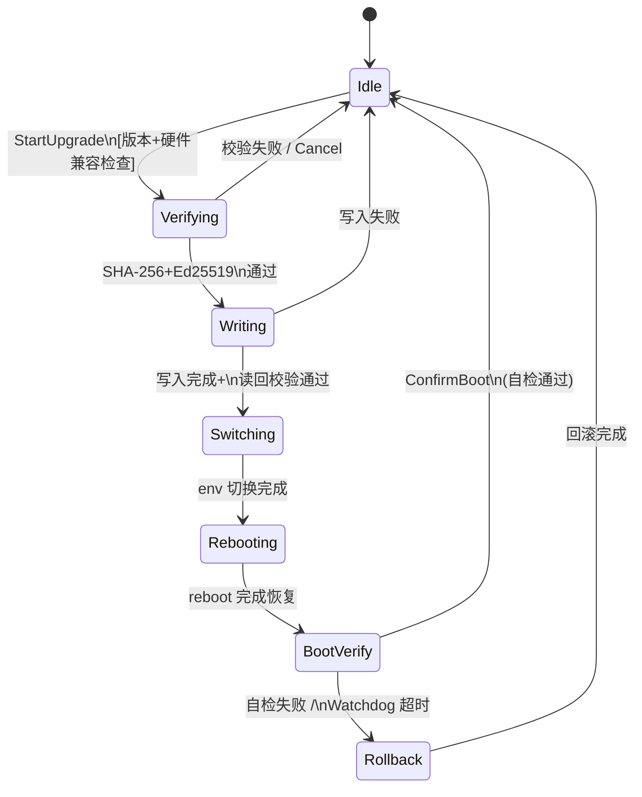

> 项目仓库: [osp-upgrade-engine](https://gitee.com/liudegui/osp-upgrade-engine) (C++17 header-only, 32/32 tests pass)
> 依赖库: [newosp](https://github.com/DeguiLiu/newosp) (1153 tests, ASan/TSan/UBSan clean)
> 目标平台: ARM-Linux (Cortex-A53/A72) | 32-256 MB RAM | C++17
> 适用场景: 激光雷达固件升级、机器人 OTA、边缘计算设备、工业现场无人值守环境

---

## 1. 问题域与设计选择

### 1.1 工业嵌入式固件升级的硬约束

激光雷达、机器人、边缘计算等工业设备在现场无人值守，固件升级面临三个硬约束:

| 约束 | 典型指标 | 技术影响 |
|------|----------|--------|
| **掉电安全** | 任意时刻断电不能变砖 | 需要 3+ 层持久化保护 |
| **资源受限** | 32-256 MB RAM, 无 D-Bus | 禁止外部重依赖框架 |
| **可验证性** | 升级后必须自检确认 | 新固件启动失败自动回滚 |

传统 Linux OTA 方案 (SWUpdate、RAUC) 依赖链重，不适用:

| 方案 | 依赖 | 内存占用 | 进程模型 | 掉电保护 |
|------|------|---------|--------|--------|
| **SWUpdate/RAUC** | D-Bus, systemd, GLib, libcurl | ~10-50 MB | 独立 daemon | update_state 文件 |
| **osp-upgrade-engine** | newosp (header-only) | < 73 KB | 嵌入应用进程 | raw 分区 + U-Boot env + bootcount |

### 1.2 设计决策的工程权衡

**选择 HSM 而非事件循环**: 固件升级流程严格线性 (Idle → Verifying → Writing → Switching → Rebooting → BootVerify → Rollback → Idle)，状态转换有明确的前后依赖。HSM 的显式状态定义和 LCA 转换机制使掉电恢复的状态跳转更容易推导。

**选择函数指针表而非虚函数**: 遵循项目规范 (编译期分发优先)，零间接调用开销，同一份代码可轻松切换生产环境 (POSIX HAL) 和仿真环境 (SimHAL)。

**选择 raw 分区而非文件系统**: 避免文件系统日志和日志 commit 的不确定性，每次状态转换前原子写入 64B 记录到固定偏移，确定性掉电安全。

**选择 SpinOnce 轮询而非额外线程**: 不增加线程预算，升级在应用进程内执行，每次处理 4KB chunk，主循环可在 SpinOnce 间隙处理其他任务。

---

## 2. 架构总览

### 2.1 三层掉电保护机制

```
┌──────────────────────────────────────────────────────────────┐
│ 第 1 层: Raw 分区状态持久化                                   │
│ • 每次 HSM 状态转换前 pwrite(state_fd, &record, 64, 0) +    │
│   fsync(state_fd)                                            │
│ • 64B UpgradeStateRecord (magic + state + CRC-32)           │
│ • 启动恢复: RecoverFromPersistentState() 读取上次未完成状态  │
│ • 保护范围: 任意阶段掉电重启后能精确恢复                      │
└──────────────────────────────────────────────────────────────┘

┌──────────────────────────────────────────────────────────────┐
│ 第 2 层: U-Boot 冗余环境变量原子切换                          │
│ • U-Boot 原生支持冗余 env (两个副本交替写入)                 │
│ • fw_setenv boot_slot_next / upgrade_available / bootcount   │
│ • 启动分区切换的原子性由 U-Boot 保证                         │
│ • 保护范围: Switching 阶段即使多次掉电也能正确切换或保持旧值 │
└──────────────────────────────────────────────────────────────┘

┌──────────────────────────────────────────────────────────────┐
│ 第 3 层: bootcount 自动回滚机制                              │
│ • U-Boot 每次启动递增 bootcount                             │
│ • bootcount > bootlimit (默认 3) 时自动回滚到旧分区         │
│ • 新固件调用 ConfirmBoot() 清除 upgrade_available 和 count  │
│ • 保护范围: 新固件反复崩溃无法调用 ConfirmBoot 时自动回滚   │
└──────────────────────────────────────────────────────────────┘
```

### 2.2 8 阶段 HSM 状态转换图



核心设计:
- **扁平结构** (parent_index = -1): 无层级嵌套，线性流程不需要 LCA 跨层转换
- **持久化边界**: 每个黑色箭头转换前都 fsync 状态到 raw 分区
- **掉电恢复路径**: 启动时读取持久化状态，用 `ForceTransition()` 直接跳转到中断点

### 2.3 存储布局

典型 8GB eMMC 分区表:

```
mmcblk0p1  bootloader        2 MB    U-Boot SPL + U-Boot
mmcblk0p2  env              128 KB   U-Boot 冗余环境变量 (2 副本)
mmcblk0p3  recovery          32 MB   最小恢复系统
mmcblk0p4  rootfs_a           1 GB   主系统 A 分区 (当前活跃)
mmcblk0p5  rootfs_b           1 GB   主系统 B 分区 (升级目标)
mmcblk0p6  config            64 MB   持久化配置 (不随升级擦除)
mmcblk0p7  data             剩余     用户数据 + 升级包暂存
mmcblk0p8  upgrade_state     64 KB   升级状态 (raw, 无 FS)
```

**upgrade_state 的设计权衡**: raw 分区直接 pwrite/fsync，避免文件系统日志的不确定性。每次转换前的 fsync 确保掉电时已持久化的状态被硬件保证写入。

---

## 3. 核心设计细节

### 3.1 128 字节二进制包头格式

```
偏移   大小   字段               说明
0      4      magic[4]          "OSP\x01" 魔数 + 版本
4      1      header_ver        包头格式版本 (当前 = 1)
5      1      pkg_type          0=全量, 1=差分, 2=Bootloader
8      4      hw_compat_mask    硬件兼容性 bitmask (最多 32 种板型)
12     4      fw_version        major<<24 | minor<<16 | patch
16     4      min_version       差分升级基准版本
20     8      payload_size      payload 字节数
28     32     payload_sha256    SHA-256 校验值
60     2      signature_len     签名长度 (Ed25519 = 64)
62     62     reserved_1        预留扩展字段
124    4      header_crc32      前 124 字节的 CRC-32
```

**设计要点**:

| 特性 | 与 JSON 对比 | 优势 |
|------|-------------|------|
| 二进制格式 | JSON 需解析库 | 无依赖，即时校验 |
| 128B 固定长 | JSON 变长 | 栈分配，无堆分配 |
| CRC-32 即时校验 | JSON 全量 DOM | 快速拒绝损坏文件 |
| hw_compat_mask | JSON 数组遍历 | `(mask & 1u<<id)` 单次位运算 |
| fw_version 编码 | 字符串比较 | 直接 `>` 数值比较 |

### 3.2 三层校验机制

| 层 | 算法 | 覆盖范围 | 用途 |
|------|------|---------|------|
| 1. 快速校验 | CRC-32 | 包头 124B | 即时拒绝损坏/伪造包 |
| 2. 完整性 | SHA-256 | 整个 payload | 抗碰撞，确保写入无误 |
| 3. 身份认证 | Ed25519 | payload SHA-256 | 验证来源，防止中间人攻击 |

Ed25519 签名仅 64 字节 (vs RSA-2048 256B)，ARM Cortex-A 验证速度约 0.2ms，mbedtls PSA Crypto API 运行时检测硬件支持，不支持时回退到 HMAC-SHA256 演示模式。

### 3.3 函数指针表 HAL 的零虚函数设计

```cpp
struct UpgradeHAL {
    // 分区操作
    int32_t (*open_partition)(const char* dev, int32_t flags, void* ctx);
    ssize_t (*write_partition)(int32_t fd, const void* buf, uint32_t size, void* ctx);
    ssize_t (*read_partition)(int32_t fd, void* buf, uint32_t size, void* ctx);
    int32_t (*fsync_partition)(int32_t fd, void* ctx);
    int32_t (*close_partition)(int32_t fd, void* ctx);

    // Boot 环境变量
    bool (*get_env)(const char* key, char* val, uint32_t size, void* ctx);
    bool (*set_env)(const char* key, const char* value, void* ctx);

    // 系统控制
    void (*reboot_system)(void* ctx);

    // 不透明上下文 (替代 this 指针)
    void* ctx;
};
```

**vs 虚函数对比**:

| 维度 | virtual 基类 | 函数指针表 |
|------|-------------|-----------|
| 内存布局 | vtable 指针 (8B) + RTTI | 函数指针数组 (连续，缓存友好) |
| 间接调用 | vtable 两次间接寻址 | 一次函数指针调用 |
| 编译器支持 | 需要 RTTI (`-fno-rtti` 受限) | 纯 C ABI，无 C++ 运行时 |
| 组合方式 | 继承体系 (刚性) | 按需替换单个函数指针 (灵活) |

仿真环境只需替换函数指针: `SimHAL::open = SimOpenPartition` 等，无需继承层级，易于单元测试。

### 3.4 SpinOnce 轮询驱动模式

固件升级的 Verifying 和 Writing 状态需处理数百 MB 大文件，不能在一次 handler 调用中完成。引入 `kEvStepProcess` 事件，每次 SpinOnce 驱动处理 4KB chunk:

```cpp
// 主循环驱动 (激光雷达采集线程)
while (!engine.IsIdle()) {
    engine.SpinOnce();           // 处理 1 个 4KB chunk (~100 μs)
    RunLidarPipeline();          // 其他实时任务不被阻塞
}
```

WritingHandler 示例:

```cpp
TransitionResult WritingHandler(UpgradeContext& ctx, const Event& event) {
    if (event.id == kEvStepProcess) {
        if (ctx.bytes_written >= ctx.total_size) {
            // 写入完成: fsync + 读回 SHA-256 校验
            ctx.pw_ptr->Fsync();
            auto rb = ctx.pw_ptr->VerifyReadback(...);
            return GetSM(ctx)->RequestTransition(ctx.idx_switching);
        }

        // 读取下一个 4KB chunk
        uint8_t chunk[4096];
        ssize_t n = ::read(ctx.pkg_fd, chunk, sizeof(chunk));
        ctx.pw_ptr->WriteChunk(chunk, n);
        ctx.bytes_written += n;

        // 每 1MB 持久化一次进度 (掉电恢复的断点)
        if (ctx.bytes_since_last_persist >= 1048576U) {
            PersistCurrentState(ctx, StateIdx::kStateWriting);
            ctx.bytes_since_last_persist = 0;
        }
        return TransitionResult::kHandled;
    }
    return TransitionResult::kUnhandled;
}
```

---

## 4. 掉电恢复的完整路径

### 4.1 启动时的恢复决策树

```cpp
void RecoverFromPersistentState() noexcept {
    StatePersister persist(ctx_.state_fd);
    auto res = persist.LoadState();
    if (!res) return;  // magic/CRC 无效 → 无升级进行

    StateIdx persisted = static_cast<StateIdx>(res.value().state);
    switch (persisted) {
        case StateIdx::kStateWriting:
            // 分析: 写入分区未完成，活跃分区完好
            // 恢复: 清除状态，启动后重新开始升级
            persist.ClearState();
            break;

        case StateIdx::kStateSwitching:
        case StateIdx::kStateBooting:
            // 分析: env 可能已切换，新固件已启动
            // 恢复: ForceTransition 到 BootVerify，继续自检
            sm_.ForceTransition(ctx_.idx_boot_verify);
            break;

        case StateIdx::kStateRollback:
            // 分析: 回滚中断
            // 恢复: 继续回滚流程
            sm_.ForceTransition(ctx_.idx_rollback);
            break;

        default:
            persist.ClearState();
            break;
    }
}
```

### 4.2 掉电时序与安全点

```
[安全点 1] PersistState(Writing, progress=0) + fsync
    ↓
    for each 4KB chunk:
        write(partition_b_fd, chunk)

[安全点 2] if (written % 1MB == 0): fsync + PersistState(...)
    ↓
[安全点 3] 最终 fsync + 读回全量 SHA-256 校验
    ↓
[安全点 4] PersistState(Switching) + fw_setenv (U-Boot 原子)
    ↓
[安全点 5] PersistState(Rebooting) + reboot(2)
```

**安全分析**:
- 点 1-3 之间掉电: 分区 A 未动，系统启动后重新开始升级
- 点 4 掉电: U-Boot 已原子切换或未切换，启动后恢复到 BootVerify 继续自检
- 点 5 掉电: 新固件启动失败 3 次后 U-Boot bootcount 机制自动回滚

---

## 5. x86 仿真层与单元测试

升级引擎在 x86 Linux 上完整运行 (包括掉电模拟)，通过仿真 HAL:

```cpp
// 生产环境: POSIX 系统调用
UpgradeHAL hal = MakePosixHAL();

// 仿真环境: 文件模拟分区 + 软件故障注入
UpgradeHAL sim_hal = MakeSimHAL(&sim_ctx);
sim_hal.ctx = &sim_ctx;  // 注入掉电故障、env 读写状态等
```

演示结果 (1MB 测试固件):

```
=== Full Upgrade Demo ===
[HSM] Idle -> Verifying -> Writing -> Switching -> Rebooting
[HSM] BootVerify -> Idle
Total time: 19 ms
Status: OK

=== Power Loss Safety Tests ===
[TEST 1/5] Power loss during Writing (25%) ... PASS
[TEST 2/5] Power loss during Writing (50%) ... PASS
[TEST 3/5] Power loss during Writing (75%) ... PASS
[TEST 4/5] Power loss during Switching     ... PASS
[TEST 5/5] BootVerify timeout → rollback    ... PASS
All 5 tests passed.
```

---

## 6. 与 newosp 生态的融合

osp-upgrade-engine 通过 FetchContent 复用 newosp 核心组件:

| newosp 组件 | 用途 | 集成点 |
|-------------|------|--------|
| osp::StateMachine | HSM 驱动 8 状态流程 | UpgradeHSM 模板实例化 |
| osp::Event | 事件传递 | kEvStartUpgrade, kEvStepProcess |
| osp::expected | 错误处理 | StartUpgrade() 返回值 |
| osp::Sha256Calculator | 流式 SHA-256 | Verifying 状态 |

**唯一修改**: newosp HSM 新增 `ForceTransition()` API，用于掉电恢复时从外部跳转状态:

```cpp
bool ForceTransition(int32_t target) noexcept {
    if (!started_ || target < 0 ||
        static_cast<uint32_t>(target) >= state_count_) {
        return false;
    }
    TransitionTo(target);  // 执行标准 LCA exit/entry 路径
    return true;
}
```

---

## 7. 资源预算与性能指标

### 7.1 内存占用

| 组件 | 栈/静态 | 堆 | 说明 |
|------|---------|-----|------|
| UpgradeHSM | 256 B | 0 | StateConfig 数组编译期固定 |
| UpgradeContext | 520 B | 0 | 路径缓冲 + SHA-256 上下文 |
| 包头解析 | 128 B | 0 | 栈分配 |
| 状态记录 | 64 B | 0 | 每次持久化 |
| 写缓冲 | 4 KB | 0 | WritingHandler 栈分配 |
| 读回校验缓冲 | 4 KB | 0 | PartitionWriter 栈分配 |
| CRC-32 表 | 1 KB | 0 | constexpr 编译期 |
| SHA-256 上下文 | 128 B | 0 | mbedtls 嵌入 |
| **合计** | **~10 KB** | **0** | **全程零堆分配** |

### 7.2 时间开销

| 操作 | 典型耗时 | 备注 |
|------|---------|------|
| SpinOnce (4KB chunk) | ~100-200 μs | 含分区读写 |
| CRC-32 校验 (128B 头) | ~5 μs | 查表 |
| SHA-256 增量 (4KB 块) | ~40 μs | mbedtls 优化 |
| Ed25519 签名验证 | ~0.2 ms | ARM Cortex-A 指令集 |
| U-Boot env 切换 | ~5-10 ms | fw_setenv 执行 |
| 完整升级 (1GB) | ~100-150 s | 100% 网络带宽 |

---

## 8. 总结与未来方向

osp-upgrade-engine 用 ~3000 行 C++17 header-only 代码实现了工业级固件升级，核心数字:

- **8 个 HSM 状态**: 从 Idle 到 Rollback 的完整生命周期
- **128 字节包头**: CRC-32 + SHA-256 + Ed25519 三层校验
- **64 字节持久化**: raw 分区记录，支持任意时刻掉电恢复
- **~10 KB 内存**: 零堆分配，32MB RAM 设备可用
- **0 个额外线程**: SpinOnce 轮询，不增加线程预算

**三层掉电保护** (状态持久化 + U-Boot 冗余 env + bootcount 回滚) 确保了工业现场无人值守环境下的可靠性。**函数指针表 HAL** 和 **x86 仿真层** 使得完整升级流程可在开发机上验证，包括掉电场景。

**相关设计参考**:
- [C 语言层次状态机框架](../c_hsm_data_driven_framework/) -- HSM 转换表与 LCA 算法
- [激光雷达高吞吐数据处理 Pipeline](../lidar_pipeline_newosp/) -- 零拷贝 + SpinOnce 驱动模式
- [newosp 事件驱动架构深度解析](../newosp_event_driven_architecture/) -- AsyncBus 与 HSM 核心实现
