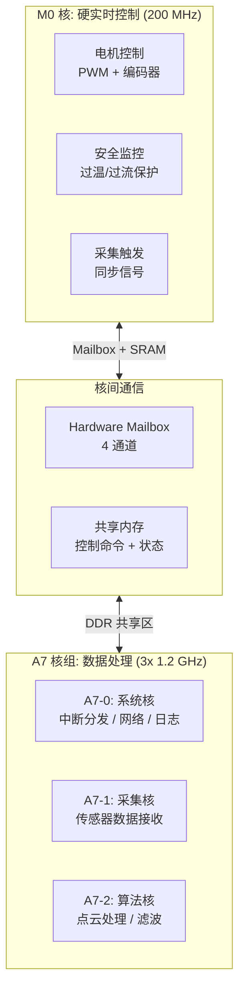
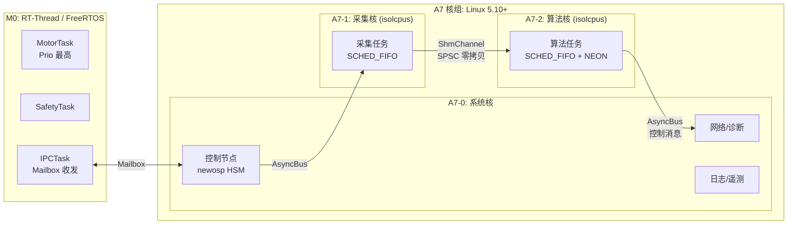
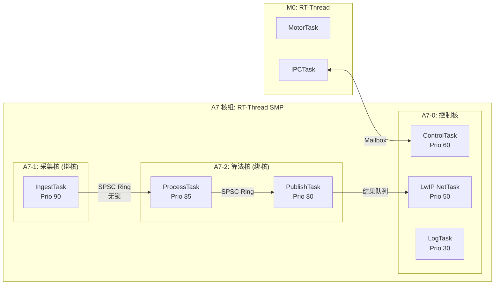
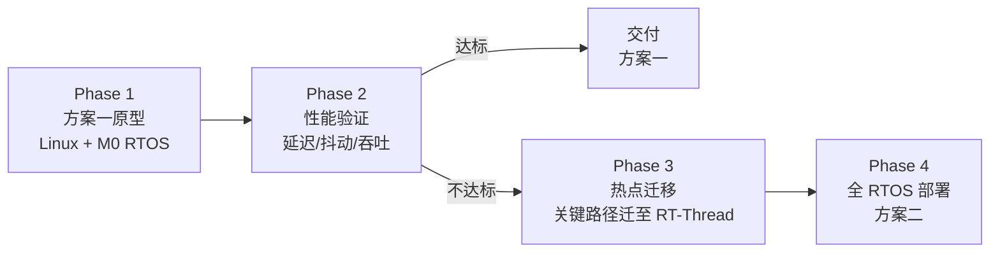

> 原文链接: [CSDN](https://blog.csdn.net/stallion5632/article/details/154877100)
>
> 参考: [RK3506 Datasheet](https://www.rock-chips.com/uploads/pdf/RK3506.pdf),
> [newosp](https://github.com/DeguiLiu/newosp) v0.2.0
>
> 适用场景: 激光雷达、工业视觉、机器人控制器、边缘传感器融合

---

## 1. 设计目标

RK3506J 提供 3 个 Cortex-A7 (1.2 GHz) + 1 个 Cortex-M0 (200 MHz) 的异构多核硬件。本文给出面向工业传感器产品 (激光雷达、工业相机) 的两种部署方案概要设计，并给出选型建议。

### 1.1 量化目标

| 编号 | 目标 | 量化指标 | 验证方法 |
|------|------|----------|----------|
| G-1 | 电机控制实时性 | 中断响应 < 10 us | M0 GPIO 示波器 |
| G-2 | 数据处理延迟 | 端到端 P99 < 5 ms | 硬件时间戳 |
| G-3 | 核间通信延迟 | Mailbox 单程 < 50 us | IPC 延迟测试 |
| G-4 | 系统启动时间 | < 2 s (方案一) / < 500 ms (方案二) | 上电到首帧 |
| G-5 | 连续运行稳定性 | 72h 零崩溃、零内存泄漏 | 长稳压测 |
| G-6 | 热路径零堆分配 | malloc/free 调用 0 次 | 运行时 hook |

### 1.2 硬件约束

| 项目 | 配置 |
|------|------|
| A 核组 | 3x Cortex-A7 @ 1.2 GHz, 32 KB L1 I/D, Thumb-2, NEON VFPv4 |
| M 核 | 1x Cortex-M0 @ 200 MHz, 无 Cache, 无硬件除法, 无 DSP |
| 内存 | 256 MB - 512 MB DDR3/DDR3L |
| 核间通信 | Hardware Mailbox (4 通道), 共享内存 (SRAM / DDR) |
| 外设 | SPI x4, I2C x6, UART x6, USB 2.0, RGMII, SDIO |
| 编译器 | arm-none-eabi-gcc (M0), arm-linux-gnueabihf-gcc (A7) |

---

## 2. 总体架构

### 2.1 异构多核职责划分

RK3506J 的异构设计天然适合 "硬实时 + 高算力" 场景:

### 2.2 核心分工

| 核心 | 职责 | 实时性要求 | 典型任务 |
|------|------|:----------:|----------|
| **M0** | 硬实时控制 | < 10 us | 电机 PWM、编码器读取、安全保护、采集触发 |
| **A7-0** | 系统服务 | 非实时 | Linux 内核、网络协议栈、日志、串口诊断 |
| **A7-1** | 数据采集 | 软实时 | SPI/LVDS 接收、DMA 管理、数据校验 |
| **A7-2** | 算法处理 | 软实时 | 点云滤波、坐标变换、NEON 加速 |

---

## 3. 方案一: Linux + RTOS 混合部署 (推荐)

### 3.1 系统架构

### 3.2 newosp 模块映射

| 功能 | newosp 模块 | 部署位置 | 说明 |
|------|------------|----------|------|
| 控制消息路由 | AsyncBus + Node | A7-0 | MPSC 无锁, 优先级准入 |
| 数据面零拷贝 | ShmChannel (SPSC) | A7-1 -> A7-2 | Wait-free, cache line 对齐 |
| 设备状态管理 | HSM | A7-0 | Init/Ready/Active/Fault/Shutdown |
| 实时调度 | RealtimeExecutor | A7-1, A7-2 | SCHED_FIFO + mlockall + 绑核 |
| 并行处理 | WorkerPool | A7-2 | 多线程点云处理 |
| 定时任务 | TimerScheduler | A7-0 | 心跳、看门狗、遥测 |
| 串口诊断 | SerialTransport | A7-0 | CRC-CCITT + ACK |
| 线程监控 | ThreadWatchdog | A7-0 | 关键线程存活检测 |

### 3.3 核间通信设计

M0 与 A7 之间通过 Hardware Mailbox + 共享 SRAM 通信:

| 通道 | 方向 | 用途 | 消息格式 |
|------|------|------|----------|
| Mailbox CH0 | M0 -> A7 | 电机状态上报 | 16B 定长 (转速 + 编码器 + 温度) |
| Mailbox CH1 | A7 -> M0 | 电机控制命令 | 16B 定长 (目标转速 + 模式) |
| Mailbox CH2 | M0 -> A7 | 安全告警 | 8B (告警码 + 时间戳) |
| Mailbox CH3 | A7 -> M0 | 采集触发同步 | 4B (触发计数) |

**协议约定**:
- Mailbox 中断触发, 非轮询
- 共享 SRAM 区域存放详细数据, Mailbox 仅传递通知和索引
- M0 侧使用原子操作 + memory barrier, A7 侧使用 `acquire/release` 语义

### 3.4 内存分区

| 区域 | 起始地址 | 大小 | 归属 | 用途 |
|------|----------|------|------|------|
| M0 Code + Data | 0x0000_0000 | 128 KB | M0 独占 | RTOS + 应用 |
| 共享 SRAM | 0x0002_0000 | 64 KB | M0 + A7 | Mailbox 数据区 |
| Linux Kernel | 0x6000_0000 | 128 MB | A7 独占 | 内核 + 根文件系统 |
| newosp 框架 | -- | ~2 MB | A7 用户态 | AsyncBus + ShmChannel |
| 数据缓冲 | -- | ~10 MB | A7 用户态 | 点云帧缓冲 |
| DMA 缓冲 | CMA 区域 | 4 MB | A7 DMA | SPI/DMA 接收缓冲 |

### 3.5 优缺点分析

| 维度 | 评估 |
|------|------|
| 开发效率 | 高 -- Linux 生态成熟, 驱动/网络/调试工具丰富 |
| 实时性 | 中 -- A7 侧依赖 isolcpus + SCHED_FIFO, 非硬实时 |
| 算力利用 | 高 -- 3 个 A7 核全部可用于数据处理 |
| 启动时间 | 慢 -- Linux 启动 ~2 s |
| 内存占用 | 高 -- Linux 基础 ~32 MB |
| 维护成本 | 低 -- Linux 应用层开发, 调试手段丰富 |

---

## 4. 方案二: 全 RTOS 部署 (极致实时)

### 4.1 系统架构

### 4.2 任务部署矩阵

| 核心 | 任务 | 优先级 | 栈 | 触发方式 | 亲和绑定 |
|------|------|:------:|:--:|----------|:--------:|
| A7-0 | ControlTask | 60 | 2 KB | Mailbox 中断 | 是 |
| A7-0 | NetTask (LwIP) | 50 | 4 KB | 周期 100 Hz | 是 |
| A7-0 | LogTask | 30 | 2 KB | 周期 10 Hz | 是 |
| A7-1 | IngestTask | 90 | 2 KB | DMA 完成信号量 | 是 |
| A7-2 | ProcessTask | 85 | 4 KB | SPSC Ring 非空 | 是 |
| A7-2 | PublishTask | 80 | 2 KB | SPSC Ring 非空 | 是 |

### 4.3 数据通道

A7 核间采用 SPSC 无锁 Ring Buffer 传递数据 (所有权转移模型):

| 属性 | 机制 |
|------|------|
| 无 ABA 问题 | 单生产者单消费者, 无 CAS |
| 无数据撕裂 | uint32_t 对齐, ARM 原子 LDR/STR |
| 内存序正确 | DMB 保证数据/索引写入顺序 |
| 无 false sharing | head/tail 间 32B padding |

### 4.4 优缺点分析

| 维度 | 评估 |
|------|------|
| 开发效率 | 低 -- 需自行移植 LwIP/USB 协议栈, 无现成驱动 |
| 实时性 | 高 -- 全系统确定性调度, 中断响应 < 15 us |
| 算力利用 | 高 -- 3 个 A7 核 + NEON, 无 Linux 内核开销 |
| 启动时间 | 快 -- < 500 ms |
| 内存占用 | 低 -- RTOS 基础 < 512 KB |
| 维护成本 | 高 -- 所有协议栈需自行维护和调试 |

---

## 5. 方案决策矩阵

| 维度 | 权重 | 方案一 (Linux+RTOS) | 方案二 (全 RTOS) |
|------|:----:|:-------------------:|:----------------:|
| 开发效率 | 30% | 9 | 4 |
| 实时性 | 25% | 6 | 9 |
| 算力利用 | 15% | 8 | 9 |
| 启动时间 | 10% | 5 | 9 |
| 内存效率 | 10% | 5 | 9 |
| 维护成本 | 10% | 8 | 4 |
| **加权总分** | **100%** | **7.15** | **6.75** |

### 5.1 推荐路径

**建议**:

1. **首选方案一** (Linux + M0 RTOS) -- 开发效率高, 生态成熟, 适合快速原型和首版交付
2. **方案二作为演进目标** -- 当方案一无法满足延迟/抖动要求时, 逐步将热点迁移到 RT-Thread SMP
3. **渐进式迁移** -- 先在 Linux 上用 newosp RealtimeExecutor (isolcpus + SCHED_FIFO) 尝试优化, 若仍不足再考虑全 RTOS

---

## 6. 资源预算

### 6.1 方案一资源预算

| 资源 | M0 | A7 核组 | 总计 |
|------|:--:|:-------:|:----:|
| RAM | ~32 KB | ~48 MB (Linux+newosp+缓冲) | ~48 MB |
| Flash | ~64 KB | ~32 MB (内核+根文件系统) | ~32 MB |
| CPU 占用 | < 30% | A7-0 < 40%, A7-1/2 < 70% | -- |

### 6.2 方案二资源预算

| 资源 | M0 | A7 核组 | 总计 |
|------|:--:|:-------:|:----:|
| RAM | ~32 KB | ~4 MB (RTOS+LwIP+缓冲) | ~4 MB |
| Flash | ~64 KB | ~2 MB (RTOS 镜像) | ~2 MB |
| CPU 占用 | < 30% | A7-0 < 30%, A7-1/2 < 70% | -- |

---

## 7. 总结

核心设计决策:

1. **M0 专责硬实时**: 电机控制、安全保护等微秒级响应任务固定在 M0, 与应用层完全隔离
2. **Hardware Mailbox 核间通信**: 中断驱动、低延迟, 共享 SRAM 传递详细数据
3. **方案一优先**: 利用 Linux 生态快速交付, newosp 的 RealtimeExecutor + ShmChannel 在用户态提供软实时保障
4. **渐进式演进**: 通过量化验证 (延迟/抖动/吞吐) 驱动方案选择, 避免过度设计

---

> 原文链接: [CSDN](https://blog.csdn.net/stallion5632/article/details/154877100)
