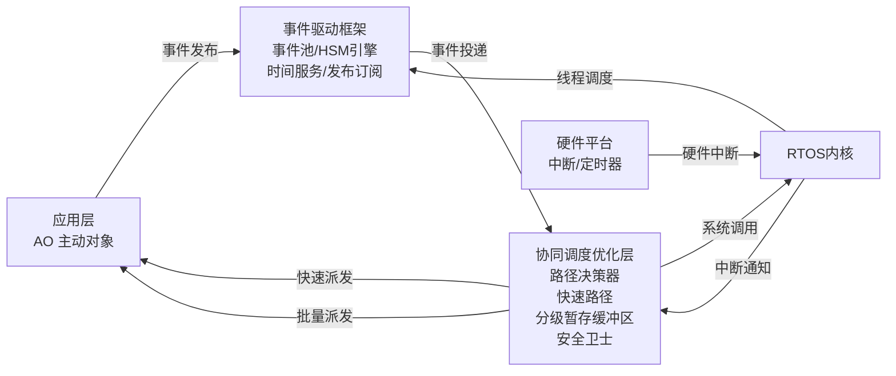
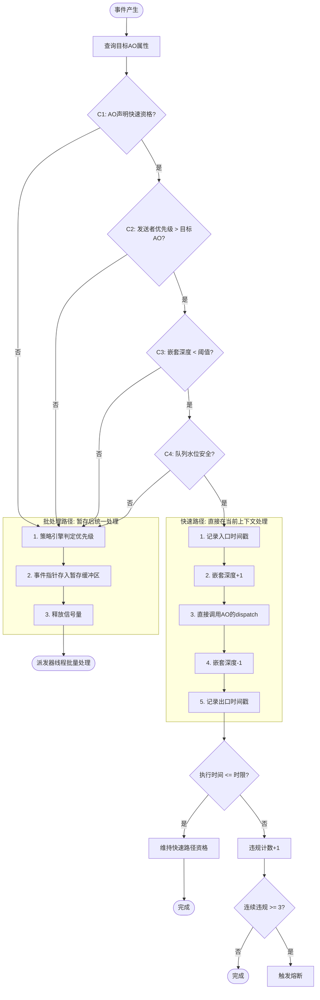
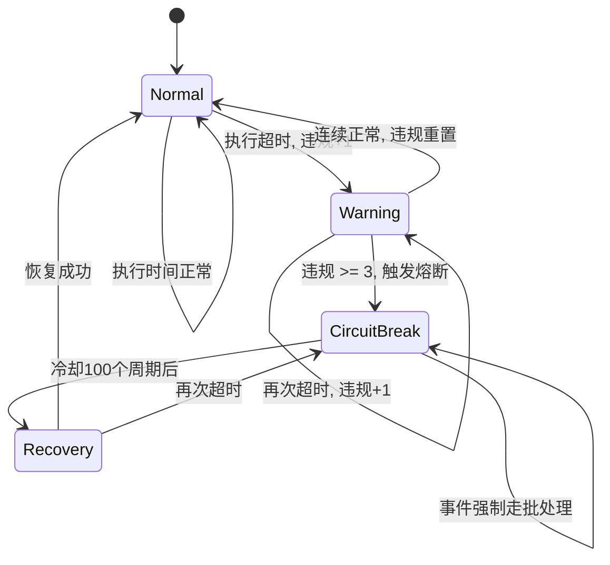
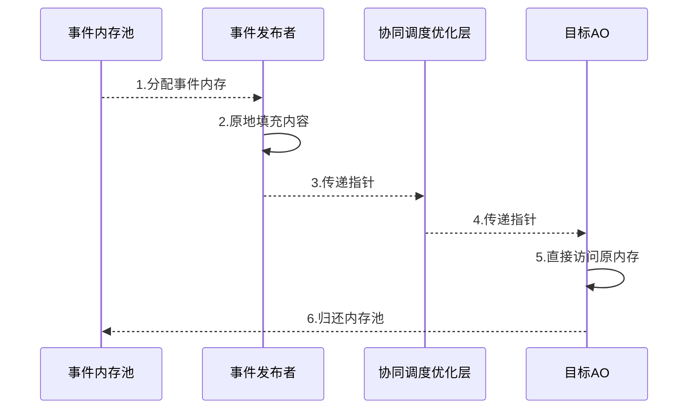
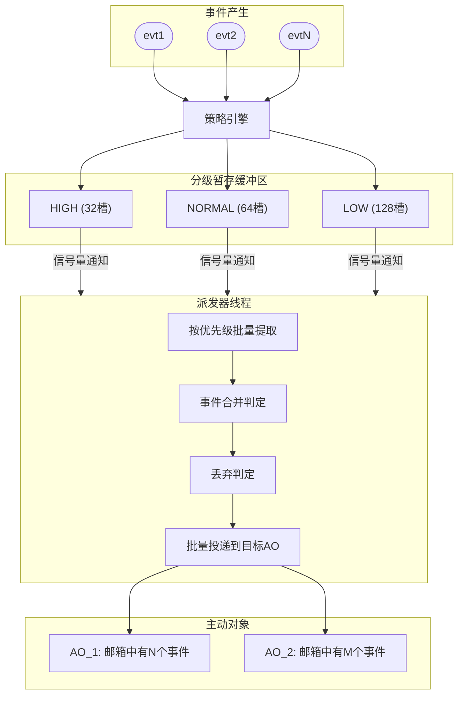
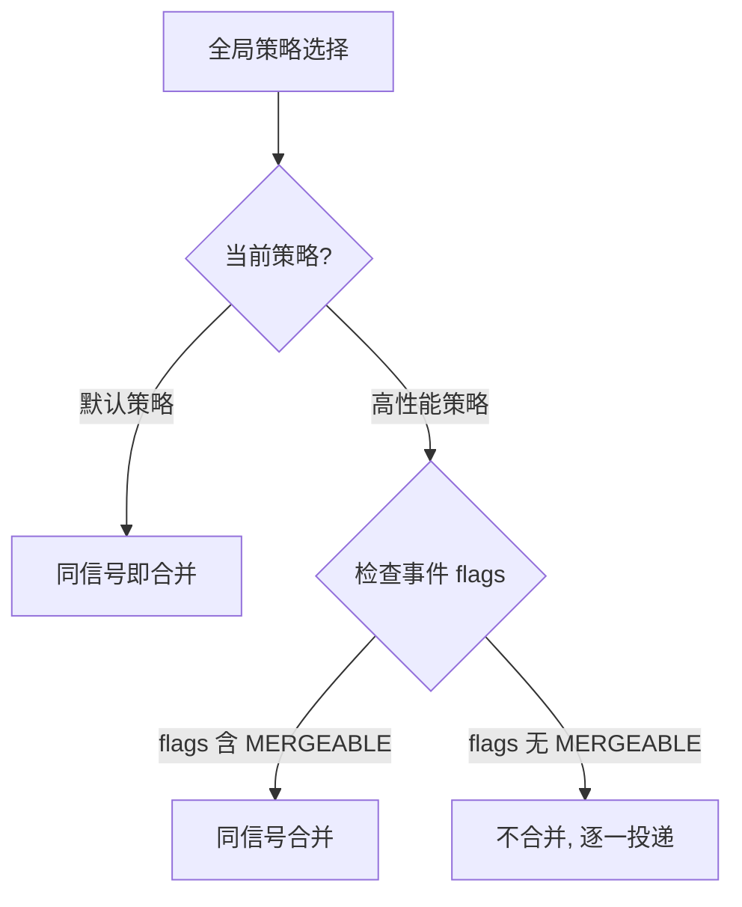

## 1. 问题: 浅层适配的七个缺陷

### 1.1 主动对象模式回顾

主动对象 (Active Object, AO) 是一种并发设计模式，每个 AO 拥有三个基本要素:

1. **独立的执行线程**: 每个 AO 在独立的 RTOS 线程中运行
2. **私有的事件队列**: 外部通过向该队列发送事件来与 AO 通信
3. **内部状态机**: AO 内部使用层次状态机 (HSM) 处理事件

这种模式通过异步事件通信避免了共享数据和互斥锁带来的并发问题。典型实现包括 QP/C 和 QP/C++ 等框架。**1 个 AO = 1 个 RTOS 线程 = 1 个可调度实体**。

### 1.2 当前主流移植方式

将 AO 框架移植到 RTOS 的主流做法是**浅层适配**: 为每个 AO 创建独立的 RTOS 线程和消息队列，通过 API 映射实现功能集成。每个 AO 对应一个 RTOS 线程; 事件队列直接使用 RTOS 消息队列或邮箱; 事件投递时将数据拷贝入队，接收时再拷贝出队。

这种方式实现简单、移植快速，但仅停留在 API 映射层面，未对事件传递和调度流程进行深度优化。

### 1.3 七个具体缺陷

**缺陷一: 破坏 run-to-complete 语义。** AO 的核心约束是事件处理函数必须不间断执行完毕，不可在中途阻塞。浅层适配未建立语义隔离层，使得 RTOS 的阻塞语义泄漏到了事件驱动框架内部。

**缺陷二: 调度开销大。** 一个事件从产生到处理需经历"入队 -> memcpy -> 调度器介入 -> 上下文保存 -> 线程切换 -> 上下文恢复 -> 出队 -> memcpy -> 处理"的完整链路。在 RISC-V 37MHz 处理器上，一次完整上下文切换消耗约 4000+ CPU 周期，响应延迟达 118us。

**缺陷三: 双重内存拷贝。** RTOS 消息队列采用值拷贝语义，发送时拷贝入队，接收时拷贝出队。32 字节事件每次传递需 64 字节拷贝，高频场景下内存拷贝可占传递总耗时 30% 以上。

**缺陷四: 高优先级事件无差异化处理。** 所有事件无论紧急程度都必须走完相同的全流程。

**缺陷五: 缺乏突发批量处理能力。** 短时间大量事件每个独立触发一次上下文切换，造成"调度风暴"，同一事件处理延迟的变异性高达 200%。

**缺陷六: 策略固化。** 没有机制根据负载动态合并冗余事件或在过载时智能丢弃非关键事件。

**缺陷七: 资源消耗大。** 每个 AO 需要独立的 RTOS 线程和消息队列，在资源受限的 MCU 上限制了可创建的 AO 数量。

## 2. 方案: 协同调度优化层

在 AO 框架与 RTOS 内核之间构建**协同调度优化层**，作为统一的事件派发决策中枢。该层包含六个功能模块: 直接派发模块、零拷贝传递模块、分级暂存批处理模块、策略引擎模块、运行时监控模块、熔断/恢复管理模块。



**初始化顺序:**

| 阶段 | 关键操作 | 依赖 |
|------|---------|------|
| 第一阶段: RTOS 初始化 | 创建内存堆、空闲线程、滴答定时器 | 无 |
| 第二阶段: 优化层初始化 | 分配三级缓冲区; 创建派发器线程; 初始化信号量; 重置熔断状态 | 依赖第一阶段 |
| 第三阶段: 框架与业务初始化 | 创建事件池; 启动各 AO 线程; 注册快速派发属性 | 依赖第二阶段 |

## 3. 快速路径: 直接派发机制

### 3.1 核心思路: 解耦事件派发与目标线程

传统方案中，事件派发**必须**在目标 AO 的专属线程中执行。核心创新在于**解耦事件派发与目标 AO 线程**，使 dispatch 可以发生在不同的执行上下文中:

| 路径 | 谁执行 dispatch | 线程切换次数 |
|------|----------------|-------------|
| 快速路径 (ISR 上下文) | 当前中断处理函数直接调用目标 AO 的 dispatch | 0 次 |
| 快速路径 (线程上下文) | 发送者线程直接调用目标 AO 的 dispatch | 0 次 |
| 批处理路径 | 派发器线程投递到目标 AO 队列，目标 AO 线程自己 dispatch | 1 次 |

dispatch 本质上是一次函数调用。只要满足安全准入条件，这个函数调用不必非在目标 AO 的线程中发生。

### 3.2 四项安全准入检查

快速路径仅在以下四项检查**全部通过**时启用，任一不通过则自动降级到批处理路径 (事件不丢失):

**C1: 资格预声明。** 目标 AO 须在初始化阶段显式声明"直接派发"属性。"默认关闭，显式启用"，防止误用。

**C2: 优先级匹配。** 发送者线程优先级须高于目标 AO 线程优先级。若目标 AO 优先级更高，RTOS 抢占式调度本身已能保证快速响应; 反过来在低优先级上下文执行高优先级 AO 的处理函数会导致优先级反转。ISR 上下文自动通过此检查。

**C3: 嵌套深度。** 当前直接派发递归嵌套深度须小于阈值 (默认 3 层)。限制嵌套深度防止栈溢出 (嵌入式系统栈通常仅 2-4KB)，保证实时确定性，防止中断风暴。

```
// 嵌套场景示例
ISR_1() {
    // nestingDepth = 0 -> 1
    ao1->dispatch(evt1);  // 直接派发
        ISR_2() {         // 中断抢占
            // nestingDepth = 1 -> 2
            ao2->dispatch(evt2);
                ISR_3() { // 再次抢占
                    // nestingDepth = 2 -> 3 (达到阈值)
                    // 拒绝直接派发，放入暂存缓冲区
                }
        }
}
```

嵌套深度达到阈值时，事件指针被放入分级暂存缓冲区，释放信号量通知派发器线程，当前 ISR 正常返回。

**C4: 队列水位。** 目标 AO 的事件队列须有足够空闲空间。

### 3.3 事件路径决策流程



### 3.4 熔断保护机制

三层安全保护:

**第一层: 执行时间监控。** 每次快速派发记录进出时间戳，超过预设时限 (默认 50us) 即记录违规。

**第二层: 违规计数与熔断。** 每个 AO 维护连续违规计数器。连续违规达阈值 (默认 3 次) 触发熔断，该 AO 后续所有事件自动降级到批处理路径，实现故障隔离。

**第三层: 自动恢复。** 熔断后进入冷却期 (默认 100 个派发周期)，期满自动恢复资格并重置计数。



| 参数 | 配置宏 | 默认值 |
|------|--------|--------|
| 最大嵌套深度 | QF_MAX_NEST_DEPTH | 3 |
| 最大执行时间 | QF_MAX_EXEC_TIME_US | 50us |
| 熔断阈值 | QF_VIOLATION_THRESHOLD | 3 |
| 恢复周期 | QF_RECOVERY_CYCLES | 100 |

## 4. 零拷贝传递机制

### 4.1 指针传递 + 唯一所有权

事件从分配到回收始终驻留在事件内存池同一地址，只有指针在各模块间传递。

| 指标 | 传统方案 | 优化方案 |
|------|---------|---------|
| 内存拷贝次数 | 2 次 (入队+出队) | **0 次** |
| 每次传输数据量 | 事件全量 (如 32 字节) | **仅一个指针** |
| CPU 开销 | 高 | **极低** |



### 4.2 唯一所有权语义

事件在任一时刻有且仅有一个所有者，所有权按固定顺序转移: **内存池 -> 发布者 -> 优化层 -> 目标 AO -> 内存池 (回收)**。

| 阶段 | 持有者 | 允许操作 | 禁止操作 |
|------|--------|---------|---------|
| 已分配 | 发布者 | 填充事件内容 | 其他模块访问 |
| 已发布 | 优化层 | 暂存、路由 | 发布者修改 |
| 已派发 | 目标 AO | 读取和处理 | 优化层访问 |
| 已处理 | 内存池 | 回收、重新分配 | AO 继续访问 |

多播场景使用引用计数: 事件进入暂存缓冲区时自动递增引用计数，防止提前回收导致悬空指针。

### 4.3 内存屏障保障

在零拷贝机制中，所有权转移点必须插入内存屏障，解决 CPU/编译器重排序和缓存可见性问题:

- **所有权转移点 1 (发布者 -> 优化层)**: 事件指针写入暂存缓冲区后、更新尾索引之前，插入写屏障
- **所有权转移点 2 (优化层 -> 目标 AO)**: 派发器线程从缓冲区提取事件指针后、目标 AO 访问内容之前，插入读屏障

| 架构 | 写屏障 | 读屏障 |
|------|--------|--------|
| ARM Cortex-M | DMB | DMB |
| RISC-V | FENCE W,W | FENCE R,R |
| GCC 通用 | __sync_synchronize() | __sync_synchronize() |

单核 MCU 上 ISR 与线程之间也存在可见性问题，此时内存屏障的主要作用是禁止编译器重排序 (通过 `"memory"` clobber 约束)。

## 5. 分级暂存与批处理

### 5.1 三级暂存缓冲区

三个独立的环形缓冲区按优先级分区:

| 优先级 | 默认容量 | 典型内容 | 处理顺序 |
|--------|---------|---------|---------|
| HIGH | 32 槽 | 紧急控制指令、安全报警 | 最先处理 |
| NORMAL | 64 槽 | 常规业务事件 | HIGH 清空后 |
| LOW | 128 槽 | 日志、统计上报、重试事件 | 最后处理 |

每个槽位存储事件指针 + 目标 AO 指针 + 时间戳，体现零拷贝原则。

### 5.2 派发器线程工作流程

派发器线程以**最高优先级**运行:

1. **等待信号量**: 无事件时阻塞，不消耗 CPU
2. **处理熔断恢复**: 递减被熔断 AO 的恢复倒计时
3. **按优先级提取**: 严格 HIGH -> NORMAL -> LOW 顺序
4. **策略引擎处理**: 对每个事件调用合并/丢弃判定
5. **批量投递**: 连续将多个事件投递到各目标 AO 的邮箱，直到本轮缓冲区清空。所有 AO 线程在派发器线程工作期间不会被调度，效果等同于"一次性投递、一次唤醒、批量处理"
6. **背压处理**: 投递失败的事件，若带有 NO_DROP 标志且重试次数未超上限 (默认 3 次)，放回 LOW 队列重试; 否则安全丢弃并记录统计



### 5.3 实时性保证

三重机制确保关键事件不被延误:

- **优先级严格保序**: HIGH 队列完全清空后才处理 NORMAL，高优先级事件最大延迟 < 5ms
- **关键事件立即唤醒**: 每次有事件进入暂存缓冲区时立即释放信号量唤醒派发器线程
- **防饿死机制**: 低优先级队列等待时间超过阈值时，强制提取至少 1 个事件

**批处理收益对比:**

| 场景 | 传统方案 | 优化方案 |
|------|---------|---------|
| 100 个中断事件 | 100 次上下文切换 | **1 次上下文切换** |
| 调度器调用次数 | 100 次 | **1 次** |
| 系统抖动 | 高 | **低** |

### 5.4 空闲钩子补偿

利用 RTOS 空闲钩子 (idle hook) 作为安全补偿机制: 每次调度器进入空闲状态时遍历三级缓冲区，检测到非空则立即释放信号量唤醒派发器线程。防止极端情况下信号量通知丢失导致事件滞留。

## 6. 可插拔策略引擎

### 6.1 策略接口

四个函数指针接口:

| 决策点 | 接口 | 功能 |
|--------|------|------|
| 合并判定 | shouldMerge(prev, next) | 判断两事件是否可合并 |
| 丢弃判定 | shouldDrop(evt, targetAO) | 判断事件是否可安全丢弃 |
| 优先级映射 | getPrioLevel(evt) | 映射到 HIGH/NORMAL/LOW |
| 优先级比较 | comparePriority(a, b) | 同级队列排序 |

### 6.2 预置策略

**默认策略 (安全优先):** 信号值相等即合并，从不丢弃，所有事件统一放入 NORMAL 队列。适用于安全关键场景。

**高性能策略 (过载优雅降级):** 引入扩展事件标志 (MERGEABLE、CRITICAL) 和显式优先级字段。队列水位超 80% 时主动丢弃非 CRITICAL 事件; 仅合并同时标记 MERGEABLE 的同信号事件。在高频传感器数据采集 + 安全报警并存的场景中，ADC 采样事件标记 MERGEABLE (只关心最新值)，温度超限报警标记 CRITICAL (每条都重要)。

### 6.3 两层策略配置

系统采用"**全局策略选择 + 单事件标记**"两层配合:



策略通过单条指针赋值原子切换，新策略在下一个派发周期生效，无需重启。

## 7. 典型应用场景

**场景 A: 高优先级突发响应。** 传感器报警中断 -> ISR 创建紧急事件 -> 四项检查全通过 -> 快速路径直接处理 -> 总延迟 23us (传统方案 118us)。

**场景 B: 中断风暴下的批处理。** 连续 7 个中断事件: 前 2 个通过快速路径直接处理; 后 5 个因嵌套深度达限进入暂存缓冲区; 中断返回后派发器线程批量处理，其中 2 个相同信号事件被合并。结果: 7 个事件仅需 2 次直接派发 + 1 次批处理。

## 8. 性能实测

### 8.1 测试环境

**平台一 (RISC-V 低频):** CV1800B SoC (C906 核心)，64 位，37MHz，64MB DDR2，RT-Thread v5.1.0，QP/C v7.3.0，gcc-riscv64 10.3.0，-O2 优化。

**平台二 (ARM 高频):** Cortex-M4，180MHz，192KB RAM，RT-Thread v4.0.5，QP/C v6.9.3，-O2 优化。

**方法:** 同一代码库、同一硬件，通过运行时接口启用/禁用优化层进行 A/B 对照。每轮 1000 个事件，重复 10 轮取平均。

### 8.2 实测结果

**平台一 (RISC-V 37MHz):**

| 指标 | 传统方案 | 优化方案 | 改进 | 归因 |
|------|---------|---------|------|------|
| 中断至响应延迟 | 118 us | 23 us | **-80.5%** | 快速路径绕过调度器 |
| 持续吞吐量 | 8.5 KHz | 35.2 KHz | **+314%** | 快速路径 + 零拷贝 |
| 峰值突发吞吐量 | 8.5 KHz | 43.5 KHz | **+412%** | 批处理合并调度 |
| 上下文切换 (1000 事件) | ~1010 次 | ~10 次 | **-99%** | 快速路径 + 批处理 |
| 内存拷贝 | 2 次/事件 | 0 次 | **消除 100%** | 零拷贝 |

**平台二 (ARM Cortex-M4 180MHz):**

| 指标 | 传统方案 | 优化方案 | 改进 |
|------|---------|---------|------|
| 中断至响应延迟 (us) | 125.6 | 24.3 | **-80.7%** |
| 吞吐量 (KHz) | 8.2 | 32.6 | **+297.6%** |
| 延迟抖动 (标准差 us) | 52.3 | 18.5 | **-64.6%** |
| 空闲 CPU 占用 (%) | 12.4 | 8.6 | **-30.6%** |

两个平台结果高度一致，证明优化效果具有跨架构普适性。在 37MHz 低频平台上，传统方案响应链路消耗约 4366 CPU 周期 (118us x 37MHz)，优化后压缩至约 851 周期 (23us x 37MHz)，相当于通过软件优化实现了 5 倍响应速度提升。

## 9. 各技术特征的协同关系

各技术特征并非独立模块，而是深度耦合的有机整体:

| 依赖关系 | 具体说明 |
|---------|---------|
| 快速路径 -> 零拷贝传递 | 快速路径依赖零拷贝提供的指针传递基础设施 |
| 快速路径 -> 熔断机制 | 熔断机制为快速路径提供安全兜底 |
| 快速路径 -> 批处理路径 | 批处理路径是快速路径不满足条件时的自动降级目标 |
| 批处理路径 -> 策略引擎 | 事件合并、丢弃、分级依赖策略引擎 |
| 所有路径 -> 共享基础设施 | 共享事件内存池、引用计数和同步原语 |

## 10. 总结

协同调度优化层的设计思想可以归纳为三个原则:

1. **差异化处理**: 不是所有事件都需要走完整调度流程。满足安全条件的高优先级事件可以在当前上下文直接处理; 不满足条件的事件暂存后批量处理
2. **渐进式降级**: 快速路径 -> 批处理路径 -> 背压重试 -> 安全丢弃，每一级都有明确的降级条件和安全保障
3. **可观测可调**: 内建完整的度量指标体系 (派发周期数、合并/丢弃/重试事件数、熔断触发次数等)，通过 RTOS Shell 命令实时暴露，支持不停机监控和策略调优

这种设计适用于基于 AO 模式的事件驱动框架 (如 QP/C、QP/C++) 与各类 RTOS (RT-Thread、FreeRTOS、Zephyr) 的组合应用场景，尤其适用于资源受限的 MCU 平台 (ARM Cortex-M、RISC-V)。
