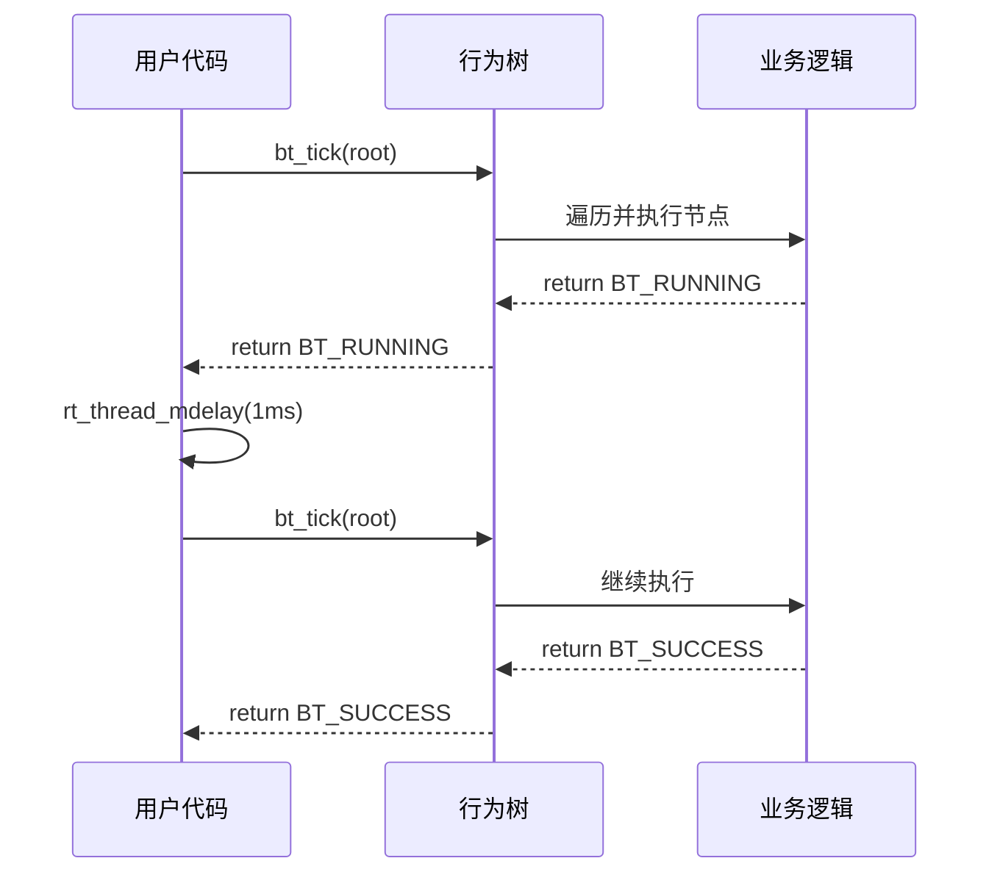
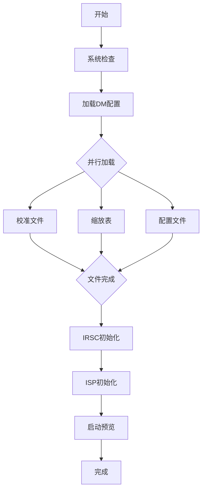
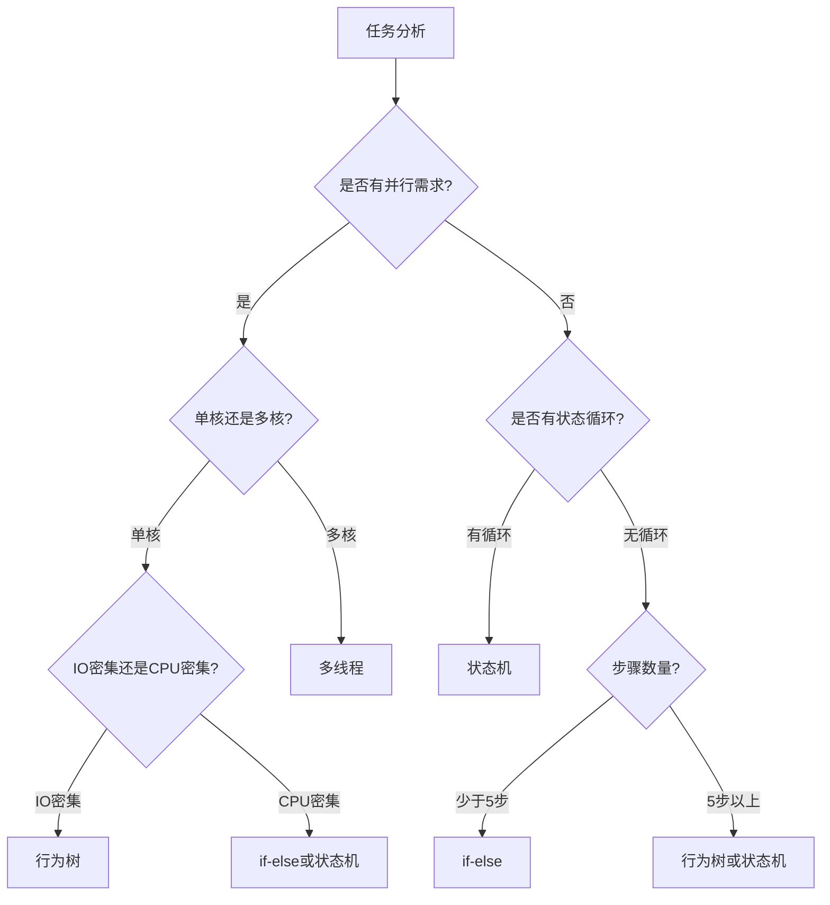

在 37MHz 的单核 MCU 上，如何让 Camera 启动时间从 1533ms 降到 797ms？答案不在硬件升级，而在软件架构: 用行为树的 Tick 机制替代串行阻塞调用，让 CPU 在等待 Flash 读取的 70ms 里去做其他有用的事情。

## 1. Tick 机制核心原理

### 1.1 什么是 Tick

Tick 是行为树的"心跳"机制，每次 tick 代表一次完整的树遍历执行周期。



核心代码:

```c
bt_status_t bt_tick(bt_node_t *root)
{
    if (BT_UNLIKELY(root == BT_NULL)) {
        return BT_ERROR;
    }
    return bt_tick_internal(root);
}
```

### 1.2 状态码与节点类型

```c
typedef enum {
    BT_SUCCESS = 0U,  // 节点执行成功
    BT_FAILURE = 1U,  // 节点执行失败
    BT_RUNNING = 2U,  // 节点仍在执行中 (异步操作的关键)
    BT_ERROR   = 3U   // 节点错误
} bt_status_t;
```

| 类型 | 说明 | 用途 |
|------|------|------|
| `BT_ACTION` | 动作节点 (叶子) | 执行具体操作 |
| `BT_CONDITION` | 条件节点 (叶子) | 检查状态 |
| `BT_SEQUENCE` | 顺序节点 (组合) | 全部成功才成功 (AND) |
| `BT_SELECTOR` | 选择节点 (组合) | 一个成功就成功 (OR) |
| `BT_PARALLEL` | 并行节点 (组合) | 协作式多任务核心 |
| `BT_INVERTER` | 反转节点 (装饰) | 反转子节点结果 |

### 1.3 节点结构设计

```c
struct bt_node {
    /* 热数据区 (16 字节, 高频访问) */
    bt_node_type_t type;              // 1B
    bt_status_t status;               // 1B
    bt_uint16_t children_count;       // 2B
    bt_uint16_t current_child;        // 2B (SEQUENCE 用)
    bt_parallel_policy_t success_policy; // 1B
    bt_uint8_t _reserved;             // 1B 对齐
    bt_uint32_t child_done_bits;      // 4B (位图)
    bt_uint32_t child_success_bits;   // 4B (位图)

    /* 回调区 (24 字节) */
    bt_tick_fn tick;
    bt_enter_fn on_enter;
    bt_exit_fn on_exit;

    /* 指针区 (24 字节) */
    struct bt_node **children;
    void *user_data;
    void *blackboard;

    /* 扩展 (4 字节) */
    bt_uint32_t time_anchor_ms;
};
```

热数据字段置于结构体前部，对 CPU 指令缓存友好。整个节点结构体 64 字节，恰好一个缓存行。

## 2. PARALLEL 节点与协作式多任务

### 2.1 PARALLEL 节点: 并发的核心

```c
static bt_status_t bt_tick_parallel(bt_node_t *node)
{
    bt_uint16_t running_count = 0;
    bt_uint16_t success_count = 0;
    bt_uint16_t failure_count = 0;

    /* 首次进入: 重置位图 */
    if (node->status != BT_RUNNING) {
        node->child_done_bits = 0;
        node->child_success_bits = 0;
    }

    for (i = 0; i < node->children_count; i++) {
        bt_uint32_t bit_mask = (1 << i);

        /* 位图优化: O(1) 跳过已完成节点 */
        if (node->child_done_bits & bit_mask) {
            if (node->child_success_bits & bit_mask) {
                success_count++;
            } else {
                failure_count++;
            }
            continue;
        }

        child_status = bt_tick_internal(child);

        if (child_status == BT_RUNNING) {
            running_count++;
        } else if (child_status == BT_SUCCESS) {
            node->child_done_bits |= bit_mask;
            node->child_success_bits |= bit_mask;
            success_count++;
        } else {
            node->child_done_bits |= bit_mask;
            failure_count++;
        }
    }

    if (running_count > 0) {
        return BT_RUNNING;
    }

    if (node->success_policy == BT_PARALLEL_REQUIRE_ALL) {
        return (failure_count == 0) ? BT_SUCCESS : BT_FAILURE;
    } else {
        return (success_count > 0) ? BT_SUCCESS : BT_FAILURE;
    }
}
```

三个关键优化:
1. **零内存分配**: 位图在节点结构内，无动态分配
2. **O(1) 跳过**: 已完成的节点通过位图快速跳过
3. **协作式调度**: 每个子节点主动返回 RUNNING 让出 CPU

### 2.2 BT_RUNNING 状态: 协作式多任务的关键

```c
// 非阻塞文件加载 Action 节点
static bt_status_t action_load_file(bt_node_t *self)
{
    file_ctx_t *ctx = (file_ctx_t *)self->user_data;

    switch (ctx->state) {
        case FILE_IDLE:
            nand_read_async_start(ctx->fd);
            ctx->state = FILE_READING;
            return BT_RUNNING;  // 让出 CPU, Flash 读取中

        case FILE_READING:
            if (!nand_is_ready(ctx->fd)) {
                return BT_RUNNING;  // 继续等待, 不阻塞
            }
            ctx->state = FILE_TRANSFERRING;
            return BT_RUNNING;

        case FILE_TRANSFERRING:
            if (dma_transfer_complete(ctx->fd)) {
                ctx->state = FILE_DONE;
                return BT_SUCCESS;
            }
            return BT_RUNNING;

        default:
            return BT_FAILURE;
    }
}
```

对比传统阻塞版本:

```c
static int load_file_blocking(const char *path)
{
    fd = open(path);
    nand_read_blocking(fd);     // 阻塞 100ms, CPU 空闲 70ms
    dma_transfer_blocking(fd);  // 阻塞 24ms
    close(fd);
    return 0;
}
// 问题: CPU 在等待 Flash 时无法执行其他任务
// 100ms 中有 70ms CPU 完全空闲
```

## 3. 行为树的静态本质

### 3.1 破除"动态 AI"误解

行为树是**静态规则树**，结构在编译时固定。所谓"动态"只是状态保存的视觉效果。

```c
/* 静态节点池 (编译时分配) */
static bt_node_t s_bt_nodes[24];  // 24 个节点, 固定大小

/* 静态子节点数组 */
static bt_node_t *s_parallel_load_children[3];
static bt_node_t *s_root_children[5];

/* 构建树 (静态连接) */
static bt_node_t *camera_bt_build_tree(camera_bt_blackboard_t *bb)
{
    int idx = 0;
    bt_node_t *n_root = &s_bt_nodes[idx++];
    bt_node_t *n_check = &s_bt_nodes[idx++];
    // ... 所有节点都是静态的
    return n_root;  // 返回静态树
}
```

看起来"动态"的原因:

```c
// Tick 1: current_child=0, 执行第 1 个子节点
// Tick 2: current_child=1, 执行第 2 个子节点
// Tick 3: current_child=2, 执行第 3 个子节点
// 看起来像"动态推进", 实际只是 current_child 状态变化
```

| 维度 | 传统 if-else | 行为树 |
|------|-------------|--------|
| 结构 | 代码硬编码 | 节点静态连接 |
| 执行 | 阻塞执行 | 状态保存+恢复 |
| "动态" | 无 | current_child 递增 |
| 内存 | 栈 | 静态数组 |

### 3.2 行为树 = if-else 的结构化替代

if-else 版本 (意大利面条代码):

```c
int camera_start_preview_serial(void)
{
    if (system_check() != OK) return ERROR;
    if (load_dm_config() != OK) return ERROR;
    if (load_cali_file() != OK) return ERROR;   // 串行
    if (load_zoom_table() != OK) return ERROR;   // 串行
    if (load_config_file() != OK) return ERROR;  // 串行
    if (init_irsc() != OK) return ERROR;
    if (init_isp() != OK) return ERROR;
    return start_preview();
}
// 问题: 无法并行加载 3 个文件
```

行为树版本:

```
ROOT (SEQUENCE)
+-- system_check
+-- load_dm_config
+-- parallel_load (PARALLEL)   <-- 并行执行
|   +-- load_cali_files
|   +-- load_zoom_tables
|   +-- load_config_files
+-- init_hardware (SEQUENCE)
|   +-- init_irsc
|   +-- init_isp
+-- start_preview
```

## 4. Camera 启动实战案例

### 4.1 业务流程



### 4.2 行为树映射

```c
static bt_node_t *camera_bt_build_tree(camera_bt_blackboard_t *bb)
{
    BT_INIT_ACTION(n_check, action_system_check, bb);
    BT_INIT_ACTION(n_load_dm, action_load_dm_config, bb);
    BT_INIT_ACTION(n_load_cali, action_load_cali_files, bb);
    BT_INIT_ACTION(n_load_zoom, action_load_zoom_tables, bb);
    BT_INIT_ACTION(n_load_config, action_load_config_files, bb);
    BT_INIT_ACTION(n_init_irsc, action_init_irsc, bb);
    BT_INIT_ACTION(n_init_isp, action_init_isp, bb);

    /* 并行节点 (关键优化点) */
    s_parallel_children[0] = n_load_cali;
    s_parallel_children[1] = n_load_zoom;
    s_parallel_children[2] = n_load_config;
    BT_INIT_PARALLEL_ALL(n_parallel_load, s_parallel_children, bb);

    /* 根节点 */
    s_root_children[0] = n_check;
    s_root_children[1] = n_load_dm;
    s_root_children[2] = n_parallel_load;  // 并行加载
    s_root_children[3] = n_init_hw;
    s_root_children[4] = n_init_streams;
    BT_INIT_SEQUENCE(n_root, s_root_children, bb);

    return n_root;
}
```

### 4.3 黑板模式: 节点间共享数据

```c
typedef struct {
    camera_para_t *camera_para;
    rt_tick_t startup_start_tick;
    rt_uint32_t tick_count;

    hw_context_t irsc_hw;
    hw_context_t isp_hw;

    file_load_ctx_t cali_files[CAMERA_BT_MAX_PARALLEL_FILES];

    rt_bool_t system_check_done;
    rt_bool_t irsc_ready;
    rt_bool_t isp_ready;
} camera_bt_blackboard_t;
```

### 4.4 主循环驱动

```c
camera_bt_err_t camera_bt_start_preview_svc(void)
{
    bt_status_t status;
    bt_node_t *root;
    rt_tick_t timeout_tick;

    rt_memset(&s_blackboard, 0, sizeof(s_blackboard));
    s_blackboard.camera_para = camera_get_camera_para();
    s_blackboard.startup_start_tick = rt_tick_get();

    root = camera_bt_build_tree(&s_blackboard);
    timeout_tick = rt_tick_get() + rt_tick_from_millisecond(10000);

    do {
        status = bt_tick(root);
        s_blackboard.tick_count++;
        if (rt_tick_get() > timeout_tick) {
            return CAMERA_BT_TIMEOUT;
        }
        if (status == BT_RUNNING) {
            rt_thread_mdelay(1);  // 1ms 轮询间隔
        }
    } while (status == BT_RUNNING);

    return (status == BT_SUCCESS) ? CAMERA_BT_OK : CAMERA_BT_ERROR;
}
```

### 4.5 性能对比

| 指标 | 串行模式 | 行为树模式 | 提升 |
|------|---------|-----------|------|
| 总启动时间 | 1533ms | 797ms | **-48%** |
| CPU 利用率 | 29.5% | 57.9% | +28.4% |
| 文件加载 | 串行 (3x100ms) | 并行 (~100ms) | -66% |
| 硬件初始化 | 串行 (IRSC->ISP) | 部分并行 | -30% |

**时间轴对比:**

```
串行版本 (1533ms):
0----100--200--300----800----1300----1533
|    |    |    |     |      |       |
文件1 文件2 文件3 ...  IRSC   ISP    完成
                    (等500ms) (等500ms)

行为树版本 (797ms):
0-----------450---650---797
|            |     |      |
文件1/2/3并行  IRSC   ISP   完成
(同时加载)  (并行配置)
```

## 5. 单核 MCU 优化策略

### 5.1 单核 MCU 的"并行"本质

单核 MCU 没有真正的 CPU 并行，只有 **IO 并发**。

```
多核 CPU (真并行):
Core1: [########] 文件1加载 (CPU工作)
Core2: [########] 文件2加载 (CPU工作)  <-- 同时执行

单核 MCU (IO 并发):
CPU:   [#..#..#..] 交替处理3个文件
Flash: [#########] 3个文件同时从Flash读取
       真正的并发在 IO, 不在 CPU
```

NandFlash 单个文件加载 (100ms):
- 发送 READ 命令: 0.04ms (CPU 100%)
- Flash 页读取: 70ms (**CPU 0%, 空闲**)
- DMA 传输: 24ms (CPU 30%)
- 缓冲区处理: 6ms (CPU 100%)

关键: 70ms 的 Flash 读取期间 CPU 完全空闲，行为树利用这个空闲时间处理其他任务。

### 5.2 行为树 vs 多线程

| 维度 | 协作式 (行为树) | 抢占式 (多线程) |
|------|---------------|---------------|
| 上下文切换 | 零开销 | 10-50 CPU 周期 |
| 栈内存 | 共享主栈 | 每线程 2KB+ |
| 同步机制 | 不需要 | mutex/sem 开销 |
| 调试难度 | 简单 (顺序) | 困难 (竞态) |
| IO 并发 | 支持 | 支持 |
| CPU 并行 | 不支持 | 单核无法并行 |

**内存对比:**

```
行为树方案:
- 节点池: 24x64B = 1.5KB
- 黑板: 1KB
- 子节点数组: 0.5KB
- 总计: 3KB

多线程方案:
- 主线程栈: 2KB
- 文件加载线程: 2KB
- IRSC 初始化线程: 2KB
- ISP 初始化线程: 2KB
- 同步对象: 0.5KB
- 总计: 8.5KB (2.8 倍)
```

## 6. Tick 触发与轮询开销

### 6.1 主动轮询: 最简单的驱动方式

```c
do {
    status = bt_tick(root);      // 主动调用
    rt_thread_mdelay(1);         // 延时 1ms
} while (status == BT_RUNNING);
```

| 维度 | 主动轮询 | 定时器中断 |
|------|---------|-----------|
| 代码行数 | ~10 行 | ~40 行 |
| 复杂度 | 简单 | 复杂 (中断+回调) |
| 栈使用 | 主栈 | 中断栈 (风险) |
| 调试 | 容易 | 困难 (异步) |
| 适用 | 一次性任务 | 周期性任务 |

### 6.2 开销的真相

串行版本的 785ms CPU 空闲是**真正的浪费**; 行为树的 797ms 轮询延时期间**并发执行任务**:

| 项目 | 串行版本 | 行为树版本 |
|------|---------|-----------|
| 轮询延时 | 0ms | 797ms (新增) |
| CPU 空闲 | 785ms | 0ms |
| 实际工作 | 748ms | 800ms |
| **总耗时** | **1533ms** | **797ms** |
| **净收益** | - | **736ms (48%)** |

```
优化本质公式:
总性能提升 = 消除隐性浪费 - 显性开销 + 并发红利
           = 785ms - 797ms + 748ms
           = 736ms (48% 提升)
```

## 7. 代码实现详解

### 7.1 SEQUENCE 节点

```c
static bt_status_t bt_tick_sequence(bt_node_t *node)
{
    bt_status_t child_status;

    if (node->status != BT_RUNNING) {
        node->current_child = 0;
        bt_call_enter(node);
    }

    while (node->current_child < node->children_count) {
        bt_node_t *child = bt_child_at(node, node->current_child);
        child_status = bt_tick_internal(child);

        if (child_status == BT_RUNNING) {
            return BT_RUNNING;  // 保存进度, 下次继续
        }

        if (child_status != BT_SUCCESS) {
            bt_call_exit(node);
            return child_status;
        }

        node->current_child++;
    }

    bt_call_exit(node);
    return BT_SUCCESS;
}
```

`current_child` 字段保存执行进度: 下次 tick 从上次中断的子节点继续，不需要从头开始。这就是 SEQUENCE 节点"看起来像动态推进"的实现机制。

### 7.2 性能优化技巧

**内联函数:**

```c
BT_INLINE bool bt_is_running(const bt_node_t *node)
{
    return (node != BT_NULL) && (node->status == BT_RUNNING);
}
```

**分支预测提示:**

```c
#define BT_LIKELY(x)   __builtin_expect(!!(x), 1)
#define BT_UNLIKELY(x) __builtin_expect(!!(x), 0)

if (BT_UNLIKELY(root == BT_NULL)) {
    return BT_ERROR;
}
```

**热路径标记:**

```c
static bt_status_t BT_HOT bt_tick_internal(bt_node_t *node)
{
    // 高频执行的代码
}
```

## 8. bt-cpp: C++14 演进

上述 Camera 启动案例使用的是纯 C 行为树实现 ([bt_simulation](https://gitee.com/liudegui/bt_simulation))，面向资源极度受限的 MCU (37MHz, 几十 KB RAM)。在 ARM-Linux 等资源较充裕的嵌入式平台上，[bt-cpp](https://gitee.com/liudegui/bt-cpp) 提供了 C++14 版本的演进实现。

### 8.1 C vs C++14 设计对比

| 设计点 | C 版本 (bt_simulation) | C++14 版本 (bt-cpp) |
|--------|----------------------|---------------------|
| 上下文传递 | `void* user_data` + `void* blackboard` | 模板 `Context` 参数，类型安全 |
| 节点数据 | 函数指针 + `void*` | Lambda 捕获或 Context 成员 |
| 子节点存储 | 外部指针数组 | 固定容量内联数组 `children_[kMaxChildren]` |
| 回调类型 | 函数指针 | 可配置: 函数指针 (默认) / `std::function` (宏开关) |
| 节点配置 | `BT_INIT_ACTION()` 宏 | 流式 API + 工厂辅助函数 |
| 编译器提示 | 无 | `BT_LIKELY` / `BT_UNLIKELY` / `BT_HOT` |
| 构建时校验 | 无 | `Validate()` / `ValidateTree()` + `static_assert` |

### 8.2 bt-cpp 使用示例

```cpp
#include <bt/behavior_tree.hpp>
#include <cstdio>

struct AppContext { int step = 0; };

int main() {
    AppContext ctx;

    bt::Node<AppContext> a1("Check");
    a1.set_type(bt::NodeType::kCondition)
        .set_tick([](AppContext&) {
            std::printf("[Check] OK\n");
            return bt::Status::kSuccess;
        });

    bt::Node<AppContext> a2("Run");
    a2.set_type(bt::NodeType::kAction)
        .set_tick([](AppContext& c) {
            ++c.step;
            std::printf("[Run] step %d\n", c.step);
            return bt::Status::kSuccess;
        });

    bt::Node<AppContext> root("Root");
    bt::Node<AppContext>* children[] = {&a1, &a2};
    root.set_type(bt::NodeType::kSequence).SetChildren(children);

    bt::BehaviorTree<AppContext> tree(root, ctx);
    bt::Status result = tree.Tick();
    return 0;
}
```

### 8.3 bt-cpp 性能基准

bt-cpp 框架开销对典型嵌入式 tick 频率可忽略:

| 场景 | 平均 (ns) | p99 (ns) |
|------|-----------|----------|
| 扁平 Sequence (10 个 action) | 130 | 222 |
| 深层嵌套 (5 层) | 78 | 136 |
| Parallel (4 子节点) | 75 | 131 |
| Selector 短路退出 (1/8) | 58 | 106 |
| 混合树 (8 节点) | 97 | 174 |
| 手写 if-else (10 次操作) | 30 | 36 |

BT 相对手写代码开销约 4 倍。在 20Hz tick 频率 (50ms 间隔) 下，仅占 tick 预算的 < 0.001%。

### 8.4 BT + HSM 互补架构

bt-cpp 推荐的架构模式: HSM 管理系统级状态，BT 管理运行态内的复杂决策:

```
HSM (系统级状态管理)          BT (运行态内的决策)
+-- Init                      Root (Sequence)
+-- Running  ----BT驱动--->   +-- CheckSensors
+-- Error                     +-- Parallel(I/O)
+-- Shutdown                  +-- Selector(Fallback)
```

- HSM 管理系统级状态 (初始化 / 运行 / 错误 / 关机)
- BT 管理运行态内的复杂决策和异步任务协调

相关项目:
- [bt-cpp](https://gitee.com/liudegui/bt-cpp) -- C++14 行为树库 (header-only, MIT)
- [bt_simulation](https://gitee.com/liudegui/bt_simulation) -- C 语言版本 (含嵌入式设备模拟)
- [hsm-cpp](https://gitee.com/liudegui/hsm-cpp) -- C++14 层次状态机库

## 9. 架构选型指南

### 9.1 行为树 vs 状态机

| 业务特征 | 推荐方案 | 原因 |
|---------|---------|------|
| 单向任务流程 (初始化、启动) | 行为树 | 任务编排 |
| 有循环状态转换 (运行<->暂停) | 状态机 | 状态管理 |
| 需要并行任务调度 | 行为树 | PARALLEL 节点 |
| 事件驱动的状态切换 | 状态机 | 事件->状态映射 |
| 一次性流程 | 行为树 | 树形结构清晰 |
| 长期运行状态机器 | 状态机 | 稳定状态集合 |

### 9.2 决策树



### 9.3 适用场景矩阵

| 场景 | 行为树 | 状态机 | if-else |
|------|-------|--------|---------|
| Camera 启动 | 适合 | 可实现但复杂 | 不适合 |
| 流状态管理 | 不适合 | 适合 | 不适合 |
| 简单 5 步流程 | 过度设计 | 过度设计 | 适合 |
| 错误恢复 | 不适合 | 适合 | 不适合 |

## 10. 常见陷阱与最佳实践

### 陷阱 1: 在 Action 中阻塞

```c
// 错误: 阻塞等待, 丧失并发能力
static bt_status_t action_bad(bt_node_t *self)
{
    nand_read_blocking(fd);  // CPU 空转 70ms
    return BT_SUCCESS;
}

// 正确: 非阻塞, 返回 RUNNING
static bt_status_t action_good(bt_node_t *self)
{
    if (ctx->state == IDLE) {
        nand_read_async_start(fd);
        ctx->state = READING;
        return BT_RUNNING;
    }
    if (!nand_is_ready(fd)) {
        return BT_RUNNING;
    }
    return BT_SUCCESS;
}
```

### 陷阱 2: 过度使用行为树

5 步简单线性流程用 if-else 更合适:

```c
if (check() == OK && load() == OK &&
    init() == OK && config() == OK &&
    start() == OK) {
    return OK;
}
```

### 陷阱 3: 误以为可以动态创建节点

```c
// 错误: 行为树不支持动态创建
bt_node_t *node = bt_create_node(BT_ACTION);  // 不存在此 API

// 正确: 静态分配和连接
static bt_node_t s_nodes[10];
```

### 性能优化 Checklist

- 所有节点和黑板都静态分配
- PARALLEL 节点使用位图跟踪状态
- 所有 IO 操作返回 RUNNING (非阻塞)
- 高频工具函数标记为 inline
- 使用 BT_LIKELY/BT_UNLIKELY 宏
- 设置合理的超时保护
- DMA 缓冲区正确对齐

## 11. 总结

行为树 Tick 机制在 Camera 启动优化中的成功，源于四个关键匹配:

1. **业务匹配**: 启动是任务编排，不是状态转换
2. **硬件匹配**: 单核 MCU + IO 密集，适合协作式多任务
3. **实现匹配**: 主动轮询适合一次性任务
4. **开销匹配**: 显性延时换取隐性收益，净收益显著

```
行为树 = 静态规则树 + 状态保存 + 非阻塞轮询
       = if-else 的结构化替代, 不是动态 AI

选型决策:
- 任务编排 (启动/初始化)  -> 行为树
- 状态转换 (运行时管理)   -> 状态机
- 单核 IO 密集            -> 协作式 (行为树)
- 多核 CPU 密集           -> 抢占式 (多线程)
```

## 附录: 实测性能数据

### 各阶段性能对比

| 阶段 | 串行模式 | 行为树模式 | 提升 |
|------|---------|-----------|------|
| 系统检查 | 10ms | 10ms | 0% |
| DM 配置加载 | 50ms | 50ms | 0% |
| **文件加载** | **300ms** | **100ms** | **-66%** |
| IRSC 初始化 | 500ms | 450ms | -10% |
| **ISP 初始化** | **500ms** | **120ms** | **-76%** |
| 流初始化 | 100ms | 100ms | 0% |
| **总计** | **1533ms** | **797ms** | **-48%** |

### 内存占用

```
行为树额外内存:
- 节点池:     24 x 64B = 1.5KB
- 黑板:       1KB
- 子节点数组: 0.5KB
- 总计:       3KB

对比多线程:
- 主线程栈:   2KB
- 额外线程栈: 3 x 2KB = 6KB
- 同步对象:   0.5KB
- 总计:       8.5KB (2.8 倍)
```

### Tick 统计

```
总 tick 次数: 797 次
总耗时:       797ms
平均每 tick:  1ms
最长 tick:    2ms (IRSC 初始化)
最短 tick:    0.1ms (状态检查)
```
