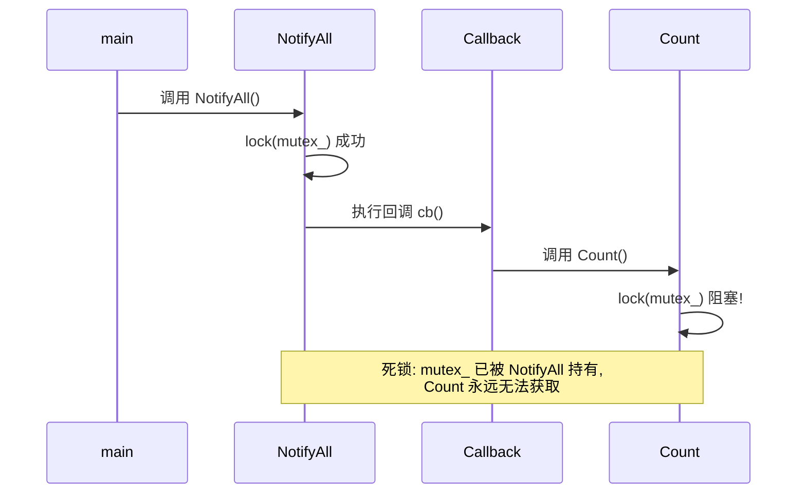
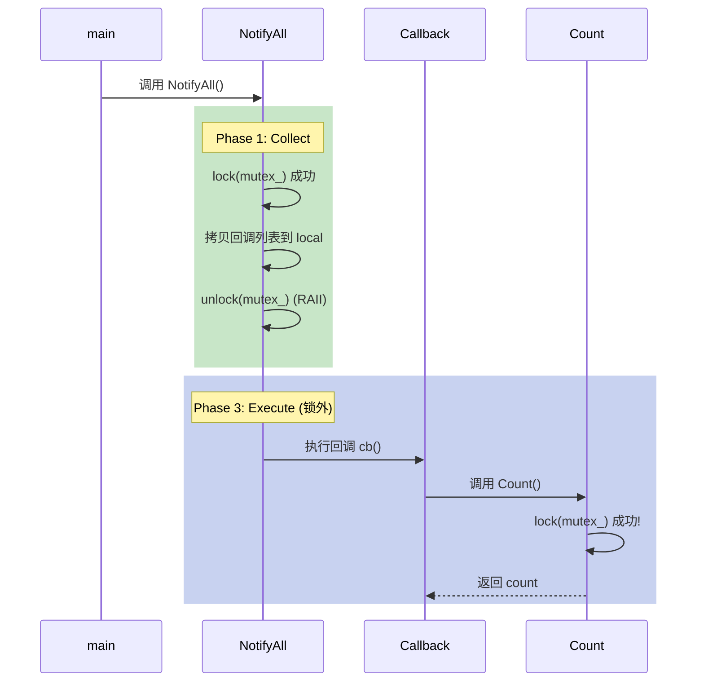
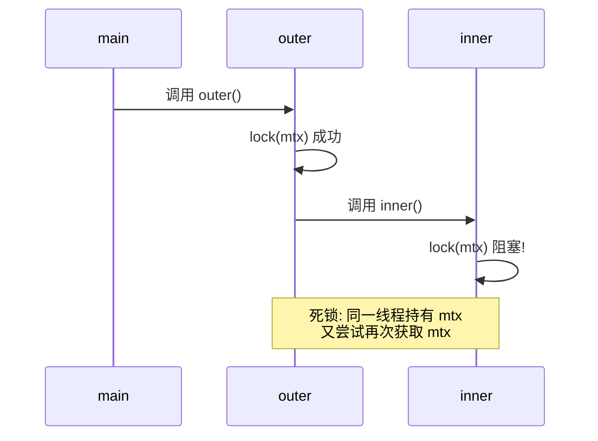

> 本文是**实战篇**，通过可编译运行的代码示例复现死锁与优先级反转，并给出修复方案。
>
> **姊妹篇**: [嵌入式系统死锁防御: 从有序锁到无锁架构的工程实践](../deadlock_prevention/) -- 侧重 newosp 框架的架构级防御策略（无锁 MPSC 总线、SPSC 队列、Collect-Release-Execute 模式、LIFO 有序关停等），读者可先阅读本文理解问题场景，再阅读姊妹篇学习系统级解决方案。
>
> 参考:
> - 原文: [C++ 线程优先级反转](https://blog.csdn.net/stallion5632/article/details/143610920)
> - 原文: [C++ 嵌套锁与编译优化导致的死锁问题](https://blog.csdn.net/stallion5632/article/details/143633084)
> - [Mars Pathfinder Priority Inversion](https://www.cs.cornell.edu/courses/cs614/1999sp/papers/pathfinder.html)
> - [Valgrind Helgrind](https://valgrind.org/docs/manual/hg-manual.html)
> - [ThreadSanitizer](https://clang.llvm.org/docs/ThreadSanitizer.html)

---

## 两篇文章的关系

| 维度 | 本文（实战篇） | 姊妹篇（架构篇） |
|------|---------------|-----------------|
| 侧重 | **复现问题 + 逐个修复** | **架构级根除** |
| 代码风格 | 独立可编译示例 | newosp 框架源码 |
| 读者画像 | 遇到死锁 bug 需要定位修复 | 设计新系统需要防御策略 |
| 覆盖范围 | AB-BA 死锁、重入死锁、自死锁、优先级反转 | 无锁 MPSC/SPSC、自旋锁退避、Collect-Release-Execute、LIFO 关停 |

建议阅读顺序: **本文（理解问题） -> 姊妹篇（系统方案）**。

---

## 1. 经典死锁: AB-BA 锁序违反

### 1.1 问题复现

这是最经典的死锁模式: 两个线程以相反顺序获取两把锁。

```cpp
// deadlock_abba.cpp
// g++ -std=c++17 -pthread -o deadlock_abba deadlock_abba.cpp
#include <iostream>
#include <mutex>
#include <thread>
#include <chrono>

std::mutex mutex_a;
std::mutex mutex_b;

void thread1() {
    std::lock_guard<std::mutex> lock_a(mutex_a);       // 先锁 A
    std::this_thread::sleep_for(std::chrono::milliseconds(10));
    std::lock_guard<std::mutex> lock_b(mutex_b);       // 再锁 B
    std::cout << "Thread 1 acquired both locks\n";
}

void thread2() {
    std::lock_guard<std::mutex> lock_b(mutex_b);       // 先锁 B
    std::this_thread::sleep_for(std::chrono::milliseconds(10));
    std::lock_guard<std::mutex> lock_a(mutex_a);       // 再锁 A -- 死锁!
    std::cout << "Thread 2 acquired both locks\n";
}

int main() {
    std::thread t1(thread1);
    std::thread t2(thread2);
    t1.join();
    t2.join();
    return 0;
}
```

运行结果: **程序挂起，永不退出**。

```
$ ./deadlock_abba
(挂起，无输出)
```

时序分析:

```mermaid
gantt
    title AB-BA 死锁时序 (错误的锁获取顺序)
    dateFormat X
    axisFormat %s

    section Thread 1
    lock(mutex_a) 成功          :done, t1a, 0, 1
    模拟工作                     :done, t1w, 1, 2
    lock(mutex_b) 阻塞...       :crit, t1b, 2, 5

    section Thread 2
    lock(mutex_b) 成功          :done, t2b, 0, 1
    模拟工作                     :done, t2w, 1, 2
    lock(mutex_a) 阻塞...       :crit, t2a, 2, 5
```



> Thread 1 持有 A 等待 B，Thread 2 持有 B 等待 A -- 循环等待，死锁。

### 1.2 修复方案一: 统一锁序

最简单直接的修复: **所有线程以相同顺序获取锁**。

```cpp
void thread1_fixed() {
    std::lock_guard<std::mutex> lock_a(mutex_a);       // 先 A
    std::this_thread::sleep_for(std::chrono::milliseconds(10));
    std::lock_guard<std::mutex> lock_b(mutex_b);       // 后 B
    std::cout << "Thread 1 acquired both locks\n";
}

void thread2_fixed() {
    std::lock_guard<std::mutex> lock_a(mutex_a);       // 先 A（与 thread1 一致）
    std::this_thread::sleep_for(std::chrono::milliseconds(10));
    std::lock_guard<std::mutex> lock_b(mutex_b);       // 后 B
    std::cout << "Thread 2 acquired both locks\n";
}
```



```mermaid
gantt
    title 统一锁序后 (正确的锁获取顺序)
    dateFormat X
    axisFormat %s

    section Thread 1
    lock(mutex_a) 成功          :done, t1a, 0, 1
    模拟工作                     :done, t1w, 1, 2
    lock(mutex_b) 成功          :done, t1b, 2, 3
    完成                         :done, t1d, 3, 4

    section Thread 2
    lock(mutex_a) 等待...       :active, t2a, 0, 4
    lock(mutex_a) 成功          :done, t2a2, 4, 5
    lock(mutex_b) 成功          :done, t2b, 5, 6
    完成                         :done, t2d, 6, 7
```

> 两个线程按相同顺序 (A -> B) 获取锁，Thread 2 排队等待 Thread 1 释放 A 后再继续，不会死锁。

**局限**: 当系统中有数十把锁时，维护全局锁序变得困难。新增一把锁需要确定它在全局序中的位置，并更新所有调用点。姊妹篇中介绍的 `OrderedLock_t` + `lock_multiple()` 方案通过编号自动排序解决了这个问题。

### 1.3 修复方案二: std::scoped_lock (C++17)

C++17 提供了 `std::scoped_lock`，它内部使用死锁避免算法（类似 `std::lock`）同时获取多把锁:

```cpp
void thread1_scoped() {
    std::scoped_lock lock(mutex_a, mutex_b);  // 原子地获取两把锁
    std::cout << "Thread 1 acquired both locks\n";
}

void thread2_scoped() {
    std::scoped_lock lock(mutex_a, mutex_b);  // 同样的调用，顺序无关
    std::cout << "Thread 2 acquired both locks\n";
}
```

`std::scoped_lock` 的内部实现使用 try-and-back-off 算法:

1. 尝试锁定第一把锁
2. 尝试 `try_lock` 第二把锁
3. 如果失败，释放第一把锁，从第二把锁开始重新尝试

这保证不会出现「持有一把锁等待另一把」的情况，从根本上打破了循环等待条件。

**嵌入式注意**: `std::scoped_lock` 适用于 Linux 用户空间。RTOS 环境（FreeRTOS、RT-Thread）无 C++ 标准库，需使用姊妹篇中的 `lock_multiple()` C 实现。

### 1.4 修复方案三: try_lock + 回退

适用于不能同时获取所有锁的场景（例如锁在不同阶段才确定）:

```cpp
void thread2_trylock() {
    while (true) {
        std::unique_lock<std::mutex> lock_b(mutex_b);
        if (mutex_a.try_lock()) {
            // 成功获取两把锁
            std::lock_guard<std::mutex> lock_a(mutex_a, std::adopt_lock);
            std::cout << "Thread 2 acquired both locks\n";
            return;
        }
        // try_lock 失败: 释放 mutex_b，退避后重试
        lock_b.unlock();
        std::this_thread::sleep_for(std::chrono::microseconds(100));
    }
}
```

**关键**: `try_lock` 失败时**必须释放已持有的锁**，否则会活锁。退避时间加随机抖动可以避免两个线程同步重试。

---

## 2. 回调重入死锁

### 2.1 问题复现

这是嵌入式系统中最常见但最隐蔽的死锁: 在持有锁的情况下调用回调函数，而回调函数内部又尝试获取同一把锁。



```cpp
// deadlock_reentrant.cpp
// g++ -std=c++17 -pthread -o deadlock_reentrant deadlock_reentrant.cpp
#include <iostream>
#include <mutex>
#include <functional>
#include <vector>

class EventManager {
public:
    void Register(std::function<void()> callback) {
        std::lock_guard<std::mutex> lock(mutex_);
        callbacks_.push_back(callback);
    }

    void NotifyAll() {
        std::lock_guard<std::mutex> lock(mutex_);      // 持有锁
        for (auto& cb : callbacks_) {
            cb();                                       // 回调内可能再次获取锁!
        }
    }

    size_t Count() {
        std::lock_guard<std::mutex> lock(mutex_);       // 尝试获取同一把锁
        return callbacks_.size();
    }

private:
    std::mutex mutex_;
    std::vector<std::function<void()>> callbacks_;
};

int main() {
    EventManager mgr;

    // 注册一个回调，回调内部调用 Count()
    mgr.Register([&mgr]() {
        std::cout << "Callback: count = " << mgr.Count() << "\n";  // 死锁!
    });

    mgr.NotifyAll();  // 触发死锁
    return 0;
}
```

调用栈:

```
main()
  -> NotifyAll()
    -> lock(mutex_)        // 第一次加锁，成功
    -> cb()
      -> Count()
        -> lock(mutex_)    // 第二次加锁，死锁! (std::mutex 不可重入)
```

### 2.2 错误修复: 使用 recursive_mutex

```cpp
std::recursive_mutex mutex_;  // 允许同一线程多次加锁
```

这在技术上能避免死锁，但**不推荐**。`recursive_mutex` 掩盖了架构问题: 回调在锁内执行意味着回调可以看到中间状态的数据结构，容易引发更难调试的逻辑错误。

此外，`recursive_mutex` 的性能开销高于普通 `mutex`（需要记录持有线程 ID 和递归计数）。

### 2.3 正确修复: Collect-Release-Execute



将通知逻辑拆分为三个阶段: 在锁内**收集**回调列表，**释放**锁后再**执行**回调:

```cpp
class EventManagerFixed {
public:
    void Register(std::function<void()> callback) {
        std::lock_guard<std::mutex> lock(mutex_);
        callbacks_.push_back(callback);
    }

    void NotifyAll() {
        // Phase 1: Collect -- 在锁内拷贝回调列表
        std::vector<std::function<void()>> local_callbacks;
        {
            std::lock_guard<std::mutex> lock(mutex_);
            local_callbacks = callbacks_;
        }
        // Phase 2: Release -- 锁已自动释放 (RAII)

        // Phase 3: Execute -- 在锁外执行回调
        for (auto& cb : local_callbacks) {
            cb();  // 回调内可以安全调用 Count()、Register() 等任意方法
        }
    }

    size_t Count() {
        std::lock_guard<std::mutex> lock(mutex_);
        return callbacks_.size();
    }

private:
    std::mutex mutex_;
    std::vector<std::function<void()>> callbacks_;
};
```

**代价**: 额外的回调列表拷贝。对于嵌入式系统，可以使用栈上固定数组替代 `std::vector` 避免堆分配（参见姊妹篇中 newosp Watchdog 的 `PendingCallback timeout_pending[MaxThreads]` 实现）。

---

## 3. 自死锁: 同一线程重复加锁

### 3.1 问题复现



`std::mutex` 的 `lock()` 在同一线程重复调用时是**未定义行为**（通常表现为死锁）:

```cpp
// deadlock_self.cpp
#include <iostream>
#include <mutex>

std::mutex mtx;

void inner() {
    std::lock_guard<std::mutex> lock(mtx);  // 第二次加锁 -- 死锁
    std::cout << "inner\n";
}

void outer() {
    std::lock_guard<std::mutex> lock(mtx);  // 第一次加锁
    inner();                                 // 调用 inner，再次加锁
}

int main() {
    outer();  // 死锁
    return 0;
}
```

### 3.2 修复方案

**方案 A: 分离锁职责**

`outer()` 和 `inner()` 不应共享同一把锁。如果它们保护不同的数据，使用不同的锁:

```cpp
std::mutex outer_mtx;
std::mutex inner_mtx;

void inner() {
    std::lock_guard<std::mutex> lock(inner_mtx);
    std::cout << "inner\n";
}

void outer() {
    std::lock_guard<std::mutex> lock(outer_mtx);
    inner();  // 安全: 不同的锁
}
```

**方案 B: 提供无锁内部版本**

如果 `outer()` 和 `inner()` 确实保护同一份数据，提供一个不加锁的内部实现:

```cpp
class DataStore {
public:
    void Update() {
        std::lock_guard<std::mutex> lock(mtx_);
        DoUpdate();          // 调用无锁内部版本
        LogState();          // 同样调用无锁版本
    }

    void LogState() {
        std::lock_guard<std::mutex> lock(mtx_);
        DoLogState();
    }

private:
    void DoUpdate() { /* 无锁实现 */ }
    void DoLogState() { /* 无锁实现 */ }

    std::mutex mtx_;
};
```

公开接口加锁，内部方法无锁。公开接口之间不互相调用，只调用无锁的 `Do*` 方法。

---

## 4. 优先级反转

### 4.1 什么是优先级反转

优先级反转是实时系统中的「准死锁」: 高优先级任务被低优先级任务**间接**阻塞。

```mermaid
gantt
    title 优先级反转 (Priority Inversion)
    dateFormat X
    axisFormat %s

    section Task A (高优先级)
    尝试获取锁                   :crit, a1, 2, 3
    阻塞等待 C 释放锁...         :crit, a2, 3, 8
    获取锁, 执行                 :done, a3, 8, 9

    section Task B (中优先级)
    抢占 Task C 执行             :active, b1, 3, 7

    section Task C (低优先级)
    获取锁, 执行                 :done, c1, 0, 3
    被 B 抢占, 无法运行          :crit, c2, 3, 7
    恢复执行, 释放锁              :done, c3, 7, 8
```



> Task A (高优先级) 等待 Task C 释放锁，但 Task C 被 Task B 抢占无法运行。结果: A 的实际优先级低于 B。

关键: Task A（高优先级）等待 Task C（低优先级）释放锁，但 Task B（中优先级）抢占了 Task C 的 CPU 时间，导致 C 无法执行从而无法释放锁。**高优先级任务实际上被中优先级任务阻塞了**。

最著名的案例是 1997 年 Mars Pathfinder: VxWorks RTOS 上的气象数据采集任务（低优先级）持有共享内存总线锁，通信任务（高优先级）等待该锁，被中优先级任务持续抢占，导致看门狗超时系统反复重启。NASA 最终通过地面上传补丁启用优先级继承解决了问题。

### 4.2 问题复现

```cpp
// priority_inversion.cpp
// g++ -std=c++17 -pthread -o priority_inversion priority_inversion.cpp
// 需要 root 权限或 CAP_SYS_NICE 运行 SCHED_FIFO
#include <iostream>
#include <mutex>
#include <thread>
#include <chrono>
#include <pthread.h>
#include <sched.h>

std::mutex shared_resource;

void set_realtime_priority(int priority) {
    struct sched_param param;
    param.sched_priority = priority;
    if (pthread_setschedparam(pthread_self(), SCHED_FIFO, &param) != 0) {
        perror("pthread_setschedparam");
    }
}

// 低优先级任务: 持有锁做长时间计算
void task_low() {
    set_realtime_priority(10);
    std::lock_guard<std::mutex> lock(shared_resource);
    std::cout << "[Low ] Acquired lock, working...\n";

    // 模拟长时间计算 (持有锁期间)
    auto start = std::chrono::steady_clock::now();
    while (std::chrono::steady_clock::now() - start < std::chrono::seconds(3)) {
        // busy work
    }

    std::cout << "[Low ] Done, releasing lock.\n";
}

// 中优先级任务: 不需要锁，但会抢占低优先级任务
void task_medium() {
    set_realtime_priority(50);
    std::cout << "[Med ] Running, preempting low priority...\n";

    auto start = std::chrono::steady_clock::now();
    while (std::chrono::steady_clock::now() - start < std::chrono::seconds(2)) {
        // busy work: 持续占用 CPU，阻止低优先级任务运行
    }

    std::cout << "[Med ] Done.\n";
}

// 高优先级任务: 需要锁
void task_high() {
    set_realtime_priority(80);
    std::cout << "[High] Trying to acquire lock...\n";

    auto t0 = std::chrono::steady_clock::now();
    std::lock_guard<std::mutex> lock(shared_resource);
    auto t1 = std::chrono::steady_clock::now();

    auto wait_ms = std::chrono::duration_cast<std::chrono::milliseconds>(t1 - t0).count();
    std::cout << "[High] Acquired lock after " << wait_ms << " ms\n";
}

int main() {
    std::thread t_low(task_low);
    std::this_thread::sleep_for(std::chrono::milliseconds(100));  // 让低优先级先获取锁

    std::thread t_med(task_medium);
    std::thread t_high(task_high);

    t_low.join();
    t_med.join();
    t_high.join();
    return 0;
}
```

**预期输出** (单核或绑定同一核心时):

```
[Low ] Acquired lock, working...
[Med ] Running, preempting low priority...
[High] Trying to acquire lock...
[Med ] Done.                          <-- 中优先级先于高优先级完成!
[Low ] Done, releasing lock.
[High] Acquired lock after ~5000 ms   <-- 高优先级等待了 5 秒
```

高优先级任务本应最快完成，实际等待时间等于 **低优先级持锁时间 + 中优先级抢占时间**。

### 4.3 修复方案一: 优先级继承 (PTHREAD_PRIO_INHERIT)

优先级继承的原理: 当高优先级任务 A 阻塞在低优先级任务 C 持有的锁上时，内核**临时提升** C 的优先级到 A 的级别。这样 C 不会被中优先级任务 B 抢占，可以尽快释放锁。

```cpp
#include <pthread.h>

// 创建支持优先级继承的 mutex
pthread_mutex_t pi_mutex;

void init_pi_mutex() {
    pthread_mutexattr_t attr;
    pthread_mutexattr_init(&attr);
    pthread_mutexattr_setprotocol(&attr, PTHREAD_PRIO_INHERIT);  // 关键
    pthread_mutex_init(&pi_mutex, &attr);
    pthread_mutexattr_destroy(&attr);
}
```

启用优先级继承后的时序:

```mermaid
gantt
    title 优先级继承 (Priority Inheritance) 修复后
    dateFormat X
    axisFormat %s

    section Task A (高优先级)
    尝试获取锁                   :crit, a1, 2, 3
    等待 C 释放锁               :active, a2, 3, 5
    获取锁, 执行                 :done, a3, 5, 6

    section Task B (中优先级)
    等待 (无法抢占已提升的 C)    :active, b1, 3, 6
    执行                         :done, b2, 6, 8

    section Task C (低->高优先级)
    获取锁, 执行                 :done, c1, 0, 3
    优先级提升到 A 级别, 继续    :done, c2, 3, 5
    释放锁, 恢复原优先级          :milestone, c3, 5, 5
```



> C 被提升到与 A 相同的优先级，B 无法抢占 C，C 快速完成并释放锁。A 的等待时间大幅缩短。

**内核要求**: `PTHREAD_PRIO_INHERIT` 需要 Linux 内核配置 `CONFIG_RT_MUTEXES=y`。标准内核通常已启用，PREEMPT_RT 补丁集一定启用。可通过以下命令确认:

```bash
zcat /proc/config.gz | grep RT_MUTEX
# 或
grep RT_MUTEX /boot/config-$(uname -r)
```

**C++ 标准库的限制**: `std::mutex` 不支持设置优先级继承属性。需要使用 POSIX `pthread_mutex_t` 或封装一个 RAII 包装器:

```cpp
class PiMutex {
public:
    PiMutex() {
        pthread_mutexattr_t attr;
        pthread_mutexattr_init(&attr);
        pthread_mutexattr_setprotocol(&attr, PTHREAD_PRIO_INHERIT);
        pthread_mutex_init(&mtx_, &attr);
        pthread_mutexattr_destroy(&attr);
    }

    ~PiMutex() { pthread_mutex_destroy(&mtx_); }

    void lock() { pthread_mutex_lock(&mtx_); }
    void unlock() { pthread_mutex_unlock(&mtx_); }
    bool try_lock() { return pthread_mutex_trylock(&mtx_) == 0; }

    PiMutex(const PiMutex&) = delete;
    PiMutex& operator=(const PiMutex&) = delete;

private:
    pthread_mutex_t mtx_;
};

// 使用方式与 std::mutex 一致
PiMutex shared_resource;
std::lock_guard<PiMutex> lock(shared_resource);
```

### 4.4 修复方案二: 无锁架构

如果高优先级任务的数据通路可以设计为无锁，则从根本上消除优先级反转。这正是姊妹篇中 newosp `RealtimeExecutor` 的方案: **SCHED_FIFO 调度线程 + 无锁 CAS 消息总线**，整条实时路径不持有任何 mutex。

详见: [嵌入式系统死锁防御 -- 第10节: 实时调度与优先级反转防御](../deadlock_prevention/#10-实时调度与优先级反转防御)

### 4.5 修复方案三: 最小化持锁时间

优先级反转的严重程度与**持锁时间成正比**。缩短临界区是最具普适性的缓解措施:

```cpp
// 不好: 在锁内做 I/O
void task_low_bad() {
    std::lock_guard<std::mutex> lock(shared_resource);
    read_sensor();          // 可能阻塞数毫秒
    compute_result();       // CPU 密集
    write_log();            // 磁盘 I/O，可能阻塞数十毫秒
}

// 好: 只在锁内做最小必要操作
void task_low_good() {
    SensorData raw = read_sensor();     // 锁外读取
    Result res = compute_result(raw);   // 锁外计算

    {
        std::lock_guard<std::mutex> lock(shared_resource);
        shared_state_ = res;            // 锁内只做赋值
    }

    write_log(res);                     // 锁外写日志
}
```

---

## 5. 纠正常见误解: 编译优化不会导致锁重排

### 5.1 误解来源

有一种广泛传播的说法: 「`-O3` 编译优化可能重排 mutex 的获取顺序，导致死锁」。这是**不正确的**。

### 5.2 为什么编译器不会重排锁操作

C++ 标准明确规定: `std::mutex::lock()` 和 `std::mutex::unlock()` 是**同步操作**（synchronization operations），具有 acquire 和 release 语义。编译器和 CPU 都**不允许**将普通内存操作移出临界区，更不允许重排 mutex 操作本身。

```cpp
std::lock_guard<std::mutex> lockA(mutexA);  // acquire 语义
// --- 编译器保证以下操作不会被提前到 lockA 之前 ---
x = 1;
y = 2;
// --- 编译器保证以上操作不会被延后到 lockB 之后 ---
std::lock_guard<std::mutex> lockB(mutexB);  // acquire 语义
```

即使在 `-O3` 下，编译器也不会将 `lockA` 和 `lockB` 的获取顺序调换。可以通过查看汇编确认:

```bash
g++ -std=c++17 -O3 -S -o output.s deadlock_abba.cpp
# 检查汇编中 pthread_mutex_lock 的调用顺序
```

### 5.3 死锁的真正原因

第 1 节的 AB-BA 死锁示例在**任何优化级别**下都会死锁（`-O0`、`-O1`、`-O2`、`-O3`），因为死锁的根因是**锁获取顺序不一致**，与编译优化无关。

`-O3` 能影响的是: 临界区**内部**的指令重排和优化（寄存器分配、循环展开、内联等），但这些不会改变锁操作的顺序。

### 5.4 编译优化真正影响的场景

编译器优化确实会导致多线程问题，但是**数据竞争**，不是锁重排:

```cpp
// 没有同步的共享变量
int x = 0, y = 0;

// 线程 1
void thread1() {
    x = 1;    // 可能被编译器/CPU 重排到 a = y 之后
    int a = y;
}

// 线程 2
void thread2() {
    y = 1;
    int b = x;
}
```

这里 `x` 和 `y` 不是原子变量，也没有锁保护，编译器可以自由重排。解决方案是使用 `std::atomic` 或加锁，而不是「避免 `-O3`」。

**结论**: 如果你的程序在 `-O0` 下正常但在 `-O3` 下死锁，问题出在数据竞争或未定义行为，不是锁重排。应该用 TSan 检测数据竞争。

---

## 6. 检测工具

### 6.1 Thread Sanitizer (TSan)

TSan 是目前最强大的死锁和数据竞争检测工具:

```bash
# 编译
g++ -std=c++17 -fsanitize=thread -g -o test deadlock_abba.cpp -pthread

# 运行
./test
```

TSan 输出（检测到锁序违反）:

```
WARNING: ThreadSanitizer: lock-order-inversion (potential deadlock)
  Cycle in lock order graph: M0 (mutex_a) => M1 (mutex_b) => M0

  Mutex M1 acquired here while holding mutex M0:
    #0 pthread_mutex_lock
    #1 thread1() deadlock_abba.cpp:9

  Mutex M0 acquired here while holding mutex M1:
    #0 pthread_mutex_lock
    #1 thread2() deadlock_abba.cpp:15
```

**嵌入式集成**: newosp 的 CI 对所有测试启用 TSan，确保 979 个测试用例无锁序违反。参见姊妹篇第 11.3 节的验证阶段建议。

### 6.2 Valgrind Helgrind

```bash
valgrind --tool=helgrind ./deadlock_abba
```

Helgrind 同样能检测锁序违反和数据竞争，但运行速度比 TSan 慢 20-100 倍。优势是不需要重新编译。

### 6.3 Linux lockdep (内核模块)

如果死锁发生在内核空间（驱动程序），可以启用内核的 lockdep:

```bash
# 内核配置
CONFIG_PROVE_LOCKING=y
CONFIG_LOCKDEP=y

# 运行时查看
cat /proc/lockdep_stats
```

lockdep 在**第一次**出现潜在的锁序违反时就会告警，即使死锁尚未实际发生。

### 6.4 GDB 死锁诊断

如果程序已经死锁，用 GDB 附加并检查所有线程的调用栈:

```bash
gdb -p $(pidof deadlock_abba)

(gdb) thread apply all bt

Thread 2 (LWP 12346):
#0 __lll_lock_wait () at lowlevellock.c:49
#1 pthread_mutex_lock ()
#2 thread2 () at deadlock_abba.cpp:15    <-- 等待 mutex_a

Thread 1 (LWP 12345):
#0 __lll_lock_wait () at lowlevellock.c:49
#1 pthread_mutex_lock ()
#2 thread1 () at deadlock_abba.cpp:9     <-- 等待 mutex_b
```

两个线程都在 `__lll_lock_wait`，并且持有对方等待的锁 -- 确认死锁。

---

## 7. 嵌入式系统中的特殊考量

### 7.1 ISR 中的死锁

中断服务程序（ISR）不能调用阻塞操作。如果 ISR 尝试获取已被主循环持有的锁，系统会永久挂起（ISR 优先级高于所有线程，被阻塞的线程永远无法运行释放锁）:

```c
// 错误: ISR 中使用 mutex
void UART_IRQHandler(void) {
    mutex_lock(&uart_buf_lock);    // 永久阻塞!
    // ...
    mutex_unlock(&uart_buf_lock);
}
```

**解决方案**:

| 方案 | 实现 | 适用场景 |
|------|------|----------|
| 禁中断 | `__disable_irq()` / `__enable_irq()` | 极短临界区 (< 1 us) |
| SPSC 无锁队列 | ISR 写入，主循环读取 | 数据缓冲 |
| 原子标志 | `std::atomic_flag` | 简单通知 |

SPSC 无锁队列正是姊妹篇第 4.2 节详细介绍的 `SpscRingbuffer`，天然支持 ISR-to-thread 的单向数据流。

### 7.2 RTOS 优先级反转

FreeRTOS 提供了 `xSemaphoreCreateMutex()` 自带优先级继承，但 **Binary Semaphore 不支持**:

```c
// 正确: 使用 Mutex (支持优先级继承)
SemaphoreHandle_t lock = xSemaphoreCreateMutex();

// 错误: 使用 Binary Semaphore (不支持优先级继承)
SemaphoreHandle_t lock = xSemaphoreCreateBinary();
```

RT-Thread 的 `rt_mutex_create()` 同样默认启用优先级继承。

### 7.3 看门狗作为安全网

无论防御措施多完善，生产系统都应该有看门狗作为最后防线。如果死锁导致关键线程停止喂狗，看门狗超时触发系统复位:

```
正常: 线程 -> 喂狗 -> 看门狗复位计数器
死锁: 线程阻塞 -> 停止喂狗 -> 看门狗超时 -> 系统复位
```

姊妹篇第 7 节介绍了 newosp 的 `ThreadWatchdog` 实现，它使用 Collect-Release-Execute 模式确保看门狗自身不会死锁。

---

## 8. 总结: 死锁防御检查清单

| 场景 | 问题 | 解决方案 | 示例位置 |
|------|------|----------|----------|
| 两把锁顺序不一致 | AB-BA 死锁 | `std::scoped_lock` / 全局锁序 | 本文第 1 节 |
| 回调在锁内执行 | 重入死锁 | Collect-Release-Execute | 本文第 2 节 / 姊妹篇第 7 节 |
| 同一线程重复加锁 | 自死锁 | 分离锁职责 / 无锁内部方法 | 本文第 3 节 |
| 高优先级任务等锁 | 优先级反转 | `PTHREAD_PRIO_INHERIT` / 无锁 | 本文第 4 节 / 姊妹篇第 10 节 |
| ISR 中加锁 | 永久阻塞 | SPSC 无锁队列 / 禁中断 | 本文第 7.1 节 / 姊妹篇第 4.2 节 |
| 系统关停资源竞争 | 关停死锁 | LIFO 有序释放 | 姊妹篇第 8 节 |
| 高频通信路径 | 锁竞争瓶颈 | 无锁 MPSC/SPSC | 姊妹篇第 4 节 |

**核心思路**: 本文解决「如何修 bug」，姊妹篇解决「如何不出 bug」。前者是战术，后者是战略。
