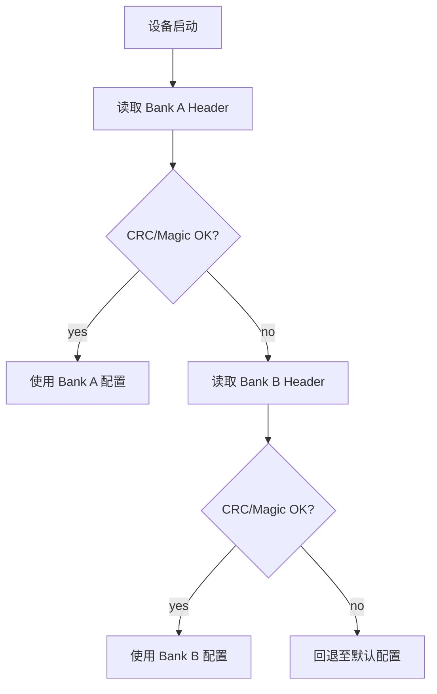
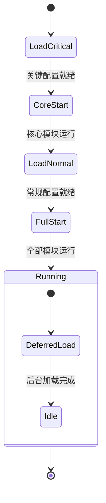

嵌入式设备的配置数据 (设备参数、校准值、用户设置) 需要持久化到 Flash/NvM，并在启动时加载回内存。这看似简单的需求，实际面临三个核心挑战:

1. **格式可演进**: 配置字段随固件升级增删，要求新旧固件能互相解析
2. **数据完整性**: Flash 写入可能被断电中断，需防止配置损坏
3. **资源高效**: 在有限 ROM/RAM 下，序列化开销要小

本文重点对比自定义 TLV 和 c-capnproto 两种方案，并以 nanopb 作为补充参考。

## 1. 自定义 TLV: 轻量与直接

### 1.1 数据格式

TLV (Type-Length-Value) 是最原始的自描述格式。每个数据块由类型标识、长度、实际数据三部分组成:

```
+--------+--------+------------------+
| Type   | Length | Value (payload)  |
| 2 bytes| 2 bytes| Length bytes      |
+--------+--------+------------------+
```

TLV 块可以嵌套，构建树状结构:

```
+------------------+------------------+
|      全局配置头 (CRC, Ver, Len)     |
+------------------+------------------+
| Type(Mod_A) | Len(24) | Payload_A   |
+------------------+------------------+
| Type(Mod_B) | Len(128)| Payload_B   |
+------------------+------------------+
                   |
                   +-----------------------------------+
                   | Type(Sub_B1) | Len(4) | Payload   |
                   +-----------------------------------+
                   | Type(Sub_B2) | Len(16)| Payload   |
                   +-----------------------------------+
                   | Type(Sub_X)  | Len(96)| Payload   | <-- 旧固件不认识，跳过
                   +-----------------------------------+
```

### 1.2 实现核心

TLV 头结构和解析器:

```c
typedef struct {
    uint16_t type;
    uint16_t length;
} tlv_header_t;

// TLV 解析器: 遍历 buffer，按 type 分发
bool tlv_parse(const uint8_t *buf, size_t total_len,
               tlv_handler_t *handlers, size_t handler_count) {
    size_t offset = 0;
    while (offset + sizeof(tlv_header_t) <= total_len) {
        const tlv_header_t *hdr = (const tlv_header_t *)(buf + offset);

        // 边界检查
        if (offset + sizeof(tlv_header_t) + hdr->length > total_len) {
            return false;  // 数据截断
        }

        const uint8_t *value = buf + offset + sizeof(tlv_header_t);
        bool handled = false;

        for (size_t i = 0; i < handler_count; i++) {
            if (handlers[i].type == hdr->type) {
                handlers[i].parse(value, hdr->length, handlers[i].dst);
                handled = true;
                break;
            }
        }

        if (!handled) {
            // 未知类型: 跳过 (向前兼容)
            LOG_W("Unknown TLV type: 0x%04X, skip %u bytes",
                  hdr->type, hdr->length);
        }

        offset += sizeof(tlv_header_t) + hdr->length;
    }
    return true;
}
```

序列化同样直接:

```c
size_t tlv_write(uint8_t *buf, size_t buf_size,
                 uint16_t type, const void *value, uint16_t length) {
    size_t total = sizeof(tlv_header_t) + length;
    if (total > buf_size) { return 0; }

    tlv_header_t hdr = { .type = type, .length = length };
    memcpy(buf, &hdr, sizeof(hdr));
    memcpy(buf + sizeof(hdr), value, length);
    return total;
}
```

### 1.3 优缺点

**优点:**

- 零依赖，代码量极小 (~200 行)
- 反序列化基于指针偏移 + memcpy，CPU 开销低
- 支持流式解析，内存占用可控
- TLV 天然支持递归嵌套，具备跳过未知类型的向前兼容能力

**缺点:**

- **维护成本高 (命令式开发)**: 每新增字段需手动修改枚举定义、解析逻辑、序列化逻辑三处代码
- **无编译期类型检查**: memcpy 错误只能在运行时发现，字段类型或长度变化时可能导致内存越界
- **原地更新的局限性**: 字段长度变化时原地更新失效，会覆盖后续数据

```c
// 每次增加新字段都需要修改:
// 1. 枚举定义
enum cfg_type { TYPE_GAIN_MODE, TYPE_SCENE_MODE, /* ... */ };
// 2. 解析逻辑
case TYPE_GAIN_MODE:
    memcpy(&config.gain_mode, ptr, sizeof(uint32_t));
    break;
// 3. 序列化逻辑
// 4. 更新逻辑
```

## 2. c-capnproto: 零拷贝与声明式演进

### 2.1 核心理念

[c-capnproto](https://github.com/opensourcerouting/c-capnproto) 是 Cap'n Proto 的纯 C (C99) 实现。核心理念: **数据在内存中的布局即为最终存储格式 (wire format)**。读取时通过编译期确定的偏移量直接访问字段，跳过了传统方案的"解析 -> 拷贝 -> 构建结构体"步骤。

开发流程是声明式的:

```bash
# 定义 schema -> PC 端编译器生成 C 代码 -> 嵌入式侧直接使用
capnp compile -oc config.capnp
# 产出: config.capnp.c, config.capnp.h
```

> **注意**: capnp 编译器 (capnpc-c) 本身是 C++ 程序，仅在 PC 端运行。生成的代码是纯 C，无 C++ 依赖，可直接在 MCU 上编译。

### 2.2 Schema 定义

`.capnp` 文件定义所有数据结构:

```capnp
@0xf4b7a151b72a445d;

struct DeviceConfig {
  deviceId @0 :Text;
  sampleRate @1 :UInt32 = 100;      # 采样率，默认 100
  filterMode @2 :UInt8 = 0;         # 滤波模式

  struct AlgorithmParams {
    noiseThreshold @0 :Float32 = 0.1;
    enableOutlierRemoval @1 :Bool = true;
  }
  algorithmParams @3 :AlgorithmParams;

  # 新增字段只需在此处声明，自动兼容
  logLevel @4 :UInt32 = 2;
}
```

### 2.3 字段 ID 机制: 版本兼容性的基石

Cap'n Proto 使用**显式字段 ID** (`@0`, `@1`, ...) 替代隐式字段顺序。这是其强大兼容性的核心:

```capnp
struct ConfigExample {
  version @0 :UInt32;           # ID=0，一旦分配永不改变
  deviceName @1 :Text;          # ID=1
  # ... 中间可跳过某些 ID ...
  newFeature @10 :Bool = false; # 新字段可使用非连续 ID
}
```

**ID 管理原则:**

- **唯一性**: 同一 struct 内 ID 必须唯一
- **稳定性**: 一旦分配，ID 永不改变、永不重用
- **可跳跃**: 支持非连续 ID，便于后续插入新字段

**向后兼容 (旧程序读新数据):**

```c
// 旧程序只知道 @0 和 @1 字段
// @10 的 newFeature 字段存在于数据中，但旧程序不访问它，不受影响
uint32_t ver = DeviceConfig_get_version(reader);
```

**向前兼容 (新程序读旧数据):**

```c
// 新程序读取旧数据时，@10 字段在数据中不存在
// 访问器返回 schema 中定义的默认值 false
bool feature = DeviceConfig_get_newFeature(reader);  // 返回 false
```

**类型变更限制**: Cap'n Proto **不支持**改变已有字段的类型 (如 UInt8 -> UInt16)。正确的做法是添加新字段:

```capnp
# 不要这样做:
# gainLevel @2 :UInt16;  # 从 UInt8 改为 UInt16 -- 破坏兼容性

# 正确做法: 添加新字段，废弃旧字段
gainLevel @2 :UInt8;           # 保留，旧固件继续使用
gainLevelExtended @5 :UInt16;  # 新字段，新固件优先使用
```

每个字段 ID 是永久承诺。Schema 设计时应谨慎规划字段类型。

### 2.4 零拷贝读取原理

传统方案 (TLV、nanopb) 需要将二进制数据解析为内存结构体:

```
传统方案:                 c-capnproto:
Flash -> 解析 -> 结构体     Flash -> 直接指针访问
       (需要拷贝)                 (零拷贝)
```

Cap'n Proto 的 struct 在内存中被分为 **data section** (存放基本类型) 和 **pointer section** (存放引用类型)。所有字段在 data section 中的偏移量在编译期就已确定:

```c
// 生成的访问代码 (内联函数，编译后直接偏移读取)
static inline uint32_t DeviceConfig_get_sampleRate(struct DeviceConfig reader) {
    return capn_read32(reader.p, 4);  // 从偏移 4 读取 4 字节，小端转主机序
}
```

`capn_read32()` 的实际操作:

1. 检查偏移量是否在 segment 范围内
2. 从 buffer 的指定偏移读取 4 字节
3. 执行 `capn_flip32()` 进行字节序转换 (小端 -> 主机序)
4. **与默认值 XOR** (见 2.5 节)

没有 switch-case 分发、没有类型查找、没有 memcpy 到目标结构体。

| 操作类型 | 自定义 TLV | c-capnproto |
|---------|-----------|-------------|
| 顺序读取 | memcpy + switch 判断 | 直接指针偏移 |
| 随机访问 | 遍历查找 O(n) | 直接访问 O(1) |
| 嵌套结构 | 多层解析 | 指针链式访问 |

### 2.5 默认值: XOR 编码

Cap'n Proto 的默认值机制非常精巧: **字段值在存储时与默认值做 XOR**。

这意味着:

- 所有字段都等于默认值的 struct，在存储中是**全零**
- 读取时: `actual_value = stored_value XOR default_value`
- 如果 struct 没有为某个字段分配空间 (旧 schema 生成的数据)，读取到零，XOR 默认值后得到默认值本身

```c
// 假设 schema 中 sampleRate 的默认值为 100
// 存储时: stored = actual_value XOR 100
// 读取时: actual = stored XOR 100
//
// 当 actual_value == 100 时: stored = 100 XOR 100 = 0
// 当 actual_value == 200 时: stored = 200 XOR 100 = 172
// 当数据缺失 (全零) 时: actual = 0 XOR 100 = 100 (默认值)
```

这个设计的优势:

- 零值存储 = 默认配置，无需特殊处理
- 向前兼容: 新程序读旧数据，缺失字段自动返回默认值
- 无额外空间开销: 不需要 presence bit 或 optional 标记

### 2.6 内存模型: Arena 分配

c-capnproto 使用 **arena 分配** 而非逐个 malloc:

- **读取路径**: 零 malloc。将 buffer 指针传给库，直接读取
- **构建路径**: 需要 segment 分配。库通过回调函数 (`create()`) 获取内存段

嵌入式系统可以用**静态内存池**替代 malloc:

```c
// 静态分配方式: 预分配 segment buffer
static uint8_t seg_buf[1024] __attribute__((aligned(8)));

struct capn ctx;
struct capn_segment seg;
memset(seg_buf, 0, sizeof(seg_buf));  // 必须零初始化
capn_init_malloc(&ctx);
capn_append_segment(&ctx, &seg, seg_buf, sizeof(seg_buf));
```

**零初始化要求**: 所有分配的 buffer 必须零初始化。这是 XOR 默认值编码的硬性要求 -- 未初始化的内存会导致读出错误的值。

### 2.7 更新机制: 整体重写

Cap'n Proto 是 **write-once, read-many** 设计。Builder 用于一次性构建消息，不支持原地修改已构建的字段:

1. 从 Flash 读取旧配置到内存 (Reader)
2. 创建新的 Builder，分配新 segment
3. 逐字段读取旧值 (Reader) 写入新 Builder，修改需要变更的字段
4. 将整个新 buffer 写入 Flash (双区切换)

```c
// 伪代码: 更新 sampleRate 字段
struct capn old_ctx, new_ctx;
// ... 从 Flash 加载旧数据到 old_ctx ...

// 创建新 Builder
capn_init_malloc(&new_ctx);
struct DeviceConfig_Builder builder = new_root_DeviceConfig(&new_ctx);

// 复制旧值 + 修改
DeviceConfig_set_deviceId(builder, DeviceConfig_get_deviceId(old_reader));
DeviceConfig_set_sampleRate(builder, 200);  // 修改此字段
DeviceConfig_set_filterMode(builder, DeviceConfig_get_filterMode(old_reader));

// 序列化新数据并写入 Flash
// ... capn_setp(&new_ctx, ...) ...
```

**优势**: 从根本上避免偏移量计算错误，天然支持字段增删
**代价**: 内存短暂翻倍 (同时持有旧数据和新 Builder)

### 2.8 空间预分配

Cap'n Proto 为 schema 中定义的**所有字段预留固定空间**，即使未设置:

```capnp
struct Foo {
  a @0 :UInt8;    # 1 字节
  b @1 :UInt32;   # 4 字节
  c @2 :UInt16;   # 2 字节
}
# data section 实际占用: 8 字节 (对齐到 64-bit 边界)
# 即使只设置字段 a，也占 8 字节
```

对比 nanopb 的 varint 编码 (按需编码，未设置的 optional 字段不占空间)，c-capnproto 的文件体积通常偏大。这是零拷贝的代价: 固定布局换取 O(1) 访问。

### 2.9 安全与维护状态

使用 c-capnproto 需要了解两个重要事实:

1. **不检查输入边界**: 生成的代码**假定所有输入可信**。如果配置数据可能被外部篡改 (如通过网络下发)，需要在 c-capnproto 之上自行添加完整性校验 (CRC/HMAC)
2. **项目维护状态**: opensourcerouting/c-capnproto 仓库已标注 "NOT MAINTAINED"。用于生产环境时，需评估是否 fork 自行维护，或锁定已验证的版本

对于嵌入式配置持久化场景，数据来源通常是设备自身或受信的上位机，安全风险可控。但需要在存储层添加 CRC 校验来防止 Flash 损坏导致的数据错误。

## 3. nanopb: 流式编解码

nanopb 是 Protocol Buffers 的 C 语言实现，定位介于 TLV 和 c-capnproto 之间:

```protobuf
syntax = "proto2";
import "nanopb.proto";
option (nanopb_fileopt).max_size = 512;

message DeviceConfig {
    required string device_id = 1 [(nanopb).max_size = 32];
    required uint32 sample_rate = 2;
    optional bool enable_filtering = 3 [default = true];
    optional uint32 log_level = 4 [default = 2];
}
```

```bash
protoc --nanopb_out=. config.proto
# 产出: config.pb.c, config.pb.h
```

nanopb 的特点:

- **varint 编码**: 按需编码，未设置的 optional 字段不占空间，文件体积紧凑
- **流式处理**: 逐字段编解码，需要完整的序列化/反序列化过程
- **ROM 开销小**: nanopb 库本身约 4KB ROM，适合资源受限 MCU
- **跨语言**: `.proto` 文件可生成 C/C++/Python/Go/Java 等多语言解析器
- **不支持零拷贝**: 读取需要将数据解码到 C 结构体中

## 4. 三方案对比

| 维度 | 自定义 TLV | c-capnproto | nanopb |
|------|-----------|-------------|--------|
| 核心代码 | ~200 行手写 | 生成代码 + capn.c 运行时 | 库 (~4KB ROM) + 生成代码 |
| 依赖 | 无 | PC 端 capnp 编译器 | PC 端 protoc + nanopb 插件 |
| 新增字段 | 手动修改 3 处 | 修改 .capnp 1 行 | 修改 .proto 1 行 |
| 类型安全 | 无 (memcpy) | 编译期类型检查 | 编译期结构体检查 |
| 版本兼容 | 手动实现 (跳过未知 type) | 基于字段 ID 自动处理 | 基于字段号自动处理 |
| 读取性能 | memcpy + switch | **零拷贝，O(1) 直接访问** | 流式解码 (需拷贝) |
| 更新方式 | 原地更新 | 整体重写 (Builder) | 整体重写 (encode) |
| 文件体积 | 紧凑 | **偏大** (固定布局预留空间) | 紧凑 (varint 编码) |
| 跨平台字节序 | 需手动处理 | 定义为小端 + flip 转换 | varint 天然跨平台 |
| 输入安全 | 需自行校验 | **不检查边界，需外部校验** | 有基本的长度检查 |
| 项目活跃度 | 自维护 | **已停止维护** | 活跃维护中 |

### 4.1 选择建议

- **字段少 (< 10)、变更极少、ROM 极度受限**: TLV，零依赖
- **配置加载后频繁随机访问字段**: c-capnproto，零拷贝 O(1) 访问优势明显
- **字段多、迭代频繁、需要跨语言/跨平台共享**: nanopb，varint 紧凑编码 + `.proto` 跨语言生成
- **数据来源不可信**: nanopb (有基本校验)，或 TLV + 自行校验

## 5. Flash 写入特性: 为什么整体重写不是瓶颈

评估 TLV 原地更新与 c-capnproto/nanopb 整体重写的性能差异时，需要理解 Flash 的物理特性:

- **读取**: 按字节或字进行，速度极快
- **写入**: 只能将 1 变为 0，不能将 0 变为 1
- **擦除**: 将整个扇区 (通常 4KB) 恢复为全 1，是唯一能将 0 变回 1 的操作

这意味着**即使只修改一个字节，只要该位置需要将 0 变为 1**，就必须:

1. 读取整个扇区到 RAM
2. 修改目标字节
3. 擦除整个扇区
4. 将整个扇区写回

| 对比维度 | TLV 原地更新 | c-capnproto 整体重写 |
|---------|-------------|-------------------|
| 理论写入量 | 极少 (单个字段) | 整个文件 |
| 实际写入量 | **至少一个扇区 (4KB)** | 整个文件 (通常 < 4KB) |
| 单点更新 | 读-擦-写一个扇区 | 读-擦-写整个文件 |
| 多点更新 | 读-擦-写**多个**扇区 | 读-擦-写整个文件 **(一次)** |
| 原子性 | 难以实现，易产生中间态 | 易实现，可结合双区存储 |

**关键结论**: 当配置文件小于一个扇区 (4KB，这是绝大多数嵌入式配置的情况) 时，TLV 的原地更新和 c-capnproto 的整体重写在 Flash 层面的实际开销相同 -- 都是读-擦-写一个扇区。当需要更新分散在多个扇区的多个字段时，c-capnproto 的一次性整体重写反而更高效。

TLV 原地更新的理论优势 -- "只写需要修改的部分" -- 在 Flash 的物理特性面前并不成立。

## 6. 存储鲁棒性

无论使用哪种序列化方案，配置写入 Flash 时都需要解决断电保护问题。这对 c-capnproto 尤其重要，因为它不内置完整性校验。

### 6.1 配置头

在序列化数据前添加固定头:

```c
typedef struct {
    uint32_t magic;     // 固定标识 (如 0x43464731 = "CFG1")
    uint16_t version;   // 格式版本号
    uint16_t flags;     // bit0: 0=TLV, 1=capnproto, 2=nanopb
    uint32_t length;    // payload 长度
    uint32_t crc32;     // header + payload 的 CRC-32
} config_header_t;
```

`flags` 位定义:

- bit0-1: 序列化格式 (0=TLV, 1=capnproto, 2=nanopb)
- bit2: 1 = payload 已加密
- bit3: 1 = payload 已压缩

加载时先验证 magic 和 CRC，任一不匹配则拒绝使用。**c-capnproto 生成的代码不做边界检查，CRC 校验是防止损坏数据被错误解析的最后防线。**

### 6.2 双区存储

Flash 写入不是原子操作 -- 写入过程中断电会导致数据损坏。双区 (Dual-bank) 方案解决这个问题:

```
Flash Layout:
+----------------+----------------+
|   Bank A       |   Bank B       |
| [Header][Data] | [Header][Data] |
+----------------+----------------+
```

写入流程:

1. 当前使用 Bank A
2. 新配置写入 Bank B (此时 Bank A 仍有效)
3. Bank B 写入完成且 CRC 校验通过后，更新 active 标记指向 Bank B
4. 如果步骤 2/3 中断电，Bank A 数据完好，下次启动仍用 Bank A

c-capnproto 的整体重写模式天然适配双区存储: Builder 生成的完整二进制直接写入备用 Bank，CRC 计算后写入 Header，最后切换 active 标记。

加载流程:

```c
bool config_load(config_header_t *hdr, uint8_t *data, size_t max_len) {
    // 优先加载 Bank A
    if (config_read_bank(BANK_A, hdr, data, max_len)) {
        if (hdr->magic == CONFIG_MAGIC && verify_crc(hdr, data)) {
            return true;
        }
    }
    // Bank A 损坏，尝试 Bank B
    if (config_read_bank(BANK_B, hdr, data, max_len)) {
        if (hdr->magic == CONFIG_MAGIC && verify_crc(hdr, data)) {
            return true;
        }
    }
    // 两个 Bank 都损坏，使用默认配置
    return false;
}
```



### 6.3 Flash 写入注意事项

- **扇区擦除**: Flash 必须先擦除再写入，擦除粒度为扇区 (通常 4KB)。配置数据应对齐到扇区边界
- **写入粒度**: NOR Flash 通常以页 (256B) 为单位写入。大于一页的配置需分多次写入
- **磨损均衡**: 频繁更新的配置应使用磨损均衡算法或文件系统 (如 LittleFS)
- **大小端**: c-capnproto 定义固定小端存储，在大端 MCU 上有字节交换开销；nanopb 使用 varint 编码天然跨平台；TLV 需手动处理

## 7. 分阶段加载

对启动时间敏感的系统，可将配置分为关键配置和非关键配置，分阶段加载:

```c
typedef enum {
    CFG_PHASE_CRITICAL,   // 启动必需: 设备 ID、通信参数
    CFG_PHASE_NORMAL,     // 正常加载: 算法参数、校准值
    CFG_PHASE_DEFERRED,   // 延迟加载: 日志配置、调试参数
} config_phase_t;

void system_init(void) {
    config_load_phase(CFG_PHASE_CRITICAL);  // 阶段 1: 关键配置
    core_modules_start();                    // 核心模块启动

    config_load_phase(CFG_PHASE_NORMAL);    // 阶段 2: 常规配置
    normal_modules_start();

    // 阶段 3: 非关键配置在后台线程加载
    task_create(deferred_config_loader, NULL);
}
```

c-capnproto 的零拷贝特性在分阶段加载中有优势: 阶段 1 可以只加载 buffer 到内存，各模块按需通过 Reader 访问自己需要的字段，无需提前将所有字段解码到结构体。



## 8. 版本演进对比

假设需要在配置中新增一个 `power_level` 字段，三种方案的修改量:

**TLV (命令式):** 手动修改 3 处

```c
// 1. 枚举
enum cfg_type { /* ... */ TYPE_POWER_LEVEL };
// 2. 解析
case TYPE_POWER_LEVEL:
    memcpy(&config.power_level, ptr, sizeof(uint32_t));
    break;
// 3. 序列化
tlv_write(buf, buf_size, TYPE_POWER_LEVEL,
          &config.power_level, sizeof(uint32_t));
```

**c-capnproto (声明式):** 修改 .capnp 文件 1 行

```capnp
powerLevel @5 :UInt32 = 100;  # 新增一行，默认值 100
```

- 新固件读旧数据: @5 字段在旧数据中不存在，XOR 零值返回默认值 100
- 旧固件读新数据: 旧程序不访问 @5 字段，不受影响

**nanopb (声明式):** 修改 .proto 文件 1 行

```protobuf
optional uint32 power_level = 6 [default = 100];
```

兼容行为与 c-capnproto 相同。

c-capnproto 和 nanopb 的维护成本相同 -- 修改 schema 文件一行，工具自动处理兼容性。TLV 每次都需要手动修改多处代码，且无编译期保障。

## 9. 总结

| 决策点 | 推荐方案 |
|--------|----------|
| 配置简单、字段少、不常变更 | 自定义 TLV |
| 配置加载后频繁随机访问 | c-capnproto (零拷贝 O(1)) |
| 配置复杂、迭代频繁、多端共享 | nanopb (紧凑编码 + 跨语言) |
| 断电保护 | 双区存储 + CRC |
| 启动速度敏感 | 分阶段加载 |
| 频繁写入场景 | LittleFS 等文件系统 |
| 数据来源不可信 | nanopb (有基本校验) + 外部 CRC |

三种方案各有适用场景:

- **TLV**: 零依赖，适合字段少且稳定的简单配置
- **c-capnproto**: 零拷贝读取 + 声明式演进，适合配置加载后频繁访问的场景。但需注意项目已停止维护，生产使用应锁定版本或 fork
- **nanopb**: 紧凑编码 + 活跃维护 + 跨语言生态，适合复杂配置和多端协作

无论选择哪种方案，存储层的双区保护和 CRC 校验都是必要的基础设施。而 Flash 的扇区擦除特性决定了: 对于小于一个扇区的配置文件，原地更新与整体重写的实际开销没有本质差异。
