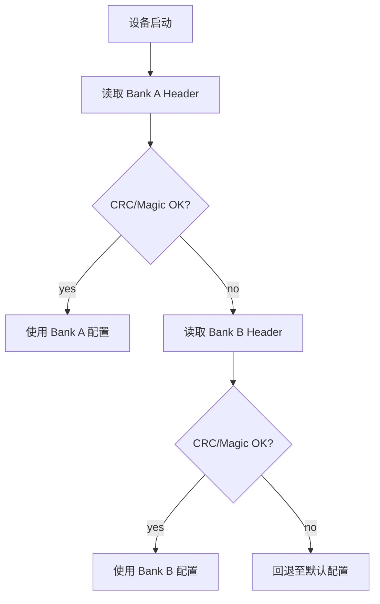
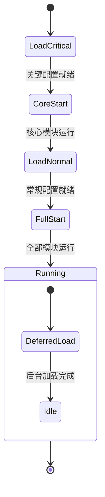

嵌入式设备的配置数据 (设备参数、校准值、用户设置) 需要持久化到 Flash/NvM，并在启动时加载回内存。这看似简单的需求，实际面临三个核心挑战:

1. **格式可演进**: 配置字段随固件升级增删，要求新旧固件能互相解析
2. **数据完整性**: Flash 写入可能被断电中断，需防止配置损坏
3. **资源高效**: 在有限 ROM/RAM 下，序列化开销要小

本文对比两种主流方案: 手工 TLV 和 nanopb。

## 1. 自定义 TLV: 轻量与直接

### 1.1 数据格式

TLV (Type-Length-Value) 是最原始的自描述格式。每个数据块由类型标识、长度、实际数据三部分组成:

```
+--------+--------+------------------+
| Type   | Length | Value (payload)  |
| 2 bytes| 2 bytes| Length bytes      |
+--------+--------+------------------+
```

TLV 块可以嵌套，构建树状结构:

```
+------------------+------------------+
|      全局配置头 (CRC, Ver, Len)     |
+------------------+------------------+
| Type(Mod_A) | Len(24) | Payload_A   |
+------------------+------------------+
| Type(Mod_B) | Len(128)| Payload_B   |
+------------------+------------------+
                   |
                   +-----------------------------------+
                   | Type(Sub_B1) | Len(4) | Payload   |
                   +-----------------------------------+
                   | Type(Sub_B2) | Len(16)| Payload   |
                   +-----------------------------------+
                   | Type(Sub_X)  | Len(96)| Payload   | <-- 旧固件不认识，跳过
                   +-----------------------------------+
```

### 1.2 实现核心

TLV 头结构和解析器:

```c
typedef struct {
    uint16_t type;
    uint16_t length;
} tlv_header_t;

// TLV 解析器: 遍历 buffer，按 type 分发
bool tlv_parse(const uint8_t *buf, size_t total_len,
               tlv_handler_t *handlers, size_t handler_count) {
    size_t offset = 0;
    while (offset + sizeof(tlv_header_t) <= total_len) {
        const tlv_header_t *hdr = (const tlv_header_t *)(buf + offset);

        // 边界检查
        if (offset + sizeof(tlv_header_t) + hdr->length > total_len) {
            return false;  // 数据截断
        }

        const uint8_t *value = buf + offset + sizeof(tlv_header_t);
        bool handled = false;

        for (size_t i = 0; i < handler_count; i++) {
            if (handlers[i].type == hdr->type) {
                handlers[i].parse(value, hdr->length, handlers[i].dst);
                handled = true;
                break;
            }
        }

        if (!handled) {
            // 未知类型: 跳过 (向前兼容)
            LOG_W("Unknown TLV type: 0x%04X, skip %u bytes",
                  hdr->type, hdr->length);
        }

        offset += sizeof(tlv_header_t) + hdr->length;
    }
    return true;
}
```

序列化同样直接:

```c
size_t tlv_write(uint8_t *buf, size_t buf_size,
                 uint16_t type, const void *value, uint16_t length) {
    size_t total = sizeof(tlv_header_t) + length;
    if (total > buf_size) { return 0; }

    tlv_header_t hdr = { .type = type, .length = length };
    memcpy(buf, &hdr, sizeof(hdr));
    memcpy(buf + sizeof(hdr), value, length);
    return total;
}
```

### 1.3 优缺点

**优点:**

- 零依赖，代码量极小 (200 行以内)
- 反序列化基于指针偏移 + memcpy，性能高
- 对 ROM/RAM 的占用最小

**缺点:**

- 每新增字段需手动修改解析和序列化代码
- 无编译期类型检查，memcpy 错误只能在运行时发现
- 嵌套结构的字段变更容易引入 bug

## 2. nanopb: 声明式演进

### 2.1 概述

nanopb 是 Protocol Buffers 的 C 语言实现，专为嵌入式设计。核心理念: 用 `.proto` 文件定义数据结构，工具自动生成编解码代码。

### 2.2 定义配置

`.proto` 文件是数据结构的唯一可信源:

```protobuf
syntax = "proto2";  // nanopb 推荐 proto2

import "nanopb.proto";

option (nanopb_fileopt).max_size = 512;  // 限制最大消息大小

message DeviceConfig {
    // required: 必须存在，缺失则解码失败
    required string device_id = 1 [(nanopb).max_size = 32];
    required uint32 sample_rate_hz = 2;

    // optional: 可选，提供默认值实现向前兼容
    optional bool enable_filtering = 3 [default = true];
    optional uint32 log_level = 4 [default = 2];

    // 嵌套消息
    message AlgorithmParams {
        required float threshold = 1;
        optional bool enable_outlier_removal = 2 [default = true];
    }
    optional AlgorithmParams alg_params = 5;
}
```

生成代码:

```bash
protoc --nanopb_out=. config.proto
# 产出: config.pb.c, config.pb.h
```

### 2.3 使用

```c
#include "config.pb.h"
#include <pb_encode.h>
#include <pb_decode.h>

// 序列化
bool config_serialize(const DeviceConfig *cfg, uint8_t *buf,
                      size_t buf_size, size_t *out_len) {
    pb_ostream_t stream = pb_ostream_from_buffer(buf, buf_size);
    if (!pb_encode(&stream, DeviceConfig_fields, cfg)) {
        return false;
    }
    *out_len = stream.bytes_written;
    return true;
}

// 反序列化
bool config_deserialize(const uint8_t *buf, size_t len,
                        DeviceConfig *cfg) {
    pb_istream_t stream = pb_istream_from_buffer(buf, len);
    return pb_decode(&stream, DeviceConfig_fields, cfg);
}
```

### 2.4 版本演进

假设需要新增 `laser_power` 字段:

**nanopb**: 在 `.proto` 中加一行，重新生成:

```protobuf
optional uint32 laser_power = 6 [default = 100];
```

- 新固件读旧数据: `laser_power` 不存在，自动填充默认值 100
- 旧固件读新数据: 不认识字段 6，自动跳过

**TLV**: 需要手动修改三处:

1. 在结构体中添加 `uint8_t laser_power`
2. 在解析函数的 switch 中添加 `case TYPE_LASER_POWER`
3. 在序列化函数中添加对应的 `tlv_write()` 调用

每次修改都有引入 bug 的风险。

## 3. 方案对比

| 维度 | 自定义 TLV | nanopb |
|------|-----------|--------|
| 代码量 | 极小 (~200 行) | 库 + 生成代码 (~4KB ROM) |
| 依赖 | 无 | nanopb 库 + protoc 工具链 |
| 新增字段 | 手动修改 3 处代码 | 修改 .proto 1 行，自动生成 |
| 类型安全 | 无 (memcpy) | 编译期结构体字段类型检查 |
| 向前兼容 | 手动实现 (跳过未知 type) | 自动 (proto 协议保证) |
| 向后兼容 | 手动实现 | 自动 (optional + default) |
| 性能 | 极高 (指针偏移) | 高 (流式编解码) |
| 调试 | 需手动解析二进制 | protoc 可解码为文本 |
| 嵌套结构 | 支持 (手动管理) | 原生支持 |

### 3.1 选择建议

- **字段 < 10 个，变更极少**: TLV 足够，不值得引入工具链
- **字段 > 10 个，或迭代频繁**: nanopb 的维护成本优势明显
- **多端共享配置格式** (MCU + 上位机 + 云端): nanopb，`.proto` 文件可跨语言生成解析器

## 4. 存储鲁棒性

无论使用哪种序列化方案，配置写入 Flash 时都需要解决断电保护问题。

### 4.1 配置头

在序列化数据前添加固定头，用于完整性校验:

```c
typedef struct {
    uint32_t magic;     // 固定标识 (如 0x43464731 = "CFG1")
    uint16_t version;   // 格式版本号
    uint16_t flags;     // bit0: 0=TLV, 1=nanopb; bit1: 加密; bit2: 压缩
    uint32_t length;    // payload 长度
    uint32_t crc32;     // header + payload 的 CRC-32
} config_header_t;
```

加载时先验证 magic 和 CRC，任一不匹配则拒绝使用。

### 4.2 双区存储

Flash 写入不是原子操作 -- 写入过程中断电会导致数据损坏。双区 (Dual-bank) 方案解决这个问题:

```
Flash Layout:
+----------------+----------------+
|   Bank A       |   Bank B       |
| [Header][Data] | [Header][Data] |
+----------------+----------------+
```

写入流程:

1. 当前使用 Bank A
2. 新配置写入 Bank B (此时 Bank A 仍有效)
3. Bank B 写入完成，更新 active 标记指向 Bank B
4. 如果步骤 2/3 中断电，Bank A 数据完好，下次启动仍用 Bank A

加载流程:

```c
bool config_load(config_header_t *hdr, uint8_t *data, size_t max_len) {
    // 优先加载 Bank A
    if (config_read_bank(BANK_A, hdr, data, max_len)) {
        if (hdr->magic == CONFIG_MAGIC && verify_crc(hdr, data)) {
            return true;
        }
    }
    // Bank A 损坏，尝试 Bank B
    if (config_read_bank(BANK_B, hdr, data, max_len)) {
        if (hdr->magic == CONFIG_MAGIC && verify_crc(hdr, data)) {
            return true;
        }
    }
    // 两个 Bank 都损坏，使用默认配置
    return false;
}
```



### 4.3 Flash 写入注意事项

- **扇区擦除**: Flash 必须先擦除再写入，擦除粒度为扇区 (通常 4KB)。配置数据应对齐到扇区边界
- **写入粒度**: NOR Flash 通常以页 (256B) 为单位写入。大于一页的配置需分多次写入
- **磨损均衡**: 频繁更新的配置应使用磨损均衡算法或文件系统 (如 LittleFS)
- **大小端**: 多平台共享配置时注意字节序。nanopb 使用 varint 编码，天然跨平台；TLV 需手动处理

## 5. 分阶段加载

对启动时间敏感的系统，可将配置分为关键配置和非关键配置，分阶段加载:

```c
typedef enum {
    CFG_PHASE_CRITICAL,   // 启动必需: 设备 ID、通信参数
    CFG_PHASE_NORMAL,     // 正常加载: 算法参数、校准值
    CFG_PHASE_DEFERRED,   // 延迟加载: 日志配置、调试参数
} config_phase_t;

// 核心模块启动后立即可用
void system_init(void) {
    config_load_phase(CFG_PHASE_CRITICAL);  // 阶段 1: 加载关键配置
    core_modules_start();                    // 核心模块启动

    config_load_phase(CFG_PHASE_NORMAL);    // 阶段 2: 加载常规配置
    normal_modules_start();

    // 阶段 3: 非关键配置在后台线程加载
    task_create(deferred_config_loader, NULL);
}
```



这种设计让核心功能尽快启动，不被非关键配置的加载阻塞。

## 6. 总结

| 决策点 | 推荐方案 |
|--------|----------|
| 配置简单、字段少、不常变更 | 自定义 TLV |
| 配置复杂、迭代频繁、多端共享 | nanopb |
| 断电保护 | 双区存储 + CRC |
| 启动速度敏感 | 分阶段加载 |
| 频繁写入场景 | LittleFS 等文件系统 |

序列化方案的选择取决于项目的演进速度和维护成本预期。字段少且稳定时，TLV 的零依赖优势明显；字段多且频繁变更时，nanopb 的声明式演进能显著降低人工错误风险。无论选择哪种方案，存储层的双区保护和 CRC 校验都是必要的工程基础设施。
