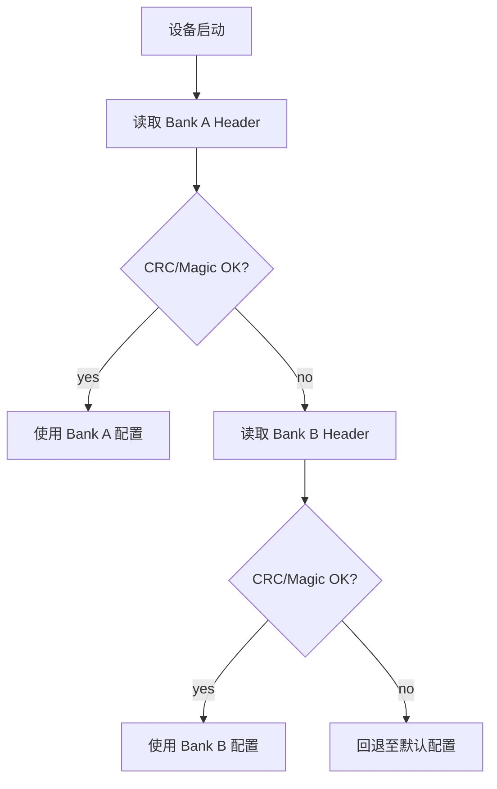
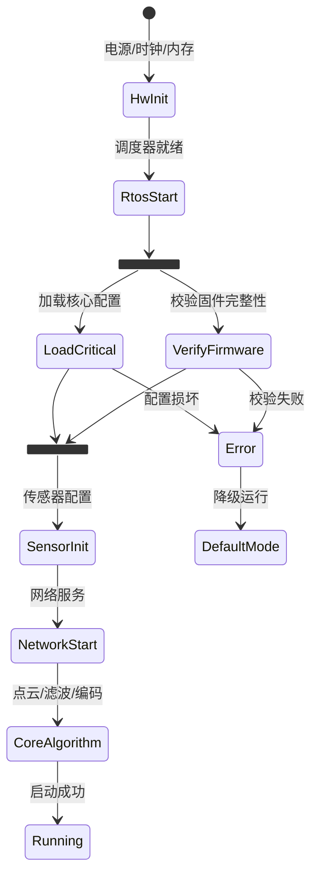
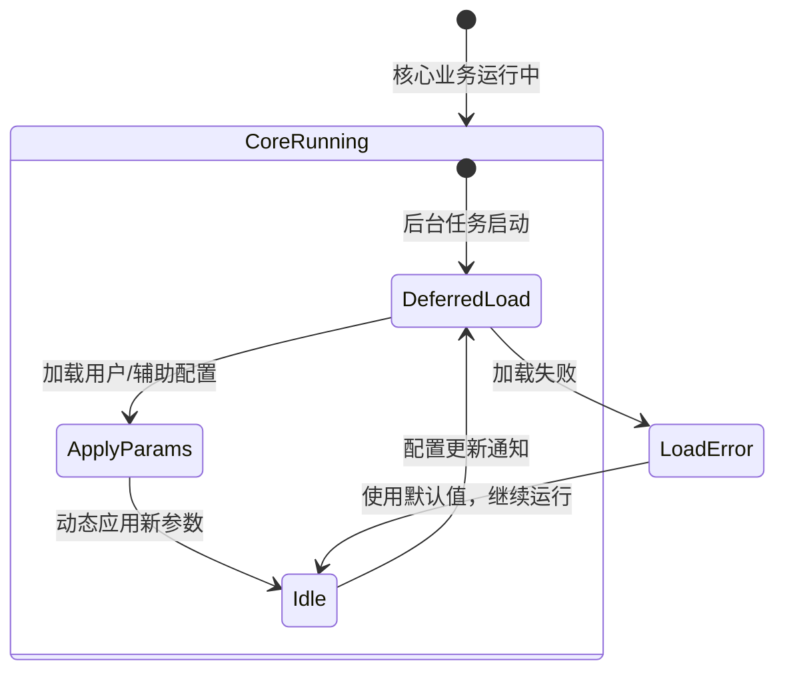

> 参考文章:
>
> - [嵌入式配置数据持久化方案对比 -- 自定义 TLV vs nanopb](https://blog.csdn.net/stallion5632/article/details/150866044)
>
> nanopb 官方: [github.com/nanopb/nanopb](https://github.com/nanopb/nanopb) |
> c-capnproto 仓库: [github.com/opensourcerouting/c-capnproto](https://github.com/opensourcerouting/c-capnproto)

## 1. 背景与核心挑战

嵌入式设备 (激光雷达、工业传感器、边缘网关) 的配置数据 (设备参数、校准值、用户设置) 需要持久化到 Flash/NvM，启动时加载回内存。这看似简单的需求，实际面临三个核心挑战:

| 挑战 | 说明 | 典型场景 |
|------|------|---------|
| **格式可演进** | 配置字段随固件升级增删，要求新旧固件能互相解析 | OTA 后旧配置不能丢失 |
| **数据完整性** | Flash 写入可能被断电中断，需防止配置损坏 | 工业现场意外断电 |
| **资源高效** | 在有限 ROM/RAM 下，序列化开销要小 | Cortex-M 系列 MCU |

本文深度对比三种方案: **自定义 TLV** (零依赖手工方案)、**nanopb** (Protocol Buffers C 实现) 和 **c-capnproto** (Cap'n Proto 零拷贝方案)，从格式设计、版本兼容、性能开销、维护成本等维度逐一分析。

## 2. 自定义 TLV: 轻量与直接

### 2.1 数据格式

TLV (Type-Length-Value) 是最原始的自描述格式。每个数据块由类型标识、长度、实际数据三部分组成:

```
+--------+--------+------------------+
| Type   | Length | Value (payload)  |
| 2 bytes| 2 bytes| Length bytes      |
+--------+--------+------------------+
```

TLV 块可以嵌套，构建树状结构:

```
+------------------+------------------+
|      全局配置头 (CRC, Ver, Len)     |
+------------------+------------------+
| Type(Mod_A) | Len(24) | Payload_A   |
+------------------+------------------+
| Type(Mod_B) | Len(128)| Payload_B   |
+------------------+------------------+
                   |
                   +-----------------------------------+
                   | Type(Sub_B1) | Len(4) | Payload   |
                   +-----------------------------------+
                   | Type(Sub_B2) | Len(16)| Payload   |
                   +-----------------------------------+
                   | Type(Sub_X)  | Len(96)| Payload   | <-- 旧固件不认识，跳过
                   +-----------------------------------+
```

### 2.2 实现核心

TLV 头结构和解析器:

```c
typedef struct {
    uint16_t type;
    uint16_t length;
} tlv_header_t;

// TLV 解析器: 遍历 buffer，按 type 分发
bool tlv_parse(const uint8_t *buf, size_t total_len,
               tlv_handler_t *handlers, size_t handler_count) {
    size_t offset = 0;
    while (offset + sizeof(tlv_header_t) <= total_len) {
        const tlv_header_t *hdr = (const tlv_header_t *)(buf + offset);

        // 边界检查
        if (offset + sizeof(tlv_header_t) + hdr->length > total_len) {
            return false;  // 数据截断
        }

        const uint8_t *value = buf + offset + sizeof(tlv_header_t);
        bool handled = false;

        for (size_t i = 0; i < handler_count; i++) {
            if (handlers[i].type == hdr->type) {
                handlers[i].parse(value, hdr->length, handlers[i].dst);
                handled = true;
                break;
            }
        }

        if (!handled) {
            // 未知类型: 跳过 (向前兼容的关键)
            LOG_W("Unknown TLV type: 0x%04X, skip %u bytes",
                  hdr->type, hdr->length);
        }

        offset += sizeof(tlv_header_t) + hdr->length;
    }
    return true;
}
```

序列化同样直接:

```c
size_t tlv_write(uint8_t *buf, size_t buf_size,
                 uint16_t type, const void *value, uint16_t length) {
    size_t total = sizeof(tlv_header_t) + length;
    if (total > buf_size) { return 0; }

    tlv_header_t hdr = { .type = type, .length = length };
    memcpy(buf, &hdr, sizeof(hdr));
    memcpy(buf + sizeof(hdr), value, length);
    return total;
}
```

### 2.3 优缺点分析

**优点:**

- **零依赖**: 代码量极小 (~200 行)，不引入任何第三方库
- **CPU 开销低**: 反序列化基于指针偏移 + memcpy，无需复杂解析
- **向前兼容**: 跳过未知 type 字段即可，不会因新增字段导致旧固件崩溃
- **支持嵌套**: TLV 天然支持递归嵌套，可构建模块化配置

**缺点:**

- **维护成本高 (命令式开发)**: 每新增一个字段需手动修改**三处代码** -- 枚举定义、解析逻辑、序列化逻辑
- **无编译期类型检查**: memcpy 不会验证字段类型和长度匹配，错误只能在运行时发现
- **原地更新的局限性**: 字段长度变化时原地更新失效，会覆盖后续数据
- **缺少默认值机制**: 旧数据中不存在的新字段，需要手动填充默认值

```c
// 每次新增字段都需要修改三处:
// 1. 枚举定义
enum cfg_type { TYPE_GAIN_MODE, TYPE_SCENE_MODE, TYPE_LASER_POWER /* 新增 */ };
// 2. 解析逻辑
case TYPE_LASER_POWER:
    memcpy(&config.laser_power, ptr, sizeof(uint32_t));
    break;
// 3. 序列化逻辑
tlv_write(buf, buf_size, TYPE_LASER_POWER,
          &config.laser_power, sizeof(uint32_t));
```

## 3. nanopb: 声明式演进与紧凑编码

### 3.1 核心理念

[nanopb](https://github.com/nanopb/nanopb) 是 Protocol Buffers 的 C 语言实现，专为嵌入式系统设计。核心理念: **用 `.proto` 文件声明配置结构，工具自动生成编解码代码**。开发者只需维护 schema，不需要手写解析逻辑。

```bash
# 声明式开发流程
# 1. 编写 .proto 文件 (schema)
# 2. 工具自动生成编解码代码
protoc --nanopb_out=. config.proto
# 产出: config.pb.c, config.pb.h
# 3. 嵌入式代码调用 pb_encode / pb_decode
```

### 3.2 Schema 定义

```protobuf
syntax = "proto2";  // nanopb 推荐使用 proto2 (支持 required/optional/default)
import "nanopb.proto";

// 全局选项: 限制最大消息大小，防止内存溢出
option (nanopb_fileopt).max_size = 512;

message LidarConfig {
    // required: 必须存在，缺失则解码失败
    required string device_id = 1 [(nanopb).max_size = 32];
    required uint32 scan_rate_hz = 2;

    // optional: 可选，可缺省，旧固件不认识的新字段会被自动忽略
    optional bool enable_filtering = 3 [default = true];
    optional uint32 log_level = 4 [default = 2];

    // 嵌套消息: 结构化管理子模块配置
    message AlgorithmParams {
        required float noise_threshold = 1;
        optional bool enable_outlier_removal = 2 [default = true];
    }
    optional AlgorithmParams alg_params = 5;
}
```

nanopb 的关键 `.proto` 选项:

| 选项 | 作用 | 示例 |
|------|------|------|
| `(nanopb).max_size` | 限制 string/bytes 最大长度 | `[(nanopb).max_size = 32]` |
| `(nanopb).max_count` | 限制 repeated 字段最大数量 | `[(nanopb).max_count = 10]` |
| `(nanopb_fileopt).max_size` | 限制整个消息最大编码大小 | `option (nanopb_fileopt).max_size = 512;` |
| `(nanopb).type` | 指定字段类型 (FT_STATIC/FT_CALLBACK) | `[(nanopb).type = FT_STATIC]` |

### 3.3 编解码使用

nanopb 生成的代码提供静态结构体和流式编解码 API:

```c
#include "config.pb.h"

// === 编码 (序列化) ===
LidarConfig config = LidarConfig_init_default;  // 所有字段初始化为默认值
strcpy(config.device_id, "LIDAR-001");
config.scan_rate_hz = 200;
config.enable_filtering = true;
config.has_alg_params = true;  // 标记 optional 嵌套消息存在
config.alg_params.noise_threshold = 0.05f;

uint8_t buffer[512];
pb_ostream_t stream = pb_ostream_from_buffer(buffer, sizeof(buffer));
bool ok = pb_encode(&stream, LidarConfig_fields, &config);
size_t encoded_size = stream.bytes_written;
// encoded_size 通常远小于 sizeof(LidarConfig)，varint 编码紧凑

// === 解码 (反序列化) ===
LidarConfig loaded = LidarConfig_init_default;  // 先填充默认值
pb_istream_t istream = pb_istream_from_buffer(buffer, encoded_size);
ok = pb_decode(&istream, LidarConfig_fields, &loaded);

// 访问解码后的字段
printf("scan_rate = %u\n", loaded.scan_rate_hz);
printf("filtering = %d\n", loaded.enable_filtering);
```

**关键细节**: `LidarConfig_init_default` 宏会将所有 optional 字段初始化为 `.proto` 中定义的默认值。解码旧数据时，旧数据中不存在的新字段保持默认值 -- 这是向前兼容的核心机制。

### 3.4 静态分配 vs 回调分配

nanopb 提供两种内存策略:

```protobuf
// 静态分配 (默认): 字段直接嵌入结构体，编译期确定大小
required string device_id = 1 [(nanopb).max_size = 32];
// 生成: char device_id[32];

// 回调分配: 通过回调函数逐块处理，适合大数据或流式处理
optional bytes firmware_chunk = 10 [(nanopb).type = FT_CALLBACK];
// 生成: pb_callback_t firmware_chunk;
```

| 策略 | 内存模型 | 适用场景 |
|------|---------|---------|
| FT_STATIC (默认) | 编译期固定大小，零 malloc | 配置参数、小型消息 |
| FT_CALLBACK | 回调式逐块处理 | 大文件传输、流式数据 |

嵌入式配置持久化场景推荐全部使用 FT_STATIC，编译期即可确定内存占用。

### 3.5 varint 编码: 紧凑的秘密

Protocol Buffers 的核心编码是 varint (变长整数):

```
值        varint 编码      字节数
0         0x00             1
127       0x7F             1
128       0x80 0x01        2
300       0xAC 0x02        2
16383     0xFF 0x7F        2
16384     0x80 0x80 0x01   3
```

每个字段的编码格式: `[field_number << 3 | wire_type] [varint length/value] [data]`

**与 c-capnproto 固定布局的关键对比**:

```
// 同一个 struct { uint8_t a; uint32_t b; uint16_t c; }

c-capnproto 存储: 8 字节 (固定，64-bit 对齐)
+--------+--------+--------+--------+
| a(1B)  | pad(1B)| c(2B)  | b(4B)  |
+--------+--------+--------+--------+

nanopb 存储 (a=1, b=100, c=50): 6 字节 (变长)
+------+------+------+
|08 01 |10 64 |18 32 |
+------+------+------+
 a=1    b=100  c=50

nanopb 存储 (a=0, b=0, c=0): 0 字节 (全默认，不编码)
```

当大量字段保持默认值时 (嵌入式配置的常态)，nanopb 的编码体积可以远小于 c-capnproto。

### 3.6 优缺点分析

**优点:**

- **声明式演进**: 新增字段只需修改 `.proto` 一行，工具自动生成编解码代码
- **自动版本兼容**: 旧固件忽略未知字段，新固件为缺失字段填充默认值
- **varint 紧凑编码**: 小值和默认值占用极少空间，文件体积小
- **跨语言生态**: `.proto` 文件可生成 C/C++/Python/Go/Java 等多语言解析器
- **ROM 开销小**: nanopb 库本身约 4KB ROM，适合资源受限 MCU
- **基本安全检查**: 解码时检查字段长度，防止缓冲区溢出

**缺点:**

- **需要完整解码**: 读取任何字段前，必须将整个消息解码到 C 结构体中 (非零拷贝)
- **整体重写**: 更新配置需要完整编码后写回 (不支持原地修改)
- **工具链依赖**: 需要 PC 端 protoc 编译器 + nanopb 插件，增加构建复杂度
- **解码性能低于 TLV**: 需要解析 varint 和 wire type，比纯 memcpy 慢
- **proto2 vs proto3 选择**: nanopb 推荐 proto2 (支持 required/default)，与主流 proto3 存在差异

## 4. c-capnproto: 零拷贝与固定布局

### 4.1 核心理念

[c-capnproto](https://github.com/opensourcerouting/c-capnproto) 是 Cap'n Proto 的纯 C (C99) 实现。核心理念: **数据在内存中的布局即为最终存储格式 (wire format)**。读取时通过编译期确定的偏移量直接访问字段，跳过了"解析 -> 拷贝 -> 构建结构体"步骤。

```bash
# 声明式开发流程 (类似 nanopb)
capnp compile -oc config.capnp
# 产出: config.capnp.c, config.capnp.h (纯 C，无 C++ 依赖)
```

> **注意**: capnp 编译器 (capnpc-c) 本身是 C++ 程序，仅在 PC 端运行。生成的代码是纯 C，可直接在 MCU 上编译。

### 4.2 Schema 定义

```capnp
@0xf4b7a151b72a445d;

struct DeviceConfig {
  deviceId @0 :Text;
  sampleRate @1 :UInt32 = 100;      # 采样率，默认 100
  filterMode @2 :UInt8 = 0;         # 滤波模式

  struct AlgorithmParams {
    noiseThreshold @0 :Float32 = 0.1;
    enableOutlierRemoval @1 :Bool = true;
  }
  algorithmParams @3 :AlgorithmParams;

  # 新增字段只需在此处声明，自动兼容
  logLevel @4 :UInt32 = 2;
}
```

### 4.3 字段 ID 机制与版本兼容

Cap'n Proto 使用**显式字段 ID** (`@0`, `@1`, ...) 替代隐式字段顺序:

**ID 管理原则:**

- **唯一性**: 同一 struct 内 ID 必须唯一
- **稳定性**: 一旦分配，ID 永不改变、永不重用
- **可跳跃**: 支持非连续 ID，便于后续插入新字段
- **类型不可变**: 不支持改变已有字段的类型 (如 UInt8 -> UInt16)

**向后兼容 (旧程序读新数据):**

```c
// 旧程序只知道 @0 和 @1 字段
// @4 的 logLevel 字段存在于数据中，但旧程序不访问它，不受影响
uint32_t rate = DeviceConfig_get_sampleRate(reader);
```

**向前兼容 (新程序读旧数据):**

```c
// 新程序读取旧数据时，@4 字段在数据中不存在
// 访问器返回 schema 中定义的默认值 2
uint32_t level = DeviceConfig_get_logLevel(reader);  // 返回 2
```

### 4.4 零拷贝读取原理

Cap'n Proto 的 struct 在内存中被分为 **data section** (存放基本类型) 和 **pointer section** (存放引用类型)。所有字段在 data section 中的偏移量在编译期确定:

```c
// 生成的访问代码 (内联函数，编译后直接偏移读取)
static inline uint32_t DeviceConfig_get_sampleRate(struct DeviceConfig reader) {
    return capn_read32(reader.p, 4);  // 从偏移 4 读取 4 字节
}
```

`capn_read32()` 的实际操作:

1. 检查偏移量是否在 segment 范围内
2. 从 buffer 的指定偏移读取 4 字节
3. 执行 `capn_flip32()` 进行字节序转换 (小端 -> 主机序)
4. **与默认值 XOR** (见 4.5 节)

没有 switch-case 分发、没有类型查找、没有 memcpy 到目标结构体。

### 4.5 XOR 默认值编码

Cap'n Proto 的默认值机制: **字段值在存储时与默认值做 XOR**。

```c
// 假设 schema 中 sampleRate 的默认值为 100
// 存储时: stored = actual_value XOR 100
// 读取时: actual = stored XOR 100
//
// 当 actual_value == 100 时: stored = 100 XOR 100 = 0   (零存储)
// 当 actual_value == 200 时: stored = 200 XOR 100 = 172
// 当数据缺失 (全零) 时: actual = 0 XOR 100 = 100       (自动返回默认值)
```

设计优势:

- 零值存储 = 默认配置，无需特殊处理
- 向前兼容: 新程序读旧数据，缺失字段自动返回默认值
- 无额外空间开销: 不需要 presence bit 或 optional 标记

### 4.6 Arena 内存模型

c-capnproto 使用 **arena 分配** 而非逐个 malloc:

- **读取路径**: 零 malloc。将 buffer 指针传给库，直接读取
- **构建路径**: 需要 segment 分配。可用静态内存池替代 malloc

```c
// 静态分配方式: 预分配 segment buffer
static uint8_t seg_buf[1024] __attribute__((aligned(8)));

struct capn ctx;
struct capn_segment seg;
memset(seg_buf, 0, sizeof(seg_buf));  // 必须零初始化 (XOR 编码要求)
capn_init_malloc(&ctx);
capn_append_segment(&ctx, &seg, seg_buf, sizeof(seg_buf));
```

### 4.7 更新机制

Cap'n Proto 是 **write-once, read-many** 设计。Builder 用于一次性构建消息，不支持原地修改:

```c
// 更新流程: 旧 Reader -> 新 Builder -> 写回 Flash
struct capn old_ctx, new_ctx;
// ... 从 Flash 加载旧数据到 old_ctx ...

capn_init_malloc(&new_ctx);
struct DeviceConfig_Builder builder = new_root_DeviceConfig(&new_ctx);

// 复制旧值 + 修改目标字段
DeviceConfig_set_deviceId(builder, DeviceConfig_get_deviceId(old_reader));
DeviceConfig_set_sampleRate(builder, 200);  // 修改此字段
DeviceConfig_set_filterMode(builder, DeviceConfig_get_filterMode(old_reader));
```

### 4.8 优缺点分析

**优点:**

- **零拷贝读取**: 从 Flash/buffer 直接指针偏移访问字段，O(1) 随机访问
- **声明式演进**: 修改 .capnp 一行，工具自动处理兼容性
- **XOR 默认值**: 优雅的缺省机制，无额外空间开销
- **编译期类型检查**: 生成的访问器函数有明确的类型签名

**缺点:**

- **文件体积偏大**: 固定布局为所有字段预留空间 (64-bit 对齐)，即使未设置也占空间
- **整体重写**: write-once 设计，更新配置需要 Reader -> Builder -> 写回全量数据
- **内存短暂翻倍**: 更新时同时持有旧数据和新 Builder
- **不检查输入边界**: 生成的代码假定输入可信，需在外部添加 CRC 校验
- **零初始化要求**: 所有 segment buffer 必须零初始化，否则 XOR 编码会读出错误值

## 5. 三方案横向对比

### 5.1 核心特性对比

| 维度 | 自定义 TLV | nanopb | c-capnproto |
|------|-----------|--------|-------------|
| **核心代码** | ~200 行手写 | 库 (~4KB ROM) + 生成代码 | 生成代码 + capn.c 运行时 |
| **外部依赖** | 无 | PC 端 protoc + nanopb 插件 | PC 端 capnp 编译器 |
| **新增字段** | 手动修改 3 处 | 修改 .proto 1 行 | 修改 .capnp 1 行 |
| **类型安全** | 无 (memcpy) | 编译期结构体检查 | 编译期类型检查 |
| **版本兼容** | 手动 (跳过未知 type) | 自动 (字段号 + 默认值) | 自动 (字段 ID + XOR) |
| **读取性能** | memcpy + switch | 流式解码 (需拷贝) | **零拷贝 O(1) 直接访问** |
| **随机访问** | 遍历查找 O(n) | 需完整解码后访问 | **O(1) 直接偏移** |
| **更新方式** | 原地更新 | 整体重写 (encode) | 整体重写 (Builder) |
| **文件体积** | 紧凑 | **紧凑 (varint)** | 偏大 (固定布局) |
| **字节序** | 需手动处理 | varint 天然跨平台 | 小端 + flip 转换 |
| **输入安全** | 需自行校验 | 有基本长度检查 | 不检查边界 |
| **生态** | 无 | **protobuf 生态** | Cap'n Proto 生态 |
| **跨语言** | 无 | **.proto 多语言生成** | .capnp 多语言 (C 仅此实现) |

### 5.2 资源开销对比

| 资源 | 自定义 TLV | nanopb | c-capnproto |
|------|-----------|--------|-------------|
| ROM 占用 | < 1 KB | ~4 KB (库) + 生成代码 | 生成代码 + capn.c (~2 KB) |
| RAM (读取) | sizeof(config_t) | sizeof(config_t) | **零额外** (直接读 buffer) |
| RAM (更新) | sizeof(config_t) | sizeof(config_t) + 编码 buffer | **2x** (旧 Reader + 新 Builder) |
| 文件大小 (10 字段，半数默认) | ~80 B | ~40 B | ~120 B |

### 5.3 读取路径对比

```
自定义 TLV:
  Flash -> 读取到 RAM -> 遍历 TLV 块 -> switch/case -> memcpy 到结构体
                                                        ↑ 需要遍历查找

nanopb:
  Flash -> 读取到 RAM -> pb_decode() -> 逐字段解码 varint -> 填充结构体
                                                              ↑ 完整解码

c-capnproto:
  Flash -> 读取到 RAM (或 mmap) -> 直接指针偏移 -> 读取字段
                                                    ↑ 零拷贝，O(1)
```

## 6. 版本演进实践

假设需要在配置中新增一个控制激光功率的 `laser_power` 字段。三种方案的修改量和兼容性行为:

### 6.1 TLV: 手动修改三处

```c
// 1. 枚举定义 -- 新增
enum cfg_type { /* ... */ TYPE_LASER_POWER };

// 2. 结构体 -- 新增
typedef struct {
    /* ... */
    uint8_t laser_power;
} user_cfg_t;

// 3. 解析函数 -- 新增 case
case TYPE_LASER_POWER:
    memcpy(&config.laser_power, ptr, sizeof(uint8_t));
    break;

// 4. 序列化函数 -- 新增
tlv_write(buf, buf_size, TYPE_LASER_POWER,
          &config.laser_power, sizeof(uint8_t));
```

兼容性: 新固件可解析旧文件 (手动填默认值)。旧固件遇到新字段会跳过。

### 6.2 nanopb: 修改 .proto 一行

```protobuf
optional uint32 laser_power = 6 [default = 100];
```

重新运行 `protoc --nanopb_out=. config.proto`，编解码代码自动更新。

兼容性:

- **新固件读旧数据**: `laser_power` 在旧数据中不存在，`pb_decode` 自动填充默认值 100
- **旧固件读新数据**: 旧固件不认识字段号 6，自动忽略该字段

### 6.3 c-capnproto: 修改 .capnp 一行

```capnp
laserPower @5 :UInt32 = 100;
```

重新运行 `capnp compile -oc config.capnp`，访问器代码自动更新。

兼容性:

- **新固件读旧数据**: @5 字段在旧数据中不存在，XOR 零值返回默认值 100
- **旧固件读新数据**: 旧程序不访问 @5 字段，不受影响

### 6.4 演进对比

| 操作 | TLV | nanopb | c-capnproto |
|------|-----|--------|-------------|
| Schema 修改 | 无 schema | 1 行 | 1 行 |
| 代码修改 | 3-4 处手动 | **0 (自动生成)** | **0 (自动生成)** |
| 编译期检查 | 无 | 有 (结构体类型) | 有 (访问器签名) |
| 默认值处理 | 手动 | 自动 (init_default) | 自动 (XOR) |
| 人为出错概率 | 高 | 低 | 低 |

**结论**: nanopb 和 c-capnproto 的维护成本相同 -- 修改 schema 一行，工具自动处理兼容性。TLV 每次都需要手动修改多处代码，且无编译期保障。

## 7. 存储鲁棒性

无论使用哪种序列化方案，配置写入 Flash 时都需要解决断电保护问题。

### 7.1 配置头

在序列化数据前添加固定头:

```c
typedef struct {
    uint32_t magic;     // 固定标识 (如 0x43464731 = "CFG1")
    uint16_t version;   // 格式版本号
    uint16_t flags;     // bit0-1: 格式 (0=TLV, 1=capnproto, 2=nanopb)
    uint32_t length;    // payload 长度
    uint32_t crc32;     // header + payload 的 CRC-32
} config_header_t;
```

`flags` 位定义:

- bit0-1: 序列化格式 (0=TLV, 1=capnproto, 2=nanopb)
- bit2: 1 = payload 已加密
- bit3: 1 = payload 已压缩

加载时先验证 magic 和 CRC，任一不匹配则拒绝使用。**c-capnproto 生成的代码不做边界检查，CRC 校验是防止损坏数据被错误解析的最后防线。**

### 7.2 双区存储

Flash 写入不是原子操作。双区 (Dual-bank) 方案解决断电保护:

```
Flash Layout:
+----------------+----------------+
|   Bank A       |   Bank B       |
| [Header][Data] | [Header][Data] |
+----------------+----------------+
```

写入流程:

1. 当前使用 Bank A
2. 新配置写入 Bank B (此时 Bank A 仍有效)
3. Bank B 写入完成且 CRC 校验通过后，更新 active 标记指向 Bank B
4. 如果步骤 2/3 中断电，Bank A 数据完好，下次启动仍用 Bank A



c-capnproto 和 nanopb 的整体重写模式天然适配双区存储: 生成的完整二进制直接写入备用 Bank，CRC 计算后写入 Header，最后切换 active 标记。

### 7.3 Flash 写入注意事项

- **扇区擦除**: Flash 必须先擦除再写入，擦除粒度为扇区 (通常 4KB)。配置数据应对齐到扇区边界
- **写入粒度**: NOR Flash 通常以页 (256B) 为单位写入。大于一页的配置需分多次写入
- **磨损均衡**: 频繁更新的配置应使用磨损均衡算法或文件系统 (如 LittleFS)
- **大小端**: c-capnproto 定义固定小端存储，在大端 MCU 上有字节交换开销; nanopb 使用 varint 天然跨平台; TLV 需手动处理

## 8. Flash 写入特性: 为什么整体重写不是瓶颈

评估 TLV 原地更新与 nanopb/c-capnproto 整体重写的性能差异时，需要理解 Flash 的物理特性:

- **读取**: 按字节或字进行，速度极快
- **写入**: 只能将 1 变为 0，不能将 0 变为 1
- **擦除**: 将整个扇区 (通常 4KB) 恢复为全 1，是唯一能将 0 变回 1 的操作

这意味着**即使只修改一个字节，只要需要将 0 变为 1**，就必须:

1. 读取整个扇区到 RAM
2. 修改目标字节
3. 擦除整个扇区
4. 将整个扇区写回

| 对比维度 | TLV 原地更新 | nanopb/c-capnproto 整体重写 |
|---------|-------------|---------------------------|
| 理论写入量 | 极少 (单个字段) | 整个文件 |
| 实际写入量 | **至少一个扇区 (4KB)** | 整个文件 (通常 < 4KB) |
| 单点更新 | 读-擦-写一个扇区 | 读-擦-写整个文件 |
| 多点更新 | 读-擦-写**多个**扇区 | 读-擦-写整个文件 **(一次)** |
| 原子性 | 难以实现，易产生中间态 | 易实现，可结合双区存储 |

**关键结论**: 当配置文件小于一个扇区 (4KB，绝大多数嵌入式配置的情况) 时，TLV 的原地更新和 nanopb/c-capnproto 的整体重写在 Flash 层面的实际开销相同。当需要更新分散在多个扇区的字段时，整体重写反而更高效。

## 9. 分阶段加载与启动优化

对启动时间敏感的系统 (如激光雷达)，可将配置按紧迫程度分阶段加载:

```c
typedef enum {
    CFG_PHASE_CRITICAL,   // 启动必需: 设备 ID、通信参数
    CFG_PHASE_NORMAL,     // 正常加载: 算法参数、校准值
    CFG_PHASE_DEFERRED,   // 延迟加载: 日志配置、调试参数
} config_phase_t;

void system_init(void) {
    config_load_phase(CFG_PHASE_CRITICAL);  // 阶段 1: 关键配置
    core_modules_start();                    // 核心模块立即启动

    config_load_phase(CFG_PHASE_NORMAL);    // 阶段 2: 常规配置
    normal_modules_start();

    // 阶段 3: 非关键配置在后台线程加载
    task_create(deferred_config_loader, NULL);
}
```

### 9.1 核心启动状态机



### 9.2 后台加载与热更新

核心业务启动后，非关键配置在后台异步加载:



**三种方案在分阶段加载中的表现**:

| 方案 | 分阶段加载支持 | 说明 |
|------|:---:|------|
| TLV | 天然支持 | 按 type 分组解析，跳过非当前阶段的 type |
| nanopb | 需要拆分 message | 将关键/常规/延迟字段拆分为独立的 message 类型 |
| c-capnproto | **最优** | 阶段 1 只加载 buffer 到内存，各模块按需 Reader 访问字段 |

c-capnproto 的零拷贝特性在分阶段加载中有天然优势: 只需一次读取 buffer 到 RAM，各模块按需通过 Reader 访问自己的字段，无需提前解码所有字段。

## 10. 总结与选型建议

| 决策点 | 推荐方案 |
|--------|----------|
| 配置简单 (< 10 字段)、不常变更 | **自定义 TLV** -- 零依赖 |
| 配置复杂、迭代频繁、多端共享 | **nanopb** -- varint 紧凑 + 跨语言 + 活跃维护 |
| 配置加载后频繁随机访问字段 | **c-capnproto** -- 零拷贝 O(1) |
| 启动速度敏感 | 分阶段加载 (三者均可，c-capnproto 零拷贝最优) |
| 断电保护 | 双区存储 + CRC (三者通用) |
| 数据来源不可信 | nanopb (有基本校验) + 外部 CRC |
| 频繁写入场景 | LittleFS 等磨损均衡文件系统 |
| 长期可维护性 | **nanopb** -- protobuf 生态完善、跨语言 |

三种方案各有定位:

- **自定义 TLV**: 零依赖的轻量方案，适合字段少且稳定的简单配置。维护成本随字段数量线性增长。
- **nanopb**: 声明式演进 + varint 紧凑编码 + 跨语言生态，适合复杂配置和多端协作。是**综合推荐方案** -- 维护成本最低、protobuf 生态最成熟。
- **c-capnproto**: 零拷贝读取 + O(1) 随机访问，在"加载一次、频繁读取"的场景有独特性能优势。

无论选择哪种方案，存储层的**双区保护和 CRC 校验**都是必要的基础设施。而 Flash 的扇区擦除特性决定了: 对于小于一个扇区的配置文件，TLV 原地更新与 nanopb/c-capnproto 整体重写的实际开销没有本质差异。

## 参考资料

1. [嵌入式配置数据持久化方案对比 -- 自定义 TLV vs nanopb](https://blog.csdn.net/stallion5632/article/details/150866044)
2. [nanopb 官方文档](https://jpa.kapsi.fi/nanopb/)
3. [nanopb GitHub](https://github.com/nanopb/nanopb)
4. [c-capnproto GitHub](https://github.com/opensourcerouting/c-capnproto)
5. [Cap'n Proto 官方文档](https://capnproto.org/)
6. [Protocol Buffers Language Guide](https://protobuf.dev/programming-guides/proto2/)
