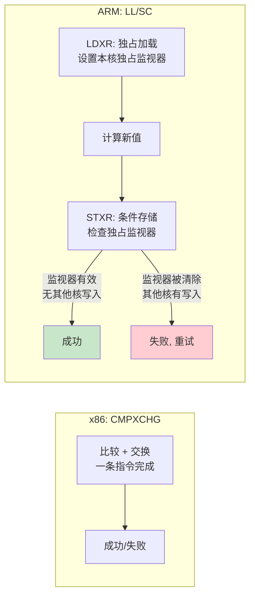
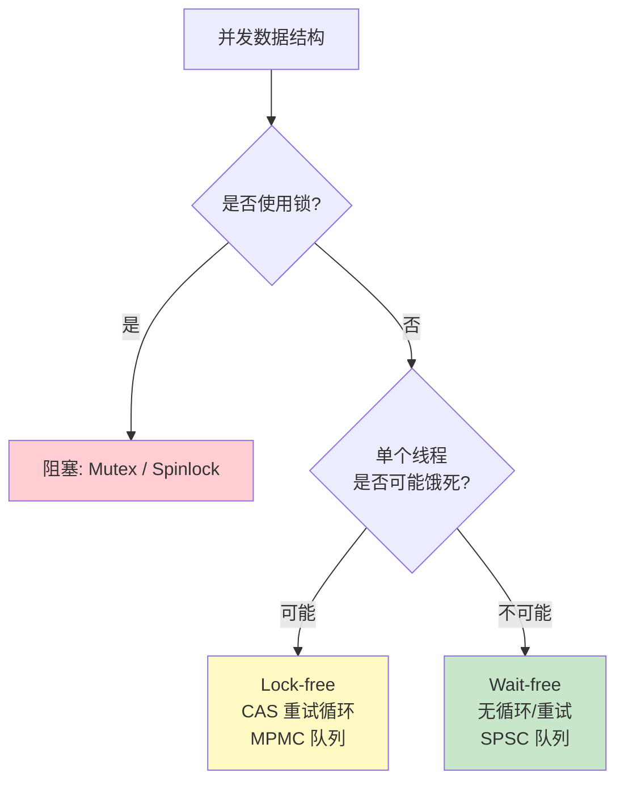
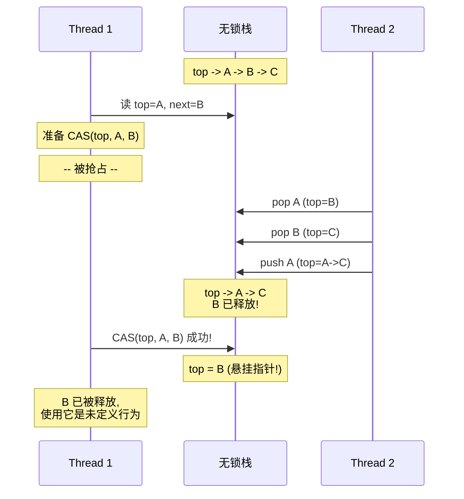
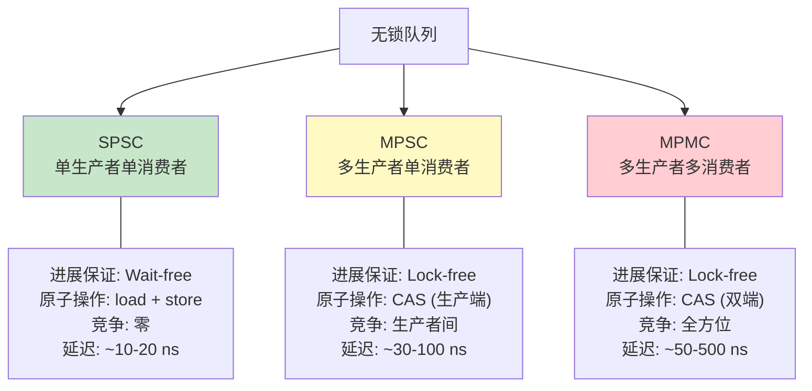
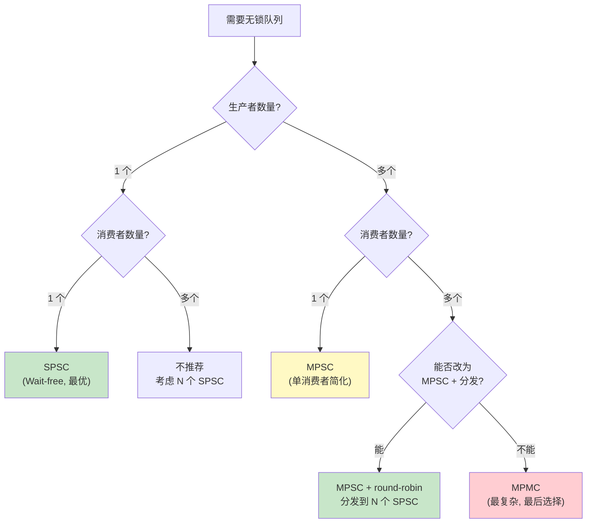

> 相关文章:
> - [内存屏障的硬件原理: 从 Store Buffer 到 ARM DMB/DSB/ISB](../memory_barrier_hardware/) -- 内存序的硬件根因 (Store Buffer/Invalidation Queue/MESI)
> - [SPSC 无锁环形缓冲区设计剖析](../spsc_ringbuffer_design/) -- Wait-free SPSC 的逐行代码分析
> - [无锁异步日志设计](../lockfree_async_log/) -- Per-Thread SPSC 在日志系统中的应用
> - [嵌入式系统死锁防御: 从有序锁到无锁架构](../deadlock_prevention/) -- newosp 的无锁 MPSC 总线架构
> - [嵌入式线程间消息传递重构: MCCC 无锁消息总线](../mccc_message_passing/) -- MPSC 消息总线的完整工程实现
> - [锁竞争基准测试: Spinlock vs Mutex vs ConcurrentQueue](../lock_contention_benchmark/) -- 有锁与无锁的性能实测
> - [perf lock 锁竞争诊断](../perf_lock_contention_diagnosis/) -- 何时需要从有锁迁移到无锁
> - [共享内存进程间通信](../shm_ipc_newosp/) -- 跨进程场景的无锁 Ring Buffer
> - [newosp 深度解析: C++17 事件驱动架构](../newosp_event_driven_architecture/) -- 无锁 MPSC 总线在完整框架中的集成
>
> 参考:
> - [iceoryx Lock-Free Queue Design](https://github.com/eclipse-iceoryx/iceoryx/blob/main/doc/design/lockfree_queue.md)
> - [Herb Sutter: Lock-Free Programming](https://herbsutter.com/2013/02/11/atomic-weapons-the-c-memory-model-and-modern-hardware/)
> - [Jeff Preshing: An Introduction to Lock-Free Programming](https://preshing.com/20120612/an-introduction-to-lock-free-programming/)

---

## 1. 从锁到无锁: 何时值得

锁（mutex）是多线程编程最直觉的同步工具，但它有两个根本性开销:

1. **系统调用**: Linux 的 `pthread_mutex_lock` 在竞争时进入内核 futex，两次用户态/内核态切换 + 上下文切换，延迟 1-100+ us
2. **序列化**: 锁保护的临界区同一时刻只有一个线程执行，并行度为 1

> 这两个开销可以用 `perf lock contention` 量化。详见 [perf lock 锁竞争诊断](../perf_lock_contention_diagnosis/)。

无锁编程的目标不是消灭所有同步，而是**用原子操作替代锁，让多个线程能同时推进**。但无锁不是银弹 -- 它增加了代码复杂度，且只在特定数据结构（队列、栈、计数器）上有成熟方案。

**决策原则**: 不要在没有数据支撑的情况下追求无锁。先用 `perf lock` 量化锁竞争，确认它确实是瓶颈，再考虑无锁替代。

---

## 2. CAS: 无锁编程的原子基石

### 2.1 CAS 操作原理

CAS（Compare-And-Swap）是一条硬件原子指令，伪代码如下:

```
bool CAS(addr, expected, desired):
    atomically {
        if (*addr == expected):
            *addr = desired
            return true
        else:
            expected = *addr  // 更新 expected 为当前值
            return false
    }
```

整个「比较 + 交换」操作在硬件层面是**不可分割的**。没有任何线程能在比较和交换之间看到中间状态。

### 2.2 硬件实现

不同架构的 CAS 实现差异显著:

| 架构 | 指令 | 机制 |
|------|------|------|
| x86/x64 | `CMPXCHG` | 单条指令，总线锁或缓存锁 |
| ARMv8 (AArch64) | `LDXR` + `STXR` (LL/SC) | 独占加载 + 独占存储，通过独占监视器 |
| ARMv8.1+ | `CAS` / `CASP` | 原生 CAS 指令（LSE 扩展） |

ARM 的 LL/SC（Load-Linked / Store-Conditional）与 x86 的 CMPXCHG 有本质区别:



ARM 的 STXR 可能因为**任何原因**失败（不仅是目标地址被修改，甚至中断、缓存行被驱逐也可能清除独占监视器）。这是 `compare_exchange_weak` 允许「伪失败」（spurious failure）的硬件原因。

### 2.3 weak vs strong

C++ 提供两个 CAS 变体:

```cpp
// weak: 可能伪失败（ARM LL/SC 的特性），但开销更低
bool compare_exchange_weak(T& expected, T desired, ...);

// strong: 不会伪失败，但在 ARM 上内部包含重试循环
bool compare_exchange_strong(T& expected, T desired, ...);
```

**选择原则**:

| 场景 | 选择 | 原因 |
|------|------|------|
| 已在循环中使用 | `weak` | 循环本身会重试，伪失败的代价只是多一次迭代 |
| 单次判断（非循环） | `strong` | 伪失败会导致逻辑错误 |

典型的 CAS 循环（无锁计数器）:

```cpp
// 原子递增: lock-free
void increment(std::atomic<int>& counter) {
    int old = counter.load(std::memory_order_relaxed);
    while (!counter.compare_exchange_weak(
               old, old + 1,
               std::memory_order_relaxed,
               std::memory_order_relaxed)) {
        // CAS 失败: old 已被自动更新为当前值，直接重试
    }
}
```

这段代码永远不会阻塞另一个线程。如果 CAS 失败，说明另一个线程成功了 -- 系统整体有进展。

---

## 3. 进展保证: Lock-Free vs Wait-Free

### 3.1 严格定义

这两个术语常被混淆。严格定义如下:

| 属性 | 保证 | 含义 |
|------|------|------|
| **Wait-free** | 每个线程在**有限步**内完成操作 | 最强。无论其他线程如何运行，当前线程都能在 O(1) 或 O(n) 步内完成 |
| **Lock-free** | **至少一个**线程在有限步内完成操作 | 系统整体有进展，但单个线程可能被**饿死** |
| **Obstruction-free** | 在**无竞争**时线程能在有限步内完成 | 最弱。一旦竞争，可能无限等待 |



### 3.2 SPSC 是 Wait-Free

单生产者单消费者（SPSC）队列的 Push 操作:

```cpp
bool Push(T data) {
    IndexT head = head_.load(relaxed);       // 1. 读自己的索引
    IndexT tail = tail_.load(acquire);       // 2. 读对方的索引
    if ((head - tail) == BufferSize)         // 3. 满检查
        return false;
    data_buff_[head & kMask] = data;         // 4. 写数据
    head_.store(head + 1, release);          // 5. 发布
    return true;
}
```

**没有任何循环或重试**。每次调用恒定 5 步完成。无论消费者如何运行，生产者都能在有限步内返回。这就是 wait-free。

> SPSC 的完整设计剖析见 [SPSC 无锁环形缓冲区设计剖析](../spsc_ringbuffer_design/)。

### 3.3 MPMC CAS 队列是 Lock-Free

多生产者多消费者（MPMC）队列的入队操作:

```cpp
bool Enqueue(const T& data) {
    uint32_t head = head_.load(std::memory_order_relaxed);
    while (true) {                           // CAS 重试循环
        uint32_t tail = tail_.load(std::memory_order_acquire);
        if ((head - tail) >= capacity_)
            return false;
        if (head_.compare_exchange_weak(     // CAS 竞争
                head, head + 1,
                std::memory_order_acq_rel,
                std::memory_order_relaxed)) {
            queue_[head & mask_] = data;
            return true;
        }
        // CAS 失败: 其他生产者抢先，head 已更新，再试
    }
}
```

`while (true)` 循环是 lock-free 的特征。CAS 失败意味着另一个生产者成功了（系统有进展），但当前线程可能多次重试。在极端情况下（4+ 生产者），某些线程可能自旋数十次。

### 3.4 自旋锁不是无锁

一个常见的误区是将 `std::atomic_flag` 自旋锁称为"无锁":

```cpp
class Spinlock {
    std::atomic_flag flag_ = ATOMIC_FLAG_INIT;
public:
    void lock() {
        while (flag_.test_and_set(std::memory_order_acquire))
            ; // 自旋等待
    }
    void unlock() {
        flag_.clear(std::memory_order_release);
    }
};
```

虽然没有使用 OS mutex，但自旋锁本质上是**互斥的** -- 同一时刻只有一个线程能进入临界区。持有锁的线程被调度走后，等待线程无限自旋，系统没有进展。这不满足 lock-free 的定义。

> 自旋锁、互斥锁与无锁队列的性能对比，见 [锁竞争基准测试](../lock_contention_benchmark/)。结论: 无锁队列在 MPMC 场景下吞吐量领先 1-2 个数量级。

---

## 4. ABA 问题

### 4.1 什么是 ABA

ABA 是 CAS 操作特有的正确性问题。考虑一个无锁栈的 pop 操作:

```
初始状态: top -> A -> B -> C

Thread 1: 读到 top = A, next = B
          (准备 CAS: top A -> B)
          -- 被抢占 --

Thread 2: pop A  -> top = B
          pop B  -> top = C
          push A -> top = A -> C

Thread 1: 恢复执行
          CAS(top, A, B) -- 成功! (top 确实是 A)
          但 B 已经被释放了!
```



CAS 只比较**值**是否相等，无法判断值是否在中间被改变过又改回来。

### 4.2 解决方案: 版本号标记

为每个指针或索引附加一个单调递增的**版本号（tag）**:

```cpp
struct TaggedPointer {
    Node* ptr;
    uint64_t tag;  // 每次修改 +1
};

// CAS 同时比较 ptr 和 tag
std::atomic<TaggedPointer> top;
```

即使 ptr 回到原值，tag 已经不同，CAS 会正确失败。

在 64 位系统上，可以利用**指针高位未使用**的特性（x86-64 的虚拟地址只用 48 位），将 tag 打包到高 16 位:

```cpp
// 打包方案: 高 16 位存 tag，低 48 位存地址
uintptr_t pack(void* ptr, uint16_t tag) {
    return (static_cast<uintptr_t>(tag) << 48) |
           (reinterpret_cast<uintptr_t>(ptr) & 0x0000FFFFFFFFFFFF);
}
```

### 4.3 iceoryx 的周期索引设计

iceoryx 的无锁队列采用了一种优雅的 ABA 防护: **周期索引（Cyclic Index）**。

索引 `j` 表示为 `(cycle, index)` 对:
- `index = j % n` -- 数组中的实际位置
- `cycle = j / n` -- 第几轮

```
容量 n = 4 时:
j = 0  -> (cycle=0, index=0)
j = 1  -> (cycle=0, index=1)
j = 4  -> (cycle=1, index=0)  // 第二轮
j = 8  -> (cycle=2, index=0)  // 第三轮
```

**head 和 tail 是单调递增的无符号整数，不做回绕**。推送使 tail 增加 1，弹出使 head 增加 1。只在访问数组时用 `& (n-1)` 映射到实际位置。

每个数组元素也存储一个 cycle 值。推送时，只有当元素的 cycle 恰好比 tail 的 cycle 小 1 时才进行写入:

```cpp
// 伪代码: iceoryx 索引队列 push
bool push(uint64_t value) {
    uint64_t tail = tail_.load(relaxed);
    uint64_t cycle = tail / n;
    uint64_t index = tail % n;

    // 检查槽位是否空闲 (cycle 差 1)
    if (slots[index].cycle != cycle - 1)
        return false;  // 队列满

    if (tail_.CAS(tail, tail + 1)) {  // CAS 推进 tail
        slots[index].value = value;
        slots[index].cycle = cycle;    // 更新槽位 cycle
        return true;
    }
    return false;  // CAS 失败, 重试
}
```

由于 head 和 tail 严格单调递增，要发生 ABA，需要完整的 `uint64_t` 溢出回绕 -- 即 2^64 次操作。以每秒 10 亿次操作计算，需要约 584 年。实际上不可能发生。

### 4.4 SPSC 不存在 ABA

SPSC 队列中，`head` 只有一个写者（生产者），`tail` 只有一个写者（消费者）。**不存在写-写竞争**，因此不使用 CAS，自然没有 ABA 问题。这是 SPSC 比 MPMC 简单得多的根本原因之一。

---

## 5. 内存序: 无锁编程的正确性基础

### 5.1 为什么 relaxed 不够

考虑一个简单的生产者-消费者通信:

```cpp
int data = 0;
std::atomic<bool> ready{false};

// 生产者
void producer() {
    data = 42;                                        // 写数据
    ready.store(true, std::memory_order_relaxed);     // 通知
}

// 消费者
void consumer() {
    while (!ready.load(std::memory_order_relaxed));   // 等待通知
    assert(data == 42);  // 在 ARM 上可能失败!
}
```

在 x86（TSO 模型）上，这段代码碰巧正确 -- 硬件保证 store-store 有序。但在 ARM（弱序模型）上，CPU 可能将 `data = 42` 重排到 `ready = true` 之后，消费者看到 `ready == true` 但 `data` 还是 0。重排序的硬件根因是 Store Buffer 和 Invalidation Queue，详见 [内存屏障的硬件原理](../memory_barrier_hardware/)。

### 5.2 acquire-release 配对

修复方案: 使用 `release` 写和 `acquire` 读:

```cpp
// 生产者: release 保证 data 写入在 ready 之前
ready.store(true, std::memory_order_release);

// 消费者: acquire 保证 data 读取在 ready 之后
while (!ready.load(std::memory_order_acquire));
```

`release-acquire` 配对的语义:

```
生产者:                          消费者:
  所有之前的写入                    acquire load ready
  ────────────────                ────────────────
  release store ready    ──同步──>  所有之后的读取
                                   看到生产者 release
                                   之前的全部写入
```

这是无锁编程中最核心的同步原语。SPSC 队列的正确性完全建立在这个语义之上:
- 生产者写数据后 `release store head` -> 消费者 `acquire load head` 后读数据
- 消费者读数据后 `release store tail` -> 生产者 `acquire load tail` 后检查空间

### 5.3 ARM vs x86 差异

| 内存序 | x86 (TSO) | ARM (弱序) | 开销差异 |
|--------|-----------|-----------|---------|
| `relaxed` | 普通 load/store | 普通 load/store | 无 |
| `acquire` | 无额外开销 (TSO 保证) | `LDAR` 或 `DMB ISHLD` | ARM 多 10-40 周期 |
| `release` | 无额外开销 (TSO 保证) | `STLR` 或 `DMB ISH` | ARM 多 10-40 周期 |
| `seq_cst` | `MFENCE` 全屏障 | `DMB ISH` + load/store + `DMB ISH` | 两者都有开销 |

x86 硬件天然保证了大多数排序，所以在 x86 上用 `relaxed` 的代码"碰巧正确"。但移植到 ARM 后会出 bug。**正确的做法是始终使用恰当的内存序**，让编译器在 x86 上自动省略不必要的屏障。

### 5.4 精确内存序选择原则

| 操作 | 内存序 | 原因 |
|------|--------|------|
| 读自己写的变量 | `relaxed` | 只有自己写，无需跨线程同步 |
| 读对方写的变量 | `acquire` | 需要看到对方的 release 之前的所有写入 |
| 写后让对方可见 | `release` | 保证之前的数据写入不会被重排到此之后 |
| 不确定时 | `seq_cst` | 安全但代价高；确认正确后再降级优化 |

> 每种内存序在 ARM 上的具体指令映射和代价分析，见 [SPSC 无锁环形缓冲区设计剖析 -- 第 6 节](../spsc_ringbuffer_design/)。四种屏障类型 (StoreStore/LoadLoad/LoadStore/StoreLoad) 和 ARM DMB/DSB/ISB 的精确语义，见 [内存屏障的硬件原理](../memory_barrier_hardware/)。

---

## 6. 三种无锁队列设计模式

### 6.1 设计谱系总览



### 6.2 SPSC: Wait-Free, 零竞争

**适用场景**: 严格的一对一通道 -- ISR 到处理线程、日志生产者到写盘线程、传感器采集到融合线程。

**核心设计**:

```
Producer Thread                    Consumer Thread
    |                                  |
    | load head_ (relaxed)             | load tail_ (relaxed)
    | load tail_ (acquire)             | load head_ (acquire)
    | write data_buff_[head & mask]    | read data_buff_[tail & mask]
    | store head_+1 (release)          | store tail_+1 (release)
```

**为什么 wait-free**: `head_` 只有生产者写，`tail_` 只有消费者写。两个线程各操作各的索引，无写-写竞争，无需 CAS，无需重试循环。

**关键工程决策**:

| 决策 | 原因 |
|------|------|
| 缓存行对齐 (`alignas(64)`) | head 和 tail 独占缓存行，消除 false sharing |
| 2 的幂 + 位掩码 | `& (size-1)` 替代取模，ARM 单周期 |
| 索引不回绕 | 无符号溢出是 well-defined，省一次取模 |
| memcpy 批量操作 | 摊薄 acquire/release 屏障开销 |
| FakeTSO 单核模式 | 单核 MCU 用 relaxed 替代硬件屏障 |

> 完整的逐行分析见 [SPSC 无锁环形缓冲区设计剖析](../spsc_ringbuffer_design/)。
> 在异步日志中的实际应用见 [无锁异步日志设计](../lockfree_async_log/)。

### 6.3 MPSC: 单消费者简化

**适用场景**: 多个线程向同一个队列发送消息，一个专用线程消费 -- 消息总线、事件分发器、日志聚合。

**核心设计**: 生产者之间通过 CAS 竞争 `tail`（写入端），消费者独占 `head`（读取端）。

```cpp
// MPSC 入队: CAS 竞争写入端
bool Publish(T payload) {
    uint32_t pos;
    Slot* target;
    do {
        pos = producer_pos_.load(std::memory_order_relaxed);
        target = &ring_buffer_[pos & kBufferMask];

        uint32_t seq = target->sequence.load(std::memory_order_acquire);
        if (seq != pos)
            return false;  // 缓冲区满
    } while (!producer_pos_.compare_exchange_weak(
        pos, pos + 1,
        std::memory_order_acq_rel,
        std::memory_order_relaxed));

    target->payload = std::move(payload);
    target->sequence.store(pos + 1, std::memory_order_release);
    return true;
}

// MPSC 消费: 单线程，无 CAS
uint32_t ProcessBatch() {
    uint32_t count = 0;
    while (count < kBatchSize) {
        Slot& slot = ring_buffer_[consumer_pos_ & kBufferMask];
        uint32_t seq = slot.sequence.load(std::memory_order_acquire);
        if (seq != consumer_pos_ + 1)
            break;  // 没有新数据

        dispatch(slot.payload);
        slot.sequence.store(consumer_pos_ + kBufferSize,
                           std::memory_order_release);
        ++consumer_pos_;
        ++count;
    }
    return count;
}
```

**关键差异**: 消费者不用 CAS -- 它是唯一的读者，`consumer_pos_` 是普通变量（非原子）。这比 MPMC 少了一半的 CAS 操作。

**每个 Slot 的 sequence 字段**用于协调生产者和消费者:

```
sequence == pos     : 槽空闲，生产者可写入
sequence == pos + 1 : 数据就绪，消费者可读取
sequence == pos + N : 消费者已释放，下一轮可用
```

> newosp 的 AsyncBus 就是这种模式。架构解析见 [嵌入式系统死锁防御](../deadlock_prevention/)。
> 完整工程实现见 [MCCC 无锁消息总线](../mccc_message_passing/)。

### 6.4 MPMC: 完全通用, 双端 CAS

**适用场景**: 多个生产者和多个消费者都需要并发访问同一个队列 -- 线程池任务队列、通用工作分发。

MPMC 队列是最复杂的无锁数据结构之一。一种经典的实现方案（iceoryx 采用）是**索引队列 + 数据缓冲区分离**:

```
+---------------------------+
| 空闲索引队列 (freeList)    |  <- 存储可用的槽位编号
+---------------------------+
| 已用索引队列 (usedList)    |  <- 存储有数据的槽位编号
+---------------------------+
| 数据缓冲区 buffer[N]      |  <- 存储实际数据
+---------------------------+
```

**Push 流程**:

```
1. 从 freeList 弹出一个空闲索引 i    (CAS pop)
2. 将数据写入 buffer[i]
3. 将 i 推入 usedList               (CAS push)
```

**Pop 流程**:

```
1. 从 usedList 弹出一个已用索引 i    (CAS pop)
2. 从 buffer[i] 读取数据
3. 将 i 推回 freeList               (CAS push)
```

这种设计的优点:
- **数据不移动**: push/pop 只传递索引，数据始终在 buffer 原地，适合大对象
- **ABA 安全**: 索引队列使用周期索引，单调递增消除 ABA 风险
- **lock-free**: 生产者和消费者各自独立推进，互不阻塞

缺点:
- 每次操作涉及**两次 CAS**（一次索引弹出 + 一次索引推入）
- 内存访问不连续（索引队列 + 数据缓冲区分散在不同缓存行）

### 6.5 三种模式对比

| 维度 | SPSC | MPSC | MPMC |
|------|------|------|------|
| 进展保证 | **Wait-free** | Lock-free | Lock-free |
| 生产端操作 | load + store | **CAS 循环** | **CAS 循环** |
| 消费端操作 | load + store | load + store | **CAS 循环** |
| CAS 次数 / 操作 | 0 | 1 | 2 |
| 缓存行为 | head/tail 各一核 | tail 多核乒乓 | head+tail 多核乒乓 |
| ABA 风险 | 无 | 生产端 | 双端 |
| 适用线程模型 | 1:1 | N:1 | N:M |
| 典型延迟 | ~10-20 ns | ~30-100 ns | ~50-500 ns |

### 6.6 选型决策



**核心原则**: 能用 SPSC 就不用 MPSC，能用 MPSC 就不用 MPMC。每多一端 CAS 竞争，延迟和复杂度都显著增加。

newosp 的架构正是这个原则的实践: MPSC 总线接收所有消息，Dispatcher 线程 round-robin 分发到每个 Worker 的独立 SPSC 队列。热路径上只有 SPSC（wait-free），MPSC 的 CAS 竞争限制在入口处。

---

## 7. 工程实践清单

### 7.1 消除 false sharing

两个线程频繁写入同一缓存行的不同变量，会触发 MESI 协议的缓存行乒乓:

```cpp
// 错误: head_ 和 tail_ 可能在同一缓存行
struct BadQueue {
    std::atomic<uint32_t> head_;  // 生产者写
    std::atomic<uint32_t> tail_;  // 消费者写
};

// 正确: 各占独立缓存行
struct GoodQueue {
    alignas(64) std::atomic<uint32_t> head_;  // Cache Line 0
    alignas(64) std::atomic<uint32_t> tail_;  // Cache Line 1
};
```

ARM Cortex-A 系列缓存行通常为 64 字节。false sharing 导致的 L1 miss 延迟约 40-80 周期，而 L1 hit 仅需 2-4 周期。

### 7.2 2 的幂位掩码

```cpp
static constexpr uint32_t kMask = BufferSize - 1;

// 位与: ARM 单周期
uint32_t index = head & kMask;

// 取模: ARM 4-12 周期 (无硬件除法或延迟高)
uint32_t index = head % BufferSize;
```

编译期约束:

```cpp
static_assert((BufferSize & (BufferSize - 1)) == 0,
              "Buffer size must be a power of 2.");
```

### 7.3 批量操作摊薄屏障开销

单元素操作每次都需要一个 acquire load + 一个 release store。批量操作将 N 个元素包裹在一对 acquire/release 之间:

```cpp
// 单元素: N 次 acquire + N 次 release
for (int i = 0; i < N; ++i) {
    queue.Push(data[i]);  // 每次: acquire load tail + release store head
}

// 批量: 1 次 acquire + 1 次 release
size_t written = queue.PushBatch(data, N);
// 内部: 一次 acquire load tail -> N 次 memcpy -> 一次 release store head
```

在 ARM 上，每个 DMB 屏障约 10-40 周期。1000 个元素批量操作比逐个操作节省 ~999 个 acquire 和 ~999 个 release 屏障。

### 7.4 trivially_copyable 约束

批量 memcpy 路径要求数据类型是 `trivially_copyable`:

```cpp
static_assert(std::is_trivially_copyable<T>::value,
              "Type T must be trivially copyable for memcpy.");
```

如果 T 有自定义拷贝构造函数、析构函数或虚函数表，memcpy 会绕过这些逻辑。热路径上的数据类型应该是 POD-like 的。

### 7.5 非阻塞返回

无锁队列的 Push/Pop 在队列满/空时应立即返回 `false`，而非阻塞等待:

```cpp
if (queue_full)
    return false;  // 非阻塞: 调用者决定如何处理
```

阻塞等待违反了无锁的进展保证。如果生产者在队列满时 spin-wait 消费者释放空间，就退化成了互斥等待。正确的做法是:
- **背压丢弃**: 丢弃低优先级消息，计数上报
- **回退策略**: 超时后走同步 fallback 路径
- **准入控制**: 按优先级设定不同的丢弃阈值

---

## 8. 验证与调试

无锁代码的正确性验证比有锁代码困难得多。编译通过、测试通过不代表没有数据竞争。

### 8.1 ThreadSanitizer (TSan)

```bash
g++ -fsanitize=thread -g -O1 -o test test.cpp -lpthread
./test
```

TSan 能检测到:
- 非原子变量的数据竞争
- 原子操作的内存序过弱
- lock/unlock 的顺序违规

### 8.2 关键检查项

| 检查项 | 常见错误 |
|--------|----------|
| 所有共享变量是否为 `std::atomic` | 非原子读写是数据竞争（UB） |
| CAS 循环中 expected 是否正确更新 | `compare_exchange_weak` 失败时会自动更新 expected |
| release 之前的写入是否完整 | 数据写入必须在 release store 之前 |
| acquire 之后才读取数据 | 读数据必须在 acquire load 之后 |
| 队列满/空的边界条件 | 差一错误（off-by-one）是最常见的 bug |
| 无符号溢出的正确处理 | `head - tail` 在溢出后仍需正确 |

---

## 9. 总结

无锁编程的知识体系可以沿一条主线展开:

```
CAS 原子操作 (硬件基础)
    |
    v
进展保证层级 (wait-free > lock-free > 阻塞)
    |
    v
ABA 问题 (CAS 的正确性陷阱)
    |
    v
内存序 (acquire-release: 跨线程可见性保证)
    |
    v
队列设计模式 (SPSC -> MPSC -> MPMC: 复杂度递增)
    |
    v
工程实践 (缓存行对齐、批量操作、非阻塞返回)
```

**核心原则**:

1. **数据驱动**: 先量化锁竞争（perf lock），确认是瓶颈再迁移到无锁
2. **最简适配**: 能 SPSC 不 MPSC，能 MPSC 不 MPMC
3. **精确内存序**: 不用 seq_cst 求安全，也不用 relaxed 求性能，用恰当的 acquire/release
4. **硬件意识**: 理解 CAS 在 ARM LL/SC 上的伪失败、DMB 屏障的代价、缓存行的粒度

无锁不是"高级版的有锁"，而是一种完全不同的并发思维方式: **不阻止其他线程执行，而是让每个线程在竞争中自适应地完成自己的操作**。
