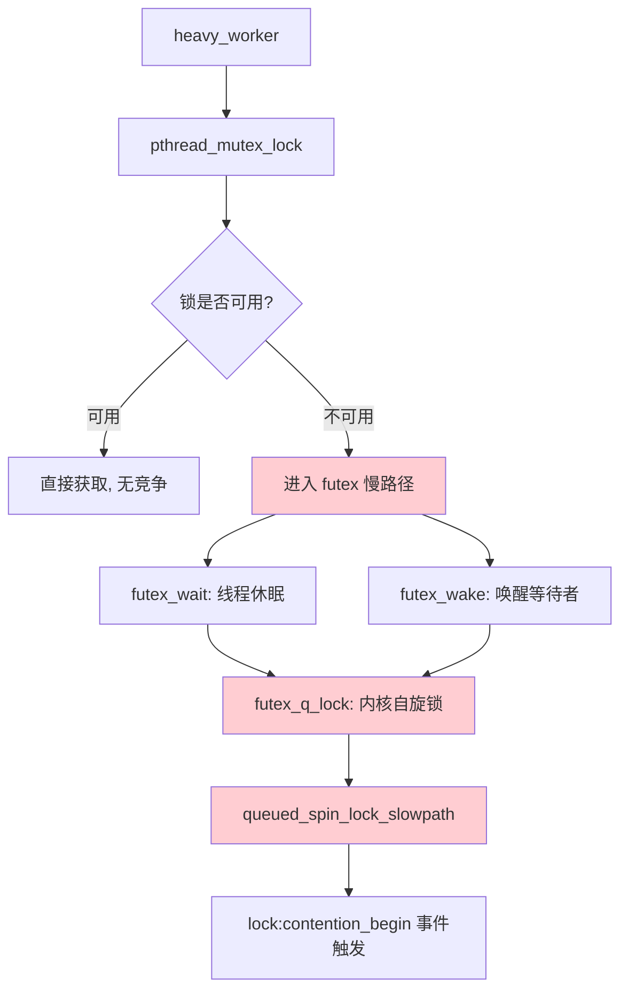
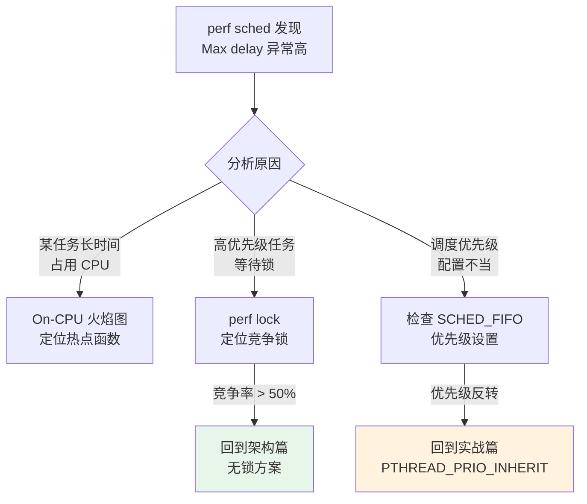
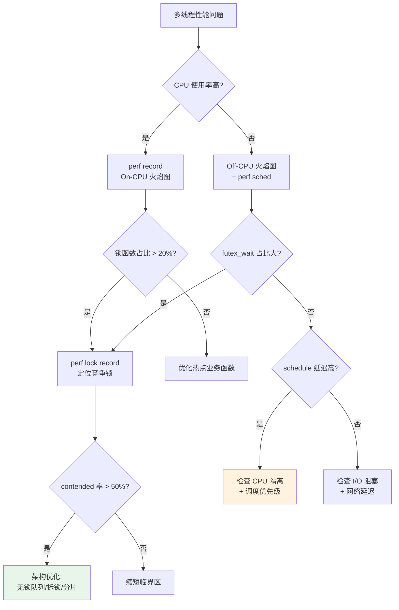
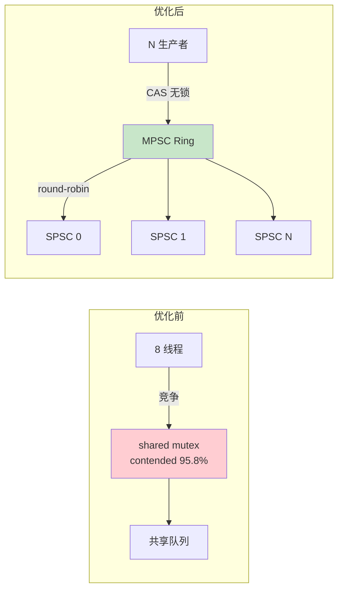

> 本文是**诊断篇**，聚焦「如何用工具找到锁竞争和性能瓶颈」。
>
> **系列文章**:
> - [嵌入式系统死锁防御: 从有序锁到无锁架构的工程实践](../deadlock_prevention/) -- 架构篇: 如何**设计**不出死锁的系统
> - [多线程死锁与优先级反转实战: 从问题复现到工程解决方案](../deadlock_priority_inversion_practice/) -- 实战篇: 如何**复现和修复**死锁与优先级反转
> - **本文** -- 诊断篇: 如何用 perf **定位**锁竞争、CPU 热点、调度延迟
>
> 建议阅读顺序: **架构篇（预防） -> 实战篇（复现/修复） -> 本文（诊断）**
>
> 参考:
> - 原文: [perf lock 诊断锁竞争](https://blog.csdn.net/stallion5632/article/details/143665002)
> - 原文: [Linux perf 工具安装与使用](https://blog.csdn.net/stallion5632/article/details/138562957)
> - [Brendan Gregg: perf Examples](https://www.brendangregg.com/perf.html)
> - [FlameGraph](https://github.com/brendangregg/FlameGraph)

---

## 三篇文章的关系


| 阶段 | 文章 | 解决的问题 |
|------|------|-----------|
| 预防 | 架构篇 | 无锁 MPSC/SPSC、Collect-Release-Execute、LIFO 关停 |
| 修复 | 实战篇 | AB-BA 死锁、重入死锁、优先级反转的代码级修复 |
| 诊断 | **本文** | 锁竞争热点在哪？哪个函数最耗 CPU？调度延迟多大？ |

---

## 1. perf 工具准备

### 1.1 安装

**Ubuntu / Debian (x86_64)**:

```bash
sudo apt install linux-tools-$(uname -r) linux-tools-generic
```

**CentOS / RHEL**:

```bash
sudo yum install perf
```

**ARM64 嵌入式目标板**: 嵌入式 Linux 通常没有预编译的 perf 包，需要从内核源码编译。

```bash
# 确认内核版本
uname -r    # 例如 4.9.253-tegra

# 下载对应内核源码 (以 Jetson 为例)
# L4T 源码包含 kernel/kernel-4.9/tools/perf

# 安装编译依赖
sudo apt install flex bison libelf-dev libdw-dev \
    libaudit-dev libslang2-dev libunwind-dev

# 编译 perf
cd kernel/kernel-4.9/tools/perf
make ARCH=arm64 CROSS_COMPILE=aarch64-linux-gnu-
# 或本地编译
make

# 验证
./perf version
```

### 1.2 内核配置要求

`perf lock` 需要内核启用特定的 tracepoint:

```bash
# 检查锁统计支持
grep LOCK_STAT /boot/config-$(uname -r)
# CONFIG_LOCK_STAT=y  -- 必须启用

# 检查 perf 事件支持
grep PERF_EVENTS /boot/config-$(uname -r)
# CONFIG_PERF_EVENTS=y  -- 必须启用

# 检查 tracepoint 支持
ls /sys/kernel/debug/tracing/events/lock/
# contention_begin  contention_end  -- 需要这两个事件
```

如果内核未启用 `CONFIG_LOCK_STAT`，需要重新配置并编译内核:

```bash
# menuconfig 中启用:
# Kernel hacking -> Lock debugging -> Lock usage statistics (CONFIG_LOCK_STAT)
```

**嵌入式注意**: 启用 `CONFIG_LOCK_STAT` 会增加约 **2-5%** 的锁操作开销（内核需要维护统计计数器），建议仅在调试/性能分析时启用。

### 1.3 权限配置

perf 需要 root 权限或适当的 capability:

```bash
# 方案 A: root 运行
sudo perf record ...

# 方案 B: 设置 capability (推荐，避免全程 root)
sudo setcap cap_sys_admin,cap_perfmon+ep /usr/bin/perf

# 方案 C: 调整 perf_event_paranoid
echo 1 | sudo tee /proc/sys/kernel/perf_event_paranoid
# -1: 完全不限制
#  0: 允许 CPU 事件
#  1: 允许内核 profiling (推荐)
#  2: 仅用户空间 (默认)
```

---

## 2. perf lock -- 锁竞争诊断

### 2.1 典型场景

你已经按照实战篇的方法修复了死锁，系统不再挂起。但运行一段时间后发现: **多线程程序的吞吐量远低于预期，某些线程响应迟缓**。这时需要定位是哪把锁在拖慢系统。

### 2.2 测试程序

以下程序模拟嵌入式系统中常见的多线程锁竞争场景:

```c
// lock_contention.c
// gcc -O2 -g -pthread -o lock_contention lock_contention.c
#include <stdio.h>
#include <pthread.h>
#include <stdlib.h>
#include <stdint.h>

#define NUM_THREADS    8
#define NUM_ITERATIONS 1000000

static int64_t shared_counter = 0;
static pthread_mutex_t heavy_mutex = PTHREAD_MUTEX_INITIALIZER;
static pthread_mutex_t light_mutex = PTHREAD_MUTEX_INITIALIZER;

// 高竞争: 长临界区
void* heavy_worker(void* arg) {
    for (int i = 0; i < NUM_ITERATIONS; i++) {
        pthread_mutex_lock(&heavy_mutex);
        // 模拟复杂计算 (长临界区)
        for (volatile int j = 0; j < 100; j++) {}
        shared_counter++;
        pthread_mutex_unlock(&heavy_mutex);
    }
    return NULL;
}

// 低竞争: 短临界区
void* light_worker(void* arg) {
    for (int i = 0; i < NUM_ITERATIONS; i++) {
        pthread_mutex_lock(&light_mutex);
        shared_counter++;  // 仅一次自增
        pthread_mutex_unlock(&light_mutex);
    }
    return NULL;
}

int main() {
    pthread_t threads[NUM_THREADS];

    // 4 个线程竞争 heavy_mutex，4 个竞争 light_mutex
    for (int i = 0; i < NUM_THREADS; i++) {
        if (i < 4) {
            pthread_create(&threads[i], NULL, heavy_worker, NULL);
        } else {
            pthread_create(&threads[i], NULL, light_worker, NULL);
        }
    }

    for (int i = 0; i < NUM_THREADS; i++) {
        pthread_join(threads[i], NULL);
    }

    printf("Counter: %ld\n", shared_counter);
    return 0;
}
```

### 2.3 录制与报告

```bash
# 编译
gcc -O2 -g -pthread -o lock_contention lock_contention.c

# 录制锁事件
sudo perf lock record ./lock_contention

# 生成报告
sudo perf lock report
```

### 2.4 报告解读

```
                   Name   acquired  contended   avg wait   total wait    max wait   min wait
---------------------------------------------------------------------------
          heavy_mutex      4000000    3876421     1.23 us     4.77 s      18.5 us     380 ns
          light_mutex      4000000     412350      285 ns    117.5 ms       4.2 us     180 ns
          jiffies_lock           6          6      820 ns      4.92 us      1.1 us     650 ns
```

关键指标解读:

| 字段 | 含义 | 判断标准 |
|------|------|----------|
| **acquired** | 锁被获取的总次数 | 次数多 = 热锁 |
| **contended** | 发生竞争的次数（获取时锁已被持有） | **contended / acquired 比率**是关键 |
| **avg wait** | 每次竞争的平均等待时间 | > 1 us 需关注 |
| **total wait** | 所有竞争的累计等待时间 | 排序第一的是最大瓶颈 |
| **max wait** | 单次最大等待时间 | 影响尾延迟 |

分析上述输出:

- `heavy_mutex`: contended/acquired = **96.9%**，几乎每次获取都发生竞争，avg wait 1.23 us，总等待 4.77 秒 -- **这是性能瓶颈**
- `light_mutex`: contended/acquired = **10.3%**，竞争率低，avg wait 仅 285 ns -- 可接受

### 2.5 竞争率分级

| contended / acquired | 级别 | 行动 |
|---------------------|------|------|
| < 1% | 健康 | 无需优化 |
| 1% - 10% | 关注 | 监控趋势 |
| 10% - 50% | 警告 | 缩短临界区或拆锁 |
| > 50% | 严重 | 重新设计: 无锁队列/读写锁/分片 |

对于 `heavy_mutex` 的 96.9% 竞争率，应该回到架构篇的方案: 用无锁 MPSC 队列替代 mutex，或者缩短临界区（把 `for (j=0; j<100; j++)` 移到锁外）。

### 2.6 锁竞争调用栈

`perf lock report` 只告诉你**哪把锁**有问题。要知道**哪个代码路径**在竞争，需要查看调用栈:

```bash
sudo perf lock record -g ./lock_contention    # -g 记录调用栈
sudo perf report
```

输出:

```
# Samples: 3.8M of event 'lock:contention_begin'

    96.91%    heavy_worker
            |
            |--55.2%--__GI___pthread_mutex_lock
            |          futex_wait
            |          __futex_wait
            |          futex_wait_setup
            |          futex_q_lock
            |          _raw_spin_lock
            |          queued_spin_lock_slowpath
            |
             --44.8%--__GI___pthread_mutex_lock
                       futex_wake
                       _raw_spin_lock
                       queued_spin_lock_slowpath
```

**调用栈解读**:



两条路径分别对应:

1. **futex_wait (44.8%)**：线程尝试获取锁失败，进入内核休眠等待。这是「被阻塞」的路径。
2. **futex_wake (55.2%)**：锁持有者释放锁后唤醒等待者，唤醒过程中内核需要获取 futex 内部的自旋锁来管理等待队列。

`queued_spin_lock_slowpath` 说明内核的 futex 队列管理自旋锁本身也在竞争 -- 这是**高竞争 mutex 的二阶效应**: 不仅用户空间锁在竞争，连内核用于管理锁等待队列的自旋锁也在竞争。

---

## 3. perf record -- CPU 热点函数定位

### 3.1 使用场景

`perf lock` 定位锁竞争，`perf record` 定位 **CPU 时间花在哪些函数上**。两者互补:

- 线程忙等（自旋锁竞争）-> `perf record` 会显示高 CPU 占用
- 线程休眠等待（mutex 竞争）-> `perf record` 看不到（Off-CPU），需要 Off-CPU 分析

### 3.2 基本用法

```bash
# 方式 1: 直接 profile 命令
sudo perf record -e cpu-clock -g -- ./my_program

# 方式 2: attach 到运行中的进程
pidof my_program    # 获取 PID
sudo perf record -e cpu-clock -g -p <PID> -- sleep 30

# 查看报告
sudo perf report -i perf.data
```

参数说明:

| 参数 | 作用 |
|------|------|
| `-e cpu-clock` | 采样事件: CPU 时钟周期 |
| `-g` | 记录调用栈（生成火焰图必需） |
| `-p <PID>` | 只监控指定进程 |
| `-F 99` | 采样频率 99 Hz（避免与系统定时器 100 Hz 同频产生锁步） |
| `-- sleep 30` | 采样 30 秒后停止 |

### 3.3 报告解读

```
# Overhead  Command         Shared Object      Symbol
# ........  ..............  .................  .......................
    45.21%  lock_contention  lock_contention    [.] heavy_worker
    22.03%  lock_contention  libc.so.6          [.] __GI___pthread_mutex_lock
    15.67%  lock_contention  [kernel.kallsyms]  [k] queued_spin_lock_slowpath
     8.42%  lock_contention  lock_contention    [.] light_worker
     3.12%  lock_contention  libc.so.6          [.] __GI___pthread_mutex_unlock
```

解读:

- `heavy_worker` 占 45% CPU -- 其中大部分是临界区内的 `volatile` 循环
- `pthread_mutex_lock` 占 22% -- 锁获取本身的开销（包括自旋等待）
- `queued_spin_lock_slowpath` 占 15% -- 内核态锁竞争开销

**合计: 锁相关开销 = 22% + 15% + 3% = 40%**。这意味着 40% 的 CPU 时间花在锁操作上，而非业务逻辑。这是典型的需要架构优化的信号。

### 3.4 ARM64 特有注意事项

**符号解析**: ARM64 嵌入式系统的可执行文件通常是 stripped 的。perf 需要带调试信息的二进制文件来解析符号:

```bash
# 编译时保留调试信息
gcc -O2 -g -pthread -o my_program my_program.c

# 或者使用 debuginfo 分离
objcopy --only-keep-debug my_program my_program.debug
strip my_program
# perf 会自动查找 .debug 文件
```

**内核符号**: 需要 `/proc/kallsyms` 可读:

```bash
echo 0 | sudo tee /proc/sys/kernel/kptr_restrict
```

---

## 4. 火焰图 -- 可视化性能瓶颈

### 4.1 什么是火焰图

`perf report` 是文本表格，适合精确分析。火焰图（Flame Graph）是可视化工具，适合**快速发现热点**和**理解调用关系**:

```
|           heavy_worker           |   light_worker  |
|    pthread_mutex_lock    | work |  mutex_lock | ++ |
| futex_wait | futex_wake  |      |             |    |
|  spinlock  |  spinlock   |      |             |    |
```

- **X 轴**: 采样占比（越宽 = 占 CPU 时间越多）
- **Y 轴**: 调用栈深度（底部是入口函数，顶部是叶子函数）
- **颜色**: 无特殊含义，仅用于区分相邻帧

### 4.2 On-CPU 火焰图

On-CPU 火焰图显示「**CPU 在执行什么代码**」:

```bash
#!/bin/bash
# on_cpu_flame.sh -- On-CPU 火焰图生成脚本

FLAMEGRAPH_DIR="/opt/FlameGraph"   # FlameGraph 工具路径
PROGRAM="./lock_contention"
DURATION=30                        # 采样时长 (秒)

# 清理旧数据
rm -f perf.data perf.unfold perf.folded

# 录制
sudo perf record -F 99 -e cpu-clock -g -- ${PROGRAM} &
PERF_PID=$!
sleep ${DURATION}
kill -INT ${PERF_PID} 2>/dev/null
wait ${PERF_PID} 2>/dev/null

# 生成火焰图
sudo perf script -i perf.data > perf.unfold
${FLAMEGRAPH_DIR}/stackcollapse-perf.pl perf.unfold > perf.folded
${FLAMEGRAPH_DIR}/flamegraph.pl perf.folded > on_cpu.svg

echo "On-CPU flame graph: on_cpu.svg"
```

**ARM 嵌入式提示**: FlameGraph 工具是 Perl 脚本，目标板可能没有 Perl。建议在目标板上录制 `perf.data`，然后 `scp` 到开发机上生成 SVG:

```bash
# 目标板
sudo perf record -F 99 -e cpu-clock -g -- ./my_program
scp perf.data dev-machine:~/

# 开发机
perf script -i perf.data > perf.unfold
stackcollapse-perf.pl perf.unfold > perf.folded
flamegraph.pl perf.folded > on_cpu.svg
```

### 4.3 Off-CPU 火焰图

On-CPU 火焰图有盲区: **线程在等待锁/IO/调度时不消耗 CPU，不会出现在 On-CPU 图中**。Off-CPU 火焰图显示「**线程在等待什么**」:

```bash
#!/bin/bash
# off_cpu_flame.sh -- Off-CPU 火焰图生成脚本
# 需要 bcc-tools (apt install bpfcc-tools)

FLAMEGRAPH_DIR="/opt/FlameGraph"
PID=$(pidof lock_contention)
DURATION=30

# 使用 offcputime-bpfcc 采集 Off-CPU 数据
sudo offcputime-bpfcc -df -p ${PID} ${DURATION} > out.stacks

# 生成火焰图 (倒火焰图，颜色标记 I/O)
${FLAMEGRAPH_DIR}/flamegraph.pl \
    --color=io \
    --title="Off-CPU Time Flame Graph" \
    --countname=us \
    out.stacks > off_cpu.svg

echo "Off-CPU flame graph: off_cpu.svg"
```

**Off-CPU 火焰图的典型发现**:

```
|              heavy_worker                      |
|         pthread_mutex_lock                     |
|     futex_wait (avg 1.23us, 占比 85%)          |
|  schedule -> context_switch -> ... (15%)       |
```

如果 Off-CPU 图中 `futex_wait` 占据大面积，说明线程大量时间在**等待 mutex** -- 这和 `perf lock` 的 `contended` 指标相互印证。

### 4.4 On-CPU + Off-CPU 联合分析

| 现象 | On-CPU 表现 | Off-CPU 表现 | 诊断 |
|------|------------|-------------|------|
| 自旋锁竞争 | `spinlock` 函数占比高 | 较少 | 改用 mutex 或无锁 |
| Mutex 竞争 | `pthread_mutex_lock` 占比中等 | `futex_wait` 大面积 | 缩短临界区或无锁 |
| I/O 阻塞 | CPU 占比低 | `read`/`write`/`epoll_wait` | 异步 I/O 或线程池 |
| 调度延迟 | 正常 | `schedule` 占比高 | 检查 CPU 隔离和优先级 |

---

## 5. perf sched -- 调度延迟分析

### 5.1 使用场景

当你在实战篇中设置了 `SCHED_FIFO` + CPU affinity，需要验证实际调度延迟是否达标。

```bash
# 录制调度事件
sudo perf sched record -- ./my_realtime_program

# 查看调度延迟统计
sudo perf sched latency -s max
```

### 5.2 报告解读

```
 -------------------------------------------------
  Task               |   Runtime   |  Switches  | Avg delay  |  Max delay  |
 -------------------------------------------------
  ipc_server:1234    |   890.5 ms  |      1203  |   0.015 ms |   2.340 ms  |
  sensor_reader:1235 |   450.2 ms  |       601  |   0.008 ms |   0.125 ms  |
  log_writer:1236    |   120.1 ms  |       302  |   0.045 ms |   8.750 ms  |
  migration/2:12     |     5.3 ms  |        85  |   0.003 ms |   0.012 ms  |
 -------------------------------------------------
```

关键指标:

| 字段 | 含义 | 嵌入式关注点 |
|------|------|------------|
| **Avg delay** | 平均调度延迟（从就绪到实际运行） | 实时任务应 < 100 us |
| **Max delay** | 最大调度延迟 | 硬实时需求的关键指标 |
| **Switches** | 上下文切换次数 | 过多切换 = 频繁让出 CPU |

分析:

- `log_writer` 最大延迟 8.75 ms -- 可能是非实时优先级，被其他任务抢占
- `sensor_reader` 最大延迟 0.125 ms -- 在大多数嵌入式场景中可接受
- `ipc_server` 最大延迟 2.34 ms -- 如果这是 IPC 通信线程，需要检查是否被 CPU 密集任务抢占

### 5.3 调度延迟与死锁/优先级反转的关系



---

## 6. 完整诊断流程

### 6.1 诊断决策树



### 6.2 一键诊断脚本

```bash
#!/bin/bash
# diagnose.sh -- Linux 多线程性能一键诊断
# 用法: sudo ./diagnose.sh <PID或程序名> [采样秒数]

set -euo pipefail

TARGET=${1:?用法: $0 <PID或程序名> [秒数]}
DURATION=${2:-30}
FLAMEGRAPH_DIR="${FLAMEGRAPH_DIR:-/opt/FlameGraph}"
OUT_DIR="perf_diag_$(date +%Y%m%d_%H%M%S)"

mkdir -p "${OUT_DIR}"

# 解析 PID
if [[ "${TARGET}" =~ ^[0-9]+$ ]]; then
    PID=${TARGET}
else
    PID=$(pidof "${TARGET}" | awk '{print $1}')
fi
echo "=== 诊断目标: PID ${PID}, 采样 ${DURATION}s ==="

# --- 1. perf lock: 锁竞争 ---
echo "[1/4] 录制锁竞争事件..."
perf lock record -g -p "${PID}" -- sleep "${DURATION}" \
    -o "${OUT_DIR}/perf_lock.data" 2>/dev/null || true
perf lock report -i "${OUT_DIR}/perf_lock.data" > "${OUT_DIR}/lock_report.txt" 2>/dev/null || true
echo "  锁报告: ${OUT_DIR}/lock_report.txt"

# --- 2. perf record: CPU 热点 ---
echo "[2/4] 录制 CPU 热点..."
perf record -F 99 -e cpu-clock -g -p "${PID}" \
    -o "${OUT_DIR}/perf_cpu.data" -- sleep "${DURATION}"
perf report -i "${OUT_DIR}/perf_cpu.data" --stdio \
    > "${OUT_DIR}/cpu_report.txt" 2>/dev/null
echo "  CPU 报告: ${OUT_DIR}/cpu_report.txt"

# --- 3. On-CPU 火焰图 ---
echo "[3/4] 生成 On-CPU 火焰图..."
perf script -i "${OUT_DIR}/perf_cpu.data" > "${OUT_DIR}/perf.unfold"
"${FLAMEGRAPH_DIR}/stackcollapse-perf.pl" "${OUT_DIR}/perf.unfold" \
    > "${OUT_DIR}/perf.folded"
"${FLAMEGRAPH_DIR}/flamegraph.pl" "${OUT_DIR}/perf.folded" \
    > "${OUT_DIR}/on_cpu.svg"
echo "  火焰图: ${OUT_DIR}/on_cpu.svg"

# --- 4. perf sched: 调度延迟 ---
echo "[4/4] 录制调度延迟..."
perf sched record -p "${PID}" -o "${OUT_DIR}/perf_sched.data" \
    -- sleep "${DURATION}" 2>/dev/null || true
perf sched latency -i "${OUT_DIR}/perf_sched.data" -s max \
    > "${OUT_DIR}/sched_latency.txt" 2>/dev/null || true
echo "  调度延迟: ${OUT_DIR}/sched_latency.txt"

echo ""
echo "=== 诊断完成, 结果目录: ${OUT_DIR}/ ==="
echo "  lock_report.txt   -- 锁竞争统计"
echo "  cpu_report.txt    -- CPU 热点函数"
echo "  on_cpu.svg        -- On-CPU 火焰图"
echo "  sched_latency.txt -- 调度延迟"
```

使用方法:

```bash
chmod +x diagnose.sh

# 方式 1: 指定 PID
sudo ./diagnose.sh 1234 60

# 方式 2: 指定程序名
sudo ./diagnose.sh my_ipc_server 30
```

---

## 7. 真实案例: 从 perf 发现到架构优化

### 7.1 问题描述

某嵌入式 ARM-Linux 设备上的 IPC 服务器，8 个工作线程通过共享队列分发消息，吞吐量仅为预期的 30%。

### 7.2 诊断过程

**Step 1: perf record 发现锁占比高**

```
45.3%  ipc_server  libpthread.so  [.] __GI___pthread_mutex_lock
18.7%  ipc_server  [kernel]       [k] queued_spin_lock_slowpath
12.1%  ipc_server  ipc_server     [.] dispatch_message
```

64% 的 CPU 时间花在锁操作上。

**Step 2: perf lock 定位具体锁**

```
Name              acquired  contended   avg wait   total wait
message_queue_mtx  8234567   7891234     2.15 us     16.97 s
callback_map_mtx    125000     12300      180 ns      2.21 ms
```

`message_queue_mtx` 竞争率 95.8%，总等待 16.97 秒。

**Step 3: On-CPU 火焰图确认**

火焰图显示 `dispatch_message` -> `pthread_mutex_lock` -> `futex` 调用链占据了整个图的大部分面积。

### 7.3 优化方案

回到架构篇的方案:

1. 将共享消息队列从 mutex 保护的 `std::deque` 替换为**无锁 MPSC 环形缓冲区**（参考 newosp `AsyncBus`）
2. 将回调分发从锁内执行改为 **Collect-Release-Execute 模式**
3. 为每个工作线程分配独立的 **SPSC 队列**，消除工作线程间竞争

### 7.4 优化结果

```
优化前:
  message_queue_mtx  contended=95.8%  total_wait=16.97s
  锁操作 CPU 占比: 64%
  吞吐量: 85K msg/s

优化后 (无锁 MPSC + SPSC):
  无 mutex 竞争
  锁操作 CPU 占比: 0% (热路径零互斥)
  吞吐量: 310K msg/s (3.6x 提升)
```



---

## 8. 工具速查表

| 工具 | 用途 | 关键命令 |
|------|------|----------|
| `perf lock` | 锁竞争: 哪把锁竞争最严重 | `perf lock record -g ./prog` |
| `perf record` | CPU 热点: 哪个函数最耗 CPU | `perf record -F 99 -e cpu-clock -g` |
| `perf report` | 查看采样报告 | `perf report -i perf.data` |
| `perf sched` | 调度延迟: 任务等了多久才被调度 | `perf sched latency -s max` |
| On-CPU 火焰图 | 可视化 CPU 时间分布 | `flamegraph.pl` |
| Off-CPU 火焰图 | 可视化等待时间分布 | `offcputime-bpfcc` |
| TSan | 编译期检测数据竞争和锁序违反 | `g++ -fsanitize=thread` |

**与系列文章的对应关系**:

| 诊断发现 | 对应文章 | 解决方案 |
|----------|---------|----------|
| contended 率 > 50% | 架构篇 -- 策略三: 无锁数据结构 | MPSC/SPSC 替代 mutex |
| 回调函数导致锁嵌套 | 实战篇 -- 第 2 节: 回调重入死锁 | Collect-Release-Execute |
| Max delay 异常高 | 实战篇 -- 第 4 节: 优先级反转 | PTHREAD_PRIO_INHERIT |
| 自旋锁 CPU 占比高 | 架构篇 -- 策略四: 自旋锁与指数退避 | 退避策略或改用 mutex |
| 调度延迟 > 1ms | 架构篇 -- 第 10 节: 实时调度 | SCHED_FIFO + CPU 隔离 |
