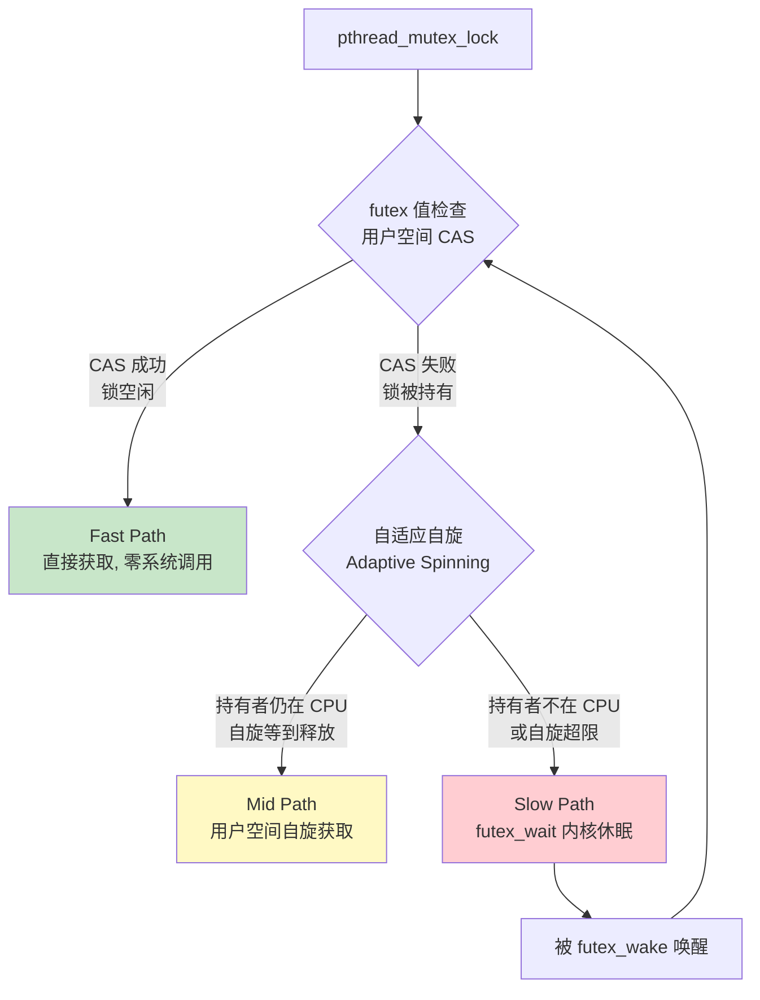
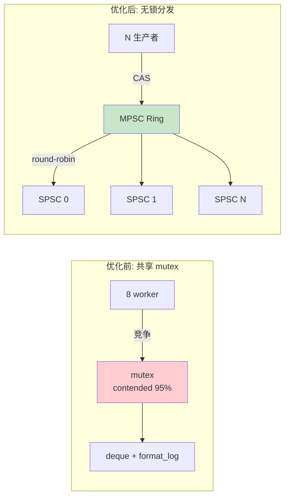

> 相关文章:
> - [嵌入式系统死锁防御: 从有序锁到无锁架构的工程实践](../deadlock_prevention/) -- 架构层面如何避免锁问题
> - [多线程死锁与优先级反转实战](../deadlock_priority_inversion_practice/) -- 死锁与优先级反转的代码级修复
> - [锁竞争基准测试: Spinlock vs Mutex vs ConcurrentQueue](../lock_contention_benchmark/) -- 三种同步策略的性能实测
> - [无锁编程核心原理](../lockfree_programming_fundamentals/) -- 从有锁迁移到无锁的理论基础
>
> 参考:
> - 原文: [perf lock 诊断锁竞争](https://blog.csdn.net/stallion5632/article/details/143665002)
> - 原文: [Linux perf 工具安装与使用](https://blog.csdn.net/stallion5632/article/details/138562957)
> - [Brendan Gregg: perf Examples](https://www.brendangregg.com/perf.html)
> - [kernel.org: Mutex design](https://www.kernel.org/doc/html/latest/locking/mutex-design.html)
> - Ulrich Drepper, "Futexes Are Tricky"

---

## 1. 为什么需要量化锁竞争

多线程程序中，锁竞争是最常见的性能杀手。但它的表现形式很隐蔽: 程序不会崩溃，CPU 使用率看起来也正常（甚至很高），只是**吞吐量不达标或延迟偏高**。

问题在于: 你无法通过肉眼阅读代码来判断锁竞争的严重程度。一把锁是否是瓶颈，取决于:

1. 有多少线程同时竞争它
2. 临界区代码执行了多久
3. 竞争发生的频率

这三个维度必须用**运行时工具量化**，而非静态分析。`perf lock` 正是做这件事的工具。

---

## 2. Linux mutex 的三条路径

在深入 perf 输出之前，需要理解 Linux `pthread_mutex_t` 底层的工作机制。glibc 的 mutex 实现基于 `futex` 系统调用，分为三条路径:



### Fast Path -- 无竞争

锁空闲时，`pthread_mutex_lock` 通过一次用户空间的 CAS（Compare-And-Swap）原子操作直接获取锁。**不进入内核、不触发系统调用**。延迟约 **10-25 ns**。

这是绝大多数锁操作应该走的路径。如果你的程序设计良好（锁粒度足够细、线程不会同时竞争同一把锁），几乎所有锁操作都走 fast path。

### Mid Path -- 自适应自旋

锁被持有时，如果持有者仍在某个 CPU 上运行（没被调度走），当前线程会在用户空间**短暂自旋**等待。理由是: 持有者很快会释放锁，自旋几微秒比进入内核休眠再唤醒更快。

glibc 的 `PTHREAD_MUTEX_ADAPTIVE_NP` 类型或内核 mutex 的 optimistic spinning 都实现了这一策略。

### Slow Path -- 内核休眠

自旋等不到锁释放时，线程调用 `futex(FUTEX_WAIT)` 陷入内核，进入休眠队列。锁释放者调用 `futex(FUTEX_WAKE)` 唤醒等待者。

这条路径涉及:
- 两次用户态/内核态切换（sleep + wake）
- 两次上下文切换（让出 CPU + 被唤醒恢复）
- 内核 futex hash bucket 的自旋锁竞争

**perf lock 追踪的就是 slow path**。`lock:contention_begin` 在线程进入等待时触发，`lock:contention_end` 在获取到锁时触发，两者之间的时间差就是 `wait time`。

### 三条路径的性能差异

| 路径 | 延迟 | CPU 开销 | perf lock 可见 |
|------|------|----------|---------------|
| Fast Path | 10-25 ns | 一次 CAS | 不可见（无竞争） |
| Mid Path | 0.1-10 us | 自旋消耗 CPU | 不可见（未进入内核） |
| Slow Path | 1-100+ us | 上下文切换 | **可见**（contention 事件） |

这意味着 `perf lock` 报告的 `contended` 次数是**保守下界** -- 实际竞争可能更多，但通过 mid path 自旋解决了，没有进入内核。

---

## 3. perf lock 基本用法

### 3.1 两种模式

| 模式 | 命令 | 原理 | 内核要求 |
|------|------|------|----------|
| tracepoint | `perf lock record` + `perf lock report` | 内核 tracepoint 事件 | `CONFIG_LOCK_STAT=y` |
| BPF | `perf lock contention -b` | eBPF 程序在内核中采集 | 5.19+, BTF 支持 |

**推荐 BPF 模式**（`-b`）: 开销更低（约 2-5%），不需要 `CONFIG_LOCK_STAT`，不生成巨大的 perf.data 文件。

### 3.2 快速扫描

```bash
# BPF 模式: 实时采集 10 秒，显示竞争最严重的 20 把锁
sudo perf lock contention -ab -E 20 -- sleep 10

# 或 attach 到运行中的进程
sudo perf lock contention -ab -E 20 -p $(pidof my_server) -- sleep 10
```

参数说明:

| 参数 | 作用 |
|------|------|
| `-a` | 系统级采集（所有 CPU） |
| `-b` | 使用 BPF 模式 |
| `-E 20` | 只显示 top 20 |
| `-p PID` | 只监控指定进程 |
| `-- sleep 10` | 采集 10 秒 |

### 3.3 传统模式

如果内核版本 < 5.19 或不支持 BPF:

```bash
# 录制
sudo perf lock record -g ./my_program

# 报告
sudo perf lock report
```

需要确认内核配置:

```bash
# 检查 tracepoint 是否存在
ls /sys/kernel/debug/tracing/events/lock/
# 应看到: contention_begin  contention_end
```

---

## 4. 报告解读

### 4.1 输出示例

```
 contended   total wait     max wait     avg wait         type   caller
     38764       4.77 s      18.5 us      1.23 us        mutex   heavy_worker+0x42
      4123      117.5 ms       4.2 us       285 ns        mutex   light_worker+0x28
        42       86.3 us       3.1 us       2.1 us     spinlock   rcu_read_lock+0x1c
```

### 4.2 字段含义

| 字段 | 含义 | 重要性 |
|------|------|--------|
| **contended** | 进入 slow path 的次数（即 futex_wait 发生的次数） | 竞争频率 |
| **total wait** | 所有竞争等待时间之和 | **最关键** -- 直接反映性能损失 |
| **max wait** | 单次最大等待时间 | 影响尾延迟（P99/P999） |
| **avg wait** | 平均每次等待时间 | 反映临界区长度 |
| **type** | 锁类型: mutex / spinlock / rwlock / rwsem | 指导优化方向 |
| **caller** | 竞争发生的代码位置 | 直接定位问题代码 |

### 4.3 如何判断严重程度

**看 total wait**，它是最直观的指标: 程序运行 30 秒，某把锁的 total wait 是 15 秒，意味着所有线程**累计浪费了 15 秒在等这把锁**。

进一步细分:

| 指标组合 | 含义 | 行动 |
|----------|------|------|
| contended 高 + avg wait 低 | 竞争频繁但每次很短 | 锁粒度可能太粗，考虑拆锁或无锁 |
| contended 低 + avg wait 高 | 竞争不频繁但每次很久 | 临界区太长，I/O 或阻塞操作在锁内 |
| contended 高 + avg wait 高 | 严重瓶颈 | 必须重新设计: 无锁队列/数据分片 |
| max wait >> avg wait | 偶发长尾 | 检查是否有优先级反转或调度抖动 |

---

## 5. 进阶: 调用栈与锁持有者分析

### 5.1 调用栈 -- 谁在等锁

```bash
# 显示竞争的调用栈 (默认 8 层)
sudo perf lock contention -ab --max-stack=16 -- sleep 10
```

输出:

```
 contended   total wait     max wait     avg wait    type   caller

     38764       4.77 s      18.5 us      1.23 us   mutex   heavy_worker+0x42
                  4.12 s                                       pthread_mutex_lock
                                                                futex_wait
                                                                do_futex
                                                                futex_wait_queue
                658.2 ms                                       pthread_mutex_lock
                                                                futex_wake
                                                                wake_up_q
```

这告诉你:

- **86% 的等待**（4.12s / 4.77s）来自 `futex_wait` -- 线程真的休眠了
- **14% 的等待**（658ms）来自 `futex_wake` -- 唤醒路径本身的竞争

`futex_wake` 路径出现竞争意味着**内核 futex hash bucket 的自旋锁也在打架** -- 这是高竞争 mutex 的二阶效应，说明竞争已经非常严重。

### 5.2 锁持有者 -- 谁在持锁

`-o` 选项（内核 6.2+）可以显示**锁的持有者**，而非等待者:

```bash
sudo perf lock contention -abo -- sleep 10
```

```
 contended   total wait     avg wait    type   caller (owner)

     38764       4.77 s      1.23 us   mutex   heavy_worker+0x15 (持有者)
                                                  compute_result+0x8a
                                                  write_log+0x22
```

这直接回答「谁在持有锁导致别人等待」。如果持有者的调用栈中出现 `write_log`、`malloc`、`read` 等操作，说明**在锁内做了不应该做的事**。

### 5.3 按锁类型过滤

```bash
# 只看 mutex 竞争
sudo perf lock contention -ab -Y mutex -- sleep 10

# 只看 spinlock 竞争
sudo perf lock contention -ab -Y spinlock -- sleep 10

# 只看 rwlock/rwsem 竞争
sudo perf lock contention -ab -Y rwsem -- sleep 10
```

不同类型竞争的典型模式:

| 类型 | 高竞争的表现 | 优化方向 |
|------|------------|----------|
| mutex | contended 高, avg wait 微秒级 | 缩短临界区 / 无锁队列 |
| spinlock | On-CPU 火焰图中 `spin_lock` 占比高 | 改 mutex（允许休眠）或无锁 |
| rwsem (读写锁) | 写端 contended 高 | 检查读写比例，考虑 RCU |

### 5.4 按线程分组

```bash
# -t 选项: 按线程分组统计
sudo perf lock contention -abt -- sleep 10
```

```
 contended   total wait     avg wait   comm            pid

     12453       1.58 s      1.27 us   worker-3       1237
     11209       1.42 s      1.27 us   worker-1       1235
     10302       1.21 s      1.17 us   worker-2       1236
      4800       560 ms      1.17 us   worker-0       1234
```

如果某个线程的 contended 远高于其他线程，说明它的代码路径比别人更频繁地触碰热锁。

---

## 6. 实战案例: 从 95% 竞争率到零锁热路径

### 6.1 背景

IPC 服务器，8 个工作线程通过共享队列分发消息，吞吐量仅为预期的 30%。

### 6.2 Step 1: perf lock 全局扫描

```bash
sudo perf lock contention -ab -E 10 -p $(pidof ipc_server) -- sleep 30
```

```
 contended   total wait     max wait     avg wait    type   caller

   7891234      16.97 s      42.3 us      2.15 us   mutex   dispatch_message+0x42
     12300       2.21 ms       4.1 us       180 ns   mutex   register_callback+0x28
       856       1.82 ms      18.7 us       2.1 us   rwsem   config_read+0x1c
```

**发现**: `dispatch_message` 的 mutex 占 total wait 的 99.9%。竞争次数 789 万次，avg wait 2.15 us。

### 6.3 Step 2: 调用栈定位

```bash
sudo perf lock contention -ab --max-stack=12 -p $(pidof ipc_server) -- sleep 10
```

```
   7891234      16.97 s      2.15 us   mutex   dispatch_message+0x42
                 14.62 s                          pthread_mutex_lock
                                                    futex_wait
                                                    futex_wait_queue
                  2.35 s                          pthread_mutex_lock
                                                    futex_wake
                                                    wake_up_q
```

`futex_wake` 路径占 14% -- 唤醒本身也在竞争，说明 futex hash bucket 拥挤。

### 6.4 Step 3: 锁持有者分析

```bash
sudo perf lock contention -abo -p $(pidof ipc_server) -- sleep 10
```

```
 contended   total wait    type   caller (owner)

   7891234      16.97 s   mutex   dispatch_message+0x15
                                    deque_push_back+0x2a
                                    format_log+0x18     <-- 在锁内写日志!
                                    snprintf+0x45
```

**根因**: `format_log` 在持有 mutex 的临界区内调用了 `snprintf` 格式化日志。`snprintf` 延迟 1-3 us，直接拉长了临界区。

### 6.5 Step 4: 修复

三层修复:

```
修复 1 (快速): 把 format_log 移到锁外
  -> contended 下降 60%, avg wait 从 2.15us 降到 0.8us

修复 2 (中期): 共享队列从 mutex + deque 改为无锁 MPSC 环形缓冲区
  -> contended 降到 0, 热路径零互斥

修复 3 (架构): 为每个 worker 分配独立 SPSC 队列
  -> 消除 worker 间竞争
```

### 6.6 验证

```bash
# 修复后再次扫描
sudo perf lock contention -ab -E 10 -p $(pidof ipc_server) -- sleep 30
```

```
 contended   total wait     max wait     avg wait    type   caller

        12       1.82 ms      18.7 us       152 us   rwsem   config_read+0x1c
         3        420 ns        180 ns       140 ns   mutex   register_callback+0x28
```

热路径的 mutex 竞争完全消失。

```
优化前: contended=7,891,234  total_wait=16.97s  吞吐=85K msg/s
优化后: contended=0          total_wait=0        吞吐=310K msg/s (3.6x)
```



---

## 7. 常见竞争模式与优化对照表

| perf lock 表现 | 根因 | 优化方案 |
|---------------|------|----------|
| contended 高 + avg wait 低（< 1us） | 锁粒度太粗，频繁短竞争 | 拆锁（per-bucket / per-CPU）或无锁 |
| contended 低 + avg wait 高（> 10us） | 临界区内有 I/O / malloc / 日志 | 移出锁外 + Collect-Release-Execute |
| contended 高 + avg wait 高 | 严重设计问题 | 无锁队列（MPSC/SPSC）彻底替代 |
| spinlock type + 高 contended | 临界区持有时间超过自旋收益 | 改用 mutex（允许休眠） |
| rwsem 写端高竞争 | 写操作频繁，读写锁退化 | 改用 mutex 或 RCU |
| max wait >> 10x avg wait | 偶发调度抖动或优先级反转 | SCHED_FIFO + CPU 隔离 + PRIO_INHERIT |
| futex_wake 路径占比 > 20% | hash bucket 竞争（二阶效应） | 竞争已极严重，必须无锁化 |

---

## 8. 补充: Off-CPU 火焰图验证

`perf lock` 给出了精确的锁竞争数值。如果需要**可视化**线程在等什么，Off-CPU 火焰图是最佳补充:

```bash
# 需要 bcc-tools
sudo offcputime-bpfcc -df -p $(pidof my_server) 30 > stacks.txt

# 生成火焰图
flamegraph.pl --color=io --title="Off-CPU" --countname=us \
    stacks.txt > offcpu.svg
```

Off-CPU 火焰图中 `futex_wait` 越宽，说明锁等待消耗的时间越多 -- 与 `perf lock` 的 `total wait` 相互印证。

---

## 9. 命令速查

```bash
# 快速扫描 top 20 锁竞争 (BPF 模式, 推荐)
sudo perf lock contention -ab -E 20 -- sleep 10

# 只看 mutex
sudo perf lock contention -ab -Y mutex -- sleep 10

# 带调用栈
sudo perf lock contention -ab --max-stack=16 -- sleep 10

# 锁持有者分析 (6.2+)
sudo perf lock contention -abo -- sleep 10

# 按线程分组
sudo perf lock contention -abt -- sleep 10

# 传统模式 (旧内核)
sudo perf lock record -g -- ./my_program
sudo perf lock report

# Off-CPU 火焰图辅助
sudo offcputime-bpfcc -df -p PID 30 > stacks.txt
flamegraph.pl --color=io --countname=us stacks.txt > offcpu.svg
```
