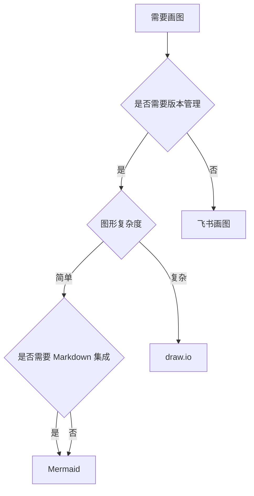

## 问题背景

技术文档中的架构图、时序图、状态机图是设计沟通的核心载体。工具选型需要平衡以下矛盾：

- 版本管理友好性 vs 视觉表现力
- 本地编辑便利性 vs 团队协作效率
- Markdown 集成度 vs 复杂图形能力
- 开源免费 vs 商业支持

本文从嵌入式系统开发团队的实际需求出发，对比主流工具的工程实践适配度。

## 工具对比矩阵

| 维度 | Mermaid | draw.io | 飞书画图 |
|------|---------|---------|----------|
| 部署模式 | 纯文本 (JS 渲染) | 桌面/Web/VSCode | 在线 SaaS |
| 收费模式 | 开源免费 | 开源免费 | 企业版收费 |
| 导出格式 | SVG/PNG (需工具链) | SVG/PNG/PDF | PNG (有水印) |
| Markdown 集成 | 原生支持 (代码块) | 需嵌入图片 | 需嵌入图片 |
| 版本管理 | Git 友好 (纯文本) | .drawio XML 可 diff | 不支持 |
| 编辑方式 | 代码 | 拖拽 | 拖拽 |
| 学习曲线 | 低 (语法简单) | 低 (所见即所得) | 低 |
| 复杂图形能力 | 弱 (受语法限制) | 强 (自由布局) | 中 |
| CI/CD 集成 | 易 (mermaid-cli) | 中 (headless 导出) | 不支持 |
| 协作能力 | 代码审查 | 本地文件共享 | 实时协作 |

## 核心差异分析

### 1. CI/CD 自动化渲染

**Mermaid 工具链集成**：

```bash
npm install -g @mermaid-js/mermaid-cli
mmdc -i docs/architecture.mmd -o docs/architecture.svg
```

**GitHub Actions 示例**：

```yaml
- name: Render Mermaid diagrams
  uses: docker://minlag/mermaid-cli:latest
  with:
    args: -i docs/architecture.mmd -o docs/architecture.svg
```

### 2. 复杂图形表现力

**Mermaid 的局限性**：

- 自动布局算法无法精细控制节点位置
- 不支持自定义图标和复杂样式
- 大型状态机图（50+ 状态）布局混乱

**适用场景**：流程图（< 20 节点）、时序图（< 10 参与者）、简单状态机（< 15 状态）

**draw.io 的优势**：自由拖拽布局、像素级对齐、丰富的图标库（AWS/Azure/网络设备）、支持多页签。

**典型案例**：嵌入式系统硬件连接图、复杂网络拓扑、高保真 UI 原型。

### 3. 团队协作模式

**代码审查驱动（Mermaid）**：图形变更通过 Pull Request 审查，评论直接关联到代码行，适合分布式团队异步协作。

**实时协作驱动（飞书画图）**：多人同时编辑，冲突自动合并，适合头脑风暴和快速原型，但无法纳入代码仓库版本管理。

**混合方案**：初期设计用飞书画图快速迭代 → 方案稳定后迁移到 draw.io 或 Mermaid → 最终版本提交到 Git 仓库。

## 选型决策树



## 实践建议

### 1. 文档工程规范

**目录结构**：

```
docs/
├── diagrams/
│   ├── src/           # draw.io 源文件
│   │   ├── architecture.drawio
│   │   └── deployment.drawio
│   ├── architecture.svg
│   ├── deployment.svg
│   └── state_machine.mmd
├── design.md          # 嵌入 Mermaid 代码块
└── README.md
```

**提交规范**：Mermaid 代码直接嵌入 Markdown；draw.io 源文件和导出文件同时提交；SVG 优先于 PNG（矢量可缩放）。

### 2. 工具链配置

**VSCode 插件推荐**：Mermaid Preview、Draw.io Integration

**Pre-commit Hook**：

```bash
#!/bin/bash
# .git/hooks/pre-commit
for mmd in $(git diff --cached --name-only --diff-filter=ACM | grep '\.mmd$'); do
    svg="${mmd%.mmd}.svg"
    mmdc -i "$mmd" -o "$svg"
    git add "$svg"
done
```

### 3. 性能优化

**Mermaid 大图优化**：拆分子图（subgraph）、使用 LR（左右布局）替代 TD（上下布局）、避免过多交叉连线。

**draw.io 文件管理**：单个文件不超过 50 个对象、使用图层（Layers）组织复杂图形、定期清理未使用的样式和连接器。

## 典型场景推荐

| 场景 | 推荐工具 | 理由 |
|------|----------|------|
| 架构设计文档 | Mermaid | Markdown 原生集成，版本管理友好 |
| 详细设计评审 | draw.io | 高保真表现，支持复杂布局 |
| API 时序图 | Mermaid | 语法简洁，自动布局 |
| 硬件连接图 | draw.io | 自定义图标，精确布局 |
| 快速原型讨论 | 飞书画图 | 实时协作，无需本地工具 |

## Mermaid 性能与限制

大型图表（超过 50 个节点）渲染性能下降明显，建议拆分为多个子图。浏览器端渲染可能导致页面卡顿，CI 渲染为 SVG 可规避此问题。复杂布局（如交叉边）的自动排版效果有限，此时 draw.io 更合适。

## 结论

**轻量级场景（80% 的日常需求）**：

- 首选 Mermaid
- 优势：零部署成本，Git 友好，Markdown 原生支持
- 限制：接受自动布局的不完美

**复杂高保真场景（20% 的关键设计）**：

- 首选 draw.io
- 优势：专业表现力，自由布局，丰富图标库
- 代价：需要额外的版本管理策略

**不推荐飞书画图用于正式文档**：无法纳入代码仓库、导出格式受限（PNG 有水印）、仅适合临时讨论和头脑风暴。

## 参考资源

- Mermaid 官方文档: https://mermaid.js.org/
- draw.io 桌面版: https://github.com/jgraph/drawio-desktop
- mermaid-cli: https://github.com/mermaid-js/mermaid-cli
