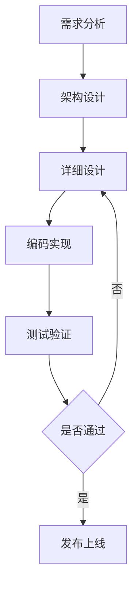
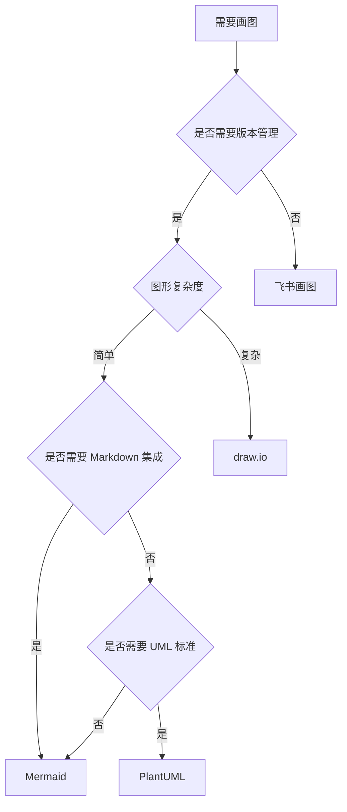
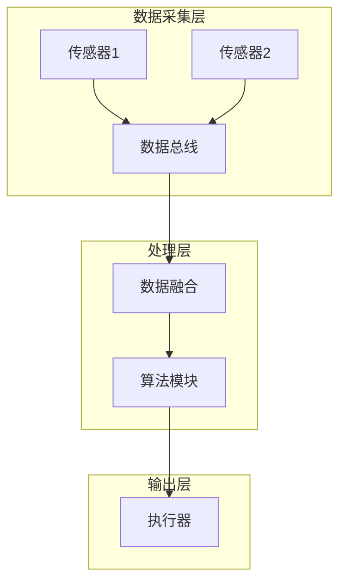
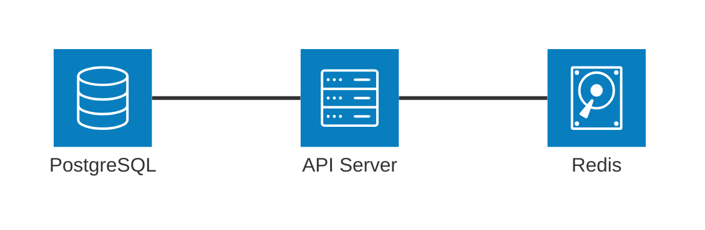

## 问题背景

技术文档中的架构图、时序图、状态机图是设计沟通的核心载体。工具选型需要平衡以下矛盾：

- 版本管理友好性 vs 视觉表现力
- 本地编辑便利性 vs 团队协作效率
- Markdown 集成度 vs 复杂图形能力
- 开源免费 vs 商业支持

本文从嵌入式系统开发团队的实际需求出发，对比主流工具的工程实践适配度。

## 工具对比矩阵

| 维度 | Mermaid | draw.io | PlantUML | 飞书画图 |
|------|---------|---------|----------|----------|
| 部署模式 | 纯文本 (JS 渲染) | 桌面/Web/VSCode | Java 运行时 | 在线 SaaS |
| 收费模式 | 开源免费 | 开源免费 | 开源免费 | 企业版收费 |
| 导出格式 | SVG/PNG (需工具链) | SVG/PNG/PDF | SVG/PNG | PNG (有水印) |
| Markdown 集成 | 原生支持 (代码块) | 需嵌入图片 | 需嵌入图片 | 需嵌入图片 |
| 版本管理 | Git 友好 (纯文本) | .drawio XML 可 diff | .puml 文本可 diff | 不支持 |
| 编辑方式 | 代码 | 拖拽 | 代码 | 拖拽 |
| 学习曲线 | 低 (语法简单) | 低 (所见即所得) | 中 (语法复杂) | 低 |
| 复杂图形能力 | 弱 (受语法限制) | 强 (自由布局) | 中 (布局算法) | 中 |
| CI/CD 集成 | 易 (mermaid-cli) | 中 (headless 导出) | 易 (plantuml.jar) | 不支持 |
| 协作能力 | 代码审查 | 本地文件共享 | 代码审查 | 实时协作 |

## 核心差异分析

### 1. 版本管理友好性

**Mermaid 和 PlantUML 的优势**：纯文本格式天然适配 Git 工作流。



上述 Mermaid 代码可直接嵌入 Markdown，Git diff 清晰展示逻辑变更：

```diff
- A[需求分析] --> B[架构设计]
+ A[需求分析] --> B[概要设计]
+ B --> B1[模块划分]
```

**draw.io 的妥协方案**：`.drawio` 文件本质是 XML，虽然可 diff，但可读性差。实践中建议：

- 关键架构图用 draw.io 绘制（视觉表现力优先）
- 导出 SVG 提交到 `docs/diagrams/` 目录
- `.drawio` 源文件单独存放在 `docs/diagrams/src/`
- Git LFS 管理二进制导出文件（PNG/PDF）

### 2. CI/CD 自动化渲染

**Mermaid 工具链集成**：

```yaml
# .github/workflows/docs.yml
- name: Render Mermaid diagrams
  run: |
    npm install -g @mermaid-js/mermaid-cli
    mmdc -i docs/architecture.mmd -o docs/architecture.svg
```

**draw.io 无头导出**：

```bash
# 使用 draw.io 桌面版的 CLI 模式
drawio --export --format svg --output docs/diagrams/ docs/diagrams/src/*.drawio
```

**PlantUML 批量渲染**：

```bash
java -jar plantuml.jar -tsvg docs/**/*.puml
```

### 3. 复杂图形表现力

**Mermaid 的局限性**：

- 自动布局算法无法精细控制节点位置
- 不支持自定义图标和复杂样式
- 大型状态机图（50+ 状态）布局混乱

**适用场景**：

- 流程图（< 20 节点）
- 时序图（< 10 参与者）
- 简单状态机（< 15 状态）

**draw.io 的优势**：

- 自由拖拽布局，像素级对齐
- 丰富的图标库（AWS/Azure/网络设备）
- 支持多页签（一个文件管理多张图）

**典型案例**：嵌入式系统硬件连接图、复杂网络拓扑、高保真 UI 原型。

### 4. 团队协作模式

**代码审查驱动（Mermaid/PlantUML）**：

- 图形变更通过 Pull Request 审查
- 评论直接关联到代码行
- 适合分布式团队异步协作

**实时协作驱动（飞书画图）**：

- 多人同时编辑，冲突自动合并
- 适合头脑风暴和快速原型
- 但无法纳入代码仓库版本管理

**混合方案**：

1. 初期设计用飞书画图快速迭代
2. 方案稳定后迁移到 draw.io 或 Mermaid
3. 最终版本提交到 Git 仓库

## 选型决策树



## 实践建议

### 1. 文档工程规范

**目录结构**：

```
docs/
├── diagrams/
│   ├── src/           # draw.io 源文件
│   │   ├── architecture.drawio
│   │   └── deployment.drawio
│   ├── architecture.svg
│   ├── deployment.svg
│   └── state_machine.mmd
├── design.md          # 嵌入 Mermaid 代码块
└── README.md
```

**提交规范**：

- Mermaid 代码直接嵌入 Markdown
- draw.io 源文件和导出文件同时提交
- SVG 优先于 PNG（矢量可缩放）

### 2. 工具链配置

**VSCode 插件推荐**：

- Mermaid Preview
- Draw.io Integration
- PlantUML

**Pre-commit Hook**：

```bash
#!/bin/bash
# .git/hooks/pre-commit
# 自动渲染 Mermaid 图并检查是否有未提交的 SVG

for mmd in $(git diff --cached --name-only --diff-filter=ACM | grep '\.mmd$'); do
    svg="${mmd%.mmd}.svg"
    mmdc -i "$mmd" -o "$svg"
    git add "$svg"
done
```

### 3. 性能优化

**Mermaid 大图优化**：

- 拆分子图（subgraph）
- 使用 LR（左右布局）替代 TD（上下布局）
- 避免过多交叉连线

**draw.io 文件管理**：

- 单个文件不超过 50 个对象
- 使用图层（Layers）组织复杂图形
- 定期清理未使用的样式和连接器

## 典型场景推荐

| 场景 | 推荐工具 | 理由 |
|------|----------|------|
| 架构设计文档 | Mermaid | Markdown 原生集成，版本管理友好 |
| 详细设计评审 | draw.io | 高保真表现，支持复杂布局 |
| API 时序图 | Mermaid | 语法简洁，自动布局 |
| 状态机设计 | PlantUML | UML 标准，支持嵌套状态 |
| 硬件连接图 | draw.io | 自定义图标，精确布局 |
| 快速原型讨论 | 飞书画图 | 实时协作，无需本地工具 |

## 迁移成本评估

**从飞书画图迁移到 draw.io**：

- 手动重绘（无自动转换工具）
- 时间成本：简单图 10 分钟，复杂图 1 小时
- 建议：仅迁移需要长期维护的核心架构图

**从 PlantUML 迁移到 Mermaid**：

- 语法相似度 60%（流程图/时序图）
- 状态机语法差异较大
- 工具辅助：编写脚本批量转换简单图形

## 结论

**轻量级场景（80% 的日常需求）**：

- 首选 Mermaid
- 优势：零部署成本，Git 友好，Markdown 原生支持
- 限制：接受自动布局的不完美

**复杂高保真场景（20% 的关键设计）**：

- 首选 draw.io
- 优势：专业表现力，自由布局，丰富图标库
- 代价：需要额外的版本管理策略

**不推荐 PlantUML**：

- 学习曲线陡峭（语法复杂）
- 布局算法不如 Mermaid 直观
- 仅在强制要求 UML 标准时使用

**不推荐飞书画图用于正式文档**：

- 无法纳入代码仓库
- 导出格式受限（PNG 有水印）
- 仅适合临时讨论和头脑风暴

## 参考资源

- Mermaid 官方文档: https://mermaid.js.org/
- draw.io 桌面版: https://github.com/jgraph/drawio-desktop
- mermaid-cli: https://github.com/mermaid-js/mermaid-cli
- PlantUML: https://plantuml.com/

## CI/CD 自动渲染实践

在持续集成流水线中自动渲染图表可以确保文档与代码同步更新，避免手动导出遗漏。

### Mermaid CLI 使用

```bash
# 安装
npm install -g @mermaid-js/mermaid-cli

# 渲染单个文件
mmdc -i diagram.mmd -o diagram.svg -t dark

# 批量渲染
find docs/ -name "*.mmd" -exec mmdc -i {} -o {}.svg \;
```

### GitHub Actions 自动渲染示例

```yaml
- name: Render Mermaid diagrams
  uses: docker://minlag/mermaid-cli:latest
  with:
    args: -i docs/architecture.mmd -o docs/architecture.svg
```

### Docker 一致性渲染

使用预配置的 Docker 镜像（包含 Playwright 和 Chrome）确保跨环境渲染一致性。避免因本地字体、浏览器版本差异导致的渲染结果不一致。

```bash
docker run --rm -v $(pwd):/data minlag/mermaid-cli \
  -i /data/docs/diagram.mmd -o /data/docs/diagram.svg
```

### 质量门禁

在 CI 中加入语法验证步骤，在发布前捕获损坏的图表：

```yaml
- name: Validate Mermaid syntax
  run: |
    for mmd in docs/**/*.mmd; do
      mmdc -i "$mmd" -o /dev/null || exit 1
    done
```

## AI 辅助图表生成

现代 AI 工具可以显著降低图表维护成本：

- AI 工具（如 GitHub Copilot、Claude）可以从代码或 YAML 文件自动生成 Mermaid 图表
- 将文档从手动维护转变为自动维护的资产
- 结合 C4 模型（Context、Container、Component、Code）组织不同层级的系统文档

**实践案例**：

```bash
# 从 OpenAPI 规范生成时序图
curl -X POST https://api.example.com/generate-diagram \
  -d @openapi.yaml -o api-sequence.mmd

# 从代码注释生成状态机图
extract-fsm src/protocol.c | ai-to-mermaid > docs/protocol-fsm.mmd
```

## Mermaid 性能与限制

### 大型图表性能

- 大型图表（超过 50 个节点）渲染性能下降明显，建议拆分为多个子图
- 浏览器端渲染可能导致页面卡顿，CI 渲染为 SVG 可规避此问题

**优化策略**：



### 复杂布局限制

复杂布局（如交叉边）的自动排版效果有限，此时 draw.io 更合适。Mermaid 的 Dagre 布局引擎无法处理以下场景：

- 多层级交叉连接
- 需要精确对齐的并行流程
- 自定义节点形状和图标

### 新特性支持

Mermaid v11.1.0+ 新增 architecture 图表类型，专为云服务和 CI/CD 部署设计：



该类型支持服务拓扑、依赖关系可视化，适合微服务架构文档。
