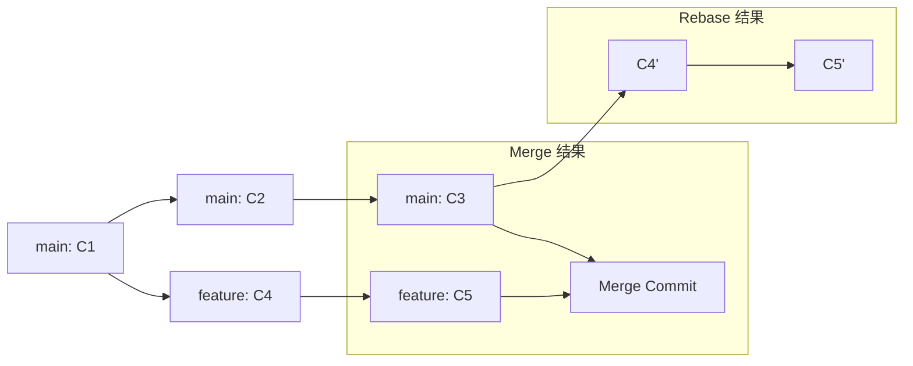

## 概述

Git 作为分布式版本控制系统，提供了丰富的分支管理和历史整理工具。本文整合了 rebase、分支操作、Gerrit 工作流、交互式历史编辑等核心技术，并深入探讨 cherry-pick、bisect、reflog、worktree 等高级特性，帮助开发者构建清晰的提交历史和高效的团队协作流程。

## 一、分支管理基础

### 1.1 分支重命名

**本地分支重命名**

```bash
# 重命名当前分支
git branch -m new_name

# 重命名指定分支
git branch -m old_name new_name
```

**远程分支同步**

```bash
# 方案 1: 删除旧分支 + 推送新分支
git push origin :old_name          # 删除远程旧分支
git push origin new_name           # 推送新分支
git push origin -u new_name        # 设置上游跟踪

# 方案 2: 强制推送（需确认无他人使用）
git push origin new_name --force-with-lease
```

**注意事项**

- 重命名前确认无未提交的更改
- 远程分支重命名需通知团队成员
- 使用 `--force-with-lease` 比 `--force` 更安全，会检查远程分支是否被他人更新

### 1.2 分支文件比较

```bash
# 比较两个分支的特定文件
git diff main..feature -- path/to/file

# 比较当前分支与远程分支
git diff origin/main -- src/

# 只显示文件名差异
git diff --name-only main..feature
```

## 二、历史整理与 Rebase

### 2.1 Rebase vs Merge



**核心区别**

| 操作 | 提交历史 | 冲突解决 | 适用场景 |
|------|---------|---------|---------|
| Merge | 保留分支结构，产生合并提交 | 一次性解决所有冲突 | 公共分支合并、保留完整历史 |
| Rebase | 线性历史，无合并提交 | 逐个提交解决冲突 | 私有分支整理、保持历史清晰 |

### 2.2 标准 Rebase 流程

```bash
# 1. 切换到目标分支
git checkout feature

# 2. 执行 rebase
git rebase main

# 3. 解决冲突（如有）
# 编辑冲突文件后
git add <resolved_files>
git rebase --continue

# 4. 推送到远程（需强制推送）
git push --force-with-lease origin feature
```

**冲突解决示例**

```bash
# 查看冲突状态
git status

# 解决冲突后标记为已解决
git add src/module.cpp

# 继续 rebase
git rebase --continue

# 如需中止 rebase
git rebase --abort
```

### 2.3 交互式 Rebase

```bash
# 编辑最近 3 个提交
git rebase -i HEAD~3

# 编辑器中可用操作：
# pick   - 保留提交
# reword - 修改提交信息
# edit   - 修改提交内容
# squash - 合并到前一个提交
# fixup  - 合并到前一个提交（丢弃提交信息）
# drop   - 删除提交
```

**实战示例：合并多个 WIP 提交**

```bash
# 原始提交历史
# abc1234 WIP: add feature
# def5678 WIP: fix bug
# ghi9012 WIP: update docs

git rebase -i HEAD~3

# 编辑器中修改为：
# pick abc1234 WIP: add feature
# squash def5678 WIP: fix bug
# squash ghi9012 WIP: update docs

# 保存后编辑合并后的提交信息
# 结果：一个清晰的提交 "feat: implement feature X"
```

### 2.4 Autosquash 工作流

```bash
# 创建修复提交（自动标记为 fixup）
git commit --fixup=abc1234

# 自动整理提交（将 fixup 提交合并到目标提交）
git rebase -i --autosquash HEAD~5

# 全局启用 autosquash
git config --global rebase.autosquash true
```

**使用场景**

- 代码审查后的小修改
- 修复前序提交的 typo
- 保持提交历史原子性

## 三、团队协作与 Gerrit 工作流

### 3.1 避免 Merge 提交的 Pull 策略

```bash
# 使用 rebase 模式拉取
git pull --rebase origin master

# 全局配置 rebase 模式
git config --global pull.rebase true

# 针对单个仓库配置
git config pull.rebase true
```

**冲突解决流程**

```bash
# 拉取时发生冲突
git pull --rebase origin master

# 解决冲突后
git add -u
git rebase --continue

# 如需跳过某个提交
git rebase --skip
```

### 3.2 Gerrit 工作流与分支覆盖

Gerrit 通过 `commit-msg` hook 为每个提交生成 Change-Id，用于跟踪同一逻辑变更的多个版本（Patch Set）。理解这个机制是正确使用 Gerrit 的前提。

**Change-Id vs Commit SHA**

| 维度 | Change-Id | Commit SHA |
|------|-----------|------------|
| 生成时机 | commit-msg hook | Git 内部 |
| 唯一性 | 逻辑变更唯一 | 提交快照唯一 |
| 可变性 | 不变（除非手动修改） | 每次 amend/rebase 都变 |
| 用途 | 跟踪同一变更的多个版本 | 标识具体提交 |

**refs/for/ vs refs/heads/**

| 命名空间 | 用途 | 结果 |
|----------|------|------|
| `refs/for/branch` | 提交到 Gerrit 评审 | 创建 Change，等待评审 |
| `refs/heads/branch` | 直接推送到分支 | 绕过评审，需管理员权限 |

**分支覆盖操作**

场景：用 branch_a 内容完全覆盖 branch_b，通过 Gerrit 评审提交。

```bash
# 1. 重置到目标分支
git checkout branch_b
git reset --hard origin/branch_b

# 2. 用源分支内容覆盖工作区
git checkout origin/branch_a -- .

# 3. 提交（手动修改 Change-Id 最后一位避免冲突）
git add .
git commit --amend

# 4. 推送到 Gerrit 评审
git push origin HEAD:refs/for/branch_b
```

**Gerrit 常见错误**

| 错误 | 原因 | 解决方案 |
|------|------|---------|
| `missing Change-Id` | 未安装 commit-msg hook | `curl -Lo .git/hooks/commit-msg <gerrit>/tools/hooks/commit-msg && chmod +x` |
| `no new changes` | Change-Id 与已有 Change 重复 | `git commit --amend` 修改 Change-Id 最后一位 |
| `no common ancestry` | 分支无共同祖先 | `git merge --allow-unrelated-histories` |

**git-review 简化推送**

```bash
pip install git-review

# 推送到 Gerrit（自动处理 refs/for/）
git review

# 下载 Change 进行本地测试
git review -d 12345
```

### 3.3 修改提交作者信息

```bash
# 修改最近一次提交的作者
git commit --amend --author="Name <email@example.com>"

# 修改历史提交的作者（交互式 rebase）
git rebase -i HEAD~3
# 将需要修改的提交标记为 edit
# 执行 git commit --amend --author="..."
# 继续 rebase: git rebase --continue

# 批量修改作者（filter-branch，慎用）
git filter-branch --env-filter '
if [ "$GIT_COMMITTER_EMAIL" = "old@example.com" ]; then
    export GIT_COMMITTER_NAME="New Name"
    export GIT_COMMITTER_EMAIL="new@example.com"
fi
' HEAD
```

## 四、高级技巧

### 4.1 Cherry-pick：选择性应用提交

**基本用法**

```bash
# 应用单个提交
git cherry-pick abc1234

# 应用提交范围（不包含 A）
git cherry-pick A..B

# 应用提交范围（包含 A）
git cherry-pick A^..B

# 应用多个不连续的提交
git cherry-pick abc1234 def5678 ghi9012
```

**冲突处理**

```bash
# 解决冲突后继续
git add <resolved_files>
git cherry-pick --continue

# 跳过当前提交
git cherry-pick --skip

# 中止 cherry-pick
git cherry-pick --abort
```

**注意事项**

- Cherry-pick 会创建新的 commit SHA，即使内容相同
- 可能导致重复提交问题（同一更改在两个分支有不同 SHA）
- 适用场景：hotfix 应用到多个版本分支、选择性合并功能

**避免重复提交的策略**

```bash
# 使用 merge 而非 cherry-pick（保留原始 SHA）
git merge --no-ff hotfix-branch

# 或使用 rebase 保持线性历史
git rebase hotfix-branch
```

### 4.2 Bisect：二分查找 Bug

**手动二分查找**

```bash
# 启动 bisect
git bisect start

# 标记当前版本为坏版本
git bisect bad

# 标记已知的好版本
git bisect good v1.0.0

# Git 自动切换到中间版本，测试后标记
git bisect good   # 或 git bisect bad

# 重复直到找到引入 bug 的提交
# 结束后重置
git bisect reset
```

**自动化 Bisect**

```bash
# 使用测试脚本自动查找
git bisect start HEAD v1.0.0
git bisect run ./test_script.sh

# test_script.sh 示例
#!/bin/bash
make clean && make
./run_tests
exit $?  # 返回 0 表示好版本，非 0 表示坏版本
```

**实战示例**

```bash
# 场景：某个提交导致单元测试失败
git bisect start
git bisect bad HEAD
git bisect good v2.1.0

# 自动运行测试
git bisect run bash -c "cmake --build build && ctest --test-dir build"

# 输出示例：
# abc1234 is the first bad commit
# commit abc1234
# Author: Developer <dev@example.com>
# Date:   Mon Feb 10 14:23:45 2026 +0800
#     refactor: optimize memory allocation
```

### 4.3 Reflog：安全网与误操作恢复

**查看操作历史**

```bash
# 查看所有引用变更
git reflog

# 查看特定分支的 reflog
git reflog show feature

# 查看最近 10 条记录
git reflog -10
```

**恢复误操作**

```bash
# 场景 1: 误删分支
git branch -D feature
git reflog  # 找到分支删除前的 SHA
git checkout -b feature abc1234

# 场景 2: 错误的 reset --hard
git reset --hard HEAD~3  # 误操作
git reflog  # 找到 reset 前的 SHA
git reset --hard HEAD@{1}

# 场景 3: 恢复被 rebase 覆盖的提交
git reflog
git cherry-pick <lost_commit_sha>
```

**Reflog 过期策略**

```bash
# 查看 reflog 配置
git config --get gc.reflogExpire        # 默认 90 天
git config --get gc.reflogExpireUnreachable  # 默认 30 天

# 手动清理 reflog
git reflog expire --expire=now --all
git gc --prune=now
```

### 4.4 Stash：临时保存工作进度

**基本操作**

```bash
# 保存当前修改
git stash

# 保存时添加描述
git stash push -m "WIP: feature X"

# 包含未跟踪文件
git stash push -u

# 查看 stash 列表
git stash list

# 应用最近的 stash（保留 stash）
git stash apply

# 应用并删除 stash
git stash pop

# 应用特定 stash
git stash apply stash@{2}

# 删除 stash
git stash drop stash@{0}

# 清空所有 stash
git stash clear
```

**高级用法**

```bash
# 只 stash 暂存区的修改
git stash push --staged

# 交互式选择要 stash 的文件
git stash push -p

# 从 stash 创建新分支
git stash branch new-feature stash@{0}
```

### 4.5 Worktree：多工作目录

**创建 Worktree**

```bash
# 创建新的工作目录并切换到新分支
git worktree add ../project-feature feature-branch

# 基于现有分支创建
git worktree add ../project-hotfix hotfix-v1.2

# 创建临时工作目录（用于测试）
git worktree add --detach ../project-test HEAD~5
```

**管理 Worktree**

```bash
# 列出所有 worktree
git worktree list

# 删除 worktree
git worktree remove ../project-feature

# 清理已删除的 worktree 记录
git worktree prune
```

**使用场景**

- 同时开发多个功能分支
- 在不同分支间快速切换测试
- 代码审查时保持当前工作不受影响
- 并行构建不同版本

**注意事项**

- 每个 worktree 共享同一个 Git 仓库（.git 目录）
- 不能在多个 worktree 中同时 checkout 同一分支
- 删除 worktree 目录后需运行 `git worktree prune`

### 4.6 子模块管理

**克隆包含子模块的仓库**

```bash
# 方案 1: 克隆时递归初始化
git clone --recurse-submodules https://github.com/user/repo.git

# 方案 2: 克隆后手动初始化
git clone https://github.com/user/repo.git
cd repo
git submodule update --init --recursive
```

**更新子模块**

```bash
# 更新到子模块仓库的最新提交
git submodule update --remote

# 更新特定子模块
git submodule update --remote path/to/submodule

# 拉取主仓库更新并同步子模块
git pull --recurse-submodules
```

**修改子模块**

```bash
# 进入子模块目录
cd path/to/submodule

# 切换到开发分支
git checkout main

# 提交修改
git add .
git commit -m "fix: update submodule"
git push

# 返回主仓库，提交子模块引用更新
cd ../..
git add path/to/submodule
git commit -m "chore: update submodule reference"
```

### 4.7 SSH 权限切换

**生成新的 SSH 密钥**

```bash
# 生成 SSH 密钥对
ssh-keygen -t ed25519 -C "your_email@example.com"

# 添加到 SSH agent
eval "$(ssh-agent -s)"
ssh-add ~/.ssh/id_ed25519

# 测试连接
ssh -T git@github.com
```

**切换远程仓库 URL**

```bash
# 查看当前远程 URL
git remote -v

# 从 HTTPS 切换到 SSH
git remote set-url origin git@github.com:user/repo.git

# 从 SSH 切换到 HTTPS
git remote set-url origin https://github.com/user/repo.git
```

## 五、常见错误与解决方案

| 错误场景 | 症状 | 解决方案 |
|---------|------|---------|
| Rebase 冲突过多 | 需要逐个提交解决冲突 | 使用 `git rebase --abort` 后改用 `git merge` |
| 强制推送覆盖他人提交 | `git push --force` 导致协作者丢失提交 | 使用 `--force-with-lease`，推送前先 `git fetch` |
| Cherry-pick 重复提交 | 同一更改在多个分支有不同 SHA | 使用 `git merge` 或 `git rebase` 保持 SHA 一致 |
| Detached HEAD 状态 | 切换到特定提交后无法提交 | `git checkout -b new-branch` 创建分支保存工作 |
| Submodule 未初始化 | 子模块目录为空 | `git submodule update --init --recursive` |
| Reflog 过期导致无法恢复 | `git reflog` 中找不到历史记录 | 默认保留 90 天，及时恢复误操作 |
| Stash 冲突 | `git stash pop` 时产生冲突 | 手动解决冲突后 `git stash drop` |
| Worktree 分支冲突 | 无法在多个 worktree 中 checkout 同一分支 | 为每个 worktree 使用不同分支 |

## 六、最佳实践

### 6.1 提交历史管理

- **原子提交**：每个提交只做一件事，便于 revert 和 cherry-pick
- **清晰的提交信息**：遵循 Conventional Commits 规范（feat/fix/docs/refactor）
- **定期 rebase**：私有分支定期 rebase 到主分支，避免大规模冲突
- **避免公共分支 rebase**：已推送到远程的公共分支不要 rebase

### 6.2 分支策略

- **主分支保护**：main/master 分支设置保护规则，禁止直接推送
- **功能分支命名**：使用 `feature/`, `bugfix/`, `hotfix/` 前缀
- **短生命周期**：功能分支尽快合并，避免长期分离
- **定期清理**：删除已合并的远程分支

### 6.3 团队协作

- **Code Review**：使用 Pull Request 或 Gerrit 进行代码审查
- **CI/CD 集成**：自动运行测试，确保提交质量
- **沟通机制**：强制推送前通知团队成员
- **文档化**：在 CONTRIBUTING.md 中说明工作流规范

**代码评审模型对比**

| 维度 | Gerrit | GitHub PR | GitLab MR |
|------|--------|-----------|-----------|
| 评审粒度 | 单个提交 | 分支级别 | 分支级别 |
| 变更跟踪 | Change-Id | PR 编号 | MR 编号 |
| 修改方式 | amend + force push | 新提交追加 | 新提交追加 |
| 历史清洁度 | 高（强制 squash） | 中（可选 squash） | 中（可选 squash） |
| 学习曲线 | 陡峭 | 平缓 | 平缓 |
| 适用场景 | 大型企业、严格评审 | 开源社区、快速迭代 | DevOps 集成 |

### 6.4 安全操作

- **备份重要分支**：执行危险操作前创建备份分支
- **使用 --force-with-lease**：替代 `--force`，避免覆盖他人提交
- **定期备份**：使用 `git bundle` 或远程仓库备份
- **熟悉 reflog**：掌握误操作恢复方法

## 七、总结

Git 的强大之处在于其灵活的历史管理能力。本文涵盖的技术点包括：

- **分支管理**：重命名、比较、切换
- **历史整理**：rebase、交互式 rebase、autosquash
- **团队协作**：pull --rebase、Gerrit 工作流、作者修改
- **高级技巧**：cherry-pick、bisect、reflog、stash、worktree、子模块

掌握这些技术需要实践和经验积累。建议在私有分支上多尝试，熟悉各种操作的效果和风险。记住：Git 的 reflog 是最后的安全网，大多数误操作都可以恢复。

**关键原则**

1. 私有分支可以随意 rebase，公共分支谨慎操作
2. 强制推送前务必确认无他人依赖
3. 保持提交历史清晰，便于代码审查和问题追溯
4. 善用工具（bisect、reflog、worktree）提升效率
5. 团队协作需要明确的工作流规范和沟通机制
