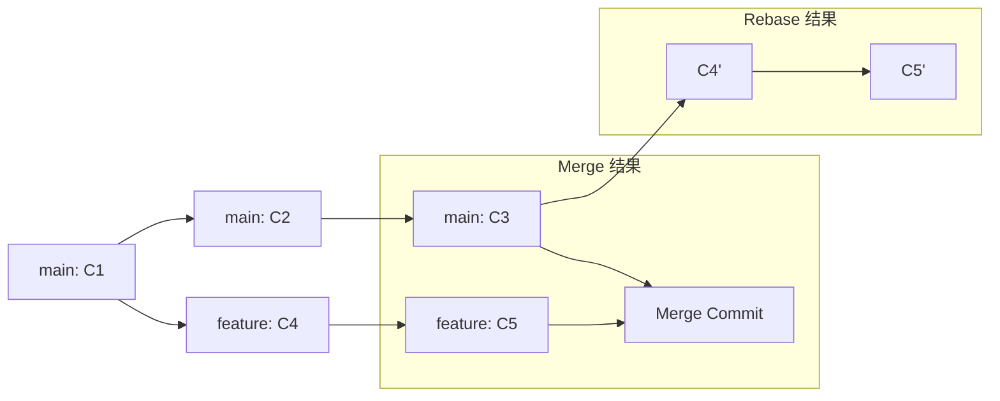

## 概述

Git 作为分布式版本控制系统，提供了丰富的分支管理和历史整理工具。本文整合了 rebase、分支操作、Gerrit 工作流、交互式历史编辑等核心技术，并深入探讨 cherry-pick、bisect、reflog、worktree 等高级特性，帮助开发者构建清晰的提交历史和高效的团队协作流程。

## 一、分支管理基础

### 1.1 分支重命名

```bash
git branch -m new_name
git branch -m old_name new_name

git push origin :old_name
git push origin -u new_name
git push origin new_name --force-with-lease
```

注意：远程分支重命名需通知团队成员，使用 `--force-with-lease` 比 `--force` 更安全。

### 1.2 分支文件比较

```bash
git diff main..feature -- path/to/file
git diff origin/main -- src/
git diff --name-only main..feature
```

## 二、历史整理与 Rebase

### 2.1 Rebase vs Merge



| 操作 | 提交历史 | 冲突解决 | 适用场景 |
|------|---------|---------|---------|
| Merge | 保留分支结构，产生合并提交 | 一次性解决所有冲突 | 公共分支合并、保留完整历史 |
| Rebase | 线性历史，无合并提交 | 逐个提交解决冲突 | 私有分支整理、保持历史清晰 |

### 2.2 标准 Rebase 流程

```bash
git checkout feature
git rebase main

git add <resolved_files>
git rebase --continue
git rebase --abort

git push --force-with-lease origin feature
```

### 2.3 交互式 Rebase

```bash
git rebase -i HEAD~3
```

编辑器中可用操作：pick（保留）、reword（修改信息）、edit（修改内容）、squash（合并）、fixup（合并且丢弃信息）、drop（删除）。

### 2.4 Autosquash 工作流

```bash
git commit --fixup=abc1234
git rebase -i --autosquash HEAD~5
git config --global rebase.autosquash true
```

## 三、团队协作与 Gerrit 工作流

### 3.1 避免 Merge 提交的 Pull 策略

```bash
git pull --rebase origin master
git config --global pull.rebase true

git add -u
git rebase --continue
git rebase --skip
```

### 3.2 Gerrit 工作流与分支覆盖

Gerrit 通过 `commit-msg` hook 为每个提交生成 Change-Id，用于跟踪同一逻辑变更的多个版本（Patch Set）。

| 维度 | Change-Id | Commit SHA |
|------|-----------|------------|
| 生成时机 | commit-msg hook | Git 内部 |
| 唯一性 | 逻辑变更唯一 | 提交快照唯一 |
| 可变性 | 不变（除非手动修改） | 每次 amend/rebase 都变 |
| 用途 | 跟踪同一变更的多个版本 | 标识具体提交 |

| 命名空间 | 用途 | 结果 |
|----------|------|------|
| `refs/for/branch` | 提交到 Gerrit 评审 | 创建 Change，等待评审 |
| `refs/heads/branch` | 直接推送到分支 | 绕过评审，需管理员权限 |

**分支覆盖操作**

```bash
git checkout branch_b
git reset --hard origin/branch_b
git checkout origin/branch_a -- .
git add .
git commit --amend
git push origin HEAD:refs/for/branch_b
```

**Gerrit 常见错误**

| 错误 | 原因 | 解决方案 |
|------|------|---------|
| `missing Change-Id` | 未安装 commit-msg hook | `curl -Lo .git/hooks/commit-msg <gerrit>/tools/hooks/commit-msg && chmod +x` |
| `no new changes` | Change-Id 与已有 Change 重复 | `git commit --amend` 修改 Change-Id 最后一位 |
| `no common ancestry` | 分支无共同祖先 | `git merge --allow-unrelated-histories` |

**git-review 简化推送**

```bash
pip install git-review
git review
git review -d 12345
```

### 3.3 修改提交作者信息

```bash
git commit --amend --author="Name <email@example.com>"

git rebase -i HEAD~3
git commit --amend --author="..."
git rebase --continue
```

## 四、高级技巧

### 4.1 Cherry-pick：选择性应用提交

```bash
git cherry-pick abc1234
git cherry-pick A..B
git cherry-pick A^..B

git add <resolved_files>
git cherry-pick --continue
git cherry-pick --abort
```

注意：Cherry-pick 会创建新的 commit SHA，可能导致重复提交问题。适用场景：hotfix 应用到多个版本分支、选择性合并功能。

### 4.2 Bisect：二分查找 Bug

```bash
git bisect start
git bisect bad
git bisect good v1.0.0
git bisect good
git bisect reset
```

**自动化 Bisect**

```bash
git bisect start HEAD v1.0.0
git bisect run ./test_script.sh
```

### 4.3 Reflog：安全网与误操作恢复

```bash
git reflog
git reflog show feature

git branch -D feature
git checkout -b feature abc1234

git reset --hard HEAD~3
git reset --hard HEAD@{1}
```

### 4.4 Stash：临时保存工作进度

```bash
git stash
git stash push -m "WIP: feature X"
git stash push -u
git stash list
git stash apply
git stash pop
git stash drop stash@{0}
git stash clear
```

### 4.5 Worktree：多工作目录

```bash
git worktree add ../project-feature feature-branch
git worktree add --detach ../project-test HEAD~5
git worktree list
git worktree remove ../project-feature
git worktree prune
```

使用场景：同时开发多个功能分支、在不同分支间快速切换测试、代码审查时保持当前工作不受影响、并行构建不同版本。

### 4.6 子模块管理

```bash
git clone --recurse-submodules https://github.com/user/repo.git
git submodule update --remote
```

### 4.7 SSH 权限切换

```bash
git remote set-url origin git@github.com:user/repo.git
git remote set-url origin https://github.com/user/repo.git
```

## 五、常见错误与解决方案

| 错误场景 | 症状 | 解决方案 |
|---------|------|---------|
| Rebase 冲突过多 | 需要逐个提交解决冲突 | 使用 `git rebase --abort` 后改用 `git merge` |
| 强制推送覆盖他人提交 | `git push --force` 导致协作者丢失提交 | 使用 `--force-with-lease`，推送前先 `git fetch` |
| Cherry-pick 重复提交 | 同一更改在多个分支有不同 SHA | 使用 `git merge` 或 `git rebase` 保持 SHA 一致 |
| Detached HEAD 状态 | 切换到特定提交后无法提交 | `git checkout -b new-branch` 创建分支保存工作 |
| Submodule 未初始化 | 子模块目录为空 | `git submodule update --init --recursive` |

## 六、最佳实践

### 6.1 提交历史管理

- 原子提交：每个提交只做一件事，便于 revert 和 cherry-pick
- 清晰的提交信息：遵循 Conventional Commits 规范（feat/fix/docs/refactor）
- 定期 rebase：私有分支定期 rebase 到主分支，避免大规模冲突
- 避免公共分支 rebase：已推送到远程的公共分支不要 rebase

### 6.2 分支策略

- 主分支保护：main/master 分支设置保护规则，禁止直接推送
- 功能分支命名：使用 `feature/`, `bugfix/`, `hotfix/` 前缀
- 短生命周期：功能分支尽快合并，避免长期分离

### 6.3 团队协作

- Code Review：使用 Pull Request 或 Gerrit 进行代码审查
- CI/CD 集成：自动运行测试，确保提交质量
- 沟通机制：强制推送前通知团队成员

| 维度 | Gerrit | GitHub PR | GitLab MR |
|------|--------|-----------|-----------|
| 评审粒度 | 单个提交 | 分支级别 | 分支级别 |
| 变更跟踪 | Change-Id | PR 编号 | MR 编号 |
| 修改方式 | amend + force push | 新提交追加 | 新提交追加 |
| 历史清洁度 | 高（强制 squash） | 中（可选 squash） | 中（可选 squash） |
| 学习曲线 | 陡峭 | 平缓 | 平缓 |
| 适用场景 | 大型企业、严格评审 | 开源社区、快速迭代 | DevOps 集成 |

### 6.4 安全操作

- 备份重要分支：执行危险操作前创建备份分支
- 使用 --force-with-lease：替代 `--force`，避免覆盖他人提交
- 熟悉 reflog：掌握误操作恢复方法

**关键原则**

1. 私有分支可以随意 rebase，公共分支谨慎操作
2. 强制推送前务必确认无他人依赖
3. 保持提交历史清晰，便于代码审查和问题追溯
4. 善用工具（bisect、reflog、worktree）提升效率
5. 团队协作需要明确的工作流规范和沟通机制
