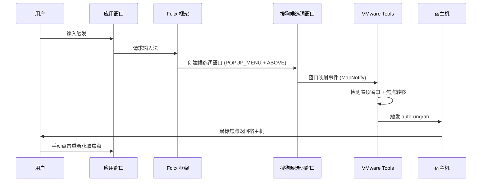

## 问题现象

在 VMware Workstation/Player 虚拟机（Ubuntu 22.04）中使用搜狗输入法时，候选词窗口弹出瞬间鼠标焦点跳回宿主机，需手动点击虚拟机窗口重新获取焦点。该问题在 Wayland 会话下尤为明显，严重影响输入体验。

## 根本原因分析

### VMware 鼠标抓取机制

VMware 通过 `motionGrab` 和 `motionUngrab` 机制管理虚拟机与宿主机之间的鼠标控制权：

1. **Grab 阶段**：鼠标进入虚拟机窗口后，VMware Tools 捕获鼠标事件，将宿主机鼠标坐标映射到虚拟机坐标系
2. **Ungrab 触发条件**：
   - 用户按下 `Ctrl+Alt` 组合键
   - 检测到虚拟机内窗口焦点异常切换（如全屏应用、置顶窗口）
   - 虚拟机内弹出系统级对话框（权限提示、通知）

搜狗输入法候选词窗口触发 ungrab 的关键因素：

- **置顶属性**：候选词窗口设置 `_NET_WM_STATE_ABOVE` 属性，覆盖在所有窗口之上
- **窗口类型**：Fcitx 将候选词窗口标记为 `_NET_WM_WINDOW_TYPE_POPUP_MENU`，VMware Tools 误判为系统级弹窗
- **焦点转移**：候选词窗口短暂获取输入焦点（用于处理数字键选词），触发 VMware 的 auto-ungrab 保护机制



### Fcitx 框架特性

Fcitx（Flexible Input Method Framework）是 Linux 下主流输入法框架，搜狗输入法基于 Fcitx4 构建：

| 特性 | Fcitx4 | Fcitx5 | IBus |
|------|--------|--------|------|
| 候选词窗口实现 | 独立 X11 窗口 (置顶) | Wayland subsurface / X11 窗口 | GTK/Qt 嵌入式组件 |
| 窗口管理器交互 | 直接操作 X11 属性 | 通过 Wayland 协议 | 依赖工具包事件循环 |
| 焦点管理 | 主动抢占输入焦点 | 协议协商焦点 | 被动接收焦点 |
| VMware 兼容性 | 差（触发 ungrab） | 中等（Wayland 下改善） | 好（无置顶窗口） |

搜狗输入法的候选词窗口通过 `XSetWindowAttributes` 设置 `override_redirect = True`，绕过窗口管理器直接控制窗口位置和层级，这种激进策略在物理机上提升响应速度，但在虚拟化环境中与 VMware 的窗口监控逻辑冲突。

### Wayland vs X11 协议差异

| 维度 | X11 | Wayland |
|------|-----|---------|
| 窗口层级控制 | 客户端可直接设置 `_NET_WM_STATE_ABOVE` | 由 compositor 统一管理，客户端无法强制置顶 |
| 焦点管理 | 客户端可通过 `XSetInputFocus` 抢占焦点 | 焦点由 compositor 分配，客户端只能请求 |
| 输入法协议 | XIM / Fcitx 自定义协议 | `zwp_input_method_v2` 标准协议 |
| VMware Tools 集成 | 完整支持（直接监听 X11 事件） | 部分支持（依赖 XWayland 桥接） |

在 Wayland 会话下，搜狗输入法通过 XWayland 运行，候选词窗口的置顶请求需经过 Wayland compositor 转换，增加了与 VMware Tools 的交互复杂度。X11 会话下 VMware Tools 可直接监听窗口事件，误判概率反而降低。

## 解决方案（按优先级排序）

### 方案 1：禁用 VMware 自动释放机制（推荐）

修改 VMware 配置文件，禁用 auto-ungrab 功能：

**步骤 1**：编辑全局配置（所有虚拟机生效）

```bash
# VMware Workstation
sudo vim /etc/vmware/config

# VMware Player
sudo vim ~/.vmware/preferences
```

添加以下配置：

```ini
pref.motionGrab = "FALSE"
pref.motionUngrab = "FALSE"
```

**步骤 2**：编辑虚拟机配置（单个虚拟机生效）

```bash
# 关闭虚拟机后编辑 .vmx 文件
vim ~/vmware/Ubuntu22.04/Ubuntu22.04.vmx
```

添加以下配置：

```vmx
mks.gamingMouse.policy = "gaming"
mks.gamingMouse.ungrabOnEscape = "FALSE"
```

**配置说明**：

- `motionGrab/motionUngrab`：控制鼠标抓取/释放行为
- `gamingMouse.policy`：启用游戏模式，减少自动释放触发
- `ungrabOnEscape`：禁用 ESC 键释放（可选，避免误触）

**适用场景**：

- 虚拟机主要用于开发，不需要频繁切换宿主机
- 可接受通过 `Ctrl+Alt` 手动释放鼠标

### 方案 2：切换到 X11 会话

在登录界面选择 "Ubuntu on Xorg" 会话：

```bash
# 查看当前会话类型
echo $XDG_SESSION_TYPE

# 安装 X11 会话（如未安装）
sudo apt install xorg

# 注销后在登录界面右下角选择 "Ubuntu on Xorg"
```

**原理**：X11 下 VMware Tools 对窗口事件的监听更精确，搜狗候选词窗口的置顶行为不会触发误判。

**权衡**：

- 优点：无需修改配置，兼容性最好
- 缺点：放弃 Wayland 的安全性和性能优势（HiDPI、触摸手势）

### 方案 3：隐藏搜狗状态栏

搜狗状态栏也是置顶窗口，隐藏后可减少触发概率：

```bash
# 右键搜狗状态栏 -> 设置 -> 外观
# 取消勾选 "显示状态栏"
```

**局限性**：仅减少触发频率，无法根治候选词窗口问题。

### 方案 4：替换输入法框架（激进方案）

迁移到 Fcitx5 或 IBus：

```bash
# 安装 Fcitx5 + 搜狗词库
sudo apt install fcitx5 fcitx5-chinese-addons

# 或安装 IBus + 智能拼音
sudo apt install ibus ibus-libpinyin

# 设置默认输入法框架
im-config -n fcitx5  # 或 ibus
```

**Fcitx5 优势**：

- Wayland 原生支持，候选词窗口通过 `layer-shell` 协议实现
- 不使用 `override_redirect`，与窗口管理器协作更好

**IBus 优势**：

- 候选词窗口嵌入应用进程，无独立置顶窗口
- GNOME 默认集成，兼容性最佳

**权衡**：需重新配置词库和快捷键，学习成本较高。

## VMware Workstation vs Player 配置差异

| 配置项 | Workstation | Player |
|--------|-------------|--------|
| 全局配置路径 | `/etc/vmware/config` | `~/.vmware/preferences` |
| 虚拟机配置 | `.vmx` 文件（两者相同） | `.vmx` 文件（两者相同） |
| 高级选项 UI | 提供图形界面配置 | 需手动编辑配置文件 |
| `gamingMouse` 支持 | 完整支持 | 部分版本不支持（需验证） |

Player 用户若 `gamingMouse` 配置无效，优先使用方案 2（切换 X11）。

## 排查优先级建议

1. **快速验证**（5 分钟）：切换到 X11 会话，确认问题是否消失
2. **永久修复**（10 分钟）：编辑 `.vmx` 添加 `gamingMouse` 配置
3. **全局生效**（15 分钟）：修改 `/etc/vmware/config` 或 `~/.vmware/preferences`
4. **终极方案**（1 小时）：迁移到 Fcitx5 或 IBus

## 验证方法

```bash
# 1. 检查当前会话类型
echo $XDG_SESSION_TYPE

# 2. 监控窗口事件（X11）
xprop -spy -root _NET_ACTIVE_WINDOW

# 3. 查看 VMware Tools 日志
tail -f /var/log/vmware-vmsvc.log

# 4. 测试输入法
# 打开文本编辑器，输入中文，观察候选词窗口弹出时焦点是否跳转
```

## 参考资料

- [VMware KB: Mouse and Keyboard Release Behavior](https://kb.vmware.com/s/article/1033)
- [Fcitx Wiki: Wayland Support](https://fcitx-im.org/wiki/Wayland)
- [freedesktop.org: Input Method Protocol](https://wayland.app/protocols/input-method-unstable-v2)

## 其他虚拟化平台的类似问题

- VirtualBox：Guest Additions 的鼠标集成也存在类似焦点问题，可通过 Host Key (Right Ctrl) 手动切换
- QEMU/KVM + virt-manager：使用 SPICE 协议时焦点管理更稳定，但需要安装 spice-vdagent
- Hyper-V：Enhanced Session Mode 下输入法兼容性较好，但仅支持 RDP 协议

## 长期解决方案

- 考虑迁移到 Fcitx5 + Rime 输入方案，避免搜狗输入法的闭源组件带来的兼容性问题
- 如果主要用途是开发，建议使用 VS Code Remote-SSH 替代虚拟机内直接开发，从根本上避免焦点问题
- 对于必须在虚拟机内使用 GUI 的场景，优先选择 X11 + Fcitx5 的组合
