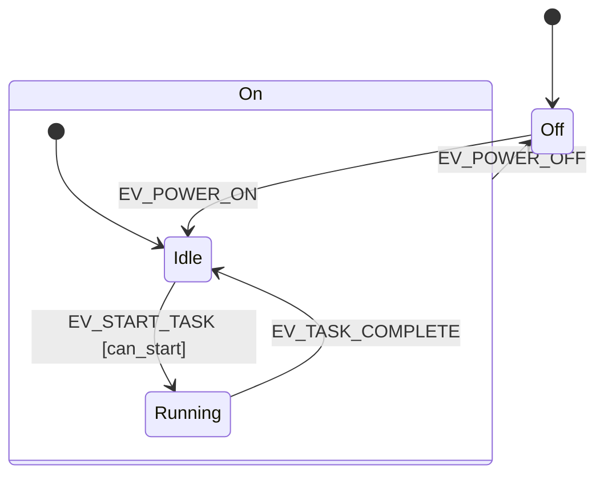

> 相关文章:
> - [QPC 框架深度解析: Active Object 模型与层次状态机](../qpc_active_object_hsm/) -- QP/C 的 HSM 双实现策略 (QHsm/QMsm)
> - [newosp 深度解析: C++17 事件驱动架构](../newosp_event_driven_architecture/) -- C++17 模板化 HSM 的现代实现
> - [行为树 Tick 机制深度解析](../behavior_tree_tick_mechanism/) -- BT 与 HSM 互补的架构实践

状态机是嵌入式系统中最常用的设计模式之一。但随着状态数量增长和层级嵌套加深，传统的 switch-case 实现会变得难以维护。本文以 [state_machine](https://gitee.com/liudegui/state_machine) 框架为例，展示如何将过程驱动的状态机改造为数据驱动的层次状态机 (HSM)。

原始版本来自 [misje/stateMachine](https://github.com/misje/stateMachine)，RT-Thread 社区有一个维护版本。本文基于对两者的重构，重点在于**数据驱动设计**和 **MISRA C:2012 合规**。

## 1. 过程驱动 vs 数据驱动

### 1.1 过程驱动的问题

传统 switch-case 状态机将事件处理逻辑分散在各个 handler 中:

```c
// 过程驱动: 逻辑分散，修改一个状态需要读懂整个 handler
void state_idle_handler(sm_t *sm, event_t evt) {
    switch (evt) {
        case EVT_START:
            if (can_start()) {          // guard 混在逻辑中
                do_prepare();           // action 混在逻辑中
                sm->state = STATE_RUNNING;
                running_entry(sm);      // 手动调用 entry
            }
            break;
        case EVT_POWER_OFF:
            idle_exit(sm);              // 手动调用 exit
            sm->state = STATE_OFF;
            break;
        // ... 每个事件一个 case
    }
}
```

问题清单:

| 问题 | 影响 |
|------|------|
| 转换逻辑分散在每个 handler 中 | 无法一眼看出完整的状态转换图 |
| entry/exit 需要手动调用 | 遗漏导致资源泄漏或状态不一致 |
| guard 条件嵌入 if-else | 复用困难，测试困难 |
| 新增状态需修改多处 handler | 维护成本随状态数线性增长 |
| 无层级支持 | 公共事件处理需要每个状态重复实现 |

### 1.2 数据驱动的设计

数据驱动的核心思想: **用数据 (转换表) 描述状态机行为，用通用引擎执行转换逻辑**。

```c
// 数据驱动: 转换表集中描述所有规则
const SM_Transition T_Idle[] = {
    // 事件          目标状态        守卫           动作          类型
    {EV_START_TASK, &STATE_Running, can_start_task, NULL,         SM_TRANSITION_EXTERNAL},
    {EV_POWER_OFF,  &STATE_Off,     NULL,           on_power_off, SM_TRANSITION_EXTERNAL},
};

static const SM_State STATE_Idle = {
    .parent         = &STATE_On,     // 父状态
    .entryAction    = entry_Idle,    // 入口动作
    .exitAction     = NULL,          // 出口动作
    .transitions    = T_Idle,        // 转换表
    .numTransitions = 2,
    .name           = "Idle"
};
```

开发者只需填写转换表，`SM_Dispatch()` 统一查表执行。entry/exit 动作由引擎自动调用，不会遗漏。

## 2. 框架数据结构

### 2.1 事件

```c
struct SM_Event {
    uint32_t  id;       // 事件标识
    void     *context;  // 事件附带数据 (可选)
};
```

### 2.2 转换规则

```c
typedef enum {
    SM_TRANSITION_EXTERNAL,  // 外部转换: 执行 exit/entry
    SM_TRANSITION_INTERNAL   // 内部转换: 仅执行 action，不变状态
} SM_TransitionType;

struct SM_Transition {
    uint32_t          eventId;  // 触发事件
    const SM_State   *target;   // 目标状态 (内部转换时忽略)
    SM_GuardFn        guard;    // 守卫条件 (NULL = 无条件)
    SM_ActionFn       action;   // 转换动作 (NULL = 无动作)
    SM_TransitionType type;     // 转换类型
};
```

外部转换与内部转换的区别:

| 转换类型 | exit 动作 | action | entry 动作 | 状态变化 |
|---------|----------|--------|-----------|---------|
| EXTERNAL | 执行 | 执行 | 执行 | 变化 |
| INTERNAL | 不执行 | 执行 | 不执行 | 不变 |

内部转换适合"在当前状态下执行某个动作但不离开"的场景，如更新计数器、记录日志。

### 2.3 状态

```c
struct SM_State {
    const SM_State      *parent;         // 父状态 (NULL = 顶层)
    SM_ActionFn          entryAction;    // 入口动作
    SM_ActionFn          exitAction;     // 出口动作
    const SM_Transition *transitions;    // 转换表
    size_t               numTransitions; // 转换数量
    const char          *name;           // 调试名称
};
```

`parent` 指针构成层级树。子状态未处理的事件会**冒泡**到父状态。

### 2.4 状态机实例

```c
struct SM_StateMachine {
    const SM_State  *currentState;       // 当前活动状态
    const SM_State  *initialState;       // 初始状态 (用于 Reset)
    void            *userData;           // 用户数据指针
    SM_ActionFn      unhandledEventHook; // 未处理事件钩子
    const SM_State **entryPathBuffer;    // 用户提供的路径缓冲区
    uint8_t          bufferSize;         // 缓冲区大小
};
```

`entryPathBuffer` 由用户提供而非内部 malloc，这是嵌入式友好的关键设计 (见第 4 节)。

## 3. 核心算法: LCA 与事件分发

### 3.1 事件分发: 查表 + 冒泡

`SM_Dispatch()` 的核心逻辑:

```c
bool SM_Dispatch(SM_StateMachine *sm, const SM_Event *event) {
    bool is_handled = false;
    const SM_State *state_iter = sm->currentState;

    // 从当前状态开始，逐级向上查找能处理该事件的状态
    while ((state_iter != NULL) && (!is_handled)) {
        for (size_t i = 0; i < state_iter->numTransitions; ++i) {
            const SM_Transition *t = &state_iter->transitions[i];
            if (t->eventId == event->id) {
                // 检查守卫条件
                bool guard_passed = (t->guard == NULL) || t->guard(sm, event);
                if (guard_passed) {
                    if (t->action != NULL) { t->action(sm, event); }
                    if (t->type == SM_TRANSITION_EXTERNAL) {
                        perform_transition(sm, t->target, event);
                    }
                    is_handled = true;
                    break;
                }
            }
        }
        if (!is_handled) {
            state_iter = state_iter->parent;  // 冒泡到父状态
        }
    }

    if (!is_handled && (sm->unhandledEventHook != NULL)) {
        sm->unhandledEventHook(sm, event);
    }
    return is_handled;
}
```

事件冒泡机制使得公共事件只需在父状态中处理一次。例如 `EV_POWER_OFF` 定义在 `STATE_On` 的转换表中，其子状态 `Idle` 和 `Running` 无需重复定义。

### 3.2 LCA 算法: O(N) 最低共同祖先

层次状态机的转换需要找到源状态和目标状态的**最低共同祖先 (LCA)**，以确定需要执行哪些 exit/entry 动作。

```c
static const SM_State *find_lca(const SM_State *s1, const SM_State *s2) {
    if ((s1 == NULL) || (s2 == NULL)) { return NULL; }

    const SM_State *p1 = s1;
    const SM_State *p2 = s2;
    uint8_t depth1 = get_state_depth(p1);
    uint8_t depth2 = get_state_depth(p2);

    // 对齐到相同深度
    while (depth1 > depth2) { p1 = p1->parent; depth1--; }
    while (depth2 > depth1) { p2 = p2->parent; depth2--; }

    // 同步上移直到相遇
    while (p1 != p2) { p1 = p1->parent; p2 = p2->parent; }

    return p1;
}
```

这是经典的"双指针对齐"LCA 算法，时间复杂度 O(N)，N 为最大层级深度。无递归，栈安全。

### 3.3 转换执行

找到 LCA 后，转换执行分三步:

```c
static void perform_transition(SM_StateMachine *sm,
                                const SM_State *target,
                                const SM_Event *event) {
    const SM_State *source = sm->currentState;
    const SM_State *lca = find_lca(source, target);

    // Step 1: 从源状态向上执行 exit，直到 LCA
    const SM_State *exit_iter = source;
    while ((exit_iter != NULL) && (exit_iter != lca)) {
        if (exit_iter->exitAction != NULL) {
            exit_iter->exitAction(sm, event);
        }
        exit_iter = exit_iter->parent;
    }

    // Step 2: 记录从 LCA 到目标状态的 entry 路径 (逆序)
    uint8_t path_idx = 0;
    const SM_State *entry_iter = target;
    while ((entry_iter != NULL) && (entry_iter != lca)) {
        sm->entryPathBuffer[path_idx++] = entry_iter;
        entry_iter = entry_iter->parent;
    }

    // Step 3: 更新当前状态，正序执行 entry
    sm->currentState = target;
    for (int8_t i = (int8_t)path_idx - 1; i >= 0; --i) {
        if (sm->entryPathBuffer[i]->entryAction != NULL) {
            sm->entryPathBuffer[i]->entryAction(sm, event);
        }
    }
}
```

以从 `Running` 转换到 `Off` 为例:

```
状态树:         转换路径:
    [root]
    /    \
  On      Off     1. exit Running
  / \             2. exit On
Idle Running      3. entry Off
```

LCA 为 root (NULL)，exit 路径: Running -> On，entry 路径: Off。

## 4. 重构改进点

### 4.1 消除递归

原始版本的 entry 动作通过递归调用实现 (从 LCA 递归到目标状态)。在深层级嵌套时存在栈溢出风险。

重构方案: 用 `entryPathBuffer` 数组记录 entry 路径，然后**迭代**执行:

```c
// 先记录路径 (逆序): target -> ... -> LCA 的下一级
// 再反向遍历执行 entry (正序): LCA 的下一级 -> ... -> target
for (int8_t i = (int8_t)path_idx - 1; i >= 0; --i) {
    if (sm->entryPathBuffer[i]->entryAction != NULL) {
        sm->entryPathBuffer[i]->entryAction(sm, event);
    }
}
```

### 4.2 用户提供缓冲区

`entryPathBuffer` 由用户在栈上分配并传入，而非框架内部 malloc:

```c
#define MAX_STATE_DEPTH 8
const SM_State *path_buffer[MAX_STATE_DEPTH];

SM_Init(&sm, &STATE_Off, path_buffer, MAX_STATE_DEPTH, &app_data, NULL);
```

优势:

- 零堆分配，适合禁止 malloc 的嵌入式环境
- 缓冲区大小由用户根据实际层级深度决定
- `SM_ASSERT(path_idx < sm->bufferSize)` 在运行时检测溢出

### 4.3 外部/内部转换区分

原始版本不区分外部和内部转换。重构后通过 `SM_TransitionType` 显式区分:

```c
// 外部转换: 退出当前状态，进入目标状态 (即使目标是自己)
{EV_RESET, &STATE_Idle, NULL, on_reset, SM_TRANSITION_EXTERNAL}

// 内部转换: 仅执行 action，不触发 exit/entry
{EV_HEARTBEAT, NULL, NULL, update_counter, SM_TRANSITION_INTERNAL}
```

外部自转换 (`source == target`) 会执行 exit 再 entry，适合需要"重新初始化当前状态"的场景。

### 4.4 守卫条件

转换表支持 `guard` 函数指针，返回 `true` 时转换才会执行:

```c
bool can_start_task(SM_StateMachine *sm, const SM_Event *event) {
    AppData *data = (AppData *)sm->userData;
    return data->tasks_completed < 3;
}

const SM_Transition T_Idle[] = {
    {EV_START_TASK, &STATE_Running, can_start_task, NULL, SM_TRANSITION_EXTERNAL},
};
```

守卫条件将"是否可以转换"的判断从 handler 逻辑中剥离出来，成为独立的、可测试的函数。

### 4.5 MISRA C:2012 合规

- 单一返回点: 所有函数通过局部变量累积结果，在函数末尾统一返回
- 无递归: entry 路径用迭代实现
- 显式类型: `uint8_t`, `uint32_t`, `size_t`
- 断言检查: 入参通过 `SM_ASSERT()` 验证
- 可配置宏: `SM_ASSERT` 和 `SM_LOG_DEBUG` 可映射到用户平台

## 5. 使用示例

### 5.1 设备电源管理

一个典型的层次状态机: `Off` 和 `On` 为顶层状态，`Idle` 和 `Running` 为 `On` 的子状态。



完整实现:

```c
#include "state_machine.h"
#include <stdio.h>

// 事件定义
enum { EV_POWER_ON, EV_START_TASK, EV_TASK_COMPLETE, EV_POWER_OFF };

// 用户数据
typedef struct { int tasks_completed; } AppData;

// 状态前向声明
static const SM_State STATE_Off, STATE_On, STATE_Idle, STATE_Running;

// 动作函数
void entry_On(SM_StateMachine *sm, const SM_Event *e)  { printf("  Entry -> On\n"); }
void exit_On(SM_StateMachine *sm, const SM_Event *e)   { printf("  Exit  -> On\n"); }
void entry_Idle(SM_StateMachine *sm, const SM_Event *e){ printf("    Entry -> Idle\n"); }
void entry_Running(SM_StateMachine *sm, const SM_Event *e) {
    printf("    Entry -> Running\n");
}
void exit_Running(SM_StateMachine *sm, const SM_Event *e) {
    printf("    Exit  -> Running\n");
}
void on_power_off(SM_StateMachine *sm, const SM_Event *e) {
    printf("  Action: Shutting down\n");
}
void on_task_done(SM_StateMachine *sm, const SM_Event *e) {
    AppData *d = (AppData *)sm->userData;
    d->tasks_completed++;
    printf("  Action: Task done. Total: %d\n", d->tasks_completed);
}

// 守卫函数
bool can_start_task(SM_StateMachine *sm, const SM_Event *e) {
    AppData *d = (AppData *)sm->userData;
    return d->tasks_completed < 3;
}

// 转换表
const SM_Transition T_Off[] = {
    {EV_POWER_ON, &STATE_Idle, NULL, NULL, SM_TRANSITION_EXTERNAL}
};
const SM_Transition T_On[] = {
    {EV_POWER_OFF, &STATE_Off, NULL, on_power_off, SM_TRANSITION_EXTERNAL}
};
const SM_Transition T_Idle[] = {
    {EV_START_TASK, &STATE_Running, can_start_task, NULL, SM_TRANSITION_EXTERNAL}
};
const SM_Transition T_Running[] = {
    {EV_TASK_COMPLETE, &STATE_Idle, NULL, on_task_done, SM_TRANSITION_EXTERNAL}
};

// 状态定义
static const SM_State STATE_Off = {
    NULL, NULL, NULL, T_Off, 1, "Off"
};
static const SM_State STATE_On = {
    NULL, entry_On, exit_On, T_On, 1, "On"
};
static const SM_State STATE_Idle = {
    &STATE_On, entry_Idle, NULL, T_Idle, 1, "Idle"
};
static const SM_State STATE_Running = {
    &STATE_On, entry_Running, exit_Running, T_Running, 1, "Running"
};

int main(void) {
    SM_StateMachine sm;
    AppData data = {0};
    const SM_State *path[8];

    SM_Init(&sm, &STATE_Off, path, 8, &data, NULL);
    printf("State: %s\n", SM_GetCurrentStateName(&sm));

    SM_Event ev;

    // Power on -> enters On, then Idle
    ev = (SM_Event){EV_POWER_ON, NULL};
    SM_Dispatch(&sm, &ev);
    printf("State: %s, In On? %s\n",
           SM_GetCurrentStateName(&sm),
           SM_IsInState(&sm, &STATE_On) ? "Yes" : "No");

    // Start task -> Idle to Running (guard: tasks < 3)
    ev = (SM_Event){EV_START_TASK, NULL};
    SM_Dispatch(&sm, &ev);
    printf("State: %s\n", SM_GetCurrentStateName(&sm));

    // Task complete -> Running to Idle
    ev = (SM_Event){EV_TASK_COMPLETE, NULL};
    SM_Dispatch(&sm, &ev);
    printf("State: %s\n", SM_GetCurrentStateName(&sm));

    // Power off -> exits On, enters Off (handled by parent state On)
    ev = (SM_Event){EV_POWER_OFF, NULL};
    SM_Dispatch(&sm, &ev);
    printf("State: %s\n", SM_GetCurrentStateName(&sm));

    return 0;
}
```

输出:

```
State: Off
  Entry -> On
    Entry -> Idle
State: Idle, In On? Yes
    Entry -> Running
State: Running
    Exit  -> Running
    Entry -> Idle
State: Idle
  Action: Shutting down
  Exit  -> On
State: Off
```

注意第 5 行: `EV_POWER_OFF` 在 `Idle` 的转换表中不存在，但通过冒泡机制由父状态 `On` 处理。退出路径依次执行 `exit_On`，无需在 `Idle` 中重复定义。

### 5.2 与 RT-Thread 集成

在 RTOS 环境中，状态机通常运行在独立线程中，通过消息队列接收事件:

```c
static void sm_thread_entry(void *param) {
    SM_Init(&sm, &STATE_Off, path_buffer, MAX_STATE_DEPTH, &app_data, NULL);

    while (1) {
        SM_Event event;
        rt_err_t ret = rt_mq_recv(sm_mq, &event, sizeof(SM_Event),
                                   RT_WAITING_FOREVER);
        if (ret == RT_EOK) {
            SM_Dispatch(&sm, &event);
        }
    }
}

// 任意线程/ISR 中投递事件
rt_err_t post_event(uint32_t id, void *ctx) {
    SM_Event ev = {id, ctx};
    return rt_mq_send(sm_mq, &ev, sizeof(SM_Event));
}
```

消息队列实现了事件生产者和状态机引擎的解耦。ISR 中产生的事件通过 `rt_mq_send()` 投递，状态机线程在安全的上下文中处理。

## 6. 前后对比

| 维度 | 原始版本 (过程驱动) | 重构版本 (数据驱动) |
|------|-------------------|-------------------|
| 事件处理 | switch-case 分散在 handler 中 | 转换表集中描述 |
| entry/exit | 手动调用，容易遗漏 | 引擎自动执行 |
| guard 条件 | 嵌入 if-else | 独立函数指针 |
| 转换类型 | 不区分 | 外部/内部显式区分 |
| LCA 算法 | 递归实现 | 迭代实现，O(N) |
| 内存分配 | 内部分配 | 用户提供缓冲区，零堆分配 |
| 代码规范 | 无 | MISRA C:2012 |
| 未处理事件 | 静默忽略 | unhandledEventHook 回调 |

## 7. 适用场景

- **设备生命周期管理**: 电源状态 (Off/Standby/Active)、初始化序列
- **通信协议栈**: 连接状态 (Disconnected/Connecting/Connected/Error)
- **业务流程**: 订单状态、审批流程
- **需要层级抽象的场合**: 用父状态封装公共行为，子状态只关注差异

不适合:

- 状态极少 (2-3 个) 且无层级需求 -- switch-case 更直接
- 需要并发状态 (正交区域) -- 本框架不支持

## 8. 项目信息

- 仓库: [Gitee](https://gitee.com/liudegui/state_machine)
- 原始作者: [misje/stateMachine](https://github.com/misje/stateMachine)
- RT-Thread 社区版本: [RT-Thread-Mirror/state_machine](https://gitee.com/RT-Thread-Mirror/state_machine)
- 许可证: MIT
