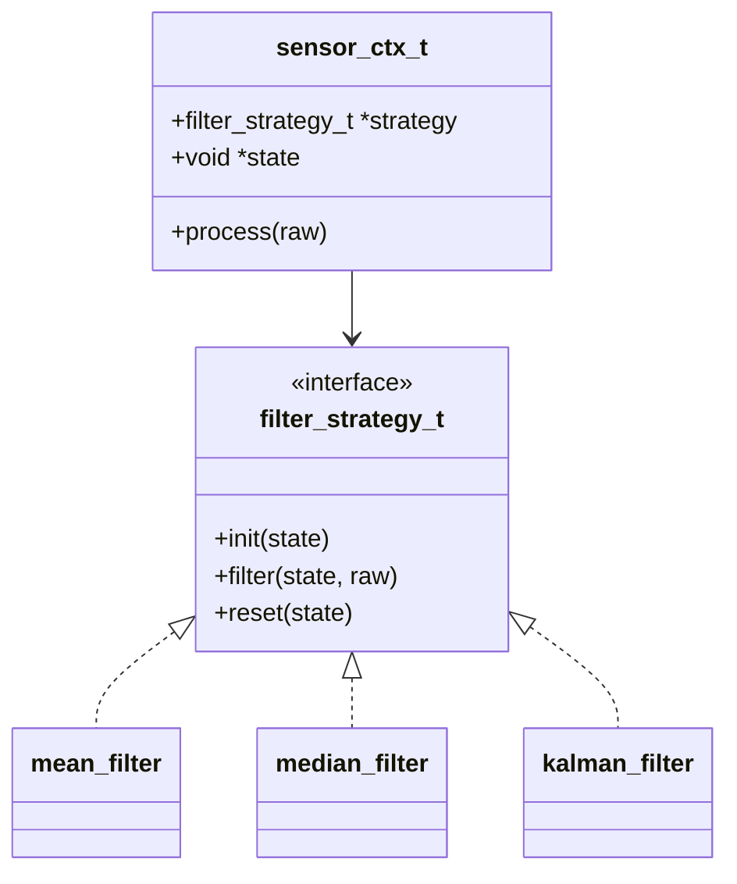
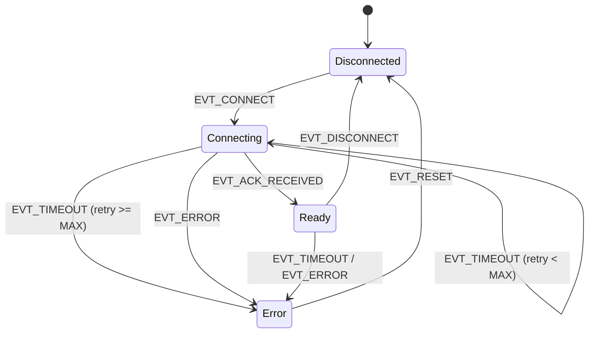

在 C 语言中，策略模式和状态模式的实现代码高度相似 -- 都是"上下文持有函数指针表"。这种结构相似性常导致混淆: 既然代码一样，为什么要区分两种模式？

答案在于**谁控制切换、何时切换**。这个设计意图的差异决定了系统的架构走向。

## 1. C 语言中的多态模拟

C 语言没有 class、virtual、继承，但可以通过结构体 + 函数指针精确模拟多态:

```c
// 接口: 函数指针表 (等价于 C++ vtable)
typedef struct {
    int (*open)(void *ctx);
    int (*read)(void *ctx, void *buf, size_t len);
    int (*write)(void *ctx, const void *buf, size_t len);
    void (*close)(void *ctx);
} io_ops_t;

// 上下文: 持有接口指针 + 实例数据
typedef struct {
    const io_ops_t *ops;    // 指向当前实现的 vtable
    void *priv;             // 具体实现的私有数据
} io_ctx_t;

// 调用方: 通过接口调用，不关心具体实现
static inline int io_read(io_ctx_t *io, void *buf, size_t len) {
    return io->ops->read(io->priv, buf, len);
}
```

这个框架既可以用于策略模式，也可以用于状态模式。区别不在结构，而在语义。

## 2. 策略模式: 关注"如何做"

### 2.1 核心特征

- **目的**: 封装一组可互换的算法，让调用方在运行时选择
- **决策权在外部**: 上下文被动执行指定策略，自身不做选择
- **算法平行**: 各策略之间无依赖、无先后顺序

### 2.2 示例: 传感器数据滤波

一个传感器模块需要支持多种滤波算法 (均值、中值、卡尔曼)，由上层根据场景选择:

```c
/* ---------- 策略接口 ---------- */
typedef struct {
    void (*init)(void *state);
    float (*filter)(void *state, float raw);
    void (*reset)(void *state);
} filter_strategy_t;

/* ---------- 上下文 ---------- */
typedef struct {
    const filter_strategy_t *strategy;  // 当前滤波策略
    void *state;                        // 策略私有状态
    float last_output;
} sensor_ctx_t;

/* ---------- 均值滤波实现 ---------- */
#define MEAN_WINDOW  8

typedef struct {
    float buf[MEAN_WINDOW];
    uint8_t idx;
    uint8_t count;
} mean_state_t;

static void mean_init(void *s) {
    mean_state_t *st = (mean_state_t *)s;
    memset(st, 0, sizeof(*st));
}

static float mean_filter(void *s, float raw) {
    mean_state_t *st = (mean_state_t *)s;
    st->buf[st->idx] = raw;
    st->idx = (st->idx + 1) % MEAN_WINDOW;
    if (st->count < MEAN_WINDOW) { st->count++; }

    float sum = 0.0f;
    for (uint8_t i = 0; i < st->count; i++) { sum += st->buf[i]; }
    return sum / (float)st->count;
}

static void mean_reset(void *s) { mean_init(s); }

static const filter_strategy_t g_mean_strategy = {
    .init   = mean_init,
    .filter = mean_filter,
    .reset  = mean_reset,
};

/* ---------- 中值滤波实现 ---------- */
#define MEDIAN_WINDOW  5

typedef struct {
    float buf[MEDIAN_WINDOW];
    uint8_t idx;
    uint8_t count;
} median_state_t;

static void median_init(void *s) {
    median_state_t *st = (median_state_t *)s;
    memset(st, 0, sizeof(*st));
}

static float median_filter(void *s, float raw) {
    median_state_t *st = (median_state_t *)s;
    st->buf[st->idx] = raw;
    st->idx = (st->idx + 1) % MEDIAN_WINDOW;
    if (st->count < MEDIAN_WINDOW) { st->count++; }

    // 排序副本取中值
    float tmp[MEDIAN_WINDOW];
    memcpy(tmp, st->buf, sizeof(float) * st->count);
    for (uint8_t i = 0; i < st->count - 1; i++) {
        for (uint8_t j = i + 1; j < st->count; j++) {
            if (tmp[j] < tmp[i]) {
                float t = tmp[i]; tmp[i] = tmp[j]; tmp[j] = t;
            }
        }
    }
    return tmp[st->count / 2];
}

static void median_reset(void *s) { median_init(s); }

static const filter_strategy_t g_median_strategy = {
    .init   = median_init,
    .filter = median_filter,
    .reset  = median_reset,
};
```

使用方式 -- 调用方主动选择策略:

```c
static mean_state_t   s_mean_state;
static median_state_t s_median_state;

// 外部决策: 根据场景选择策略
void sensor_set_filter(sensor_ctx_t *ctx, filter_mode_t mode) {
    switch (mode) {
        case FILTER_MEAN:
            ctx->strategy = &g_mean_strategy;
            ctx->state    = &s_mean_state;
            break;
        case FILTER_MEDIAN:
            ctx->strategy = &g_median_strategy;
            ctx->state    = &s_median_state;
            break;
    }
    ctx->strategy->init(ctx->state);
}

// 使用: 上下文不关心具体算法
float sensor_process(sensor_ctx_t *ctx, float raw) {
    ctx->last_output = ctx->strategy->filter(ctx->state, raw);
    return ctx->last_output;
}
```

关键点: `sensor_set_filter()` 由外部调用，传感器模块自身不会主动切换策略。决策权完全在调用方。

### 2.3 策略模式类图



## 3. 状态模式: 关注"何时做、做什么"

### 3.1 核心特征

- **目的**: 将对象行为与内部状态绑定，行为随状态自动切换
- **决策权在内部**: 状态自身决定何时、向哪个状态转换
- **状态有序**: 转换路径由状态机管理，不可任意跳转

### 3.2 示例: 通信协议状态机

一个串口通信模块需要管理连接生命周期 (断开 -> 连接中 -> 就绪 -> 错误):

```c
/* ---------- 事件与状态前向声明 ---------- */
typedef enum {
    EVT_CONNECT,        // 发起连接
    EVT_ACK_RECEIVED,   // 收到应答
    EVT_TIMEOUT,        // 超时
    EVT_DATA_RECEIVED,  // 收到数据
    EVT_ERROR,          // 错误
    EVT_DISCONNECT,     // 断开
    EVT_RESET,          // 重置
} comm_event_t;

typedef struct comm_ctx comm_ctx_t;

/* ---------- 状态接口 ---------- */
typedef struct {
    const char *name;
    void (*on_enter)(comm_ctx_t *ctx);
    void (*on_event)(comm_ctx_t *ctx, comm_event_t evt);
    void (*on_exit)(comm_ctx_t *ctx);
} comm_state_t;

/* ---------- 上下文 ---------- */
struct comm_ctx {
    const comm_state_t *state;    // 当前状态
    uint8_t retry_count;
    uint32_t last_activity_ms;
    uint8_t rx_buf[256];
    size_t rx_len;
};

/* ---------- 状态转换 (内部函数) ---------- */
static void comm_transition(comm_ctx_t *ctx, const comm_state_t *new_state) {
    if (ctx->state->on_exit != NULL) {
        ctx->state->on_exit(ctx);
    }
    ctx->state = new_state;
    if (ctx->state->on_enter != NULL) {
        ctx->state->on_enter(ctx);
    }
}
```

每个状态实现自己的事件处理逻辑，并**自主决定**状态转换:

```c
/* ---------- 前向声明所有状态 ---------- */
static const comm_state_t st_disconnected;
static const comm_state_t st_connecting;
static const comm_state_t st_ready;
static const comm_state_t st_error;

/* ---------- Disconnected 状态 ---------- */
static void disconnected_on_event(comm_ctx_t *ctx, comm_event_t evt) {
    if (evt == EVT_CONNECT) {
        ctx->retry_count = 0;
        comm_transition(ctx, &st_connecting);  // 状态自主决定转换
    }
    // 其他事件在此状态下忽略
}

static const comm_state_t st_disconnected = {
    .name     = "Disconnected",
    .on_enter = NULL,
    .on_event = disconnected_on_event,
    .on_exit  = NULL,
};

/* ---------- Connecting 状态 ---------- */
#define MAX_RETRIES  3

static void connecting_on_enter(comm_ctx_t *ctx) {
    // 发送连接请求
    // send_connect_request();
    ctx->last_activity_ms = get_tick_ms();
}

static void connecting_on_event(comm_ctx_t *ctx, comm_event_t evt) {
    switch (evt) {
        case EVT_ACK_RECEIVED:
            comm_transition(ctx, &st_ready);     // 握手成功
            break;
        case EVT_TIMEOUT:
            if (ctx->retry_count < MAX_RETRIES) {
                ctx->retry_count++;
                // send_connect_request();          // 重试
                ctx->last_activity_ms = get_tick_ms();
            } else {
                comm_transition(ctx, &st_error);  // 超过重试次数
            }
            break;
        case EVT_ERROR:
            comm_transition(ctx, &st_error);
            break;
        default:
            break;
    }
}

static const comm_state_t st_connecting = {
    .name     = "Connecting",
    .on_enter = connecting_on_enter,
    .on_event = connecting_on_event,
    .on_exit  = NULL,
};

/* ---------- Ready 状态 ---------- */
static void ready_on_event(comm_ctx_t *ctx, comm_event_t evt) {
    switch (evt) {
        case EVT_DATA_RECEIVED:
            ctx->last_activity_ms = get_tick_ms();
            // process_data(ctx->rx_buf, ctx->rx_len);
            break;
        case EVT_TIMEOUT:
            comm_transition(ctx, &st_error);
            break;
        case EVT_DISCONNECT:
            comm_transition(ctx, &st_disconnected);
            break;
        case EVT_ERROR:
            comm_transition(ctx, &st_error);
            break;
        default:
            break;
    }
}

static const comm_state_t st_ready = {
    .name     = "Ready",
    .on_enter = NULL,
    .on_event = ready_on_event,
    .on_exit  = NULL,
};

/* ---------- Error 状态 ---------- */
static void error_on_event(comm_ctx_t *ctx, comm_event_t evt) {
    if (evt == EVT_RESET) {
        ctx->retry_count = 0;
        comm_transition(ctx, &st_disconnected);
    }
    // Error 状态下只响应 RESET
}

static const comm_state_t st_error = {
    .name     = "Error",
    .on_enter = NULL,
    .on_event = error_on_event,
    .on_exit  = NULL,
};
```

使用方式 -- 外部只投递事件，不控制状态:

```c
comm_ctx_t comm = { .state = &st_disconnected };

// 外部只投递事件，不干预状态转换
void comm_handle_event(comm_ctx_t *ctx, comm_event_t evt) {
    ctx->state->on_event(ctx, evt);
}

// 使用
comm_handle_event(&comm, EVT_CONNECT);        // Disconnected -> Connecting
comm_handle_event(&comm, EVT_ACK_RECEIVED);   // Connecting -> Ready
comm_handle_event(&comm, EVT_ERROR);          // Ready -> Error
comm_handle_event(&comm, EVT_RESET);          // Error -> Disconnected
```

关键点: 外部调用 `comm_handle_event()` 只投递事件，状态转换逻辑完全封装在各状态的 `on_event` 中。外部无法直接设置状态。

### 3.3 状态图



## 4. 本质差异对比

代码结构相似，但设计意图截然不同:

| 维度 | 策略模式 | 状态模式 |
|------|----------|----------|
| 核心问题 | 用哪个算法？ | 当前处于什么阶段？ |
| 决策权 | **外部** (调用方选择) | **内部** (状态自主转换) |
| 切换方式 | `ctx->strategy = &new_strategy` | `transition(ctx, &new_state)` |
| 切换约束 | 任意时刻、任意方向 | 受状态机规则约束 |
| 切换触发 | 调用方显式调用 | 事件驱动，自动发生 |
| 各实现间关系 | 平行、互不感知 | 有序、相互引用 |
| 典型场景 | 算法选择、后端切换 | 协议状态机、设备生命周期 |

用一句话总结:

> 策略模式是**调用方告诉上下文"用这个"**；状态模式是**上下文自己决定"现在该做什么"**。

## 5. 协作: 在同一系统中组合使用

实际系统中，策略模式和状态模式经常协作。以一个日志系统为例:

- **策略模式**: 日志输出后端可切换 (串口、文件、网络)
- **状态模式**: 网络后端内部管理连接状态 (断开、连接中、已连接)

```c
/* ===== 策略层: 日志后端选择 ===== */
typedef struct {
    int (*init)(void *priv);
    int (*write_log)(void *priv, const char *msg, size_t len);
    void (*flush)(void *priv);
} log_backend_t;

typedef struct {
    const log_backend_t *backend;
    void *priv;
} logger_t;

// 策略切换: 外部决策
void logger_set_backend(logger_t *log, const log_backend_t *be, void *priv) {
    if (log->backend != NULL && log->backend->flush != NULL) {
        log->backend->flush(log->priv);
    }
    log->backend = be;
    log->priv    = priv;
    if (be->init != NULL) { be->init(priv); }
}

/* ===== 状态层: 网络后端内部状态管理 ===== */
typedef enum {
    NET_ST_DISCONNECTED,
    NET_ST_CONNECTING,
    NET_ST_CONNECTED,
} net_log_state_t;

typedef struct {
    net_log_state_t state;
    int sock_fd;
    uint8_t cache[1024];  // 断线时缓存
    size_t cache_len;
} net_log_ctx_t;

static int net_write_log(void *priv, const char *msg, size_t len) {
    net_log_ctx_t *ctx = (net_log_ctx_t *)priv;
    switch (ctx->state) {
        case NET_ST_CONNECTED:
            // 直接发送
            return send(ctx->sock_fd, msg, len, 0);
        case NET_ST_DISCONNECTED:
            // 缓存 + 触发重连 (状态模式: 内部决策)
            if (ctx->cache_len + len <= sizeof(ctx->cache)) {
                memcpy(ctx->cache + ctx->cache_len, msg, len);
                ctx->cache_len += len;
            }
            ctx->state = NET_ST_CONNECTING;  // 自动转换
            // start_reconnect(ctx);
            return (int)len;
        case NET_ST_CONNECTING:
            // 缓存，等待连接完成
            if (ctx->cache_len + len <= sizeof(ctx->cache)) {
                memcpy(ctx->cache + ctx->cache_len, msg, len);
                ctx->cache_len += len;
            }
            return (int)len;
    }
    return -1;
}

static const log_backend_t g_net_backend = {
    .init      = net_log_init,
    .write_log = net_write_log,
    .flush     = net_log_flush,
};
```

层次关系:

```
调用方 --[策略选择]--> logger_t --[函数指针]--> log_backend_t
                                                    |
                                    串口后端 (无状态)  |  网络后端 (有状态)
                                                    |
                                            net_log_ctx_t
                                            [状态机: 断开/连接中/已连接]
```

- 上层用**策略模式**在串口、文件、网络后端之间切换 (外部决策)
- 网络后端内部用**状态模式**管理连接生命周期 (内部自治)
- 两种模式各司其职，互不干扰

## 6. 实现要点

### 6.1 函数指针表用 const 修饰

```c
// vtable 放在 .rodata 段，防止意外修改
static const filter_strategy_t g_mean_strategy = { ... };
static const comm_state_t st_disconnected = { ... };
```

所有函数指针表都应声明为 `const`，让编译器将其放入只读段。嵌入式系统中这意味着放入 Flash，不占 RAM。

### 6.2 上下文指针而非全局变量

```c
// 正确: 通过上下文指针传递
static void connecting_on_event(comm_ctx_t *ctx, comm_event_t evt) { ... }

// 错误: 全局变量
// static comm_ctx_t g_comm;  // 线程不安全，不可重入
```

每个函数都通过参数接收上下文指针，不依赖全局变量。这使得同一套代码可以管理多个实例 (如多路传感器、多路通信)。

### 6.3 状态转换封装

```c
// 状态转换统一通过 transition 函数
static void comm_transition(comm_ctx_t *ctx, const comm_state_t *new_state) {
    if (ctx->state->on_exit != NULL)  { ctx->state->on_exit(ctx); }
    ctx->state = new_state;
    if (ctx->state->on_enter != NULL) { ctx->state->on_enter(ctx); }
}
```

不要在状态处理函数中直接赋值 `ctx->state = &st_xxx`。统一通过 `transition()` 函数，保证 `on_exit` / `on_enter` 回调被正确执行。

### 6.4 NULL 函数指针检查

```c
// 允许部分回调为 NULL，调用前检查
if (ctx->state->on_enter != NULL) {
    ctx->state->on_enter(ctx);
}
```

不是所有状态都需要 `on_enter` / `on_exit`。允许 NULL 可以减少空函数的编写。

## 7. 判断选择

遇到"上下文 + 函数指针"结构时，问自己:

1. **谁决定切换？** 外部调用方 -> 策略模式；内部自动 -> 状态模式
2. **切换有顺序约束吗？** 无约束 -> 策略模式；有固定路径 -> 状态模式
3. **各实现之间知道彼此吗？** 互不感知 -> 策略模式；相互引用 -> 状态模式

```
需要运行时切换行为？
    ├── 是: 切换由谁控制？
    │       ├── 外部调用方 → 策略模式
    │       └── 内部自动   → 状态模式
    └── 否: 不需要这两种模式
```

两种模式并非互斥。如本文第 5 节所示，一个系统可以同时使用策略模式 (选择后端) 和状态模式 (管理后端内部生命周期)，各自解决不同层次的问题。
