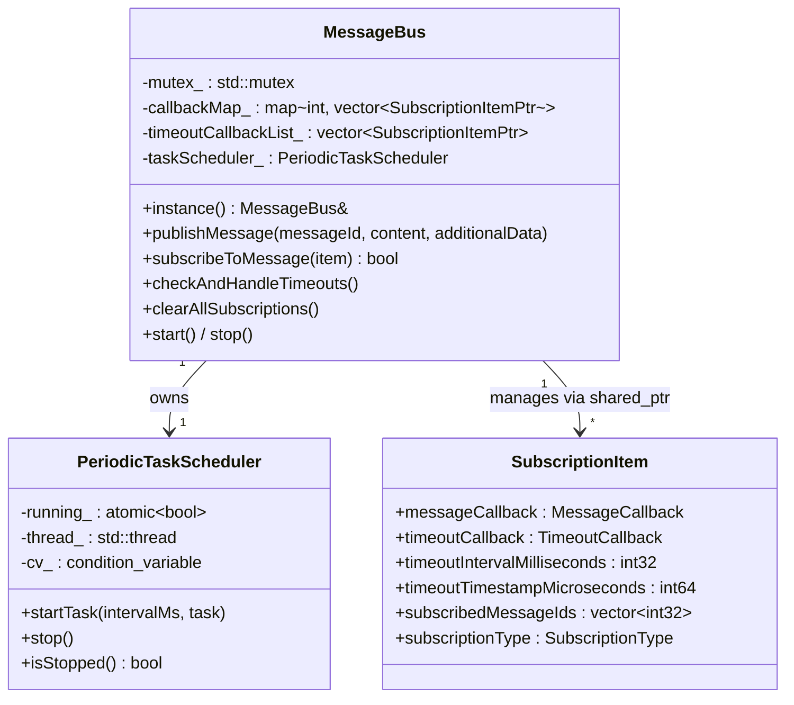
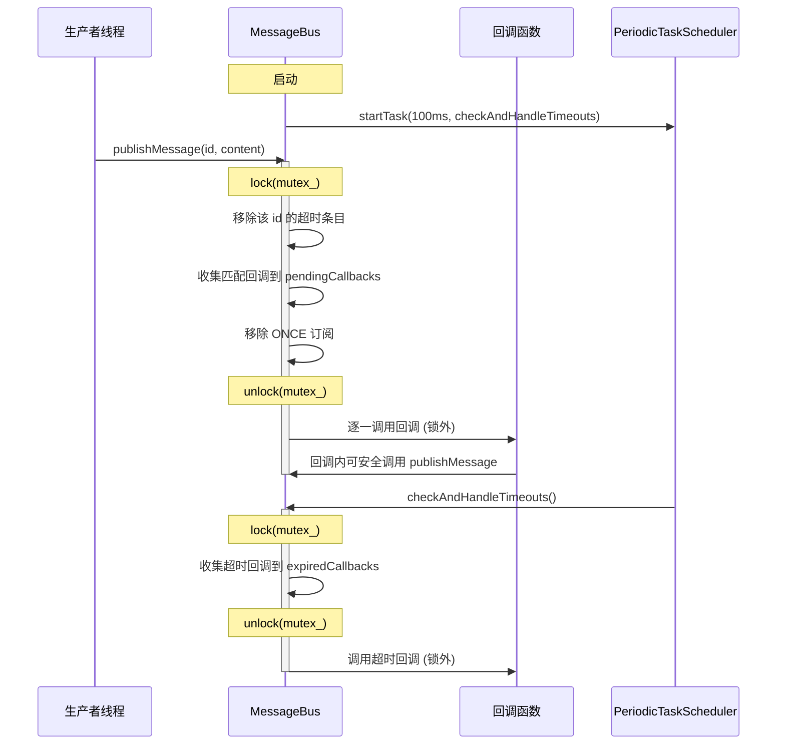

> 原文链接: [C++编程：实现一个简单的消息总线](https://blog.csdn.net/stallion5632/article/details/143785271)
>
> 完整代码: [message_bus](https://gitee.com/liudegui/message_bus) (optimze 分支)
>
> 前篇: [用 C++11 从零实现一个线程安全消息总线](../cpp11_message_bus/)

## 1. 背景: 从 C++11 版本到优化版本

在 [前篇](../cpp11_message_bus/) 中，我们用 C++11 实现了一个基于 mutex 保护的消息总线。该版本功能可用，但存在几个工程缺陷：

- **回调内重入死锁**: `publishMessage()` 持锁调用回调，回调内再次 `publishMessage()` 会死锁
- **回调参数固定**: `std::string` 参数不适合二进制协议数据
- **超时管理粗糙**: `timeoutInterval` 和 `timeoutStamp` 单位不一致 (ms vs us)，容易引发换算 bug
- **线程创建不干净**: 定时器线程 detach 后无法保证干净关闭

本文基于 [message_bus](https://gitee.com/liudegui/message_bus) 仓库的 optimze 分支代码，逐一解决上述问题，并通过压力测试暴露 mutex + `std::function` 方案的性能天花板。

## 2. 架构设计

### 2.1 系统组成



### 2.2 核心设计决策

| 决策 | C++11 版本 | 优化版本 | 改进点 |
|------|-----------|---------|--------|
| 锁策略 | 持锁调用回调 | 锁内收集，锁外调用 | 消除重入死锁 |
| 回调参数 | `std::string` | `std::vector<uint8_t>` | 支持二进制协议 |
| 订阅管理 | 裸指针 | `std::shared_ptr` | 生命周期安全 |
| 定时器线程 | `std::thread` detach | joinable + `condition_variable` | 干净关闭 |
| 锁粒度 | 双 mutex (死锁风险) | 单 mutex | 消除锁序风险 |

## 3. 核心实现

### 3.1 数据结构

```cpp
using MessageCallback = std::function<void(
    const std::vector<std::uint8_t>& messageContent,
    std::int32_t additionalData)>;
using TimeoutCallback = std::function<void()>;

enum class SubscriptionType { ALWAYS_SUBSCRIBE = 0, ONCE_SUBSCRIBE };

struct SubscriptionItem {
    MessageCallback messageCallback = nullptr;
    TimeoutCallback timeoutCallback = nullptr;
    std::int32_t timeoutIntervalMilliseconds = 1000;
    std::int64_t timeoutTimestampMicroseconds = 0;
    std::vector<std::int32_t> subscribedMessageIds;
    SubscriptionType subscriptionType = SubscriptionType::ALWAYS_SUBSCRIBE;
};
```

相比 C++11 版本的关键改进：

- 回调参数改为 `std::vector<uint8_t>`，适合传输二进制帧、protobuf 序列化数据等
- `timeoutTimestampMicroseconds` 统一为微秒，由框架内部计算，避免用户换算错误

### 3.2 锁外回调: 解决重入死锁

这是优化版本最重要的改动。C++11 版本在持锁状态下直接调用回调，如果回调内再次 `publishMessage()`，同一线程会尝试重复加锁 (`std::mutex` 不可重入)，导致死锁。

解决方案：**锁内收集，锁外执行**。

```cpp
void MessageBus::publishMessage(std::int32_t messageId,
                                const std::vector<std::uint8_t>& messageContent,
                                std::int32_t additionalData) {
    // 锁外执行的回调集合
    std::vector<MessageCallback> pendingCallbacks;

    {
        std::lock_guard<std::mutex> lk(mutex_);

        // 1. 移除该 messageId 对应的超时条目
        timeoutCallbackList_.erase(
            std::remove_if(timeoutCallbackList_.begin(),
                           timeoutCallbackList_.end(),
                           [messageId](const SubscriptionItemPtr& item) {
                               auto& ids = item->subscribedMessageIds;
                               return std::find(ids.begin(), ids.end(),
                                                messageId) != ids.end();
                           }),
            timeoutCallbackList_.end());

        // 2. 收集匹配的回调
        auto it = callbackMap_.find(messageId);
        if (it == callbackMap_.end()) return;

        std::vector<SubscriptionItemPtr> onceItems;
        for (auto& item : it->second) {
            if (item->messageCallback) {
                pendingCallbacks.push_back(item->messageCallback);
            }
            if (item->subscriptionType == SubscriptionType::ONCE_SUBSCRIBE) {
                onceItems.push_back(item);
            }
        }

        // 3. 移除 ONCE 订阅
        for (auto& item : onceItems) {
            removeFromCallbackMap(item);
        }
    }
    // mutex_ 已释放

    // 4. 锁外逐一调用回调 -- 回调内可安全地再次 publishMessage
    for (auto& cb : pendingCallbacks) {
        cb(messageContent, additionalData);
    }
}
```

这个模式的关键点：

- **步骤 1-3** 在 `std::lock_guard` 保护下操作共享数据
- **步骤 4** 在锁释放后执行回调，回调内可以安全调用 `publishMessage()` 或 `subscribeToMessage()`
- `pendingCallbacks` 是栈上局部变量，持有 `std::function` 的拷贝

### 3.3 单 mutex 消除锁序风险

C++11 版本使用两把锁 (`callbackMapMutex_` 和 `timeoutCallbackListMutex_`)，需要通过 `std::lock()` 保证加锁顺序一致，否则不同线程以不同顺序加锁会死锁。

优化版本合并为单一 `mutex_`，同时保护 `callbackMap_` 和 `timeoutCallbackList_`：

```cpp
class MessageBus {
private:
    // 单一 mutex 保护所有共享数据
    std::mutex mutex_;
    CallbackMap callbackMap_;
    std::vector<SubscriptionItemPtr> timeoutCallbackList_;
    PeriodicTaskScheduler taskScheduler_;
};
```

单 mutex 的代价是粒度较粗，但对于当前的使用场景（发布频率 < 1M/s），避免死锁比细粒度锁更重要。

### 3.4 定时器: joinable 线程 + condition_variable

C++11 版本的定时器线程使用 `std::thread::detach()`，存在两个问题：

1. 进程退出时 detached 线程可能访问已销毁的资源
2. 无法确认线程是否已停止

优化版本使用 joinable 线程 + `condition_variable` 实现优雅关闭：

```cpp
class PeriodicTaskScheduler {
public:
    void startTask(std::int32_t intervalMs, std::function<void()> task) {
        if (running_.load(std::memory_order_relaxed)) return;
        running_.store(true, std::memory_order_relaxed);

        thread_ = std::thread([this, intervalMs, task = std::move(task)]() {
#ifdef __linux__
            pthread_setname_np(pthread_self(), "MsgBusTimer");
#endif
            while (running_.load(std::memory_order_relaxed)) {
                std::unique_lock<std::mutex> lk(mutex_);
                // wait_for 返回 true 表示被通知停止
                if (cv_.wait_for(lk, std::chrono::milliseconds(intervalMs),
                                 [this] { return !running_.load(); })) {
                    break;
                }
                lk.unlock();
                task();
            }
        });
    }

    void stop() {
        bool expected = true;
        if (!running_.compare_exchange_strong(expected, false)) return;
        cv_.notify_one();
        if (thread_.joinable()) {
            thread_.join();  // 等待线程完成
        }
    }

private:
    std::atomic<bool> running_{false};
    std::mutex mutex_;
    std::condition_variable cv_;
    std::thread thread_;
};
```

`condition_variable::wait_for` 兼顾两个需求：定时唤醒执行任务，以及被 `stop()` 立即唤醒退出。比 `std::this_thread::sleep_for` + 轮询标志位更高效。

### 3.5 `shared_ptr` 管理订阅生命周期

```cpp
using SubscriptionItemPtr = std::shared_ptr<SubscriptionItem>;

bool MessageBus::subscribeToMessage(const SubscriptionItem& item) {
    auto itemPtr = std::make_shared<SubscriptionItem>(item);
    std::lock_guard<std::mutex> lk(mutex_);
    for (std::int32_t messageId : itemPtr->subscribedMessageIds) {
        callbackMap_[messageId].push_back(itemPtr);
    }
    if (itemPtr->timeoutCallback) {
        registerTimeoutCallback(itemPtr);
    }
    return true;
}
```

同一个 `SubscriptionItem` 可能同时存在于 `callbackMap_` 和 `timeoutCallbackList_` 中。使用 `shared_ptr` 保证：

- 从超时列表移除后，如果回调表仍持有引用，对象不会被销毁
- 反之亦然
- 两处引用都移除后，对象自动释放

### 3.6 时序流程



## 4. 测试与性能

### 4.1 功能测试

测试程序覆盖 5 个场景：

| 测试 | 验证内容 |
|------|---------|
| 单线程压力测试 | 10 万消息发布吞吐量 |
| 多线程压力测试 | 8 线程并发发布 |
| 超时回调测试 | 0.5s 超时触发验证 |
| 一次性订阅测试 | ONCE 订阅只触发一次 |
| 重入发布测试 | 回调内 publish 不死锁 |

重入测试是关键的正确性验证：

```cpp
// 订阅消息 4，回调内发布消息 5
SubscriptionItem item4;
item4.messageCallback = [&bus](const std::vector<std::uint8_t>& content,
                               std::int32_t) {
    g_callbackCount.fetch_add(1, std::memory_order_relaxed);
    bus.publishMessage(5, content, 0);  // 回调内再次 publish
};
item4.subscribedMessageIds.push_back(4);
bus.subscribeToMessage(item4);

// 订阅消息 5
SubscriptionItem item5;
item5.messageCallback = [](const std::vector<std::uint8_t>&, std::int32_t) {
    g_callbackCount.fetch_add(1, std::memory_order_relaxed);
};
item5.subscribedMessageIds.push_back(5);
bus.subscribeToMessage(item5);

bus.publishMessage(4, testMsg, 0);
// 预期: g_callbackCount == 2 (msg4 回调 + msg5 回调)
```

C++11 版本此测试会死锁，优化版本通过锁外回调机制正确完成链式发布。

### 4.2 性能测试结果

测试环境: Ubuntu 24.04, Intel Xeon, GCC 13.3, `-O2`

```
=== Single Thread Test ===
  Published 100000 messages in 0.179179 s (0.558 M/s)
  Callbacks invoked: 100000

=== Multi Thread Test ===
  8 threads x 10000 = 80000 messages in 0.224865 s (0.356 M/s)
  Callbacks invoked: 80000

=== High Frequency Test ===
  Published 100000 messages in 0.170551 s (0.586 M/s)
```

| 测试 | 消息数 | 线程数 | 耗时 | 吞吐量 |
|------|:------:|:------:|:----:|:------:|
| 单线程 | 100,000 | 1 | 0.179 s | **0.56 M/s** |
| 多线程 | 80,000 | 8 | 0.225 s | **0.36 M/s** |
| 高频 | 100,000 | 1 | 0.171 s | **0.59 M/s** |

## 5. 性能瓶颈分析

### 5.1 锁竞争: 多线程吞吐量低于单线程

多线程 (8 线程) 吞吐量 0.36 M/s，**比单线程 0.56 M/s 还低 36%**。这不是测试误差，而是 mutex 竞争的直接后果：

```
单线程: 无竞争，每次 lock/unlock 约 20 ns (缓存命中)
多线程: 竞争状态下，mutex 的 futex 系统调用 + 上下文切换
        每次 lock 可能需要 200-2000 ns (取决于竞争强度)
```

`std::mutex` 在高竞争下的问题不仅是"慢"，更是**不可预测**。在 SCHED_OTHER 调度下，持锁线程可能被抢占，其他生产者被迫等待不确定时长。对于实时系统，这种延迟抖动是不可接受的。

### 5.2 std::function 的堆分配

每个 `SubscriptionItem` 包含两个 `std::function`。当 callable 对象超过 `std::function` 内部 SBO 缓冲区 (通常 16-32 字节) 时，会触发堆分配。

更严重的是 `publishMessage` 中的回调收集：

```cpp
std::vector<MessageCallback> pendingCallbacks;  // 栈上 vector
// ...
pendingCallbacks.push_back(item->messageCallback);  // 拷贝 std::function
```

每次 `publishMessage` 都可能触发：
1. `std::vector` 扩容的堆分配
2. `std::function` 拷贝时的堆分配 (如果 callable 超过 SBO)

### 5.3 std::map 的 O(log N) 查找

```cpp
CallbackMap callbackMap_;  // std::map<int32_t, vector<shared_ptr>>
// ...
auto callbackIt = callbackMap_.find(messageId);  // O(log N) 红黑树查找
```

`std::map` 是红黑树实现，每次查找 O(log N)，且节点分散在堆上，缓存不友好。对于消息总线这种高频查找场景，哈希表 (`std::unordered_map`) 的 O(1) 平均查找更合适。但两者都有堆分配问题。

### 5.4 shared_ptr 的原子引用计数

```cpp
using SubscriptionItemPtr = std::shared_ptr<SubscriptionItem>;
```

`shared_ptr` 的引用计数操作是原子的 (`fetch_add`/`fetch_sub`)。在高频路径上，拷贝和销毁 `shared_ptr` 的原子操作会造成缓存行竞争 (cache line bouncing)。

### 5.5 超时检查的 O(N) 遍历

```cpp
void MessageBus::checkAndHandleTimeouts() {
    // 每 100ms 遍历全部超时列表
    for (auto it = timeoutCallbackList_.begin();
         it != timeoutCallbackList_.end();) {
        if ((*it)->timeoutTimestampMicroseconds <= currentTime) {
            // ... 超时处理
        }
    }
}
```

定时器每 100ms 遍历全部超时订阅。当订阅数量增长到 1000+ 时，每次遍历的代价不可忽视。时间轮 (timing wheel) 或最小堆 (min-heap) 可以将复杂度降到 O(1) 或 O(log N)。

### 5.6 瓶颈总结

| 瓶颈 | 影响 | 量化 |
|------|------|------|
| `std::mutex` 竞争 | 多线程吞吐量下降，延迟不可预测 | 8 线程比单线程低 36% |
| `std::function` 堆分配 | 热路径上的 malloc/free | 每次 publish 可能 2 次堆分配 |
| `std::map` 查找 | O(log N) + 缓存不友好 | 红黑树节点分散堆上 |
| `shared_ptr` 原子计数 | 缓存行竞争 | 每次拷贝/销毁 1 次 atomic |
| 全量超时遍历 | O(N) 定时开销 | 100ms 间隔 x N 订阅 |
| 全局单例 | 不适合多总线隔离 | 无法独立配置 |

## 6. 与 Lock-free 方案的对比

上述瓶颈在嵌入式实时系统中会被放大。以激光雷达点云处理为例：传感器数据以 10 kHz 频率产生，电机控制回路要求微秒级响应，mutex 的不确定延迟是不可接受的。

[MCCC (Message-Centric Component Communication)](https://gitee.com/liudegui/mccc-bus) 消息总线针对这些问题逐一设计了替代方案：

| 维度 | 本文方案 (mutex) | MCCC (Lock-free) |
|------|:----------------:|:----------------:|
| 同步机制 | `std::mutex` | CAS 原子操作 (MPSC) |
| 回调存储 | `std::function` (可能堆分配) | `FixedFunction` (栈上 SBO, 编译期 static_assert) |
| 消息路由 | `std::map<int, vector>` | 编译期 `std::variant` 类型索引 |
| 订阅管理 | `shared_ptr` + 动态 vector | 固定大小 `std::array` + 原子标志 |
| 内存分配 | 多处堆分配 | **零堆分配** (Envelope 内嵌 Ring Buffer) |
| 优先级 | 无 | 三级准入控制 (HIGH 99% / MEDIUM 80% / LOW 60%) |
| 多线程吞吐 | 0.36 M/s (8 线程) | **20.6 M/s** (FULL) / **31.1 M/s** (BARE) |

**关键差距: 多线程场景下 MCCC 吞吐量是本文方案的 57 倍 (BARE) 到 86 倍 (BARE)。**

更详细的对比数据和 6 个开源方案的横向评测，请参阅 [C++ 消息总线性能实测: 6 个开源方案的吞吐量、延迟与嵌入式适配性对比](../MCCC_Competitive_Analysis/)。

## 7. 从 mutex 方案迁移到 MCCC

### 7.1 概念映射

| 本文方案 | MCCC 等价概念 |
|---------|-------------|
| `SubscriptionItem` | `MessageEnvelope<PayloadVariant>` |
| `MessageCallback` | `FixedFunction<void(const Envelope&)>` |
| `callbackMap_[messageId]` | `AsyncBus::Subscribe<T>(callback)` (编译期类型路由) |
| `publishMessage(id, data)` | `bus.Publish(SensorData{...})` (类型安全) |
| 整数 messageId | `std::variant` alternative 类型 (编译期索引) |

### 7.2 迁移示例

**本文方案:**

```cpp
// 定义回调
void onSensor(const std::vector<uint8_t>& content, int32_t data) {
    // 需要手动反序列化 content
    float temp;
    memcpy(&temp, content.data(), sizeof(float));
}

// 订阅
SubscriptionItem item;
item.messageCallback = onSensor;
item.subscribedMessageIds.push_back(MSG_SENSOR);
bus.subscribeToMessage(item);

// 发布
float temp = 25.5f;
std::vector<uint8_t> payload(sizeof(float));
memcpy(payload.data(), &temp, sizeof(float));
bus.publishMessage(MSG_SENSOR, payload);
```

**MCCC 方案:**

```cpp
// 消息类型直接用结构体，无需序列化
struct SensorData { float temp; };
struct MotorCmd   { int speed; };
using Payload = std::variant<SensorData, MotorCmd>;
using Bus = mccc::AsyncBus<Payload>;

Bus bus;

// 订阅: 编译期类型路由，拼写错误直接编译失败
bus.Subscribe<SensorData>([](const auto& env) {
    float temp = std::get<SensorData>(env.payload).temp;  // 类型安全
});

// 发布: 直接传结构体，零序列化开销
bus.Publish(SensorData{25.5f});
```

### 7.3 MCCC 深入学习路径

| 主题 | 文章 |
|------|------|
| 设计决策与架构 | [Lock-free MPSC 消息总线的设计与实现](../MCCC_Design/) |
| 性能对比评测 | [6 个开源方案的吞吐量、延迟与嵌入式适配性对比](../MCCC_Competitive_Analysis/) |
| C++17 语言特性 | [mccc-bus 源码中的 C++17 实践](../mccc_bus_cpp17_practice/) |
| API 参考文档 | [MCCC 消息总线 API 全参考](../mccc_bus_api_reference/) |
| 实战重构案例 | [用 MCCC 无锁消息总线替代 mutex + priority_queue](/posts/blog/mccc_message_passing/) |

## 8. 总结

本文实现的消息总线在工程层面做了几项实质性改进：

1. **锁外回调** -- 彻底解决了重入死锁问题
2. **单 mutex** -- 消除了锁序不一致导致的死锁风险
3. **joinable 线程** -- 保证了干净关闭
4. **二进制载荷** -- `vector<uint8_t>` 替代 `string`，适合协议数据

这些改进使其成为一个**正确的**消息总线实现。但性能测试表明，mutex + `std::function` + `std::map` 的组合在多线程高频场景下存在根本性瓶颈：

- 单线程吞吐量约 0.56 M/s
- 多线程 (8 线程) 吞吐量反而降至 0.36 M/s
- 热路径存在多处堆分配
- 延迟不可预测

对于嵌入式实时系统，这些数字意味着该方案只适用于低频控制指令 (< 10 kHz) 的场景。高频数据流 (传感器、点云、视频帧) 需要 Lock-free 方案。

[MCCC 消息总线](https://gitee.com/liudegui/mccc-bus) 通过 CAS 无锁 MPSC、Envelope 内嵌零堆分配、编译期类型路由等技术，将多线程吞吐量提升到 20-31 M/s (本文方案的 57-86 倍)，同时保持 MISRA C++ 合规和 `-fno-exceptions -fno-rtti` 兼容。

> 代码仓库: [message_bus](https://gitee.com/liudegui/message_bus) | [mccc-bus](https://gitee.com/liudegui/mccc-bus)
