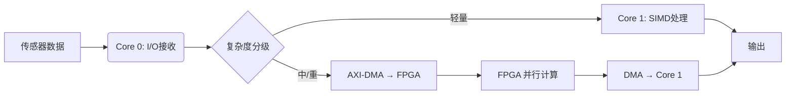

## 1. 优化三定律

### 度量、定位、验证

性能优化的第一条铁律: **不要猜**。

- **度量** (Measure): 用 perf、DWT 周期计数器、Google Benchmark 建立基线数据
- **定位** (Locate): 用火焰图或 profiler 找到真正的热点，而不是"感觉慢"的地方
- **验证** (Verify): 每次改动后重新跑基准，确认改进是真实且稳定的

违反这条定律的后果可能是"优化"反而让性能变差。一个典型案例: 在 ARMv8 上用 NEON SIMD 优化 CRC32，获得了 8 倍加速; 但用同样的思路优化简单字节累加校验和，性能反而下降 20% — SIMD 的寄存器加载/存储开销超过了并行计算的收益。

> 详细的 CRC/NEON 对比实验数据参见 [ARMv8 CRC 性能实测: 硬件指令快 8 倍, NEON 反而更慢](/tech-notes/posts/blog/neon_crc32_analysis/)

### 零拷贝思维

现代处理器的计算速度与内存访问速度差距超过 100 倍。数据移动的成本往往高于计算本身:

| 操作 | 延迟 (cycles) |
|------|-------------|
| L1 Cache 命中 | 3-5 |
| L2 Cache 命中 | 10-20 |
| L3 Cache 命中 | 30-50 |
| 主存访问 | 100-300 |
| 分支预测失败 | 10-20 |
| 虚函数调用 | 10-30 (含 cache miss) |

优化的核心不是让 CPU 算得更快，而是**减少数据搬运和间接跳转**:

- 传指针，不传对象
- DMA 搬运，不用 CPU 拷贝
- 缓存行对齐，减少 miss
- 编译期绑定，消除虚函数跳转

### 优化优先级

架构决定上限，算法决定下限，微优化只影响常数因子:

1. **算法复杂度** — O(n) → O(log n) 的改进远超任何微优化
2. **架构设计** — 零拷贝、无锁、核绑定等系统级决策
3. **数据布局** — 缓存友好的内存组织
4. **编译器提示** — 分支预测、预取、强制内联
5. **指令级优化** — SIMD、汇编 (投入大收益不确定)

### 跨平台开发模型: 主机优化，目标部署

在 MCU 上调试和性能分析工具极其有限。一个高效的实践是**将核心算法封装为平台无关的 C/C++ 模块**:

1. 通过回调函数或 HAL 层抽象硬件操作 (SPI/UART/DMA)
2. 在 Linux 上用 perf、Valgrind、gdb 进行性能分析和调试
3. 优化验证通过后，移植到 RT-Thread/FreeRTOS 工程，只需实现硬件接口

这种"主机开发 + 目标部署"的模式显著提升了开发效率，也让本文介绍的 perf 火焰图等 Linux 工具在 MCU 项目中发挥作用。

---

## 2. 编译器内建优化

### 强制内联

热点函数的内联化是最基础的优化手段。编译器通常会自主决定是否内联，但在嵌入式和实时系统中，关键路径上的短小函数需要**保证**内联:

```cpp
// GCC/Clang: __attribute__((always_inline))
// MSVC: __forceinline
// 跨平台宏:
#if defined(_MSC_VER)
  #define FORCE_INLINE __forceinline
#else
  #define FORCE_INLINE inline __attribute__((always_inline))
#endif

FORCE_INLINE uint32_t FastHash(uint32_t key) {
    key = ((key >> 16) ^ key) * 0x45d9f3b;
    key = ((key >> 16) ^ key) * 0x45d9f3b;
    key = (key >> 16) ^ key;
    return key;
}
```

内联消除了函数调用的固定开销 (参数压栈/出栈、返回地址保存、栈帧创建)，更重要的是让编译器能跨函数边界做常量传播和死代码消除。

**注意**: 过度内联会导致代码膨胀 (code bloat)，增加指令缓存压力。只对**热路径上的短小函数**使用强制内联。

### 分支预测提示: `__builtin_expect`

CPU 流水线依赖分支预测。当预测失败时，需要清空流水线重新执行，代价是 10-20 个周期。`__builtin_expect` 告诉编译器哪条分支更可能执行，让编译器把热路径放在直通路径上:

```cpp
#define likely(x)   __builtin_expect(!!(x), 1)
#define unlikely(x) __builtin_expect(!!(x), 0)

int ProcessPacket(const uint8_t* packet, size_t len) {
    // 正常情况下校验通过 — 编译器优化直通路径
    if (likely(ValidateChecksum(packet, len))) {
        return HandleValidPacket(packet, len);
    }
    // 异常路径放在分支末尾，减少指令缓存污染
    return HandleError(packet, len);
}
```

编译器会将 likely 分支生成为无跳转的直通代码，unlikely 分支放在函数末尾:

```asm
; likely 路径: 直通，无跳转
    bl  ValidateChecksum
    cbz r0, .Lerror       ; 只在失败时跳转
    bl  HandleValidPacket ; 热路径直通
    bx  lr

.Lerror:                  ; 冷路径放在末尾
    bl  HandleError
    bx  lr
```

**适用场景**: 分支概率明显不均衡的情况 (90/10 或更极端)。如果两条分支概率接近 50/50，使用 `__builtin_expect` 没有意义。

### 缓存预取: `__builtin_prefetch`

当访问模式可预测但数据不在缓存中时，可以提前发出预取指令，让数据在实际使用前就进入缓存:

```cpp
void ProcessLargeArray(int* data, size_t count) {
    const size_t kPrefetchDistance = 16;  // 根据 cache line 大小调整

    for (size_t i = 0; i < count; ++i) {
        if (i + kPrefetchDistance < count) {
            __builtin_prefetch(&data[i + kPrefetchDistance], 0, 3);
            // 参数: 地址, 0=只读/1=写, 0-3=局部性级别
        }
        data[i] = Compute(data[i]);
    }
}

// 链表遍历: 预取下一个节点
void TraverseList(Node* head) {
    for (Node* cur = head; cur != nullptr; cur = cur->next) {
        if (cur->next) {
            __builtin_prefetch(cur->next, 0, 1);
            // 局部性 1: 链表节点通常只访问一次
        }
        Process(cur);
    }
}
```

newosp 的消息总线在批处理消费循环中使用了预取:

```cpp
// newosp bus.hpp: 批处理循环中预取下一个 ring buffer 节点
for (uint32_t i = 0; i < batch_count; ++i) {
    if (i + 1 < kBatchSize) {
        __builtin_prefetch(
            &ring_buffer_[(cons_pos + 1) & kBufferMask], 0, 1);
    }
    // 处理当前消息...
}
```

### MCU 平台适用性

| MCU 类型 | `__builtin_expect` | `__builtin_prefetch` | 实际收益 |
|----------|-------------------|---------------------|----------|
| Cortex-M0/M3 | 编译支持 | 硬件无缓存，NOP | 分支优化有限，预取无效 |
| Cortex-M4/M7 | 编译支持 | M7 有 D-Cache | M7 两者均有收益 |
| Cortex-A7/A9/A53 | 支持 | 多级缓存 | 两者均有显著收益 |

在没有 D-Cache 的 MCU 上，`__builtin_prefetch` 会被编译器生成为 NOP，不会造成错误，但也没有任何收益。

---

## 3. 编译期多态: 模板替代虚函数

### 为什么要避免虚函数

在嵌入式和实时系统中，虚函数有三个代价:

1. **vtable 间接跳转**: 每次虚函数调用需要先读 vtable 指针，再读函数地址，两次内存访问。如果 vtable 不在缓存中，代价可达 100+ 周期
2. **无法内联**: 编译器在编译期不知道虚函数的实际目标，无法进行内联优化
3. **RTTI 内存**: 启用 RTTI 后每个多态类型增加类型信息，在 MCU 上不可接受

MISRA C++ 2008 对虚函数和 RTTI 有严格限制 (Rule 5-0-1, Rule 5-0-2)。在 `-fno-rtti -fno-exceptions` 编译模式下，需要编译期替代方案。

### CRTP: 编译期多态

Curiously Recurring Template Pattern (CRTP) 是虚函数的零开销替代:

```cpp
template <typename Derived>
class SensorAdapter {
public:
    void ReadData() {
        // 编译期绑定: 编译器知道 Derived 的具体类型
        static_cast<Derived*>(this)->ReadDataImpl();
    }
};

class LidarAdapter : public SensorAdapter<LidarAdapter> {
public:
    void ReadDataImpl() {
        // 编译器可以内联这个调用
        ReadLidarWithDMA();
    }
};

class CameraAdapter : public SensorAdapter<CameraAdapter> {
public:
    void ReadDataImpl() {
        ReadCameraWithAlignment();
    }
};

// 使用: 编译期确定类型，零间接调用
template <typename Adapter>
void ProcessSensor(Adapter& adapter) {
    adapter.ReadData();  // 直接调用，可内联
}
```

### 模板参数化策略选择

newosp 的 `StaticNode` 展示了编译期 Handler 绑定的实际应用。通过模板参数传入 Handler 类型，编译器可以将整条消息分发路径内联:

```cpp
// 编译期订阅所有消息类型 — 使用 fold expression
template <size_t... Is>
bool SubscribeAll(std::index_sequence<Is...>) noexcept {
    return (SubscribeOne<Is>() && ...);
}

// 每个类型的订阅: lambda 捕获 handler 指针，直接调用
template <size_t I>
bool SubscribeOne() noexcept {
    using T = std::variant_alternative_t<I, PayloadVariant>;
    Handler* handler_ptr = &handler_;

    bus_ptr_->template Subscribe<T>(
        [handler_ptr](const EnvelopeType& env) noexcept {
            const T* data = std::get_if<T>(&env.payload);
            if (data != nullptr) {
                (*handler_ptr)(*data, env.header);  // 直接调用，可内联
            }
        });
}
```

对比虚函数方案:

| 维度 | 虚函数 | CRTP / 模板 |
|------|--------|------------|
| 绑定时机 | 运行时 | 编译时 |
| 内联 | 不可能 | 编译器可内联 |
| 内存 | vtable 指针 (8B/对象) | 零额外内存 |
| 适用性 | 运行时多态 (插件系统) | 编译期已知类型集合 |

**权衡**: CRTP 只适用于类型在编译期已知的场景。如果需要运行时动态加载 (如插件系统)，虚函数仍然是正确选择。

### C 语言等价方案: 函数指针表

C 语言没有模板，但可以用 `const` 函数指针表实现相同的编译期绑定:

```c
// 声明操作接口
typedef struct {
    int (*encode)(void* ctx, const uint8_t* data, size_t len);
    int (*decode)(void* ctx, uint8_t* data, size_t len);
    void* ctx;
} codec_ops_t;

// 编译期初始化，函数地址在编译期确定
static const codec_ops_t crc16_codec = {
    .encode = crc16_encode,
    .decode = crc16_decode,
    .ctx    = NULL,
};
```

优点: 无堆分配、指针直跳 (无 vtable 二次查找)、编译器可内联。这也是 Linux 内核中 `file_operations`、`i2c_algorithm` 等子系统的标准做法。

### 设计模式的性能代价

GoF 设计模式为解耦而生，但在热路径上会引入可观的运行时开销:

| 类别 | 典型模式 | 主要开销 |
|------|---------|---------|
| 对象创建 | Singleton / Factory / Builder | 原子操作、堆分配 |
| 方法转发 | Decorator / Proxy | 层层包装 + 间接跳转 |
| 运行时多态 | Strategy / State / Visitor | vtable 查找，阻止内联 |
| 链式结构 | Observer / Chain / Composite | 列表遍历、缓存抖动 |

C++17 提供了零开销替代方案:

| 模式 | 传统损耗 | C++17 替代 |
|------|---------|-----------|
| Singleton | DCLP 锁竞争 + 堆分配 | `static T inst;` (魔法静态，编译器保证线程安全) |
| Strategy / State | vtable 查找 | `std::variant` + `std::visit` (编译期分支) |
| Factory | 字符串映射 + 堆分配 | `std::make_unique<T>(args...)` (模板工厂) |
| Observer | 虚函数回调链 | `FixedFunction` + 环形缓冲批处理 |

**原则**: 热循环内禁止堆分配和虚调用。启动、初始化等冷路径可以保留面向对象层次; 中断和紧循环必须用编译期确定的调用。

---

## 4. 零堆分配热路径

### 问题: 热路径上的堆分配

在消息总线、事件处理等每秒执行数百万次的热路径上，堆分配是严重的性能瓶颈:

- `malloc/free` 涉及全局锁或 thread-local cache 管理
- 堆碎片导致分配器性能退化
- 堆分配的地址不可预测，破坏缓存局部性
- 在 RTOS 和安全关键系统中，堆分配可能导致不确定的延迟

### FixedFunction: 栈上类型擦除

`std::function` 的问题在于它内部可能进行堆分配 (当 callable 超过 SBO 阈值时)。newosp 的 `FixedFunction` 使用固定大小的栈缓冲区 (Small Buffer Optimization):

```cpp
template <typename Signature, size_t BufferSize = 4 * sizeof(void*)>
class FixedFunction;

template <typename Ret, typename... Args, size_t BufferSize>
class FixedFunction<Ret(Args...), BufferSize> {
    using Storage = typename std::aligned_storage<BufferSize,
                                                   alignof(void*)>::type;
    using Invoker = Ret (*)(const Storage&, Args...);
    using Destroyer = void (*)(Storage&);

    Storage storage_{};       // 栈上缓冲区 (默认 32 字节)
    Invoker invoker_ = nullptr;
    Destroyer destroyer_ = nullptr;

public:
    template <typename F>
    FixedFunction(F&& f) noexcept {
        using Decay = typename std::decay<F>::type;
        // 编译期检查: callable 是否放得下
        static_assert(sizeof(Decay) <= BufferSize,
                      "Callable too large for FixedFunction buffer");
        // Placement new: 直接在栈缓冲区上构造
        ::new (&storage_) Decay(static_cast<F&&>(f));
        invoker_ = [](const Storage& s, Args... args) -> Ret {
            return (*reinterpret_cast<const Decay*>(&s))(
                static_cast<Args&&>(args)...);
        };
    }
};
```

32 字节的默认缓冲区足以容纳大多数 lambda (1-2 个捕获变量)。如果 callable 太大，`static_assert` 在编译期报错而不是默默回退到堆分配。

### 栈容器: FixedString 和 FixedVector

同样的思路也适用于容器。`std::string` 和 `std::vector` 的堆分配在嵌入式系统中不可接受:

```cpp
// 固定容量栈字符串
template <size_t Capacity>
class FixedString {
    char data_[Capacity + 1]{};
    uint32_t size_ = 0;
public:
    // 编译期容量检查
    void Append(const char* str, size_t len) {
        size_t to_copy = std::min(len, Capacity - size_);
        std::memcpy(data_ + size_, str, to_copy);
        size_ += static_cast<uint32_t>(to_copy);
        data_[size_] = '\0';
    }
};

// 固定容量栈数组
template <typename T, size_t Capacity>
class FixedVector {
    alignas(T) uint8_t storage_[sizeof(T) * Capacity];
    uint32_t size_ = 0;
public:
    template <typename... Args>
    void EmplaceBack(Args&&... args) {
        OSP_ASSERT(size_ < Capacity);
        ::new (Data() + size_) T(std::forward<Args>(args)...);
        ++size_;
    }
};
```

### O(1) 内存池

当确实需要动态分配时，使用预分配的内存池替代 `malloc`:

```cpp
template <typename T, size_t MaxBlocks>
class FixedPool {
    // 嵌入式空闲链表: 释放的块中存储下一个空闲块的索引
    alignas(std::max_align_t) uint8_t storage_[sizeof(T) * MaxBlocks];
    uint32_t free_head_ = 0;

public:
    FixedPool() {
        // 初始化空闲链表: block[0]->block[1]->...->block[N-1]->INVALID
        for (uint32_t i = 0; i < MaxBlocks - 1; ++i) {
            StoreIndex(i, i + 1);
        }
        StoreIndex(MaxBlocks - 1, kInvalidIndex);
    }

    // O(1) 分配: 弹出链表头
    void* Allocate() {
        if (free_head_ == kInvalidIndex) return nullptr;
        uint32_t idx = free_head_;
        free_head_ = LoadIndex(idx);
        return BlockPtr(idx);
    }

    // O(1) 释放: 压入链表头
    void Deallocate(void* ptr) {
        uint32_t idx = BlockIndex(ptr);
        StoreIndex(idx, free_head_);
        free_head_ = idx;
    }
};
```

QPC 框架中的事件内存池 (`QF_poolInit/Q_NEW/QF_gc`) 采用相同的设计，保证所有事件的分配和回收都是 O(1) 恒定时间。

---

## 5. 缓存友好的数据布局

### AoS vs SoA vs AoSoA

数据在内存中的组织方式直接决定缓存效率:

**Array of Structs (AoS)** — 面向对象的自然布局:

```cpp
struct Particle {
    float x, y, z;        // 位置
    float vx, vy, vz;     // 速度
    float mass;            // 质量
    uint32_t type;         // 类型
};
std::array<Particle, 10000> particles;
```

当算法只需要位置 (x, y, z) 时，每次加载一个缓存行 (64B)，只有 12B 有用，其余 20B 是速度/质量/类型的无用数据。缓存带宽利用率仅 37%。

**Struct of Arrays (SoA)** — 数据并行友好:

```cpp
struct ParticleSystem {
    std::array<float, 10000> x, y, z;    // 位置连续存储
    std::array<float, 10000> vx, vy, vz; // 速度连续存储
    std::array<float, 10000> mass;
    std::array<uint32_t, 10000> type;
};
```

只处理位置时，x/y/z 数组连续存储，每个缓存行的数据全部有用。适合 SIMD 向量化 (一次加载 4 个 float)。

**AoSoA** — 分块混合布局:

```cpp
struct ParticleBlock {
    // 每块 16 个粒子，块内 SoA
    float x[16], y[16], z[16];
    float vx[16], vy[16], vz[16];
};
// 块间连续存储
std::array<ParticleBlock, 625> blocks;  // 625 * 16 = 10000
```

AoSoA 既保持了 SoA 的向量化友好性，又限制了块大小以适应缓存行。适合 GPU/CPU 混合计算。

| 布局 | 缓存利用率 | 向量化 | 随机访问 | 适用场景 |
|------|-----------|--------|---------|---------|
| AoS | 低 (部分字段浪费) | 差 | 好 | OOP 设计 |
| SoA | 高 (顺序访问) | 好 | 差 | 数值密集计算 |
| AoSoA | 高 (块内顺序) | 好 | 中 | GPU/SIMD 混合 |

### 伪共享与缓存行对齐

当两个线程分别写入同一缓存行的不同变量时，硬件缓存一致性协议 (MESI) 会导致缓存行在核间反复失效和传递，即**伪共享** (False Sharing):

```cpp
// 错误: producer_pos_ 和 consumer_pos_ 可能在同一缓存行
struct BadQueue {
    std::atomic<uint32_t> producer_pos_;  // 线程A写
    std::atomic<uint32_t> consumer_pos_;  // 线程B写
    // 如果两者在同一 64B 缓存行内，每次写操作都会使对方的缓存失效
};
```

解决方案: 用 `alignas(64)` 确保不同线程写的变量在不同缓存行:

```cpp
// newosp bus.hpp: 生产者和消费者位置分别对齐到独立缓存行
struct GoodQueue {
    alignas(64) std::atomic<uint32_t> producer_pos_;
    std::atomic<uint32_t> cached_consumer_pos_;  // 生产者侧缓存

    alignas(64) std::atomic<uint32_t> consumer_pos_;
    // 消费者位置在独立的缓存行，与生产者互不干扰
};
```

newosp 的 SPSC Ring Buffer 同样对 head/tail 索引做了缓存行对齐:

```cpp
struct alignas(kCacheLineSize) PaddedIndex {
    std::atomic<IndexT> value{0};
};
PaddedIndex head_;    // 生产者写
PaddedIndex tail_;    // 消费者写
alignas(kCacheLineSize) std::array<T, BufferSize> data_buff_{};
```

### 结构体成员重排

编译器按声明顺序布局结构体成员 (C/C++ 标准要求)。不合理的声明顺序会导致大量 padding:

```cpp
// 差: 24 字节 (含 7 字节 padding)
struct BadLayout {
    uint8_t  type;     // 1B + 3B padding
    uint32_t id;       // 4B
    uint8_t  flags;    // 1B + 7B padding
    uint64_t timestamp;// 8B
};

// 好: 16 字节 (含 2 字节 padding)
struct GoodLayout {
    uint64_t timestamp;// 8B
    uint32_t id;       // 4B
    uint8_t  type;     // 1B
    uint8_t  flags;    // 1B + 2B padding
};
```

原则: 按成员大小降序排列，大的放前面。用 `static_assert(sizeof(T) == expected)` 确认布局。

---

## 6. 无锁并发

### SPSC Wait-Free Ring Buffer

单生产者单消费者 (SPSC) 场景是最简单的无锁结构。由于只有一个写者和一个读者，不需要 CAS 操作，只需要正确的内存序:

```cpp
template <typename T, size_t Size, bool FakeTSO = false>
class SpscRingBuffer {
    static constexpr size_t kMask = Size - 1;  // Size 必须是 2 的幂

    // 编译期选择: trivially copyable 类型用 memcpy 批量拷贝
    static constexpr bool kTriviallyCopyable =
        std::is_trivially_copyable<T>::value;

    PaddedIndex head_;  // 生产者写
    PaddedIndex tail_;  // 消费者写
    alignas(kCacheLineSize) std::array<T, Size> data_{};

    // 内存序选择: 单核 MCU 用 relaxed + signal fence
    static constexpr auto AcquireOrder() noexcept {
        return FakeTSO ? std::memory_order_relaxed
                       : std::memory_order_acquire;
    }
    static constexpr auto ReleaseOrder() noexcept {
        return FakeTSO ? std::memory_order_relaxed
                       : std::memory_order_release;
    }
};
```

两个关键优化:

1. **`if constexpr` 双路径**: 对于 trivially copyable 类型 (如 `int`、`float`、POD 结构体)，使用 `memcpy` 批量拷贝而不是逐元素赋值。这让编译器生成 SIMD 或 REP MOVSB 指令:

```cpp
if constexpr (kTriviallyCopyable) {
    size_t first_part = std::min(to_write, Size - head_offset);
    std::memcpy(&data_[head_offset], buf, first_part * sizeof(T));
    if (to_write > first_part) {
        std::memcpy(&data_[0], buf + first_part,
                    (to_write - first_part) * sizeof(T));
    }
} else {
    for (size_t i = 0; i < to_write; ++i) {
        data_[(head_offset + i) & kMask] = buf[i];
    }
}
```

2. **FakeTSO 模式**: 在单核 MCU 上 (Cortex-M0/M3/M4)，不存在多核缓存一致性问题。将 acquire/release 降级为 relaxed + `atomic_signal_fence` (只阻止编译器重排，不发出 DMB 硬件指令)，消除内存屏障开销。

### MPSC Lock-Free Ring Buffer

多生产者单消费者 (MPSC) 场景需要 CAS 来解决生产者间的竞争:

```cpp
bool TryEnqueue(const T& item) {
    uint32_t pos = producer_pos_.load(std::memory_order_relaxed);
    for (;;) {
        auto& slot = ring_buffer_[pos & kBufferMask];
        uint32_t seq = slot.sequence.load(std::memory_order_acquire);

        int32_t diff = static_cast<int32_t>(seq) -
                       static_cast<int32_t>(pos);

        if (diff == 0) {
            // 槽位可用，尝试 CAS 占位
            if (producer_pos_.compare_exchange_weak(
                    pos, pos + 1, std::memory_order_relaxed)) {
                slot.data = item;
                slot.sequence.store(pos + 1, std::memory_order_release);
                return true;
            }
        } else if (diff < 0) {
            return false;  // 队列满
        } else {
            pos = producer_pos_.load(std::memory_order_relaxed);
        }
    }
}
```

每个槽位有独立的 sequence 原子变量，用于实现无锁的生产者-消费者同步。消费者通过检查 sequence 判断数据是否就绪。

### 自适应退避: Spin → Yield → Sleep

纯自旋等待 (busy-wait) 浪费 CPU 和电力; 直接 sleep 延迟太高。newosp 的 `AdaptiveBackoff` 实现了三阶段自适应策略:

```cpp
void Wait() noexcept {
    if (spin_count_ < kSpinLimit) {
        // 阶段 1: CPU Relax 自旋 (指数增长: 1, 2, 4, 8...64 次)
        const uint32_t iters = 1U << spin_count_;
        for (uint32_t i = 0U; i < iters; ++i) {
            CpuRelax();  // x86: PAUSE; ARM: YIELD
        }
        ++spin_count_;
    } else if (spin_count_ < kSpinLimit + kYieldLimit) {
        // 阶段 2: 让出 CPU (微秒级)
        std::this_thread::yield();
        ++spin_count_;
    } else {
        // 阶段 3: 睡眠 (毫秒级，仅在持续空闲时)
        std::this_thread::sleep_for(std::chrono::microseconds(50));
    }
}

static void CpuRelax() noexcept {
#if defined(__x86_64__) || defined(__i386__)
    __builtin_ia32_pause();      // PAUSE: 降频省电 + 通知超线程
#elif defined(__aarch64__) || defined(__arm__)
    asm volatile("yield" ::: "memory");  // YIELD: 提示核心让出执行
#else
    std::this_thread::yield();
#endif
}
```

这个策略在短暂等待时保持低延迟 (纳秒级自旋)，长时间空闲时节省功耗 (毫秒级睡眠)。

### 批处理: 减少原子操作频率

逐条消息更新原子变量的开销很高。newosp 的做法是**在循环内不更新共享状态，循环结束后一次性提交**:

```cpp
// 消费者批处理: 一次处理多条消息，最后一次性更新 consumer_pos_
uint32_t ProcessBatch() {
    uint32_t cons_pos = consumer_pos_.load(std::memory_order_relaxed);
    uint32_t processed = 0;

    for (uint32_t i = 0; i < kBatchSize; ++i) {
        auto& slot = ring_buffer_[cons_pos & kBufferMask];
        uint32_t seq = slot.sequence.load(std::memory_order_acquire);
        if (seq != cons_pos + 1) break;  // 无更多数据

        // 处理消息...
        slot.sequence.store(cons_pos + kQueueDepth,
                            std::memory_order_release);
        ++cons_pos;
        ++processed;
    }

    // 一次性更新共享的消费者位置
    if (processed > 0) {
        consumer_pos_.store(cons_pos, std::memory_order_release);
    }
    return processed;
}
```

批处理将 N 次原子 store 减少为 1 次，吞吐量提升显著。

---

### 线程局部存储 (TLS): 消除共享计数器的锁

频繁更新的全局统计变量 (计数器、时间戳) 如果用 mutex 保护，每次更新都有锁竞争。TLS 为每个线程维护私有副本，彻底消除锁:

```cpp
// Linux: __thread 关键字
__thread uint32_t local_counter = 0;

void OnEvent() {
    local_counter++;  // 无锁，线程私有
}

// 定期聚合 (低频操作)
uint32_t AggregateCounters();  // 遍历所有线程的 TLS，累加
```

在 RT-Thread 中，利用线程控制块的 `user_data` 字段:

```c
typedef struct {
    uint32_t event_count;
    uint32_t error_count;
    char     temp_buf[64];
} thread_local_data_t;

void thread_init_tls(void) {
    thread_local_data_t* tls = rt_malloc(sizeof(thread_local_data_t));
    rt_memset(tls, 0, sizeof(*tls));
    rt_thread_self()->user_data = (rt_ubase_t)tls;
}

static inline thread_local_data_t* get_tls(void) {
    return (thread_local_data_t*)rt_thread_self()->user_data;
}

void on_sensor_event(void) {
    get_tls()->event_count++;  // O(1)，无竞争
}
```

**适用场景**: 读写频繁、偶尔需要聚合的统计数据。不适合需要线程间实时共享的数据。

---

## 7. 架构级优化

### 7.1 锁优化: 从度量到消除

优化锁的正确步骤是"度量 → 缩小 → 替代":

**第一步: 定位热锁**。用 perf lock / DWT 埋点找到争用最激烈的锁。不要凭感觉猜。

**第二步: 最小化临界区**。持锁时间越短越好。锁内只做 O(1) 操作 (指针交换、标志位修改)，耗时操作 (内存分配、I/O) 移到锁外:

```cpp
// 错误: 锁内执行耗时操作
lock.lock();
auto data = PrepareData();    // 耗时计算，应在锁外
shared_queue.push(data);
lock.unlock();

// 正确: 临界区最小化
auto data = PrepareData();    // 锁外完成
lock.lock();
shared_queue.push(data);      // 仅保护必要操作
lock.unlock();
```

**第三步: 自适应自旋**。对持锁时间极短的场景，用自旋锁避免上下文切换。但纯自旋浪费 CPU — 参见上文 AdaptiveBackoff 三阶段策略。

**第四步: 无锁替代**。争用极其激烈的核心路径上，用 SPSC/MPSC Ring Buffer 替代锁。

### 7.2 事件驱动 Active Object: 消灭共享状态

传统多线程编程的核心问题是**共享状态 + 锁**。Active Object 模式从架构上消除这个问题:

- 每个 Active Object (AO) 拥有私有事件队列和私有线程
- AO 之间只通过事件通信，没有共享变量
- 事件处理遵循 Run-to-Completion (RTC) 语义: 处理完一个事件再取下一个

```
┌─────────────┐     事件      ┌─────────────┐
│  生产者线程  │ ──────────→ │  事件队列    │
│  (多个)      │              │  (MPSC)      │
└─────────────┘              └──────┬───────┘
                                    │
                              ┌─────▼───────┐
                              │  AO 线程     │
                              │  (单消费者)  │
                              │  状态机处理  │
                              └─────────────┘
```

这个架构天然无锁:

| 维度 | 传统锁方案 | Active Object |
|------|-----------|---------------|
| 并发控制 | mutex/condition_variable | 事件队列 (无锁) |
| 数据竞争 | 需要仔细分析每个共享变量 | 不存在 (无共享状态) |
| 死锁风险 | 多锁交叉可能死锁 | 不可能 (单线程处理) |
| 调试难度 | 竞态条件难以复现 | 事件序列可回放 |

QPC 框架 (Quantum Platform in C) 是 Active Object 模式的经典实现。它的事件系统使用恒定时间内存池，事件只携带指针和长度，大数据通过强转访问:

```cpp
typedef struct QEvt {
    uint16_t sig;       // 事件信号
    uint8_t  poolId;    // 内存池 ID (O(1) 分配)
    uint8_t  refCtr;    // 引用计数 (发布/订阅)
} QEvt;

// 零拷贝事件投递: 只传指针
void QActive_post(QActive* const me, QEvt const* const e) {
    me->eQueue[me->tail] = e;  // O(1) 入队
    me->tail = (me->tail + 1) % QUEUE_SIZE;
    os_signal(me->thread);     // 唤醒 AO 线程
}
```

### 7.3 状态机消除锁竞争

一个常见的嵌入式反模式: 多个线程共享一个硬件资源 (如 UART)，用 mutex 保护:

```cpp
// 反模式: 持锁忙等
class TraditionalUART {
    pthread_mutex_t mutex_;
public:
    void Send(const char* data, size_t len) {
        pthread_mutex_lock(&mutex_);    // 获取锁
        for (size_t i = 0; i < len; ++i) {
            uart_write_byte(data[i]);
            while (!uart_tx_empty()) {  // 忙等，期间持锁!
                usleep(1);
            }
        }
        pthread_mutex_unlock(&mutex_);  // 释放锁
    }
};
// 问题: 忙等期间持锁，其他线程全部阻塞
```

用"消息队列 + 单线程状态机"替代:

```cpp
// 业务线程: 只做消息发送，立即返回
int SendAsync(const char* data, size_t len) {
    TxMessage msg = {EV_TX, data, len};
    return mq_send(queue_, &msg, sizeof(msg), 0);  // O(1)
}

// UART 管理线程: 单线程顺序执行，无锁
void UartThread() {
    UartStateMachine sm;
    TxMessage msg;
    while (mq_receive(queue_, &msg, sizeof(msg), nullptr) > 0) {
        sm.HandleEvent(msg);  // 状态机处理，无竞争
    }
}

// 状态机: Idle ↔ Transmitting
class UartStateMachine {
    enum State { IDLE, TRANSMITTING } state_ = IDLE;
    const char* tx_buf_ = nullptr;
    size_t tx_pos_ = 0, tx_len_ = 0;

public:
    void HandleEvent(const TxMessage& msg) {
        switch (state_) {
            case IDLE:
                if (msg.event == EV_TX) {
                    tx_buf_ = msg.data;
                    tx_pos_ = 0;
                    tx_len_ = msg.length;
                    state_ = TRANSMITTING;
                    StartTransmit();
                }
                break;
            case TRANSMITTING:
                if (msg.event == EV_TX_DONE) {
                    if (++tx_pos_ < tx_len_) {
                        StartTransmit();
                    } else {
                        state_ = IDLE;
                    }
                }
                break;
        }
    }
};
```

业务线程只做 O(1) 的消息入队; 所有硬件操作集中在一个线程，无竞争、无锁、无忙等持锁。

进一步优化: 用硬件发送完成中断替代忙等。ISR 向消息队列投递 `EV_TX_DONE` 事件，UART 管理线程在 `mq_receive` 上阻塞等待，真正的零 CPU 占用:

```cpp
// 中断服务程序: 发送完成时投递事件
void UART_TxComplete_ISR(void) {
    TxMessage msg = {EV_TX_DONE, nullptr, 0};
    mq_send(queue_, &msg, sizeof(msg), 0);
}
```

### 7.4 行为树驱动并行启动

传统嵌入式系统的启动是串行的: 逐个模块初始化，等一个完成再启动下一个。当模块数增加时，启动时间线性增长:

```cpp
// 传统串行启动
void SystemInit() {
    irsc_init();     // 200ms
    isp_init();      // 150ms
    video_init();    // 300ms
    network_init();  // 100ms
    // 总计: 750ms，且 CPU 峰值持续
}
```

用行为树 (Behavior Tree) 替代串行初始化:

- **Parallel 节点**: 并行启动无依赖关系的模块
- **Sequence 节点**: 串行执行有依赖关系的阶段
- **Decorator 节点**: 条件控制 (延迟加载、CPU 负载门控)

```
SystemBoot (Sequence)
├── CriticalInit (Parallel)    ← 关键模块并行启动
│   ├── IRSC Init
│   └── BasicIO Init
├── NormalInit (Parallel)      ← 普通模块并行 + 延迟加载
│   ├── [LazyDecorator] ISP Init
│   ├── [LazyDecorator] Video Init
│   └── Network Init
└── ServiceInit (Sequence)     ← 验证 + 服务启动
    ├── SystemCheck
    └── MainService Start
```

Parallel 节点实现关键: CPU 负载门控。限制同时初始化的模块数，避免 CPU 峰值:

```cpp
bt_status_t bt_parallel_tick(bt_node_t* self, void* bb) {
    startup_blackboard_t* board = (startup_blackboard_t*)bb;
    uint32_t active = 0;

    for (size_t i = 0; i < self->child_count; ++i) {
        // CPU 负载控制: 达到并发上限时跳过新初始化
        if (board->cpu_usage > 80.0f &&
            active >= board->max_concurrent_inits) {
            continue;
        }

        bt_status_t status = self->children[i]->tick(
            self->children[i], bb);

        if (status == BT_RUNNING) ++active;
        if (status == BT_FAILURE) return BT_FAILURE;
    }
    return (active > 0) ? BT_RUNNING : BT_SUCCESS;
}
```

延迟加载装饰器: 模块只在前置条件满足且 CPU 负载低时才初始化:

```cpp
bt_status_t bt_lazy_decorator(bt_node_t* self, void* bb) {
    bt_lazy_data_t* data = (bt_lazy_data_t*)self->user_data;

    if (!data->initialized && data->should_init(bb)) {
        bt_status_t status = self->children[0]->tick(
            self->children[0], bb);
        if (status == BT_SUCCESS) {
            data->initialized = true;
        }
        return status;
    }
    return data->initialized ? BT_SUCCESS : BT_RUNNING;
}

// 条件示例: ISP 在 IRSC 初始化完成且 CPU 负载低于 50% 时启动
bool isp_should_init(void* bb) {
    startup_blackboard_t* board = (startup_blackboard_t*)bb;
    return board->modules_initialized >= 1 &&
           board->cpu_usage < 50.0f;
}
```

### 7.5 异构 SoC 分层流水线

在 Zynq-7000 等 FPGA+ARM 异构 SoC 上，任务应按计算复杂度分级:

| 任务等级 | 典型操作 | 执行单元 |
|----------|---------|---------|
| 轻量 | 坐标转换、阈值滤波 | CPU + NEON SIMD |
| 中等 | 滑窗滤波、畸变补偿 | FPGA 局部加速 |
| 重度 | 最近邻搜索、ICP 对齐 | FPGA 全并行 |

数据流: CPU (核 0) 接收数据 → 分级 → 轻量任务在 CPU (核 1) 处理 → 中重度任务通过 AXI-DMA 交给 FPGA → DMA 返回结果 → CPU (核 1) 封装输出。



核心原则:

- **核 0 专职 I/O**: 数据接收、DMA 配置、中断处理
- **核 1 专职计算**: 算法处理、协议栈、结果封装
- **CPU 亲和性绑定**: 避免任务在核间迁移导致的缓存抖动

> 详细的 Zynq-7000 架构设计参见 [Zynq-7000 激光雷达点云处理: FPGA + 双核 ARM 的架构设计](/tech-notes/posts/architecture/zynq7000_lidar_feasibility/)

---

## 8. 实时调度优化

### CPU 亲和性与内存锁定

在 Linux 实时系统中，三项配置决定了延迟的确定性:

**1. CPU 亲和性绑定** — 消除缓存迁移:

```cpp
void BindToCpu(int cpu_id) {
    cpu_set_t cpuset;
    CPU_ZERO(&cpuset);
    CPU_SET(cpu_id, &cpuset);
    pthread_setaffinity_np(pthread_self(), sizeof(cpuset), &cpuset);
}
```

线程在核间迁移时，L1/L2 缓存全部失效。绑定后可减少 20-40% 的缓存 miss。

**2. 内存锁定** — 消除页错误:

```cpp
mlockall(MCL_CURRENT | MCL_FUTURE);
// MCL_CURRENT: 锁定当前已映射的页
// MCL_FUTURE:  锁定未来新映射的页
```

实时线程被页错误中断会导致毫秒级的不确定延迟。`mlockall` 把所有虚拟内存页锁定在物理内存中。

**3. 实时调度策略** — 保证优先级:

```cpp
struct sched_param param;
param.sched_priority = 80;  // 1-99, 越高优先级越高
pthread_setschedparam(pthread_self(), SCHED_FIFO, &param);
```

`SCHED_FIFO` 保证: 高优先级线程一旦就绪就能抢占低优先级线程运行。

newosp 的 `RealtimeExecutor` 将这三项封装为声明式配置:

```cpp
RealtimeConfig config;
config.sched_policy = SCHED_FIFO;
config.sched_priority = 80;
config.lock_memory = true;
config.cpu_affinity = 1;     // 绑定到核 1
config.stack_size = 65536;   // 预分配 64KB 栈

RealtimeExecutor executor(config);
executor.Start([](){ /* 实时任务 */ });
```

### 精确唤醒: clock_nanosleep

`std::this_thread::sleep_for` 在 Linux 上默认精度约 1-4ms。对于需要亚毫秒精度的实时任务，使用 `clock_nanosleep` 配合 `CLOCK_MONOTONIC` 和绝对时间:

```cpp
// 基于 CLOCK_MONOTONIC 的绝对时间唤醒
struct timespec ts;
uint64_t target_ns = current_ns + period_ns;
ts.tv_sec  = target_ns / 1000000000ULL;
ts.tv_nsec = target_ns % 1000000000ULL;
clock_nanosleep(CLOCK_MONOTONIC, TIMER_ABSTIME, &ts, nullptr);
```

`TIMER_ABSTIME` 避免了相对时间的累积误差 — 即使某次处理耗时超出预期，下一次唤醒时间仍然准确。

---

## 9. 向量化与硬件加速

### SIMD 并非万能

SIMD (单指令多数据) 理论上可以提供 4-16 倍的并行加速，但实际收益高度依赖算法特性:

| 条件 | SIMD 效果 |
|------|----------|
| 数据无依赖，可并行处理 | 有效 |
| 计算密集，计算量 > 搬运量 | 有效 |
| 数据量小，搬运开销 > 计算 | 可能负优化 |
| 存在数据依赖链 | 无法并行 |
| 分支密集 | 向量化困难 |

**实测案例**: ARM NEON 优化 CRC32 获得 8 倍加速 (适合并行)，但同样手法优化简单字节累加校验和反而下降 20% (加载/存储开销大于并行收益)。

> 完整实验数据参见 [ARMv8 CRC 性能实测](/tech-notes/posts/blog/neon_crc32_analysis/)

### DMA 零拷贝

高吞吐 I/O 场景的正确做法不是优化 `memcpy`，而是用 DMA 消除 CPU 拷贝:

- **DMA + 双缓冲**: 外设通过 DMA 写入缓冲区 A，CPU 处理缓冲区 B，完成后交换
- **Scatter-Gather DMA**: 支持非连续内存区域的零拷贝传输
- **中断/轮询混合**: 低流量用中断 (低 CPU 占用)，高流量切换到批量轮询 (低延迟):

```cpp
void AdaptivePolling() {
    if (traffic_rate < kLowThreshold) {
        EnableRxInterrupt();        // 低流量: 中断模式
    } else {
        DisableRxInterrupt();       // 高流量: 轮询模式
        while (HasPendingPackets()) {
            ProcessBatch();          // 批量处理
        }
    }
}
```

---

## 10. 性能度量方法论

### MCU: DWT 周期计数

Cortex-M3/M4/M7 内置 DWT (Data Watchpoint and Trace) 周期计数器，精度为 1 个 CPU 周期:

```cpp
// 启用 DWT
CoreDebug->DEMCR |= CoreDebug_DEMCR_TRCENA_Msk;
DWT->CTRL |= DWT_CTRL_CYCCNTENA_Msk;

// 测量
DWT->CYCCNT = 0;
uint32_t start = DWT->CYCCNT;

/* 被测代码 */

uint32_t cycles = DWT->CYCCNT - start;
float ns = (float)cycles / (SystemCoreClock / 1e9f);
```

### Linux: perf 火焰图

```bash
# 采样 + 调用栈
perf record -F 10000 -g ./your_program

# 生成火焰图
perf script | stackcollapse-perf.pl | flamegraph.pl > flame.svg
```

火焰图的横轴是采样占比 (不是时间轴)，纵轴是调用栈深度。最宽的"平台"就是最热的函数。

### Google Benchmark

```cpp
#include <benchmark/benchmark.h>

static void BM_ProcessMessage(benchmark::State& state) {
    AsyncBus bus;
    for (auto _ : state) {
        bus.TryEnqueue(msg);
    }
    state.SetItemsProcessed(state.iterations());
}
BENCHMARK(BM_ProcessMessage)->Range(1, 1 << 20);
```

**基准测试原则**:

1. 预热: 丢弃前几次结果，避免冷缓存影响
2. 多次采样: 取中位数而非平均值 (排除异常值)
3. 每次只改一个变量: 隔离优化效果
4. 不同数据规模: 确认优化在各种场景下都有效

---

## 11. 常用性能工具

| 工具类别 | Linux | 嵌入式 (MCU) | 跨平台 |
|---------|-------|-------------|-------|
| 分析器 | perf, Valgrind | DWT, ETM, ITM | Intel VTune, Tracy |
| 内存 | Memcheck, Heaptrack | 静态分析 (Coverity) | ASan/MSan |
| 基准 | - | DWT 周期计数 | Google Benchmark |
| 可视化 | Flame Graph | Segger SystemView | Chrome Tracing |

---

## 12. 常见问题

**Q: `likely/unlikely` 总是有用吗?**
不一定。现代 CPU 的分支预测器已经很准。只在分支概率极不均衡 (>90%) 且 profiler 确认是热点时使用。

**Q: CAS 原子操作会不会比加锁还慢?**
高冲突场景下 CAS 可能因反复重试而退化。此时应退回自旋 + 退避或直接用 mutex。

**Q: `std::function` 会导致堆分配吗?**
捕获体积 <= SBO 阈值 (通常 2-3 个指针大小) 时在栈上; 超过则堆分配。newosp 的 `FixedFunction<Ret(Args...), 32>` 通过 `static_assert` 在编译期强制要求栈分配。

**Q: 模板元编程会导致代码膨胀吗?**
会。需要通过按需实例化、LTO (Link-Time Optimization) 和合理的接口设计来控制。

**Q: 零拷贝一定更快吗?**
仅当数据块较大且跨进程/硬件搬运成本显著时才有优势。小消息反而可能因对齐与缓存失效变慢。

**Q: 必须手写 SIMD 才能榨干性能吗?**
90% 场景下自动向量化即可。只有编译器因别名或分支失败时再考虑 Intrinsic。用 `-fopt-info-vec` (GCC) 或 `-Rpass=loop-vectorize` (Clang) 查看向量化结果。

---

## 13. 总结

系统级性能优化是一个分层问题。从投入产出比的角度:

| 层次 | 技术 | 典型收益 | 投入 |
|------|------|---------|------|
| 架构 | Active Object 去锁化、核绑定 | 3-10x | 高 (需重构) |
| 数据布局 | AoS→SoA、缓存行对齐 | 2-5x | 中 |
| 内存管理 | 零堆分配、内存池 | 1.5-3x | 中 |
| 并发 | 无锁队列、批处理 | 2-5x | 中高 |
| 编译器 | 内联、分支预测、预取 | 1.1-1.5x | 低 |
| SIMD | 向量化 | 0.8-8x (不确定) | 高 |

几条经验:

1. **架构先行**: "分层分级 + 零拷贝 + 核绑定"带来的收益远超微优化
2. **实测驱动**: 不量化就不优化，不验证就不上线
3. **零堆热路径**: 每秒执行百万次的路径上，杜绝 malloc/new
4. **消灭共享**: 事件驱动 + 私有状态 > mutex + 共享变量
5. **批处理**: 循环内累积，循环外提交，减少原子操作和系统调用频率
