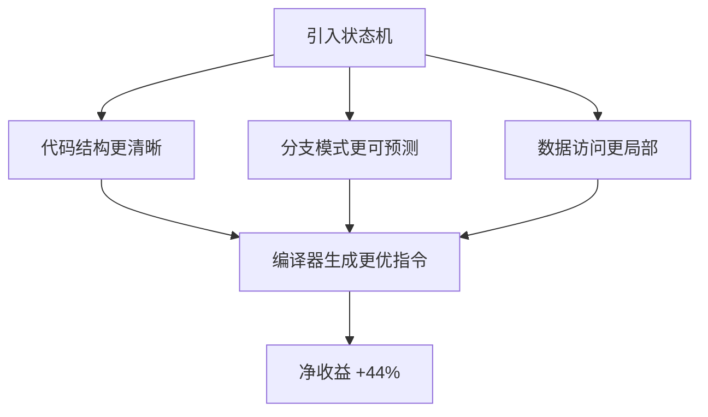
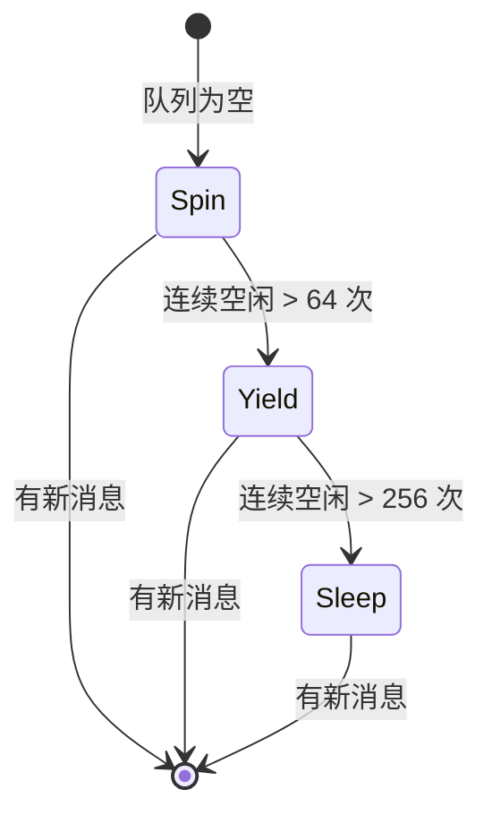
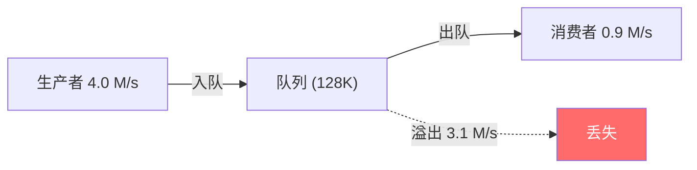
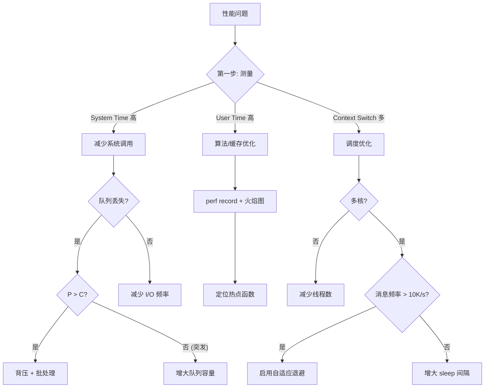

## 结论先行

优化一个无锁 MPSC 消息总线的过程中，我们提炼出五条反直觉的性能原则:

| # | 原则 | 反直觉之处 | 参考收益 |
|---|------|-----------|---------|
| 1 | 状态机是性能工具 | 增加复杂度反而提升性能 | +44% 吞吐 |
| 2 | 上下文切换是隐藏杀手 | 多线程不等于高性能 | -85.6% 切换次数 |
| 3 | 速率平衡才是关键 | 增大队列无法解决丢失 | 丢失率 78% → 0% |
| 4 | 测量方法决定优化方向 | CPU 占用高不等于瓶颈 | 避免南辕北辙 |
| 5 | 优化存在适用边界 | 好的优化换个场景可能有害 | 单核下 -50% |

这些原则不限于消息队列，适用于任何需要处理高频数据流的系统: 网络协议栈、传感器数据管线、数据库引擎、实时音视频处理。

下文逐一展开，每个原则包含案例数据、原理分析和适用边界。

> 注: 本文中的性能数据来自特定优化场景，不同平台和负载下数值会有差异。数据用于说明原则的方向性，而非精确的可复现基准。具体优化效果需在目标环境中实测验证。

## 原则 1: 状态机不仅是逻辑工具，更是性能工具

### 常识 vs 现实

多数工程师认为状态机是一种逻辑抽象工具 -- 增加代码复杂度，换取可维护性。但优化案例中的数据讲了一个不同的故事:

| 实现方式 | 吞吐量 | 延迟 | 性能差异 |
|---------|--------|------|---------|
| 无状态机 (if-else 链) | 1.22 M/s | 820 ns | 基准 |
| 有状态机 (状态原子读) | 1.76 M/s | 567 ns | +44% |

44% 的性能提升不是来自状态机本身，而是来自状态机带来的代码结构变化。

### 关键区分: 状态检查 vs 状态转换

性能差异的根源在于如何使用状态机。错误用法是让每条消息都触发状态转换:

```cpp
// 错误: 每条消息触发状态机事件 (~600ns 开销)
void on_message(const Data& data) {
    hsm_.process_event(MessageEvent{data});  // 状态查找 + guard 求值 + 转换
}
```

正确用法是将状态机限定在低频控制面，数据面只做原子读:

```cpp
// 正确: 数据面只读取状态 (~20ns 开销)
void on_message(const Data& data) {
    auto state = current_state_.load(std::memory_order_acquire);
    if (state == State::kRunning) {
        process(data);  // 直接处理，无状态机开销
    }
    // 状态转换由独立的控制线程/事件驱动，频率低几个数量级
}
```

### 性能提升的三个来源

状态机带来的 44% 提升并非单一因素，而是三个效应叠加:



1. 分支预测命中率提升 -- 状态变量通常长时间保持不变，CPU 分支预测器几乎 100% 命中
2. 缓存局部性改善 -- 状态检查集中在一个 cache line 的原子变量上，而 if-else 链可能散布在多个条件判断中
3. 编译器优化空间增大 -- 清晰的状态分支让编译器更容易做死代码消除和指令重排

单次状态检查开销约 20ns (一次 `acquire` load)，但编译器优化带来的收益约 200ns/消息。净收益 +180ns。

### 适用边界

| 场景 | 是否适用 | 原因 |
|------|---------|------|
| 网络连接状态管理 | 适用 | 状态转换频率远低于数据包频率 |
| 任务调度器生命周期 | 适用 | 状态变化是秒级事件 |
| 每个数据包触发状态转换 | 不适用 | 状态机开销 > 收益 |
| 纯计算密集型热路径 | 不适用 | 没有状态可管理 |

核心原则: **状态机管理低频控制面，数据面只做原子读。两者频率差至少两个数量级。**

## 原则 2: 上下文切换是隐藏的性能杀手

### 一个令人困惑的优化结果

优化前后的 `/usr/bin/time -v` 输出几乎一样:

| 指标 | 优化前 | 优化后 |
|------|--------|--------|
| User Time | 9.07s | 9.07s |
| System Time | 1.01s | 1.01s |
| CPU | 166% | 166% |
| **上下文切换** | **48,261** | **6,938** |

CPU 时间完全相同，但上下文切换减少了 85.6%。这个差异在传统 profiling 中完全不可见 -- 它不会出现在火焰图里，不会被 `perf top` 捕获，却实实在在地影响着尾延迟。

### 上下文切换的真实成本

单次上下文切换的成本远超寄存器保存/恢复 (以下为典型 Linux x86_64 估算值):

```
单次上下文切换:
  直接成本:  1-5 us   (保存/恢复寄存器、切换页表)
  间接成本: 10-100 us (L1/L2 缓存失效、TLB 刷新、流水线排空)
  典型总成本: ~50 us

48,261 次切换的累积成本:
  48,261 x 50 us = 2.4 秒 (在 5 秒测试窗口中占 48%)
```

间接成本是直接成本的 10-20 倍。缓存失效意味着切换回来后，前几百次内存访问都是 cache miss，每次 miss 在 ARM 平台上约 50-100ns。

### 自适应退避: 用可控的 CPU 换不可控的延迟

解决方案不是消除 sleep，而是在高频和低频之间自适应切换:

```cpp
class AdaptiveBackoff {
    enum class Phase { kSpin, kYield, kSleep };

    Phase phase_ = Phase::kSpin;
    uint32_t idle_count_ = 0;

    static constexpr uint32_t kSpinThreshold  = 64;    // 自旋次数上限
    static constexpr uint32_t kYieldThreshold = 256;   // yield 次数上限

public:
    void wait() {
        ++idle_count_;

        if (idle_count_ < kSpinThreshold) {
            // 阶段 1: 纯自旋，~10ns/次，适合消息即将到达的场景
            for (int i = 0; i < 32; ++i) {
                #if defined(__x86_64__)
                __builtin_ia32_pause();
                #elif defined(__aarch64__)
                asm volatile("yield");
                #endif
            }
        } else if (idle_count_ < kYieldThreshold) {
            // 阶段 2: 让出时间片但不 sleep，~1us
            std::this_thread::yield();
        } else {
            // 阶段 3: 真正 sleep，触发上下文切换
            std::this_thread::sleep_for(std::chrono::milliseconds(1));
        }
    }

    void reset() { idle_count_ = 0; }
};
```

三阶段退避的状态转换:



### 收益的数学模型

自适应退避是否值得，取决于消息到达间隔:

```
收益 = 节省的上下文切换成本 - 自旋消耗的 CPU 时间

高频场景 (消息间隔 < 100us):
  节省: 50us (一次上下文切换)
  消耗: 64 x 10ns = 0.64us (自旋)
  净收益: +49.36us

低频场景 (消息间隔 > 100ms):
  节省: 0 (无论如何都会 sleep)
  消耗: 64 x 10ns + 256 x 1us = 256.64us (白白自旋)
  净收益: -256.64us
```

**适用条件: 消息到达频率 > 10K/s，且有空闲 CPU 核心。** 单核系统上自旋会阻止生产者线程运行，性能反而下降 50%。

## 原则 3: 生产者-消费者必须满足速率平衡

### 增大队列是最常见的错误直觉

面对消息丢失，第一反应通常是增大队列容量。某次优化中的对比数据:

| 配置 | 队列容量 | 生产速率 | 消费速率 | 丢失率 |
|------|---------|---------|---------|--------|
| A | 128K | 4.0 M/s | 0.9 M/s | 78% |
| B | 128K | 1.0 M/s | 1.1 M/s | 0% |
| C | 1M | 4.0 M/s | 0.9 M/s | 78% |

配置 C 将队列扩大 8 倍，丢失率纹丝不动。配置 B 队列不变，只是让消费速率超过生产速率，丢失率归零。

### 数学本质: 队列是缓冲器，不是解决方案

当生产速率 P > 消费速率 C 时，队列填充速率恒为正:

```
填充速率 = P - C

配置 A: 4.0 - 0.9 = 3.1 M msg/s
  128K 队列填满时间 = 131,072 / 3,100,000 = 42ms
  之后每秒丢失 3.1M 条消息

配置 C: 同样 3.1 M msg/s 填充速率
  1M 队列填满时间 = 1,048,576 / 3,100,000 = 338ms
  之后丢失率与配置 A 完全相同
```

增大队列只是把问题从 42ms 后推迟到 338ms 后。在持续运行的系统中，这个延迟毫无意义。



### 三种解决方案

**方案 1: 背压 (Backpressure)** -- 让生产者感知队列压力

```cpp
bool publish_with_backpressure(const Message& msg) {
    uint32_t utilization = queue_.size() * 100 / queue_.capacity();

    if (utilization > 90) {
        return false;  // 拒绝入队，让调用者决定重试策略
    }
    if (utilization > 75) {
        std::this_thread::sleep_for(std::chrono::microseconds(10));  // 减速
    }

    return queue_.try_push(msg);
}
```

**方案 2: 批处理提升消费速率** -- 减少每条消息的固定开销

```cpp
// 单条处理: 每条消息承担一次函数调用 + 缓存预热开销
// 批处理: N 条消息分摊一次开销
void consume_batch() {
    Message batch[2048];
    uint32_t count = queue_.try_pop_batch(batch, 2048);

    for (uint32_t i = 0; i < count; ++i) {
        process(batch[i]);  // 连续内存访问，缓存友好
    }
}
```

**方案 3: 多消费者并行** -- 水平扩展消费能力

```cpp
// 确保 N 个消费者的总速率 > 生产速率
for (uint32_t i = 0; i < num_consumers; ++i) {
    workers.emplace_back([&queue]() {
        while (running) {
            consume_batch();
        }
    });
}
```

三种方案不互斥，生产环境通常组合使用: 背压作为安全阀，批处理提升单消费者效率，多消费者应对峰值。

### 适用边界

速率平衡原则有一个例外: **突发流量 (burst)**。如果生产者是突发式的 (例如每秒一次、每次 10K 条消息)，而消费者是匀速的 (10K/s)，那么队列容量确实能解决问题 -- 前提是突发量 < 队列容量，且两次突发之间消费者能清空队列。

判断公式:

```
队列容量 >= 突发量 - (突发间隔 x 消费速率)

例: 突发 10K 条，间隔 1s，消费 10K/s
  需要容量 >= 10K - (1s x 10K/s) = 0  (消费者刚好跟上)

例: 突发 50K 条，间隔 1s，消费 10K/s
  需要容量 >= 50K - (1s x 10K/s) = 40K  (需要 40K 缓冲)
```

## 原则 4: 测量方法决定优化方向

### CPU 占用率的误导性

一个真实的优化案例:

```bash
# 优化前
$ /usr/bin/time -v ./message_bus_bench
User time:              9.07 s
System time:            1.01 s
Percent of CPU:         166%
Voluntary ctx switches: 48,261

# 优化后 (引入自适应退避)
$ /usr/bin/time -v ./message_bus_bench
User time:              9.07 s
System time:            1.01 s
Percent of CPU:         166%
Voluntary ctx switches: 6,938
```

如果只看 CPU 时间和占用率，会得出"没有优化空间"的错误结论。真正的改善隐藏在上下文切换次数中。

### 不同指标指向不同优化方向

| 指标 | 含义 | 优化方向 |
|------|------|---------|
| User Time 高 | 用户态计算密集 | 算法优化、SIMD、缓存对齐 |
| System Time 高 | 系统调用频繁 | 减少 I/O、批量系统调用、io_uring |
| Context Switches 多 | 线程频繁切换 | 自适应退避、减少锁竞争 |
| Cache Misses 高 | 数据局部性差 | 结构体重排、预取、池化 |
| Branch Mispredictions 高 | 分支不可预测 | 无分支编程、查表、likely/unlikely |

### 测量工具链

从粗到细的三级测量:

```bash
# 第一级: 宏观概览 (秒级)
/usr/bin/time -v ./program

# 第二级: 硬件计数器 (指令级)
perf stat -e cycles,instructions,cache-misses,branch-misses,\
context-switches,cpu-migrations ./program

# 第三级: 采样分析 (函数级)
perf record -g -F 99 ./program
perf script | stackcollapse-perf.pl | flamegraph.pl > flame.svg
```

核心原则: **先用第一级确定瓶颈类别 (计算/IO/调度)，再用第二级量化具体指标，最后用第三级定位热点函数。** 跳过前两步直接看火焰图，容易在错误的方向上深挖。

## 原则 5: 每种优化都有适用边界

### 同一优化在不同场景下的表现

以自旋等待为例:

| 场景 | 效果 | 原因 |
|------|------|------|
| 多核 + 高频 (>10K/s) | +85.6% 减少切换 | 有空闲核心承担自旋，消息快速到达 |
| 单核 + 高频 | -50% 吞吐 | 自旋占用唯一核心，阻止生产者运行 |
| 多核 + 低频 (<1K/s) | 浪费 CPU | 自旋期间几乎不会有消息到达 |
| 电池供电设备 | -80% 续航 | 自旋阻止 CPU 进入低功耗状态 |

一个在服务器上表现优异的优化，放到嵌入式设备上可能是灾难。

### 用代码表达适用条件

将优化的适用边界显式编码，而不是靠注释或文档:

```cpp
struct OptimizationContext {
    uint32_t cpu_cores;
    double   message_rate;       // messages/second
    bool     battery_powered;
    double   context_switch_us;  // 平台实测值
};

bool should_enable_spin_wait(const OptimizationContext& ctx) {
    // 条件 1: 多核 (自旋不能阻塞生产者)
    if (ctx.cpu_cores <= 1) return false;

    // 条件 2: 高频 (自旋期间消息大概率到达)
    constexpr double kSpinDurationUs = 0.64;  // 64 次 x 10ns
    double msg_interval_us = 1e6 / ctx.message_rate;
    if (kSpinDurationUs > msg_interval_us * 0.1) return false;

    // 条件 3: 非电池供电 (自旋阻止 CPU 休眠)
    if (ctx.battery_powered) return false;

    // 条件 4: 收益为正
    return ctx.context_switch_us > kSpinDurationUs;
}
```

### 运行时自适应

更好的做法是让系统在运行时根据实际负载自动调整:

```cpp
class AdaptiveStrategy {
    std::atomic<uint64_t> ctx_switches_per_sec_{0};
    std::atomic<uint64_t> queue_utilization_pct_{0};
    bool spin_enabled_ = false;
    bool backpressure_enabled_ = false;

public:
    void adjust() {
        // 上下文切换过多 → 启用自旋
        if (ctx_switches_per_sec_ > 10000 && !spin_enabled_) {
            spin_enabled_ = true;
        } else if (ctx_switches_per_sec_ < 1000 && spin_enabled_) {
            spin_enabled_ = false;
        }

        // 队列压力过大 → 启用背压
        if (queue_utilization_pct_ > 75 && !backpressure_enabled_) {
            backpressure_enabled_ = true;
        } else if (queue_utilization_pct_ < 50 && backpressure_enabled_) {
            backpressure_enabled_ = false;
        }
    }
};
```

核心原则: **优化策略应该是条件化的，而不是无条件启用的。** 最好的系统不是"最快的"，而是"在当前条件下最合适的"。

## 优化决策树

将五个原则串联成一个实用的决策流程:



## 实践清单

将五个原则转化为可执行的检查项:

1. **状态机分离** -- 检查热路径中是否有状态转换逻辑。如果有，将状态转换移到控制面，数据面只做原子读
2. **上下文切换审计** -- 用 `/usr/bin/time -v` 检查 voluntary context switches。超过 10K/s 考虑自适应退避
3. **速率平衡验证** -- 计算生产速率和消费速率。如果 P > C，增大队列只是延迟问题，需要背压或提升消费能力
4. **多维度测量** -- 不要只看 CPU 占用率。User Time、System Time、Context Switches、Cache Misses 各指向不同瓶颈
5. **边界条件测试** -- 在目标平台的最差条件下 (单核、低频、电池) 验证优化是否仍然有效

---

测试环境: Linux 6.8.0, GCC 13.3.0, x86_64
数据来源: 无锁 MPSC 消息总线优化案例，数值因平台和负载而异
