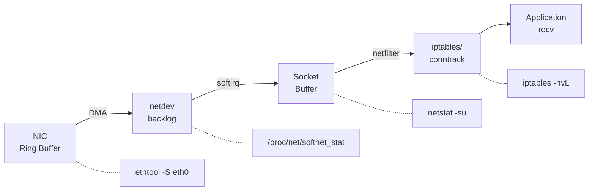
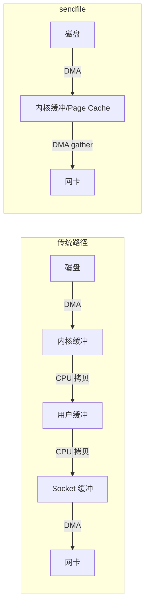

> 参考:
> - [Why do UDP packets get dropped?](https://jvns.ca/blog/2016/08/24/find-out-where-youre-dropping-packets/) (Julia Evans, 2016)
> - [Finding out if/why a server is dropping packets](https://jvns.ca/blog/2017/09/05/finding-out-where-packets-are-being-dropped/) (Julia Evans, 2017)
> - [Monitoring and Tuning the Linux Networking Stack](https://blog.packagecloud.io/monitoring-tuning-linux-networking-stack-receiving-data/)
> - [陈硕: 谈一谈网络编程学习经验](https://blog.csdn.net/solstice/article/details/6527585)
>
> 相关: [ARM-Linux 网络性能优化实战](../arm_linux_network_optimization/) | [TCP Short Write 环形缓冲区方案](../tcp_ringbuffer_short_write/)
>
> **定位差异**: [ARM-Linux 网络性能优化](../arm_linux_network_optimization/) 侧重**调优** (怎么让网络更快)，本文侧重**排障** (网络出问题时怎么定位原因) 和**高性能传输方案选型**。两篇互补，调优是预防，排障是治疗。

**本文解决的问题**: 嵌入式 Linux 网络程序上线后出现丢包、端口耗尽、传输瓶颈时，如何系统化定位原因并选择合适的优化方案。

**关键结论**:
1. UDP 丢包 90% 发生在 Ring Buffer 溢出和 Socket Buffer 满两个位置，`ethtool -S` + `netstat -su` 可以在 10 秒内定位
2. TIME_WAIT 问题的根因是架构设计 (谁主动关闭)，不是调内核参数；`tcp_tw_reuse=1` 是安全的，`tcp_tw_recycle` 已废弃
3. 零拷贝三种方案各有适用场景: sendfile 用于文件服务，splice 用于代理转发，MSG_ZEROCOPY 用于大缓冲区直发 (>10KB)；同机通信用共享内存直接绕过网络栈
4. dropwatch 是内核丢包的终极定位工具，配合 `perf record -e skb:kfree_skb` 可获取完整调用栈

---

## 1. UDP 丢包全链路诊断

Julia Evans 在 [Why do UDP packets get dropped?](https://jvns.ca/blog/2016/08/24/find-out-where-youre-dropping-packets/) 中提出一个关键观点: **"UDP packets don't get lost by magic"** — 丢包不是 UDP 的天性，而是链路上某个缓冲区满了。她将丢包归纳为三个方向: lost on the way out (发送缓冲区满)、lost in transit (传输途中)、lost on the way in (接收缓冲区满)，并总结出 **"EVERYTHING IS BUFFERS"** — 网卡、backlog 队列、socket buffer、中间路由器，所有环节的丢包本质上都是缓冲区溢出。

本章将这个思路展开为完整的诊断流程。数据包从网卡到应用层依次经过以下可能丢包的位置:



**快速全局诊断** ([Julia Evans, 2017](https://jvns.ca/blog/2017/09/05/finding-out-where-packets-are-being-dropped/)): 在深入各层之前，先用 `netstat -i` 获取每个网卡的丢包全局视图:

```bash
$ netstat -i
Kernel Interface table
Iface    MTU  RX-OK  RX-ERR  RX-DRP  RX-OVR  TX-OK  TX-ERR  TX-DRP  TX-OVR
eth0    1500  1235101   0      242      0     745760    0       0       0
lo     65536   21558    0       0       0      21558    0       0       0
# RX-DRP > 0 表示接收方向有丢包，TX-DRP > 0 表示发送方向有丢包
```

`RX-DRP` 非零说明接收链路有丢包，但不告诉你具体丢在哪一层。下面逐层定位。

### 1.1 网卡 Ring Buffer 溢出

网卡通过 DMA 将数据包写入 Ring Buffer (驱动预分配的 sk_buff 环形队列)。当 CPU 处理中断不够快时，Ring Buffer 写满，新包被网卡硬件直接丢弃。

**诊断:**

```bash
# 查看网卡丢包计数
ethtool -S eth0 | grep -i drop
# rx_dropped: 12345  <-- Ring Buffer 溢出

# 查看当前 Ring Buffer 大小
ethtool -g eth0
```

**调优:**

```bash
# 增大 Ring Buffer (需网卡驱动支持)
ethtool -G eth0 rx 4096
```

### 1.2 netdev_max_backlog 队列满

NAPI poll 将数据包从 Ring Buffer 取出后放入 per-CPU 的 backlog 队列。当 softirq 处理速度跟不上收包速度时，backlog 队列溢出。

**诊断:**

```bash
# 第 2 列 (dropped) 非零表示 backlog 溢出
cat /proc/net/softnet_stat
# 01234567 00000000 00000005 ...
# ^packet  ^dropped ^squeezed
```

**调优:**

```bash
# 默认 1000，高吞吐场景建议 10000-30000
sysctl -w net.core.netdev_max_backlog=10000
```

### 1.3 Socket Buffer 满

协议栈将数据包放入 socket 接收缓冲区。当应用层 `recv()` 不够快时，缓冲区写满，内核丢弃后续包。Julia Evans 用一句话概括了这个机制: *"Your application reads packets out of that buffer and handles them. If the buffer gets full, the packets get dropped. Simple!"*

**诊断:**

```bash
# UDP 丢包统计 (Julia Evans 推荐 netstat -suna)
netstat -su
# Udp:
#     1828608 packets received
#     568 packets to unknown port received.
#     918 packet receive errors   <-- socket buffer 满导致的丢包
#     662721 packets sent
#     RcvbufErrors: 918           <-- 与 receive errors 对应
#     SndbufErrors: 1031          <-- 发送缓冲区满导致的丢包

# 或使用 ss 查看单个 socket 的缓冲区使用
ss -u -a -m
```

**关键参数**: `net.core.rmem_max` 控制 socket 接收缓冲区的上限。`net.ipv4.udp_mem` 的第三个值是所有 UDP socket 可用的总页数上限。

**调优:**

```bash
# 增大 UDP 接收缓冲区 (字节)
sysctl -w net.core.rmem_max=26214400
sysctl -w net.core.rmem_default=26214400

# 应用层也可以显式设置
# setsockopt(fd, SOL_SOCKET, SO_RCVBUF, &size, sizeof(size));
```

### 1.4 iptables/netfilter 丢弃

防火墙规则可能静默丢包，且不会体现在上述计数器中。

**诊断:**

```bash
# 查看所有规则的包计数
iptables -nvL
# 关注 DROP/REJECT 规则的 pkts 列

# conntrack 表满也会丢包
dmesg | grep conntrack
sysctl net.netfilter.nf_conntrack_count
sysctl net.netfilter.nf_conntrack_max
```

**调优:**

```bash
# 增大 conntrack 表
sysctl -w net.netfilter.nf_conntrack_max=262144
```

### 1.5 应用层处理过慢

应用层 `recv()` 调用频率不够，或处理逻辑阻塞了事件循环，导致 socket buffer 持续堆积。这不是内核问题，而是应用架构问题。

**排查思路:**

- 确认事件循环中没有阻塞操作 (磁盘 I/O、锁竞争)
- 使用 epoll 边缘触发 + 批量读取
- 考虑多线程收包或 SPSC 队列解耦收包与处理

---

## 2. TCP TIME_WAIT 排障与优化

### 2.1 为什么存在 TIME_WAIT

TCP 连接主动关闭方在发送最后一个 ACK 后进入 TIME_WAIT 状态，等待 2MSL (通常 60 秒)。目的:

1. **确保最后的 ACK 到达对端**: 如果 ACK 丢失，对端会重发 FIN，TIME_WAIT 状态可以重新响应
2. **防止旧连接的延迟报文污染新连接**: 2MSL 确保网络中该连接的所有报文都已过期

### 2.2 问题场景

高频短连接场景 (如 HTTP/1.0 客户端) 中，主动关闭方会累积大量 TIME_WAIT socket，导致:

- **端口耗尽**: 本地端口范围默认 32768-60999，约 28000 个端口，每个 TIME_WAIT 占用 60 秒
- **内存占用**: 每个 TIME_WAIT socket 约占 ~0.5KB 内核内存

**诊断:**

```bash
# 统计 TIME_WAIT 数量
ss -s
# 或
ss -tan state time-wait | wc -l
```

### 2.3 内核参数调优

```bash
# 允许 TIME_WAIT socket 复用 (仅对客户端有效)
sysctl -w net.ipv4.tcp_tw_reuse=1

# 扩大本地端口范围
sysctl -w net.ipv4.ip_local_port_range="1024 65535"

# 限制 TIME_WAIT 总数 (超出后直接销毁)
sysctl -w net.ipv4.tcp_max_tw_buckets=262144
```

**tcp_tw_recycle 已废弃**: Linux 4.12 移除了 `tcp_tw_recycle`。该选项依赖 TCP 时间戳判断连接新旧，在 NAT 环境下，不同客户端共享同一 IP 但时间戳不同，导致合法连接被拒绝。

### 2.4 架构层面的优化

- **让客户端主动关闭连接**: TIME_WAIT 分散到各客户端，服务端不积压
- **服务端用定时器踢掉超时连接**: 而非主动 close()
- **使用长连接**: HTTP/1.1 Keep-Alive 或 HTTP/2 多路复用，减少连接建立/关闭频率

---

## 3. 零拷贝技术对比

传统的 `read()` + `write()` 数据传输需要 4 次上下文切换和 2 次 CPU 拷贝 (内核缓冲区 <-> 用户缓冲区)。零拷贝技术通过减少或消除 CPU 参与的内存拷贝来提升大数据量传输的性能。

### 3.1 sendfile: 文件到 Socket

```c
#include <sys/sendfile.h>
ssize_t sendfile(int out_fd, int in_fd, off_t *offset, size_t count);
```

- **适用场景**: 静态文件服务 (文件 -> TCP socket)，如 Nginx 的 `sendfile on`
- **限制**: `in_fd` 必须支持 mmap (普通文件)，`out_fd` 必须是 socket
- **内核版本**: Linux 2.2+；2.6.33+ 支持 `in_fd` 为任意文件
- **原理**: 数据从 page cache 直接 DMA 到网卡，不经过用户空间



### 3.2 splice: 管道中转

```c
#include <fcntl.h>
ssize_t splice(int fd_in, off64_t *off_in,
               int fd_out, off64_t *off_out,
               size_t len, unsigned int flags);
```

- **适用场景**: 任意两个文件描述符之间的数据传输，只要其中一个是管道
- **典型用法**: socket -> pipe -> socket (代理场景)
- **内核版本**: Linux 2.6.17+
- **flags**: `SPLICE_F_MOVE` (尝试移动页面而非拷贝)、`SPLICE_F_NONBLOCK`

```c
// proxy 场景: 从 client_fd 转发到 server_fd
int pipefd[2];
pipe(pipefd);
splice(client_fd, NULL, pipefd[1], NULL, 65536, SPLICE_F_MOVE);
splice(pipefd[0], NULL, server_fd, NULL, 65536, SPLICE_F_MOVE);
```

### 3.3 MSG_ZEROCOPY: 用户缓冲区直传

```c
// 发送端
send(fd, buf, len, MSG_ZEROCOPY);

// 接收完成通知 (通过 errqueue)
recvmsg(fd, &msg, MSG_ERRQUEUE);
```

- **适用场景**: 大缓冲区发送 (>10KB 才有收益)，用户态缓冲区直接 DMA
- **内核版本**: Linux 4.14+ (TCP)，4.18+ (UDP)
- **注意**: 需要 `setsockopt(fd, SOL_SOCKET, SO_ZEROCOPY, &one, sizeof(one))`
- **代价**: 完成通知机制增加编程复杂度；小包场景下 notification 开销反而导致性能下降

### 3.4 对比总结

| 特性 | sendfile | splice | MSG_ZEROCOPY |
|------|----------|--------|--------------|
| 数据源 | 文件 | 任意 fd (需 pipe) | 用户缓冲区 |
| 目标 | socket | 任意 fd (需 pipe) | socket |
| CPU 拷贝 | 0 | 0 | 0 |
| 上下文切换 | 2 (1 次 syscall) | 4 (2 次 syscall) | 2+ (含通知) |
| 内核版本 | 2.2+ | 2.6.17+ | 4.14+ |
| 最佳场景 | 文件服务 | 代理转发 | 大缓冲区直发 |

### 3.5 同机通信的终极方案: 共享内存

上述三种零拷贝技术仍然经过内核网络栈 (协议处理、socket buffer、softirq)。对于同机进程间通信，[newosp](https://github.com/DeguiLiu/newosp) 的共享内存 transport 使用 lock-free SPSC ring buffer 完全绕过网络栈:

- **零拷贝 + 零系统调用**: 生产者直接写入共享内存，消费者直接读取，数据路径上无 syscall 开销
- **崩溃恢复**: `CreateOrReplace` 语义，进程重启后自动重建共享内存段，无需外部监控
- **ARM 单核优化**: 无 D-Cache 的 MCU 使用 relaxed 原子序 + `atomic_signal_fence` 替代硬件 DMB，避免不必要的内存屏障开销

ARM Cortex-A53 实测: 共享内存 transport 延迟 <1us，TCP loopback ~30us，差距约 30 倍。当同机通信是瓶颈时，共享内存比调优 TCP 参数更有效。详见 [共享内存 IPC 与无锁环形缓冲区](../shared_memory_ipc_lockfree_ringbuffer/)。

---

## 4. dropwatch 实战

[dropwatch](https://github.com/nhorman/dropwatch) 是一个基于内核 tracepoint 的丢包监控工具，能精确定位丢包发生在内核协议栈的哪个函数。相比 `netstat -su` 只能看到聚合计数，dropwatch 提供函数级别的丢包定位。

### 4.1 安装

```bash
# Debian/Ubuntu
apt install dropwatch

# CentOS/RHEL
yum install dropwatch

# 从源码编译
git clone https://github.com/nhorman/dropwatch.git
cd dropwatch && ./autogen.sh && ./configure && make && make install
```

### 4.2 基本使用

```bash
# 启动交互模式 (需要 root)
dropwatch -l kas

# 进入后:
dropwatch> start
# 输出示例:
# 1 drops at tcp_v4_rcv+0x1a (0xffffffff816a43ea)
# 5 drops at nf_hook_slow+0xd2 (0xffffffff8169b4e2)
# 3 drops at __udp4_lib_rcv+0x...

dropwatch> stop
dropwatch> exit
```

### 4.3 输出解读

输出格式: `N drops at <内核函数名>+<偏移>`

| 丢包位置 (函数名) | 含义 | 对应章节 |
|---|---|---|
| `__netif_receive_skb_core` | 网卡驱动层丢弃 | 1.1 Ring Buffer |
| `enqueue_to_backlog` | netdev backlog 满 | 1.2 backlog |
| `__udp4_lib_rcv` | UDP socket buffer 满 | 1.3 Socket Buffer |
| `udp_queue_rcv_skb` | UDP 接收队列溢出 | 1.3 Socket Buffer |
| `nf_hook_slow` | netfilter/iptables 规则丢弃 | 1.4 iptables |
| `tcp_v4_rcv` | TCP 层丢弃 (RST/无监听端口) | TCP 协议栈 |
| `nf_conntrack_in` | conntrack 表满 | 1.4 conntrack |
| `ip_rcv_finish` | IP 层路由查找失败 | 路由配置 |

### 4.4 配合 perf 获取完整调用栈

dropwatch 输出的函数名有时不够直观，配合 `perf` 追踪 `kfree_skb` 事件可以获取完整调用栈:

```bash
# 记录 10 秒内所有 skb 丢弃事件及调用栈
perf record -e skb:kfree_skb -a -g -- sleep 10

# 查看调用栈
perf script

# 输出示例:
# swapper  0 [001] 12345.678: skb:kfree_skb:
#   ffffffff816a1234 kfree_skb
#   ffffffff816a5678 __udp4_lib_rcv
#   ffffffff8169abcd ip_local_deliver_finish
#   ffffffff8169ef01 ip_rcv_finish
#   ...
```

这样可以看到完整的内核调用链，精确定位丢包原因。

---

## 5. 嵌入式网络工程实践

本节集中讨论在 [sockpp](https://github.com/DeguiLiu/sockpp) 和 [newosp](https://github.com/DeguiLiu/newosp) 项目中解决上述问题的工程方案。

### 5.1 应用层丢包检测: newosp 帧协议

内核计数器 (`netstat -su`, `ethtool -S`) 只能告诉你"丢了多少包"，无法区分"网络丢包"和"应用处理过慢导致的丢弃"。newosp transport 层的 v1 帧协议通过在帧头中嵌入 `seq_num` 和 `timestamp` 解决了这个问题:

```
v0 header (14B): magic(4) + length(4) + type_index(2) + sender_id(4)
v1 header (26B): v0 + seq_num(8) + timestamp(4)
```

接收端检查 `seq_num` 连续性即可检测丢包和乱序，`timestamp` 差值给出传输延迟。与 dropwatch 的内核态追踪形成互补: dropwatch 定位丢包在内核哪个函数，帧协议定位丢包在业务哪个环节。

### 5.2 RAII socket 与 TIME_WAIT 控制

sockpp 通过 RAII 管理 socket 生命周期，v2.0 的 `result<T>` 类型适合嵌入式 `-fno-exceptions` 场景:

```cpp
{
    auto res = sockpp::tcp_connector::connect({"localhost", 12345});
    if (!res) {
        log_error("connect: {}", res.error().message());
        return;
    }
    auto conn = std::move(res.value());
    conn.write(data, len);
}  // 析构自动 close(fd)
```

RAII 保证了 socket 不泄漏，但也意味着作用域结束时立即触发 TCP 四次挥手。对于短连接场景，这会累积 TIME_WAIT。解决方案: 在服务端设计上让客户端主动关闭 (2.4 节)，或使用长连接复用。

### 5.3 同机通信: 共享内存替代 TCP

详见 3.5 节。newosp 的共享内存 transport 在 ARM Cortex-A53 上实测延迟 <1us，比 TCP loopback (~30us) 快约 30 倍。工程上的关键设计: `CreateOrReplace` 语义实现进程崩溃后自动恢复共享内存段，无需外部监控。

### 5.4 应用层 checksum 的必要性

TCP 的 16-bit checksum 强度不足。路由器内存 bit flip 可导致 payload 损坏但 checksum 仍然通过 (Amazon S3 在 2008 年因此导致数据损坏事故)。newosp 帧协议在帧头使用 magic bytes (`0x4F535000`) 进行帧边界校验，对于关键数据建议在应用层补充 CRC32 校验。

---

## 6. 延伸阅读

陈硕 (muduo 网络库作者) 的[《谈一谈网络编程学习经验》](https://blog.csdn.net/solstice/article/details/6527585)是网络编程领域的经典综述，提出了几个有实践价值的观点:

- **TCP 编程的本质是处理"三个半事件"**: 连接建立、断开、消息到达、消息发送完毕 (半个)。程序员应专注事件处理中的业务逻辑，而非 Sockets API 细节
- **80% 的网络编程问题与 API 无关**: 根因是对 TCP/IP 协议理解不足。掌握 tcpdump 能解决大部分线上问题
- **必练三个例子**: echo (单连接)、chat (跨连接数据交换)、proxy (双端流控)。复杂度递进，proxy 最接近生产场景

推荐书目: 《TCP/IP Illustrated, Vol.1》(重点 17-24 章)、《Unix Network Programming, Vol.1》、《Effective TCP/IP Programming》(第 6 条 "TCP 是字节流协议" 终结 "粘包" 困惑)。

---

## 参考链接

- [Why do UDP packets get dropped? - Julia Evans (2016)](https://jvns.ca/blog/2016/08/24/find-out-where-youre-dropping-packets/)
- [Finding out if/why a server is dropping packets - Julia Evans (2017)](https://jvns.ca/blog/2017/09/05/finding-out-where-packets-are-being-dropped/)
- [Monitoring and Tuning the Linux Networking Stack](https://blog.packagecloud.io/monitoring-tuning-linux-networking-stack-receiving-data/)
- [Linux 零拷贝技术详解 - 小林 coding](https://xiaolincoding.com/os/8_network_system/zero_copy.html)
- [MSG_ZEROCOPY - Linux 内核文档](https://docs.kernel.org/networking/msg_zerocopy.html)
- [dropwatch - GitHub](https://github.com/nhorman/dropwatch)
- [陈硕: 谈一谈网络编程学习经验](https://blog.csdn.net/solstice/article/details/6527585)
- [sockpp - RAII C++ Socket Library](https://github.com/DeguiLiu/sockpp)
- [newosp - 嵌入式基础设施库](https://github.com/DeguiLiu/newosp)
- [ARM-Linux 网络性能优化实战](../arm_linux_network_optimization/)
- [TCP Short Write 环形缓冲区方案](../tcp_ringbuffer_short_write/)
