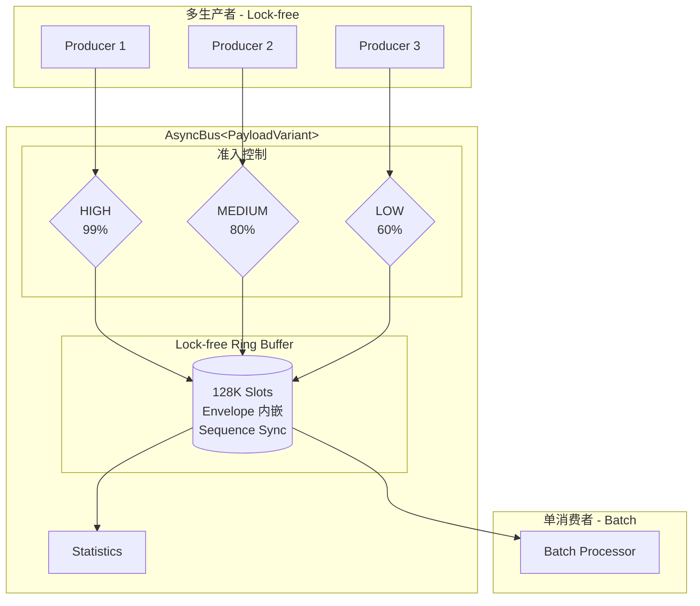
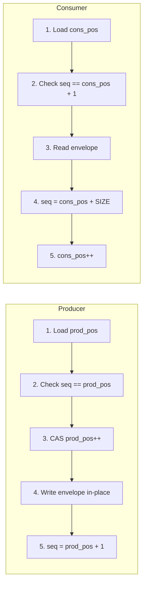
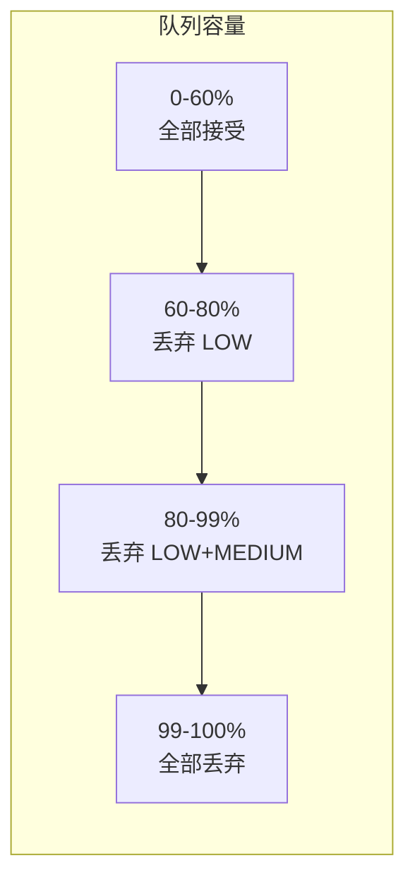

## 问题: 嵌入式系统需要什么样的消息总线

在工业嵌入式系统 (激光雷达、机器人控制、边缘计算) 中，组件间通信面临一组相互矛盾的约束：

- **确定性延迟**: 电机控制回路要求微秒级响应，不允许偶发的毫秒级抖动。
- **零动态分配**: 热路径上的 `malloc`/`new` 会引入不可预测的延迟，且在某些 MCU 平台上根本不可用。
- **多生产者安全**: 多个传感器线程同时发布数据，总线必须保证线程安全。
- **优先级区分**: 紧急停止指令不能因日志消息占满队列而被丢弃。
- **可裁剪**: 同一套代码需要运行在 64 核 Linux 服务器和单核 Cortex-M MCU 上。

传统方案要么用 `std::mutex` 加锁 (延迟不确定)，要么用 `std::function` + `std::unordered_map` 做回调管理 (堆分配不可控)。MCCC (Message-Centric Component Communication) 的设计目标，就是在不引入任何外部依赖的前提下，用纯 C++17 同时满足上述所有约束。

本文将从核心设计决策出发，剖析 MCCC 消息总线的架构与工程权衡。这些设计后来被 [newosp](https://github.com/DeguiLiu/newosp) 框架采纳，在更大规模的工业系统中得到验证。

## 架构总览

MCCC 的核心是一条 **Lock-free MPSC (Multi-Producer, Single-Consumer) Ring Buffer**，所有设计决策围绕它展开：



用户通过 `std::variant` 定义自己的消息载荷类型，AsyncBus 以此为模板参数实例化。这个设计使得消息类型在编译期完全确定，为后续的零堆分配和编译期分发奠定基础。

```cpp
struct SensorData { float temp; };
struct MotorCmd   { int speed; };
using MyPayload = std::variant<SensorData, MotorCmd>;
using MyBus = mccc::AsyncBus<MyPayload>;
```

## 决策一: Lock-free MPSC vs 互斥锁

### 为什么不用 mutex

`std::mutex` 的问题不在于"慢"，而在于**不可预测**。在 Linux SCHED_OTHER 调度下，持有锁的线程可能被抢占，导致其他生产者等待不确定时长。对于需要确定性延迟的实时系统，这是不可接受的。

Lock-free 的保证是：即使某个线程被挂起，其他线程仍能继续推进。代价是实现复杂度显著增加。

### Sequence-based Ring Buffer

MCCC 的 Ring Buffer 借鉴了 Disruptor 的序列号同步机制。每个槽位内嵌一个原子序列号，生产者和消费者通过序列号协调，无需额外的锁：



生产者用 `compare_exchange_weak` (CAS) 竞争槽位，写入后将序列号推进到 `pos + 1`，通知消费者数据就绪。消费者读取后将序列号推进到 `pos + SIZE`，表示槽位可被复用。

关键权衡：CAS 在高竞争下会退化 (自旋重试)，但 MPSC 场景下消费者只有一个，竞争仅存在于生产者之间，实际冲突率远低于 MPMC。

## 决策二: Envelope 内嵌 -- 零堆分配的核心

这是 MCCC 最重要的设计决策。

传统消息队列将消息指针存入队列，消息本体在堆上分配。每条消息至少一次 `new` + 一次 `delete`，在高吞吐场景下 (数十 M/s)，内存分配器成为瓶颈。

MCCC 的做法是将 `MessageEnvelope<PayloadVariant>` 直接内嵌到 Ring Buffer 的槽位中：

```cpp
struct MCCC_ALIGN_CACHELINE RingBufferNode {
    std::atomic<uint32_t> sequence{0U};
    MessageEnvelope<PayloadVariant> envelope;  // 直接内嵌，非指针
};
```

这意味着：消息数据直接写入预分配的环形缓冲区，发布路径上**零堆分配**。代价是 Ring Buffer 的内存占用等于 `槽位数 x envelope 大小`，需要在启动时一次性分配。对于嵌入式系统，这恰好是期望的行为 -- 资源在初始化时确定，运行时不再变化。

Envelope 内嵌还带来一个隐含收益：数据局部性。连续处理的消息在内存中物理相邻，对 CPU Cache 友好。

## 决策三: 编译期类型索引替代 unordered_map

消息总线需要根据消息类型分发到对应的回调函数。常见做法是 `std::unordered_map<std::type_index, std::vector<callback>>`，但这引入了两个问题：哈希表查找的不确定延迟，以及 `std::vector` 的动态分配。

MCCC 利用 `std::variant` 的编译期特性，用模板元编程计算类型索引：

```cpp
// 编译期计算: VariantIndex<SensorData, MyPayload>::value == 0
//             VariantIndex<MotorCmd, MyPayload>::value == 1
template <typename T, typename Variant>
struct VariantIndex;

// 固定回调表 (栈上分配)
std::array<CallbackSlot, MCCC_MAX_MESSAGE_TYPES> callback_table_;
```

类型到索引的映射在编译期完成，运行时的分发退化为一次数组下标访问 -- O(1) 且完全确定。

## 决策四: FixedFunction 替代 std::function

`std::function` 的 Small Buffer Optimization (SBO) 阈值通常只有 16 字节 (libstdc++)。一旦 lambda 捕获超过这个大小 (例如捕获一个 `this` 指针加几个成员)，就会触发堆分配。更糟糕的是，这个行为在不同标准库实现中不一致。

MCCC 实现了 `FixedFunction<Sig, Capacity>`，将 SBO 容量提升到 64 字节，并用 `static_assert` 在编译期拒绝超容量的 callable：

| 特性 | `std::function` | `FixedFunction<Sig, 64>` |
|------|:---:|:---:|
| 堆分配 | 可能 (>16B) | **永不** |
| 超容量行为 | 运行时 malloc | **编译期报错** |
| 异常路径 | 有 (bad_function_call) | **无** |
| 虚函数表 | 有 | **函数指针 Ops 表** |

内部使用函数指针三元组 (destroy/move/invoke) 替代虚基类，消除了 vtable 间接寻址的开销。在 `-fno-rtti -fno-exceptions` 环境下，这套方案比 `std::function` 更轻量，且行为完全可预测。

## 决策五: 优先级准入控制

嵌入式系统中，并非所有消息同等重要。当队列接近满载时，日志消息应该首先被丢弃，而紧急停止指令必须尽可能送达。

MCCC 采用**容量预留策略**，为不同优先级设定准入阈值：



| 队列深度 | LOW | MEDIUM | HIGH |
|----------|-----|--------|------|
| 0-60% | Accept | Accept | Accept |
| 60-80% | Drop | Accept | Accept |
| 80-99% | Drop | Drop | Accept |
| 99-100% | Drop | Drop | Drop |

阈值的选取是一个工程判断：HIGH 预留 99% 容量意味着只有在队列几乎完全满载时才可能丢失；LOW 仅使用前 60% 容量，在系统压力上升时率先被牺牲。这个策略保证了关键消息在极端负载下的可达性，同时避免了复杂的优先级队列数据结构。

准入检查本身引入约 3-5 ns 的开销。为了降低这个开销，MCCC 使用了**索引缓存**：生产者侧缓存消费者位置，仅当缓存估算超过阈值时才跨核读取真实的 `consumer_pos_`，减少了 cache line bouncing。

## 决策六: SPSC Wait-free 快速路径

当系统确认只有一个生产者时 (通过编译宏 `MCCC_SINGLE_PRODUCER=1`)，CAS 循环是多余的。MCCC 在编译期切换到 wait-free 路径：

```cpp
// MPSC: CAS 循环竞争槽位
do {
    prod_pos = producer_pos_.load(std::memory_order_relaxed);
    // ... 序列号检查 ...
} while (!producer_pos_.compare_exchange_weak(prod_pos, prod_pos + 1U, ...));

// SPSC: wait-free，无 CAS
prod_pos = producer_pos_.load(std::memory_order_relaxed);
// ... 序列号检查 ...
producer_pos_.store(prod_pos + 1U, std::memory_order_relaxed);
```

SPSC 路径将 `compare_exchange_weak` 替换为普通的 `store`，完全消除了 CAS 的自旋重试开销。实测 SPSC BARE_METAL 吞吐量比 MPSC 高约 31%。

## 决策七: ProcessBatchWith -- 编译期 Visitor 分发

MCCC 的常规处理路径 (`ProcessBatch`) 通过 `shared_mutex` 读锁保护回调表，再通过 `FixedFunction` 间接调用回调。这条路径功能完备但存在两层间接调用开销。

对于性能敏感的场景，`ProcessBatchWith<Visitor>` 提供了一条零间接调用路径：绕过回调表和锁，直接使用 `std::visit` 将消息分发到用户提供的 visitor，编译器可以将整条路径内联：

```cpp
class MySensor : public StaticComponent<MySensor, MyPayload> {
public:
    void Handle(const SensorData& d) noexcept { /* ... */ }
    void Handle(const MotorCmd& c) noexcept { /* ... */ }
    // 未定义 Handle 的类型在编译期静默忽略 (SFINAE)
};

MySensor sensor;
auto visitor = sensor.MakeVisitor();
bus.ProcessBatchWith(visitor);  // 全路径可内联
```

这是"为不需要的功能不付费"原则的体现：如果你不需要运行时动态订阅/退订，就不应该为 `shared_mutex` 和间接调用付出代价。

## 决策八: Signal Fence -- 单核 MCU 适配

在多核系统上，`memory_order_acquire/release` 会编译为硬件内存屏障指令 (ARM 的 DMB)。但在单核 Cortex-M MCU 上，核间可见性问题不存在，真正需要防止的只是**编译器重排序**。

MCCC 通过 `MCCC_SINGLE_CORE=1` 切换到 relaxed ordering + `atomic_signal_fence`：

```cpp
#if MCCC_SINGLE_CORE
#define MCCC_MO_ACQUIRE  std::memory_order_relaxed
#define MCCC_MO_RELEASE  std::memory_order_relaxed
inline void AcquireFence() {
    std::atomic_signal_fence(std::memory_order_acquire);  // 编译器屏障，零硬件开销
}
#endif
```

`atomic_signal_fence` 仅约束编译器，不生成任何硬件指令。在单核 MCU 上，这将原子操作的开销降到接近零。

此选项需要用户同时定义 `MCCC_I_KNOW_SINGLE_CORE_IS_UNSAFE=1` 作为安全确认 -- 因为如果在多核平台上误用，将导致数据竞争。这是一个显式的"你知道你在做什么"接口设计。

## 决策九: 编译期配置矩阵

同一套代码需要适配从 64 核服务器到单核 MCU 的不同硬件。MCCC 通过编译宏构建配置矩阵：

| 宏 | 默认值 | 嵌入式建议 | 影响 |
|----|--------|-----------|------|
| `MCCC_QUEUE_DEPTH` | 131072 (128K) | 1024 / 4096 | 内存占用 |
| `MCCC_CACHELINE_SIZE` | 64 | 32 / 0 | 对齐填充 |
| `MCCC_SINGLE_PRODUCER` | 0 | 1 | CAS vs wait-free |
| `MCCC_SINGLE_CORE` | 0 | 1 | DMB vs signal fence |
| `MCCC_MAX_MESSAGE_TYPES` | 8 | 按需 | 回调表大小 |
| `MCCC_MAX_CALLBACKS_PER_TYPE` | 16 | 按需 | 每类型回调数 |

所有配置在编译期确定，运行时零开销。例如在 Cortex-M4 上，一个典型的裁剪配置为：

```bash
cmake .. -DCMAKE_CXX_FLAGS="-DMCCC_QUEUE_DEPTH=4096 -DMCCC_SINGLE_PRODUCER=1 \
  -DMCCC_SINGLE_CORE=1 -DMCCC_I_KNOW_SINGLE_CORE_IS_UNSAFE=1 \
  -DMCCC_CACHELINE_SIZE=0"
```

队列从 128K 缩小到 4K，关闭 CAS 和硬件屏障，去除缓存行填充 -- 在资源受限的 MCU 上最大限度降低内存占用和指令开销。

## 批处理: 减少共享状态更新

消费者的 `ProcessBatch` 是另一个值得关注的优化点。朴素实现中，每处理一条消息就更新一次 `consumer_pos_` 和统计计数器，导致频繁的原子写入。

MCCC 将更新推迟到批次结束：

```cpp
uint32_t ProcessBatch() noexcept {
    uint32_t cons_pos = consumer_pos_.load(std::memory_order_relaxed);
    uint32_t processed = 0U;
    for (uint32_t i = 0U; i < BATCH_PROCESS_SIZE; ++i) {
        if (!ProcessOneInBatch(cons_pos, bare_metal)) break;
        ++cons_pos; ++processed;
    }
    // 循环结束后一次性更新
    consumer_pos_.store(cons_pos, std::memory_order_relaxed);
    stats_.messages_processed.fetch_add(processed, std::memory_order_relaxed);
}
```

一个批次 (默认 1024 条) 只产生两次原子写入，而非 1024 次。这在多核系统上显著减少了 store buffer 压力。

## 性能实测

> 测试环境: Ubuntu 24.04, GCC 13.3, -O3 -march=native, Intel Xeon Cascadelake 64 vCPU.
> SP = `MCCC_SINGLE_PRODUCER`, SC = `MCCC_SINGLE_CORE`.

### 入队吞吐量

| 配置 | SP | SC | FULL_FEATURED | BARE_METAL | 功能开销 |
|------|:--:|:--:|:---:|:---:|:---:|
| **MPSC (默认)** | 0 | 0 | 27.7 M/s (36 ns) | 33.0 M/s (30 ns) | 5.8 ns |
| **SPSC** | 1 | 0 | 30.3 M/s (33 ns) | 43.2 M/s (23 ns) | 9.8 ns |
| **MPSC + 单核** | 0 | 1 | 29.2 M/s (34 ns) | 38.2 M/s (26 ns) | 8.1 ns |
| **SPSC + 单核** | 1 | 1 | 29.4 M/s (34 ns) | 39.9 M/s (25 ns) | 8.9 ns |

FULL_FEATURED 模式包含优先级准入、背压监控和统计计数，是生产环境的默认模式。BARE_METAL 模式剥离所有非核心功能，用于衡量纯队列性能基线。

两点值得注意：SPSC 比 MPSC 快约 31% (CAS 消除)；SINGLE_CORE 比多核快约 15% (relaxed ordering 减少了 store buffer 序列化)。而 FULL_FEATURED 各配置趋于接近 (~28-30 M/s)，说明 `shared_mutex` 读锁成为该模式下的主要瓶颈。

### 端到端延迟 (FULL_FEATURED)

| 配置 | P50 | P95 | P99 | Max |
|------|-----|-----|-----|-----|
| MPSC | 585 ns | 783 ns | 933 ns | 18 us |
| SPSC | 680 ns | 892 ns | 1063 ns | 13 us |
| MPSC + 单核 | **310 ns** | **389 ns** | **442 ns** | 17 us |
| SPSC + 单核 | 625 ns | 878 ns | 1011 ns | 18 us |

MPSC + 单核配置的 P50 仅 310 ns，是默认配置的 53%。在 ARM Cortex-M 上，省去 DMB 硬件屏障的收益会更加显著。

### 背压准入控制

| 优先级 | 发送 | 丢弃率 |
|--------|------|--------|
| HIGH | 30,000 | **0.0%** |
| MEDIUM | 39,321 | 12.6% |
| LOW | 39,320 | 47.6% |

HIGH 优先级消息在压力测试中实现了零丢弃，验证了容量预留策略的有效性。

### 功能开销分解

| 开销项 | 每消息开销 |
|--------|-----------|
| 优先级检查 (含索引缓存) | ~3-5 ns |
| shared_mutex 读锁 | ~3-5 ns |
| 统计计数 (批量) | ~1-2 ns |
| **总功能开销** | ~6-10 ns |

全功能模式的总开销约 6-10 ns/消息。对于大多数嵌入式应用，这个开销是完全可接受的 -- 一个 1 kHz 控制回路的周期为 1 ms，消息传递仅占千分之一。

## 总结与反思

回顾 MCCC 的设计，几个核心权衡贯穿始终：

**编译期确定 vs 运行时灵活**。从 `std::variant` 载荷类型、`FixedFunction` 容量、到 SPSC/单核模式，MCCC 大量使用编译期决策替代运行时分支。这牺牲了一定的灵活性 (例如不能在运行时改变队列深度)，但换来了可预测的性能和零运行时开销。

**内存预分配 vs 按需分配**。Envelope 内嵌意味着启动时一次性分配全部 Ring Buffer 内存。在资源受限的 MCU 上，这可能是一个问题 (128K 槽位 x 消息大小)，因此提供了 `MCCC_QUEUE_DEPTH` 宏允许缩小队列。

**功能完备 vs 极致性能**。FULL_FEATURED 和 BARE_METAL 两种模式，以及 `ProcessBatch` 和 `ProcessBatchWith` 两条处理路径，让用户在功能和性能之间做出显式选择，而非用一个"一刀切"的方案。

这些设计决策不是在真空中做出的。它们源自嵌入式系统开发中反复遇到的实际问题：不可预测的锁等待、不受控的堆分配、跨平台移植时的性能陷阱。MCCC 的架构思想后来被 [newosp](https://github.com/DeguiLiu/newosp) 框架在更广泛的场景中采纳和演化，包括 Lock-free MPSC Bus、FixedFunction SBO 回调、编译期配置矩阵等核心机制，在近千个测试用例下通过了 ASan/UBSan/TSan 验证。

> 参考: [mccc-bus](https://gitee.com/liudegui/mccc-bus)
