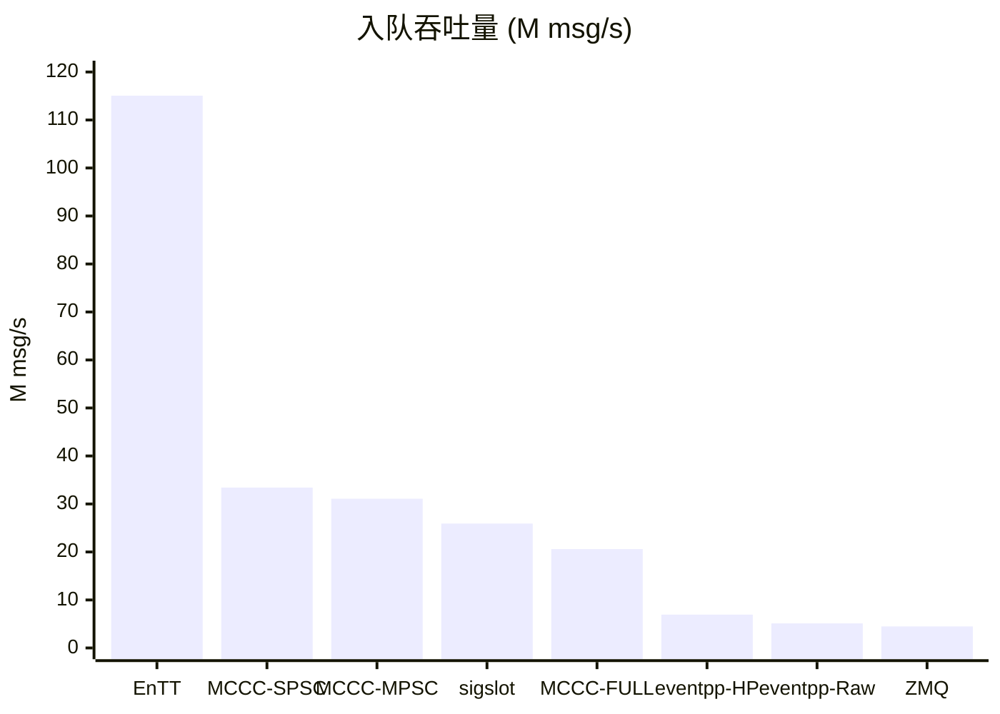
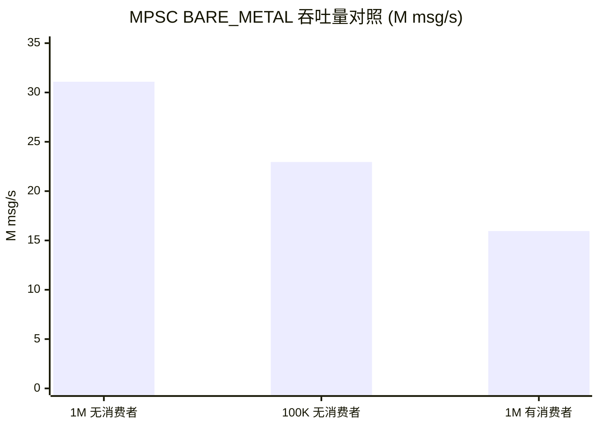
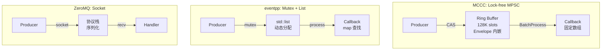

> 测试环境: Ubuntu 24.04, GCC 13.3, `-O3 -march=native`, Intel Xeon 64 vCPU
>
> 测试源码: [mccc-bus/examples/competitive_benchmark.cpp](https://gitee.com/liudegui/mccc-bus)

---

## 1. 为什么需要这次对比

工业嵌入式系统（激光雷达、机器人、传感器融合）中，消息总线是各模块之间解耦通信的核心组件。选型时面临三个矛盾:

1. **吞吐量 vs 线程安全**: 最快的方案（EnTT）不支持多线程，最安全的方案（ZeroMQ）延迟最高
2. **灵活性 vs 零堆分配**: `std::function` + `shared_ptr` 提供灵活回调，但每条消息 1-3 次 malloc
3. **通用性 vs 嵌入式适配**: ZeroMQ 功能强大但静态库 2 MB，MCU 上跑不起来

市面上的消息总线库各有侧重，但很少有人在**同一硬件、同一测试条件**下横向对比。本文选取 6 个代表性开源项目，统一测试后给出选型建议。

---

## 2. 对标项目

| 项目 | Stars | 类型 | 标准 | Header-only |
|------|:-----:|------|:----:|:-----------:|
| [MCCC](https://gitee.com/liudegui/mccc-bus) | -- | Lock-free MPSC 消息总线 | C++17 | 是 |
| [eventpp](https://github.com/wqking/eventpp) | ~2,000 | 事件队列/分发器 | C++14 | 是 |
| [EnTT](https://github.com/skypjack/entt) | ~10,000 | ECS + 事件分发器 | C++17 | 是 |
| [sigslot](https://github.com/palacaze/sigslot) | ~600 | 信号/槽 | C++14 | 是 |
| [ZeroMQ](https://github.com/zeromq/libzmq) | ~10,000 | IPC/网络消息 | C/C++ | 否 |
| [QP/C++](https://github.com/QuantumLeaps/qpcpp) | ~800 | Active Object 框架 | C++11 | 否 |

这 6 个项目覆盖了事件总线、信号槽、IPC 消息三大类，设计哲学各异。MCCC 是笔者开发的 Lock-free MPSC 消息总线（1,535 行，3 个头文件），作为参照基线参与对比。

---

## 3. 测试方法

### 3.1 统一条件

| 参数 | 值 |
|------|:--:|
| 消息数 | 1,000,000 / 轮 |
| 轮次 | 10 (取均值 +/- 标准差) |
| 载荷 | 24 B (`struct { uint64_t seq; float x,y,z,w; }`) |
| CPU 亲和 | 生产者 core 0, 消费者 core 1 |

### 3.2 测试模式适配

不同库设计意图不同，采用最接近其原生用法的测试方式:

| 库 | 测试模式 | 说明 |
|----|----------|------|
| MCCC | Publish -> ProcessBatch (双线程) | 生产者发布，消费者批量处理 |
| eventpp | enqueue -> process (单线程) | 先入队再全部分发 |
| EnTT | enqueue -> update (单线程) | 同上 |
| sigslot | 同步 emit (单线程) | 信号直接调用槽函数，无队列 |
| ZeroMQ | push/pull inproc (双线程) | 进程内 socket 传输 |

> 注意: EnTT 和 sigslot 是同步方案，不存在真正的"异步队列"。它们的高吞吐数据不能与异步方案直接对比——前者没有线程同步开销。

---

## 4. 吞吐量对比

### 4.1 入队吞吐量

| 方案 | 吞吐量 (M/s) | 延迟 (ns) | 同步机制 | 线程安全 |
|------|:-----------:|:---------:|----------|:--------:|
| EnTT | 115.07 | 4 | 无 (单线程) | 否 |
| MCCC SPSC BARE | 33.42 | 30 | Wait-free store | 是 |
| MCCC MPSC BARE | 31.09 | 32 | CAS 原子操作 | 是 |
| sigslot | 25.92 | 38 | Mutex | 是 |
| MCCC MPSC FULL | 20.61 | 48 | CAS + 优先级 + 背压 | 是 |
| eventpp HighPerf | 6.95 | 30 | SpinLock + CAS 池 | 是 |
| eventpp Raw | 5.11 | 49 | std::mutex + std::list | 是 |
| ZeroMQ inproc | 4.48 | 221 | Socket 内部锁 | 是 |

**关键发现**:

- **EnTT 一骑绝尘 (115 M/s)**，但它本质是 `vector::push_back`，不支持多线程。这个数字说明的是"无同步开销时 CPU 能多快"
- **sigslot 同样快 (26 M/s)**，因为它是同步直接调用，没有队列
- 在**异步线程安全**方案中，MCCC BARE_METAL 以 31 M/s 领先，是 eventpp HighPerf 的 **4.5x**，eventpp Raw 的 **6.1x**
- MCCC 开启全部安全特性后 (FULL) 仍有 20.6 M/s，是 eventpp Raw 的 **4.0x**

### 4.2 端到端吞吐量 (生产者 + 消费者并发)

| 方案 | E2E 吞吐量 (M/s) | E2E 延迟 (ns) |
|------|:-----------:|:---------:|
| MCCC SPSC BARE | 18.85 | 53 |
| MCCC MPSC BARE | 16.46 | 59 |
| MCCC SPSC FULL | 7.04 | 143 |
| MCCC MPSC FULL | 6.82 | 148 |

E2E 吞吐量受消费者处理速度约束，低于纯入队吞吐量。但这才是更贴近真实系统的指标。

### 4.3 不同载荷大小的影响

以 MPSC FULL 模式测试 24B/64B/128B/256B 四种载荷:

| 载荷 | MCCC | eventpp | sigslot | ZeroMQ |
|:----:|:----:|:-------:|:-------:|:------:|
| 24B | 6.82 M/s | 5.11 M/s | 25.92 M/s | 4.48 M/s |
| 64B | 5.09 M/s | 4.61 M/s | 30.63 M/s | 2.88 M/s |
| 128B | 4.37 M/s | 4.50 M/s | 30.13 M/s | 1.98 M/s |
| 256B | 4.09 M/s | 3.53 M/s | 31.39 M/s | 2.14 M/s |

- **sigslot** 不受载荷大小影响（同步调用，不拷贝入队）
- **ZeroMQ** 受影响最大（Socket 协议栈的拷贝成本随载荷线性增长）
- **MCCC** 和 **eventpp** 在大载荷时差距缩小，因为内存拷贝成为共同瓶颈

---

## 5. 延迟分析

| 方案 | P50 (ns) | P95 (ns) | P99 (ns) | P99/P50 |
|------|:--------:|:--------:|:--------:|:-------:|
| EnTT | 4 | 5 | 5 | 1.25x |
| MCCC SPSC BARE | 30 | 31 | 31 | 1.03x |
| MCCC MPSC BARE | 32 | 33 | 33 | 1.03x |
| sigslot | 38 | 40 | 40 | 1.05x |
| MCCC MPSC FULL | 48 | 51 | 51 | 1.06x |
| eventpp Raw | 49 | 50 | 50 | 1.02x |
| ZeroMQ | 221 | 228 | 228 | 1.03x |

**MCCC 的尾部延迟极其稳定**: P99/P50 仅 1.03x，说明 CAS 操作不会产生长尾。对嵌入式实时系统来说，稳定的尾部延迟比极致的中位延迟更有价值。

BARE -> FULL 的功能开销 = 48 - 32 = **16 ns/消息**（优先级检查 + 背压判断 + 统计计数）。

---

## 6. 队列溢出效应: 真实吞吐量比表观数据低 30%

上述 Publish-only 测试使用 1M 消息写入 128K 深度队列。队列满后，后续 Publish 快速失败返回，导致**表观吞吐量偏高**。通过对照实验揭示真实吞吐量:

| 实验 | BARE (M/s) | FULL (M/s) | 说明 |
|------|:---------:|:---------:|------|
| 1M 无消费者 | 31.09 | 20.61 | 含 ~872K fast-path failure，表观偏高 |
| **100K 无消费者** | **22.95** | **17.51** | 100K < 128K，全部成功入队，**真实吞吐量** |
| 1M 有消费者 | 15.95 | 7.19 | 跨核 cache coherence 成本 |

**分析**:

- **真实纯发布吞吐量** (100K 实验) 为 22.95 M/s，比表观值低 ~26%。这是诚实的数据——发布基准测试时不应回避这一点
- 加入消费者后吞吐量再降 ~30%（22.95 -> 15.95 M/s），这是跨核 cache line 竞争的固有成本
- FULL 模式下 cache coherence 成本更高（17.51 -> 7.19，-59%），因为 shared_mutex 读锁在高频场景成为瓶颈

---

## 7. ProcessBatchWith: 编译期分发带来 50% 提升

MCCC v2.0 新增 `ProcessBatchWith<Visitor>` 方法，绕过回调表和 `shared_mutex`，使用 `std::visit` 编译期分发:

| 消费路径 | MPSC BARE | MPSC FULL | SPSC FULL |
|----------|:---------:|:---------:|:---------:|
| ProcessBatch (回调表) | 16.46 M/s | 6.82 M/s | 7.04 M/s |
| ProcessBatchWith (Visitor) | 15.28 M/s | **10.20 M/s** | **10.59 M/s** |
| 变化 | -7% | **+50%** | **+50%** |

FULL 模式下 +50% 的提升来自绕过 `shared_mutex` 读锁和回调表间接调用。BARE 模式本身无 shared_mutex 开销，Visitor 的分支匹配反而略有损耗。

---

## 8. 特性矩阵

性能只是选型的一个维度。对嵌入式系统来说，以下特性同样关键:

| 特性 | MCCC | eventpp | EnTT | sigslot | ZeroMQ | QP/C++ |
|------|:----:|:-------:|:----:|:-------:|:------:|:------:|
| 异步队列 | Y | Y | Y | -- | Y | Y |
| 类型安全分发 | Y | Y | Y | Y | -- | -- |
| 优先级准入 | Y | -- | -- | -- | -- | Y |
| 背压控制 | Y | -- | -- | -- | Y | -- |
| Lock-free | Y | 部分 | -- | -- | 部分 | -- |
| 零堆分配 (热路径) | Y | -- | -- | Y | -- | Y |
| 线程安全 | Y | Y | -- | Y | Y | Y |
| Header-only | Y | Y | Y | Y | -- | -- |
| MISRA 合规 | Y | -- | -- | -- | -- | Y |
| 嵌入式可裁剪 | Y | -- | -- | -- | -- | Y |
| IPC/网络传输 | -- | -- | -- | -- | Y | -- |

### 资源消耗

| 项目 | 核心代码行 | 二进制大小 (-O3 -s) | 最小 RAM |
|------|:--------:|:---------:|:--------:|
| MCCC | 1,535 | 14.6 KB | ~4 KB |
| EnTT signal | 1,433 | 18.3 KB | 不可控 |
| eventpp | 1,487 | 26.3 KB | 不可控 |
| sigslot | 1,848 | 34.3 KB | ~100 B |
| QP/C++ | 5,640 | ~50 KB | ~2 KB |
| ZeroMQ | ~100K+ | 2.15 MB | ~1 MB |

### 内存安全

| 项目 | 队列结构 | 热路径堆分配 | 溢出保护 |
|------|----------|:----------:|:--------:|
| MCCC | 预分配 Ring Buffer | 零 | 优先级丢弃 |
| eventpp | std::list / CAS 池 | 每消息一次 (Raw) | 无限增长 |
| EnTT | std::vector | 扩容时 | 无限增长 |
| sigslot | 无队列 | 零 | N/A |
| ZeroMQ | 内部队列 | 每消息一次 | HWM 丢弃 |
| QP/C++ | 事件池 | 零 (池模式) | 池耗尽拒绝 |

---

## 9. 架构对比

核心差异在同步机制:

| 项目 | 入队同步 | 消费同步 |
|------|----------|----------|
| MCCC | CAS 原子操作 (无锁) | 序列号检查 (relaxed) |
| eventpp | SpinLock/Mutex | shared_mutex 读写分离 |
| EnTT | 无 (单线程) | 无 (单线程) |
| sigslot | Mutex (emit 时) | 无 (同步) |
| ZeroMQ | Socket 内部锁 | Socket 内部锁 |

---

## 10. 选型建议

| 场景 | 推荐方案 | 原因 |
|------|----------|------|
| 安全关键嵌入式 (汽车/航空) | MCCC, QP/C++ | 优先级保护 + MISRA 合规 + 零堆分配 |
| 高吞吐单线程事件 | EnTT | 极致单线程性能，无同步开销 |
| 简单解耦 (观察者模式) | sigslot | 最简 API，同步直接调用 |
| 通用事件队列 | eventpp | 功能丰富，策略可配置 |
| 跨进程/网络通信 | ZeroMQ | 多种传输协议，生态成熟 |
| Active Object 模式 | QP/C++, MCCC | 状态机 + 事件驱动 |

### 综合对比

| 维度 | MCCC vs eventpp | MCCC vs ZeroMQ | MCCC vs EnTT |
|------|:--------------:|:--------------:|:------------:|
| 入队吞吐量 | MCCC 快 4.5x | MCCC 快 6.9x | EnTT 快 3.7x (单线程) |
| E2E 吞吐量 | MCCC 快 2.4x | MCCC 快 3.7x | N/A (EnTT 无异步) |
| 线程安全 | 均支持 | 均支持 | EnTT 不支持 |
| 优先级控制 | MCCC 独有 | 均无 | EnTT 无 |
| 零堆分配 | MCCC 是 | ZeroMQ 否 | EnTT 否 |
| 二进制大小 | MCCC 小 1.8x | MCCC 小 155x | MCCC 小 1.3x |

---

## 11. 结论

没有"最好"的消息总线，只有最适合场景的选择:

- 如果你的系统**不需要多线程**，EnTT 和 sigslot 提供最高的单线程吞吐量，没必要引入异步队列的复杂度
- 如果你需要**异步、线程安全、且对延迟敏感**，MCCC 在同类方案中性能领先（BARE_METAL 31 M/s，是 eventpp 的 4.5x），且提供优先级准入和背压控制
- 如果你的系统需要**跨进程/网络通信**，ZeroMQ 是唯一选择，但要接受 2 MB 的体积和 ~220 ns 的延迟
- 如果你在做**安全关键系统** (MISRA 合规、零堆分配、确定性内存)，选择范围缩小到 MCCC 和 QP/C++

本文所有数据均为同一硬件、同一编译器、同一测试条件下的实测结果，测试源码开源可复现。

---

> 参考: [MCCC 源码](https://gitee.com/liudegui/mccc-bus),
> [eventpp](https://github.com/wqking/eventpp),
> [newosp](https://github.com/DeguiLiu/newosp) (MCCC 的架构设计后来融入了 newosp 基础设施库)
