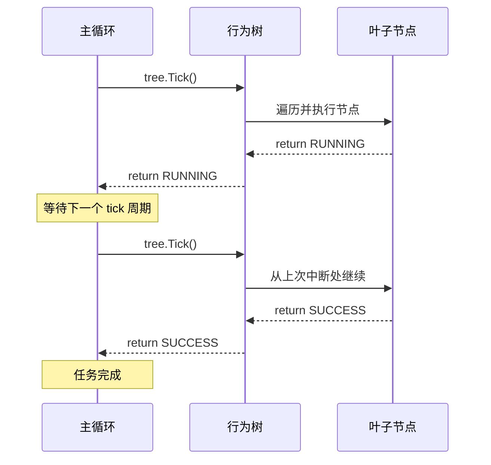

行为树 (Behavior Tree, BT) 不是游戏引擎的专属技术。在嵌入式设备启动流程、工业控制任务编排、机器人行为规划等单核系统场景中，行为树的 Tick 心跳机制提供了一种结构化的协作式并发方案: 无需多线程，无需操作系统调度器，只靠主循环的周期性 tick 调用就能实现 I/O 并发和复杂决策逻辑。

本文以 [bt-cpp](https://gitee.com/liudegui/bt-cpp) (C++14 header-only 行为树库) 为主线，从 Tick 机制原理出发，逐步展开节点遍历语义、异步模式、性能特征和工程实践。

> 相关文章:
> - [C 语言层次状态机框架: 从过程驱动到数据驱动](../c_hsm_data_driven_framework/) -- HSM 与 BT 互补的架构基础
> - [newosp 深度解析: C++17 事件驱动架构](../newosp_event_driven_architecture/) -- newosp 中 HSM + BT 的实际集成

## 1. Tick 机制核心原理

### 1.1 什么是 Tick

Tick 是行为树的"心跳"。每次 tick 代表一次从根节点开始的完整树遍历: 根据节点类型和子节点返回状态，决定下一步执行哪个分支。



bt-cpp 中的 tick 入口:

```cpp
// BehaviorTree<Context>::Tick()
Status Tick() noexcept {
    ++tick_count_;
    last_status_ = root_->Tick(context_);
    return last_status_;
}
```

每次 `Tick()` 递增计数器，从根节点开始递归遍历。返回值决定整棵树的执行状态。

### 1.2 四种状态

```cpp
enum class Status : uint8_t {
    kSuccess = 0,  // 执行成功
    kFailure = 1,  // 执行失败
    kRunning = 2,  // 仍在执行 (异步操作的关键)
    kError   = 3   // 配置错误
};
```

`RUNNING` 是行为树区别于普通 if-else 的核心: 叶子节点返回 `RUNNING` 表示"我还没完成，下次 tick 再来问我"。树会保存当前进度，下次 tick 从中断处恢复，而非从头开始。

### 1.3 六种节点类型

| 类型 | 分类 | 语义 | 等价逻辑 |
|------|------|------|----------|
| Action | 叶子 | 执行具体操作 | 函数调用 |
| Condition | 叶子 | 检查条件 (不应返回 RUNNING) | if 判断 |
| Sequence | 组合 | 全部子节点成功才成功 | AND + 短路求值 |
| Selector | 组合 | 第一个成功的子节点即可 | OR + 短路求值 |
| Parallel | 组合 | 每帧 tick 所有子节点 | 协作式并发 |
| Inverter | 装饰 | 反转 SUCCESS/FAILURE | NOT |

## 2. bt-cpp 库设计

[bt-cpp](https://gitee.com/liudegui/bt-cpp) 是一个 C++14 header-only 行为树库 (单文件 `bt/behavior_tree.hpp`，约 960 行)，面向嵌入式系统设计。核心设计原则:

- **模板化类型安全上下文**: `Node<Context>` 消除 `void*` 类型转换
- **固定容量内联子节点数组**: 无外部生命周期依赖
- **可配置回调类型**: 函数指针 (默认) 或 `std::function` (宏开关)
- **缓存友好内存布局**: 热数据字段前置
- **兼容 `-fno-exceptions -fno-rtti`**

### 2.1 类型安全上下文 vs void*

C 语言行为树的传统做法是 `void* user_data` + `void* blackboard`，需要手动类型转换:

```c
// C 风格: 运行时类型转换, 编译器无法检查
static bt_status_t action_load(bt_node_t *self) {
    file_ctx_t *ctx = (file_ctx_t *)self->user_data;  // 不安全
    // ...
}
```

bt-cpp 用模板参数替代:

```cpp
// C++14: 编译期类型安全, 无需转换
struct DeviceContext {
    bool system_ok = true;
    bool config_loaded = false;
    int total_operations = 0;
};

bt::Node<DeviceContext> node("Check");
node.set_type(bt::NodeType::kCondition)
    .set_tick([](DeviceContext& ctx) {
        return ctx.system_ok ? bt::Status::kSuccess
                             : bt::Status::kFailure;
    });
```

`static_assert` 在编译期阻止传入指针类型:

```cpp
static_assert(!std::is_pointer<Context>::value,
              "Context must not be a pointer type; use the pointed-to type");
```

### 2.2 双模式回调

bt-cpp 支持两种回调模式，通过宏在编译期选择:

```cpp
// 默认模式: 函数指针 (零堆分配, 确定性延迟)
using TickFn = Status(*)(Context&);

// 可选模式: std::function (支持 lambda 捕获, 定义 BT_USE_STD_FUNCTION)
using TickFn = std::function<Status(Context&)>;
```

**函数指针模式**适合嵌入式场景: 零间接开销，节点状态存放在 Context 而非 lambda 捕获。**std::function 模式**适合应用层: 支持有状态 lambda，API 更灵活。

```cpp
// 函数指针模式: 状态放 Context, tick 函数是普通函数
static bt::Status ReadFlashTick(AsyncContext& ctx) {
    if (!ctx.flash_started) {
        ctx.flash_future = std::async(std::launch::async, SimFlashRead, 256);
        ctx.flash_started = true;
        return bt::Status::kRunning;
    }
    // ...
}

// std::function 模式: 状态可以用 lambda 捕获
int progress = 0;
bt::factory::MakeAction(node, [&progress](DeviceContext& c) {
    ++progress;
    return (progress >= 3) ? bt::Status::kSuccess : bt::Status::kRunning;
});
```

### 2.3 缓存友好的节点布局

bt-cpp 的 `Node` 类将高频访问字段置于结构体前部:

```
Node<Context> 内存布局 (热数据前置):
+00: type_              (uint8_t,  1B)  -- 每次 tick 访问
+01: status_            (uint8_t,  1B)  -- 每次 tick 访问
+02: children_count_    (uint16_t, 2B)  -- 每次 tick 访问
+04: current_child_     (uint16_t, 2B)  -- Sequence/Selector 用
+06: success_policy_    (uint8_t,  1B)
+08: child_done_bits_   (uint32_t, 4B)  -- Parallel 位图
+12: child_success_bits_(uint32_t, 4B)  -- Parallel 位图
+16: tick_              (指针, 8B)      -- 叶子节点回调
+24: on_enter_          (指针, 8B)      -- 生命周期回调
+32: on_exit_           (指针, 8B)      -- 生命周期回调
+40: children_[]        (指针数组)      -- 固定容量内联
+xx: name_              (const char*)   -- 冷数据, 仅调试用
```

type, status, children_count 这些每次 tick 都会访问的字段集中在前 16 字节，对 CPU 指令缓存友好。name 作为冷数据放在最后。

### 2.4 构建时校验

bt-cpp 提供 `Validate()` 和 `ValidateTree()` 在首次 tick 前检查树结构:

```cpp
enum class ValidateError : uint8_t {
    kNone = 0,              // 无错误
    kLeafMissingTick,       // 叶子节点缺少 tick 回调
    kInverterNotOneChild,   // Inverter 必须恰好 1 个子节点
    kParallelExceedsBitmap, // Parallel 子节点超过 32 (位图宽度)
    kChildrenExceedMax,     // 子节点数超过 BT_MAX_CHILDREN
    kNullChild              // 子节点数组中有空指针
};

// 构建后一次性验证, 运行时零开销
bt::BehaviorTree<Context> tree(root, ctx);
bt::ValidateError err = tree.ValidateTree();
if (err != bt::ValidateError::kNone) {
    std::printf("Validation failed: %s\n", bt::ValidateErrorToString(err));
}
```

这些检查在构建时运行一次，热路径零开销。

### 2.5 流式 API 与工厂辅助函数

bt-cpp 提供两种节点配置风格:

**流式 API** (链式调用):

```cpp
bt::Node<Ctx> node("Name");
node.set_type(bt::NodeType::kAction)
    .set_tick(MyTickFn)
    .set_on_enter(MyEnterFn)
    .set_on_exit(MyExitFn);
```

**工厂辅助函数** (一行配置):

```cpp
bt::Node<Ctx> node("Name");
bt::factory::MakeAction(node, MyTickFn);
bt::factory::MakeCondition(node, MyCheckFn);
bt::factory::MakeSequence(node, children, count);
bt::factory::MakeParallel(node, children, count, bt::ParallelPolicy::kRequireAll);
bt::factory::MakeInverter(node, child);
```

## 3. 节点遍历语义

### 3.1 Sequence: 全部成功才成功

Sequence 节点按顺序执行子节点，遇到失败或 RUNNING 立即返回。关键: `current_child_` 字段保存执行进度，下次 tick 从上次中断处恢复。

```cpp
// bt-cpp TickSequence 核心逻辑 (简化)
Status TickSequence(Context& ctx) noexcept {
    if (status_ != Status::kRunning) {
        current_child_ = 0;       // 首次进入, 从第一个子节点开始
        CallEnter(ctx);
    }

    for (uint16_t i = current_child_; i < children_count_; ++i) {
        Status child_status = children_[i]->Tick(ctx);

        if (child_status == Status::kRunning) {
            current_child_ = i;   // 保存进度, 下次从这里继续
            status_ = Status::kRunning;
            return Status::kRunning;
        }

        if (child_status != Status::kSuccess) {
            status_ = child_status;
            CallExit(ctx);
            return child_status;  // 子节点失败, Sequence 失败
        }
    }

    status_ = Status::kSuccess;   // 全部子节点成功
    CallExit(ctx);
    return Status::kSuccess;
}
```

`current_child_` 递增的过程就是 Sequence "看起来在动态推进"的本质。实际上树结构完全是静态的，"动态"只是状态保存的视觉效果。

### 3.2 Selector: 第一个成功即可

Selector 是 Sequence 的对偶: 依次尝试子节点，第一个成功就返回成功。适合实现 fallback 逻辑。

```
Selector (尝试多种方案)
+-- TryPrimary  (Condition: 检查主路径是否可行)
+-- DoFallback  (Action: 主路径不可行时的降级方案)
```

### 3.3 Parallel: 协作式并发的核心

PARALLEL 节点是行为树实现协作式并发的关键。它在每次 tick 中遍历所有子节点，用 `uint32_t` 位图跟踪完成状态:

```cpp
// bt-cpp TickParallel 核心逻辑 (简化)
Status TickParallel(Context& ctx) noexcept {
    if (status_ != Status::kRunning) {
        child_done_bits_ = 0;      // 首次进入, 重置位图
        child_success_bits_ = 0;
        CallEnter(ctx);
    }

    uint16_t running_count = 0, success_count = 0, failure_count = 0;

    for (uint16_t i = 0; i < children_count_; ++i) {
        const uint32_t bit_mask = (static_cast<uint32_t>(1) << i);

        // O(1) 跳过已完成的子节点
        if ((child_done_bits_ & bit_mask) != 0U) {
            if ((child_success_bits_ & bit_mask) != 0U) ++success_count;
            else ++failure_count;
            continue;
        }

        Status child_status = children_[i]->Tick(ctx);

        if (child_status == Status::kRunning) {
            ++running_count;
        } else if (child_status == Status::kSuccess) {
            child_done_bits_ |= bit_mask;       // 标记完成
            child_success_bits_ |= bit_mask;     // 标记成功
            ++success_count;
        } else {
            child_done_bits_ |= bit_mask;        // 标记完成
            ++failure_count;
        }
    }

    // 根据策略判定
    if (success_policy_ == ParallelPolicy::kRequireAll) {
        if (failure_count > 0) return Status::kFailure;
        if (running_count > 0) return Status::kRunning;
        return Status::kSuccess;
    } else {  // kRequireOne
        if (success_count > 0) return Status::kSuccess;
        if (running_count > 0) return Status::kRunning;
        return Status::kFailure;
    }
}
```

三个关键设计:

1. **零内存分配**: `child_done_bits_` 和 `child_success_bits_` 是 `uint32_t` 位图，内嵌在节点结构体中
2. **O(1) 跳过**: 已完成的子节点通过位测试快速跳过，不会重复 tick
3. **双策略**: `kRequireAll` (全部成功才成功) 和 `kRequireOne` (一个成功即可)

位图宽度 32 位意味着单个 Parallel 节点最多支持 32 个子节点。`ValidateTree()` 会在构建时检查这个约束。

### 3.4 Inverter: 装饰器模式

Inverter 将子节点的 SUCCESS 反转为 FAILURE，FAILURE 反转为 SUCCESS。RUNNING 和 ERROR 透传。

```
Inverter(NoErrorCheck)
+-- CheckError (Condition, 返回 FAILURE 表示无错误)
=> Inverter 将 FAILURE 转为 SUCCESS, 意思是"无错误=通过"
```

## 4. RUNNING 状态与异步操作

### 4.1 RUNNING: 协作式多任务的关键

`RUNNING` 状态让行为树天然支持非阻塞操作。叶子节点返回 `RUNNING` 时，树保存当前进度; 下次 tick 自动从中断处恢复，期间主循环可以执行其他工作。

对比传统阻塞方式:

```cpp
// 阻塞方式: CPU 在等待 I/O 时空闲
void load_all_blocking() {
    read_flash();    // 阻塞 150ms, CPU 大部分时间空闲
    read_sensor();   // 阻塞 80ms
    load_network();  // 阻塞 200ms
    // 总耗时: 430ms (串行)
}

// 行为树 RUNNING 方式: Parallel 节点同时驱动三个 I/O
// Tick 1: 三个 Action 各自提交 I/O -> 返回 RUNNING
// Tick 2: 轮询各自的 future -> sensor 完成, 其他仍 RUNNING
// Tick 3: flash 完成
// Tick 4: network 完成 -> Parallel 返回 SUCCESS
// 总耗时: ~200ms (受最慢的 I/O 限制, 而非三者之和)
```

### 4.2 异步 I/O 模式: std::async + std::future

bt-cpp 的 `async_example.cpp` 演示了标准异步模式: 首次 tick 提交 I/O 任务到后台线程，后续 tick 非阻塞轮询 `std::future`:

```cpp
// 异步状态存放在类型安全的 Context 中
struct AsyncContext {
    std::future<std::string> flash_future;
    bool flash_started = false;
    std::string flash_data;
    // ... 其他节点的异步状态
};

// 异步 Action 的 tick 函数 (函数指针模式, 无 lambda 捕获)
static bt::Status ReadFlashTick(AsyncContext& ctx) {
    // 首次 tick: 提交 I/O 任务到后台线程
    if (!ctx.flash_started) {
        ctx.flash_future = std::async(std::launch::async, SimFlashRead, 256);
        ctx.flash_started = true;
        return bt::Status::kRunning;  // 告诉树: 我还没完成
    }

    // 后续 tick: 非阻塞轮询
    if (ctx.flash_future.wait_for(std::chrono::seconds(0)) ==
        std::future_status::ready) {
        ctx.flash_data = ctx.flash_future.get();
        return bt::Status::kSuccess;  // I/O 完成
    }

    return bt::Status::kRunning;      // 继续等待
}
```

这个模式的关键: `wait_for(std::chrono::seconds(0))` 是非阻塞的，如果 future 未就绪则立即返回，不会挂起主线程。

### 4.3 完整异步树示例

以下树结构演示了 Parallel + Selector 组合处理多路异步 I/O 和 fallback 逻辑 (来自 bt-cpp `async_example.cpp`):

```
Root (Sequence)
+-- CheckSystem    (Condition, 同步)
+-- ParallelIO     (Parallel, RequireAll)
|   +-- ReadFlash  (Action, async 150ms)
|   +-- ReadSensor (Action, async 80ms)
|   +-- LoadNetwork(Action, async 200ms, 可能失败)
+-- ProcessResults (Selector)
    +-- ProcessAll     (Condition: 三路数据都加载成功?)
    +-- ProcessPartial (Action: 降级处理, 只用 flash + sensor)
```

构建和运行:

```cpp
AsyncContext ctx;

// 构建节点
bt::Node<AsyncContext> check_sys("CheckSystem");
check_sys.set_type(bt::NodeType::kCondition).set_tick(CheckSystemTick);

bt::Node<AsyncContext> read_flash("ReadFlash");
read_flash.set_type(bt::NodeType::kAction).set_tick(ReadFlashTick);

bt::Node<AsyncContext> read_sensor("ReadSensor");
read_sensor.set_type(bt::NodeType::kAction).set_tick(ReadSensorTick);

bt::Node<AsyncContext> load_net("LoadNetwork");
load_net.set_type(bt::NodeType::kAction).set_tick(LoadNetworkTick);

// Parallel: 三路 I/O 并发
bt::Node<AsyncContext> parallel_io("ParallelIO");
parallel_io.set_type(bt::NodeType::kParallel)
    .AddChild(read_flash)
    .AddChild(read_sensor)
    .AddChild(load_net)
    .set_parallel_policy(bt::ParallelPolicy::kRequireAll);

// Selector: 优先全量处理, 失败则降级
bt::Node<AsyncContext> process("ProcessResults");
process.set_type(bt::NodeType::kSelector)
    .AddChild(process_all)
    .AddChild(process_partial);

// Root
bt::Node<AsyncContext> root("Root");
root.set_type(bt::NodeType::kSequence)
    .AddChild(check_sys)
    .AddChild(parallel_io)
    .AddChild(process);

// 验证 + 运行
bt::BehaviorTree<AsyncContext> tree(root, ctx);
bt::ValidateError err = tree.ValidateTree();

bt::Status result = bt::Status::kRunning;
while (result == bt::Status::kRunning) {
    result = tree.Tick();
    if (result == bt::Status::kRunning) {
        std::this_thread::sleep_for(std::chrono::milliseconds(50));
    }
}
```

当 `LoadNetwork` 失败时，`ProcessResults` Selector 会跳过 `ProcessAll` (返回 FAILURE)，自动执行 `ProcessPartial` 降级方案。整棵树不需要任何手动错误处理代码。

## 5. 设备启动流程: bt-cpp 实战

以下示例来自 bt-cpp 的 `bt_example.cpp`，模拟嵌入式设备启动序列:

```
Root (Sequence)
+-- SystemCheck      (Condition: 系统自检)
+-- ParallelLoad     (Parallel, RequireAll)
|   +-- LoadConfig   (Action: 加载配置, 3 个 tick 完成)
|   +-- LoadCalib    (Action: 加载校准, 2 个 tick 完成)
+-- InitModules      (Sequence)
|   +-- Inverter     (装饰器)
|   |   +-- CheckError (Condition: FAILURE=无错误, 经 Inverter 转为 SUCCESS)
|   +-- InitISP      (Action: 初始化 ISP)
+-- StartPreview     (Action: 启动预览)
```

Context 作为类型安全的共享黑板:

```cpp
struct DeviceContext {
    bool system_ok = true;
    bool config_loaded = false;
    bool calib_loaded = false;
    bool isp_initialized = false;
    bool preview_started = false;
    int total_operations = 0;
};
```

使用工厂辅助函数配置节点:

```cpp
DeviceContext ctx;

// 条件节点
bt::Node<DeviceContext> sys_check("SystemCheck");
bt::factory::MakeCondition(sys_check, [](DeviceContext& c) {
    return c.system_ok ? bt::Status::kSuccess : bt::Status::kFailure;
});

// 异步 Action (3 个 tick 完成, 用 lambda 捕获局部进度)
int config_progress = 0;
bt::Node<DeviceContext> load_config("LoadConfig");
bt::factory::MakeAction(load_config,
    [&config_progress](DeviceContext& c) {
        ++config_progress;
        if (config_progress >= 3) {
            c.config_loaded = true;
            ++c.total_operations;
            return bt::Status::kSuccess;
        }
        return bt::Status::kRunning;
    });

// 生命周期回调
load_config
    .set_on_enter([](DeviceContext&) { std::printf("[Enter] LoadConfig\n"); })
    .set_on_exit([](DeviceContext&)  { std::printf("[Exit]  LoadConfig\n"); });

// Parallel: 配置和校准并发加载
bt::Node<DeviceContext> parallel_load("ParallelLoad");
bt::Node<DeviceContext>* par_children[] = {&load_config, &load_calib};
bt::factory::MakeParallel(parallel_load, par_children, 2,
                           bt::ParallelPolicy::kRequireAll);

// Inverter: 将 CheckError 的 FAILURE (无错误) 转为 SUCCESS
bt::Node<DeviceContext> inverter("NoErrorCheck");
bt::factory::MakeInverter(inverter, check_error);
```

运行结果 (3 次 tick 完成启动):

```
--- Tick 1 ---
    [Condition] SystemCheck: PASS
  >> ParallelLoad: begin
    [Enter] LoadConfig started
    [Action] LoadConfig: progress 1/3    (RUNNING)
    [Enter] LoadCalib started
    [Action] LoadCalib: progress 1/2     (RUNNING)
  -> Tree status: RUNNING

--- Tick 2 ---
    [Action] LoadConfig: progress 2/3    (RUNNING)
    [Action] LoadCalib: progress 2/2     (SUCCESS)
    [Exit]  LoadCalib finished
  -> Tree status: RUNNING

--- Tick 3 ---
    [Action] LoadConfig: progress 3/3    (SUCCESS)
    [Exit]  LoadConfig finished
  << ParallelLoad: done
    [Condition] CheckError: no errors found (FAILURE -> Inverter -> SUCCESS)
    [Action] InitISP
    [Action] StartPreview
  -> Tree status: SUCCESS
```

Parallel 节点在 Tick 1 同时启动 LoadConfig 和 LoadCalib。LoadCalib 在 Tick 2 完成 (2 个 tick)，LoadConfig 在 Tick 3 完成 (3 个 tick)。整个并行加载阶段耗时等于最慢的子任务 (3 tick)，而非两者之和 (5 tick)。

## 6. 行为树的静态本质

### 6.1 静态规则树，非动态 AI

行为树的"动态"是一种误解。树结构在构建时固定，运行时不会创建或销毁节点。所谓的"动态推进"只是 `current_child_` 索引在递增:

```
Tick 1: current_child_=0, 执行子节点 0
Tick 2: current_child_=1, 执行子节点 1  (子节点 0 已完成)
Tick 3: current_child_=2, 执行子节点 2  (子节点 0,1 已完成)
```

bt-cpp 的子节点存储是固定容量内联数组，不依赖外部分配:

```cpp
// 固定容量, 编译期可配置 (默认 8)
static constexpr uint16_t kMaxChildren = static_cast<uint16_t>(BT_MAX_CHILDREN);
Node* children_[kMaxChildren];  // 内联在节点结构体内
```

### 6.2 行为树 = if-else 的结构化替代

5 步以内的线性流程用 if-else 更直接。当流程包含并行分支、条件降级、异步等待时，行为树的结构化优势才体现出来:

```cpp
// if-else: 无法表达并行加载
if (check() && load_config() && load_calib() && init() && start()) {
    return OK;
}
// 问题: load_config 和 load_calib 只能串行执行

// 行为树: 并行加载是一等公民
Root (Sequence)
+-- Check
+-- Parallel(RequireAll)     // 自然表达并行
|   +-- LoadConfig
|   +-- LoadCalib
+-- Init
+-- Start
```

## 7. 性能特征

### 7.1 框架开销量化

以下数据来自 bt-cpp 的 `benchmark_example.cpp`，每个场景运行 100,000 次迭代 (含 1,000 次 warmup)，叶子节点执行极简操作 (递增计数器) 以隔离框架开销:

| 场景 | avg (ns) | p50 (ns) | p99 (ns) | 说明 |
|------|----------|----------|----------|------|
| Flat Sequence (8 actions) | 130 | -- | 222 | 最佳顺序分发 |
| Deep Nesting (5 levels) | 78 | -- | 136 | 嵌套深度影响 |
| Parallel (4 children) | 75 | -- | 131 | 位图跟踪开销 |
| Selector early exit (1/8) | 58 | -- | 106 | 短路求值收益 |
| Realistic tree (8 nodes) | 97 | -- | 174 | 混合节点类型 |
| Hand-written if-else | 30 | -- | 36 | 基准对照 |

*数据来源: bt-cpp `examples/benchmark_example.cpp`，x86-64 平台。ARM 平台性能特征类似。*

关键结论:

- 一次完整树 tick 开销在**百纳秒量级** (8 节点混合树 ~97ns avg)
- BT 相对手写 if-else 约 **4 倍开销** (130ns vs 30ns)
- 在 20Hz tick 频率 (50ms 间隔) 下，框架开销占 tick 预算 **< 0.001%**
- Selector 短路求值有效减少不必要的节点遍历

### 7.2 性能有利面与代价

**有利:**

- 短路求值: Sequence/Selector 遇到终止条件立即返回
- 顺序遍历: 对 CPU 指令缓存友好 (对比 FSM 的间接跳转表)
- 函数指针模式零间接开销
- 固定容量子节点数组，无动态内存分配

**代价:**

- 每帧从根节点开始遍历 (FSM 直接从当前状态开始)
- Parallel 节点每帧 tick 所有未完成子节点

这些代价在百纳秒级别，对绝大多数嵌入式 tick 频率 (10-100Hz) 可忽略不计。

## 8. 行为树 vs 状态机: 选型与互补

### 8.1 选型对比

| 维度 | 行为树 | 状态机 (FSM/HSM) |
|------|--------|-----------------|
| 状态爆炸 | 节点线性增长 | N 状态 x M 事件 = O(NM) 转换 |
| 可组合性 | 强，子树可复用 | 弱，状态间强耦合 |
| 并发行为 | Parallel 节点原生支持 | 需要并行状态域 |
| 异步操作 | RUNNING 一等公民 | 需要额外"等待"状态 |
| 事件驱动 | 不擅长 | 天然适合 |
| 状态循环 | 不适合 | 天然适合 |

### 8.2 BT + HSM 互补架构

bt-cpp 推荐的工程实践: HSM 管理系统级状态转换，BT 管理运行态内的复杂决策和任务编排。

```
HSM (系统级状态管理)              BT (运行态内的决策)
+-- Init                          Root (Sequence)
+-- Running  ----BT 驱动--->      +-- CheckSensors
+-- Error                         +-- Parallel(I/O)
+-- Shutdown                      +-- Selector(Fallback)
```

- **HSM** 处理状态转换有严格协议约束的场景 (初始化->运行->错误->关机)
- **BT** 处理运行态内的任务编排、并发 I/O、条件降级

这种分层避免了两种架构各自的弱点: BT 不擅长循环状态转换，HSM 不擅长并发任务编排。

相关项目:
- [bt-cpp](https://gitee.com/liudegui/bt-cpp) -- C++14 行为树库 (header-only, MIT)
- [bt_simulation](https://gitee.com/liudegui/bt_simulation) -- C 语言版本 (含嵌入式设备模拟)
- [hsm-cpp](https://gitee.com/liudegui/hsm-cpp) -- C++14 层次状态机库

### 8.3 不适合行为树的场景

- 状态转换有严格协议约束 (通信协议栈) -- 用 HSM
- 纯事件驱动、无需周期性轮询 -- FSM 更高效
- 决策分支少 (< 5 个行为) -- if-else 更简单直接

## 9. 工程实践要点

### 9.1 关键: Action 节点必须非阻塞

行为树协作式并发的前提是每个叶子节点快速返回。阻塞调用会打破整棵树的并发能力:

```cpp
// 错误: 阻塞等待, 主循环挂起
static bt::Status BadAction(Context& ctx) {
    auto data = blocking_read(fd);  // 阻塞 100ms, 其他节点无法执行
    return bt::Status::kSuccess;
}

// 正确: 非阻塞, 返回 RUNNING
static bt::Status GoodAction(Context& ctx) {
    if (!ctx.started) {
        ctx.future = std::async(std::launch::async, blocking_read, fd);
        ctx.started = true;
        return bt::Status::kRunning;  // 立即返回, 不阻塞
    }
    if (ctx.future.wait_for(std::chrono::seconds(0)) ==
        std::future_status::ready) {
        ctx.data = ctx.future.get();
        return bt::Status::kSuccess;
    }
    return bt::Status::kRunning;
}
```

### 9.2 主循环驱动模式

最简单的 tick 驱动方式: 主循环 + 固定间隔:

```cpp
bt::BehaviorTree<Context> tree(root, ctx);

bt::Status result = bt::Status::kRunning;
while (result == bt::Status::kRunning) {
    result = tree.Tick();
    if (result == bt::Status::kRunning) {
        std::this_thread::sleep_for(std::chrono::milliseconds(50));  // 20Hz
    }
}
```

在 RTOS 环境中，`sleep_for` 替换为 `rt_thread_mdelay()` 或定时器回调。

### 9.3 超时保护

长时间 RUNNING 的任务需要超时机制:

```cpp
auto start = std::chrono::steady_clock::now();
bt::Status result = bt::Status::kRunning;

while (result == bt::Status::kRunning) {
    result = tree.Tick();
    auto elapsed = std::chrono::steady_clock::now() - start;
    if (elapsed > std::chrono::seconds(10)) {
        // 超时处理
        break;
    }
    if (result == bt::Status::kRunning) {
        std::this_thread::sleep_for(std::chrono::milliseconds(50));
    }
}
```

### 9.4 线程池替代 std::async

`std::async` 每次创建新线程，对高频任务提交有开销。bt-cpp 的 `threadpool_example.cpp` 演示了用固定线程池替代:

```cpp
struct PoolContext {
    std::unique_ptr<ThreadPool> pool;  // 2 个 worker 线程
    std::future<std::string> config_future;
    bool config_started = false;
    // ...
    PoolContext() : pool(std::unique_ptr<ThreadPool>(new ThreadPool(2))) {}
};

static bt::Status LoadConfigTick(PoolContext& ctx) {
    if (!ctx.config_started) {
        ctx.config_future = ctx.pool->enqueue(SimLoadConfig);  // 提交到线程池
        ctx.config_started = true;
        return bt::Status::kRunning;
    }
    // 后续 tick: 同样用 wait_for(0s) 非阻塞轮询
    // ...
}
```

线程池方案的优势: 线程创建一次复用多次，资源使用有上限 (bounded concurrency)。

## 10. 从 C 到 C++14 的演进

bt-cpp 的 C 语言前身 [bt_simulation](https://gitee.com/liudegui/bt_simulation) 面向资源极度受限的 MCU (几十 KB RAM)。bt-cpp 保留了 C 版本的核心设计 (节点结构、位图跟踪、状态保存)，在 C++14 层面做了类型安全和易用性提升:

| 设计点 | C 版本 (bt_simulation) | C++14 版本 (bt-cpp) |
|--------|----------------------|---------------------|
| 上下文传递 | `void* user_data` + `void* blackboard` | 模板 `Context` 参数 |
| 节点数据 | 函数指针 + `void*` | Lambda 捕获或 Context 成员 |
| 子节点存储 | 外部指针数组 (生命周期需用户管理) | 固定容量内联数组 (无外部依赖) |
| 回调类型 | 函数指针 | 函数指针 (默认) / `std::function` (宏开关) |
| 节点配置 | `BT_INIT_ACTION()` 宏 | 流式 API + 工厂辅助函数 |
| 编译器提示 | 无 | `BT_LIKELY` / `BT_UNLIKELY` / `BT_HOT` |
| 构建时校验 | 无 | `Validate()` / `ValidateTree()` + `static_assert` |

两者共享相同的 Tick 语义和节点遍历逻辑。选择依据:

- **MCU / 裸机 / 纯 C 环境**: 使用 bt_simulation
- **ARM-Linux / 嵌入式 C++ 环境**: 使用 bt-cpp

## 总结

行为树 Tick 机制的价值在于用**可忽略的运行时开销换取显著的架构清晰度**:

1. **Tick 心跳**: 每次 tick 从根节点遍历，节点通过 RUNNING 保存进度，实现协作式并发
2. **静态规则树**: 结构编译时固定，"动态"只是状态保存的视觉效果
3. **PARALLEL 位图**: 零分配、O(1) 跳过已完成子节点，单核系统上实现 I/O 并发
4. **百纳秒开销**: 8 节点混合树 tick 约 97ns，对 20Hz 主循环占比 < 0.001%
5. **BT + HSM 互补**: BT 管任务编排和并发调度，HSM 管系统级状态转换

选型决策:

```
任务编排 (启动/初始化/多步流程)  -> 行为树
状态转换 (运行/暂停/错误/恢复)   -> 状态机
单核 I/O 并发                    -> 行为树 Parallel + RUNNING
决策分支少 (< 5 步线性)          -> if-else
```
