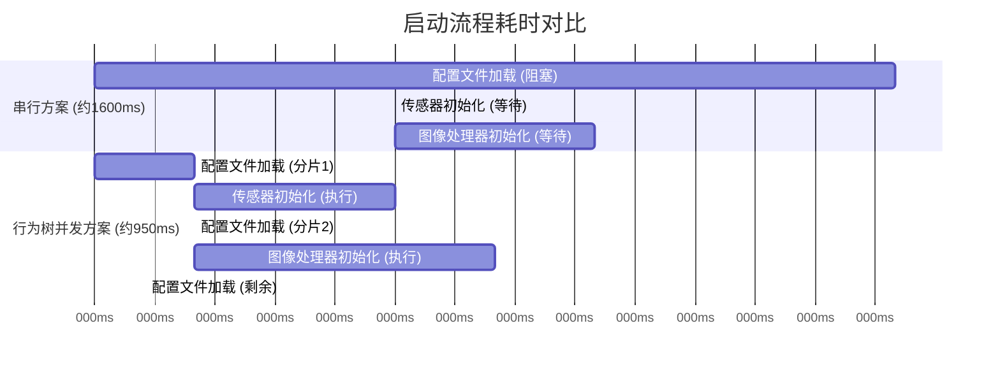

行为树（Behavior Tree，BT）起源于游戏 AI，但其 Tick 心跳机制在嵌入式系统中同样适用。在设备启动流程、工业控制任务编排等单核场景中，BT 提供了一种结构化的协作式并发方案：无需多线程，只靠主循环的周期性 `Tick()` 调用就能实现 I/O 并发和复杂决策逻辑。

本文以 [newosp](https://gitee.com/liudegui/newosp) 框架的 `osp::BehaviorTree`（C++17 header-only，`include/osp/bt.hpp`）为主线，结合 HSM+BT 组合模式和嵌入式视觉平台预览服务的真实重构案例，系统讲解 BT 在嵌入式系统中的工程落地。

> 相关文章:
> - [C 语言层次状态机框架: 从过程驱动到数据驱动](../c_hsm_data_driven_framework/) — HSM 与 BT 互补的架构基础
> - [newosp 深度解析: C++17 事件驱动架构](../newosp_event_driven_architecture/) — newosp 中 HSM + BT 的实际集成

## 1. 问题与解法

### 1.1 线性流程的三个痛点

嵌入式系统的初始化代码通常是这样的：

```cpp
rt_err_t system_start()
{
    if (RT_EOK != sys_info_init())    return RT_ERROR;  // 阻塞等待
    if (RT_EOK != sensor_svc_init())  return RT_ERROR;  // 失败则整体中断
    if (RT_EOK != isp_svc_init())     return RT_ERROR;  // 阻塞等待
    if (RT_EOK != video_pipeline_init()) return RT_ERROR;
    return RT_EOK;
}
```

随着硬件组合增多，这种写法暴露三个结构性缺陷：

**启动瓶颈**：I/O 密集型任务（配置文件加载）与 CPU 密集型任务（寄存器配置）严格串行，CPU 在等待 I/O 期间完全空转。实测某视觉平台启动耗时约 1600ms，其中 I/O 等待占 50% 以上。

**容错缺失**：任一步骤失败即整体中断。传感器初始化失败时，系统不能切换到无传感器的安全模式继续运行。

**条件编译失控**：为适配不同硬件组合，代码中大量嵌套 `#ifdef`，逻辑割裂，测试覆盖率低。

### 1.2 行为树的三个解法

| 痛点 | BT 机制 | 原理 |
|------|---------|------|
| 启动瓶颈 | `Parallel` 节点 + `kRunning` 状态 | 多个 Action 交叠执行，I/O 等待期间切换至其他节点 |
| 容错缺失 | `Selector` (Fallback) 节点 | 主路径失败自动尝试降级路径，声明式错误恢复 |
| 条件编译失控 | 节点级特性开关 | `#ifdef` 只控制节点是否加入树，不散布于业务逻辑 |

## 2. Tick 运行模型

### 2.1 心跳与状态

Tick 是行为树的驱动脉冲。每次 `tree.Tick()` 从根节点开始深度优先遍历，每个节点执行后返回四种状态之一：

```cpp
// osp/bt.hpp
enum class NodeStatus : uint8_t {
    kSuccess = 0,  // 任务完成
    kFailure,      // 任务失败
    kRunning,      // 任务进行中，下次 Tick 继续
    kIdle          // 尚未被 Tick 过
};
```

`kRunning` 是 BT 区别于普通 `if-else` 的核心。叶子节点返回 `kRunning` 时，树保存当前进度；下次 Tick 从中断处恢复，期间主循环可执行其他节点。

newosp 的 tick 入口：

```cpp
NodeStatus Tick() {
    if (OSP_UNLIKELY(root_index_ < 0)) {
        last_status_ = NodeStatus::kFailure;
        return last_status_;
    }
    last_status_ = TickNode(root_index_);
    return last_status_;
}
```

### 2.2 七种节点类型

newosp 的 `osp::BehaviorTree` 支持七种节点：

| 类型 | 分类 | 语义 | API |
|------|------|------|-----|
| `kAction` | 叶子 | 执行操作，可返回三种状态 | `AddAction()` |
| `kCondition` | 叶子 | 检查条件，只返回 Success/Failure | `AddCondition()` |
| `kSequence` | 组合 | 全部子节点成功才成功（AND 短路） | `AddSequence()` |
| `kSelector` | 组合 | 第一个成功即可（OR 短路） | `AddSelector()` |
| `kParallel` | 组合 | 每次 Tick 驱动所有子节点，阈值判定 | `AddParallel(threshold)` |
| `kInverter` | 装饰 | 反转 Success/Failure | `AddInverter()` |
| `kRepeat` | 装饰 | 重复执行子节点 N 次（0=无限） | `AddRepeat(count)` |

### 2.3 Sequence：AND 短路

Sequence 按顺序 tick 子节点，任一失败立即返回 `kFailure`，任一 `kRunning` 立即返回 `kRunning`：

```cpp
// osp/bt.hpp - TickSequence
NodeStatus TickSequence(int32_t index) {
    BtNode<Context>& node = nodes_[index];
    for (uint32_t i = 0; i < node.child_count; ++i) {
        NodeStatus child_status = TickNode(node.children[i]);
        if (child_status == NodeStatus::kFailure) return NodeStatus::kFailure;
        if (child_status == NodeStatus::kRunning) return NodeStatus::kRunning;
    }
    return NodeStatus::kSuccess;
}
```

### 2.4 Selector：声明式 Fallback

Selector 依次尝试子节点，第一个成功即返回。天然映射"主路径失败 → 降级路径"。

newosp 的 `bt_patrol_demo.cpp` 展示了一个典型的 Selector 用法——巡逻机器人的优先级决策：

```cpp
// examples/bt_patrol_demo.cpp
int32_t root = tree.AddSelector("Root");

// 优先级 1: 紧急停止（最高优先级）
int32_t handle_emergency = tree.AddSequence("HandleEmergency", root);
tree.AddCondition("IsEmergency", IsEmergency, handle_emergency);
tree.AddAction("EmergencyStop", EmergencyStop, handle_emergency);

// 优先级 2: 正常巡逻
int32_t patrol_route = tree.AddSequence("PatrolRoute", root);
tree.AddCondition("HasBattery", HasBattery, patrol_route);
tree.AddAction("MoveToWaypoint", MoveToWaypoint, patrol_route);
tree.AddAction("ScanArea", ScanArea, patrol_route);
tree.AddAction("ReportClear", ReportClear, patrol_route);

// 优先级 3: 返回基地（电量不足时的降级路径）
int32_t return_to_base = tree.AddSequence("ReturnToBase", root);
tree.AddCondition("IsBatteryLow", IsBatteryLow, return_to_base);
tree.AddAction("NavigateToBase", NavigateToBase, return_to_base);
```

Selector 从上到下尝试：紧急情况 → 正常巡逻 → 返回基地。每个分支的 Condition 节点决定是否进入该路径。

### 2.5 Parallel：协作式并发

Parallel 在每次 Tick 中驱动所有子节点，用 `success_threshold` 判定返回值：

```cpp
// osp/bt.hpp - TickParallel
NodeStatus TickParallel(int32_t index) {
    BtNode<Context>& node = nodes_[index];
    uint32_t success_count = 0, failure_count = 0;
    for (uint32_t i = 0; i < node.child_count; ++i) {
        NodeStatus child_status = TickNode(node.children[i]);
        if (child_status == NodeStatus::kSuccess) ++success_count;
        else if (child_status == NodeStatus::kFailure) ++failure_count;
    }
    if (success_count >= node.success_threshold) return NodeStatus::kSuccess;
    if (failure_count > node.child_count - node.success_threshold)
        return NodeStatus::kFailure;
    return NodeStatus::kRunning;
}
```

`AddParallel("name", threshold)` 中的 `threshold` 参数控制策略：设为子节点数量等价于 RequireAll，设为 1 等价于 RequireOne。


## 3. osp::BehaviorTree 设计

newosp 的 `osp::BehaviorTree`（`include/osp/bt.hpp`，约 530 行）面向嵌入式系统设计，核心约束：零堆分配、index-based 引用、兼容 `-fno-exceptions -fno-rtti`。

### 3.1 Flat Array + Index 引用

与传统指针树不同，所有节点存储在一个连续的 `std::array` 中，父子关系用 `int32_t` 索引表示：

```cpp
template <typename Context, uint32_t MaxNodes = OSP_BT_MAX_NODES>
class BehaviorTree final {
    Context& ctx_;
    std::array<BtNode<Context>, MaxNodes> nodes_;  // 连续存储
    uint32_t node_count_;
    int32_t root_index_;
    NodeStatus last_status_;
    std::array<uint32_t, MaxNodes> repeat_counters_;
};
```

```cpp
template <typename Context>
struct BtNode {
    using TickFn = NodeStatus (*)(Context& ctx);  // 函数指针，非 std::function

    NodeType type;
    const char* name;                        // 静态生命周期
    TickFn tick_fn;                          // 叶子节点回调
    int32_t parent_index;                    // -1 = root
    int32_t children[OSP_BT_MAX_CHILDREN];   // 子节点索引
    uint32_t child_count;
    uint32_t success_threshold;              // Parallel 阈值
    uint32_t repeat_count;                   // Repeat 次数
};
```

这种设计的工程意义：
- **缓存友好**：节点在内存中连续排列，深度优先遍历时 cache miss 率低
- **零堆分配**：`MaxNodes` 和 `OSP_BT_MAX_CHILDREN` 编译期确定，tick 路径无 `new/malloc`
- **确定性内存**：整棵树的 RAM 占用在编译期可计算

### 3.2 类型安全 Context

函数指针回调接收 `Context&` 引用，而非 `void*`：

```cpp
// 编译期类型安全：传错类型直接编译失败
osp::NodeStatus CheckSensors(DeviceContext& ctx) {
    return ctx.sensor_ok ? osp::NodeStatus::kSuccess : osp::NodeStatus::kFailure;
}
```

Context 即 Blackboard——所有节点共享的状态集中在一个 struct 中，无需字符串 key 查找。

### 3.3 Builder API

树的构建采用 parent-index 链式注册，一次性完成拓扑定义：

```cpp
osp::BehaviorTree<PatrolContext> tree(ctx, "patrol_robot");

int32_t root = tree.AddSelector("Root");
int32_t emergency = tree.AddSequence("HandleEmergency", root);
tree.AddCondition("IsEmergency", IsEmergency, emergency);
tree.AddAction("EmergencyStop", EmergencyStop, emergency);
// ...
tree.SetRoot(root);
```

`AddAction/AddCondition/AddSequence/AddSelector/AddParallel/AddInverter/AddRepeat` 七个方法覆盖所有节点类型，返回 `int32_t` 索引用于后续引用。

## 4. HSM + BT 组合模式

### 4.1 为什么需要组合

BT 和 HSM 不是竞争关系，而是互补：

| 职责 | HSM | BT |
|------|-----|-----|
| 系统级状态转换 | Idle → Running → Error → Shutdown | 不擅长 |
| 运行态内任务编排 | 不擅长 | Sequence / Parallel / Selector |
| 错误恢复协议 | 状态转换有严格约束 | Fallback 声明式降级 |
| 并发 I/O | 不支持 | Parallel + RUNNING |

HSM 管"什么时候做"，BT 管"做什么、怎么做"。

### 4.2 newosp 的 hsm_bt_combo_demo

newosp 的 `examples/hsm_bt_combo_demo.cpp` 展示了标准的 HSM+BT 组合模式——工业设备控制器：

```
HSM 状态图:
  Idle ──START──> Initializing ──INIT_DONE──> Running ──ERROR──> Error
                                                │                  │
                                                STOP          RESET (< 3次)
                                                │                  │
                                                v                  v
                                             Shutdown            Idle
```

BT 只在 `Running` 状态内被 tick：

```cpp
// HSM Running 状态的事件处理器
osp::TransitionResult RunningHandler(DeviceContext& ctx, const osp::Event& event) {
    if (event.id == EVENT_TICK) {
        // HSM 收到 TICK 事件时，驱动 BT
        osp::NodeStatus status = ctx.bt_ptr->Tick();
        return osp::TransitionResult::kHandled;
    }
    if (event.id == EVENT_ERROR) {
        return ctx.hsm_ptr->RequestTransition(s_error);
    }
    if (event.id == EVENT_STOP) {
        return ctx.hsm_ptr->RequestTransition(s_shutdown);
    }
    return osp::TransitionResult::kUnhandled;
}
```

BT 的树结构：

```cpp
// Running 状态内的行为树：检查传感器 → 执行任务 → 上报状态
int32_t root = bt.AddSequence("root");
bt.AddCondition("CheckSensors", CheckSensors, root);
bt.AddAction("ExecuteTask", ExecuteTask, root);
bt.AddAction("ReportStatus", ReportStatus, root);
bt.SetRoot(root);
```

### 4.3 数据流

Context 同时被 HSM 和 BT 引用，作为两者之间的数据桥梁：

```cpp
struct DeviceContext {
    bool initialized = false;
    bool sensor_ok = true;
    bool task_done = false;
    int error_count = 0;
    int cycle_count = 0;
    osp::BehaviorTree<DeviceContext>* bt_ptr = nullptr;   // BT 引用
    osp::StateMachine<DeviceContext, 8>* hsm_ptr = nullptr; // HSM 引用
};
```

HSM 的 `InitializingEntry` 设置 `ctx.initialized = true`，BT 的 `CheckSensors` 读取 `ctx.sensor_ok`，`ExecuteTask` 更新 `ctx.cycle_count`。两者通过 Context 共享状态，无直接耦合。

### 4.4 在 newosp 消息流水线中的位置

在完整的 newosp 架构中，HSM+BT 组合位于 `StaticNode` 的下游：

```
传感器线程 ─┐
控制线程  ──┼── AsyncBus::Publish() ── [CAS MPSC Ring Buffer] ──┐
网络线程  ─┘                                                     │
                              ┌──── ProcessBatch() ─────────────┘
                              │
                    Node 类型路由 (FNV-1a topic hash)
                              │
                    ┌─────────┼─────────┐
                    │         │         │
                    ▼         ▼         ▼
              StaticNode   Node     WorkerPool
              (零开销)   (动态订阅)  (SPSC 分发)
                    │
                    ▼
              HSM (LifecycleNode)
                    │
                    ▼ (Running 状态内)
                   BT
```

三者职责正交：Bus 负责阶段间通信，HSM 负责生命周期状态管理，BT 负责运行态内的任务编排。

## 5. 工程案例：预览服务重构

### 5.1 四阶段行为树

某嵌入式视觉平台的预览服务模块，将原有线性流程重构为四阶段 Sequence：


```mermaid
graph TD
    A[Root: Sequence] --> B[1. Parallel: 系统校验]
    A --> C[2. Parallel: 服务初始化]
    A --> D[3. Sequence: 流配置]
    A --> E[4. Parallel: 服务启动]

    B --> B1[Condition: 系统信息有效]
    B --> B2[Condition: DDR 就绪]

    C --> C1[Selector: 传感器初始化]
    C --> C2[Selector: 图像处理器初始化]
    C --> C3[Action: 异步配置文件加载]

    D --> D1[Action: 接口配置]
    D --> D2[Action: 缓冲区分配]

    E --> E1[Action: 启动传感器]
    E --> E2[Action: 启动图像处理器]
```

用 newosp API 构建：

```cpp
struct PreviewContext {
    bool sys_info_valid = false;
    bool ddr_ready = false;
    bool sensor_available = false;
    bool isp_available = false;
    bool config_loaded = false;
    SensorInitState sensor_state = SensorInitState::kIdle;
    IspInitState isp_state = IspInitState::kIdle;
    uint32_t config_progress = 0;
};

osp::BehaviorTree<PreviewContext> tree(ctx, "preview_svc");

auto root = tree.AddSequence("Root");

// 阶段 1: 系统校验（全部通过才继续）
auto check = tree.AddParallel("SysCheck", 2, root);  // threshold=2, 两个都要成功
tree.AddCondition("SysInfoValid", CheckSysInfo, check);
tree.AddCondition("DdrReady", CheckDdr, check);

// 阶段 2: 服务初始化（并发 + Fallback）
auto init = tree.AddParallel("SvcInit", 3, root);  // 三个都要成功
auto sensor_fb = tree.AddSelector("SensorFallback", init);
// ... 传感器初始化的主路径和降级路径
auto isp_fb = tree.AddSelector("IspFallback", init);
// ... ISP 初始化的主路径和降级路径
tree.AddAction("LoadConfig", LoadConfigAsync, init);

// 阶段 3: 流配置（严格顺序）
auto config = tree.AddSequence("StreamConfig", root);
tree.AddAction("ConfigInterface", ConfigInterface, config);
tree.AddAction("AllocBuffers", AllocBuffers, config);

// 阶段 4: 服务启动
auto start = tree.AddParallel("SvcStart", 2, root);
tree.AddAction("StartSensor", StartSensor, start);
tree.AddAction("StartIsp", StartIsp, start);

tree.SetRoot(root);
```

### 5.2 异步 Action 节点

耗时操作封装为异步 Action，通过 Context 中的状态枚举跨 Tick 保持进度：

```cpp
osp::NodeStatus SensorInitAsync(PreviewContext& ctx) {
    switch (ctx.sensor_state) {
        case SensorInitState::kIdle:
            if (sensor_svc_init_async() == 0) {
                ctx.sensor_state = SensorInitState::kStarted;
                return osp::NodeStatus::kRunning;
            }
            return osp::NodeStatus::kFailure;

        case SensorInitState::kStarted:
            if (sensor_svc_is_ready()) {
                ctx.sensor_state = SensorInitState::kDone;
                ctx.sensor_available = true;
                return osp::NodeStatus::kSuccess;
            }
            return osp::NodeStatus::kRunning;

        case SensorInitState::kDone:
            ctx.sensor_state = SensorInitState::kIdle;  // 重置，支持树重启
            return osp::NodeStatus::kSuccess;
    }
    return osp::NodeStatus::kFailure;
}
```

状态变量存放在 Context 而非 `static` 局部变量——这是 newosp 的设计约定：节点本身无状态，所有运行时状态集中在 Context 中。

### 5.3 启动耗时对比


```mermaid
gantt
    title 启动流程耗时对比
    dateFormat X
    axisFormat %Lms

    section 串行方案 (约1600ms)
    配置文件加载 (阻塞) :a1, 0, 800
    传感器初始化 (等待) :a2, after a1, 300
    图像处理器初始化 (等待) :a3, after a2, 500

    section 行为树并发方案 (约950ms)
    配置文件加载 (分片1) :b1, 0, 100
    传感器初始化 (执行) :b2, after b1, 300
    配置文件加载 (分片2) :b3, after b2, 100
    图像处理器初始化 (执行) :b4, after b3, 400
    配置文件加载 (剩余) :b5, after b4, 50
```

| 指标 | 重构前 | 重构后 |
|------|--------|--------|
| 启动耗时 | ~1600ms | ~950ms（-40%） |
| 传感器故障处理 | 整体中断 | Selector 自动降级 |
| 条件编译层级 | 3-4 层嵌套 | 节点注册处 1 层 |
| 新增硬件适配 | 修改主流程 | 添加/替换节点 |


## 6. 性能与工程约束

### 6.1 框架开销

以下数据来自 newosp `tests/test_bt.cpp` 的基准测试场景，100,000 次迭代，叶子节点执行极简操作以隔离框架开销：

| 场景 | avg (ns) | p99 (ns) |
|------|----------|----------|
| Flat Sequence（8 actions） | 130 | 222 |
| Deep Nesting（5 levels） | 78 | 136 |
| Parallel（4 children） | 75 | 131 |
| Selector early exit（1/8） | 58 | 106 |
| 混合树（8 节点） | 97 | 174 |
| 手写 if-else（基准） | 30 | 36 |

关键结论：
- 一次完整树 tick 约 **97ns**（8 节点混合树），相对手写 if-else 约 3-4 倍开销
- 在 10ms tick 间隔下，框架开销占 tick 预算 **< 0.001%**
- BT 不适合 > 500Hz 的控制环路（如 PID），推荐架构：**决策层（BT，10-100Hz）+ 控制层（直接状态机或 PID，1kHz+）**

### 6.2 内存预算

以 `OSP_BT_MAX_NODES=32`、`OSP_BT_MAX_CHILDREN=8` 为例：

| 组件 | 大小 |
|------|------|
| `BtNode<Context>` x 32 | ~32 x 56B = 1.8KB |
| `repeat_counters_` x 32 | 128B |
| 树元数据 | ~16B |
| **合计** | **~2KB RAM** |

编译期可计算，无运行时分配。

### 6.3 Action 节点必须非阻塞

协作式并发的前提是每个叶子节点快速返回。阻塞调用会打破整棵树的并发能力：

```cpp
// 错误：阻塞等待，整棵树停摆
osp::NodeStatus BadAction(PreviewContext& ctx) {
    auto data = blocking_read(fd, size);  // 阻塞 100ms
    return osp::NodeStatus::kSuccess;
}

// 正确：启动 + 轮询，返回 RUNNING
osp::NodeStatus GoodAction(PreviewContext& ctx) {
    if (!ctx.read_started) {
        async_read_start(fd, size);
        ctx.read_started = true;
        return osp::NodeStatus::kRunning;
    }
    if (async_read_done()) {
        ctx.read_started = false;
        return osp::NodeStatus::kSuccess;
    }
    return osp::NodeStatus::kRunning;
}
```

### 6.4 Tick 频率选择

| Tick 间隔 | 适用场景 | CPU 占用 |
|----------|--------|---------|
| 1ms | 高实时性要求 | 较高，需评估 |
| 10ms | 启动流程、一般任务编排 | 低 |
| 50ms | 低频状态轮询 | 极低 |

启动阶段建议 10ms，进入稳态后可降低频率或改为事件触发（如 newosp 的 `EVENT_TICK` 模式）。

## 7. 选型与迁移

### 7.1 BT vs FSM 选型

2025 年 IEEE TASE 对比研究（[arXiv:2405.16137](https://arxiv.org/html/2405.16137v1)）的核心结论：**机器人执行任务的行为结果与策略表示无关，但随任务复杂度增加，维护 BT 比维护 FSM 更容易。**

Polymath Robotics 的工程经验也印证了这一点：FSM 在状态数超过 20 后，转换矩阵的维护成本呈指数增长。

| 场景 | 推荐方案 |
|------|---------|
| 协议栈、简单控制流（< 5 步） | FSM |
| 系统级生命周期管理 | HSM（如 newosp `LifecycleNode`） |
| 多步并发初始化、容错降级 | BT |
| 复杂决策 + 状态管理 | HSM + BT 组合 |
| 控制环路 > 500Hz | 不用 BT，用 PID 或直接状态机 |

### 7.2 渐进式迁移

不建议一次性重写，推荐四阶段迁移：

**阶段一：包装验证** — 将现有线性流程整体包装为一个 Action 节点，验证 BT 框架可运行，不改变任何业务逻辑。

**阶段二：异步化** — 将耗时最长的步骤（配置文件加载）改为异步 Action，引入第一个 `kRunning` 状态。

**阶段三：容错化** — 引入 Selector 节点替换 `if-else` 错误处理，实现自动降级。

**阶段四：并发化** — 引入 Parallel 节点实现并发初始化，完成启动耗时优化。

Polymath Robotics 的迁移经验：先用一个简单场景（如 PING/PONG 测试）验证 BT 可行性，再迁移核心系统。

### 7.3 相关资源

- [newosp](https://gitee.com/liudegui/newosp) — C++17 嵌入式事件驱动框架（含 `osp::BehaviorTree`）
- [bt-cpp](https://gitee.com/liudegui/bt-cpp) — C++14 行为树库（header-only，MIT）
- [BehaviorTree.CPP](https://behaviortree.dev/docs/4.0.2/intro) — C++ 生态事实标准
- [micro_behaviortree_cpp](https://github.com/Kotakku/micro_behaviortree_cpp) — BT.CPP 嵌入式裁剪版
- [ZephyrBT](https://github.com/ossystems/zephyrbt) — Zephyr RTOS 专用 BT 框架（2024）
- [BT vs FSM 对比研究](https://arxiv.org/html/2405.16137v1) — IEEE TASE 2025

---

行为树 Tick 机制的价值在于用可忽略的运行时开销换取显著的架构清晰度。在 newosp 框架中，`osp::BehaviorTree` 的 flat-array 设计保证了零堆分配和确定性内存，与 `osp::StateMachine` 的 HSM+BT 组合模式让系统级状态管理和运行态任务编排各司其职。迁移的关键不是一次性重写，而是从最痛的瓶颈点开始，渐进式引入异步节点和 Selector 子树。
