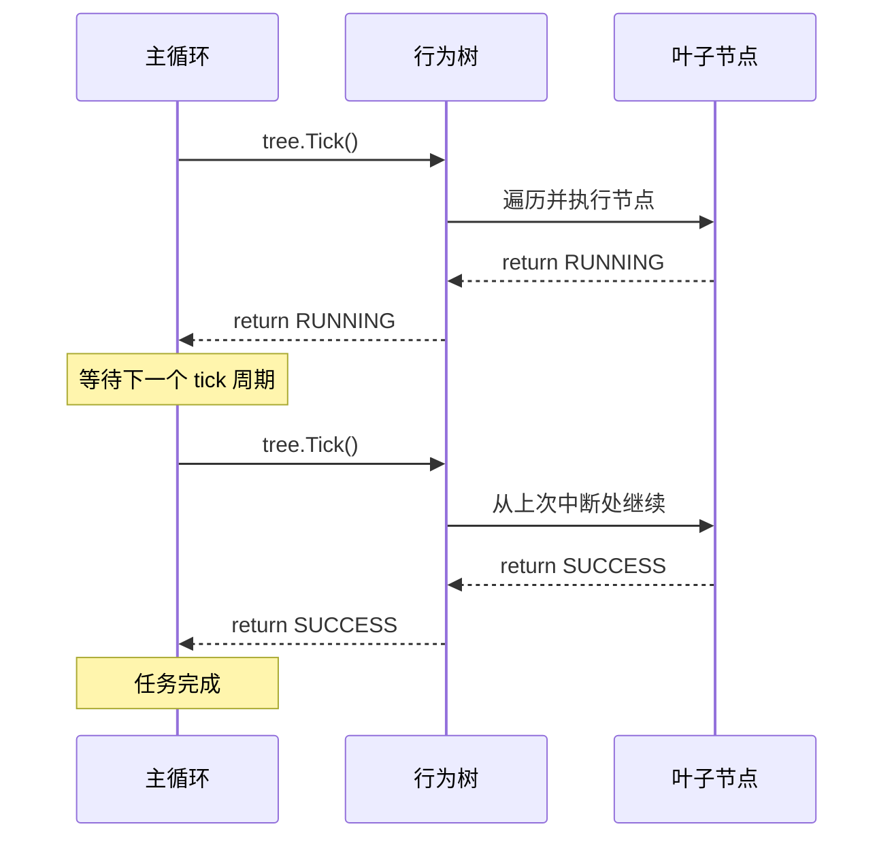
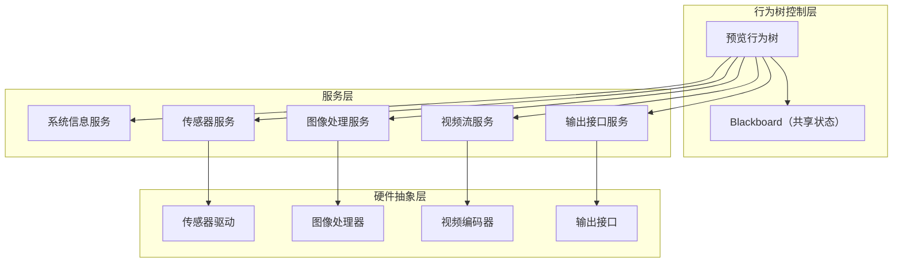
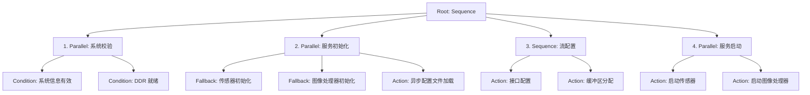

行为树（Behavior Tree，BT）起源于游戏 AI，但其 Tick 心跳机制在嵌入式系统中同样大有用武之地。在设备启动流程、工业控制任务编排、机器人行为规划等单核场景中，BT 提供了一种结构化的协作式并发方案：无需多线程，无需 RTOS 调度器，只靠主循环的周期性 `tick()` 调用就能实现 I/O 并发和复杂决策逻辑。

2024 年，[ZephyrBT](https://github.com/ossystems/zephyrbt) 成为首个专为 Zephyr RTOS 设计的开源 BT 框架；[BehaviorTree.CPP v4.6](https://behaviortree.dev/docs/4.0.2/intro) 持续迭代，成为 C++ 生态的事实标准。学术界也在 2025 年发表了 BT 与 FSM 的系统性对比研究（[arXiv:2405.16137](https://arxiv.org/html/2405.16137v1)），为工程选型提供了量化依据。

本文以 [bt-cpp](https://gitee.com/liudegui/bt-cpp)（C++14 header-only 行为树库）为主线，结合嵌入式视觉平台预览服务的真实重构案例，系统讲解 BT 在嵌入式系统中的工程实践。

> 相关文章:
> - [C 语言层次状态机框架: 从过程驱动到数据驱动](../c_hsm_data_driven_framework/) — HSM 与 BT 互补的架构基础
> - [newosp 深度解析: C++17 事件驱动架构](../newosp_event_driven_architecture/) — newosp 中 HSM + BT 的实际集成

## 1. 为什么嵌入式系统需要行为树

### 1.1 线性流程的三个痛点

嵌入式系统的初始化代码通常是这样的：

```c
rt_err_t system_start(void)
{
    ret = sys_info_init();       /* 阻塞等待 */
    ret = sensor_svc_init();     /* 失败则整体中断 */
    ret = isp_svc_init();        /* 阻塞等待 */
    ret = video_pipeline_init(); /* 阻塞等待 */
    return ret;
}
```

这种写法在系统简单时没有问题，但随着硬件组合增多、初始化步骤变复杂，会暴露三个结构性缺陷：

**启动瓶颈**：I/O 密集型任务（配置文件加载、传感器上电）与 CPU 密集型任务（寄存器配置）严格串行，CPU 在等待 I/O 期间完全空转。实测某视觉平台启动耗时约 1600ms，其中 I/O 等待占 50% 以上。

**容错缺失**：任一步骤失败即整体中断，无法自动降级。传感器初始化失败时，系统不能切换到无传感器的安全模式继续运行。

**条件编译失控**：为适配不同硬件组合，代码中大量嵌套 `#ifdef`，逻辑割裂，测试覆盖率低。

### 1.2 行为树的解法

行为树通过三个机制解决上述问题：

- **RUNNING 状态**：Action 节点不阻塞，返回 `RUNNING` 表示"我还没完成，下次 Tick 再来"，主循环可在此期间执行其他节点
- **Fallback 节点**：声明式错误恢复，主路径失败自动尝试降级路径，无需手写 `if-else` 错误处理
- **Parallel 节点**：在单核上实现协作式并发，多个 I/O 操作交叠执行

### 1.3 BT vs FSM 选型依据

2025 年 IEEE TASE 发表的对比研究（[arXiv:2405.16137](https://arxiv.org/html/2405.16137v1)）给出了量化结论：

| 维度 | FSM | 行为树 (BT) |
|------|-----|-----------|
| 内存占用 | 低 | 中等（节点结构体） |
| CPU 开销 | 极低（直接状态跳转） | 较低（树遍历，百纳秒级） |
| 可扩展性 | 差（状态爆炸） | 好（节点线性增长） |
| 并发表达 | 需要并行状态域 | Parallel 节点原生支持 |
| 错误恢复 | 需要显式转换 | Fallback 内置 |
| 适用场景 | 协议栈、简单控制流 | 复杂任务编排、多步初始化 |

**选型原则**：决策分支少（< 5 步）、有严格状态转换协议 → FSM；多步并发初始化、需要容错降级 → BT；两者互补，BT 管任务编排，FSM 管系统级状态转换。

## 2. Tick 机制核心原理

### 2.1 什么是 Tick

Tick 是行为树的"心跳"。每次 `tick()` 从根节点开始递归遍历，根据节点类型和子节点返回状态决定执行路径。


```mermaid
sequenceDiagram
    participant Main as 主循环
    participant BT as 行为树
    participant Leaf as 叶子节点

    Main->>BT: tree.Tick()
    BT->>Leaf: 遍历并执行节点
    Leaf-->>BT: return RUNNING
    BT-->>Main: return RUNNING
    Note over Main: 等待下一个 tick 周期

    Main->>BT: tree.Tick()
    BT->>Leaf: 从上次中断处继续
    Leaf-->>BT: return SUCCESS
    BT-->>Main: return SUCCESS
    Note over Main: 任务完成
```

bt-cpp 中的 tick 入口：

```cpp
Status Tick() noexcept {
    ++tick_count_;
    last_status_ = root_->Tick(context_);
    return last_status_;
}
```

### 2.2 四种状态

```cpp
enum class Status : uint8_t {
    kSuccess = 0,  // 执行成功
    kFailure = 1,  // 执行失败
    kRunning = 2,  // 仍在执行（异步操作的关键）
    kError   = 3   // 配置错误
};
```

`RUNNING` 是行为树区别于普通 `if-else` 的核心：叶子节点返回 `RUNNING` 时，树保存当前进度；下次 tick 从中断处恢复，期间主循环可执行其他节点。

### 2.3 六种节点类型

| 类型 | 分类 | 语义 | 等价逻辑 |
|------|------|------|----------|
| Action | 叶子 | 执行具体操作 | 函数调用 |
| Condition | 叶子 | 检查条件（不应返回 RUNNING） | if 判断 |
| Sequence | 组合 | 全部子节点成功才成功 | AND + 短路求值 |
| Selector | 组合 | 第一个成功的子节点即可 | OR + 短路求值 |
| Parallel | 组合 | 每帧 tick 所有子节点 | 协作式并发 |
| Inverter | 装饰 | 反转 SUCCESS/FAILURE | NOT |

## 3. 节点遍历语义与协作式并发

### 3.1 Sequence：记忆性推进

Sequence 按顺序执行子节点，`current_child_` 字段保存执行进度，下次 tick 从中断处恢复：

```cpp
Status TickSequence(Context& ctx) noexcept {
    if (status_ != Status::kRunning) {
        current_child_ = 0;
    }
    for (uint16_t i = current_child_; i < children_count_; ++i) {
        Status s = children_[i]->Tick(ctx);
        if (s == Status::kRunning) {
            current_child_ = i;   // 保存进度
            return Status::kRunning;
        }
        if (s != Status::kSuccess) {
            return s;             // 子节点失败，Sequence 失败
        }
    }
    return Status::kSuccess;
}
```

`current_child_` 递增就是 Sequence "动态推进"的本质——树结构完全静态，"动态"只是状态保存的视觉效果。

### 3.2 Selector：声明式 Fallback

Selector 依次尝试子节点，第一个成功即返回。天然适合"主路径失败 → 降级路径"：

```
Selector: 传感器初始化
 ├─ Sequence: 正常路径（上电 → 复位 → 加载配置）
 ├─ Sequence: 重试路径（等待 100ms → 软复位）
 └─ Action: 进入无传感器安全模式  ← 始终返回 SUCCESS
```

最终分支始终 SUCCESS，确保主流程不因传感器故障中断。

### 3.3 Parallel：单核协作式并发

Parallel 在每次 tick 中遍历所有子节点，用 `uint32_t` 位图跟踪完成状态：

```cpp
Status TickParallel(Context& ctx) noexcept {
    for (uint16_t i = 0; i < children_count_; ++i) {
        const uint32_t bit = (1u << i);
        if (child_done_bits_ & bit) continue;  // O(1) 跳过已完成节点

        Status s = children_[i]->Tick(ctx);
        if (s != Status::kRunning) {
            child_done_bits_ |= bit;
            if (s == Status::kSuccess) child_success_bits_ |= bit;
        }
    }
    // 按策略（RequireAll / RequireOne）判定返回值
}
```

三个关键设计：
- **零内存分配**：位图内嵌在节点结构体中
- **O(1) 跳过**：已完成子节点通过位测试快速跳过
- **双策略**：`kRequireAll`（全部成功）和 `kRequireOne`（一个成功即可）

位图宽度 32 位，单个 Parallel 节点最多支持 32 个子节点。

### 3.4 协作式并发的本质

对比传统阻塞方式：

```
阻塞方式（串行）:
  加载配置文件  800ms ████████████████
  传感器初始化  300ms                 ██████
  ISP 初始化    500ms                       ██████████
  总耗时: 1600ms

行为树 Parallel（协作式并发）:
  加载配置文件  800ms ██░░░░░░░░░░░░░░░░░░  （分片执行）
  传感器初始化  300ms   ██████
  ISP 初始化    500ms         ██████████
  总耗时: ~950ms（受最慢任务限制，而非三者之和）
```

每个 Action 节点每次 tick 只执行一小片工作就返回 `RUNNING`，Parallel 节点在下次 tick 继续驱动所有未完成的子节点，实现 I/O 与计算的交叠。

## 4. bt-cpp 库设计

[bt-cpp](https://gitee.com/liudegui/bt-cpp) 是一个 C++14 header-only 行为树库（单文件 `bt/behavior_tree.hpp`，约 960 行），面向嵌入式系统设计。核心原则：

- **模板化类型安全上下文**：`Node<Context>` 消除 `void*` 类型转换
- **固定容量内联子节点数组**：无外部生命周期依赖
- **可配置回调类型**：函数指针（默认）或 `std::function`（宏开关）
- **兼容 `-fno-exceptions -fno-rtti`**

### 4.1 类型安全上下文

C 语言传统做法是 `void* user_data`，需要手动类型转换。bt-cpp 用模板参数替代：

```cpp
// C 风格：运行时类型转换，编译器无法检查
static bt_status_t action_load(bt_node_t *self) {
    file_ctx_t *ctx = (file_ctx_t *)self->user_data;  // 不安全
}

// bt-cpp：编译期类型安全
struct DeviceContext {
    bool sensor_ready = false;
    bool config_loaded = false;
};

bt::Node<DeviceContext> node("Check");
node.set_tick([](DeviceContext& ctx) {
    return ctx.sensor_ready ? bt::Status::kSuccess : bt::Status::kFailure;
});
```

`static_assert` 在编译期阻止传入指针类型：

```cpp
static_assert(!std::is_pointer<Context>::value,
              "Context must not be a pointer type");
```

### 4.2 双模式回调

```cpp
// 默认：函数指针（零堆分配，确定性延迟）
using TickFn = Status(*)(Context&);

// 可选：std::function（支持 lambda 捕获，定义 BT_USE_STD_FUNCTION）
using TickFn = std::function<Status(Context&)>;
```

函数指针模式适合嵌入式场景：零间接开销，节点状态存放在 Context 而非 lambda 捕获。

### 4.3 缓存友好的节点布局

```
Node<Context> 内存布局（热数据前置）:
+00: type_              (1B)  -- 每次 tick 访问
+01: status_            (1B)  -- 每次 tick 访问
+02: children_count_    (2B)  -- 每次 tick 访问
+04: current_child_     (2B)  -- Sequence/Selector 用
+08: child_done_bits_   (4B)  -- Parallel 位图
+12: child_success_bits_(4B)  -- Parallel 位图
+16: tick_              (8B)  -- 叶子节点回调
+40: children_[]        (指针数组，固定容量内联)
+xx: name_              (冷数据，仅调试用)
```

### 4.4 构建时校验

```cpp
bt::BehaviorTree<Context> tree(root, ctx);
bt::ValidateError err = tree.ValidateTree();
// 检查：叶子节点缺少 tick 回调、Inverter 子节点数、Parallel 位图溢出等
```

构建时运行一次，热路径零开销。

## 5. 工程案例：嵌入式视觉平台预览服务重构

### 5.1 现状与痛点

某嵌入式视觉平台的预览服务模块采用线性流程控制，实测启动耗时约 1600ms，主要瓶颈在于：

- 配置文件加载（约 800ms I/O 等待）与硬件初始化严格串行
- 传感器服务初始化失败时整体中断，无降级路径
- 适配不同硬件组合的条件编译宏嵌套 3-4 层，难以测试

### 5.2 行为树架构设计

**分层架构**


```mermaid
graph TB
    subgraph 行为树控制层
        BT["预览行为树"]
        BB["Blackboard（共享状态）"]
    end
    subgraph 服务层
        C["系统信息服务"]
        D["传感器服务"]
        E["图像处理服务"]
        F["视频流服务"]
        G["输出接口服务"]
    end
    subgraph 硬件抽象层
        H["传感器驱动"]
        I["图像处理器"]
        J["视频编码器"]
        L["输出接口"]
    end
    BT --> BB
    BT --> C & D & E & F & G
    D --> H
    E --> I
    F --> J
    G --> L
```

**四阶段主流程**


```mermaid
graph TD
    A[Root: Sequence] --> B[1. Parallel: 系统校验]
    A --> C[2. Parallel: 服务初始化]
    A --> D[3. Sequence: 流配置]
    A --> E[4. Parallel: 服务启动]

    B --> B1[Condition: 系统信息有效]
    B --> B2[Condition: DDR 就绪]

    C --> C1[Fallback: 传感器初始化]
    C --> C2[Fallback: 图像处理器初始化]
    C --> C3[Action: 异步配置文件加载]

    D --> D1[Action: 接口配置]
    D --> D2[Action: 缓冲区分配]

    E --> E1[Action: 启动传感器]
    E --> E2[Action: 启动图像处理器]
```

**启动耗时对比**


```mermaid
gantt
    title 启动流程耗时对比
    dateFormat X
    axisFormat %Lms

    section 串行方案 (约1600ms)
    配置文件加载 (阻塞) :a1, 0, 800
    传感器初始化 (等待) :a2, after a1, 300
    图像处理器初始化 (等待) :a3, after a2, 500

    section 行为树并发方案 (约950ms)
    配置文件加载 (分片1) :b1, 0, 100
    传感器初始化 (执行) :b2, after b1, 300
    配置文件加载 (分片2) :b3, after b2, 100
    图像处理器初始化 (执行) :b4, after b3, 400
    配置文件加载 (剩余) :b5, after b4, 50
```

### 5.3 C11 实现要点

**异步 Action 节点**

耗时操作封装为异步 Action，通过 `static` 状态变量跨 Tick 保持进度：

```c
/* 传感器异步初始化节点（C11） */
bt_status_t action_sensor_init_async(bt_node_t *node)
{
    typedef enum { INIT_IDLE, INIT_STARTED, INIT_DONE } state_e;
    static state_e s_state = INIT_IDLE;

    switch (s_state)
    {
        case INIT_IDLE:
            if (RT_EOK == sensor_svc_init_async())
            {
                s_state = INIT_STARTED;
                return BT_RUNNING;
            }
            return BT_FAILURE;

        case INIT_STARTED:
            if (sensor_svc_is_ready())
            {
                s_state = INIT_DONE;
                return BT_SUCCESS;
            }
            return BT_RUNNING;

        case INIT_DONE:
            s_state = INIT_IDLE;  /* 重置，支持树重启 */
            return BT_SUCCESS;

        default:
            return BT_FAILURE;
    }
}
```

**Condition 节点**

```c
/* 系统信息有效性检查 */
bt_status_t cond_system_info_valid(bt_node_t *node)
{
    const sys_info_t *info = sys_info_get();
    if (RT_NULL == info)
    {
        return BT_FAILURE;
    }
    return (SYS_INFO_STATUS_READY == info->status) ? BT_SUCCESS : BT_FAILURE;
}
```

**条件编译替代方案**

```c
/* 旧方案：嵌套宏散布于业务逻辑 */
#ifdef SENSOR_ENABLED
    sensor_svc_init();
#endif

/* 新方案：宏只控制节点是否加入树，业务逻辑无宏 */
#ifdef SENSOR_ENABLED
    bt_sequence_add_child(init_seq, &sensor_init_node);
#endif
```

### 5.4 重构效果

| 指标 | 重构前 | 重构后 |
|------|--------|--------|
| 启动耗时 | ~1600ms | ~950ms（-40%） |
| 传感器故障处理 | 整体中断 | 自动降级安全模式 |
| 条件编译层级 | 3-4 层嵌套 | 节点注册处 1 层 |
| 新增硬件适配 | 修改主流程 | 添加/替换节点 |

## 6. 异步 I/O 集成模式

### 6.1 std::async + std::future（C++ 环境）

bt-cpp 的标准异步模式：首次 tick 提交 I/O 任务到后台线程，后续 tick 非阻塞轮询 `std::future`：

```cpp
struct AsyncContext {
    std::future<std::string> config_future;
    bool config_started = false;
    std::string config_data;
};

static bt::Status LoadConfigTick(AsyncContext& ctx) {
    if (!ctx.config_started) {
        ctx.config_future = std::async(std::launch::async, load_config_file);
        ctx.config_started = true;
        return bt::Status::kRunning;
    }
    if (ctx.config_future.wait_for(std::chrono::seconds(0)) ==
        std::future_status::ready) {
        ctx.config_data = ctx.config_future.get();
        return bt::Status::kSuccess;
    }
    return bt::Status::kRunning;
}
```

`wait_for(std::chrono::seconds(0))` 是非阻塞的，未就绪时立即返回，不挂起主线程。

### 6.2 裸机/RTOS 环境的异步模式

在无 `std::async` 的裸机环境，用 DMA 完成回调 + 标志位替代：

```c
static volatile rt_bool_t s_dma_done = RT_FALSE;

/* DMA 完成中断回调 */
void dma_complete_callback(void)
{
    s_dma_done = RT_TRUE;
}

bt_status_t action_dma_read(bt_node_t *node)
{
    static rt_bool_t s_started = RT_FALSE;

    if (RT_FALSE == s_started)
    {
        s_dma_done = RT_FALSE;
        dma_start_read(buf, size, dma_complete_callback);
        s_started = RT_TRUE;
        return BT_RUNNING;
    }
    if (RT_TRUE == s_dma_done)
    {
        s_started = RT_FALSE;
        return BT_SUCCESS;
    }
    return BT_RUNNING;
}
```

### 6.3 线程池替代 std::async

`std::async` 每次创建新线程，高频任务提交有开销。固定线程池方案：

```cpp
struct PoolContext {
    std::unique_ptr<ThreadPool> pool;  // 固定 2 个 worker 线程
    std::future<std::string> config_future;
    bool config_started = false;

    PoolContext() : pool(new ThreadPool(2)) {}
};

static bt::Status LoadConfigTick(PoolContext& ctx) {
    if (!ctx.config_started) {
        ctx.config_future = ctx.pool->enqueue(load_config_file);
        ctx.config_started = true;
        return bt::Status::kRunning;
    }
    // 同样用 wait_for(0s) 非阻塞轮询
}
```

线程池优势：线程创建一次复用多次，资源使用有上限（bounded concurrency）。

## 7. 性能特征与工程约束

### 7.1 框架开销量化

以下数据来自 bt-cpp 的 `benchmark_example.cpp`，100,000 次迭代，叶子节点执行极简操作以隔离框架开销：

| 场景 | avg (ns) | p99 (ns) | 说明 |
|------|----------|----------|------|
| Flat Sequence（8 actions） | 130 | 222 | 最佳顺序分发 |
| Deep Nesting（5 levels） | 78 | 136 | 嵌套深度影响 |
| Parallel（4 children） | 75 | 131 | 位图跟踪开销 |
| Selector early exit（1/8） | 58 | 106 | 短路求值收益 |
| 混合树（8 节点） | 97 | 174 | 典型场景 |
| 手写 if-else | 30 | 36 | 基准对照 |

*x86-64 平台，ARM 平台性能特征类似。*

关键结论：
- 一次完整树 tick 约 **97ns**（8 节点混合树）
- 相对手写 if-else 约 **3-4 倍开销**
- 在 20Hz tick 频率（50ms 间隔）下，框架开销占 tick 预算 **< 0.001%**

### 7.2 单核 MCU 适配要点

**Tick 频率选择**

| Tick 间隔 | 适用场景 | CPU 占用 |
|----------|--------|---------|
| 1ms | 高实时性要求 | 较高，需评估 |
| 10ms | 一般启动流程 | 低 |
| 50ms | 低频状态轮询 | 极低 |

启动阶段建议 10ms Tick，进入稳态后可降低频率。

**静态内存池**

```c
/* 静态分配节点池，避免堆碎片 */
#define BT_MAX_NODES 32U
static bt_node_t s_node_pool[BT_MAX_NODES];
static rt_uint8_t s_node_count = 0U;

bt_node_t *bt_alloc_node(void)
{
    if (s_node_count >= BT_MAX_NODES)
    {
        return RT_NULL;
    }
    return &s_node_pool[s_node_count++];
}
```

**Action 节点必须非阻塞**

行为树协作式并发的前提是每个叶子节点快速返回。阻塞调用会打破整棵树的并发能力：

```c
/* 错误：阻塞等待，主循环挂起 */
bt_status_t bad_action(bt_node_t *node)
{
    rt_uint8_t *data = blocking_read(fd, size);  /* 阻塞 100ms */
    return BT_SUCCESS;
}

/* 正确：非阻塞，返回 RUNNING */
bt_status_t good_action(bt_node_t *node)
{
    static rt_bool_t s_started = RT_FALSE;
    if (RT_FALSE == s_started)
    {
        async_read_start(fd, size);
        s_started = RT_TRUE;
        return BT_RUNNING;
    }
    if (async_read_done())
    {
        s_started = RT_FALSE;
        return BT_SUCCESS;
    }
    return BT_RUNNING;
}
```

## 8. BT + HSM 互补架构与迁移策略

### 8.1 BT + HSM 分层架构

BT 和 HSM 不是竞争关系，而是互补：

```
HSM（系统级状态管理）              BT（运行态内的任务编排）
┌─────────────────┐               ┌──────────────────────┐
│ Init            │               │ Root (Sequence)      │
│ Running ────────┼──BT 驱动────▶│  ├─ CheckSensors     │
│ Error           │               │  ├─ Parallel(I/O)    │
│ Shutdown        │               │  └─ Selector(降级)   │
└─────────────────┘               └──────────────────────┘
```

- **HSM** 处理状态转换有严格协议约束的场景（初始化→运行→错误→关机）
- **BT** 处理运行态内的任务编排、并发 I/O、条件降级

这种分层避免了两种架构各自的弱点：BT 不擅长循环状态转换，HSM 不擅长并发任务编排。

### 8.2 渐进式迁移策略

不建议一次性重写，推荐四阶段迁移：

**阶段一：包装验证**
将现有线性流程整体包装为一个 Action 节点，验证行为树框架可运行，不改变任何业务逻辑。

**阶段二：异步化**
将耗时最长的初始化步骤（配置文件加载）改为异步 Action，引入第一个 RUNNING 状态。

**阶段三：容错化**
引入 Fallback 节点替换现有 `if-else` 错误处理，实现自动降级。

**阶段四：并发化**
引入 Parallel 节点实现并发初始化，完成启动耗时优化。

### 8.3 不适合行为树的场景

- 状态转换有严格协议约束（通信协议栈）→ 用 HSM
- 纯事件驱动、无需周期性轮询 → FSM 更高效
- 决策分支少（< 5 个行为）→ if-else 更简单直接
- 极度资源受限（< 8KB RAM）→ 考虑 C 语言版本 [bt_simulation](https://gitee.com/liudegui/bt_simulation)

### 8.4 相关资源

- [bt-cpp](https://gitee.com/liudegui/bt-cpp) — C++14 行为树库（header-only，MIT）
- [bt_simulation](https://gitee.com/liudegui/bt_simulation) — C 语言版本（含嵌入式设备模拟）
- [ZephyrBT](https://github.com/ossystems/zephyrbt) — Zephyr RTOS 专用 BT 框架（2024）
- [BehaviorTree.CPP](https://behaviortree.dev/docs/4.0.2/intro) — C++ 生态事实标准
- [BT vs FSM 对比研究](https://arxiv.org/html/2405.16137v1) — IEEE TASE 2025

---

行为树 Tick 机制的价值在于用**可忽略的运行时开销换取显著的架构清晰度**。对于多步骤初始化、多硬件组合、容错要求高的嵌入式场景，BT 相比线性流程和状态机具有明显的工程优势。迁移的关键不是一次性重写，而是从最痛的瓶颈点开始，渐进式引入异步节点和 Fallback 子树。
