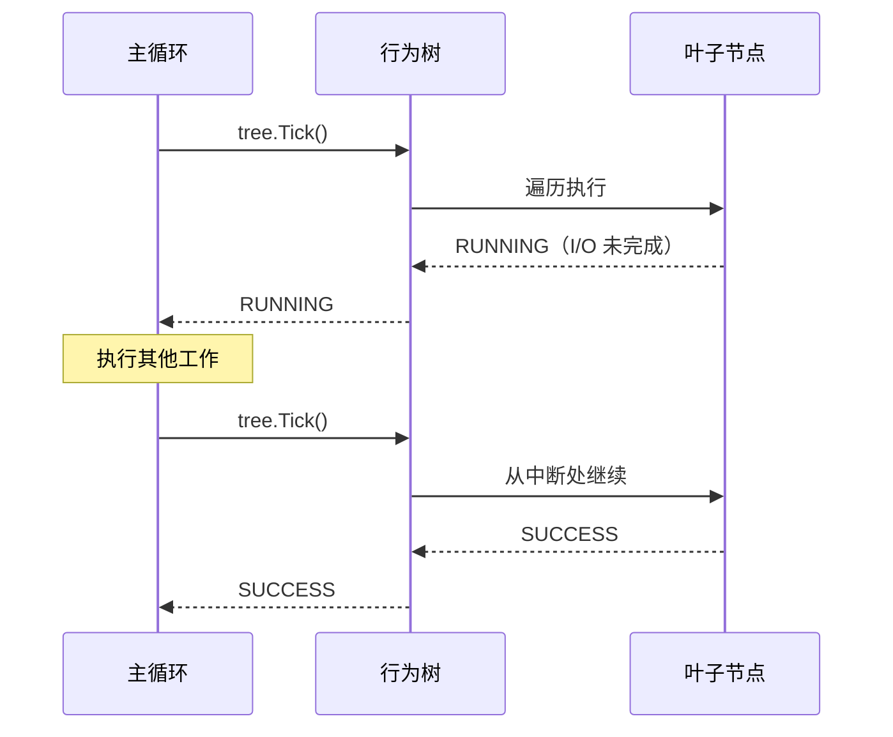
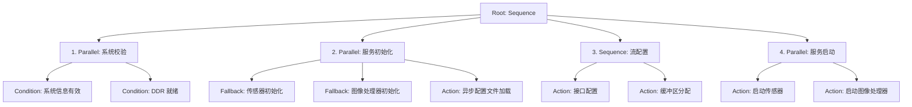

行为树（Behavior Tree，BT）起源于游戏 AI，但其 Tick 心跳机制在嵌入式系统中同样适用。在设备启动流程、工业控制任务编排等单核场景中，BT 提供了一种结构化的协作式并发方案：无需多线程，只靠主循环的周期性 `tick()` 调用就能实现 I/O 并发和复杂决策逻辑。

本文以 [bt-cpp](https://gitee.com/liudegui/bt-cpp)（C++14 header-only 行为树库）为主线，结合嵌入式视觉平台预览服务的真实重构案例和 [newosp](https://gitee.com/liudegui/newosp) 框架的集成实践，系统讲解 BT 在嵌入式系统中的工程落地。

> 相关文章:
> - [C 语言层次状态机框架: 从过程驱动到数据驱动](../c_hsm_data_driven_framework/) — HSM 与 BT 互补的架构基础
> - [newosp 深度解析: C++17 事件驱动架构](../newosp_event_driven_architecture/) — newosp 中 HSM + BT 的实际集成

## 1. 问题与解法

### 1.1 线性流程的三个痛点

嵌入式系统的初始化代码通常是这样的：

```cpp
rt_err_t system_start()
{
    if (RT_EOK != sys_info_init())    return RT_ERROR;  // 阻塞等待
    if (RT_EOK != sensor_svc_init())  return RT_ERROR;  // 失败则整体中断
    if (RT_EOK != isp_svc_init())     return RT_ERROR;  // 阻塞等待
    if (RT_EOK != video_pipeline_init()) return RT_ERROR;
    return RT_EOK;
}
```

随着硬件组合增多、初始化步骤变复杂，这种写法暴露三个结构性缺陷：

**启动瓶颈**：I/O 密集型任务（配置文件加载、传感器上电）与 CPU 密集型任务（寄存器配置）严格串行，CPU 在等待 I/O 期间完全空转。实测某视觉平台启动耗时约 1600ms，其中 I/O 等待占 50% 以上。

**容错缺失**：任一步骤失败即整体中断，无法自动降级。传感器初始化失败时，系统不能切换到无传感器的安全模式继续运行。

**条件编译失控**：为适配不同硬件组合，代码中大量嵌套 `#ifdef`，逻辑割裂，测试覆盖率低。

### 1.2 行为树的三个解法

行为树通过三个机制精准对应上述三个痛点：

| 痛点 | BT 机制 | 原理 |
|------|---------|------|
| 启动瓶颈 | `Parallel` 节点 + `RUNNING` 状态 | 多个 Action 交叠执行，I/O 等待期间切换至其他节点 |
| 容错缺失 | `Selector (Fallback)` 节点 | 主路径失败自动尝试降级路径，声明式错误恢复 |
| 条件编译失控 | 节点级特性开关 | `#ifdef` 只控制节点是否加入树，不散布于业务逻辑 |

## 2. Tick 运行模型

### 2.1 心跳与状态

Tick 是行为树的驱动脉冲。每次 `tree.Tick()` 从根节点开始深度优先遍历，每个节点执行后返回三种状态之一：

```cpp
enum class Status : uint8_t {
    kSuccess = 0,  // 任务完成
    kFailure = 1,  // 任务失败
    kRunning = 2,  // 任务进行中，下次 Tick 继续
};
```

`RUNNING` 是 BT 区别于普通 `if-else` 的核心。叶子节点返回 `RUNNING` 时，树保存当前进度；下次 Tick 从中断处恢复，期间主循环可执行其他节点。


```mermaid
sequenceDiagram
    participant Main as 主循环
    participant BT as 行为树
    participant Leaf as 叶子节点

    Main->>BT: tree.Tick()
    BT->>Leaf: 遍历执行
    Leaf-->>BT: RUNNING（I/O 未完成）
    BT-->>Main: RUNNING
    Note over Main: 执行其他工作

    Main->>BT: tree.Tick()
    BT->>Leaf: 从中断处继续
    Leaf-->>BT: SUCCESS
    BT-->>Main: SUCCESS
```

bt-cpp 的 tick 入口极简：

```cpp
Status Tick() noexcept {
    ++tick_count_;
    last_status_ = root_->Tick(context_);
    return last_status_;
}
```

### 2.2 六种节点类型

| 类型 | 分类 | 语义 | 等价逻辑 |
|------|------|------|----------|
| `Action` | 叶子 | 执行具体操作，可返回三种状态 | 函数调用 |
| `Condition` | 叶子 | 检查条件，只返回 SUCCESS/FAILURE | `if` 判断 |
| `Sequence` | 组合 | 全部子节点成功才成功，任一失败立即返回 | AND 短路 |
| `Selector` | 组合 | 第一个成功的子节点即可，全部失败才失败 | OR 短路 |
| `Parallel` | 组合 | 每次 Tick 驱动所有子节点 | 协作式并发 |
| `Inverter` | 装饰 | 反转 SUCCESS/FAILURE | NOT |

### 2.3 Sequence：记忆性推进

Sequence 用 `current_child_` 保存执行进度，下次 Tick 从中断处恢复：

```cpp
Status TickSequence(Context& ctx) noexcept {
    if (status_ != Status::kRunning) current_child_ = 0;
    for (uint16_t i = current_child_; i < children_count_; ++i) {
        Status s = children_[i]->Tick(ctx);
        if (s == Status::kRunning) {
            current_child_ = i;   // 保存进度
            return Status::kRunning;
        }
        if (s != Status::kSuccess) return s;
    }
    return Status::kSuccess;
}
```

树结构完全静态，"动态推进"只是 `current_child_` 递增的视觉效果。

### 2.4 Selector：声明式 Fallback

Selector 依次尝试子节点，第一个成功即返回，天然映射"主路径失败 → 降级路径"：

```
Selector: 传感器初始化
 ├─ Sequence: 正常路径（上电 → 复位 → 加载配置）
 ├─ Sequence: 重试路径（等待 100ms → 软复位）
 └─ Action: 进入无传感器安全模式  ← 始终返回 SUCCESS
```

最终分支始终 SUCCESS，确保主流程不因传感器故障中断。

### 2.5 Parallel：单核协作式并发

Parallel 在每次 Tick 中驱动所有子节点，用 `uint32_t` 位图跟踪完成状态：

```cpp
Status TickParallel(Context& ctx) noexcept {
    for (uint16_t i = 0; i < children_count_; ++i) {
        const uint32_t bit = (1u << i);
        if (child_done_bits_ & bit) continue;  // O(1) 跳过已完成节点
        Status s = children_[i]->Tick(ctx);
        if (s != Status::kRunning) {
            child_done_bits_ |= bit;
            if (s == Status::kSuccess) child_success_bits_ |= bit;
        }
    }
    // 按策略（RequireAll / RequireOne）判定返回值
}
```

协作式并发的本质：每个 Action 节点每次 Tick 只执行一小片工作就返回 `RUNNING`，Parallel 在下次 Tick 继续驱动所有未完成的子节点，实现 I/O 与计算的交叠：

```
串行方案（1600ms）:
  配置文件加载  ████████████████  800ms
  传感器初始化                    ██████  300ms
  ISP 初始化                            ██████████  500ms

Parallel 协作式并发（~950ms）:
  配置文件加载  ██░░░░░░░░░░░░░░░░░░  （分片执行）
  传感器初始化    ██████
  ISP 初始化            ██████████
```


## 3. 工程案例：预览服务重构

### 3.1 四阶段行为树

某嵌入式视觉平台的预览服务模块，将原有线性流程重构为四阶段 Sequence：


```mermaid
graph TD
    A[Root: Sequence] --> B[1. Parallel: 系统校验]
    A --> C[2. Parallel: 服务初始化]
    A --> D[3. Sequence: 流配置]
    A --> E[4. Parallel: 服务启动]

    B --> B1[Condition: 系统信息有效]
    B --> B2[Condition: DDR 就绪]

    C --> C1[Fallback: 传感器初始化]
    C --> C2[Fallback: 图像处理器初始化]
    C --> C3[Action: 异步配置文件加载]

    D --> D1[Action: 接口配置]
    D --> D2[Action: 缓冲区分配]

    E --> E1[Action: 启动传感器]
    E --> E2[Action: 启动图像处理器]
```

**设计要点：**
- 阶段 1 用 Parallel 同时检查多个前置条件，任一失败则整体中止
- 阶段 2 用 Parallel 交叠 I/O 等待，Fallback 子树处理各服务的降级逻辑
- 阶段 3 用 Sequence 保证接口配置和缓冲分配的严格顺序
- Blackboard 维护全局状态，节点间无直接耦合

### 3.2 启动耗时对比


```mermaid
gantt
    title 启动流程耗时对比
    dateFormat X
    axisFormat %Lms

    section 串行方案 (约1600ms)
    配置文件加载 (阻塞) :a1, 0, 800
    传感器初始化 (等待) :a2, after a1, 300
    图像处理器初始化 (等待) :a3, after a2, 500

    section 行为树并发方案 (约950ms)
    配置文件加载 (分片1) :b1, 0, 100
    传感器初始化 (执行) :b2, after b1, 300
    配置文件加载 (分片2) :b3, after b2, 100
    图像处理器初始化 (执行) :b4, after b3, 400
    配置文件加载 (剩余) :b5, after b4, 50
```

### 3.3 重构效果

| 指标 | 重构前 | 重构后 |
|------|--------|--------|
| 启动耗时 | ~1600ms | ~950ms（-40%） |
| 传感器故障处理 | 整体中断 | 自动降级安全模式 |
| 条件编译层级 | 3-4 层嵌套 | 节点注册处 1 层 |
| 新增硬件适配 | 修改主流程 | 添加/替换节点 |

## 4. 异步节点实现

### 4.1 核心模式：启动 + 轮询

异步 Action 节点的标准结构：首次 Tick 启动操作，后续 Tick 非阻塞轮询完成状态。节点内部用状态枚举跨 Tick 保持进度：

```cpp
// bt-cpp 异步节点：传感器初始化
static bt::Status SensorInitTick(DeviceContext& ctx) {
    switch (ctx.sensor_init_state) {
        case SensorInitState::kIdle:
            if (sensor_svc_.InitAsync() == Status::kOk) {
                ctx.sensor_init_state = SensorInitState::kStarted;
                return bt::Status::kRunning;
            }
            return bt::Status::kFailure;

        case SensorInitState::kStarted:
            if (sensor_svc_.IsReady()) {
                ctx.sensor_init_state = SensorInitState::kDone;
                ctx.sensor_available = true;
                return bt::Status::kSuccess;
            }
            return bt::Status::kRunning;

        case SensorInitState::kDone:
            ctx.sensor_init_state = SensorInitState::kIdle;  // 重置，支持树重启
            return bt::Status::kSuccess;
    }
    return bt::Status::kFailure;
}
```

状态变量存放在 `Context` 而非节点内部，这是 bt-cpp 的设计约定：节点本身无状态，所有运行时状态集中在 Context（即 Blackboard）中。

### 4.2 std::async + std::future

C++ 环境下，I/O 密集型操作可提交到后台线程，用 `wait_for(0s)` 非阻塞轮询：

```cpp
struct DeviceContext {
    std::future<std::vector<uint8_t>> config_future;
    bool config_started = false;
    std::vector<uint8_t> config_data;
    bool sensor_available = false;
    SensorInitState sensor_init_state = SensorInitState::kIdle;
};

static bt::Status LoadConfigTick(DeviceContext& ctx) {
    if (!ctx.config_started) {
        ctx.config_future = std::async(std::launch::async, [] {
            return load_config_from_flash();
        });
        ctx.config_started = true;
        return bt::Status::kRunning;
    }
    if (ctx.config_future.wait_for(std::chrono::seconds(0)) ==
        std::future_status::ready) {
        ctx.config_data = ctx.config_future.get();
        return bt::Status::kSuccess;
    }
    return bt::Status::kRunning;
}
```

`wait_for(std::chrono::seconds(0))` 是非阻塞的，未就绪时立即返回，不挂起主线程。

### 4.3 DMA 回调模式（RTOS 环境）

在无 `std::async` 的 RTOS 环境，用 DMA 完成回调 + 原子标志位替代：

```cpp
struct DmaContext {
    std::atomic<bool> dma_done{false};
    bool dma_started = false;
};

static bt::Status DmaReadTick(DmaContext& ctx) {
    if (!ctx.dma_started) {
        ctx.dma_done.store(false, std::memory_order_relaxed);
        dma_start_read(buf, size, [&ctx]() {
            ctx.dma_done.store(true, std::memory_order_release);
        });
        ctx.dma_started = true;
        return bt::Status::kRunning;
    }
    if (ctx.dma_done.load(std::memory_order_acquire)) {
        ctx.dma_started = false;
        return bt::Status::kSuccess;
    }
    return bt::Status::kRunning;
}
```

`memory_order_release/acquire` 保证中断回调写入对主循环可见，无需额外锁。

### 4.4 Condition 节点

Condition 节点执行快速的前置条件检查，不产生副作用，不返回 `RUNNING`：

```cpp
static bt::Status CheckSystemInfo(DeviceContext& ctx) {
    const auto* info = sys_info_get();
    if (info == nullptr) return bt::Status::kFailure;
    return (info->status == SysInfoStatus::kReady)
           ? bt::Status::kSuccess : bt::Status::kFailure;
}

static bt::Status CheckDdrReady(DeviceContext& ctx) {
    return ddr_is_initialized()
           ? bt::Status::kSuccess : bt::Status::kFailure;
}
```

### 4.5 Action 节点必须非阻塞

协作式并发的前提是每个叶子节点快速返回。阻塞调用会打破整棵树的并发能力：

```cpp
// 错误：阻塞等待，主循环挂起
static bt::Status BadAction(DeviceContext& ctx) {
    auto data = blocking_read(fd, size);  // 阻塞 100ms，其他节点全部停摆
    return bt::Status::kSuccess;
}

// 正确：非阻塞，返回 RUNNING
static bt::Status GoodAction(DeviceContext& ctx) {
    if (!ctx.read_started) {
        async_read_start(fd, size);
        ctx.read_started = true;
        return bt::Status::kRunning;
    }
    if (async_read_done()) {
        ctx.read_started = false;
        return bt::Status::kSuccess;
    }
    return bt::Status::kRunning;
}
```


## 5. newosp 中的 BT 集成

### 5.1 BT 在 newosp 架构中的位置

newosp 的消息流水线中，`StaticNode` 接收 `AsyncBus` 分发的消息，下游可以是回调处理、HSM 或 BT：

```
传感器线程 ─┐
控制线程  ──┼── AsyncBus::Publish() ── [CAS MPSC Ring Buffer] ──┐
网络线程  ─┘                                                     │
                              ┌──── ProcessBatch() ─────────────┘
                              │
                    Node 类型路由 (FNV-1a topic hash)
                              │
                    ┌─────────┼─────────┐
                    │         │         │
                    ▼         ▼         ▼
              StaticNode   Node     WorkerPool
              (零开销)   (动态订阅)  (SPSC 分发)
                    │         │
                    ▼         ▼
                HSM/BT    回调处理
```

**分工原则**：
- `AsyncBus` 负责阶段间解耦通信（无锁 MPSC）
- `HSM`（`LifecycleNode`）负责节点生命周期的状态管理（16 状态层次状态机）
- `BT` 负责运行态内的任务编排、并发 I/O、条件降级

三者职责正交，互不侵入。

### 5.2 LifecycleNode + BT 分层

newosp 的 `LifecycleNode` 内置 16 状态 HSM 管理节点生命周期：

```
Alive (根状态)
├── Unconfigured (Initializing / WaitingConfig)
├── Configured
│   ├── Inactive (Standby / Paused)
│   └── Active (Starting / Running / Degraded)
├── Error (Recoverable / Fatal)
└── Finalized (终态)
```

BT 在 `Active::Running` 子状态内驱动，HSM 负责状态转换的协议约束，BT 负责运行态内的并发任务：

```cpp
class PreviewNode : public newosp::LifecycleNode {
public:
    PreviewNode() : bt_tree_(BuildPreviewTree(), bt_ctx_) {}

protected:
    // HSM Active::Running 入口：启动 BT tick 循环
    void OnActivate() override {
        executor_.Start([this]() {
            while (IsActive()) {
                bt_tree_.Tick();
                std::this_thread::sleep_for(std::chrono::milliseconds(10));
            }
        });
    }

    // HSM 消息处理：将 Bus 消息写入 BT Blackboard
    void OnMessage(const newosp::Message& msg) override {
        if (auto* frame = msg.Get<SensorFrame>()) {
            bt_ctx_.latest_frame = frame;
            bt_ctx_.frame_ready = true;
        }
    }

    // HSM Error 入口：停止 BT，上报故障
    void OnError(newosp::FaultCode code) override {
        executor_.Stop();
        fault_reporter_.Report(code);
    }

private:
    PreviewContext bt_ctx_;
    bt::BehaviorTree<PreviewContext> bt_tree_;
    newosp::StaticExecutor executor_;
};
```

### 5.3 Blackboard 与 AsyncBus 的数据流

BT 的 Blackboard（即 `Context`）作为 Bus 消息与 BT 节点之间的缓冲层：

```cpp
struct PreviewContext {
    // 来自 AsyncBus 的输入（由 OnMessage 写入）
    const SensorFrame* latest_frame = nullptr;
    std::atomic<bool>  frame_ready{false};

    // BT 节点间共享的中间状态
    bool sensor_available = false;
    bool config_loaded    = false;
    SensorInitState sensor_init_state = SensorInitState::kIdle;

    // BT 节点的输出（供下游 Handler 读取）
    ProcessedFrame output_frame;
    newosp::FaultCode last_error = newosp::FaultCode::kNone;
};
```

这种设计保持了 newosp 的核心原则：**消息总线负责阶段间通信，节点内部状态不暴露到总线**。

### 5.4 Executor 选择

BT tick 循环的调度策略由 newosp Executor 决定：

| Executor | BT tick 模式 | 适用场景 |
|----------|-------------|---------|
| `SingleThreadExecutor` | 阻塞调用线程，同步 tick | 调试、单核 MCU |
| `StaticExecutor` | 后台线程 + 休眠策略 | 通用嵌入式场景 |
| `PinnedExecutor` | CPU 绑核，确定性调度 | 多核 SoC |
| `RealtimeExecutor` | SCHED_FIFO + mlockall | 工业实时控制 |

启动阶段建议 10ms tick 间隔（`StaticExecutor`），进入稳态后可降低频率。

## 6. 性能与工程约束

### 6.1 框架开销

bt-cpp `benchmark_example.cpp`，100,000 次迭代，叶子节点执行极简操作以隔离框架开销：

| 场景 | avg (ns) | p99 (ns) |
|------|----------|----------|
| Flat Sequence（8 actions） | 130 | 222 |
| Deep Nesting（5 levels） | 78 | 136 |
| Parallel（4 children） | 75 | 131 |
| Selector early exit（1/8） | 58 | 106 |
| 混合树（8 节点） | 97 | 174 |
| 手写 if-else（基准） | 30 | 36 |

关键结论：
- 一次完整树 tick 约 **97ns**（8 节点混合树）
- 相对手写 if-else 约 **3-4 倍开销**
- 在 10ms tick 间隔下，框架开销占 tick 预算 **< 0.001%**

BT 不适合 > 500Hz 的控制环路（如 PID）。推荐架构：**决策层（BT，10-100Hz）+ 控制层（直接状态机或 PID，1kHz+）**。

### 6.2 bt-cpp 库设计要点

bt-cpp 面向嵌入式设计，核心约束：

**类型安全 Context**：模板参数替代 `void*`，编译期阻止指针类型传入：

```cpp
static_assert(!std::is_pointer<Context>::value,
              "Context must not be a pointer type");
```

**双模式回调**：默认函数指针（零堆分配），可选 `std::function`（宏开关 `BT_USE_STD_FUNCTION`）：

```cpp
using TickFn = Status(*)(Context&);  // 默认：零间接开销
```

**Parallel 位图**：`uint32_t` 内嵌在节点结构体，零额外分配，O(1) 跳过已完成节点，最多支持 32 个子节点。

**构建时校验**：

```cpp
bt::BehaviorTree<Context> tree(root, ctx);
bt::ValidateError err = tree.ValidateTree();
// 检查：叶子节点缺少 tick 回调、Inverter 子节点数、Parallel 位图溢出
```

## 7. 选型与迁移

### 7.1 BT vs FSM 选型

2025 年 IEEE TASE 对比研究（[arXiv:2405.16137](https://arxiv.org/html/2405.16137v1)）的核心结论：**机器人执行任务的行为结果与策略表示无关，但随任务复杂度增加，维护 BT 比维护 FSM 更容易。**

| 维度 | FSM | 行为树 (BT) |
|------|-----|-----------|
| 内存占用 | 低 | 中等（节点结构体） |
| CPU 开销 | 极低（O(1) 状态跳转） | 较低（树遍历，百纳秒级） |
| 可扩展性 | 差（状态爆炸） | 好（节点线性增长） |
| 并发表达 | 需要并行状态域 | Parallel 节点原生支持 |
| 错误恢复 | 需要显式转换 | Fallback 内置 |
| 适用状态数 | < 20 | > 20 |

**选型原则**：
- 协议栈、简单控制流（< 5 步）→ FSM
- 多步并发初始化、容错降级 → BT
- 系统级生命周期管理 → HSM（如 newosp `LifecycleNode`）
- 三者互补，不是竞争关系

### 7.2 渐进式迁移

不建议一次性重写，推荐四阶段迁移：

**阶段一：包装验证** — 将现有线性流程整体包装为一个 Action 节点，验证 BT 框架可运行，不改变任何业务逻辑。

**阶段二：异步化** — 将耗时最长的步骤（配置文件加载）改为异步 Action，引入第一个 `RUNNING` 状态。

**阶段三：容错化** — 引入 Fallback 节点替换 `if-else` 错误处理，实现自动降级。

**阶段四：并发化** — 引入 Parallel 节点实现并发初始化，完成启动耗时优化。

### 7.3 不适合行为树的场景

- 状态转换有严格协议约束（通信协议栈）→ 用 HSM
- 纯事件驱动、无需周期性轮询 → FSM 更高效
- 决策分支少（< 5 个行为）→ `if-else` 更简单直接
- 控制环路 > 500Hz → 不用 BT，用直接状态机或 PID

### 7.4 相关资源

- [bt-cpp](https://gitee.com/liudegui/bt-cpp) — C++14 行为树库（header-only，MIT）
- [newosp](https://gitee.com/liudegui/newosp) — C++17 嵌入式事件驱动框架
- [ZephyrBT](https://github.com/ossystems/zephyrbt) — Zephyr RTOS 专用 BT 框架（2024）
- [BehaviorTree.CPP](https://behaviortree.dev/docs/4.0.2/intro) — C++ 生态事实标准
- [BT vs FSM 对比研究](https://arxiv.org/html/2405.16137v1) — IEEE TASE 2025

---

行为树 Tick 机制的价值在于用可忽略的运行时开销换取显著的架构清晰度。在 newosp 框架中，BT 与 HSM、AsyncBus 职责正交：Bus 负责阶段间通信，HSM 负责生命周期状态管理，BT 负责运行态内的任务编排。迁移的关键不是一次性重写，而是从最痛的瓶颈点开始，渐进式引入异步节点和 Fallback 子树。
