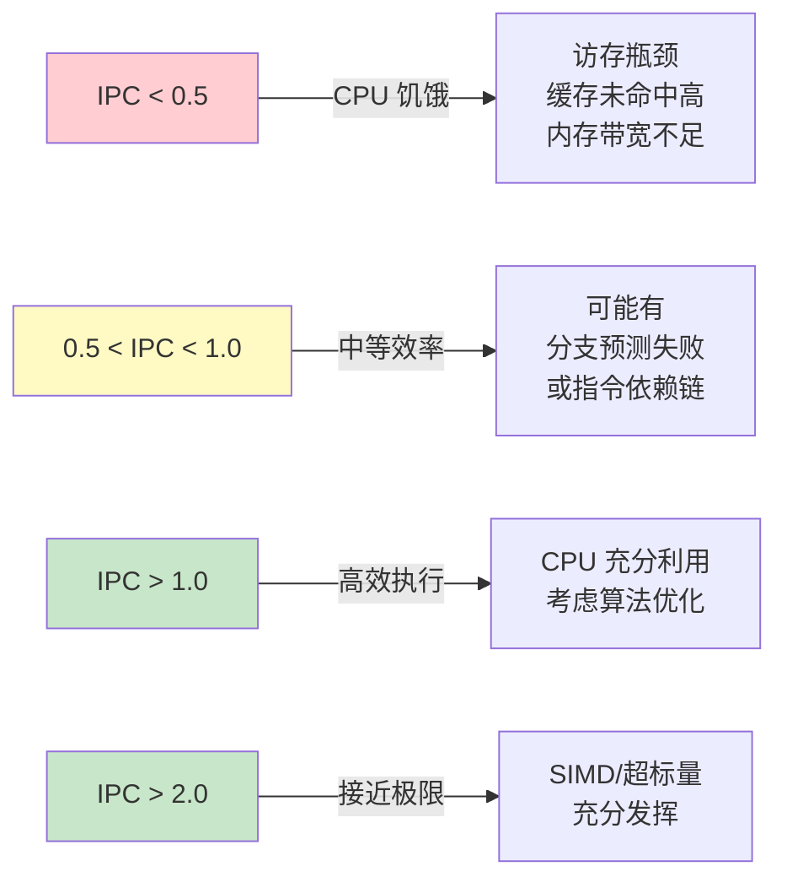
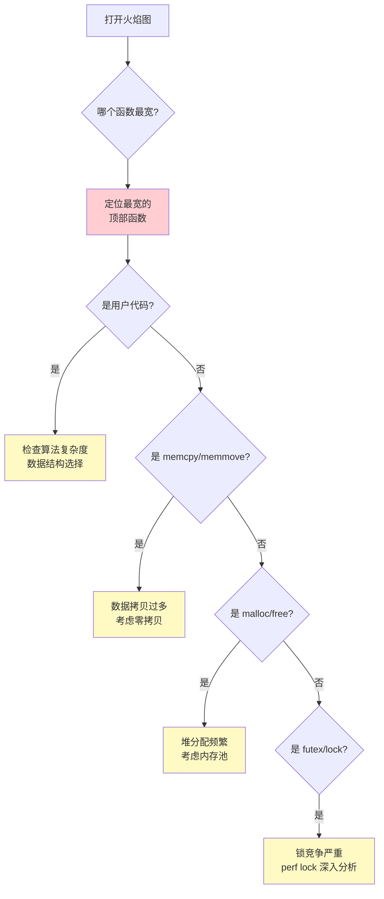
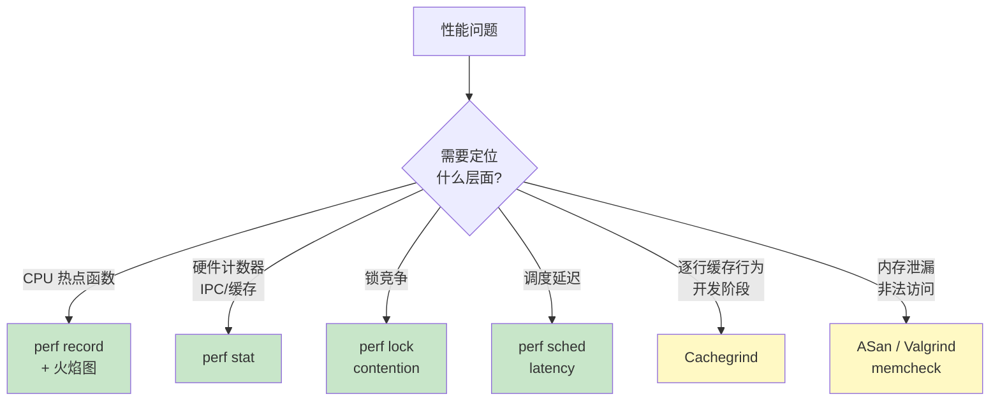
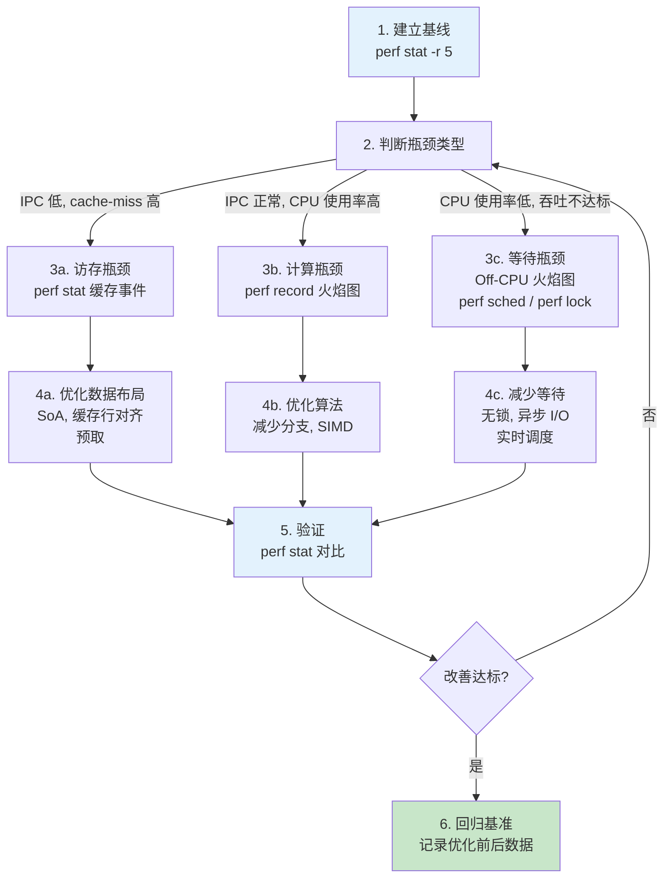

> 相关文章:
> - [perf lock 锁竞争诊断](../perf_lock_contention_diagnosis/) -- perf lock contention 的深度使用
> - [锁竞争基准测试: Spinlock vs Mutex vs ConcurrentQueue](../lock_contention_benchmark/) -- 有锁与无锁的性能实测
> - [C/C++ 系统级性能优化](../system_level_performance_optimization/) -- 从编译器到架构的优化实践
> - [无锁编程核心原理](../lockfree_programming_fundamentals/) -- perf 定位瓶颈后的无锁迁移方向
>
> 参考:
> - [Brendan Gregg: perf Examples](https://www.brendangregg.com/perf.html)
> - [kernel.org: perf-stat](https://man7.org/linux/man-pages/man1/perf-stat.1.html)
> - [Flame Graphs](https://www.brendangregg.com/flamegraphs.html)

---

## 1. perf 工具体系

### 1.1 什么是 perf

perf 是 Linux 内核内置的性能分析框架，通过硬件 PMU（Performance Monitoring Unit）计数器和内核 tracepoint 采集性能数据。它不是一个单一工具，而是一组子命令:

| 子命令 | 功能 | 典型场景 |
|--------|------|----------|
| `perf stat` | 统计硬件/软件事件计数 | IPC、缓存命中率、分支预测率 |
| `perf record` | 采样调用栈 | 定位 CPU 热点函数 |
| `perf report` | 分析采样数据 | 查看热点函数和调用链 |
| `perf top` | 实时热点 | 快速查看当前最耗 CPU 的函数 |
| `perf sched` | 调度事件分析 | 线程唤醒延迟、调度器行为 |
| `perf lock` | 锁竞争分析 | mutex/spinlock 竞争定位 |
| `perf probe` | 动态插桩 | 自定义检测点 |
| `perf script` | 导出原始事件 | 火焰图生成、自定义分析 |

### 1.2 PMU 硬件计数器

性能分析的数据来源是 CPU 内部的 PMU 寄存器。每个 CPU 核心有若干个可编程计数器，能同时监控有限数量的事件。

```
+------------------------------------------+
|              CPU Core                     |
|  +------+  +------+  +------+  +------+  |
|  | PMC0 |  | PMC1 |  | PMC2 |  | PMC3 |  |
|  +------+  +------+  +------+  +------+  |
|  cycles    instr    L1-miss  br-miss     |
|                                           |
|  PMU Controller:                          |
|  - 溢出中断 → perf 采样                    |
|  - 可编程事件选择器                         |
+------------------------------------------+
```

ARM Cortex-A53/A72 通常有 6 个可编程 PMU 计数器 + 1 个 cycle 计数器。当监控事件数超过物理计数器数量时，perf 会自动**多路复用**（multiplexing）: 轮流采集不同事件，用统计方法估算总计数。

查看当前平台支持的事件:

```bash
# 列出所有可用事件
perf list

# 只看硬件事件
perf list hw

# 只看缓存相关事件
perf list cache

# ARM 平台查看 raw PMU 事件
perf list --raw-dump pmu
```

### 1.3 采样 vs 计数

perf 有两种工作模式:

| 模式 | 原理 | 工具 | 开销 |
|------|------|------|------|
| **计数** (counting) | PMU 计数器直接累加，程序结束时读取 | `perf stat` | 极低 (~1%) |
| **采样** (sampling) | 每 N 个事件触发一次中断，记录调用栈 | `perf record` | 中等 (~5-15%) |

计数模式几乎没有运行时开销，适合生产环境。采样模式需要中断处理和栈回溯，有一定开销但能定位具体函数。

---

## 2. 编译安装 perf

### 2.1 嵌入式平台为什么需要手动编译

嵌入式 ARM-Linux 系统通常使用交叉编译的定制内核，发行版自带的 perf 版本与目标内核不匹配，导致:

- tracepoint 事件不可用
- `perf lock contention` 等依赖 BPF 的功能报错
- PMU 事件名称不识别

正确做法是从**目标内核源码**编译匹配版本的 perf。

### 2.2 从内核源码编译

```bash
# 1. 获取内核源码 (与目标设备内核版本匹配)
uname -r
# 例: 5.10.110

# 2. 安装编译依赖
sudo apt install -y flex bison libelf-dev libdw-dev \
    libunwind-dev libslang2-dev libbabeltrace-dev \
    libzstd-dev libtraceevent-dev python3-dev

# 3. 进入 perf 目录
cd linux-5.10.110/tools/perf

# 4. 编译
make -j$(nproc) LDFLAGS=-static

# 5. 验证
./perf version
# perf version 5.10.110

# 6. 安装到系统
sudo cp perf /usr/local/bin/
```

**交叉编译**（ARM 目标板）:

```bash
# 设置交叉编译工具链
export CROSS_COMPILE=aarch64-linux-gnu-
export ARCH=arm64

# 编译
make -j$(nproc) LDFLAGS=-static

# 拷贝到目标板
scp perf root@target:/usr/local/bin/
```

### 2.3 依赖库说明

| 依赖 | 功能 | 缺失影响 |
|------|------|----------|
| `libelf` | ELF 符号解析 | 采样数据无法显示函数名 |
| `libdw` / `libunwind` | DWARF 栈回溯 | `-g` 采样无调用栈 |
| `libtraceevent` | tracepoint 解析 | `perf lock`、`perf sched` 不可用 |
| `libslang` | TUI 界面 | `perf report` 退化为文本模式 |
| `libbabeltrace` | CTF 数据格式 | `perf data` 转换功能不可用 |

编译完成后用 `perf test` 验证功能完整性:

```bash
perf test
# 检查每项测试是否 PASS
```

---

## 3. perf stat: 硬件计数器分析

### 3.1 基本用法

`perf stat` 是性能分析的第一步工具。它通过 PMU 计数器直接统计事件，开销极低:

```bash
# 统计整个程序的默认事件
perf stat ./my_program

# 指定事件
perf stat -e cycles,instructions,cache-misses,branch-misses ./my_program

# 监控运行中的进程 (10 秒)
perf stat -p $(pidof my_program) -- sleep 10

# 按 CPU 核心分别统计
perf stat -e cycles,instructions -A -a -- sleep 5

# 重复 5 次取统计值
perf stat -r 5 ./my_program
```

### 3.2 输出解读

```
 Performance counter stats for './my_program':

     3,827,169,023      cycles                    #    3.201 GHz
     6,142,705,612      instructions              #    1.61  insn per cycle
       127,844,319      cache-references
        18,729,613      cache-misses              #   14.65 % of all cache refs
        45,217,831      branch-misses             #    1.23% of all branches
             1,195      context-switches
                42      cpu-migrations
            12,847      page-faults

       1.195521433 seconds time elapsed
       1.142987000 seconds user
       0.052012000 seconds sys
```

关键指标:

| 指标 | 含义 | 健康范围 |
|------|------|----------|
| **IPC** (insn per cycle) | 每周期执行指令数 | >1.0 良好，<0.5 严重瓶颈 |
| **cache-misses %** | 缓存未命中率 | <5% 良好，>20% 需要优化 |
| **branch-misses %** | 分支预测失败率 | <2% 良好，>5% 考虑消除分支 |
| **context-switches** | 上下文切换次数 | 越少越好 |

### 3.3 IPC: 最重要的单一指标

IPC（Instructions Per Cycle）是衡量 CPU 执行效率的核心指标:

```
IPC = instructions / cycles
```



**IPC 低的常见原因**:

1. **缓存未命中**: 数据不在 L1/L2，等待主内存 (~100 周期)
2. **分支预测失败**: 流水线冲刷，浪费 10-20 周期
3. **指令依赖链**: 后续指令等待前序结果，无法并行
4. **TLB miss**: 页表查找延迟

### 3.4 缓存事件详细分析

```bash
# L1 数据缓存
perf stat -e L1-dcache-loads,L1-dcache-load-misses,\
L1-dcache-stores,L1-dcache-store-misses ./my_program

# LLC (Last Level Cache，通常是 L2 或 L3)
perf stat -e LLC-loads,LLC-load-misses,\
LLC-stores,LLC-store-misses ./my_program

# 精确的缓存层级 (看平台支持)
perf stat -e cache-references,cache-misses ./my_program
```

缓存分析结果示例:

```
     1,287,443,021      L1-dcache-loads
        23,671,882      L1-dcache-load-misses     #    1.84% of all L1-dcache loads
     1,287,443,021      LLC-loads
         4,129,387      LLC-load-misses            #    0.32% of all LLC loads
```

层级关系:

```
CPU Register
    |
    v (1-2 cycles)
L1 Cache (32-64KB, per-core)
    |
    v (3-10 cycles)
L2 Cache (256KB-1MB, per-core or shared)
    |
    v (10-40 cycles)
L3 Cache (if exists, shared)
    |
    v (60-200 cycles)
Main Memory (DRAM)
```

L1 miss 不一定是问题 -- 如果 L2 命中率很高，实际延迟只有 3-10 周期。真正致命的是**穿透到主内存**的 miss。

### 3.5 分支预测分析

```bash
perf stat -e branches,branch-misses ./my_program
```

分支预测失败率高的典型场景:

- 随机数据的 `if/else` 判断
- 虚函数调用 (间接分支)
- 大型 switch-case 且分布均匀

优化方向:

```cpp
// 优化前: 分支预测困难
for (auto& item : items) {
    if (item.type == TypeA) processA(item);
    else if (item.type == TypeB) processB(item);
    else processC(item);
}

// 优化后: 按类型排序，分支预测器容易学习模式
std::sort(items.begin(), items.end(),
    [](const auto& a, const auto& b) {
        return a.type < b.type;
    });
// 同样的循环，但分支预测命中率显著提升
```

---

## 4. perf record + report: 热点函数定位

### 4.1 采样原理

`perf record` 通过 PMU 溢出中断实现采样: 每当某个事件（默认 `cycles`）累积到阈值时，CPU 触发中断，perf 记录当前的 PC（程序计数器）和调用栈。

```
PMU Counter --[溢出]--> 中断 --> perf 记录:
  - 时间戳
  - CPU ID
  - PID / TID
  - PC (指令地址)
  - 调用栈 (如果启用 -g)
```

采样频率越高，定位越精确，但开销也越大:

```bash
# 默认频率 (4000 Hz)
perf record ./my_program

# 高频采样 (更精确，开销更大)
perf record -F 10000 ./my_program

# 低频采样 (生产环境)
perf record -F 99 -p $(pidof my_program) -- sleep 30

# 带调用栈 (推荐 dwarf 回溯)
perf record -g --call-graph dwarf ./my_program

# 指定事件采样
perf record -e cache-misses -g ./my_program
```

### 4.2 perf report 分析

```bash
# 交互式 TUI
perf report

# 文本模式 (适合脚本处理)
perf report --stdio

# 按调用链展开
perf report -g caller

# 只看占比 > 1% 的函数
perf report --percent-limit 1
```

典型输出:

```
Overhead  Command      Shared Object        Symbol
  32.17%  my_program   my_program           [.] process_data
  18.43%  my_program   libc.so.6            [.] memcpy
  12.89%  my_program   my_program           [.] hash_lookup
   9.75%  my_program   [kernel.kallsyms]    [k] copy_user_enhanced
   6.32%  my_program   my_program           [.] serialize_frame
```

**解读原则**:

1. `Overhead` 是**采样命中比例**，不是精确时间。32% 表示约 32% 的采样点落在 `process_data` 中
2. 关注前 3-5 个热点，它们通常占据 60-80% 的 CPU 时间
3. `[kernel.kallsyms]` 表示内核函数，通常与系统调用相关
4. `libc.so` 中的 `memcpy` 占比高，说明数据拷贝是瓶颈

### 4.3 annotate: 指令级定位

对热点函数进一步下钻到源码行或汇编指令:

```bash
# 在 TUI 中选中函数后按 'a' 进入 annotate
perf report

# 或直接命令行 annotate
perf annotate process_data
```

前提条件: 编译时带 `-g` (debug info) 和 `-fno-omit-frame-pointer`:

```bash
# 推荐的 perf 分析编译选项
gcc -O2 -g -fno-omit-frame-pointer -o my_program main.cpp
```

`-O2` 保持生产级优化，`-g` 保留符号信息，`-fno-omit-frame-pointer` 保证栈回溯正确。

---

## 5. 火焰图: 可视化性能剖析

### 5.1 火焰图原理

火焰图（Flame Graph）是 Brendan Gregg 发明的可视化方法，将采样数据的调用栈聚合为一张图:

```
+----------------------------------------------------------+
|                    main                                    |
+----------------------------------------------------------+
|         process_loop           |      io_thread           |
+-------------------------------+---------------------------+
| parse_msg  | dispatch | ack   | read_socket | write_log  |
+------+-----+----------+---+---+------+------+------+-----+
|decode|valid |route|exec|   |   | recv | poll |format|sync |
+------+-----+-----+----+   +   +------+------+------+-----+

x 轴: 采样占比 (越宽越耗 CPU)
y 轴: 调用栈深度 (从下到上)
```

- **横轴宽度**表示该函数在采样中出现的频率（即 CPU 占用比例）
- **纵轴**表示调用栈深度，底部是入口函数，顶部是叶子函数
- **颜色**无特殊含义（随机分配），宽度才是重点

### 5.2 On-CPU 火焰图

On-CPU 火焰图展示程序**正在 CPU 上执行**的时间分布:

```bash
#!/bin/bash
# on_cpu_flamegraph.sh -- 生成 On-CPU 火焰图

PROGRAM=$1
DURATION=${2:-30}
OUTPUT="oncpu_$(date +%Y%m%d_%H%M%S)"

# 1. 采样 (DWARF 栈回溯，兼容 ARM)
perf record -F 99 -g --call-graph dwarf \
    -p $(pidof "$PROGRAM") -- sleep "$DURATION"

# 2. 导出采样数据
perf script > "${OUTPUT}.perf"

# 3. 生成火焰图 (需要 FlameGraph 工具)
# git clone https://github.com/brendangregg/FlameGraph.git
./FlameGraph/stackcollapse-perf.pl "${OUTPUT}.perf" > "${OUTPUT}.folded"
./FlameGraph/flamegraph.pl "${OUTPUT}.folded" > "${OUTPUT}.svg"

echo "火焰图已生成: ${OUTPUT}.svg"
```

### 5.3 Off-CPU 火焰图

Off-CPU 火焰图展示程序**不在 CPU 上执行**（等待 I/O、锁、调度）的时间分布。对于 I/O 密集型或锁竞争严重的程序，Off-CPU 分析比 On-CPU 更重要:

```bash
#!/bin/bash
# off_cpu_flamegraph.sh -- 生成 Off-CPU 火焰图

PROGRAM=$1
DURATION=${2:-30}
OUTPUT="offcpu_$(date +%Y%m%d_%H%M%S)"

# 方法 1: perf record + sched:switch 事件
perf record -e sched:sched_switch -g \
    -p $(pidof "$PROGRAM") -- sleep "$DURATION"
perf script > "${OUTPUT}.perf"

# 方法 2 (推荐，需要 bpftrace):
# bpftrace -e '
#   kprobe:finish_task_switch {
#     @[kstack, ustack, comm] = count();
#   }
# ' -p $(pidof "$PROGRAM") > "${OUTPUT}.stacks"

# 生成火焰图 (倒置: 底部是等待原因)
./FlameGraph/stackcollapse-perf.pl "${OUTPUT}.perf" > "${OUTPUT}.folded"
./FlameGraph/flamegraph.pl --color=io --countname=us \
    "${OUTPUT}.folded" > "${OUTPUT}.svg"
```

### 5.4 火焰图解读方法



常见模式:

| 火焰图特征 | 含义 | 优化方向 |
|------------|------|----------|
| `memcpy` 很宽 | 数据拷贝多 | 零拷贝、就地处理 |
| `malloc`/`free` 很宽 | 堆分配频繁 | 内存池、栈分配 |
| `futex_wait` 很宽 | 锁等待严重 | 减小临界区或无锁 |
| `__GI___poll` 很宽 | I/O 等待 | 异步 I/O、epoll |
| `_spin_lock` 很宽 | 自旋锁竞争 | 减少持锁时间 |

> 锁竞争的深入分析方法见 [perf lock 锁竞争诊断](../perf_lock_contention_diagnosis/)。

---

## 6. perf sched: 调度延迟分析

### 6.1 调度延迟是什么

线程被唤醒后，并不会立即获得 CPU -- 它需要等待调度器分配时间片。这个等待时间就是**调度延迟**（scheduling latency）。对实时系统，调度延迟直接影响响应时间。

```
线程状态:
Sleep ──(wake_up)──> Runnable ──(schedule)──> Running
                     |<--- 调度延迟 --->|
```

### 6.2 perf sched latency

```bash
# 录制调度事件 (需要 root)
perf sched record -- sleep 10

# 或附加到运行中的进程
perf sched record -p $(pidof my_program) -- sleep 10

# 查看调度延迟统计
perf sched latency --sort max
```

输出示例:

```
  Task                  |   Runtime ms  | Switches | Avg delay ms | Max delay ms |
  ----------------------|---------------|----------|--------------|--------------|
  sensor_thread:1234    |    892.431 ms |     1847 | avg:  0.023  | max:  4.127  |
  bus_consumer:1235     |    445.217 ms |      923 | avg:  0.015  | max:  1.893  |
  log_writer:1236       |     23.891 ms |      412 | avg:  0.089  | max: 12.341  |
```

关键指标:

| 指标 | 含义 | 关注点 |
|------|------|--------|
| **Max delay** | 最大调度延迟 | 实时线程超过 1ms 需排查 |
| **Avg delay** | 平均调度延迟 | 整体调度负载指标 |
| **Switches** | 上下文切换次数 | 过高说明线程切换频繁 |
| **Runtime** | 实际 CPU 执行时间 | 占比低说明多数时间在等待 |

### 6.3 perf sched map

`perf sched map` 展示每个 CPU 核心上的线程调度时间线:

```bash
perf sched map
```

```
  *A0           999.538 secs A0 => migration/0:15
  *.A1          999.538 secs A1 => sensor_thread:1234
  *..A2         999.538 secs A2 => bus_consumer:1235
   .A1.         999.539 secs
  *.A1.         999.539 secs
```

这能直观看到线程在哪些核心上运行、是否频繁迁移。线程在核心间迁移会导致 L1/L2 缓存失效。

### 6.4 减少调度延迟的方法

```bash
# 1. CPU 亲和性: 绑定线程到指定核心
taskset -c 2 ./my_program
# 或程序内:
# pthread_setaffinity_np(...)

# 2. 实时调度策略
chrt -f 80 ./my_program   # SCHED_FIFO, 优先级 80

# 3. isolcpus: 隔离 CPU 核心，避免其他进程干扰
# 内核启动参数: isolcpus=2,3
```

---

## 7. ARM 平台缓存与访存分析

### 7.1 ARM PMU 特殊事件

ARM Cortex-A 系列的 PMU 提供了 x86 上没有的精细事件，对嵌入式优化尤为重要:

```bash
# ARM L2 缓存事件 (Cortex-A53/A72)
perf stat -e armv8_pmuv3/l2d_cache_refill/,\
armv8_pmuv3/l2d_cache_wb/,\
armv8_pmuv3/l2d_cache/,\
instructions,cycles \
./my_program
```

| ARM PMU 事件 | 含义 | 性能意义 |
|--------------|------|----------|
| `l2d_cache_refill` | L2 缓存重填 (从主存加载) | 穿透到 DRAM 的次数 |
| `l2d_cache_wb` | L2 缓存回写 | 脏数据写回主存的次数 |
| `l2d_cache` | L2 缓存总访问 | L2 访问总量 |
| `bus_access` | 总线访问 | 外部存储器带宽压力 |
| `mem_access` | 内存访问指令 | load + store 总计 |

### 7.2 访存/指令比

**访存/指令比**（Memory Access per Instruction）是 ARM 嵌入式系统的关键指标:

```
访存/指令比 = mem_access / instructions
```

```bash
perf stat -e mem_access,instructions ./my_program
```

```
     8,421,337,192      mem_access
    12,632,005,788      instructions

    访存/指令比 = 8421337192 / 12632005788 = 0.667
```

| 访存/指令比 | 含义 |
|------------|------|
| < 0.3 | 计算密集型，CPU 利用率高 |
| 0.3 - 0.5 | 平衡型 |
| 0.5 - 0.8 | 访存密集，可能有缓存问题 |
| > 0.8 | 严重访存瓶颈，优化数据布局 |

### 7.3 L2 缓存效率分析

```bash
perf stat -e l2d_cache,l2d_cache_refill,instructions,cycles \
    ./my_program
```

计算:

```
L2 命中率 = 1 - (l2d_cache_refill / l2d_cache)
每千条指令的 L2 miss = (l2d_cache_refill / instructions) * 1000  (MPKI)
```

**MPKI**（Misses Per Kilo Instructions）是比 miss 率更有意义的指标:

| MPKI | 评价 | 优化建议 |
|------|------|----------|
| < 1 | 极好 | 无需优化 |
| 1 - 5 | 良好 | 关注热点数据 |
| 5 - 20 | 有优化空间 | 重新设计数据布局 |
| > 20 | 严重 | 缓存预取 + 数据结构重构 |

### 7.4 数据布局优化实例

perf stat 发现高 L2 miss 后的典型优化:

```cpp
// 优化前: AoS (Array of Structures)
// 遍历只用 x,y 时，z 和 metadata 浪费缓存行
struct Point {
    float x, y, z;         // 12B
    uint32_t metadata;     // 4B
    char name[48];         // 48B
};  // 64B = 1 cache line, 但只用 8B
Point points[10000];

// 优化后: SoA (Structure of Arrays)
// x,y 连续存储，缓存行利用率 100%
struct Points {
    float x[10000];
    float y[10000];
    float z[10000];
    uint32_t metadata[10000];
};
```

用 perf stat 验证优化效果:

```bash
# 优化前
perf stat -e L1-dcache-load-misses,LLC-load-misses ./before
#   23,671,882  L1-dcache-load-misses
#    4,129,387  LLC-load-misses

# 优化后
perf stat -e L1-dcache-load-misses,LLC-load-misses ./after
#    3,412,667  L1-dcache-load-misses   (-85%)
#      187,234  LLC-load-misses         (-95%)
```

---

## 8. 自动化 CPU 监控与 perf 联动

### 8.1 问题场景

嵌入式设备在现场运行时，CPU 负载偶尔飙高但难以复现。手动 SSH 登录再跑 perf 往往已经错过现场。需要一个自动监控脚本，在 CPU 超过阈值时自动触发 perf record。

### 8.2 监控脚本

```bash
#!/bin/bash
# cpu_monitor.sh -- CPU 超阈值自动触发 perf 采样
#
# 用法: ./cpu_monitor.sh [进程名] [CPU阈值%] [采样秒数]
# 示例: ./cpu_monitor.sh my_program 80 10

PROCESS_NAME=${1:-"my_program"}
CPU_THRESHOLD=${2:-80}
SAMPLE_DURATION=${3:-10}
CHECK_INTERVAL=5
OUTPUT_DIR="/var/log/perf_captures"

mkdir -p "$OUTPUT_DIR"

echo "监控进程: $PROCESS_NAME, 阈值: ${CPU_THRESHOLD}%, 采样: ${SAMPLE_DURATION}s"

while true; do
    # 获取目标进程的 CPU 使用率
    PID=$(pidof "$PROCESS_NAME" 2>/dev/null)
    if [ -z "$PID" ]; then
        sleep "$CHECK_INTERVAL"
        continue
    fi

    CPU_USAGE=$(ps -p "$PID" -o %cpu= 2>/dev/null | tr -d ' ')
    if [ -z "$CPU_USAGE" ]; then
        sleep "$CHECK_INTERVAL"
        continue
    fi

    # 比较 (使用 awk 处理浮点数)
    EXCEEDED=$(awk "BEGIN {print ($CPU_USAGE > $CPU_THRESHOLD)}")

    if [ "$EXCEEDED" = "1" ]; then
        TIMESTAMP=$(date +%Y%m%d_%H%M%S)
        PERF_FILE="${OUTPUT_DIR}/perf_${TIMESTAMP}"

        echo "[${TIMESTAMP}] CPU ${CPU_USAGE}% > ${CPU_THRESHOLD}%, 触发采样..."

        # 采集系统快照
        top -bn1 > "${PERF_FILE}_top.txt" 2>/dev/null

        # perf record 采样
        perf record -F 99 -g --call-graph dwarf \
            -p "$PID" -o "${PERF_FILE}.data" \
            -- sleep "$SAMPLE_DURATION" 2>/dev/null

        # 生成文本报告
        perf report -i "${PERF_FILE}.data" --stdio \
            --percent-limit 1 > "${PERF_FILE}_report.txt" 2>/dev/null

        echo "[${TIMESTAMP}] 采样完成: ${PERF_FILE}.data"

        # 冷却期: 避免连续触发
        sleep 60
    fi

    sleep "$CHECK_INTERVAL"
done
```

### 8.3 部署方式

```bash
# 后台运行
nohup ./cpu_monitor.sh my_program 80 10 > /var/log/cpu_monitor.log 2>&1 &

# 或用 systemd service
# /etc/systemd/system/cpu-monitor.service
# [Service]
# ExecStart=/opt/scripts/cpu_monitor.sh my_program 80 10
# Restart=always
```

采集到的数据可以离线分析:

```bash
# 在开发机上分析 (需要相同的二进制和符号)
scp target:/var/log/perf_captures/perf_20260216_*.data .
perf report -i perf_20260216_143022.data
```

---

## 9. perf vs 其他分析工具

### 9.1 perf vs Valgrind/Cachegrind

| 维度 | perf | Cachegrind (Valgrind) |
|------|------|----------------------|
| 工作方式 | 硬件 PMU 采样 | 软件模拟 CPU 缓存 |
| 运行时开销 | ~1-15% | **20-50x 慢** |
| 缓存模型 | 真实硬件 | 模拟（可能与实际不符） |
| 需要修改程序 | 否 | 否 |
| ARM 支持 | 原生 | 支持但模拟更慢 |
| 适用场景 | 生产环境、真实负载 | 开发阶段、详细行级分析 |
| 输出精度 | 统计采样 | 精确计数 |

**选择建议**:

- **开发阶段** + 需要精确到每行代码的缓存行为: 用 Cachegrind
- **生产环境** + 真实负载 + 低开销: 用 perf stat
- **ARM 嵌入式**: 首选 perf（Cachegrind 在 ARM 上模拟开销过大）

### 9.2 Cachegrind 用法参考

```bash
# 运行 Cachegrind
valgrind --tool=cachegrind ./my_program

# 查看结果
cg_annotate cachegrind.out.<pid>

# 输出示例:
# Ir          I1mr    ILmr    Dr          D1mr       DLmr
# 1,234,567   12      5       567,890     23,456     1,234
#
# Ir:  指令读取     D1mr: L1 数据读 miss
# Dr:  数据读取     DLmr: LL 数据读 miss
```

### 9.3 工具选型决策



---

## 10. 完整工作流: 从发现到解决

一个典型的性能分析流程:



### 实战示例

```bash
# Step 1: 建立基线
perf stat -r 5 -e cycles,instructions,cache-misses,\
branch-misses,context-switches ./my_program
# IPC = 0.45, cache-misses = 23%, 初步判断: 访存瓶颈

# Step 2: 定位缓存问题
perf stat -e L1-dcache-load-misses,LLC-load-misses,\
mem_access,instructions ./my_program
# MPKI = 18.7, L2 miss 占 L2 access 的 31%

# Step 3: 火焰图定位热点
perf record -F 99 -g --call-graph dwarf ./my_program
perf script | ./FlameGraph/stackcollapse-perf.pl | \
    ./FlameGraph/flamegraph.pl > flame.svg
# 发现 process_sensor_data() 占 45%, 内部大量遍历 AoS 结构

# Step 4: 优化 (AoS → SoA)
# ... 修改代码 ...

# Step 5: 验证
perf stat -r 5 -e cycles,instructions,cache-misses ./my_program_v2
# IPC: 0.45 → 1.32, cache-misses: 23% → 4.1%
```

---

## 11. 常见问题与排查

### 11.1 权限问题

```bash
# 错误: Permission denied
# 解决: 调整 perf_event_paranoid
echo 1 | sudo tee /proc/sys/kernel/perf_event_paranoid

# perf_event_paranoid 含义:
# -1: 无限制
#  0: 允许非 root 用户访问 tracepoint
#  1: 允许非 root 用户使用 PMU (默认)
#  2: 只允许 root
#  3: 完全禁止 (部分发行版)
```

### 11.2 符号缺失

```bash
# perf report 显示 [unknown] 或只有地址
# 原因: 编译时未保留符号

# 解决 1: 重新编译带符号
gcc -O2 -g -fno-omit-frame-pointer -o my_program main.cpp

# 解决 2: 安装 debuginfo 包 (系统库)
sudo apt install libc6-dbg

# 解决 3: 内核符号
echo 0 | sudo tee /proc/sys/kernel/kptr_restrict
```

### 11.3 多路复用警告

```
# 输出中出现 <not counted> 或 <not supported>
# 原因: 监控事件数超过物理 PMU 计数器

# 解决: 减少同时监控的事件数，分多次运行
perf stat -e cycles,instructions,cache-misses ./prog     # 第一次
perf stat -e branches,branch-misses,L1-dcache-load-misses ./prog  # 第二次
```

### 11.4 perf record 数据过大

```bash
# 长时间采样产生巨大 perf.data
# 解决: 降低频率 + 限制时间 + 压缩
perf record -F 99 -z -o perf.data.zstd -- sleep 30

# 或只关注特定函数
perf record -e cycles --filter 'process_data' -- sleep 30
```

---

## 12. 总结

perf 的核心价值在于用**硬件计数器的真实数据**替代猜测。一套完整的性能分析工具链:

| 阶段 | 工具 | 产出 |
|------|------|------|
| 快速概览 | `perf stat` | IPC、缓存命中率、分支预测率 |
| 热点定位 | `perf record` + 火焰图 | CPU 时间分布，定位到函数 |
| 等待分析 | Off-CPU 火焰图 + `perf sched` | I/O、锁、调度延迟 |
| 锁诊断 | `perf lock contention` | 锁竞争率、持有者 |
| ARM 缓存 | `perf stat` + PMU 事件 | L2 MPKI、访存/指令比 |
| 持续监控 | 自动化脚本 | CPU 飙高自动采样 |

**核心原则**:

1. **先 perf stat，再 perf record**: 计数器开销极低，先确定瓶颈类型
2. **IPC 是入口**: IPC 低看缓存和访存，IPC 正常看算法，CPU 空闲看等待
3. **火焰图看宽度**: 最宽的函数就是最值得优化的目标
4. **优化后必须验证**: perf stat 对比优化前后的硬件计数器数据
5. **ARM 看 L2**: 嵌入式 ARM 通常没有 L3，L2 miss 直接穿透到 DRAM
