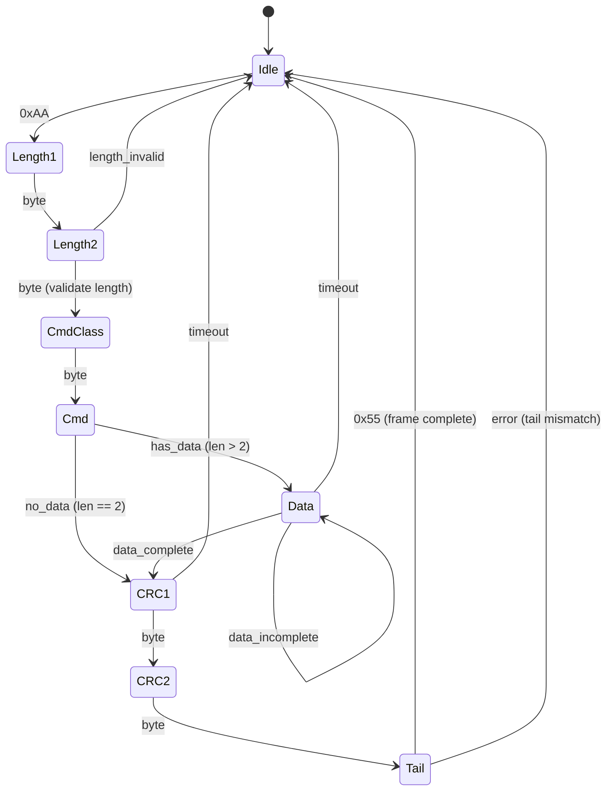

> 原文链接:
> - [嵌入式串口数据流处理中的粘包解决方案](https://blog.csdn.net/stallion5632/article/details/139940595)
> - [串口协议解析方案对比：缓冲区滑窗与分层状态机](https://blog.csdn.net/stallion5632/article/details/148597654)
> - [基于 RT-Thread 的 Bootloader 串口通信协议栈优化方案](https://blog.csdn.net/stallion5632/article/details/149034862)
>
> 配套代码: [uart_statemachine_ringbuffer_linux](https://gitee.com/liudegui/uart_statemachine_ringbuffer_linux) -- C99 实现，POSIX 线程模拟 MCU 中断

## 1. 问题域：为什么串口协议解析值得认真设计

串口（UART）是嵌入式系统中最普遍的通信接口。从 Bootloader 固件升级、传感器数据采集到工业总线协议，几乎所有嵌入式项目都需要处理串口数据的接收与解析。

然而，串口协议解析在工程中经常被轻视：一个 `while` 循环加几个 `if` 判断就能"跑起来"。这种做法在低波特率、简单协议场景下或许够用，但当面对以下真实工程约束时，问题会迅速暴露：

| 工程约束 | 具体挑战 |
|----------|----------|
| 高波特率 (921600+) | ISR 执行时间成为瓶颈，处理不及时导致 FIFO 溢出 |
| 多路串口并行 | 每路需要独立上下文，状态隔离不彻底导致数据串扰 |
| 噪声与粘包 | 字节丢失、帧头误同步、多帧粘连的错误恢复 |
| OTA 升级 | 大数据量传输中任何帧丢失都需要重传机制 |
| 多协议扩展 | 同一串口承载 OTA、诊断、配置等不同帧类型 |
| 资源受限 | Cortex-M0/M3 级别 MCU，RAM 仅数十 KB |

本文围绕一个完整的工程实现（[uart_statemachine_ringbuffer_linux](https://gitee.com/liudegui/uart_statemachine_ringbuffer_linux)），深入对比两种主流解析架构，并讨论在 RT-Thread 等 RTOS 上的集成策略。

## 2. 粘包问题：串口协议解析的第一道坎

串口通信中最常见也最基础的问题是**粘包**：多个独立的数据包被接收端视为一个连续的字节流，边界不可区分。

### 2.1 粘包的成因

- **发送端频率高于接收端处理速度**：接收端来不及逐帧处理，多帧数据堆积在缓冲区
- **变长数据包**：包长度不固定，接收端无法预知下一帧的边界在哪里
- **UART 硬件无帧边界概念**：UART 只传输字节流，不像 CAN 或以太网有天然的帧分隔

### 2.2 三种基本解决思路

| 方法 | 原理 | 优点 | 缺点 |
|------|------|------|------|
| 特殊分隔符 | 用特殊字节标记帧的开始/结束 | 实现简单 | 数据中出现分隔符需要转义处理 |
| 固定长度 | 每帧长度一致，按固定偏移切分 | 解析最快 | 不适用变长数据，浪费带宽 |
| 协议设计 | 帧头 + 长度字段 + 校验 | 灵活通用 | 实现复杂度高于前两者 |

实际工业协议几乎都采用第三种方案，或者第一种和第三种的组合（帧头标记 + 长度字段 + CRC）。

### 2.3 一个朴素实现的问题

最直觉的做法是在主循环中阻塞式地按字段顺序读取：

```c
/* 朴素实现 -- 阻塞式逐字段读取 */
int recv_frame(int fd, uart_frame_t *frame, int timeout_us)
{
    /* 1. 等待帧头 */
    while (1) {
        uart_read(fd, &frame->header, 1, timeout_us);
        if (frame->header == 0xAA) break;  /* 找到帧头 */
    }

    /* 2. 读取长度 */
    if (uart_read(fd, &frame->len, 1, timeout_us) != 1)
        return -1;

    /* 3. 读取命令类型 */
    if (uart_read(fd, &frame->type, 1, timeout_us) != 1)
        return -1;

    /* 4. 读取数据 */
    if (frame->len > 1) {
        if (uart_read(fd, frame->data, frame->len - 1, timeout_us)
            != frame->len - 1)
            return -1;
    }

    /* 5. 读取校验 */
    if (uart_read(fd, &frame->crc, 1, timeout_us) != 1)
        return -1;

    /* 6. 校验 */
    if (frame->crc != calculate_crc((uint8_t *)frame, ...))
        return -1;

    return 0;
}
```

这个实现能在理想条件下工作，但存在严重的工程缺陷：

1. **阻塞式读取**：`uart_read()` 使用 `select()` 超时等待，主线程被完全阻塞，无法处理其他任务
2. **无错误恢复**：如果中间字节丢失，整个解析流程卡死在某个 `uart_read()` 上等超时
3. **无粘包处理**：如果一次 `read()` 返回了跨帧的数据，多余字节直接丢失
4. **单实例限制**：状态完全依赖函数调用栈，无法同时解析多路串口

这正是为什么需要更系统化的解析架构。后续章节介绍的**缓冲区滑窗**和**层次状态机**方案，都是为了解决这些工程问题而设计的。

## 3. 架构分层：ISR 极简原则

无论采用哪种解析方案，一个核心设计原则贯穿始终：**ISR 只做数据搬运，协议处理全部在线程态完成**。

```
+-----------------------------------+
|  业务层     OTA / 诊断 / 配置     |
+-----------------------------------+
|  协议层     帧解析 / CRC / FSM    |  <-- 线程态
+-----------------------------------+
|  驱动层     ISR + Ring Buffer     |  <-- 中断态
+-----------------------------------+
|  硬件       UART FIFO             |
+-----------------------------------+
```

ISR 的职责边界非常清晰：

1. 从硬件 FIFO 读取字节
2. 写入环形缓冲区（或 SPSC 队列）
3. 通知线程（信号量 / 事件标志）
4. **不做**任何协议解析、CRC 计算、状态转换

这个原则的核心原因是中断延迟的确定性。ISR 执行时间越长，其他中断被阻塞的时间越长，系统的实时性越不可控。在 921600 bps 下，每个字节的传输时间约 10.9 us，ISR 必须在这个时间窗口内完成处理。

### 3.1 UART HAL 层设计

配套工程使用 POSIX 线程模拟 MCU 中断机制，但接口设计完全贴合真实 MCU HAL：

```c
/* 串口设备上下文 -- 每路独立 */
typedef struct {
    bool_t initialized;
    uart_config_t config;
    uart_state_e state;
    uart_fifo_t rx_fifo;           /* 硬件 FIFO 模拟 (64 字节) */
    volatile uint32_t int_status;  /* 中断状态标志 */
    uart_stats_t stats;
    pthread_t rx_thread;           /* ISR 模拟线程 */
    sem_t rx_sem;                  /* 接收通知信号量 */
    struct timespec last_rx_time;  /* 超时检测时间戳 */
} uart_port_ctx_t;
```

关键设计点：

- **每路串口独立上下文**：3 路串口各自维护 `uart_port_ctx_t`，彻底隔离状态
- **硬件 FIFO 模拟**：64 字节循环缓冲，支持水位线触发
- **中断类型区分**：`RECV_DATA_AVAILABLE`（FIFO 水位）、`CHARACTER_TIMEOUT`（空闲超时）、`LINE_ERROR`（帧/奇偶校验错误）

ISR 回调的典型实现：

```c
static void uart_isr_callback(uint8_t port, uint32_t int_status)
{
    uint8_t byte;

    /* 仅做数据搬运：FIFO -> 解析器缓冲 */
    while (uart_hal_rx_available(port)) {
        uart_hal_try_get_byte(port, &byte);

        if (current_mode == MODE_RINGBUFFER) {
            rb_parser_put_byte(&rb_parser, byte);
        } else {
            /* HSM 模式：先攒批，再通过 SPSC 队列传递 */
            batch_buf[batch_len++] = byte;
            if (batch_len >= BATCH_SIZE) {
                spsc_queue_push(&hsm_rx_queue, batch_buf, batch_len);
                batch_len = 0;
            }
        }
    }
}
```

## 4. 协议帧格式

工程中定义了两级帧格式，这里重点讨论实际使用的简单帧：

```
+------+--------+----------+-----+------+----------+------+
| 0xAA | LEN(2B)| CMD_CLASS| CMD | DATA | CRC16(2B)| 0x55 |
| 帧头 | 小端序 |   1 B    | 1 B | N B  |  小端序  | 帧尾 |
+------+--------+----------+-----+------+----------+------+

LEN = sizeof(CMD_CLASS) + sizeof(CMD) + sizeof(DATA)
CRC = CRC16-CCITT(CMD_CLASS + CMD + DATA), poly=0x1021, init=0x0000
```

```c
#pragma pack(push, 1)
typedef struct {
    uint8_t header;         /* 0xAA */
    uint16_t length;        /* payload 长度 (小端序) */
    uint8_t cmd_class;      /* 命令类: SYS=0x01, SPI=0x02, OTA=0x04 */
    uint8_t cmd;            /* 具体命令 */
    uint8_t data[256];      /* 变长数据 */
    uint16_t crc16;         /* CRC16-CCITT */
    uint8_t tail;           /* 0x55 */
} uart_frame_t;
#pragma pack(pop)
```

CRC16-CCITT 使用查表法实现，256 项查找表在编译期确定：

```c
static inline uint16_t uart_calc_crc16(const uint8_t *data, uint16_t len)
{
    uint16_t crc = 0x0000;
    while (len--) {
        crc = (crc << 8) ^ crc16_table[((crc >> 8) ^ *data++) & 0xFF];
    }
    return crc;
}
```

## 5. 方案一：环形缓冲区滑窗扫描

### 5.1 核心思路

滑窗法的逻辑直白：ISR 把字节追加到环形缓冲区，主循环反复扫描缓冲区，通过游标滑动来定位帧头、验证帧长、校验 CRC 和帧尾，最后提取完整帧。

```
ISR 写入                 主循环读取
   |                        |
   v                        v
+--+--+--+--+--+--+--+--+--+--+--+--+
|  |AA|03|01|81|xx|CR|CL|55|  |  |  |
+--+--+--+--+--+--+--+--+--+--+--+--+
      ^                       ^
      head (消费者)            tail (生产者)
      |<-- 滑动窗口扫描 -->|
```

### 5.2 数据结构

```c
typedef struct {
    uint32_t size;              /* 必须为 2 的幂 */
    uint32_t mask;              /* size - 1, 用位与替代取模 */
    volatile uint32_t head;     /* 读索引 (消费者) */
    volatile uint32_t tail;     /* 写索引 (生产者) */
    uint8_t *buffer;
} rb_queue_t;

typedef struct {
    rb_queue_t rb;
    uint8_t rb_buffer[1024];            /* 静态分配 */
    uart_frame_t frame;
    rb_parser_stats_t stats;
    rb_frame_callback_t callback;
    void *user_data;
} rb_parser_t;
```

环形缓冲区的大小强制为 2 的幂，这使得取模运算退化为位与操作：`index & mask`，在没有硬件除法器的 Cortex-M0 上尤为重要。

### 5.3 帧提取算法

`rb_parser_try_extract()` 的核心流程：

```
1. 从 head 开始扫描，跳过非 0xAA 字节（同步丢弃）
2. peek 第 2~3 字节，组装 16 位长度值（小端序）
3. 计算完整帧大小 = 1(头) + 2(长度) + LEN + 2(CRC) + 1(尾)
4. 若缓冲区内数据不足完整帧，返回等待
5. peek payload 区域，计算 CRC16
6. 比较计算 CRC 与帧内 CRC
7. 验证尾字节 == 0x55
8. 全部通过：回调上层，head 前进一帧
9. 任一步骤失败：head 前进 1 字节，重新扫描
```

这个算法的关键操作是 `peek`：在不移动 head 的情况下读取缓冲区中任意偏移位置的字节。只有当整帧验证通过后，才一次性推进 head：

```c
static inline uint8_t rb_peek(const rb_queue_t *rb, uint32_t offset)
{
    return rb->buffer[(rb->head + offset) & rb->mask];
}
```

### 5.4 统计与错误跟踪

```c
typedef struct {
    uint32_t frames_received;   /* 成功帧数 */
    uint32_t bytes_received;    /* 总字节数 */
    uint32_t sync_errors;       /* 同步丢弃的非帧头字节 */
    uint32_t crc_errors;        /* CRC 不匹配 */
    uint32_t tail_errors;       /* 帧尾不是 0x55 */
    uint32_t length_errors;     /* 长度字段越界 */
    uint32_t overflow_errors;   /* 缓冲区溢出丢弃 */
} rb_parser_stats_t;
```

每种错误类型独立计数，这对于现场调试至关重要。`sync_errors` 反映信道噪声水平，`overflow_errors` 反映处理速度是否跟得上接收速度。

### 5.5 优缺点分析

**适用场景**：协议结构固定、帧长度短、波特率中低、对实时性要求不苛刻的简单应用。

| 优势 | 劣势 |
|------|------|
| 实现直白，代码量小（约 300 行） | 状态隐含在代码流中，调试时无法直接观察"当前解析到哪一步" |
| 不依赖外部框架 | 粘包/噪声场景下需要多次全局扫描，最坏 O(N^2) |
| 批量处理效率高（一次可剥离多帧） | 协议变更需修改核心扫描逻辑，维护成本高 |
| 内存布局紧凑 | 多实例需要手动管理多套缓冲区和游标 |

## 6. 方案二：层次状态机（HSM）事件驱动

### 6.1 核心思路

状态机方案将协议解析的每个阶段映射为一个显式状态，每个接收字节作为事件分发到当前状态的处理函数。状态转换由转换表驱动，而非代码分支。



### 6.2 HSM 框架设计

工程中实现了一个轻量级的层次状态机框架（移植自 Andreas Misje 的开源实现），核心数据结构如下：

```c
/* 状态定义 */
struct hsm_state {
    const hsm_state_t *parent;           /* 父状态（层次结构） */
    hsm_action_fn entry_action;          /* 进入动作 */
    hsm_action_fn exit_action;           /* 退出动作 */
    const hsm_transition_t *transitions; /* 转换表 */
    size_t num_transitions;
    const char *name;                    /* 调试名称 */
};

/* 转换规则 */
struct hsm_transition {
    uint32_t event_id;                   /* 触发事件 */
    const hsm_state_t *target;           /* 目标状态 */
    hsm_guard_fn guard;                  /* 守卫条件（可选） */
    hsm_action_fn action;                /* 转换动作（可选） */
    hsm_transition_type_t type;          /* 外部/内部转换 */
};

/* 状态机实例 */
struct hsm {
    const hsm_state_t *current_state;
    const hsm_state_t *initial_state;
    void *user_data;
    hsm_action_fn unhandled_event_hook;
    const hsm_state_t **entry_path_buffer; /* LCA 路径计算缓冲 */
    uint8_t buffer_size;
};
```

这个框架的几个关键设计决策：

**层次继承**：每个状态有 `parent` 指针。当子状态无法处理某个事件时，事件自动上抛给父状态。这使得公共行为（如超时重置）只需在父状态定义一次。

**Guard 条件**：转换规则支持 `guard` 函数，只有守卫条件返回 `TRUE` 时转换才会发生。这比在 action 中做条件判断更清晰。

**LCA（最低公共祖先）计算**：层次转换时，框架自动计算源状态和目标状态的最低公共祖先，只执行必要的 exit/entry 动作序列。

**零动态内存**：`entry_path_buffer` 由调用者提供（栈分配），框架本身不做任何 `malloc`。

### 6.3 协议解析器的状态定义

```c
/* 事件定义 */
typedef enum {
    HSM_EVENT_BYTE = 1,     /* 字节接收 */
    HSM_EVENT_RESET,        /* 复位 */
    HSM_EVENT_TIMEOUT       /* 超时 */
} hsm_parser_event_e;

/* 解析器上下文 */
typedef struct {
    hsm_t sm;
    const hsm_state_t *entry_path[8];   /* 层次深度上限 */

    uart_frame_t frame;
    uint8_t current_byte;
    uint16_t expected_len;
    uint16_t data_index;
    uint8_t crc_buf[2];
    uint8_t payload_buf[260];           /* CRC 计算缓冲 */
    uint16_t payload_index;

    hsm_parser_stats_t stats;
    hsm_frame_callback_t callback;
    void *user_data;
} hsm_parser_t;
```

每个状态对应协议帧的一个字段，转换表以声明式的方式描述了完整的解析流程。以 `state_cmd` 为例：

```c
/* Cmd 状态的转换表 -- 根据是否有数据分支 */
static const hsm_transition_t cmd_transitions[] = {
    /* 有数据 (len > 2): 进入 Data 状态 */
    { HSM_EVENT_BYTE, &state_data, guard_has_data, action_store_cmd,
      SM_TRANSITION_EXTERNAL },
    /* 无数据 (len == 2): 直接进入 CRC1 状态 */
    { HSM_EVENT_BYTE, &state_crc1, guard_no_data, action_store_cmd,
      SM_TRANSITION_EXTERNAL },
    /* 超时: 回到 Idle */
    { HSM_EVENT_TIMEOUT, &state_idle, NULL, action_timeout_error,
      SM_TRANSITION_EXTERNAL },
};
```

Guard 函数的实现简洁明了：

```c
static bool_t guard_has_data(hsm_t *sm, const hsm_event_t *event)
{
    hsm_parser_t *parser = (hsm_parser_t *)sm->user_data;
    return (parser->expected_len > 2) ? TRUE : FALSE;
}

static bool_t guard_is_tail(hsm_t *sm, const hsm_event_t *event)
{
    hsm_parser_t *parser = (hsm_parser_t *)sm->user_data;
    return (parser->current_byte == SIMPLE_FRAME_TAIL) ? TRUE : FALSE;
}
```

### 6.4 事件分发流程

每个字节到达时的处理流程：

```c
bool_t hsm_parser_put_byte(hsm_parser_t *parser, uint8_t byte)
{
    parser->current_byte = byte;
    parser->stats.bytes_received++;

    hsm_event_t event = { .id = HSM_EVENT_BYTE, .context = &byte };
    return hsm_dispatch(&parser->sm, &event);
}
```

`hsm_dispatch()` 内部的算法：

1. 在当前状态的转换表中查找匹配 `event_id` 的转换
2. 若找到且有 guard，执行 guard 检查
3. Guard 通过（或无 guard）：执行 exit/action/entry 序列
4. 若当前状态无匹配，向上委托给 `parent` 状态
5. 所有层级都未处理，调用 `unhandled_event_hook`

### 6.5 优缺点分析

**适用场景**：复杂/可扩展协议、多路并行解析、需要高可靠性和可维护性的工业系统。

| 优势 | 劣势 |
|------|------|
| 状态显式可见，调试时可直接查询 `hsm_get_current_state_name()` | 转换表定义的代码量较大 |
| 每字节 O(1) 处理，无全局扫描 | 比滑窗法多一层间接调用开销 |
| 错误恢复局部化：任意状态可直接转回 Idle | 框架本身需要约 200 行实现 |
| 协议扩展只需增删状态，不改核心框架 | 初学者需要理解层次状态机的概念模型 |
| 多实例天然支持：每个 `hsm_parser_t` 独立 | |

## 7. 关键优化：SPSC 无锁队列

在 HSM 方案中，如果每个字节都在 ISR 内直接调用 `hsm_dispatch()`，ISR 的执行时间会显著增加。工程中采用了一个重要的优化：**SPSC 无锁队列作为 ISR 与协议线程之间的缓冲层**。

```
ISR (生产者)                     协议线程 (消费者)
    |                                |
    | spsc_queue_push(batch)         | spsc_queue_pop(batch)
    |                                |
    v                                v
+---+---+---+---+---+---+---+---+---+
|   |   |   |   |   |   |   |   |   |
+---+---+---+---+---+---+---+---+---+
    ^                           ^
    write_idx                   read_idx
```

```c
typedef struct {
    uint32_t size;           /* 2 的幂 */
    uint32_t mask;
    volatile uint32_t head;  /* 消费者索引 */
    volatile uint32_t tail;  /* 生产者索引 */
    uint8_t *buffer;
} spsc_queue_t;
```

SPSC 队列的无锁特性来自生产者和消费者分别只写自己的索引：

- ISR 只写 `tail`，只读 `head`
- 协议线程只写 `head`，只读 `tail`
- 不需要互斥锁，只需要内存屏障保证可见性

在 ARM Cortex-M 上，内存屏障通过 `__DMB()` 指令实现：

```c
#if defined(__ARM_ARCH)
    #define SPSC_QUEUE_DMB()  __asm volatile("dmb" ::: "memory")
#else
    #define SPSC_QUEUE_DMB()  __sync_synchronize()
#endif
```

ISR 内的批量写入：

```c
/* ISR: 攒批写入，减少队列操作次数 */
static uint8_t batch_buf[256];
static uint32_t batch_len = 0;

void isr_handler(uint8_t byte)
{
    batch_buf[batch_len++] = byte;
    if (batch_len >= 256) {
        spsc_queue_push(&hsm_rx_queue, batch_buf, batch_len);
        batch_len = 0;
    }
}
```

协议线程的批量消费：

```c
/* 协议线程: 批量取出，逐字节喂给 HSM */
uint8_t pop_buf[256];
int32_t budget = 1024;

while (budget > 0) {
    int32_t got = spsc_queue_pop(&hsm_rx_queue, pop_buf,
                                 (budget < 256) ? budget : 256);
    if (got <= 0) break;

    hsm_parser_put_data(&parser, pop_buf, (uint32_t)got);
    budget -= got;
}
```

这个设计将 ISR 的执行时间压缩到"攒字节 + 偶尔一次 memcpy"的水平，状态机的全部计算开销转移到协议线程。

## 8. RT-Thread RTOS 集成

上述 Linux 模拟工程的架构可以直接移植到 RT-Thread 平台。RT-Thread 提供了完整的基础设施来替代 POSIX 接口：

| Linux 模拟 | RT-Thread 替代 | 说明 |
|------------|---------------|------|
| `pthread_t` + ISR 模拟 | 硬件 UART ISR | 真实中断，无需模拟 |
| `sem_t` | `rt_sem_t` | 二值信号量通知线程 |
| SPSC 队列 | `rt_ringbuffer` | RT-Thread 内置环形缓冲组件 |
| `pthread_create()` | `rt_thread_create()` | 协议处理线程 |
| `usleep()` | `rt_sem_take(RT_WAITING_FOREVER)` | 阻塞等待接收事件 |

### 8.1 RT-Thread 上的 ISR 实现

```c
/* RT-Thread 串口 ISR -- 仅数据搬运 */
static rt_err_t uart_rx_indicate(rt_device_t dev, rt_size_t size)
{
    uart_dev_t *udev = (uart_dev_t *)dev->user_data;
    uint8_t ch;

    while (rt_device_read(dev, -1, &ch, 1) == 1) {
        rt_ringbuffer_putchar(&udev->rx_rb, ch);
        udev->stats.rx_bytes++;
    }

    rt_sem_release(udev->rx_sem);
    return RT_EOK;
}
```

### 8.2 协议处理线程

```c
static void protocol_thread_entry(void *parameter)
{
    protocol_context_t *ctx = (protocol_context_t *)parameter;
    uart_dev_t *dev = &uart_dev[ctx->uart_id];

    while (1) {
        /* 阻塞等待 ISR 通知 */
        if (rt_sem_take(dev->rx_sem, RT_WAITING_FOREVER) != RT_EOK)
            continue;

        /* 从环形缓冲区逐字节取出，喂给状态机 */
        uint8_t ch;
        while (rt_ringbuffer_getchar(&dev->rx_rb, &ch) == 1) {
            hsm_parser_put_byte(&ctx->parser, ch);
            ctx->last_rx_tick = rt_tick_get();
        }

        /* 超时检测 */
        if ((rt_tick_get() - ctx->last_rx_tick) >
            RT_TICK_PER_SECOND * PROTOCOL_RX_TIMEOUT / 1000) {
            hsm_event_t evt = { .id = HSM_EVENT_TIMEOUT, .context = NULL };
            hsm_dispatch(&ctx->parser.sm, &evt);
            ctx->stats.rx_timeouts++;
        }
    }
}
```

### 8.3 静态上下文管理

在 RTOS 环境中，每路串口需要完全独立的上下文：

```c
#define UART_MAX_NUM         3
#define STATIC_BUFFER_SIZE   2048

typedef struct {
    struct rt_ringbuffer rx_rb;
    uint8_t rb_mem[STATIC_BUFFER_SIZE]; /* 静态分配，无 malloc */
    rt_sem_t rx_sem;
    uint32_t overrun_count;
} uart_dev_t;

typedef struct protocol_context {
    hsm_parser_t parser;
    uint8_t uart_id;
    rt_tick_t last_rx_tick;
    uart_stats_t stats;
} protocol_context_t;

static uart_dev_t uart_dev[UART_MAX_NUM];
static protocol_context_t proto_ctx[UART_MAX_NUM];
```

所有内存静态分配，零 `malloc`。这是嵌入式系统的标准做法：动态内存分配在长期运行的系统中会导致碎片化，且分配延迟不可预测。

## 9. 裸机（Super-Loop）环境适配

并非所有嵌入式系统都有 RTOS。在裸机环境下，没有线程、没有信号量，只有中断和主循环。两种解析方案在裸机下的适配如下。

### 9.1 裸机架构

```
ISR (硬件中断)
    |
    | 写入 ring buffer / SPSC
    | 设置标志位
    |
    v
main() {
    system_init();
    while (1) {                    /* super-loop */
        if (rx_flag) {
            rx_flag = 0;
            protocol_process();    /* 协议解析 */
        }
        other_tasks();             /* LED、ADC、看门狗... */
    }
}
```

核心区别：没有信号量阻塞等待，改用 `volatile` 标志位轮询。

### 9.2 裸机 ISR 实现

```c
/* 裸机 ISR -- 以 STM32 HAL 为例 */
static volatile uint8_t rx_flag = 0;

void USART1_IRQHandler(void)
{
    if (__HAL_UART_GET_FLAG(&huart1, UART_FLAG_RXNE)) {
        uint8_t byte = (uint8_t)(huart1.Instance->DR & 0xFF);

        /* 直接写入解析器的 ring buffer */
        rb_parser_put_byte(&parser, byte);

        rx_flag = 1;
    }
}
```

ISR 的职责与 RTOS 环境完全一致：只做数据搬运。区别仅在于通知方式从信号量变为标志位。

### 9.3 主循环处理

**滑窗方案 -- 裸机**：

```c
int main(void)
{
    system_init();
    uart_init();
    rb_parser_init(&parser, on_frame_received, NULL);

    while (1) {
        /* 轮询处理：有数据就解析 */
        if (rx_flag) {
            rx_flag = 0;
            rb_parser_process(&parser);  /* 扫描并提取所有完整帧 */
        }

        /* 超时检测（裸机无 OS tick，用硬件定时器） */
        if (systick_elapsed_ms(last_rx_time) > PROTOCOL_TIMEOUT_MS) {
            rb_parser_reset(&parser);
        }

        wdog_feed();
        other_periodic_tasks();
    }
}
```

**HSM 方案 -- 裸机**：

```c
int main(void)
{
    system_init();
    uart_init();
    hsm_parser_init(&parser, on_frame_received, NULL);

    while (1) {
        /* 从 SPSC 队列批量取出，喂给 HSM */
        uint8_t buf[64];
        int32_t got = spsc_queue_pop(&rx_queue, buf, sizeof(buf));
        if (got > 0) {
            hsm_parser_put_data(&parser, buf, (uint32_t)got);
            last_rx_tick = systick_get();
        }

        /* 超时事件注入 */
        if (systick_elapsed_ms(last_rx_tick) > PROTOCOL_TIMEOUT_MS) {
            hsm_event_t evt = { .id = HSM_EVENT_TIMEOUT, .context = NULL };
            hsm_dispatch(&parser.sm, &evt);
        }

        wdog_feed();
    }
}
```

### 9.4 裸机环境的注意事项

| 问题 | 解决方案 |
|------|----------|
| 无 OS tick | 使用 SysTick 或硬件定时器提供毫秒级时间基准 |
| 无信号量 | `volatile uint8_t` 标志位 + 主循环轮询 |
| 主循环延迟不确定 | 控制 `other_tasks()` 的最大执行时间，避免饿死协议处理 |
| 中断嵌套 | 确保 ring buffer / SPSC 的写入是原子的（单字节写入天然原子） |
| 内存屏障 | 单核 MCU 用 `atomic_signal_fence(memory_order_seq_cst)` 或 `__DMB()` |

在单核 MCU 上，ISR 与主循环之间不存在真正的并发（ISR 抢占主循环，但不会同时执行），因此 SPSC 队列的内存序要求可以放松为 `relaxed` + `signal_fence`，避免不必要的硬件屏障开销。

## 10. 业务层：命令分发架构

帧解析完成后，业务层根据 `cmd_class` 字段分发到具体的命令处理器：

```c
void handle_packet(const uart_frame_t *frame, void *user_data)
{
    switch (frame->cmd_class) {
        case VDCMD_CLASS_SYS:
            handle_sys_cmd(frame);
            break;
        case VDCMD_CLASS_SPI:
            handle_spi_cmd(frame);
            break;
        case VDCMD_CLASS_OTA:
            handle_ota_cmd(frame);
            break;
        case VDCMD_CLASS_CONFIG:
            handle_config_cmd(frame);
            break;
        default:
            stats.unknown_class++;
            break;
    }
}
```

这种设计使得协议层和业务层完全解耦。协议层只关心帧的完整性和正确性（CRC、帧头帧尾），业务层只关心命令语义。新增命令类只需添加一个 `case` 分支和对应的处理函数。

### 10.1 OTA 升级的会话管理

OTA 是最典型的需要会话状态的业务。配套工程中的 OTA 上下文：

```c
typedef struct {
    ota_state_e state;        /* IDLE / RECEIVING / VERIFYING / COMPLETE */
    uint32_t total_size;
    uint32_t received_size;
    uint32_t start_addr;
    uint32_t crc_expected;
    uint32_t crc_calculated;  /* 增量计算，非最终一次性校验 */
    uint32_t error_count;
} ota_context_t;
```

OTA 命令序列：`START`（擦除 Flash、初始化上下文） -> `DATA`（写入数据块、增量 CRC） -> `END`（标记传输完成） -> `VERIFY`（比对 CRC、确认升级）。

## 11. 性能与资源对比

### 11.1 算法复杂度

| 维度 | 缓冲区滑窗 | HSM 事件驱动 |
|------|-----------|-------------|
| 每字节处理 | O(1) 平均，O(N) 最坏（扫描丢弃） | O(1) 确定性（转换表查找） |
| 帧提取 | O(帧长) 的 peek + CRC | O(帧长) 的逐字节分发 |
| 错误恢复 | O(N) 滑窗重扫描 | O(1) 直接转回 Idle |
| 多帧粘包 | 需要循环调用 `try_extract()` | 自然处理，无需额外逻辑 |

### 11.2 内存占用

| 资源 | 缓冲区滑窗 | HSM 事件驱动 |
|------|-----------|-------------|
| 环形缓冲区 | 1024 B（必须容纳多帧） | 不需要（或 SPSC 队列 4096 B） |
| 帧缓冲 | 256 B | 260 B |
| 状态结构 | 无 | ~200 B（状态/转换表为 const） |
| 统计计数器 | 28 B | 28 B |
| **每实例总计** | ~1320 B | ~500 B (不含 SPSC) / ~4560 B (含 SPSC) |

### 11.3 代码体积

| 模块 | 缓冲区滑窗 | HSM 事件驱动 |
|------|-----------|-------------|
| 解析器 | ~300 行 | ~400 行 |
| 框架 | 0（无框架） | ~200 行（HSM 核心） |
| **总计** | ~300 行 | ~600 行 |

### 11.4 ISR 延迟

| 方案 | ISR 内操作 | 估算延迟 (Cortex-M4 @ 168 MHz) |
|------|-----------|------|
| 滑窗 | 写入 ring buffer（1 次内存写 + 索引更新） | < 100 ns |
| HSM (无 SPSC) | 每字节 `hsm_dispatch()` | ~500 ns - 1 us |
| HSM (有 SPSC) | 写入批量缓冲 + 偶尔 push | < 200 ns (均摊) |

## 12. 选择决策矩阵

| 项目特征 | 推荐方案 |
|----------|----------|
| 协议格式固定，短期不会变 | 滑窗 |
| 可能扩展新命令类/新帧格式 | HSM |
| 单路串口、低波特率 | 滑窗 |
| 多路串口并行 | HSM |
| Bootloader（代码体积敏感） | 滑窗 |
| 长期维护的产品固件 | HSM |
| 团队多人协作 | HSM（状态图即文档） |
| 需要高可靠性错误恢复 | HSM |
| 原型快速验证 | 滑窗 |

实际工程中，两种方案并非互斥。一个常见的组合是：**Bootloader 阶段使用滑窗法**（代码体积最小化），**应用固件使用 HSM**（可维护性和扩展性优先）。

## 13. 调试与诊断

两种方案都内置了统计计数器，可通过 RT-Thread 的 MSH 命令行或自定义 Shell 查询：

```
UART0 Statistics:
  RX Bytes:   24680
  Frames OK:  1024
  Sync Err:   3        <-- 信道噪声指标
  CRC Err:    0        <-- 数据完整性
  Tail Err:   0        <-- 帧结构完整性
  Length Err:  0        <-- 协议合规性
  Overflow:   0        <-- 处理速度 vs 接收速度
  Timeouts:   1        <-- 传输中断
```

HSM 方案额外提供了实时状态查询能力：

```c
printf("Current state: %s\n", hsm_parser_get_state(&parser));
/* 输出: Current state: Data */
```

这在调试"卡在某个状态不动"的问题时非常有价值。

## 14. 总结

串口协议解析看似简单，但在工业嵌入式系统中，它需要应对高波特率、噪声干扰、多路并行、长期运行稳定性等一系列工程挑战。

**缓冲区滑窗**是一个实用的基线方案，适合简单协议和资源极度受限的场景。它的核心优势是实现直白、代码量少、不依赖外部框架。

**层次状态机**是面向复杂协议的工程化方案。它的核心优势是状态显式可见、错误恢复局部化、协议扩展无需修改框架、多实例天然支持。配合 SPSC 无锁队列，可以在不增加 ISR 延迟的前提下获得 HSM 的全部优势。

无论选择哪种方案，以下设计原则是通用的：

1. **ISR 极简**：只做数据搬运，不做协议处理
2. **静态分配**：所有缓冲区预分配，热路径零 malloc
3. **独立上下文**：每路串口完全隔离，无共享状态
4. **统计计数**：每种错误类型独立计数，支撑现场诊断
5. **CRC 校验**：查表法 CRC16-CCITT，平衡速度与代码体积

配套代码 [uart_statemachine_ringbuffer_linux](https://gitee.com/liudegui/uart_statemachine_ringbuffer_linux) 提供了完整的双方案实现，可在 Linux 环境下直接编译运行验证，也可作为移植到 MCU/RTOS 平台的参考起点。
