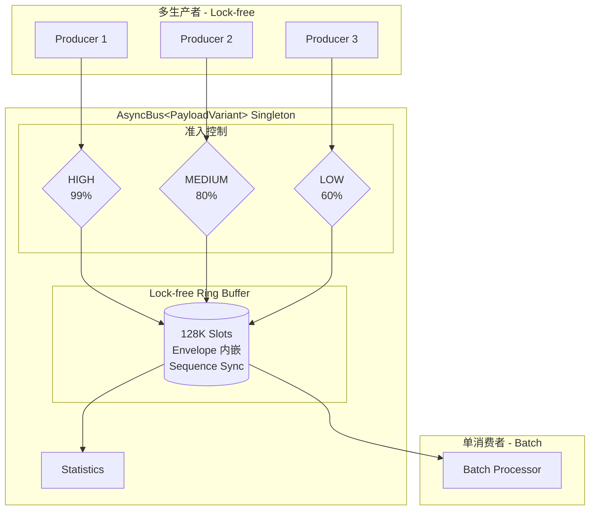
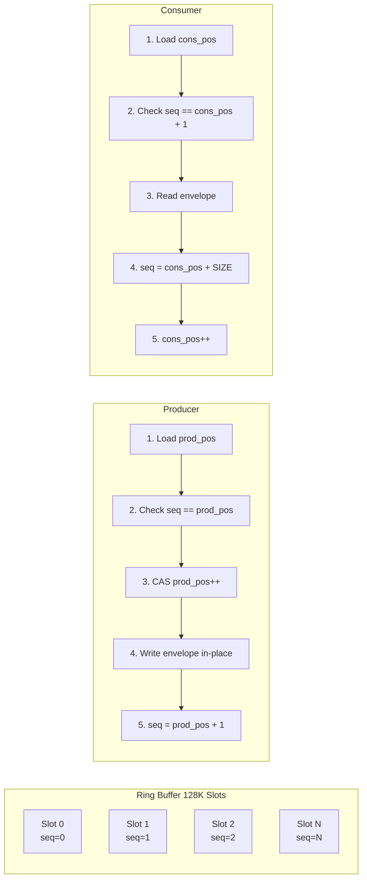
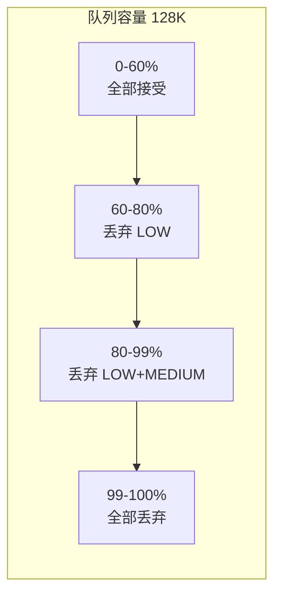
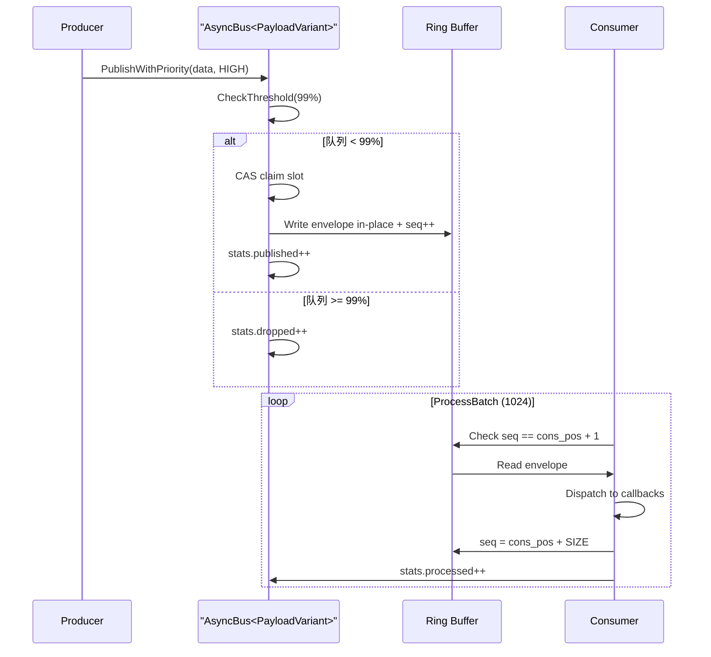
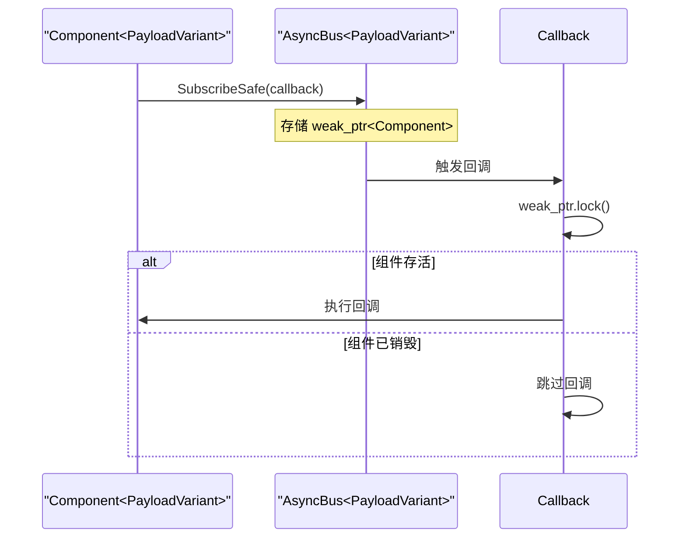

# MCCC 架构设计文档

## 概述

MCCC (Message-Centric Component Communication) 是高性能组件通信框架，采用自研的 **Lock-free MPSC Ring Buffer** 实现，专为安全关键系统设计。

## 核心特性

| 特性 | 说明 |
|------|------|
| **Lock-free** | 无锁 MPSC 队列，CAS 原子操作 |
| **零依赖** | 纯 C++17 实现，无第三方库 |
| **零堆分配** | 热路径无 new/malloc (Envelope 内嵌 + 函数指针释放器) |
| **优先级控制** | HIGH/MEDIUM/LOW 三级准入 |
| **背压监控** | NORMAL/WARNING/CRITICAL/FULL |
| **类型安全** | std::variant 编译期检查 |
| **MISRA 合规** | 安全关键系统标准 (C++17 子集) |
| **编译期可配置** | 队列深度、缓存行对齐、回调表大小均可通过宏调整 |
| **嵌入式优化** | SPSC wait-free、索引缓存、signal fence、BARE_METAL 无锁分发 |

## 架构设计

### 整体架构



### Lock-free Ring Buffer 原理



**关键设计**：
- **Sequence 同步**：每个槽位有序列号，生产者写入后 seq = pos + 1，消费者读取后 seq = pos + SIZE
- **CAS 原子操作**：生产者使用 compare_exchange_weak 竞争槽位
- **Envelope 内嵌**：`MessageEnvelope<PayloadVariant>` 直接嵌入 RingBufferNode，零堆分配
- **Cache-line 对齐**：可配置 alignas 防止 false sharing

### 优先级准入控制

核心设计：**容量预留策略**



| 队列深度 | LOW | MEDIUM | HIGH |
|----------|-----|--------|------|
| 0-60% | Accept | Accept | Accept |
| 60-80% | Drop | Accept | Accept |
| 80-99% | Drop | Drop | Accept |
| 99-100% | Drop | Drop | Drop |

**设计原理**：
- HIGH 消息预留 99% 容量，几乎不可能丢失
- MEDIUM 消息预留 80% 容量，极限负载才丢失
- LOW 消息仅使用 60% 容量，优先被丢弃

### 消息流程



## 编译期配置

所有关键参数均可通过编译宏覆盖，适配不同硬件平台：

| 宏 | 默认值 | 说明 | 嵌入式建议 |
|----|--------|------|-----------|
| `MCCC_QUEUE_DEPTH` | 131072 (128K) | 队列深度，必须为 2 的幂 | 1024 或 4096 |
| `MCCC_CACHELINE_SIZE` | 64 | 缓存行大小 (字节) | 32 或 0 |
| `MCCC_SINGLE_PRODUCER` | 0 | SPSC wait-free 快速路径 (跳过 CAS) | 1 (单生产者场景) |
| `MCCC_SINGLE_CORE` | 0 | 单核模式：关闭缓存行对齐 + relaxed + signal_fence (需 `MCCC_I_KNOW_SINGLE_CORE_IS_UNSAFE=1`) | 1 (Cortex-M 单核 MCU) |
| `MCCC_MAX_MESSAGE_TYPES` | 8 | 消息类型最大数量 | 按需调整 |
| `MCCC_MAX_CALLBACKS_PER_TYPE` | 16 | 每种类型最大回调数 | 按需调整 |
| `MCCC_MAX_SUBSCRIPTIONS_PER_COMPONENT` | 16 | 每组件最大订阅数 | 按需调整 |
| `STREAMING_DMA_ALIGNMENT` | 64 | DMA 缓冲区对齐 | 0 (无缓存 MCU) |

用法示例：
```bash
cmake .. -DCMAKE_CXX_FLAGS="-DMCCC_QUEUE_DEPTH=4096 -DMCCC_SINGLE_CORE=1 -DMCCC_I_KNOW_SINGLE_CORE_IS_UNSAFE=1"
```

## 核心组件

### 1. AsyncBus\<PayloadVariant\>

单例消息总线，提供发布/订阅接口。用户通过 `std::variant` 定义自己的消息载荷类型：

```cpp
// 用户定义消息类型
struct SensorData { float temp; };
struct MotorCmd   { int speed; };
using MyPayload = std::variant<SensorData, MotorCmd>;

// 使用模板实例化总线
using MyBus = mccc::AsyncBus<MyPayload>;
```

API 概览：

```cpp
template <typename PayloadVariant>
class AsyncBus {
public:
    static AsyncBus& Instance();

    // 发布消息
    bool Publish(PayloadVariant&& payload, uint32_t sender_id);
    bool PublishWithPriority(PayloadVariant&& payload, uint32_t sender_id,
                             MessagePriority priority);

    // 快速发布（预计算时间戳）
    bool PublishFast(PayloadVariant&& payload, uint32_t sender_id,
                     uint64_t timestamp_us);

    // 订阅消息 (编译期类型索引)
    template<typename T, typename Func>
    SubscriptionHandle Subscribe(Func&& callback);

    // 取消订阅
    bool Unsubscribe(const SubscriptionHandle& handle);

    // 处理消息
    uint32_t ProcessBatch();  // 批量处理，最多 1024 条

    // 监控
    BusStatisticsSnapshot GetStatistics() const;
    BackpressureLevel GetBackpressureLevel() const;
    uint32_t QueueDepth() const;
    uint32_t QueueUtilizationPercent() const;

    // 性能模式
    void SetPerformanceMode(PerformanceMode mode);
    // 错误回调 (原子操作，无需加锁)
    void SetErrorCallback(ErrorCallback callback);
};
```

### 2. Ring Buffer Node

缓存行对齐的槽位结构，`MessageEnvelope<PayloadVariant>` 直接内嵌（零堆分配）：

```cpp
struct MCCC_ALIGN_CACHELINE RingBufferNode {
    std::atomic<uint32_t> sequence{0U};          // 序列号同步
    MessageEnvelope<PayloadVariant> envelope;     // 直接内嵌，无 shared_ptr
};
```

### 3. MessageEnvelope\<PayloadVariant\> (std::variant)

类型安全的消息载荷，用户定义自己的 `std::variant`，使用 FixedString 替代 std::string：

```cpp
// 用户定义载荷类型
using MyPayload = std::variant<
    MotionData,    // 运动数据 (16 bytes, 栈上值类型)
    CameraFrame,   // 相机帧 (FixedString<16> format, shared_ptr raw_data)
    SystemLog      // 系统日志 (FixedString<64> content)
>;

template <typename PayloadVariant>
struct MessageEnvelope {
    MessageHeader header;       // 消息头 (msg_id, timestamp, sender, priority)
    PayloadVariant payload;     // 消息体 (variant 值语义)
};
```

### 4. 零堆分配容器 (iceoryx 启发)

#### FixedString\<N\>

栈上固定容量字符串，替代 `std::string`：

```cpp
template <uint32_t Capacity>
class FixedString {
public:
    // 编译期检查：字符串字面量不超容量
    template <uint32_t N>
    FixedString(const char (&str)[N]) noexcept;

    // 显式截断构造
    FixedString(TruncateToCapacity_t, const char* str) noexcept;

    const char* c_str() const noexcept;
    uint32_t size() const noexcept;
private:
    char buf_[Capacity + 1U];
    uint32_t size_;
};
```

#### FixedVector\<T, N\>

栈上固定容量向量，替代 `std::vector`：

```cpp
template <typename T, uint32_t Capacity>
class FixedVector {
public:
    bool push_back(const T& value) noexcept;  // 返回 bool，无异常
    bool emplace_back(Args&&... args) noexcept;
    bool erase_unordered(uint32_t index) noexcept;  // O(1) swap-with-last
    void clear() noexcept;

    uint32_t size() const noexcept;
    static constexpr uint32_t capacity() noexcept;
    bool full() const noexcept;
};
```

#### FixedFunction\<Sig, Capacity\>

栈上固定容量类型擦除 callable，替代 `std::function`。SBO (Small Buffer Optimization) 内联存储，超容量编译期报错：

```cpp
template <typename Signature, uint32_t Capacity = 48U>
class FixedFunction;

// 特化: FixedFunction<R(Args...), Cap>
template <typename R, typename... Args, uint32_t Capacity>
class FixedFunction<R(Args...), Capacity> {
public:
    FixedFunction() noexcept = default;
    FixedFunction(std::nullptr_t) noexcept;

    template <typename F>
    FixedFunction(F&& f) noexcept;  // static_assert(sizeof(F) <= Capacity)

    FixedFunction(FixedFunction&& other) noexcept;
    FixedFunction& operator=(FixedFunction&& other) noexcept;

    explicit operator bool() const noexcept;
    R operator()(Args... args) const noexcept;  // 空时返回 R{}
};
```

**与 std::function 对比**：

| 特性 | `std::function` | `FixedFunction<Sig, 48>` |
|------|:---:|:---:|
| 堆分配 | 可能 (>16B) | **永不** |
| 超容量行为 | 运行时 malloc | **编译期报错** |
| 异常路径 | 有 (bad_function_call) | **无** |
| 虚函数表 | 有 | **函数指针 Ops 表** |

**设计要点**：
- 使用 Ops 函数指针表 (destroy/move/invoke) 替代虚基类，消除虚函数表开销
- `static_assert(sizeof(F) <= Capacity)` 确保超容量在编译期而非运行时失败
- 回调表 `CallbackType` 已改用 `FixedFunction<void(const EnvelopeType&), 64U>`

### 5. Component\<PayloadVariant\>

安全的组件基类，使用 FixedVector 管理订阅：

```cpp
template <typename PayloadVariant>
class Component : public std::enable_shared_from_this<Component<PayloadVariant>> {
protected:
    // 安全订阅：使用 weak_ptr 防止悬空回调 + std::get_if 无异常
    template<typename T, typename Func>
    void SubscribeSafe(Func&& callback);

    // 简单订阅：无 self 指针
    template<typename T, typename Func>
    void SubscribeSimple(Func&& callback);

private:
    FixedVector<SubscriptionHandle, MCCC_MAX_SUBSCRIPTIONS_PER_COMPONENT> handles_;
};
```

**weak_ptr 安全机制**：



### 6. StaticComponent\<Derived, PayloadVariant\> (CRTP 零开销组件)

编译期静态分发的组件基类，配合 `ProcessBatchWith` 使用，消除所有间接调用开销：

```cpp
namespace detail {
// SFINAE 检测 Derived 是否有 Handle(const T&) 方法
template <typename Derived, typename T, typename = void>
struct HasHandler : std::false_type {};

template <typename Derived, typename T>
struct HasHandler<Derived, T,
    std::void_t<decltype(std::declval<Derived>().Handle(std::declval<const T&>()))>>
    : std::true_type {};
}  // namespace detail

template <typename Derived, typename PayloadVariant>
class StaticComponent {
public:
    auto MakeVisitor() noexcept;  // 返回编译期分发 visitor
};
```

**与 Component 对比**：

| 特性 | Component | StaticComponent |
|------|:---:|:---:|
| 虚析构函数 | 有 | **无** |
| shared_ptr / weak_ptr | 有 | **无** |
| 运行时订阅/退订 | 有 | 无 |
| Handler 可内联 | 否 | **是** |
| 适用场景 | 动态订阅 | 编译期确定的处理 |

**使用方式**：
```cpp
class MySensor : public StaticComponent<MySensor, MyPayload> {
 public:
  void Handle(const SensorData& d) noexcept { /* 处理 */ }
  void Handle(const MotorCmd& c) noexcept { /* 执行 */ }
  // 未定义 Handle 的类型在编译期静默忽略
};

MySensor sensor;
auto visitor = sensor.MakeVisitor();
bus.ProcessBatchWith(visitor);  // 全路径可内联
```

### 7. DataToken (零拷贝令牌)

使用函数指针 + 上下文替代虚基类 + unique_ptr，消除热路径堆分配：

```cpp
// 函数指针释放回调 (noexcept, 零开销)
using ReleaseCallback = void (*)(void* context, uint32_t index) noexcept;

class DataToken {
public:
    DataToken(const uint8_t* ptr, uint32_t len, uint64_t timestamp,
              ReleaseCallback release_fn, void* release_ctx,
              uint32_t buffer_index) noexcept;

    ~DataToken() noexcept;  // 调用 release_fn_ 归还缓冲区

    const uint8_t* data() const noexcept;
    uint32_t size() const noexcept;
    bool valid() const noexcept;

private:
    const uint8_t* ptr_;
    uint32_t len_;
    uint64_t timestamp_us_;
    ReleaseCallback release_fn_;   // 函数指针，零堆分配
    void* release_ctx_;            // 指向 DMABufferPool
    uint32_t buffer_index_;        // 池中索引
};
```

### 8. 固定回调表

使用编译期类型索引 + 固定数组替代 `unordered_map<type_index, vector>`:

```cpp
// 编译期计算 variant 类型索引
template <typename T, typename Variant>
struct VariantIndex;
// VariantIndex<MotionData, MyPayload>::value == 0
// VariantIndex<CameraFrame, MyPayload>::value == 1

// 固定回调表 (栈上分配)
std::array<CallbackSlot, MCCC_MAX_MESSAGE_TYPES> callback_table_;

struct CallbackSlot {
    std::array<CallbackEntry, MCCC_MAX_CALLBACKS_PER_TYPE> entries{};
    uint32_t count{0U};
};
```

## 性能优化

### 1. Lock-free CAS / SPSC Wait-Free

```cpp
// MPSC 模式 (默认): CAS 循环竞争槽位
do {
    prod_pos = producer_pos_.load(std::memory_order_relaxed);
    node = &ring_buffer_[prod_pos & BUFFER_MASK];
    uint32_t seq = node->sequence.load(MCCC_MO_ACQUIRE);
    detail::AcquireFence();
    if (seq != prod_pos) return false;
} while (!producer_pos_.compare_exchange_weak(
    prod_pos, prod_pos + 1U, MCCC_MO_ACQ_REL, std::memory_order_relaxed));

// SPSC 模式 (MCCC_SINGLE_PRODUCER=1): wait-free，无 CAS 开销
prod_pos = producer_pos_.load(std::memory_order_relaxed);
node = &ring_buffer_[prod_pos & BUFFER_MASK];
uint32_t seq = node->sequence.load(MCCC_MO_ACQUIRE);
detail::AcquireFence();
if (seq != prod_pos) return false;
producer_pos_.store(prod_pos + 1U, std::memory_order_relaxed);
```

### 2. 索引缓存 (减少跨核原子读取)

```cpp
// 生产者侧：两级准入检查
uint32_t cached_cons = cached_consumer_pos_.load(std::memory_order_relaxed);  // 本核缓存
uint32_t estimated_depth = prod - cached_cons;
if (estimated_depth >= threshold) {
    // 仅当缓存估算超阈值时，才跨核读取真实 consumer_pos_
    uint32_t real_cons = consumer_pos_.load(MCCC_MO_ACQUIRE);
    cached_consumer_pos_.store(real_cons, std::memory_order_relaxed);
    // 记录 recheck 统计，监控缓存过期程度
}
```

### 3. 批处理优化 (consumer_pos_ + stats 批量更新)

```cpp
uint32_t ProcessBatch() noexcept {
    uint32_t cons_pos = consumer_pos_.load(std::memory_order_relaxed);
    // 循环内不更新 consumer_pos_，不累计 stats
    for (uint32_t i = 0U; i < BATCH_PROCESS_SIZE; ++i) {
        if (!ProcessOneInBatch(cons_pos, bare_metal)) break;
        ++cons_pos; ++processed;
    }
    // 循环结束后一次性更新
    consumer_pos_.store(cons_pos, std::memory_order_relaxed);
    stats_.messages_processed.fetch_add(processed, std::memory_order_relaxed);
}
```

### 4. Signal Fence (单核 MCU 优化)

```cpp
// MCCC_SINGLE_CORE=1 时：relaxed + 编译器屏障替代硬件 DMB
#if MCCC_SINGLE_CORE
#define MCCC_MO_ACQUIRE  std::memory_order_relaxed
#define MCCC_MO_RELEASE  std::memory_order_relaxed
// 仅约束编译器重排序，无硬件屏障开销
inline void AcquireFence() { std::atomic_signal_fence(std::memory_order_acquire); }
#endif
```

### 5. BARE_METAL 无锁分发

```cpp
// BARE_METAL 模式：callback table 视为初始化后不可变，跳过 shared_mutex
if (bare_metal) {
    DispatchMessageBareMetal(node.envelope);  // 无锁
} else {
    DispatchMessage(node.envelope);  // shared_lock 读锁
}
```

### 6. ProcessBatchWith 编译期分发

`ProcessBatchWith<Visitor>` 绕过回调表和 `shared_mutex`，使用 `std::visit` 将消息直接分发到用户提供的 visitor，实现全路径可内联。配合 `StaticComponent` 的 `MakeVisitor()` 使用，可消除所有间接调用开销。

```cpp
// 传统路径: ProcessBatch -> shared_lock -> 遍历 callback_table_ -> FixedFunction 间接调用
// 零开销路径: ProcessBatchWith -> std::visit -> 编译期分发，全路径可内联
auto visitor = mccc::make_overloaded(
    [](const SensorData& d) { process(d); },
    [](const MotorCmd& c) { execute(c); }
);
bus.ProcessBatchWith(visitor);
```

### 7. 线程安全设计

| 成员 | 同步机制 | 说明 |
|------|---------|------|
| `producer_pos_` | `atomic` + CAS / SPSC store | 多生产者 CAS，单生产者 wait-free store |
| `consumer_pos_` | `atomic` relaxed | 单消费者，ProcessBatch 批量更新 |
| `cached_consumer_pos_` | `atomic` relaxed | 生产者侧缓存，减少跨核读取 |
| `performance_mode_` | `atomic` relaxed | 读多写少 |
| `error_callback_` | `atomic` release/acquire | 设置与调用解耦 |
| `callback_table_` | `std::shared_mutex` | 分发取读锁，订阅/取消取写锁；BARE_METAL 模式无锁 |

## 性能数据

### 测试模式说明

MCCC 提供运行时性能模式（通过 `SetPerformanceMode()` 切换，非编译宏）：

| 模式 | 说明 | 用途 |
|------|------|------|
| FULL_FEATURED | 全功能：优先级准入检查 + 背压判断 + 统计计数 | **生产环境默认模式** |
| BARE_METAL | 跳过优先级/背压/统计，仅保留核心 CAS 入队 | 纯队列性能基线对比 |
| NO_STATS | 保留优先级准入，跳过统计计数 | 需要准入控制但不需要统计 |

### 性能指标（完整配置矩阵）

> 测试环境: Ubuntu 24.04, GCC 13.3, -O3 -march=native, Intel Xeon Cascadelake 64 vCPU
> P50/P99 为延迟百分位数。P50 = 中位数（典型延迟），P99 = 尾部延迟（99% 消息低于此值）。

#### 入队吞吐量

| 配置 | SP | SC | FULL_FEATURED | BARE_METAL | Feature Overhead |
|------|:--:|:--:|:---:|:---:|:---:|
| **A: MPSC (默认)** | 0 | 0 | 27.7 M/s (36 ns) | 33.0 M/s (30 ns) | 5.8 ns |
| **B: SPSC** | 1 | 0 | 30.3 M/s (33 ns) | **43.2 M/s (23 ns)** | 9.8 ns |
| **C: MPSC+单核** | 0 | 1 | 29.2 M/s (34 ns) | 38.2 M/s (26 ns) | 8.1 ns |
| **D: SPSC+单核** | 1 | 1 | 29.4 M/s (34 ns) | 39.9 M/s (25 ns) | 8.9 ns |

> SP = `MCCC_SINGLE_PRODUCER`, SC = `MCCC_SINGLE_CORE`

#### 端到端延迟 (FULL_FEATURED)

| 配置 | P50 | P95 | P99 | Max |
|------|-----|-----|-----|-----|
| A: MPSC | 585 ns | 783 ns | 933 ns | 18 us |
| B: SPSC | 680 ns | 892 ns | 1063 ns | 13 us |
| C: MPSC+单核 | **310 ns** | **389 ns** | **442 ns** | 17 us |
| D: SPSC+单核 | 625 ns | 878 ns | 1011 ns | 18 us |

#### 背压准入控制（所有配置均通过）

| 优先级 | 发送 | 丢弃率 |
|--------|------|--------|
| HIGH | 30,000 | **0.0%** |
| MEDIUM | 39,321 | 12.6% |
| LOW | 39,320 | 47.6% |

#### 分析

- **BARE_METAL 吞吐量**：SPSC 比 MPSC 快 31%（CAS 消除），SINGLE_CORE 比多核快 15%（relaxed ordering）
- **FULL_FEATURED 吞吐量**：各配置接近（~28-30 M/s），shared_mutex 读锁是主要瓶颈
- **SINGLE_CORE E2E 延迟**：MPSC+单核 P50 仅 310 ns，是默认配置的 53%（x86 上 relaxed ordering 减少 store buffer 序列化）
- **嵌入式 MCU**：ARM Cortex-M 上 SINGLE_CORE 收益更大（省去 DMB 硬件屏障指令）

> **注意**：性能数据因硬件环境而异，以上为参考范围。详见 [性能基准测试](../architecture/Performance_Benchmark.md)。

### 功能开销分析

| 开销项 | 每消息开销 |
|--------|-----------|
| 优先级检查 (含索引缓存) | ~3-5 ns |
| shared_mutex 读锁 | ~3-5 ns |
| 统计计数 (批量) | ~1-2 ns |
| **总功能开销** | ~6-10 ns |

### 配置参数

| 参数 | 默认值 | 可配置 |
|------|--------|:------:|
| 队列容量 | 128K | MCCC_QUEUE_DEPTH |
| 批处理大小 | 1024 | 常量 |
| HIGH 阈值 | 99% | 常量 |
| MEDIUM 阈值 | 80% | 常量 |
| LOW 阈值 | 60% | 常量 |

## 适用场景

### 推荐使用 MCCC

- 需要消息优先级（紧急停止、错误报警）
- 需要背压控制（防止系统过载）
- 安全关键系统（汽车、航空、医疗）
- 高性能低延迟要求
- 零外部依赖要求
- 嵌入式 / MCU 环境（通过编译宏裁剪）

## 实时性验收指标

MCCC 不在库内部默认嵌入计时代码。以下为**可测预算与门限**，用户应在目标硬件上用外部工具（逻辑分析仪、DWT cycle counter、`bench_utils.hpp` 中的 `measure_latency()`）验证。

### Publish 路径 WCET 预算

| 配置 | 操作 | 预算上限 | 测量方法 |
|------|------|---------|----------|
| MPSC FULL_FEATURED | `Publish()` 单次调用 | ≤ 500 ns | DWT cycle counter 或 GPIO toggle + 示波器 |
| MPSC BARE_METAL | `PublishFast()` 单次调用 | ≤ 200 ns | 同上 |
| SPSC BARE_METAL | `PublishFast()` 单次调用 | ≤ 100 ns | 同上 |

> 以上预算基于 x86 Xeon 实测数据留 3x 余量。嵌入式 ARM Cortex-M4 @168 MHz 上预期更高，需实测校准。

### ProcessBatch WCET 预算

| 批大小 | 预算上限 | 说明 |
|--------|---------|------|
| 1024 (默认) | ≤ 50 us | 包含回调执行时间，取决于用户回调复杂度 |
| 自定义 N | N × 单消息处理时间 | 线性可预测，无动态分配 |

### 抖动门限

| 指标 | 门限 | 验证方法 |
|------|------|----------|
| Publish 延迟 P99/P50 | ≤ 2.0x | 运行 benchmark，检查 P99/P50 比值 |
| 吞吐量 StdDev/Mean | ≤ 5% | 运行 10 轮 benchmark，检查标准差比 |
| 持续运行内存增长 | 0 字节 | 固定 Ring Buffer，无动态分配，长时间运行后检查 RSS |

### 验收流程

1. **目标硬件上编译**: 使用目标工具链交叉编译，启用 `-O2` 或 `-Os`
2. **运行 benchmark**: `./mccc_benchmark` 获取吞吐量/延迟基线
3. **WCET 测量**: 用 DWT cycle counter 或 GPIO 翻转 + 示波器测量 `Publish()` 和 `ProcessBatch()` 的最大执行时间
4. **抖动检查**: 确认 P99/P50 ≤ 2.0x，StdDev/Mean ≤ 5%
5. **长时间稳定性**: 连续运行 ≥ 1 小时，确认无内存增长、无丢弃异常
6. **背压验证**: 确认 HIGH 优先级消息丢弃率 = 0%

## 文件结构

```
include/
└── mccc/
    ├── mccc.hpp           # 核心: FixedString, FixedVector, FixedFunction, MessageEnvelope, AsyncBus, Priority
    ├── component.hpp      # Component<PayloadVariant> 基类 (可选)
    └── static_component.hpp # StaticComponent<Derived, PayloadVariant> CRTP 零开销组件 (可选)

examples/
├── example_types.hpp      # 示例消息类型定义
├── simple_demo.cpp        # 最小使用示例
├── priority_demo.cpp      # 优先级演示
├── hsm_demo.cpp           # HSM 状态机集成演示
└── benchmark.cpp          # 性能测试

tests/
├── test_fixed_containers.cpp # FixedString/FixedVector 单元测试
├── test_fixed_function.cpp   # FixedFunction 单元测试
├── test_ring_buffer.cpp   # Ring Buffer 单元测试
├── test_subscribe.cpp     # 订阅/取消订阅测试
├── test_priority.cpp      # 优先级准入测试
├── test_backpressure.cpp  # 背压测试
├── test_multithread.cpp   # 多线程压力测试
├── test_stability.cpp     # 吞吐稳定性/延迟分位数测试
├── test_edge_cases.cpp    # 边界条件/错误恢复测试
├── test_copy_move.cpp     # 拷贝/移动语义测试
├── test_static_component.cpp # StaticComponent CRTP 组件测试
└── test_visitor_dispatch.cpp # ProcessBatchWith visitor 分发测试

extras/
├── state_machine.hpp      # HSM 层次状态机
├── buffer_pool.hpp        # DMA 缓冲池 (lock-free, sharded)
├── data_token.hpp         # 零拷贝令牌 (函数指针释放)
├── data_token.cpp         # DMA 缓冲池实现
├── bench_utils.hpp        # 基准测试工具
└── log_macro.hpp          # 编译期日志宏
```
