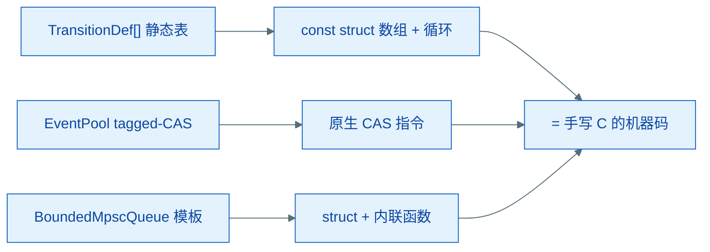
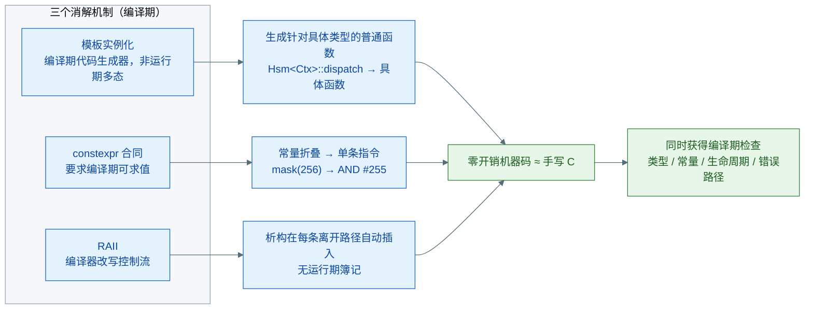
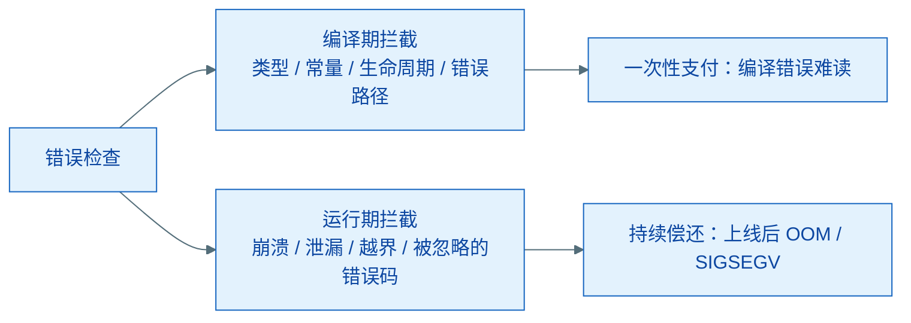
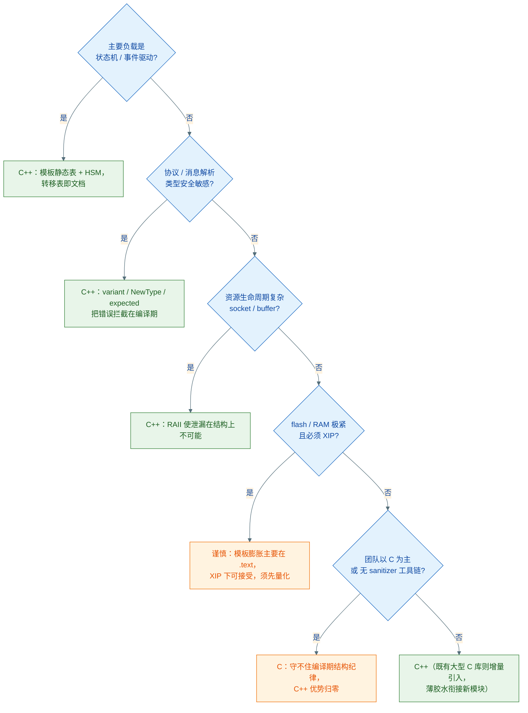

# coact：嵌入式事件驱动框架的 C++ 选型——性能、体积与类型安全实测

> coact 是作者面向实时操作系统 MCU 的开源 C++17 事件驱动框架（https://github.com/DeguiLiu/coact）。本文以实测数据评估其语言选型：
> 从性能、启动、能力与调试成本四个维度说明采用 C++17 的依据，并给出可复现的验证方法。

## 一、结论概述

coact 的代码主体由模板与静态表构成。开发过程中，是否改用 C11 重写是被反复提出的问题。嵌入式领域对 C++ 的保留态度集中在：MCU 上 C++ 的动态设施（异常、RTTI、虚函数、动态分配）被认为运行期代价过高。coact 的应对是把状态机、队列、事件池做成编译期结构，并以 `-fno-exceptions -fno-rtti` 关闭动态设施。本文以实测评估这套选型是否成立，并界定其适用范围。

在 `-fno-exceptions -fno-rtti` 与编译期结构的约束下采用 C++17，与 C11 相比：

- **性能**：热路径机器码趋同，差异 <1%，不可测；
- **启动**：体积膨胀不拖慢启动。膨胀集中在 `.text` 代码段，启动仅依赖 `.data/.bss` 的拷贝量；
- **能力**：C++17 把类型、内存、资源、错误的检查从运行期移至编译期；
- **成本**：调试体验略差（模板错误冗长、符号 mangled），由错误前置到编译期抵消。

结论：C++17 不慢、不拖慢启动，并具备 C 无法提供的编译期检查能力，调试成本通过错误时机互换得以抵消。以下分项说明。

## 二、性能实测：热路径机器码与 C11 趋同

### 2.1 编译产物对照

coact 热路径的四个组件与等价 C11 写法对照，编译产物基本一致：

| 热路径组件 | coact 写法 | 编译后 | 等价 C11 | 差异 |
|---|---|---|---|---|
| 状态机转移 | `TransitionDef[]` 静态表 + 线性扫描 | `const struct` 数组 + 循环 | 完全一样 | 无 |
| 转移动作 | entry/guard/action 函数指针 | 间接调用 | 函数指针调用 | 无 |
| 事件池 | 单 32-bit tagged 索引 + CAS | 原生 CAS 指令 | `__atomic` CAS | 无 |
| 队列 | 模板 ring/MPSC | struct + 内联 | `static inline` | 无 |
| AO 分派 | 一次 vtable 虚调用 | 间接跳转 | 结构体函数指针表 | 等价 |

模板是编译期展开而非运行期抽象：`Hsm<Ctx>::dispatch` 在实例化时即被填充为针对具体类型的普通函数，不存在通用性夹层。开销仅存在于动态设施（虚函数、`std::function`、异常、RTTI、堆分配），coact 以两条编译选项将其全部关闭：

```cmake
target_compile_options(coact_core INTERFACE -fno-exceptions -fno-rtti)
```



热路径上仅剩一次 vtable 虚调用（每次派发调用 `ao->dispatch`）。C 的等价实现同样采用函数指针间接调用，代价相同。仅当 C 以 switch 硬编码分发时可省去该间接调用，结果只是把一个间接跳转换作跳转表索引——Cortex-M 上约 2~4 个周期，纳秒级。

### 2.2 CPU 占用构成

单核 staged 模式实测整条管线每事件约 1µs（`-O2`），语言差异占比 <1%。CPU 占用构成：

- 单核下 condvar 唤醒与等待约占 **31%**，`clock_gettime` 约占 **14%**；
- 多核下事件池锁曾占 **47%**，改无锁后该热点从 top 消失。

以上开销与语言无关，C11 同样支付，属事件驱动框架的平台性开销；优化手段（无锁、仅空闲唤醒 Dispatcher）也与语言无关。

### 2.3 体积与启动

模板使 `.text` 段增大。启动时间与其关系需区分两个段：

| 段 | 内容 | 是否影响启动 |
|---|---|---|
| `.text`（代码，flash 原地执行 XIP） | 模板实例化的函数 | 否——启动路径只执行固定几行 |
| `.data` / `.bss`（RAM，需拷贝/清零） | 可变全局量 | 是，但 coact 的 RAM 增量只有几十字节 |

MCU 冷启动由 crt0（`.data` 拷贝、`.bss` 清零）、静态初始化器与 main/RTOS 初始化构成。与体积相关的仅 crt0 拷贝量，取决于 RAM 段；`.text` 在 flash 中 XIP 直执行，不参与拷贝。

C++ 拖慢启动的潜在因素是全局对象构造函数链。coact 对此规避：全局状态仅一处池注册表，且零初始化：

```cpp
inline PoolRecord* g_pool_registry[kMaxEventPools] = {};   // 零初始化 → .bss，无构造函数
```

状态表与转移表为 `const` 数组（`.rodata`，无构造），`Runtime` 与 `EventPool` 均在 main 中显式构造，故启动路径与 C11 一致，无构造链。唯一例外是非 XIP 场景（代码需从 flash 拷入 RAM 执行），属链接脚本配置决定，与语言无关。

**小结**：性能并非拒绝 C++ 的理由。CPU 实际开销来自平台，启动时间与 `.text` 体积无关。

### 2.4 复现方法

性能结论可通过 `src/core/bench_hotpath.cpp` 复现。该工具将两种派发机制隔离为独立 mode，`--cores 1 --tick-hz 100` 复现实时操作系统单核 100Hz 多线程场景：

```sh
cmake -B build_bench -S . -DCMAKE_BUILD_TYPE=RelWithDebInfo
cmake --build build_bench --target bench_hotpath -j
./build_bench/src/core/bench_hotpath --mode staged --cores 1 --tick-hz 100 --seconds 5
```

实测输出（Debug 构建）：

```text
$ ./build_bench/src/core/bench_hotpath --mode staged --cores 1 --seconds 3
staged: normal=177240 high=145848 total=323088 in 3.000s -> 107696 ev/s pool.used=0
```

构建类型对结果影响显著：默认 Debug 约 1.1e5 ev/s；`-O2`（RelWithDebInfo）单核 staged 量级约 **0.9~1.2M ev/s**（`docs/hotpath_profiling_zh.md` 实测），direct 模式约 17M ev/s。附加 `--sample out.folded` 并以 `tools/flamegraph_svg.py` 生成火焰图，可观察到 condvar 与时钟约占一半 CPU 分配，与语言无关。

## 三、能力评估：编译期检查的不可替代性

性能趋同的前提下，采用 C++ 的动因在于编译期能力。模板、`variant`、`constexpr`、RAII 让编译器在编译期捕获类型不匹配、内存越界、资源泄漏与未处理错误；C 把这些检查推迟到运行时，依赖代码审查与 sanitizer 事后发现。

### 3.1 类型安全

模板在实例化时验证一个类型属于哪个集合；C 的 `void*` 让编译器对类型一无所知：

```cpp
AsyncBus<std::variant<SensorData, MotorCmd>> bus;
bus.Subscribe<GpsData>(handler);      // 编译错误: GpsData 不是合法消息类型
```
```c
subscribe(bus, GPS_TAG, handler);     // 编译通过; tag 写错 → 把 SensorData 当 GpsData 解释
```

同类能力：`visit` 将未处理分支变为编译错误（C 的 `-Wswitch` 仅为警告）；`NewType<T, Tag>` 使 `NodeId` 传入 `Remove(TimerId)` 即编译失败（C 的 `typedef` 仅为别名）；`enum class` 不隐式转整型；`not_null<Sensor*>` 把"不可能为空"写入类型，`Process(nullptr)` 在构造期拦截（C 的每个函数需防御性判空）。

### 3.2 内存安全

RAII 使资源泄漏在结构上不可能：`ScopeGuard` 在每条 return 路径自动 `close`；C 的多个失败分支漏掉一个 `close(fd)` 即泄漏，编译器不告警。`FixedVector<T, 256>` 把容量写入类型，越界在 Debug 断言，`static_assert` 在编译期验证布局；C 的裸数组越界静默改写内存，数日后才暴露。move 语义使所有权转移受编译器追踪（`std::move` 后源对象进入已知空状态，分析器可告警 use-after-move）；C 中 `int fd2 = fd` 复制句柄，两处皆可 `close`，`fd2` 成为悬空值。`expected` 强制检查错误处理：未检查 `has_value()` 即调用 `.value()` 触发断言，`and_then/or_else` 链式覆盖每条路径；C 忽略 `pool_alloc` 的 NULL 返回值后执行 `memcpy`，直接 SIGSEGV。

### 3.3 编译期优化

`if constexpr` 按类型属性在编译期消除死分支；模板实例化为每个配置生成专用代码——`& (256-1)` 编译为单条 `AND` 立即数，而 C 的 `void*` + `size_t` 使地址计算退化为运行时乘法；`constexpr` 是编译期求值的合同，C 的 `const` 仅为建议；CRTP 使多态在编译期解析、直接内联，无 vtable；`static_assert` 在编译期拦截配置违规——`AsyncBus<Payload,300>`（非 2 的幂）直接编译失败，C 的 `seq & (300-1)` 掩码失效，数据写入错误位置，运行数日后才崩溃。

### 3.4 为什么编译期抽象在 MCU 上零开销

"零成本抽象"不是玄学，是三个机制叠加的结果：

1. **模板实例化消解**：模板是编译期的代码生成器，不是运行期的多态层。实例化时，`Hsm<Ctx>::dispatch` 被替换为针对 `Ctx` 的具体普通函数，地址计算、成员偏移、分支条件在编译期定型，生成的机器码与手写 C 一致。不存在类型擦除或运行期间接夹层。
2. **constexpr 合同**：`constexpr` 要求表达式在编译期可求值，编译器必须完成常量折叠并把结果直接嵌入指令——`mask(256)` 变成单条 `AND R0, #255`，而非运行期计算 `256-1`。C 的 `const` 只是"别改"的建议，不产生求值义务。
3. **RAII 结构上防泄漏**：析构函数由编译器在每条离开作用域的路径上自动插入，是对控制流的编译期改写，而非运行期 GC 或引用计数。资源释放代码被内联进 return / 失败路径，无运行时簿记。

三者共同的前提是抽象在编译期彻底消解；任何依赖类型擦除或运行期间接层的抽象（`std::function`、虚函数、`vector`）都不在此列。三个机制各自产出一份编译期结果，叠加后才是「零开销 + 编译期检查」：



### 3.5 能力与错误类型对照

| 错误类型 | C++17 | C |
|---|---|---|
| 类型不匹配 | 编译失败 | 运行时崩溃或静默错误 |
| 分支遗漏 | `visit` 编译失败 | 运行时丢消息 |
| 配置违规 | `static_assert` 编译失败 | 运行数天后数据损坏 |
| 资源泄漏 | 结构上不可能（RAII） | valgrind / 线上 OOM |
| 空指针解引用 | `not_null` 构造期拦截 | SIGSEGV |
| 数组越界 | `FixedVector` 断言 | 栈/堆损坏，难以定位 |
| 错误未处理 | `expected` 断言 | 错误码被忽略 |
| ID 类型混用 | `NewType` 编译失败 | 传错 ID，操作错误对象 |
| 所有权不清 | move + 分析器告警 | double-free 或悬空指针 |

| 能力 | C++17 | C11 |
|---|---|---|
| 按类型属性消分支 | `if constexpr` | 不可能 |
| 为不同参数生成专用代码 | 模板实例化 | `void*` 阻止特化 |
| 保证编译期求值 | `constexpr` 合同 | `const` 建议 |
| 消除虚函数开销 | CRTP 内联 | 函数指针不可内联 |
| 消除返回值拷贝 | mandatory elision | NRVO 可选 |

**小结**：C++ 让编译器掌握类型、常量、生命周期与错误路径的信息；信息越多，编译器的检查与优化越充分。C 的 `void*`、宏与手动 cleanup 隐藏这些信息，编译器只看到指针与整数。

## 四、成本评估：调试体验

调试体验是 C++ 模板框架的主要成本，C11 在该维度占优。

编译期错误：C 的类型错误直接定位到对应行；C++ 模板的用法错误产生数百行实例化回溯，根因位于回溯末尾 "required from here" 之前。

| 维度 | C11 | C++ 模板框架 |
|---|---|---|
| 符号 | `dispatch` | `Hsm<Ctx>::dispatch(Ctx&, coact::Event const&)` |
| 断点 | `break dispatch` | 需 `rbreak dispatch` |
| `-O2` 内联 | `static inline` 有限 | 模板方法普遍内联，单步时函数消失 |
| 崩溃 backtrace | 直接可读 | 需 `-fno-omit-frame-pointer` + demangle |

成本的反面是错误时机互换：coact 把大量错误前置到编译期（静态转移表类型检查、`Config` 预算跨组件一致），运行期缺陷减少，并保留若干调试友好设计——无异常（错误面为返回码与 assert）、`COACT_ASSERT` 硬故障可下断点、HSM 提供 `current_state_name()` 运行时自描述。

**小结**：难读的编译期错误优于难复现的运行期崩溃。调试成本并未消除，而是从运行期移至编译期。

## 五、适用边界：动态设施的运行期代价

上述结论的前提是"编译期结构"纪律。违反纪律的写法会产生显著运行期代价：

| 写法 | 运行期代价 |
|---|---|
| 异常 / RTTI / `dynamic_cast` | 栈帧展开表、类型信息 |
| `std::function` | 堆分配 + 类型擦除 |
| 虚函数滥用 | 每层 vtable 跳转 |
| 运行期容器（`vector`） | 堆分配、扩容拷贝 |

零成本抽象存在边界：抽象在编译期彻底消解（模板、constexpr、静态表）则无运行期开销；无法消解（虚函数、`std::function`、异常）则需支付运行期账单。此处的"慢"针对动态设施，语言本身并不慢。



coact 的选择对同类项目具有参考价值：

| 场景 | 倾向 | 理由 |
|---|---|---|
| 状态机 / 事件驱动为主 | C++ | 模板静态表 + HSM 天然契合，转移表即文档 |
| 协议 / 消息解析，类型安全敏感 | C++ | `variant` / `NewType` / `expected` 把错误拦截在编译期 |
| 资源生命周期复杂（socket / buffer） | C++ | RAII 使泄漏在结构上不可能 |
| flash / RAM 极紧，且必须 XIP | 谨慎 | 模板膨胀主要在 `.text`，XIP 下可接受，需量化 |
| 团队以 C 为主，不接受模板 | C | 语言是手段；守不住编译期结构纪律，C++ 优势归零 |
| 既有大型 C 代码库 | 增量引入 | 无需重写，新模块用 C++，边界以薄胶水衔接 |
| 无 ASan/UBSan 等工具链支持 | C | C 的隐藏缺陷依赖 sanitizer 与审查兜底 |

上述判断可组织成一条决策流，按项目属性逐个排除：



## 六、结论

C++ 与 C 的分水岭在于信息：C++ 让编译器掌握类型、常量、生命周期与错误路径的全部信息，其代价（编译错误难读、符号 mangled、体积略大）一次性支付给编译期；C 隐藏这些信息，代价持续支付给运行期——每个被忽略的错误码、每次越界、每处泄漏，都以上线后的崩溃与 OOM 偿还。对嵌入式场景，编译期一次性支付优于运行期持续偿还。

三个常见误解由此澄清：

- **"C++ 在 MCU 慢"**——慢的是动态设施，不是语言；
- **"虚函数慢"**——仅一处 vtable 时，等价于 C 的函数指针表；
- **"体积大启动慢"**——混淆了代码段（XIP 不参与启动）与数据段（增量几十字节）。

语言并非瓶颈，设计才是。

---

*事实依据：`include/coact/{hsm,pool,queue,ao,event,runtime}.hpp`、`CMakeLists.txt`、`src/core/bench_hotpath.cpp`；实测数据：`docs/hotpath_profiling_zh.md` 及本文 Debug 实测。*
