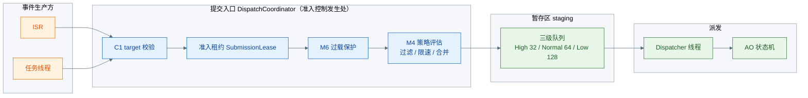
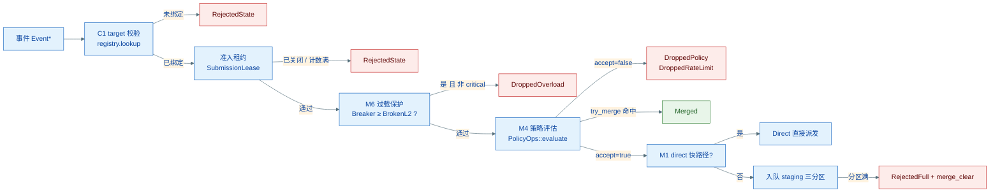
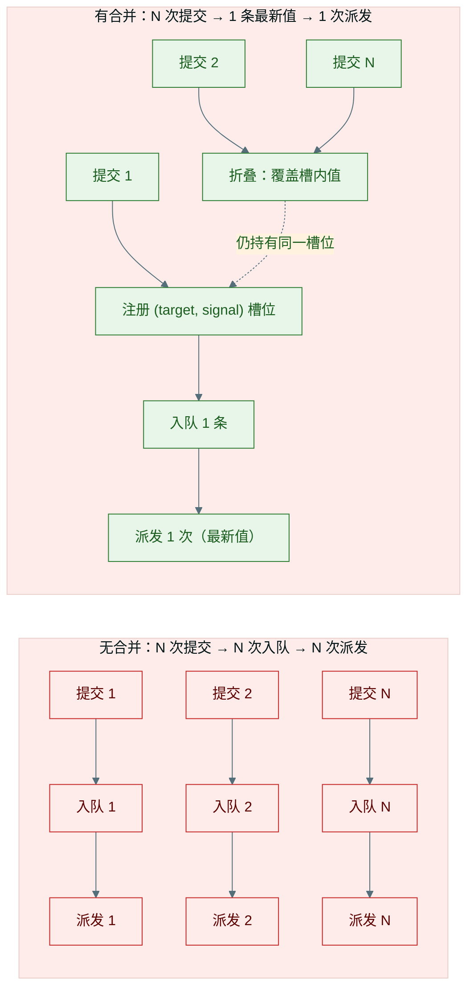
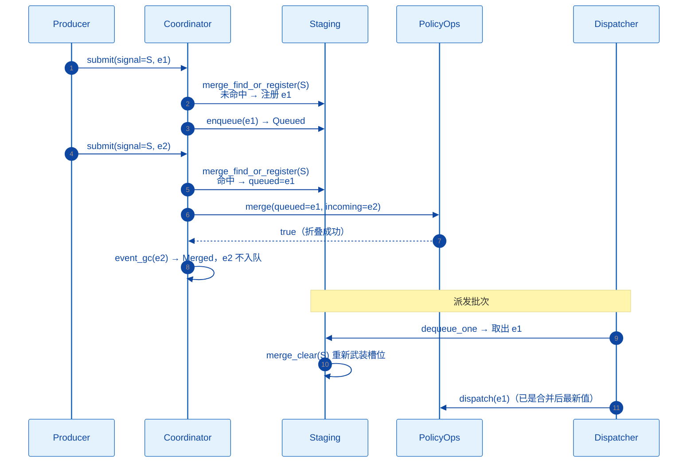
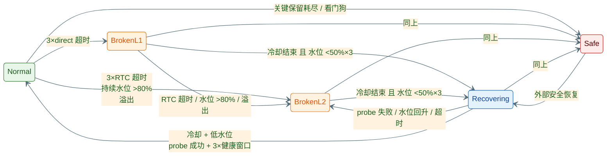

# coact 准入控制：过滤 · 限速 · 事件合并

> coact 是作者面向实时操作系统的开源 C++17 事件驱动框架（https://github.com/DeguiLiu/coact）。事件从生产方到主动对象（AO）之间是一条提交管线，在进入三级队列之前，`DispatchCoordinator` 以四道闸门决定「放行 / 折叠 / 丢弃」。本文聚焦这条准入链路——过滤、限速、事件合并三规则如何在入口处遏制高频冗余信号，过载时熔断器如何分级降级而非静默丢弃。所有论断均有源码可回溯：`coordinator.hpp` / `staging.hpp` / `policy.hpp` / `monitor.hpp`。

## 1. 定位：准入控制在管线中的位置

事件从生产方到 AO 状态机，经过「取块 → 提交 → 暂存 → 派发 → 回收」五段。准入控制发生在**提交**环节，由 Coordinator 统一执行：



coact 的其他部分——五件声明接入、三级队列、单线程派发——在《07 设计与使用》有完整阐述；本文只讲准入控制这一段：入口处如何拦、如何折叠、过载时如何降级。

## 2. 提交管线：四道闸门

`DispatchCoordinator::submit_internal` 是唯一提交入口，`submit_from_task` 与 `try_submit_from_isr` 都汇聚于此。事件从进入管线到最终落位，依次过四道闸门：



各闸门与返回的 `SubmitDisposition` 一一对应：

| 闸门 | 判定 | 拒绝时返回 | 源码 |
| --- | --- | --- | --- |
| C1 | target 是否已绑定 | `RejectedState` | `coordinator.hpp` |
| 准入租约 | 是否关闭中 / 提交计数满 | `RejectedState` | `staging.hpp` |
| M6 | 熔断 ≥BrokenL2 且事件非 critical | `DroppedOverload` | `coordinator.hpp` |
| M4 | 策略接受 / 合并 | 见第 3 节 | `policy.hpp` |
| M1 | 允许 direct 快路径且获执行租约 | 落回 staging | `coordinator.hpp` |
| 入队 | 目标分区满 | `RejectedFull`（并 `merge_clear`） | `staging.hpp` |

过载闸门（M6）用的是每 AO 的熔断器等级（`monitor.hpp`）：等级 ≥BrokenL2 且事件非 critical 时直接丢弃；critical 事件仍放行。这就保证了「过载时丢非关键事件、关键事件永不丢」的语义（详见第 5 节）。

## 3. 准入三规则：过滤 / 限速 / 合并

三条规则统一挂在 M4 闸门上：`PolicyOps::evaluate` 对每个事件返回 `PolicyResult{accept, try_merge, reason}`，Coordinator 依据这三个字段决定放行、折叠或丢弃。

| 规则 | 判定 | 机制 | 结果 |
| --- | --- | --- | --- |
| **过滤** | 谓词 / 黑名单判定事件不合法 | `accept=false, reason=kReasonFiltered` | `DroppedPolicy` |
| **限速** | 约束高频信号的到达速率 | `accept=false, reason=kReasonRateLimit` | `DroppedRateLimit` |
| **合并** | 同 (target, signal) 只保留最新值 | `try_merge=true` → `merge()` 折叠 | `Merged`（不入队） |

框架只定义 `PolicyReason` 原因码与 `PolicyOps` 函数表契约（`policy.hpp`）：

```cpp
struct PolicyResult {
    bool accept;      // 放行
    bool try_merge;   // 候选合并（同 target, signal）
    uint16_t reason;  // 稳定原因码，见 PolicyReason
};
struct PolicyOps {
    PolicyResult (*evaluate)(void* context, TargetId target,
                             const Event& event, const EventQos& qos,
                             uint64_t now);
    bool (*merge)(void* context, Event& queued, const Event& incoming);
};
```

**过滤/限速的具体判定逻辑由应用注入的策略实现**（如令牌桶限速、事件白名单），框架只保证契约稳定：`reason=0` 视为被策略过滤（`DroppedPolicy`），非 0 视为限速（`DroppedRateLimit`）。这就是 M4 的「策略可替换、管线不变」——换业务只需换一份 `PolicyOps` 函数表，提交管线一行不改。

## 4. 事件合并（核心）：把 O(N) 收敛为 O(1)

### 4.1 为什么合并

事件驱动系统里有一类「状态刷新型」信号：发出方只关心最新值，旧值在到达时已经过期——典型如「传感器最新值」「进度更新」。若每条都入队、派发、回收，高频产生时有三个代价：

- **占用**：N 条事件同时占事件池与队列，峰值水位随产生率上涨；
- **挤兑**：冗余事件挤占定容池，触发 Low 老化与熔断，把真正需要处理的事件挤出；
- **浪费**：Dispatcher 与 AO 消费 N 次，其中 N-1 次处理的都是过期值。



合并把「每事件一次入队、派发、消费、回收」压缩为「槽位一次持有 + 覆盖写」。后到事件的值被吸收进既有槽位，不再单独入队。

### 4.2 合并机制：MergeSlot 注册表 + merge 回调

代码里的合并实现不是独立状态机，而是两段配合：**staging 的合并注册表**（记录谁已在队列里）与**应用的 merge 回调**（如何折叠值）。

注册表（`staging.hpp`）：

```cpp
struct MergeSlot {          // 一个 (target, signal) 槽位
    TargetId target;
    Signal   signal;
    Event*   queued;        // 指向仍在队列中的事件；Staging 绝不解引用它
};
MergeSlot merge_slots_[Config::kMaxMergeSlots];   // 默认 8 槽
```

- `merge_find_or_register(target, signal, e, out)`：查表——命中返回 true，`out` 指向已排队事件；未命中则把本次事件注册为新槽位（表满时返回 false，退化为普通入队）；
- `merge_clear(target, signal)`：出队或入队失败时移除槽位，重新武装，防止槽位指向已回收事件。

折叠（`coordinator.hpp`）：

```cpp
if (pr.try_merge) {
    Event* queued = nullptr;
    if (staging_.merge_find_or_register(target, e->signal, e, queued)) {
        if (policy_ops_->merge(policy_ctx_, *queued, *e)) {  // 应用折叠逻辑
            event_gc(e);                                     // 新事件直接回收
            return {SubmitDisposition::Merged, 0U};          // 不入队
        }
        /* merge 拒绝折叠：正常入队，槽位保留 */
    }
}
```

时序如下：



三个保证让合并可安全回退：

1. **命中才折叠，未命中照常入队**——注册表满或未找到槽位时 `merge_find_or_register` 返回 false，事件走普通入队；合并是纯优化，最坏退化为不合并，正确性不受并发时序影响；
2. **出队即重武装**——`dequeue_one` 取出事件后立即 `merge_clear`，下一个同 (target, signal) 事件可注册新槽位，不会被错误折叠进已消费的事件；
3. **入队失败即清槽**——`enqueue` 满返回 `RejectedFull` 时同步 `merge_clear`，避免槽位指向已回收事件形成悬垂指针。

折叠动作的权威是应用策略：`PolicyOps::merge` 就地改写 `queued` 的 payload 并返回是否成功。框架只保证折叠发生在准入入口、且绝不把引用计数算错——折叠成功时新事件 `event_gc` 恰好一次，槽位仍持有原 `queued` 的引用。

### 4.3 合并与队列水位的联动

合并削减的不仅是处理次数，更是**入口到队列的水位**：高频信号若逐条入队，会挤占定容池并触发 Low 老化与熔断；合并后峰值只对应一个槽位，三级队列与事件池保持平稳，Dispatcher 与状态机只见最终值。配合 `kMaxMergeSlots=8` 的预算约束，合并占用的内存是编译期定死的 8 个槽位，不随信号种类增长。

## 5. 过载保护链：熔断器降级而非丢弃

准入控制的另一面是过载时怎么办。coact 用每 AO 一个熔断器（`monitor.hpp`）实现分级降级：优先丢非关键事件，绝不让系统静默死掉。



降级语义随等级收紧：

| 等级 | 行为 |
| --- | --- |
| `Normal` | 全速运行，允许 direct 快路径 |
| `BrokenL1` | 撤销该 AO 的 direct 快路径（`direct_allowed=false`），只走 staging |
| `BrokenL2` | 丢非 critical 事件（`drop_non_critical`） |
| `Safe` | 仅放行安全事件（`safe_events_only`），其余全部丢弃 |
| `Recovering` | 恢复观察期，任一异常立即回落到 `BrokenL2` |

恢复不是一次成功就复位，而是「冷却结束 + 持续低水位 + 探针成功 + 连续健康窗口」四条件齐备才回到 `Normal`（`kHealthyWindowsRequired=3`）——把「过载后猛恢复 → 再过载」的振荡从机制上排除。

## 6. 收束

准入链路的三条规则共享一个入口（`PolicyOps::evaluate`），把「过滤、限速、合并」统一在事件进入队列之前完成；合并用注册表 + 回调把高频冗余信号从 O(N) 收敛为 O(1)，并保证纯优化（未命中/表满/折叠拒绝都退化为普通入队）；过载时熔断器分级降级、四条件恢复，把「丢事件」从随机发生变成有语义、可监控的受控行为。准入控制是 coact 确定性调度在「入口」一侧的落地——队列与状态机负责「怎么派」，准入负责「派什么」。

---

*事实依据：`include/coact/ao/coordinator.hpp`（提交管线与合并调用）、`include/coact/ao/staging.hpp`（MergeSlot 注册表 / 三分区 / merge_clear）、`include/coact/ao/policy.hpp`（PolicyOps / PolicyReason）、`include/coact/monitor/monitor.hpp`（熔断器五态与降级语义）、`include/coact/core/config.hpp`（kMaxMergeSlots / 分区容量）。*
