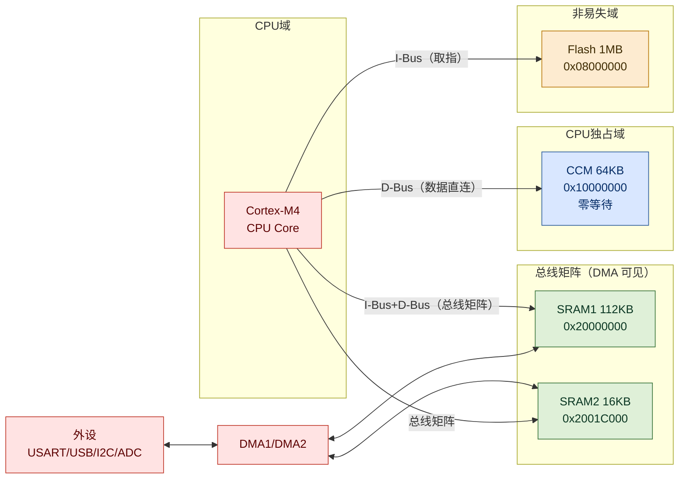
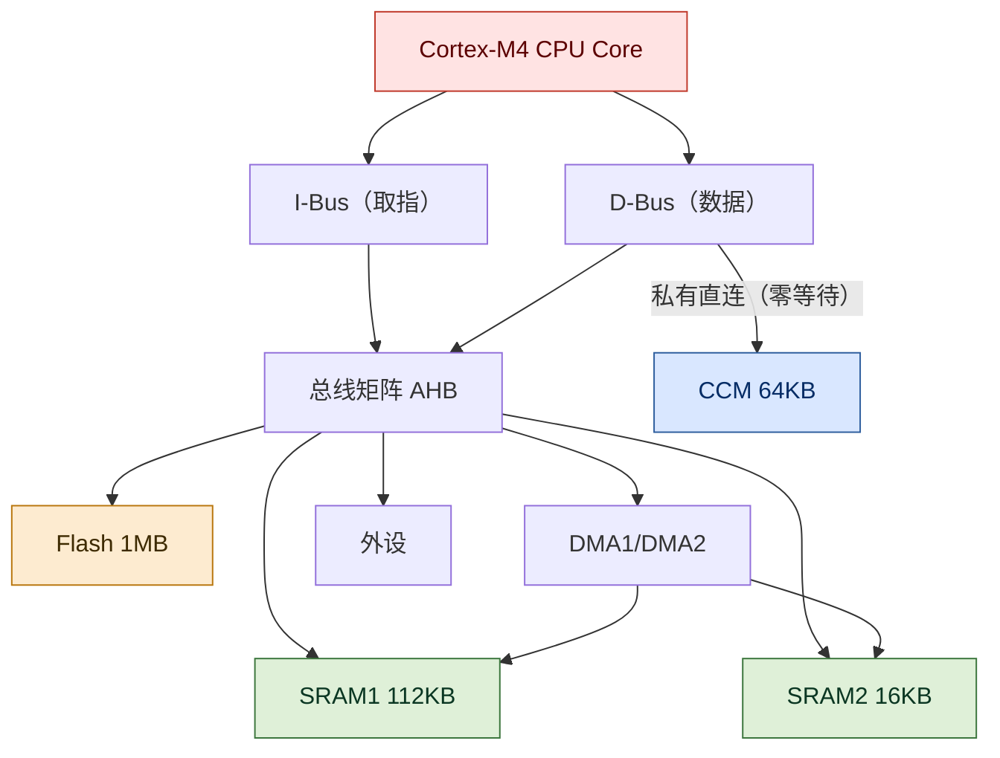
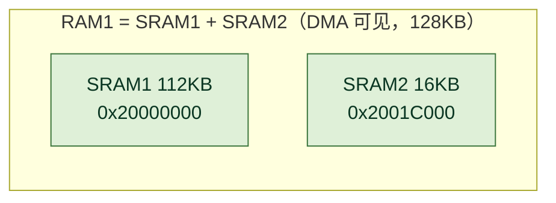
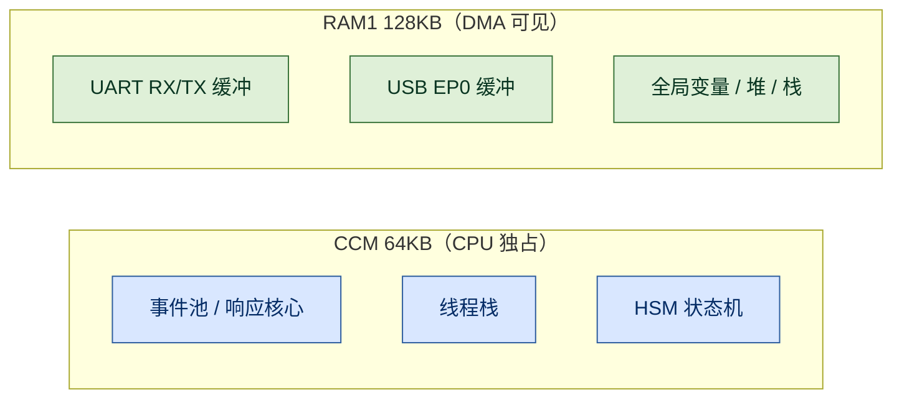

# STM32F407 内存寻路:SRAM1 / SRAM2 / RAM1 / CCM 的拓扑、层次与工程取舍

> 创作日期:2026-08-21
> 适用:STM32F407(RM0090)、Cortex-M4、RT-Thread / 裸机均可
> 图例:本文图为 Mermaid 彩色图,支持 GitHub / Typora / VuePress mermaid 插件等渲染

**一句话结论:STM32F407 的 RAM 并不是"一块大内存",而是两块总线不同、能力不同的物理区——128KB 的 DMA 可见 SRAM(链接脚本合并为 RAM1)与 64KB 的 CPU 独占 CCM。选内存的本质是回答一个问题:"谁需要访问这块数据?"外设与 DMA 可能触碰的放 SRAM;只有 CPU 才碰的纯热数据放 CCM。**



## 1. 全景:一块物理片,两条总线通路

参考手册 RM0090 给 STM32F407 列出的 RAM 与 Flash 如下:

| 名称 | 地址 | 大小 | DMA 可见 | 可执行代码 | 访问路径 |
| --- | --- | ---: | --- | --- | --- |
| SRAM1 | `0x2000_0000` | 112 KB | 是 | 是 | 总线矩阵 |
| SRAM2 | `0x2001_C000` | 16 KB | 是 | 是 | 总线矩阵 |
| **RAM1(链接合并)** | `0x2000_0000` | **128 KB** | 是 | 是 | 总线矩阵 |
| **CCM** | `0x1000_0000` | **64 KB** | **否** | **否** | 内核 D-Bus 私有 |
| Flash | `0x0800_0000` | 1 MB | 否 | 是 | I-Bus + ART 加速 |

注意:SRAM1 与 SRAM2 物理独立、但地址连续,链接脚本把它们合并成一个 128KB 区(通常命名为 RAM1)。这解释了为什么很多工程里"RAM1 = 128KB"——它不是一块物理内存,而是两块 SRAM 的链接别名。

## 2. 层次:Cortex-M4 的三条通路与一堵"看不见的墙"



Cortex-M4 有两类总线,决定了"谁能摸到谁":

- **I-Bus**:取指令专用,连 Flash 与 SRAM 代码区。SRAM 上的代码能被取指执行;**CCM 没有挂 I-Bus,因此 CCM 里放代码是无效的**(复位/跳转进 CCM 会直接 HardFault)。
- **D-Bus**:数据读写。D-Bus 分出一条**私有直连**到 CCM——这就是 CCM"零等待"的来源:它不经过总线矩阵仲裁,CPU 独占,不与 DMA/外设抢总线。
- **总线矩阵**:CPU、DMA、外设、SRAM、Flash 在此交汇。SRAM 的访问要经过矩阵,与 DMA 并发时有总线仲裁延迟——比 CCM 慢的差距就在这里。

这堵"墙"就是:**CCM 只对 CPU 数据可见,对 DMA 和外设完全不可见**。任何想通过 DMA 直接往 CCM 写数据的设计(串口 DMA 收包缓冲放 CCM)都会失败。

### 2.1 白话版:D-Bus 为什么同时决定了"CPU 独占"和"零等待"

很多文章把"CCM 是 CPU 独占""CCM 零等待"当两个独立优点讲,其实它们是**同一个硬件原因的两种结果**,那个原因就是 D-Bus 的私人专线。

CPU 有两条"手",各管一摊:

- **I-Bus(取指手)**:只负责拿"下一条要执行的指令"。它连 Flash 和 SRAM,但**不连 CCM**——这就是 CCM 里放代码会 HardFault 的根本原因。
- **D-Bus(数据手)**:负责拿"要读写的数据"。它既连总线矩阵(能到 SRAM、外设),又单独拉了一条**直达 CCM 的私人专线**。

这条私人专线带来两个结果:

1. **只有 CPU 的 D-Bus 有这条线** → DMA、外设都没接 → 所以 CCM"CPU 独占",别人进不来。
2. **专线绕过总线矩阵** → 不用和 DMA/外设排队抢总线(仲裁)→ 所以访问"零等待"。

一句话记忆:**CCM 的"独占"和"零等待"不是两个优点,而是"只挂在 CPU D-Bus 私人专线上"这一件事的两面。** 反过来判断更简单:某块数据能不能放 CCM,只问一句——"DMA 或外设会不会碰它?"会碰,就说明它得走总线矩阵,而那条路根本到不了 CCM。

## 3. SRAM1、SRAM2 与 RAM1:物理分开、链接合一



要点:

1. **物理独立**:SRAM2 与 SRAM1 是两块独立的 SRAM 阵列,共用总线矩阵,但可以并行访问,减少 CPU 与 DMA 的仲裁冲突。工程上常见的做法是把高频 DMA 缓冲与 CPU 热数据分开放到两块。
2. **地址连续**:`0x2000_0000` 起,SRAM1 到 `0x2001_BFFF`,SRAM2 接续到 `0x2001_FFFF`,合计 128KB。
3. **链接合并**:链接脚本通常写成一个区,例如本项目:

```
RAM1 (rw) : ORIGIN = 0x20000000, LENGTH =  128k /* DMA-visible SRAM */
CCM  (rw) : ORIGIN = 0x10000000, LENGTH =   64k /* CPU-only CCM SRAM */
```

合并的好处是全局变量分配时自动填满整块 SRAM;代价是"哪些落在 SRAM1、哪些落在 SRAM2"默认不可控,需要的人可以用 `__attribute__((section(...)))` 手动分流。

## 4. CCM:CPU 的私有零等待高速区

CCM(Core Coupled Memory,内核耦合存储器)是这次讨论的主角:

- **零等待**:挂在 D-Bus 私有通路,不经过总线矩阵,CPU 访问无需仲裁,延迟最低。
- **CPU 独占**:DMA 与所有外设无法访问。UART/USB/I2C/ADC 的缓冲放进 CCM,等于"信号送不进去也读不出来"。
- **不能执行代码**:只接数据总线,PC 取指到 CCM 无效。
- **典型用途**:CPU 热数据、线程栈、事件池、中断频繁读写的结构体。

实测案例(RT-Thread 5.2.2 + cmdfw 框架,STM32F407):

| CCM 对象 | 大小 | 冷热 | 是否应留 CCM |
| --- | ---: | --- | --- |
| 响应核心(response core) | 15.9 KB | 热 | 留 |
| HSM/AO 装配(assembly) | 11.4 KB | 热 | 留 |
| 事件存储池(3 个) | 12.2 KB | 热 | 留 |
| Dispatcher 栈 | 4.4 KB | 热 | 留 |
| runtime 实例 | 2.7 KB | 热 | 留 |
| 日志线程(log_thread) | 5.4 KB | 冷 | 迁出到 RAM1(production) |
| 传输任务栈 | 4.0 KB | 半冷 | 迁出到 RAM1(production) |

把两个冷对象(日志线程、传输任务栈)迁出后,production 的 CCM 占用从 56,280 B(85.88%)降到 46,856 B(71.50%)——**这是"先量化归属、再迁移冷对象"的标准做法**,而不是盲目堆优化。注意:若测试固件(test-profile)的静态占用已挤占 RAM1 堆,冷对象需按口径条件编译(测试留 CCM、生产迁 RAM1),避免压垮内核堆。

### 4.1 白话版:什么该放 CCM?记住"三问三不放"

CCM 是"CPU 的私人快速抽屉",判断一样数据要不要放进去,只问三句话:

```mermaid
flowchart LR
    Q1{"会被 DMA/外设<br/>读写吗?"} -->|会| SRAM["SRAM / RAM1"]
    Q1 -->|不会| Q2{"会被 CPU<br/>取指执行吗?"}
    Q2 -->|会| SRAM
    Q2 -->|不会| Q3{"又小又热<br/>(频繁读写)?"}
    Q3 -->|是| CCM["CCM 64KB"]
    Q3 -->|否(冷/大)| SRAM

    classDef ccm fill:#D9E7FF,stroke:#2E5E9E,color:#052C65
    classDef sram fill:#DFF0D8,stroke:#3C763D,color:#0A3622
    class Q1,Q2,Q3 ccm
    class SRAM sram
```

| 判断 | 通俗问法 | 满足才放 |
| --- | --- | --- |
| 只有 CPU 碰 | "DMA 或外设会不会来读写它?" | 不会 → 才有资格进 CCM |
| 碰得特别频繁 | "是不是在中断/热循环里反复读写?" | 是 → 放 CCM 才有提速意义 |
| 越小越划算 | "它是不是又小又热?" | 又小又热 → 值得占 64KB 的坑位 |

**三个"绝不放":**

1. **DMA/外设的缓冲(串口、USB、ADC)→ 绝不放**。数据根本送不进去——DMA 走总线矩阵,那条路到不了 CCM。
2. **可执行代码 / ISR → 绝不放**。取指靠 I-Bus,CCM 没接 I-Bus。
3. **又大又冷的对象(日志缓冲、冷配置)→ 别放**。它占着坑位,把真正热的数据挤去走慢的总线矩阵,亏。

**一句话判断:**"会等外设/DMA 送数据的,去 SRAM;纯 CPU 自己反复捣腾的,进 CCM;又冷又大的,哪凉快哪待着。"

## 5. 四块内存的作用分工

前面讲的是拓扑与特性,这一节说清楚一件事:**每块内存在系统里到底负责什么**。

| 内存块 | 大小 | 作用 | 典型对象 |
| --- | --- | --- | --- |
| SRAM1 | 112 KB | **主数据区**——系统运行的默认归宿 | 全局/静态变量(.data/.bss)、栈、堆、RT-Thread 内核对象、串口/SPI 缓冲 |
| SRAM2 | 16 KB | **辅助数据区**——与 SRAM1 并行的补充容量 | 第二路 DMA 缓冲、低频数据结构,与 SRAM1 分离以分散总线访问 |
| RAM1(合并) | 128 KB | **DMA 可见数据域**——所有外设可访问内存的统一边界 | UART/USB/SPI/ADC 收发缓冲、任何需要 DMA 搬运的结构体 |
| CCM | 64 KB | **CPU 专用热区**——纯 CPU 高频数据的零等待存储 | 线程栈、事件池、中断频繁读写的结构体、实时控制状态 |

一句话分工:

- **SRAM1 = 主仓库**:容量大、DMA 可见,啥都能放,默认全放这里。
- **SRAM2 = 辅仓库**:容量小,和主仓库错峰,减轻与 DMA 的总线争抢。
- **RAM1 = 两个仓库的合称(链接层)**:对外设可见的内存边界就在这 128KB 里。
- **CCM = CPU 的私人保险柜**:又快又独占,但外设和 DMA 进不来。

作用视角的三个"为什么":

1. **为什么 UART 缓冲必须进 RAM1?** 因为串口 DMA 要直接写它——整个系统中只有 RAM1 对外设可见。
2. **为什么线程栈可以进 CCM?** 栈只被 CPU 压栈/弹栈,DMA 从不触碰;放 CCM 还能让每次进出栈更快。
3. **为什么代码不能放 CCM?** 执行代码必须过 I-Bus 取指,而 CCM 只接了数据总线;数据放 CCM 没问题,代码不行。

结合本项目(cmdfw + STM32F407)的实际分工:

- **CCM**:事件池、响应核心、HSM 状态机、Dispatcher 栈——全是 CPU 热路径,放零等待区。
- **RAM1**:UART RX/TX 缓冲、USB EP0 缓冲——外设/DMA 可见;日志线程、传输任务栈——非热对象不占 CCM。

### 5.1 功能特性:位带、仲裁与电源域

除容量与可见性外,SRAM 与 CCM 在几项硬件功能上也有实质差异,选型时同样要过一遍:

| 功能特性 | SRAM1/SRAM2 | CCM | 工程含义 |
| --- | --- | --- | --- |
| 位带操作(Bit-Band) | 支持(0x2000_0000 起前 1MB) | **不支持**(不在位带映射区) | 需单指令原子置位/清位的标志放 SRAM;CCM 只能整字读改写 |
| 总线仲裁 | 经 AHB 矩阵,与 DMA 并发会插等待 | D-Bus 私有直连,零仲裁 | 对延迟敏感的 CPU 热循环放 CCM 可避开仲裁抖动 |
| 并行访问 | SRAM1/SRAM2 两块阵列可同时被访问 | 单块 | CPU 热数据与高频 DMA 缓冲分开放两块,减少争抢 |
| 电源域 | VDD 主域(STOP 保留,Standby 归零) | VDD 主域(同上) | CCM 无独立电源域,低功耗行为与 SRAM 一致 |
| 掉电保存 | 另有 4KB Backup SRAM(0x4002_4000,VBAT 独立供电) | 无 | 主电源断开仍需保留的少量状态放 Backup SRAM,不放 CCM |
| 访问对齐 | 支持非对齐字节/半字/字 | 支持非对齐 | LDM/STM 与 DMA 仍要求字对齐,与是否 CCM 无关 |

三点补充:

1. **位带是 CCM 与 SRAM 最容易被忽略的分水岭**:`0x1000_0000` 落在位带别名区之外,依赖位带原子操作(如 CMSIS 位带宏、`__attribute__((bitband))`)的变量一旦放进 CCM 段,位操作会退化成整字读改写——轻则多一次 RMW,重则丢失原子性。
2. **Backup SRAM 常被误当成 SRAM2**:SRAM2(0x2001_C000,16KB)仍在 VDD 域,掉电即失;真正"电池供电不掉"的是独立 4KB Backup SRAM(0x4002_4000)。二者地址、供电、用途完全不同。
3. **仲裁抖动是可测量的**:当 DMA 持续搬运(如串口 115200 连续收包)时,SRAM 上的 CPU 访问会被周期性插等待;把中断里高频读写的小结构体挪进 CCM,能明显降低该热点抖动。

## 6. 与 Flash 对比:易失性决定一切

| 特性 | SRAM1/SRAM2 | CCM | Flash |
| --- | --- | --- | --- |
| 易失 | 是(掉电丢失) | 是(掉电丢失) | 否(非易失) |
| 写方式 | 任意字节随机写 | 任意字节随机写 | 必须先擦后写、页对齐 |
| 执行代码 | 可以 | **不可以** | 可以(主流位置) |
| DMA 访问 | 可以 | **不可以** | 不可以 |
| 掉电后 | 丢失 | 丢失 | 保留 |
| 典型用途 | 栈/堆/全局/DMA 缓冲 | CPU 热数据 | 程序 + 只读常量 + bootloader |

低功耗提醒:STOP 模式下 SRAM(含 SRAM2)内容保留;Standby 模式整块掉电,所有 RAM 归零。若做低功耗唤醒保留现场,数据要放 Flash 或重新初始化。

## 7. 工程实践:数据到底放哪?

决策矩阵——拿到一块数据,先回答三个问题:

| 问题 | 答案 | 放置 |
| --- | --- | --- |
| 会被 DMA/外设访问吗? | 是(串口缓冲、USB FIFO、ADC 数组) | **SRAM(必经 DMA 可见区)** |
| 需要被 CPU 取指执行吗? | 是(bootloader、RAM 常驻 ISR) | **SRAM** |
| 纯 CPU 数据、访问极频繁? | 是(事件池、热线程栈) | **CCM(零等待)** |
| 低频、容量大、凑热闹? | 是(日志缓冲、冷配置) | **SRAM(别浪费 CCM)** |

工程口诀:**"DMA 能碰、要执行,去 SRAM;只有 CPU 碰、又热,进 CCM;冷对象一律不进 CCM。"**

在代码里用链接属性显式分流(本项目实践):

```cpp
// CPU 热对象 → CCM
#define CMDFW_CCM_SECTION __attribute__((section(".ccm_bss")))
// DMA 可见对象 → 默认 SRAM
static CMDFW_CCM_SECTION EventPool pool;      // 事件池,CPU 热
static CMDFW_DDR_SECTION  UartRing rx_ring;   // UART 缓冲,可能被 DMA/ISR 写
```

对应关系:



### 7.1 链接脚本:段怎么落进 CCM 还是 RAM1

`__attribute__((section(".ccm_bss")))` 只决定"对象进入哪个 section",**真正落位由 link.lds 的 MEMORY/SECTIONS 决定**。典型本项目链接脚本:

```
MEMORY {
  RAM1 (rw) : ORIGIN = 0x20000000, LENGTH = 128k
  CCM  (rw) : ORIGIN = 0x10000000, LENGTH =  64k
}
SECTIONS {
  .ccm_bss (NOLOAD) : { *(.ccm_bss) } > CCM
  .bss (NOLOAD)     : { *(.bss) }     > RAM1
}
```

要点:

- 只有显式放进 `.ccm_*` 段的符号才会落 CCM;其它一切默认进 `.bss`/`.data` → RAM1。
- `NOLOAD` 表示未初始化/零初始化段,启动代码负责清零;CCM 同样在 `main` 前由启动代码清零。
- 溢出时链接器直接报 `section ... will not fit in region CCM`,不会静默截断——所以 CCM 超限是构建期可见的。

## 8. 踩坑清单

1. **CCM 不能 DMA** — 串口/USB DMA 缓冲放进 CCM,数据永远不到达。串口收发缓冲必须 SRAM。
2. **CCM 不能执行代码** — 把函数/ISR 放 CCM 会 HardFault。CCM 只放数据。
3. **"RAM1=128KB"是合并区** — 它包含 SRAM2 的 16KB;写 SRAM 时不要以为只剩 SRAM1。
4. **CCM 扩容空间有限** — 64KB 的 CCM 一旦满,链接直接报 overflow;没有"页扩展"一说。扩容前先做对象级占用审计,把冷对象迁走。
5. **总线仲裁延迟** — SRAM 与 DMA 并发时 CPU 访问可能被插等待周期;对时间敏感的热循环可考虑把数据挪进 CCM 避开仲裁。
6. **低功耗陷阱** — STOP 模式 SRAM 保留,Standby 模式全部归零;唤醒后需要重新初始化 RAM 中的现场。
7. **链接脚本是最终裁决** — 宏名(如 `CMDFW_CCM_SECTION`)只是把对象放进指定 section,真正能否落位由 `link.lds` 的 `MEMORY` 与 `SECTIONS` 决定;改宏不改脚本等于没改。

### 8.1 位带陷阱:链接通过、运行出错

STM32F407 的 SRAM 区(`0x2000_0000` 起前 1MB)与外设区(`0x4000_0000` 起前 1MB)支持 Cortex-M4 的**位带(Bit-Band)**机制:每个物理位被映射到别名区(`0x2200_0000` / `0x4200_0000`)的一个 32 位字。写别名区字 = 原子地写物理位,无需读-改-写(RMW),也不会被中断打断。

别名地址公式:

```
bit_word_addr = alias_base + (byte_offset × 32) + (bit_number × 4)
```

例如 SRAM 地址 `0x2000_0004` 的第 3 位:

```
0x2200_0000 + (0x04 × 32) + (3 × 4) = 0x2200_008C
```

CMSIS 提供 `BITBAND_SRAM(addr, bit)` 宏直接计算别名地址,工程上用它实现中断安全的原子标志位(单条 STR 指令)。

**关键陷阱:CCM(`0x1000_0000`)不在位带映射区。** 把位带变量放进 `.ccm` 段,链接不会报错(CCM 是合法 RAM),但运行时所有位带操作失效——别名区 `0x2200_0000` 只回射 `0x2000_0000` 的 SRAM,对 CCM 写别名等于写到无关地址,或退化成整字 RMW 丢失原子性。这是"链接通过、运行出错"的隐蔽 bug。

### 8.2 DMA 访问 CCM:失败的长相

把 DMA 缓冲(如 UART RX ring)放进 CCM,失败不是"数据慢一点",而是**数据根本到不了**:

- 总线矩阵不存在到 CCM 的 DMA 路径(CCM 只挂在 CPU D-Bus 私有通道上)。
- DMA 控制器发起访问时,地址 `0x1000_0000` 在 AHB 总线上无对应从设备 → 产生 AHB 总线错误,或读回未定义值,取决于总线实现。
- 表现为:串口中断在触发、DMA 计数值在走,但缓冲内容恒为初值或随机数据——极难定位。

验证口诀:**任何"外设/DMA 要写进去的缓冲区"都必须落在 `0x2000_0000` 的 SRAM 区;CCM 只能放"只有 CPU 自己读写"的数据。**

## 小结

STM32F407 的 RAM 是"一块 CPU 独占的快内存 + 一块各方共享的通用内存":CCM 用速度换独占,SRAM 用可见性换通用。写嵌入式代码时,先问"谁要访问它",再决定放哪——这比任何内存优化技巧都更能避免踩坑,也是把 64KB CCM 用出 100% 价值的第一步。
