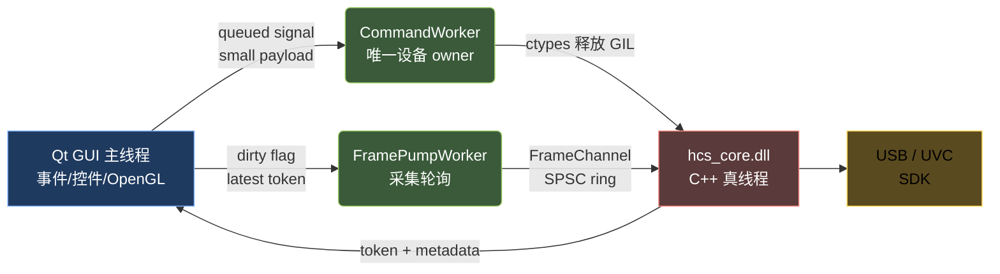
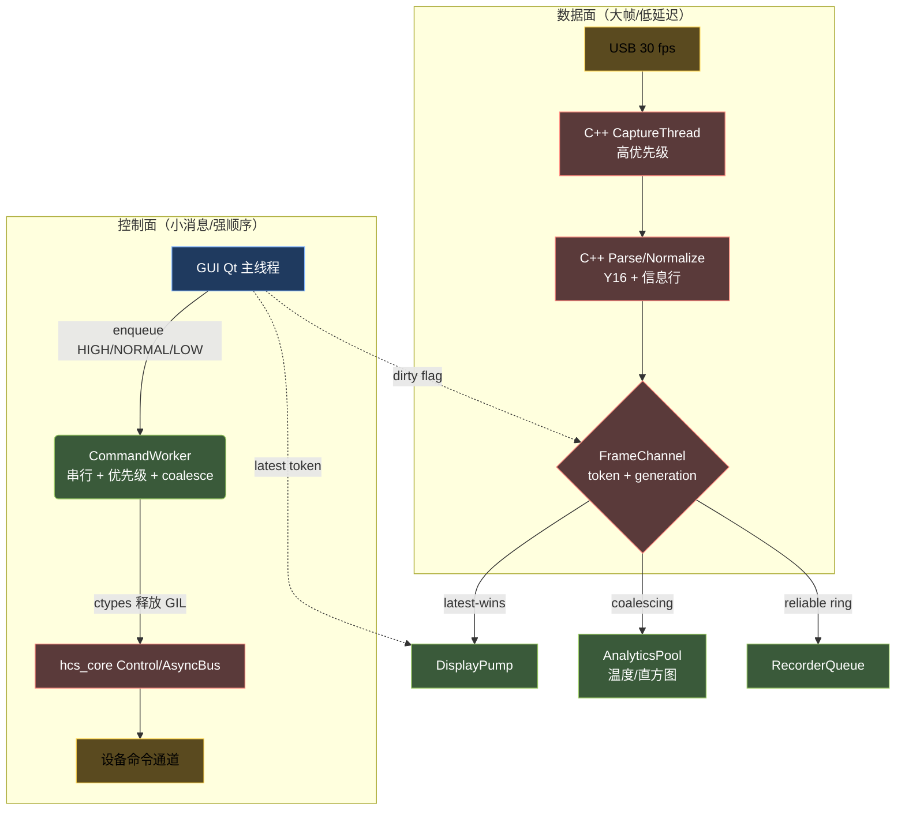
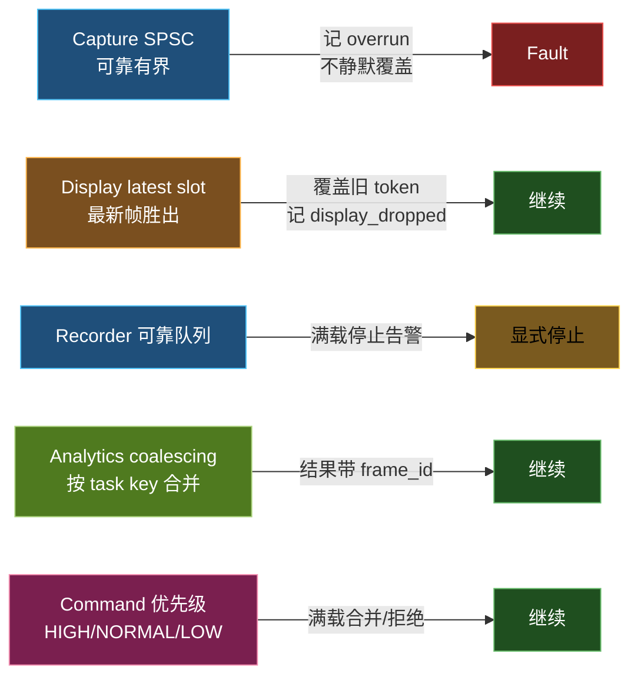
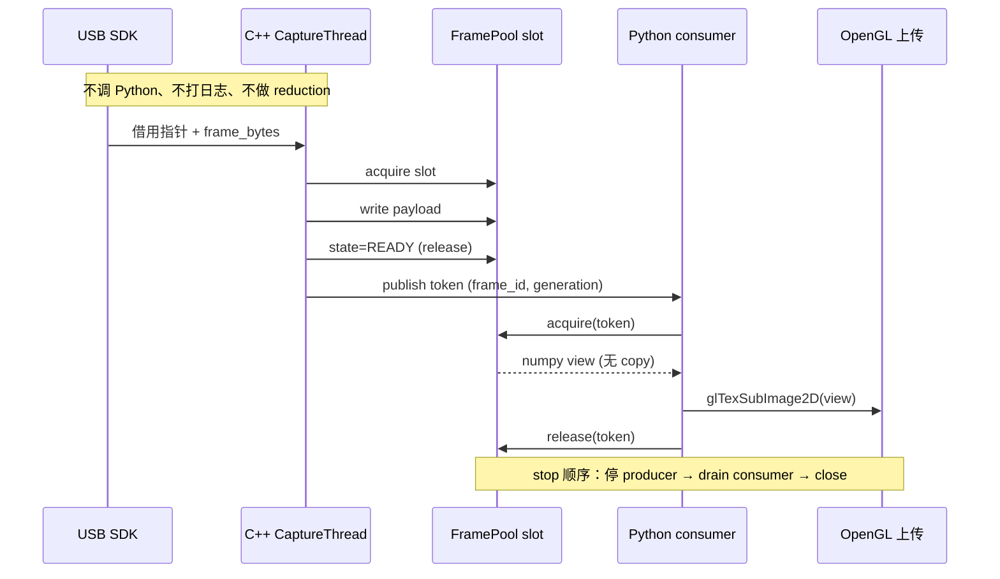
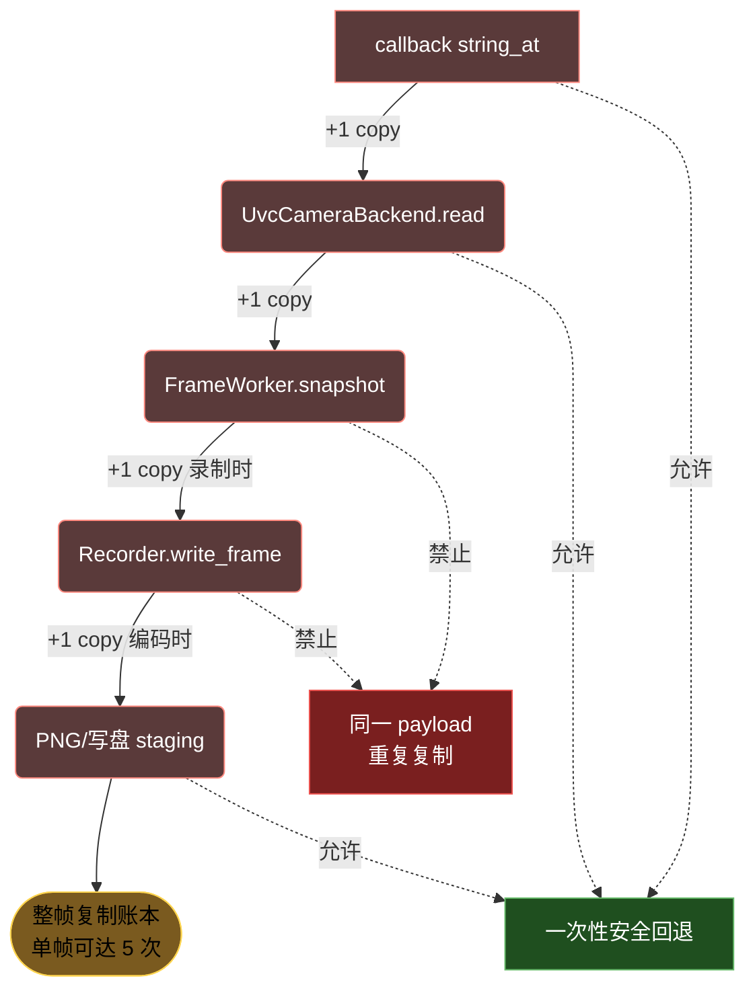
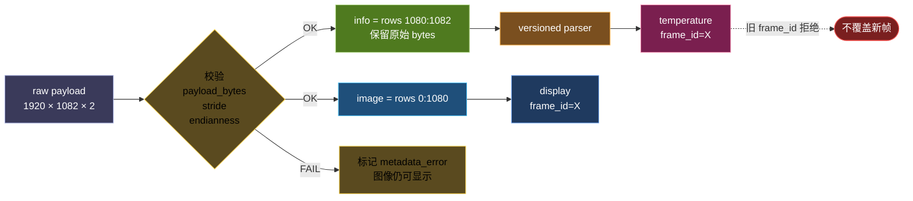
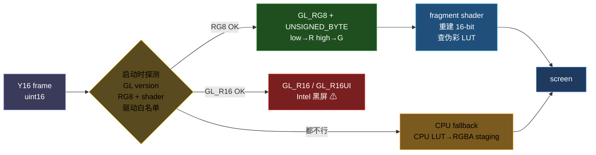
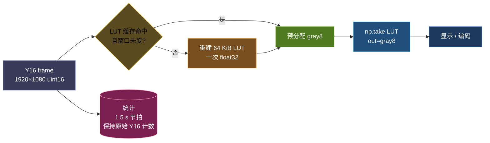
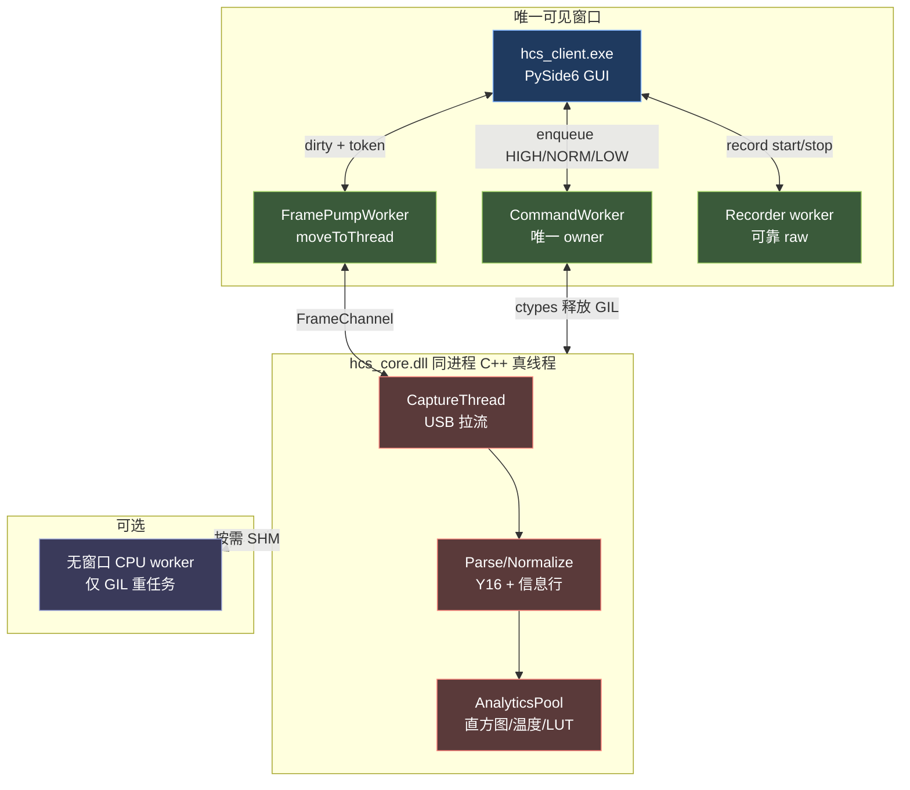
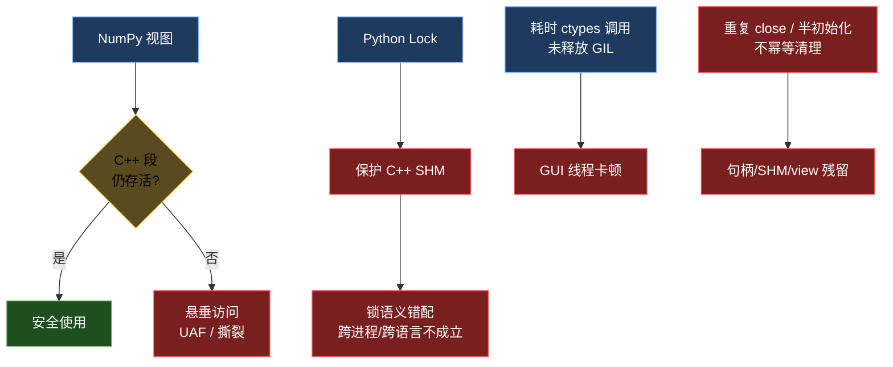

# PySide6 工业上位机的实时帧链、零拷贝与跨语言架构

>
> 适合读者：正在用 PySide6 写工业控制、相机或数据采集上位机；想理解"Qt 主线程真的只能有一个，但 GIL 不是性能末日"；被 4 MiB/帧的大块数据复制、OpenGL 上传黑屏、PyInstaller 产物臃肿反复折磨；在做 Python/C++ 混合架构，想搞清楚零拷贝究竟在哪里剪。

主线有三条：**线程与背压、零拷贝与跨语言边界、打包与解释器**。每一节按「原理→证据→方案→代价」组织。

---

## 一、PySide6 的“主线程只有一个”不等于“只能有一个真线程”

PySide6 的事件循环确实只在 GUI 主线程，但 Python 的 `QThread`、`threading.Thread`、C++ 的 `std::thread` 都是真实 OS 线程。GIL 只限制**同一解释器**中**纯 Python 字节码**的并行执行；NumPy、`ctypes.CDLL` 调用（释放 GIL）、C++ worker、OpenGL 驱动、USB SDK 都能在 native 区域并行。

所以正确目标不是"创建更多 QThread"，而是**缩短 Python 持有 GIL 的热路径**，把大计算和大数据移动留在 native 层。



GUI 主线程允许：事件、控件、Qt 状态、OpenGL context、轻量 token 拉取。
GUI 主线程禁止：USB 往返、join/wait、整帧 NumPy reduction、编码、写盘。

---

## 二、线程拓扑：控制面与数据面分离，三类 QoS 队列

把实时数据、可丢数据、可靠数据、控制消息分别给不同 QoS：





要点：

- **采集线程（C++）**只做"拿一帧、盖章、发布"。不调 Python、不打日志（异步）、不进 Python GIL。
- **Python FramePump**：`QObject` 放到长驻 `QThread`，每 tick 只发 latest descriptor + dirty flag。**不发 `Signal(object)` 携带每帧 ndarray**，否则 Qt posted-event 队列会积压。
- **CommandWorker**：唯一设备 owner，串行执行 `get/set/exec`，按 HIGH/NORMAL/LOW 优先级，滑块按 `(panel, key)` coalesce；GUI 只 enqueue，绝不直接同步调真实设备。
- **PySide6 的 `QThread` 易踩点**：`QThread` 对象本身仍属于创建它的线程（一般是 GUI），只有 `worker.moveToThread(thread)` 之后 worker 才在新线程里跑。

读者读到这里自然会有两个问题：上面这个 `FrameChannel` 上的"零拷贝"到底是什么，4 MiB 帧到底怎么走才不被反复复制？这是接下来 §三 的主题。

---

## 三、零拷贝的真实定义：哪里可以证明生命周期

“零拷贝”不是“哪里都不复制”，而是**大帧在可证明的 slot lease（代数、引用计数、显式 release）下只传递视图**；写盘、编码、跨生命周期或无法证明所有权时允许一次稳定复制。





**允许的复制**：C ABI callback 指针没有稳定生命周期时的安全回退；写盘/PNG/编码必须拥有独立 buffer 时的一次复制；小型 metadata 转为 `bytes`；用户主动请求的快照。

**禁止的复制**：同一 payload 在 callback/GUI slot/recorder 入队/display publish 上重复复制；为了“线程安全”给 SHM view 加 Python `Lock`；把 4 MiB ndarray pickle 进 `multiprocessing.Queue` 或 Qt queued signal；在 GUI 线程做状态栏 reduction。

我们用的 token + 引用计数契约：

```cpp
struct FrameToken {
    uint64_t frame_id;
    uint64_t generation;   // 防止 ring wrap 后误读
    uint32_t slot_index;
    uint32_t payload_bytes;
    uint32_t width, height, format;
    uint64_t capture_ns;
};

struct FrameSlotHeader {
    std::atomic<uint32_t> state;     // FREE / WRITING / READY
    std::atomic<uint32_t> ref_count;
    uint64_t generation, frame_id;
    uint32_t payload_bytes, metadata_bytes;
};
```

Python 侧只能调 `acquire(token) / view(token) / release(token)`，**不能直接改 `state`/`ref_count`**。如果不引入引用计数，至少给 display 和 recorder 各预留独立的 staging 双/三缓冲，并明确降级、把 `copy_bytes` 计入指标。

录制端再省一刀：

```python
raw_file.write(memoryview(frame).cast("B"))   # 0.005 ms vs tobytes 1.73 ms
```

约束：frame 必须是连续、小端、生命周期稳定；非连续或字节序不匹配时允许显式复制。

---

## 四、复合帧必须共享 frame_id

工业相机常传复合帧：1920×1080 图像 + 2 行原始信息行（带温度、状态、checksum）。最常见的 bug 是“GUI 拉一帧、统计延迟两秒、结果贴错帧”。



**图像和 metadata 必须用同一个 `frame_id` 对齐**；旧结果不能覆盖新帧；解析失败只标记 `metadata_error`，图像仍可显示——绝不能“猜温度”。

这一条直接服务于 §三 的零拷贝契约：只有当 slot 把 image / infoline / metadata 放在同一 token 上、消费者按 `frame_id` 校验代际时，跨语义的“同一帧”才有保证。

---

## 五、OpenGL 上传：Intel 驱动黑屏与 PySide6 PBO 绑定坑

帧数据最终要落到屏幕。工业上位机常跑老 Intel 集显。`GL_R16` / `GL_R16UI` 是 16-bit 单通道纹理最干净的接口，但**实测在多个 Intel 驱动下上传后屏幕全黑**。



我们改用 `GL_RG8 + GL_UNSIGNED_BYTE` 双通道：把 little-endian Y16 的低/高字节分别送 R/G，fragment shader 内重建 16-bit 值再查伪彩 LUT。这条路在 Intel/NVIDIA/AMD 上都能跑。

PBO（pixel buffer object）异步上传在 OpenGL 教科书里几乎是“必须”，但在 PySide6 6.11.1 的 `glTexImage2D/glTexSubImage2D` 绑定上有真实约束：

- 绑定的 `pixels` 参数只接收 buffer 对象；
- `None`、`0`、`ctypes.c_void_p(0)` 分别被拒绝或直接崩溃；
- 不是配置问题，是绑定层根本不支持“null/整数偏移”惯用法。

```python
# 不再是可选项：首次使用即永久回落直传
def _disable_pbo_upload(self):
    self._pbo_enabled = False   # glTexSubImage2D 直传是既定出货路径
```

CPU fallback 不是性能验收路径：必须单独记录帧率和 P95/P99，**不能用它证明硬件 GPU 路径的预算达标**。

---

## 六、NumPy LUT 与归一化的工程经验

GPU 拿到的是归一化后的 uint8 纹理。归一化本身是热路径，必须先在 NumPy 内优化再下沉 native：

```python
# 65536 项 LUT（约 64 KiB），只在下限/上限变化时重建
codes = np.arange(65536, dtype=np.float32)
lut = np.clip((codes - lo) * (255.0 / (hi - lo)), 0, 255).astype(np.uint8)

# 预分配 gray8，禁止每帧创建
np.take(lut, frame_y16, out=gray8)
```



**几条经验**：

1. LUT 只在窗口变化时重建，**禁止每帧重建**；
2. `gray8` 用固定预分配，禁止每帧 `np.empty/zeros/array`；
3. raw Y16 录制**完全绕过归一化**，保留原始计数用于测温换算；
4. 统计和归一化**必须独立输出**，禁止两个线程写同一 ndarray 区间；
5. `Y16 >> 8` 虽然便宜，但丢动态范围、破坏低对比度显示，且**后续温度换算直接算错**——不允许作为优化手段；
6. 测温状态使用原始 Y16 计数的 min/max/mean，不能用右移后的 uint8 代入。

并行归一化：先测单 worker 的 `np.take(out=...)` P95；只有仍超预算才用 `ThreadPoolExecutor(max_workers=2)` 按行切成互不重叠区间。因为 NumPy native 操作通常释放 GIL，能拿到真并行；但**若双 worker 没有降低 P95 就恢复单 worker**——不能凭“多线程一定更快”下结论。

---

## 七、我们验证下来最稳的默认架构

把前面六节的所有设计拼起来，就是这张默认架构图：



各节点的设计来源：

- **GUI ↔ FramePump** 对应 §二的 dirty/token 流；
- **FrameChannel** 是 §三 的零拷贝总线，所有大帧都走 token；
- **CaptureThread + ParseThread** 共同保证 §四 的 `frame_id` 对齐；
- **AnalyticsPool** 与 §六 的归一化紧密耦合，归一化结果直接喂给 OpenGL；
- **CommandWorker** + `ctypes` 释放 GIL 是 §一 的具体落地；
- **可选 CPU worker** 的开关标准是 §七 末尾的"代价-收益"。

**一个窗口、同进程 C++ 真线程、至多一个按需 CPU worker**——这是我们验证下来性能、故障隔离和工程复杂度三者最均衡的位置。

---

## 八、跨语言硬约束 E1–E5

整套设计能否成立，取决于几条跨语言硬约束不被破坏。下图把每一类事故对应到原始规则：



- **E1**：NumPy 视图生命周期不得超过 C++ 共享段 + slot lease。
- **E2**：ctypes 结构体、宽度、packing、常量集中定义并有 ABI 测试。
- **E3**：C++ 内存只走 C ABI 原子原语 / FrameChannel 头尾，**Python Lock 不能保护 C++ SHM**。
- **E4**：昂贵 native 调用必须释放 GIL，且**不能从 Qt GUI 线程调用**。
- **E5**：中断、半初始化、拔插、重复 close 都是正常输入；清理必须幂等。
- **设备 handle 单 owner**：一个设备 handle 只能有一个串行 owner；`hcs_stop`、callback drain、`hcs_close` 必须按顺序完成。

E1/E3 是 §三 零拷贝契约的底线；E4 是 §一 / §二 线程拓扑能够成立的前提；E5 是 §七 默认架构在拔插、崩溃下仍然稳定的根因。任何一条被破坏，前面的所有优化都会立刻失效。

---

如果你也在做类似的工业 PySide6 项目，欢迎交流哪些经验对你有用。
