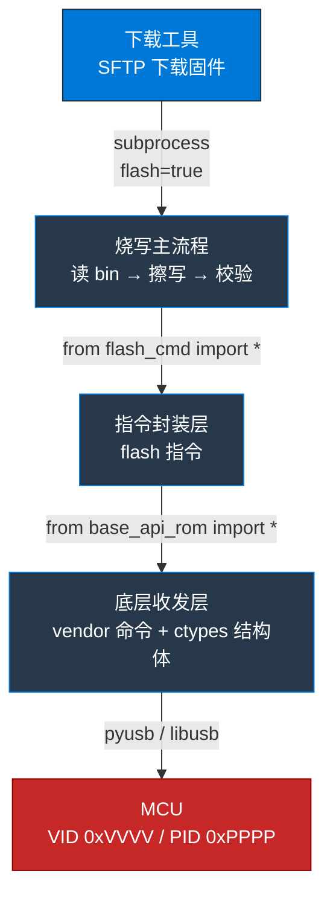
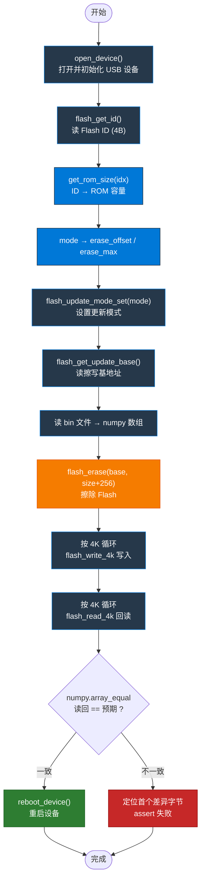
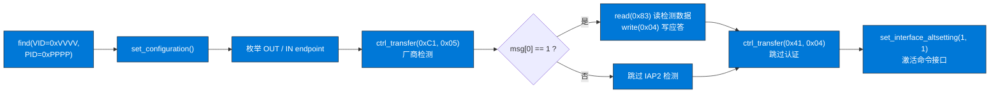
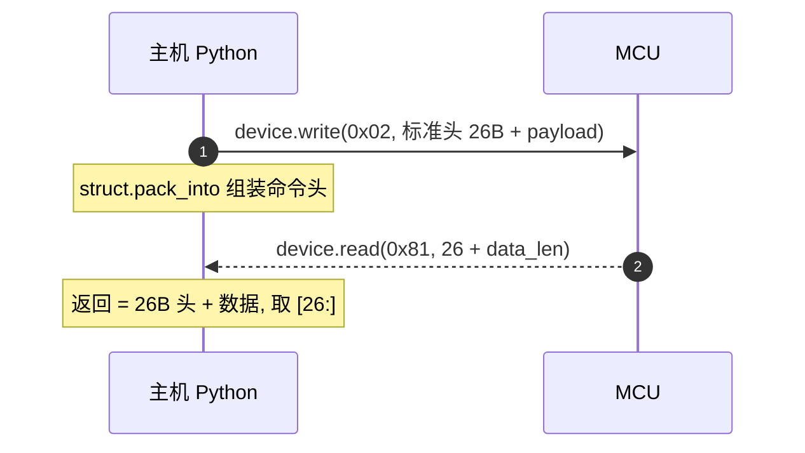

# 手写一个 USB MCU的固件烧写工具：从 vendor 命令到逐字节校验

> 本文已做脱敏处理：具体产品型号、USB VID/PID 以占位符代替。文中展示的架构、协议结构与校验思路均可复用到同类「USB vendor 命令 + 板载 Flash」的固件更新场景。

## 背景

很多MCU出厂时带一个 **USB 固件更新模式**：上电后枚举出一个 vendor 设备，主机通过下发厂商自定义命令完成「擦除 → 写入 → 回读校验 → 重启」。这类设备往往没有公开文档，想要把它接入自动化烧写流水线，就得自己「说」厂商的协议。

本文拆解一个完整的固件烧写工具的三层架构，重点讲清 **vendor 命令协议** 与 **逐字节校验** 这两块最核心、也最容易踩坑的部分。

## 整体架构：三层调用链

烧写工具按职责分三层，越往下越接近硬件：



- **烧写主流程**：编排「读文件 → 擦除 → 分块写 → 分块读回 → 校验 → 重启」。
- **指令封装层**：把每类 Flash 操作（擦/写/读/取 ID…）映射成一条 vendor 命令。
- **底层收发层**：用 ctypes 定义命令头结构体，通过 bulk 端点 `0x02`（OUT）/ `0x81`（IN）收发。

三层解耦的好处：主流程不关心 USB 细节，换硬件只需改底层收发层。

## 烧写主流程

核心入口 `flash_firmware(mode, bin_path)` 的完整流程：



### 分区与容量：两处映射

`mode` 决定擦写区间——同一颗 Flash 分多个逻辑区，烧不同内容用不同 mode：

| mode | 含义 | erase_offset | erase_max |
|------|------|--------------|-----------|
| 0 | 更新 app code | `0xD000` | `ROM_MAX - 0xD000` |
| 1 | 更新 patch code | `0x2000` | `0x6FFF - 0x2000` |
| 2 | 更新全片 Flash | `0` | `ROM_MAX` |
| 3 | 更新 mfi code | `0` | `0x1FFF` |
| 4 | 更新 app manage info | `0xB000` | `0xCFFF - 0xB000` |
| 5 | 更新 cfg code | `0x7000` | `0xAFFF - 0x7000` |

ROM 总容量则按 Flash ID 的低字节映射（`idx & 0xFF`）：

| idx & 0xFF | ROM 容量 |
|------------|----------|
| `0x14` | 1 MB |
| `0x15` | 2 MB |
| `0x16` | 4 MB |
| `0x17` | 8 MB |
| `0x18` | 16 MB |
| `0x19` / `0x39` | 32 MB |
| `0x1A` / `0x20` | 64 MB |
| `0x1B` / `0x21` | 128 MB |
| 其它 | 无法确定 |

## USB 设备初始化：跳过认证

设备上电默认进入厂商认证流程（MFI / IAP2）。烧写前要先「跳过认证」、激活命令接口：



注意：**真正走控制传输（`ctrl_transfer`）的只有这段认证握手**，后续的固件数据都是走 bulk 端点。

## vendor 命令协议：26 字节命令头

跨语言用 ctypes 定义命令头结构体（`_pack_ = 1` 紧凑对齐），标准头 **26 字节**：

```
VDCMD_STANDARD_HDR_INFO  (26 字节, _pack_=1)
┌──────────┬───────────┬─────────┬────────────┬──────┬───────────┬───────────┬────────┬───────┬───────────┐
│ CmdIdx   │ CmdStatus │ CmdType │ SubCmdType │ RSVD │ Paramters0│ Paramters1│ Length │ CRC16 │ CRC16_HDR │
│ u32      │ u32       │ u16     │ u8         │ u8   │ u32       │ u32       │ u16    │ u16   │ u16       │
│ 4B       │ 4B        │ 2B      │ 1B         │ 1B   │ 4B        │ 4B        │ 2B     │ 2B    │ 2B        │
└──────────┴───────────┴─────────┴────────────┴──────┴───────────┴───────────┴────────┴───────┴───────────┘
```

收发模式固定：**写 `0x02`（OUT 端点）下发命令，读 `0x81`（IN 端点）收响应**：



写操作还会区分 `flag`：`erase` 需额外等待擦除完成（超时给到 `240000ms`），`reboot` 只写不读（设备直接重启）。

## Flash 指令封装

所有 Flash 指令走同一个 `cmd = 0x0201` 的 vendor 命令，用 `subcmd` 区分：

| 函数 | subcmd | 读写 | flag | 说明 |
|------|--------|------|------|------|
| `flash_update_mode_set` | `0x46` | write | - | 设置更新模式 |
| `reboot_device` | `0x47` | write | `reboot` | 回卷代码并重启 |
| `flash_get_update_base` | `0x85` | read | - | 读擦写基地址 |
| `flash_erase` | `0x44` | write | `erase` | 擦除 Flash |
| `flash_write_4k` | `0xC1` | write | - | 写 4K 数据 |
| `flash_read_4k` | `0x82` | read | - | 读 4K 数据 |
| `flash_get_id` | `0x81` | read | - | 读 Flash ID (4B) |
| `reset_device` | `0x0101/0x41` | write | - | 复位到 ROM |

## 校验机制：用 numpy 而非逐字节循环

- 写入与回读都以 **4K 为粒度** 循环（`ROM_SIZE_4K = 4096`）。
- 回读数据用 numpy `array_equal` 全量比对，**零 Python 逐字节循环**——这在大固件下是明显的性能点。
- 不一致时用 `np.where` 定位首个差异偏移，打印「预期/实际」字节后 `assert` 失败。

## 小结

一个可靠的 USB 固件烧写工具，本质是三层职责的清晰切分：**主流程管编排、指令层管映射、收发层管协议**。三个容易被忽略的关键点：

1. **认证与数据走不同传输**——认证用控制传输，固件数据走 bulk 端点。
2. **分区由 mode 决定**——同一颗 Flash 的多个逻辑区，烧错 mode 会擦到错误区间。
3. **校验要高效**——用 numpy 全量比对，避免逐字节 Python 循环拖慢大固件。

把这三层和 vendor 命令头结构摸清楚，同类「USB + 板载 Flash」的设备都能照这套思路接入自动化烧写。
